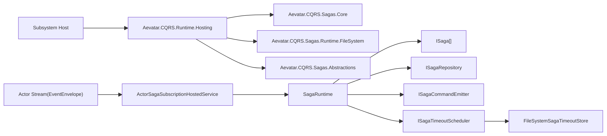
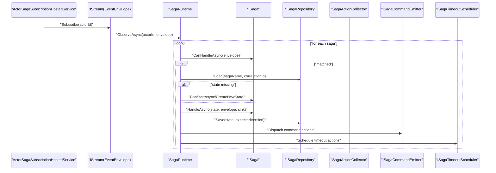
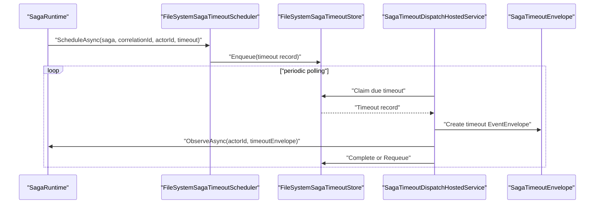

# Aevatar SAGA 架构文档

## 1. 目标与范围

本文档定义 Aevatar 当前 **框架级 Saga 能力** 的标准架构与实现边界，适用于：

1. 跨 Actor / 跨子系统的长事务编排。
2. 需要超时、补偿、延迟命令、重试控制的流程。
3. 以 `CorrelationId` 串联事件链路。

不在范围内：

1. 普通执行状态看板与查询（应由 Projection / ReadModel 负责）。
2. 业务子系统内“纯状态追踪型 Saga”（当前已移除）。

## 2. 架构定位

当前仅保留以下 Saga 项目：

1. `src/Aevatar.CQRS.Sagas.Abstractions`
2. `src/Aevatar.CQRS.Sagas.Core`
3. `src/Aevatar.CQRS.Sagas.Runtime.FileSystem`

业务侧 `Workflow/Maker/Platform` 不再内置追踪型 Saga，实现边界为：

1. `Saga` 只负责流程编排。
2. `Projection` 负责读模型与查询。

## 3. 总体组件图

## 4. 核心抽象（Abstractions）

关键契约：

1. `ISaga`：定义 `CanHandle/CanStart/Handle`，承载流程状态机。
2. `ISagaState`：最小状态契约（`SagaId/CorrelationId/Version/IsCompleted/UpdatedAt`）。
3. `ISagaRuntime`：统一事件观察入口（`ObserveAsync(actorId, envelope)`）。
4. `ISagaRepository`：状态持久化抽象。
5. `ISagaCommandEmitter`：Saga 产生命令副作用抽象。
6. `ISagaTimeoutScheduler`：Saga 超时调度抽象。
7. `ISagaCorrelationResolver`：相关性键解析策略（默认取 `EventEnvelope.CorrelationId`）。

## 5. 运行时处理链路

处理要点：

1. 先持久化状态，再分发动作（避免状态与副作用顺序反转）。
2. 状态保存使用乐观并发（`expectedVersion`），冲突按 `ConcurrencyRetryAttempts` 重试。
3. `MaxActionsPerEvent` 限制单事件动作数量，防止失控扇出。

## 6. 动作模型

Saga 可产生四类动作：

1. `SagaEnqueueCommandAction`：立即发命令。
2. `SagaScheduleCommandAction`：延迟命令（有 `ICommandScheduler` 时优先调度）。
3. `SagaScheduleTimeoutAction`：注册超时。
4. `SagaCompleteAction`：标记流程完成。

## 7. 超时子系统

实现说明：

1. 超时事件 payload 为 `Struct`，类型标记 `saga.timeout`。
2. `actorId/sagaName/timeoutName` 放在 payload 字段，不写入业务 metadata。
3. 超时处理失败可重入队重试。

## 8. 一致性、并发与幂等

1. 一致性模型：最终一致。
2. 并发控制：`sagaName + correlationId` 的乐观并发版本检查。
3. 处理语义：至少一次（需要业务 Saga 自身幂等）。
4. 失败恢复：状态与超时记录落盘后可恢复。

## 9. CorrelationId 与 Metadata 规范

1. `CorrelationId` 是 Saga 关联主键，来源于 `EventEnvelope.CorrelationId`。
2. `metadata` 是透传/诊断通道，不承载核心业务状态。
3. Saga 业务状态必须写入 `ISagaState`，超时语义写入 timeout payload。

## 10. 配置基线（`Cqrs:Sagas`）

核心配置项：

1. `Enabled`：是否启用 Saga Runtime。
2. `WorkingDirectory`：状态与超时文件根目录（默认 `artifacts/cqrs/sagas`）。
3. `ActorScanIntervalMs`：无生命周期通知时的 actor 扫描周期。
4. `ConcurrencyRetryAttempts`：并发冲突重试次数。
5. `TimeoutDispatchIntervalMs`：超时轮询周期。
6. `TimeoutDispatchBatchSize`：单轮超时处理上限。
7. `MaxActionsPerEvent`：单事件动作上限。

## 11. 扩展指南

可替换点：

1. 自定义 `ISagaRepository`（例如分布式存储）。
2. 自定义 `ISagaTimeoutScheduler`（例如外部任务系统）。
3. 自定义 `ISagaCorrelationResolver`（按业务规则提取关联键）。
4. 注册业务编排 Saga：`services.AddSaga<TSaga>()`。

约束：

1. 不在 Host/API 中硬编码 Saga 编排逻辑。
2. 不让 SagaState 承担 ReadModel 字段。
3. 不在业务子系统中恢复“追踪型 Saga 双写”。

## 12. 观测与测试建议

建议最小观测指标：

1. `saga_observe_total`（按 sagaName、结果分组）。
2. `saga_concurrency_conflict_total`。
3. `saga_timeout_dispatch_total` / `saga_timeout_requeue_total`。
4. `saga_action_dispatch_total`（按 actionType 分组）。

测试基线：

1. 单元：`SagaRuntime` 状态迁移 + 动作分发。
2. 集成：Wolverine / MassTransit 一致性行为测试。
3. 故障：并发冲突、超时重投、进程重启恢复。

## 13. 采用准则（何时上 Saga）

满足以下条件才引入 Saga：

1. 跨边界流程（跨 Actor/跨子系统）。
2. 需要等待、超时、补偿、重试中的至少一项。
3. 仅靠 Projection 无法表达流程控制。

否则优先：

1. Actor 内状态机（写侧）。
2. Projection / ReadModel（读侧）。

## 14. Actor-First 实践结论（当前推荐）

基于当前仓库架构，默认采用 **Actor-first**：

1. 复杂业务流程优先放在 `WorkflowActor`（或对应业务 Actor）内部处理。
2. 跨 Actor 协作优先用事件链路串联，不强制引入 Saga。
3. 超时优先用“定时触发事件回投 Actor”处理，不在会话内临时状态机中处理。
4. 全链路透传同一个 `CorrelationId`，用于关联查询与诊断。
5. 流程追踪与展示由 Projection 负责，不让 SagaState 承担看板职责。

对应策略：

1. 默认不启用业务 Saga。
2. 框架保留 Saga 能力作为可选编排能力。
3. 出现真实跨边界补偿复杂度后再引入 Saga。

## 15. 未来需要 Saga 的典型场景（示例）

示例：企业采购流程（跨子系统补偿）

1. `WorkflowActor` 触发 `预算Actor` 预占预算（成功）。
2. 触发 `供应商Actor` 下单（成功）。
3. 触发 `物流Actor` 建单（失败且重试后仍失败）。
4. 系统必须按业务顺序补偿：
   - 取消供应商订单
   - 释放预算占用

此时 Saga 的价值在于：

1. 统一记录流程阶段与失败点。
2. 统一驱动补偿顺序与重试策略。
3. 让跨子系统补偿逻辑不分散到多个 Actor 中。
