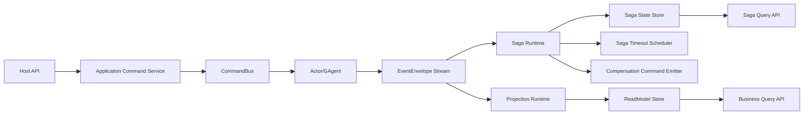
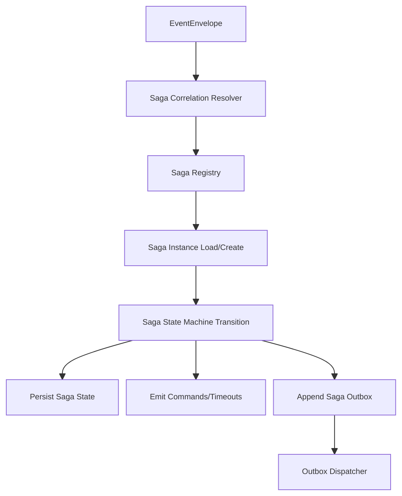

# Aevatar SAGA 引入分析报告

## 1. 目标
本报告基于当前仓库实现，评估与 SAGA 最佳实践的差距，并给出可执行的引入方案。
目标是把“长事务编排、补偿、超时、恢复”从业务散点逻辑收敛为统一的通用能力，且不破坏现有 `EventEnvelope` 驱动模型。

## 2. 审计范围
本次审计覆盖：

1. Foundation 事件传播与 Actor Stream：`src/Aevatar.Foundation.*`
2. CQRS 命令运行时与持久化：`src/Aevatar.CQRS.Runtime.*`
3. 通用投影内核：`src/Aevatar.CQRS.Projection.*`
4. Workflow 子系统：`src/workflow/*`
5. Maker 与 Platform 子系统：`src/maker/*`、`src/Aevatar.Platform.*`

## 3. 当前能力盘点（已有基础）

1. 已有关联链路基础：`EventEnvelope.correlation_id` + `metadata["trace.causation_id"]` 自动传播。
2. 已有命令执行韧性组件：`IInboxStore`、`IOutboxStore`、`IDeadLetterStore`、重试执行器。
3. 已有统一投影链路：`IProjectionLifecycleService` + `IProjectionSubscriptionRegistry` + `IProjectionCoordinator`。
4. 已有并行 CQRS 运行时实现：Wolverine / MassTransit。

结论：仓库已具备 SAGA 所需 60% 底座，但缺少“Saga 抽象 + 持久化状态机 + 统一调度/补偿”核心层。

## 4. 与 SAGA 最佳实践的差距（关键问题）

### P0（必须先解决）

1. 缺少 Saga 抽象层与运行时（无 `ISaga`/`ISagaRepository`/`ISagaRuntime`）。
2. 长流程状态散落在业务内存结构：
   - `WorkflowLoopModule._executionActive`
   - `ParallelFanOutModule` 多个字典
   - `MakerRunApplicationService` 的会话级 `TaskCompletionSource`
3. 缺少 Saga 持久化恢复：进程重启后无法恢复长事务编排状态。
4. `IOutboxStore` 当前仅追加，缺少统一 Outbox Dispatcher 闭环。

### P1（企业级必要）

1. 缺少补偿命令模型（Compensate/Undo 语义未标准化）。
2. 超时调度语义不一致：MassTransit 路径当前是 `Task.Delay`，非持久化调度。
3. 缺少按 `correlation_id` 的 Saga 查询模型（状态、步骤、失败原因、重试轨迹）。

### P2（可演进）

1. 缺少 Saga DSL/定义注册机制（目前主要靠代码硬写分支）。
2. 缺少跨子系统统一 Saga 契约测试（Wolverine/MassTransit 一致性）。

## 5. 目标架构（引入 SAGA 后）

## 6. 引入原则（严格对齐最佳实践）

1. `Aevatar.CQRS.Sagas.*` 只承载通用抽象，不出现 Workflow/Maker 业务语义。
2. Saga 关联键统一基于 `correlation_id`（必要时辅以业务键解析器），不依赖会话内临时对象。
3. 所有 Saga 状态迁移必须可持久化、可重放、可幂等。
4. 补偿动作只能通过命令/事件显式表达，禁止在 Host/API 中硬编码回滚分支。
5. 保持 OCP：新增 Saga 只需“新增实现 + 注册”，不改内核分发代码。

## 7. 分阶段落地计划

### Phase 1：抽象层与默认实现

1. 新增项目：
   - `src/Aevatar.CQRS.Sagas.Abstractions`
   - `src/Aevatar.CQRS.Sagas.Core`
   - `src/Aevatar.CQRS.Sagas.Runtime.FileSystem`
2. 定义核心契约：`ISaga`、`ISagaState`、`ISagaRepository`、`ISagaCorrelationResolver`、`ISagaRuntime`、`ISagaTimeoutScheduler`。
3. 复用现有 FileSystem 基础实现默认持久化。

### Phase 2：运行时接入与基础编排

1. 在 `Aevatar.CQRS.Runtime.Hosting` 增加统一 `AddAevatarCqrsSagas(...)` 接入点。
2. 打通 EventEnvelope -> SagaRuntime 的统一订阅入口。
3. 落地 Outbox Dispatcher（补齐 append->dispatch 闭环）。

### Phase 3：子系统迁移（先 Workflow，再 Maker/Platform）

1. 将 Workflow 中跨步骤长事务控制迁到 Saga（保留 Actor 领域处理，移除跨流程状态硬编码）。
2. Maker 运行收尾从会话内 `TaskCompletionSource` 迁到 Saga 状态机。
3. Platform 命令跨子系统调用纳入 Saga 状态追踪与补偿策略。

### Phase 4：可观测性与门禁

1. 增加 Saga 查询 API（按 `saga_id/correlation_id`）。
2. 增加契约测试：Wolverine 与 MassTransit 行为一致。
3. CI 门禁：禁止在 Host/Application 中新增 Saga 编排硬编码。

## 8. 风险与建议

1. 风险：一次性替换会影响 Workflow/Maker 运行路径，建议按子系统分批迁移。
2. 风险：调度语义差异（Wolverine vs MassTransit）会影响超时一致性，需先建立统一契约测试。
3. 建议：先实现通用 Saga Core，再迁业务；避免再次出现“面向 Workflow 编程”的耦合。

## 9. 结论
当前架构已具备事件驱动与 CQRS 基础，但尚未达到企业级 SAGA 标准。建议按本报告四阶段引入 `Aevatar.CQRS.Sagas.*`，把长事务编排、补偿、超时、恢复统一上移到框架层，再逐步清理 Workflow/Maker/Platform 中的分散编排逻辑。

## 10. 本次实施结果（2026-02-19）

已完成：

1. 新增通用项目：
   - `src/Aevatar.CQRS.Sagas.Abstractions`
   - `src/Aevatar.CQRS.Sagas.Core`
   - `src/Aevatar.CQRS.Sagas.Runtime.FileSystem`
2. `Aevatar.CQRS.Runtime.Hosting` 已统一接入 Saga Runtime（订阅、状态持久化、动作分发接口）。
3. 新增 `src/workflow/Aevatar.Workflow.Sagas`：
   - `WorkflowExecutionSaga`
   - `WorkflowExecutionSagaState`
   - `IWorkflowExecutionSagaQueryService`
4. Workflow Host 新增查询端点：
   - `GET /api/sagas/workflow`
   - `GET /api/sagas/workflow/{correlationId}`
5. Saga Runtime 并发控制升级为“存储层乐观并发 + 重试”，不再依赖进程内互斥锁。
6. 落地持久化超时调度：
   - `FileSystemSagaTimeoutScheduler`
   - `SagaTimeoutDispatchHostedService`
7. 落地 Outbox 派发闭环：
   - `OutboxDispatchHostedService`
   - `IOutboxMessageDispatcher`
8. Saga 订阅机制升级为流生命周期回调优先（`IStreamLifecycleNotifier`），降低定时扫描窗口。
9. Maker 子系统新增 `Aevatar.Maker.Sagas`，并新增端点：
   - `GET /api/maker/sagas`
   - `GET /api/maker/sagas/{correlationId}`
10. Platform 子系统新增 `Aevatar.Platform.Sagas`，并新增端点：
   - `GET /api/sagas/platform`
   - `GET /api/sagas/platform/{commandId}`
11. 新增双运行时一致性测试：
   - `test/Aevatar.Integration.Tests/CqrsRuntimeSagaConsistencyTests.cs`
   - 覆盖 `Wolverine` / `MassTransit` 两条路径
12. 完成全量 `dotnet build aevatar.slnx` 与 `dotnet test aevatar.slnx` 通过验证。

结论：本报告列出的核心缺口已在当前实现中补齐，SAGA 能力已形成可运行、可查询、可恢复、可测试的一致基线。
