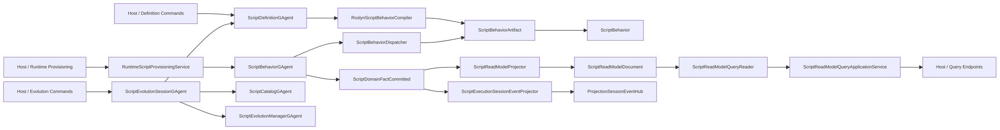

# Aevatar.Scripting 架构文档

## 1. 文档元信息

- 文档状态：`Active`
- 文档版本：`v13`
- 更新时间：`2026-03-14`
- 适用范围：`src/Aevatar.Scripting.*` 与相关 `test/Aevatar.Scripting.*` / `test/Aevatar.Integration.Tests`
- 非范围：`Aevatar.Foundation.*` 的内部 runtime 实现细节；本文只说明当前生效的 scripting 主链与文档入口

## 2. 文档优先级与阅读入口

当前应按以下顺序阅读：

1. 当前实现收口：
   - `docs/architecture/2026-03-14-scripting-gagent-behavior-parity-implementation-closeout.md`
2. 当前 typed authoring 设计：
   - `docs/architecture/2026-03-14-scripting-typed-authoring-surface-detailed-design.md`
3. 后续定义源与原生物化提案：
   - `docs/architecture/2026-03-14-scripting-native-readmodel-materialization-detailed-design.md`
   - `docs/architecture/2026-03-14-scripting-protobuf-definition-source-detailed-design.md`
4. 本文：
   - 作为 scripting 总览与文档索引，帮助快速定位当前主链

以下文档保留为历史设计留痕，不再作为当前实现依据：

1. `docs/architecture/2026-03-13-scripting-gagent-behavior-parity-refactor-blueprint.md`
2. `docs/architecture/2026-03-13-scripting-gagent-behavior-parity-detailed-design.md`

若本文与 `implementation-closeout` 发生冲突，以 `implementation-closeout` 和实际代码为准。

上面两份 `2026-03-14` 提案文档讨论的是后续方向，不代表当前代码已经切到 `script package(cs + proto)`。它们的编译模型明确是“definition/provisioning 阶段的动态包编译”，不是解决方案构建期静态预编译。

## 3. 当前结论

`Aevatar.Scripting` 当前已经不是 `ScriptRuntimeGAgent + IScriptPackageRuntime + payload bag read model` 架构。

当前生效主链是：

1. 脚本作者以 `ScriptBehavior<TState,TReadModel>` 编写强类型行为。
2. 定义侧把脚本编译为 `ScriptBehaviorDescriptor + ScriptGAgentContract`。
3. 运行侧由 `ScriptBehaviorGAgent` 宿主脚本行为，并提交 `ScriptDomainFactCommitted`。
4. 读侧由 `ScriptReadModelProjector` 基于 committed fact 构建 `ScriptReadModelDocument`。
5. 查询通过 `ScriptReadModelQueryReader -> ScriptReadModelQueryApplicationService` 对外暴露。
6. 演化链继续由 `ScriptEvolutionSessionGAgent / ScriptEvolutionManagerGAgent / ScriptCatalogGAgent` 承担治理与索引职责。

## 4. 当前生效架构

## 5. 当前核心对象

### 5.1 脚本 authoring surface

脚本作者默认面对的是强类型 API，而不是 `Any`：

1. `ScriptBehavior<TState,TReadModel>`
2. `IScriptBehaviorBuilder<TState,TReadModel>`
3. `ScriptCommandContext<TState>`
4. `ScriptQueryContext<TReadModel>`
5. `ScriptFactContext`

`Any` 只保留在宿主边界、持久化边界和跨 actor/query 边界。

### 5.2 写侧权威事实

写侧权威事实是 `ScriptDomainFactCommitted`。

这意味着：

1. committed fact 不再携带 `state_payloads / read_model_payloads` 快照式 bag。
2. projection 只消费 committed fact，不再依赖 write-side 复制读模型快照。

### 5.3 读侧权威模型

当前 persisted read model root 是 `ScriptReadModelDocument`。

它仍是容器式 document root，但已经是正式、一等的 read-side 模型，不再是临时 `Dictionary<string, Any>` bag。

### 5.4 演化治理

当前演化链路保持 actor-owned 治理：

1. `ScriptEvolutionSessionGAgent` 负责 proposal execution
2. `ScriptEvolutionManagerGAgent` 负责长期索引与治理镜像
3. `ScriptCatalogGAgent` 负责激活 revision 与回滚历史
4. `ScriptDefinitionGAgent` 负责定义、编译结果与 contract 快照

## 6. 已删除的旧主链

以下对象已经从 scripting 主链删除，不应再出现在新文档或新设计里：

1. `IScriptPackageRuntime`
2. `ScriptRuntimeGAgent`
3. `ScriptRuntimeExecutionOrchestrator`
4. `ScriptExecutionReadModel`
5. `ScriptRunDomainEventCommitted.state_payloads`
6. `ScriptRunDomainEventCommitted.read_model_payloads`
7. 直接用 projection store 直读替代正式 query facade 的做法

## 7. 模块分层映射

| 分层 | 项目 | 当前职责 |
|---|---|---|
| Abstractions | `Aevatar.Scripting.Abstractions` | Proto 契约、typed authoring surface、descriptor/contract 模型 |
| Core | `Aevatar.Scripting.Core` | `ScriptBehaviorGAgent`、definition/catalog/evolution actors、核心状态机 |
| Application | `Aevatar.Scripting.Application` | 运行 dispatch、命令/查询应用服务、interaction 组合 |
| Infrastructure | `Aevatar.Scripting.Infrastructure` | Roslyn 编译、artifact loader、端口实现 |
| Projection | `Aevatar.Scripting.Projection` | committed fact 投影、execution live sink、read model 查询实现 |
| Hosting | `Aevatar.Scripting.Hosting` | DI 组装、Host API、JSON/protobuf 边界适配 |

依赖方向仍然满足：

1. 上层依赖抽象，不反向依赖具体 Infrastructure。
2. CQRS/AGUI 继续复用统一 Projection Pipeline。
3. Actor 运行态与 session 生命周期不在中间层用进程内字典持有事实状态。

## 8. 当前治理约束

1. 写侧必须继续基于 actor + event sourcing，不回退为 process-local runner。
2. query 只读 read model，不回退到 runtime actor 内部状态直读。
3. 运行期 `publish/send/self-signal/durable-timeout` 语义必须保持 runtime-neutral。
4. 影响业务语义、控制流、稳定读取的数据必须强类型建模，不重新退回 bag。
5. Scripting 与 Workflow/CQRS Core 继续共享统一 envelope / projection 主链，不引入第二套 read-side pipeline。

## 9. 历史文档整理结论

这轮整理后，文档应按以下心智模型理解：

1. `2026-03-14-*` scripting 文档：当前有效
2. `2026-03-13-*` scripting 文档：历史设计基线
3. 本文：总览入口，不再复述已经删除的旧运行链
