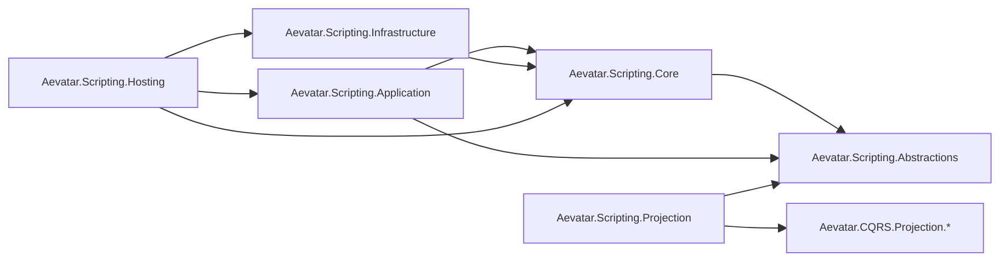
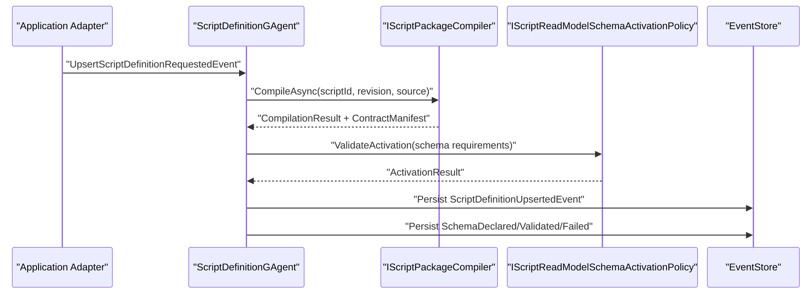
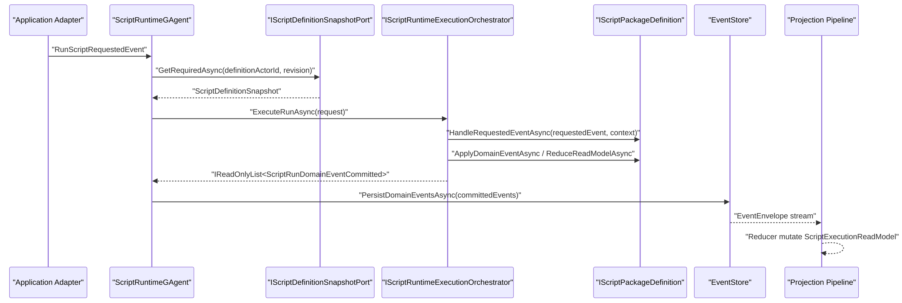

# Aevatar.Scripting 架构文档

## 1. 文档元信息

- 文档状态：`Active`
- 文档版本：`v1`
- 更新时间：`2026-03-02`
- 适用范围：`src/Aevatar.Scripting.*` 与其在 Runtime/CQRS 中的集成边界
- 读者对象：Scripting、Workflow、CQRS、Hosting 维护者

## 2. 目标与定位

`Aevatar.Scripting` 是 Aevatar 的脚本能力子系统，目标是让“脚本定义”和“脚本执行”在 Actor 语义内稳定运行，并通过统一 Projection 链路输出 ReadModel。

核心定位：

1. 使用 C# 脚本实现可编译、可执行、可投影的运行逻辑。
2. 保持 `Command -> Event -> Projection -> ReadModel` 单主链路。
3. 用端口抽象隔离 Runtime/IO 细节，避免 Core 绑定具体宿主实现。
4. 严格遵循 Actor 单线程事实源，不在中间层维护跨请求事实态。

## 3. 架构硬约束

1. 严格分层：`Abstractions / Core / Application / Infrastructure / Hosting / Projection`。
2. Core 只依赖抽象与领域语义，不依赖具体运行时实现。
3. Runtime 事实状态只能由 Actor 状态推进，不允许中间层 `Dictionary<id, context>` 事实态。
4. CQRS 与 AGUI 必须走统一 Projection Pipeline，不允许 scripting 双轨投影。
5. 无业务价值中间层必须删除，不保留兼容空壳。

## 4. 分层与项目映射

| 分层 | 项目 | 职责 |
|---|---|---|
| Abstractions | `Aevatar.Scripting.Abstractions` | proto 契约、脚本接口、执行上下文、能力接口 |
| Domain/Core | `Aevatar.Scripting.Core` | `ScriptDefinitionGAgent`、`ScriptRuntimeGAgent`、核心端口与领域规则 |
| Application | `Aevatar.Scripting.Application` | 命令适配、运行编排器、AI 能力组合策略 |
| Infrastructure | `Aevatar.Scripting.Infrastructure` | Roslyn 编译/执行、沙箱策略、元数据解析 |
| Hosting | `Aevatar.Scripting.Hosting` | DI 装配、Runtime 端口实现、能力接入扩展 |
| Projection | `Aevatar.Scripting.Projection` | projector/reducer/readmodel，接入 CQRS Runtime 抽象 |

依赖方向图：

## 5. 核心领域对象

### 5.1 ScriptDefinitionGAgent

文件：`src/Aevatar.Scripting.Core/ScriptDefinitionGAgent.cs`

职责：

1. 接收 `UpsertScriptDefinitionRequestedEvent`。
2. 调用 `IScriptPackageCompiler` 编译脚本并提取契约。
3. 提取并验证 ReadModel Schema 能力。
4. 持久化定义事件与 schema 事件。
5. 维护 `ScriptDefinitionState`（revision/source/schema 状态）。

状态推进事件：

1. `ScriptDefinitionUpsertedEvent`
2. `ScriptReadModelSchemaDeclaredEvent`
3. `ScriptReadModelSchemaValidatedEvent`
4. `ScriptReadModelSchemaActivationFailedEvent`

### 5.2 ScriptRuntimeGAgent

文件：`src/Aevatar.Scripting.Core/ScriptRuntimeGAgent.cs`

职责：

1. 接收 `RunScriptRequestedEvent`。
2. 通过 `IScriptDefinitionSnapshotPort` 拉取定义快照。
3. 调用 `IScriptRuntimeExecutionOrchestrator` 生成 committed domain events。
4. 持久化 `ScriptRunDomainEventCommitted` 事件流。
5. 维护 `ScriptRuntimeState`（state/readmodel payload 与 schema 对账信息）。

## 6. 契约模型与事件模型

proto 文件：`src/Aevatar.Scripting.Abstractions/script_host_messages.proto`

关键状态：

1. `ScriptDefinitionState`
2. `ScriptRuntimeState`

关键命令事件：

1. `UpsertScriptDefinitionRequestedEvent`
2. `RunScriptRequestedEvent`

关键领域事件：

1. `ScriptDefinitionUpsertedEvent`
2. `ScriptReadModelSchemaDeclaredEvent`
3. `ScriptReadModelSchemaValidatedEvent`
4. `ScriptReadModelSchemaActivationFailedEvent`
5. `ScriptRunDomainEventCommitted`

脚本运行抽象：

1. `IScriptPackageRuntime`
2. `IScriptPackageDefinition`
3. `IScriptContractProvider`
4. `ScriptExecutionContext`
5. `IScriptRuntimeCapabilities`

## 7. 端口与依赖反转

Core 端口（由 Hosting 提供实现）：

1. `IScriptDefinitionSnapshotPort`
2. `IGAgentEventRoutingPort`
3. `IGAgentInvocationPort`
4. `IGAgentFactoryPort`

编译与策略端口：

1. `IScriptPackageCompiler`
2. `IScriptExecutionEngine`
3. `IScriptReadModelSchemaActivationPolicy`

运行编排端口：

1. `IScriptRuntimeExecutionOrchestrator`

关键点：

1. Actor 已完全改为构造注入，不使用 `Services.GetService(...)`。
2. `ScriptRuntimeExecutionRequest` 不再透传 `IServiceProvider`。
3. Application 层已删除冗余 capability factory，运行能力直接按端口组合。

## 8. Application 编排

### 8.1 命令适配

1. `UpsertScriptDefinitionCommandAdapter` 将命令映射到 `UpsertScriptDefinitionRequestedEvent`。
2. `RunScriptCommandAdapter` 将命令映射到 `RunScriptRequestedEvent`。
3. 适配器只负责宿主协议输入到领域事件输入，不承载业务流程。

### 8.2 运行编排器

文件：`src/Aevatar.Scripting.Application/Runtime/ScriptRuntimeExecutionOrchestrator.cs`

流程：

1. 编译脚本定义（按 snapshot source）。
2. 构建 `ScriptExecutionContext`（状态、输入、能力端口）。
3. 调用脚本 `HandleRequestedEventAsync` 产生 domain decisions。
4. 循环调用脚本 `ApplyDomainEventAsync` 与 `ReduceReadModelAsync`。
5. 生成 `ScriptRunDomainEventCommitted` 列表返回 Runtime Actor 持久化。

默认行为：

1. 若脚本未返回任何 domain event，系统补一条 `script.run.completed`。

## 9. Infrastructure（Roslyn + Sandbox）

### 9.1 编译与契约提取

文件：`src/Aevatar.Scripting.Infrastructure/Compilation/RoslynScriptPackageCompiler.cs`

步骤：

1. 参数校验（scriptId/revision/source）。
2. 沙箱规则校验。
3. 语法与语义编译校验。
4. 强制脚本实现 `IScriptPackageRuntime`。
5. 提取 `ScriptContractManifest`。

契约提取优先级：

1. 优先 `IScriptContractProvider.ContractManifest`。
2. 回退到源码注释 `contract.*` 元数据。

### 9.2 脚本执行引擎

文件：`src/Aevatar.Scripting.Infrastructure/Compilation/RoslynScriptExecutionEngine.cs`

特点：

1. 按调用动态编译并加载到 collectible `AssemblyLoadContext`。
2. 查找脚本 runtime 类型并实例化执行。
3. 执行结束即释放 load context。

### 9.3 沙箱规则

文件：`src/Aevatar.Scripting.Infrastructure/Compilation/ScriptSandboxPolicy.cs`

默认禁止：

1. 并发与线程 API：`Task.Run`、`new Thread`、`new Timer`、`lock`。
2. 文件与 IO API：`File.*`、`Directory.*`、`System.IO`。
3. 反射与动态装载 API。
4. 直接网络访问 API：`HttpClient`、`WebRequest`、`Socket`。

## 10. Hosting 装配与外部适配

文件：`src/Aevatar.Scripting.Hosting/DependencyInjection/ServiceCollectionExtensions.cs`

`AddScriptCapability()` 注册内容：

1. 编译执行：`ScriptSandboxPolicy`、`IScriptExecutionEngine`、`IScriptPackageCompiler`。
2. 运行编排：`IScriptRuntimeExecutionOrchestrator`。
3. 核心端口实现：snapshot/event routing/invocation/factory。
4. schema 激活策略：`IScriptReadModelSchemaActivationPolicy`。
5. AI 能力：优先 `IRoleAgentPort` 委托，否则 `NoopAICapability`。

说明：

1. `IRoleAgentPort` 是可选外部能力，不再是 scripting 主链路硬依赖。
2. 端口实现全部放在 Hosting，Core 保持无宿主细节。

## 11. Projection 架构

文件：

1. `src/Aevatar.Scripting.Projection/Projectors/ScriptExecutionReadModelProjector.cs`
2. `src/Aevatar.Scripting.Projection/Reducers/ScriptRunDomainEventCommittedReducer.cs`
3. `src/Aevatar.Scripting.Projection/ReadModels/ScriptExecutionReadModel.cs`

机制：

1. Projector 按 `payload.TypeUrl` 路由到 reducer 列表。
2. reducer 将 `ScriptRunDomainEventCommitted` 映射到 `ScriptExecutionReadModel`。
3. 投影通过 `IProjectionStoreDispatcher` 落库，复用 CQRS Runtime 抽象。

ReadModel 核心字段：

1. `ScriptId`、`DefinitionActorId`、`Revision`。
2. `StatePayloads`、`ReadModelPayloads`。
3. `ReadModelSchemaVersion`、`ReadModelSchemaHash`。
4. `LastRunId`、`LastEventType`、`StateVersion`、`UpdatedAt`。

## 12. 关键链路时序

### 12.1 定义上载链路（Upsert）

### 12.2 运行执行链路（Run）

### 12.3 投影统一链路（Scripting 与 CQRS）

```mermaid
%%{init: {"maxTextSize": 100000, "flowchart": {"useMaxWidth": false, "nodeSpacing": 10, "rankSpacing": 50}, "themeVariables": {"fontSize": "10px"}}}%%
flowchart LR
    EV["ScriptRunDomainEventCommitted"] --> PP["Projection Pipeline Entry"]
    PP --> PJ["ScriptExecutionReadModelProjector"]
    PJ --> RD["ScriptRunDomainEventCommittedReducer"]
    RD --> RM["ScriptExecutionReadModel"]
    RM --> ST["Projection Store Dispatcher"]
```

## 13. 一致性与并发模型

1. Actor 运行态只通过事件处理路径变更。
2. 不在中间层持有 `run/session/actor` 跨请求事实映射。
3. snapshot 读取由端口抽象提供，revision 不匹配直接失败。
4. 运行态 `StatePayloads/ReadModelPayloads` 始终以 committed 事件为事实源。

## 14. 错误语义与失败处理

1. 定义编译失败：`ScriptDefinitionGAgent` 抛出 `InvalidOperationException`，不写入成功定义事件。
2. schema 能力不足：写入 `ScriptReadModelSchemaActivationFailedEvent`，状态标记 `activation_failed`。
3. 运行找不到定义 actor 或 revision 不匹配：snapshot 端口直接失败。
4. 运行编译失败：orchestrator 失败，runtime 不提交 committed 事件。

## 15. 测试与质量门禁

测试项目：

1. `test/Aevatar.Scripting.Core.Tests`
2. `test/Aevatar.Integration.Tests`（含 scripting 端到端路径）

建议回归命令：

1. `dotnet build aevatar.slnx --nologo`
2. `dotnet test test/Aevatar.Scripting.Core.Tests/Aevatar.Scripting.Core.Tests.csproj --nologo`
3. `dotnet test test/Aevatar.Integration.Tests/Aevatar.Integration.Tests.csproj --nologo`
4. `bash tools/ci/architecture_guards.sh`
5. `bash tools/ci/solution_split_guards.sh`
6. `bash tools/ci/solution_split_test_guards.sh`

## 16. 扩展指南

新增脚本能力扩展时，按以下顺序执行：

1. 在 `Abstractions` 增加稳定契约或上下文字段。
2. 在 `Core` 增加端口抽象，不引入宿主实现。
3. 在 `Application` 做编排组合，不直连基础设施细节。
4. 在 `Hosting` 提供端口实现与 DI 注册。
5. 在 `Projection` 增加 reducer/projector，复用统一 pipeline。
6. 补齐单测与集成测试，并通过 CI 守卫。

## 17. 已知限制与后续演进

1. 当前执行引擎是“按调用动态编译”，高吞吐场景会有额外编译开销。
2. 后续可在 Application 层引入“可替换的编译结果缓存端口”，前提是不破坏 Actor 事实源与中间层状态约束。
3. 若引入分布式快照缓存，必须由 Actor 持久态或分布式状态服务承载，不允许进程内事实缓存。

## 18. 关键文件索引

1. `src/Aevatar.Scripting.Abstractions/script_host_messages.proto`
2. `src/Aevatar.Scripting.Core/ScriptDefinitionGAgent.cs`
3. `src/Aevatar.Scripting.Core/ScriptRuntimeGAgent.cs`
4. `src/Aevatar.Scripting.Application/Runtime/ScriptRuntimeExecutionOrchestrator.cs`
5. `src/Aevatar.Scripting.Infrastructure/Compilation/RoslynScriptPackageCompiler.cs`
6. `src/Aevatar.Scripting.Infrastructure/Compilation/RoslynScriptExecutionEngine.cs`
7. `src/Aevatar.Scripting.Hosting/DependencyInjection/ServiceCollectionExtensions.cs`
8. `src/Aevatar.Scripting.Projection/Projectors/ScriptExecutionReadModelProjector.cs`
9. `src/Aevatar.Scripting.Projection/Reducers/ScriptRunDomainEventCommittedReducer.cs`
