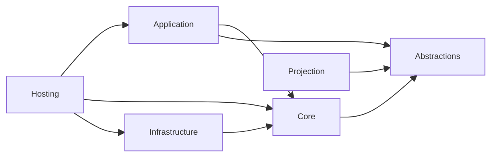
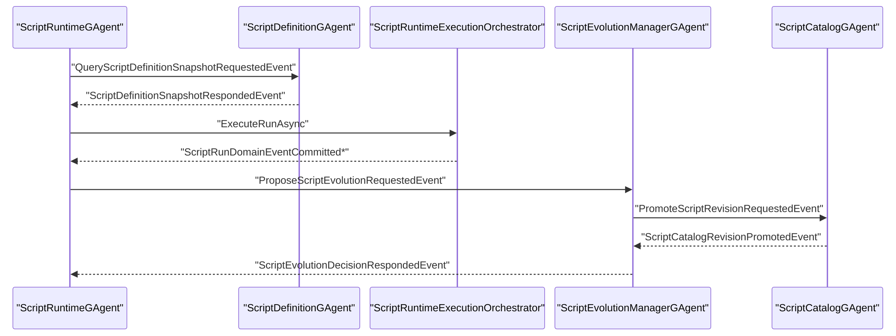

# Aevatar.Scripting 架构文档

## 1. 文档元信息

- 文档状态：`Active`
- 文档版本：`v8`
- 更新时间：`2026-03-07`
- 适用范围：`src/Aevatar.Scripting.*` 与 `test/Aevatar.Scripting.*` / `test/Aevatar.Integration.Tests` 的 Scripting 相关测试
- 非范围：`Aevatar.Foundation.*`（本轮无架构改动）

## 2. 目标与约束

`Aevatar.Scripting` 当前终态是 `Dual-Source Iteration`：

1. 外部更新（API/CI/Ops）可发起脚本演化。
2. 脚本运行时可自我演化（提案/发布/回滚）。
3. 两条入口共享同一演化治理主链路（`Propose -> Validate -> Promote/Rollback`）。
4. 运行期通信坚持纯事件模型：`EventEnvelope + Proto Event`，不依赖脚本侧转型读取目标 Grain 内部状态。
5. `Workflow YAML` 与 `Script` 当前是并行能力：两条链路可以共存、对照验证，但不宣称已完全替代。

强约束：

1. 事实源在 Actor 持久状态（`ScriptDefinitionState`/`ScriptRuntimeState`/`ScriptEvolutionManagerState`/`ScriptCatalogState`）。
2. 禁止中间层以进程内字典维护跨请求事实态。
3. 查询返回走事件响应，不走跨层强转接口。

## 3. 分层映射

| 分层 | 项目 | 核心职责 |
|---|---|---|
| Abstractions | `Aevatar.Scripting.Abstractions` | Proto 状态/事件契约、脚本运行抽象 |
| Core | `Aevatar.Scripting.Core` | 4 个主 Actor（Definition/Runtime/EvolutionManager/Catalog）与状态机 |
| Application | `Aevatar.Scripting.Application` | 命令/查询适配器，运行编排器 |
| Infrastructure | `Aevatar.Scripting.Infrastructure` | Roslyn 编译执行、运行时端口实现、查询超时与运行模式策略 |
| Hosting | `Aevatar.Scripting.Hosting` | DI 组装、Host API 接入 |
| Projection | `Aevatar.Scripting.Projection` | 执行与演化读模型投影 |

依赖方向：

## 4. 主干 Actor 与事实状态

### 4.1 ScriptDefinitionGAgent

- 文件：`src/Aevatar.Scripting.Core/ScriptDefinitionGAgent.cs`
- 状态：`ScriptDefinitionState`
- 职责：定义上载、编译与 schema 激活、Definition Query 响应。

### 4.2 ScriptRuntimeGAgent

- 文件：`src/Aevatar.Scripting.Core/ScriptRuntimeGAgent.cs`
- 状态：`ScriptRuntimeState`
- 职责：接收运行请求、加载定义快照、执行脚本并提交 `ScriptRunDomainEventCommitted`。
- Orleans 路径下使用“事件化 definition 查询 + `pending_definition_queries` 持久事实状态 + activation 恢复”避免同步阻塞与 reactivation 丢 run。

### 4.3 ScriptEvolutionManagerGAgent

- 文件：`src/Aevatar.Scripting.Core/ScriptEvolutionManagerGAgent.cs`
- 状态：`ScriptEvolutionManagerState`
- 职责：提案状态机推进，决策查询响应。

### 4.4 ScriptCatalogGAgent

- 文件：`src/Aevatar.Scripting.Core/ScriptCatalogGAgent.cs`
- 状态：`ScriptCatalogState`
- 职责：版本目录、激活 revision 指针、回滚历史与查询响应。

## 5. 协议与查询响应模型

Proto 契约定义在：`src/Aevatar.Scripting.Abstractions/script_host_messages.proto`。

新增查询事件组：

1. `QueryScriptDefinitionSnapshotRequestedEvent` / `ScriptDefinitionSnapshotRespondedEvent`
2. `QueryScriptCatalogEntryRequestedEvent` / `ScriptCatalogEntryRespondedEvent`
3. `QueryScriptEvolutionDecisionRequestedEvent` / `ScriptEvolutionDecisionRespondedEvent`

Application 查询适配器：

1. `QueryScriptDefinitionSnapshotRequestAdapter`
2. `QueryScriptCatalogEntryRequestAdapter`

Infrastructure 查询/生命周期端口：

1. `RuntimeScriptDefinitionSnapshotPort`
2. `RuntimeScriptLifecyclePort`

Core 响应处理要点：

1. Definition/Catalog/EvolutionManager 的 Query Handler 都在 Actor 内直接读取自身状态并返回响应事件。
2. Query Response 统一用 `EventPublisher.SendToAsync(..., sourceEnvelope: null)`，避免响应被 publisher chain 回路过滤。
3. Evolution 终态回推统一走 `Projection -> ProjectionSessionEventHub`，`ScriptEvolutionSessionGAgent` 不再直接向固定 stream 推送终态事件。

## 6. 运行与演化两条主链

### 6.1 运行链（Run）

`RunScriptRequestedEvent -> ScriptRuntimeGAgent -> ScriptRuntimeExecutionOrchestrator -> ScriptRunDomainEventCommitted*`

关键实现：

1. Orleans Runtime 下，`ScriptRuntimeGAgent` 先发 `QueryScriptDefinitionSnapshotRequestedEvent`，收到响应后再执行脚本。
2. 待处理 definition query 先写入 `ScriptRuntimeState.pending_definition_queries`，activation 时重建 timeout lease 并重发 query，保证 response/timeout 都能继续收敛。
3. 是否启用“Actor 内异步恢复执行”由 `Scripting:Runtime:UseEventDrivenDefinitionQuery` 显式配置；未配置时按 Runtime 类型判定（Orleans=`true`，Local=`false`）。

### 6.2 演化链（Evolution）

`ProposeScriptEvolutionRequestedEvent -> ScriptEvolutionManagerGAgent -> IScriptEvolutionFlowPort -> ScriptCatalog/Definition`

双入口合流：

1. 外部入口：Host API -> `IScriptEvolutionApplicationService`
2. 脚本入口：`IScriptRuntimeCapabilities.ProposeScriptEvolutionAsync`
3. 外部入口等待终态时走 `RuntimeScriptLifecyclePort` 的 `ensure projection -> attach sink -> dispatch -> wait -> detach/release` 链路。

两条入口在 Manager 状态机与 Catalog 事实层合流，保证策略、验证、发布、回滚语义一致。

### 6.3 与 Workflow YAML 的关系（当前结论）

1. Host 侧 `AddWorkflowCapabilityWithAIDefaults` 默认装配 workflow + script capability；可通过 `includeScriptCapability: false` 显式关闭 script capability。
2. Script 演化与 Workflow YAML 执行互不覆盖，属于并行能力，不改变 Workflow YAML 既有语义入口。
3. 迁移建议采用“同输入同输出”对照回归（见第 8 节新增 parity 测试）。

## 7. Orleans 3 节点一致性设计

### 7.1 跨 Silo 一致性策略

1. 查询通过 EventEnvelope + Stream Reply，不依赖对象强转跨 Silo 拉取内部状态。
2. Runtime Spawn 不再同步依赖 Definition Snapshot，避免在脚本执行线程内形成二次同步等待链路。
3. 测试端启用 `Microsoft.Orleans.Serialization.Protobuf`，保证 `EventEnvelope` 在测试集群序列化可用。

### 7.2 时序（Orleans 路径）

## 8. 测试覆盖

核心覆盖点：

1. 多脚本、多轮演化、动态临时 Runtime 与新脚本定义创建：
   `test/Aevatar.Integration.Tests/ScriptAutonomousEvolutionComprehensiveE2ETests.cs`
2. Orleans 3 Silo 一致性场景（外部提案 + 脚本编排 + 跨节点读写验证）：
   `test/Aevatar.Integration.Tests/ScriptAutonomousEvolutionOrleans3ClusterConsistencyTests.cs`
3. Runtime 回放契约与演化管理器单元测试：
   `test/Aevatar.Scripting.Core.Tests/Runtime/ScriptRuntimeGAgentReplayContractTests.cs`
   `test/Aevatar.Scripting.Core.Tests/Runtime/ScriptEvolutionManagerGAgentTests.cs`
4. YAML/Script 等价与迁移回归：
   `test/Aevatar.Integration.Tests/WorkflowYamlScriptParityTests.cs`

本次已执行验证（2026-03-02）：

1. `dotnet test test/Aevatar.Scripting.Core.Tests/Aevatar.Scripting.Core.Tests.csproj --nologo`：`58/58` 通过。
2. `dotnet test test/Aevatar.Integration.Tests/Aevatar.Integration.Tests.csproj --nologo --filter "FullyQualifiedName~ScriptAutonomousEvolutionE2ETests|FullyQualifiedName~ScriptAutonomousEvolutionComprehensiveE2ETests|FullyQualifiedName~ScriptAutonomousEvolutionOrleans3ClusterConsistencyTests"`：`6/6` 通过。
3. `bash tools/ci/test_stability_guards.sh`：通过。
4. `bash tools/ci/architecture_guards.sh`：通过。

## 9. 已知架构债务

1. `Scripting:Runtime:UseEventDrivenDefinitionQuery` 目前仍是单一布尔开关 + 运行时类型回退策略；后续可继续细化为按环境与运行时能力的多策略提供器。
2. Evolution Query 协议仍保留在契约层用于超时兜底查询；主链路终态回推统一走 `ScriptEvolutionSessionCompletedEventProjector -> ProjectionSessionEventHub(script-evolution:{sessionActorId}:{proposalId})`。
3. 超时常量已抽象为 `IScriptingPortTimeouts`，后续可按环境提供分层实现（如 dev/staging/prod 配置差异）。

## 10. 结论

当前 `Aevatar.Scripting` 已满足“外部更新 + 自我演化 + 纯事件通信 + Orleans 3 节点一致性运行”目标，且重构落点集中在 `Scripting` 子系统内部。对外结论统一为：`Script` 是 `Workflow YAML` 的并行能力（已具备等价对照与迁移回归验证），而非已完成替代。
