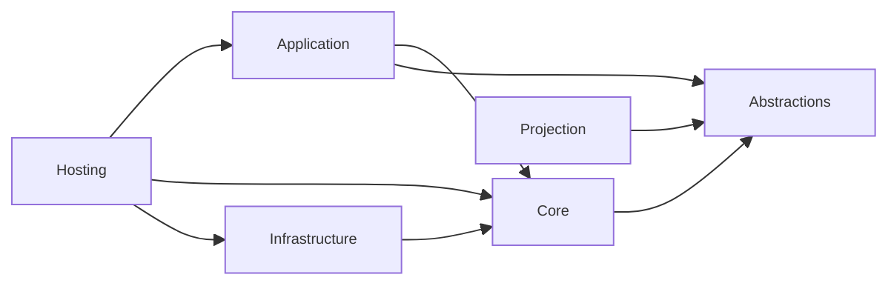
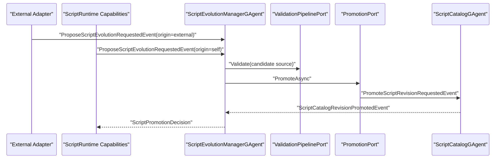

# Aevatar.Scripting 架构文档

## 1. 文档元信息

- 文档状态：`Active`
- 文档版本：`v4`
- 更新时间：`2026-03-02`
- 适用范围：`src/Aevatar.Scripting.*` 与其 Runtime/CQRS 集成边界

## 2. 终态目标

`Aevatar.Scripting` 目标终态是 `Dual-Source Iteration`（外部更新 + 自我演化）：

1. 外部入口可发起脚本升级提案并进入统一治理链路。
2. 脚本入口可在运行中发起自我演化提案并进入同一治理链路。
3. 升级发布通过统一事件链审计（EvolutionManager + Catalog + Projection），不存在直写旁路。
4. 两条入口在策略、验证、发布、回滚上的语义一致。

### 2.1 当前实现状态

1. 自我演化主链路已实现并验证。
2. 外部更新入口已实现为标准化 Host/API + Application Service，并复用同一演化主链路。

## 3. 分层与模块映射

| 分层 | 项目 | 核心职责 |
|---|---|---|
| Abstractions | `Aevatar.Scripting.Abstractions` | proto 状态/事件契约、脚本运行接口、演化模型 |
| Core | `Aevatar.Scripting.Core` | `ScriptDefinitionGAgent` / `ScriptRuntimeGAgent` / `ScriptEvolutionManagerGAgent` / `ScriptCatalogGAgent` |
| Application | `Aevatar.Scripting.Application` | 命令适配器、运行编排器 |
| Infrastructure | `Aevatar.Scripting.Infrastructure` | Roslyn 编译执行、沙箱策略 |
| Hosting | `Aevatar.Scripting.Hosting` | 端口实现、DI 装配、运行时接入 |
| Projection | `Aevatar.Scripting.Projection` | 脚本执行读模型 + 演化审计读模型 |

依赖方向：

## 4. 领域 Actor 主干

### 4.1 ScriptDefinitionGAgent

- 文件：`src/Aevatar.Scripting.Core/ScriptDefinitionGAgent.cs`
- 职责：脚本定义上载、编译校验、schema 声明与激活状态推进。
- 事实状态：`ScriptDefinitionState`。

### 4.2 ScriptRuntimeGAgent

- 文件：`src/Aevatar.Scripting.Core/ScriptRuntimeGAgent.cs`
- 职责：加载定义快照、执行脚本、提交 `ScriptRunDomainEventCommitted`。
- 事实状态：`ScriptRuntimeState`。

### 4.3 ScriptEvolutionManagerGAgent

- 文件：`src/Aevatar.Scripting.Core/ScriptEvolutionManagerGAgent.cs`
- 职责：提案生命周期状态机（Proposed -> Validated -> Promoted/Rejected）。
- 事实状态：`ScriptEvolutionManagerState`。

### 4.4 ScriptCatalogGAgent

- 文件：`src/Aevatar.Scripting.Core/ScriptCatalogGAgent.cs`
- 职责：脚本版本目录、激活 revision 指针、回滚指针。
- 事实状态：`ScriptCatalogState`。

## 5. 脚本能力接口（统一语义）

文件：`src/Aevatar.Scripting.Abstractions/Definitions/IScriptRuntimeCapabilities.cs`

保留执行期能力：

1. `AskAIAsync` / `PublishAsync` / `SendToAsync` / `InvokeAgentAsync`
2. `CreateAgentAsync` / `DestroyAgentAsync` / `LinkAgentsAsync` / `UnlinkAgentAsync`

新增演化与供给能力：

1. `ProposeScriptEvolutionAsync`
2. `UpsertScriptDefinitionAsync`
3. `SpawnScriptRuntimeAsync`
4. `RunScriptInstanceAsync`
5. `PromoteRevisionAsync`
6. `RollbackRevisionAsync`

## 6. 核心端口与 Hosting 实现

Core 端口（`src/Aevatar.Scripting.Core/Ports`）：

1. `IScriptEvolutionPort`
2. `IScriptPolicyGatePort`
3. `IScriptValidationPipelinePort`
4. `IScriptPromotionPort`
5. `IScriptCatalogPort`
6. `IScriptDefinitionLifecyclePort`
7. `IScriptRuntimeLifecyclePort`

Hosting 实现（`src/Aevatar.Scripting.Hosting/Ports`）：

1. `RuntimeScriptEvolutionPort`
2. `RuntimeScriptPolicyGatePort`
3. `RuntimeScriptValidationPipelinePort`
4. `RuntimeScriptPromotionPort`
5. `RuntimeScriptCatalogPort`
6. `RuntimeScriptDefinitionLifecyclePort`
7. `RuntimeScriptRuntimeLifecyclePort`

DI 统一装配文件：

- `src/Aevatar.Scripting.Hosting/DependencyInjection/ServiceCollectionExtensions.cs`

外部入口文件：

1. `src/Aevatar.Scripting.Hosting/CapabilityApi/ScriptCapabilityEndpoints.cs`
2. `src/Aevatar.Scripting.Application/Application/IScriptEvolutionApplicationService.cs`
3. `src/Aevatar.Scripting.Application/Application/ScriptEvolutionApplicationService.cs`

## 7. 协议模型（proto）

文件：`src/Aevatar.Scripting.Abstractions/script_host_messages.proto`

新增核心状态：

1. `ScriptEvolutionManagerState`
2. `ScriptEvolutionProposalState`
3. `ScriptCatalogState`
4. `ScriptCatalogEntryState`

新增核心事件：

1. `ProposeScriptEvolutionRequestedEvent`
2. `ScriptEvolutionProposedEvent`
3. `ScriptEvolutionBuildRequestedEvent`
4. `ScriptEvolutionValidatedEvent`
5. `ScriptEvolutionRejectedEvent`
6. `ScriptEvolutionPromotedEvent`
7. `ScriptEvolutionRollbackRequestedEvent`
8. `ScriptEvolutionRolledBackEvent`
9. `PromoteScriptRevisionRequestedEvent`
10. `RollbackScriptRevisionRequestedEvent`
11. `ScriptCatalogRevisionPromotedEvent`
12. `ScriptCatalogRollbackRequestedEvent`
13. `ScriptCatalogRolledBackEvent`

## 8. 执行与演化主链路

### 8.1 Script Run 链路

`RunScriptRequestedEvent -> ScriptRuntimeExecutionOrchestrator -> ScriptRunDomainEventCommitted* -> Projection`

### 8.2 Script Evolution 链路（统一治理）

入口 A（Self）：`ScriptRuntimeCapabilities -> ScriptEvolutionManagerGAgent`

入口 B（External）：`Host/API/CI Adapter -> ScriptEvolutionManagerGAgent`

两条入口合流到同一治理路径：`Policy -> Validation -> Promotion/Rollback -> Projection`

## 9. Projection 统一读模型

### 9.1 执行读模型

- `ScriptExecutionReadModelProjector`
- `ScriptRunDomainEventCommittedReducer`
- `ScriptExecutionReadModel`

### 9.2 演化审计读模型

- `ScriptEvolutionReadModelProjector`
- `ScriptEvolutionProposedEventReducer`
- `ScriptEvolutionValidatedEventReducer`
- `ScriptEvolutionRejectedEventReducer`
- `ScriptEvolutionPromotedEventReducer`
- `ScriptEvolutionRolledBackEventReducer`
- `ScriptEvolutionReadModel`

这两类读模型都使用相同 `TypeUrl` 精确路由策略，符合 `projection_route_mapping_guard` 门禁。

## 10. 场景覆盖（双入口）

关键验证用例：

1. `test/Aevatar.Integration.Tests/ScriptAutonomousEvolutionE2ETests.cs`
2. `test/Aevatar.Scripting.Core.Tests/Runtime/ScriptEvolutionManagerGAgentTests.cs`
3. `test/Aevatar.Scripting.Core.Tests/Runtime/ScriptCatalogGAgentTests.cs`
4. `test/Aevatar.Scripting.Core.Tests/Projection/ScriptEvolutionReadModelProjectorTests.cs`

覆盖能力：

1. 自我演化链路：多脚本协作、临时 runtime、新定义创建、提案发布。
2. 外部演化链路：`POST /api/scripts/evolutions/proposals` -> Application Service -> EvolutionManager -> Catalog 闭环已覆盖。

## 11. 质量与门禁结果

本次重构已通过：

1. `dotnet build aevatar.slnx --nologo`
2. `dotnet test test/Aevatar.Scripting.Core.Tests/Aevatar.Scripting.Core.Tests.csproj --nologo`
3. `dotnet test test/Aevatar.Integration.Tests/Aevatar.Integration.Tests.csproj --nologo --filter "FullyQualifiedName~ScriptAutonomousEvolutionE2ETests|FullyQualifiedName~ScriptExternalEvolutionE2ETests"`
4. `dotnet test test/Aevatar.Hosting.Tests/Aevatar.Hosting.Tests.csproj --nologo --filter "FullyQualifiedName~ScriptCapabilityHostExtensionsTests"`
5. `bash tools/ci/architecture_guards.sh`
6. `bash tools/ci/projection_route_mapping_guard.sh`
7. `bash tools/ci/test_stability_guards.sh`
8. `bash tools/ci/solution_split_guards.sh`
9. `bash tools/ci/solution_split_test_guards.sh`
10. `dotnet test aevatar.slnx --nologo`

## 12. 限制与后续

1. 当前 `RuntimeScriptPolicyGatePort` 是默认策略实现（规则简化），可在不改 Core 的情况下扩展更严格治理。
2. 当前 `RuntimeScriptValidationPipelinePort` 以编译校验为主，可扩展灰度回放和回归测试白名单。
3. 如需跨节点强一致审批，可将策略/验证结果额外投影到分布式审计存储，但事实源仍保持 Actor 状态。
