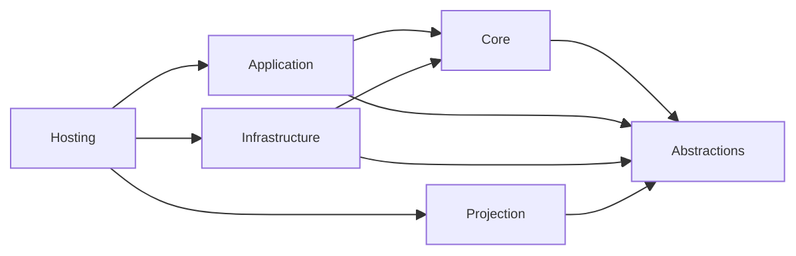
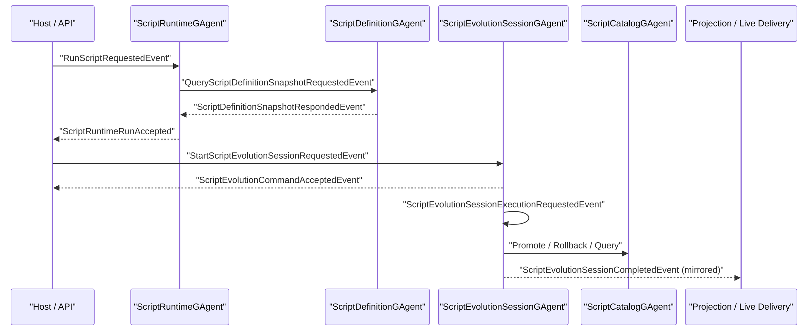

# Aevatar.Scripting 架构文档

## 1. 文档元信息

- 文档状态：`Active`
- 文档版本：`v9`
- 更新时间：`2026-03-07`
- 适用范围：`src/Aevatar.Scripting.*`、`test/Aevatar.Scripting.*`、`test/Aevatar.Integration.Tests` 中的 Scripting 相关路径
- 非范围：`Aevatar.Foundation.*` 的通用 runtime 机制本身

## 2. 定位与约束

`Aevatar.Scripting` 的当前定位不是“另一种 workflow DSL”，而是：

1. 动态 capability implementation layer
2. 动态脚本定义、编译、执行、演化治理层
3. 可替代大量静态业务实现代码的运行面

它与 `workflow` 的边界是：

1. `workflow` 负责显式业务编排
2. `scripting` 负责动态业务实现
3. direct script invocation 与 workflow-invoked script capability 可以并存
4. 两条路径都遵守同一外部协议模型：
   - `command ack`
   - `live delivery`
   - `query/read model`
5. 脚本作者面允许暴露建立在该协议之上的高层 helper；helper 可以等待终态，但 authority 仍然来自 owner actor state。

强约束：

1. 跨事件、跨重激活事实只存于 owner actor state。
2. 禁止中间层以进程内字典维护跨请求事实态。
3. Query 必须由 owner actor 直接读取持久状态响应，不能把 projection store 当成跨节点权威来源。
4. Projection 只负责读模型与 live delivery，不再承担业务 completion authority。

## 3. 分层映射

| 分层 | 项目 | 核心职责 |
|---|---|---|
| Abstractions | `Aevatar.Scripting.Abstractions` | Proto 状态/事件契约、动态 capability 抽象、查询契约 |
| Core | `Aevatar.Scripting.Core` | Definition / Runtime / EvolutionSession / Catalog 四个主 Actor 与状态机 |
| Application | `Aevatar.Scripting.Application` | 命令与查询 request adapter、应用层服务、执行编排器 |
| Infrastructure | `Aevatar.Scripting.Infrastructure` | Roslyn 编译执行、runtime lifecycle/query ports、超时与路由约定 |
| Hosting | `Aevatar.Scripting.Hosting` | DI 组装与 Host API |
| Projection | `Aevatar.Scripting.Projection` | 读模型 projector 与 live delivery |

依赖方向：

## 4. 主干 Actor 与事实状态

### 4.1 ScriptDefinitionGAgent

- 文件：`src/Aevatar.Scripting.Core/ScriptDefinitionGAgent.cs`
- 状态：`ScriptDefinitionState`
- 职责：
  - 定义上载
  - Roslyn 编译与 schema 激活
  - `QueryScriptDefinitionSnapshotRequestedEvent` 响应

### 4.2 ScriptRuntimeGAgent

- 文件：`src/Aevatar.Scripting.Core/ScriptRuntimeGAgent*.cs`
- 状态：`ScriptRuntimeState`
- 职责：
  - 接收 `RunScriptRequestedEvent`
  - 持久化 `pending_definition_queries`
  - 恢复 definition-query pending 并在 actor 内对账 timeout / response
  - 提交 `ScriptRunDomainEventCommitted`
  - 响应 `QueryScriptRuntimeSnapshotRequestedEvent`
- 运行事实：
  - `pending_definition_queries` 只持久化最小恢复事实：`request_id / run_event / queued_at_unix_time_ms`
  - `last_event_type / last_domain_event_payload` 作为最新运行结果快照的一部分写入 `ScriptRuntimeState`

### 4.3 ScriptEvolutionSessionGAgent

- 文件：`src/Aevatar.Scripting.Core/ScriptEvolutionSessionGAgent*.cs`
- 状态：`ScriptEvolutionSessionState`
- 职责：
  - 作为单 proposal 生命周期 owner
  - 接收 `StartScriptEvolutionSessionRequestedEvent`
  - 先返回 `ScriptEvolutionCommandAcceptedEvent`
  - 通过 self execution signal 启动后续编排
  - 持久化终态并响应 `QueryScriptEvolutionProposalSnapshotRequestedEvent`
- 结构：
  - root 文件保留 actor owner 与注册
  - validation / promotion / rejection 编排下沉到 `ScriptEvolutionExecutionCoordinator`
  - `proposal_id -> session_actor_id` 由 proposal id 纯函数推导，不再引入额外 manager/index actor

### 4.4 ScriptCatalogGAgent

- 文件：`src/Aevatar.Scripting.Core/ScriptCatalogGAgent.cs`
- 状态：`ScriptCatalogState`
- 职责：
  - 版本目录
  - active revision 指针
  - 回滚历史
  - `QueryScriptCatalogEntryRequestedEvent` 响应

## 5. 协议模型

Proto 契约定义在：`src/Aevatar.Scripting.Abstractions/script_host_messages.proto`

### 5.1 外部 Command Ack

1. `UpsertScriptDefinitionRequestedEvent` -> `ScriptDefinitionCommandRespondedEvent`
2. `StartScriptEvolutionSessionRequestedEvent` -> `ScriptEvolutionCommandAcceptedEvent`
3. direct runtime run 由 infrastructure lifecycle service 返回 `ScriptRuntimeRunAccepted`

约束：

1. `command ack` 只确认命令已被 owner actor 接受或拒绝。
2. `command ack` 不是 query，不负责返回完整终态快照。
3. 脚本内部 capability helper 可以在 ack 之上继续等待 live delivery 并回查 snapshot，但这不改变外部协议语义。

### 5.2 Owner-State Query

当前查询事件组：

1. `QueryScriptDefinitionSnapshotRequestedEvent` / `ScriptDefinitionSnapshotRespondedEvent`
2. `QueryScriptCatalogEntryRequestedEvent` / `ScriptCatalogEntryRespondedEvent`
3. `QueryScriptEvolutionProposalSnapshotRequestedEvent` / `ScriptEvolutionProposalSnapshotRespondedEvent`
4. `QueryScriptRuntimeSnapshotRequestedEvent` / `ScriptRuntimeSnapshotRespondedEvent`

Application 层适配器：

1. `QueryScriptDefinitionSnapshotRequestAdapter`
2. `QueryScriptCatalogEntryRequestAdapter`
3. `QueryScriptEvolutionProposalSnapshotRequestAdapter`
4. `QueryScriptRuntimeSnapshotRequestAdapter`

Infrastructure 查询服务：

1. `RuntimeScriptDefinitionSnapshotPort`
2. `RuntimeScriptEvolutionSnapshotQueryService`
3. `RuntimeScriptExecutionSnapshotQueryService`

核心规则：

1. Definition / Catalog / EvolutionSession / Runtime 的 query handler 都在 owner actor 内直接读取 state。
2. Query response 统一走 reply stream，不跨层强转 Grain 内部状态。
3. query authority 是 owner actor state，不是 node-local projection store。

### 5.3 Live Delivery

Projection 仍然保留两类职责：

1. `ScriptExecutionReadModel` / `ScriptEvolutionReadModel` 的 reducer/projector
2. `ScriptEvolutionSessionCompletedEvent` 的 live delivery forward

边界收口：

1. Projection 不再承担脚本命令 completion authority。
2. `ScriptEvolutionSessionCompletedEvent` 通过 session actor 显式 mirror 到 self stream，再由 projection 做 live delivery。
3. live delivery 可选；即使 projection delivery 不可用，也不应改变命令是否被接受。

## 6. 两条主链

### 6.1 Runtime Run

主链：

`SpawnRuntimeAsync -> RunRuntimeAsync -> ScriptRuntimeGAgent -> ScriptRuntimeExecutionOrchestrator -> ScriptRunDomainEventCommitted`

关键语义：

1. direct invocation 是一等能力，不必强制包进 workflow。
2. `RunRuntimeAsync(...)` 返回 `ScriptRuntimeRunAccepted`，只表示命令已投递到 runtime actor。
3. Orleans 路径下，`ScriptRuntimeGAgent` 先登记 `pending_definition_queries`，再发 `QueryScriptDefinitionSnapshotRequestedEvent`。
4. definition response 或 timeout 都回到 actor 事件主线程内对账，不允许回调线程直接推进业务。
5. 终态读取走 runtime snapshot query 或 read model，不再通过 projection store 反查 node-local 临时状态。

### 6.2 Evolution

主链：

`ProposeAsync -> StartScriptEvolutionSessionRequestedEvent -> ScriptEvolutionCommandAcceptedEvent -> ScriptEvolutionSessionExecutionRequestedEvent -> ScriptEvolutionExecutionCoordinator -> ScriptCatalog/Definition -> ScriptEvolutionSessionCompletedEvent`

关键语义：

1. 外部入口：Host API -> `IScriptEvolutionApplicationService`
2. 脚本入口：`IScriptEvolutionCapabilities.ProposeScriptEvolutionAsync`
3. 外部入口先拿到 `ScriptEvolutionCommandAccepted`
4. 脚本入口会在内部执行：
   - `command ack`
   - `live delivery wait`
   - `owner-state snapshot query`
   然后向脚本返回高层 `ScriptEvolutionDecision`
5. proposal 的 terminal state 统一由：
   - `QueryScriptEvolutionProposalSnapshotRequestedEvent`
   - read model
   - 可选 live delivery
   暴露
6. `ScriptEvolutionSessionCompletedEvent` 会被持久化，同时 mirror 到 session actor stream 供 live delivery 使用。
7. 不再存在“dispatch session actor -> query session actor decision”这条旧 completion 主链。
8. `RuntimeScriptEvolutionFlowPort` promotion 前必须读取权威 catalog baseline；query 失败直接失败，不再伪造 fallback baseline。

### 6.3 与 Workflow 的关系

1. `workflow` 与 `script` 是并行能力，不是互相替代关系。
2. `workflow` 负责排事，`script` 负责做事。
3. 一个 script capability 可以被直接调用，也可以作为 workflow capability 被调用。
4. direct invocation 与 workflow invocation 都遵守同一外部协议模型：`ack + live delivery + query/read model`。

## 7. 跨节点一致性与运行约束

### 7.1 一致性策略

1. 跨 Silo query 一律通过 `EventEnvelope + reply stream`，不读取 node-local in-memory projection store。
2. runtime / evolution 的 pending facts 只留在 owner actor state。
3. projection session / lease 只表达 live delivery handle，不表达业务事实。
4. `PersistDomainEventAsync(...)` 不会自动把事件推到 actor stream；需要 live delivery 的终态事件必须显式 mirror。

### 7.2 运行时序

## 8. 测试覆盖

核心覆盖点：

1. runtime 回放与 definition-query 恢复：
   `test/Aevatar.Scripting.Core.Tests/Runtime/ScriptRuntimeGAgentReplayContractTests.cs`
2. evolution session owner 行为与 command ack：
   `test/Aevatar.Scripting.Core.Tests/Runtime/ScriptEvolutionSessionGAgentTests.cs`
3. runtime ports / query / timeout 语义：
   `test/Aevatar.Scripting.Core.Tests/Runtime/RuntimeScriptInfrastructurePortsTests.cs`
4. evolution read model 与 session completed live delivery：
   `test/Aevatar.Scripting.Core.Tests/Projection/ScriptEvolutionReadModelProjectorTests.cs`
5. 外部演化链路：
   `test/Aevatar.Integration.Tests/ScriptExternalEvolutionE2ETests.cs`
6. Orleans 3-silo 一致性：
   `test/Aevatar.Integration.Tests/ScriptAutonomousEvolutionOrleans3ClusterConsistencyTests.cs`

本轮验证（2026-03-07）：

1. `dotnet build aevatar.slnx --nologo`
2. `dotnet test test/Aevatar.Scripting.Core.Tests/Aevatar.Scripting.Core.Tests.csproj --nologo --filter "FullyQualifiedName~RuntimeScriptInfrastructurePortsTests|FullyQualifiedName~ScriptEvolutionSessionGAgentTests|FullyQualifiedName~ScriptEvolutionReadModelProjectorTests"`
3. `dotnet test test/Aevatar.Integration.Tests/Aevatar.Integration.Tests.csproj --nologo --filter FullyQualifiedName~ScriptExternalEvolutionE2ETests`
4. `AEVATAR_TEST_ORLEANS_3NODE=1 dotnet test test/Aevatar.Integration.Tests/Aevatar.Integration.Tests.csproj --nologo --filter FullyQualifiedName~ScriptAutonomousEvolutionOrleans3ClusterConsistencyTests`

## 9. 当前剩余约束

1. `ScriptRuntimeState.pending_definition_queries` 仍是 scripting runtime 的专用 pending slice；后续如果统一到更高层 execution kernel，需要把它映射到统一 async-operation contract。
2. `ScriptEvolutionSessionCompletedEvent` 目前通过 actor stream mirror 后再进入 projection live delivery；这条桥仅表达 live delivery，不表达 query authority。
3. `IScriptingPortTimeouts` 已统一抽象命令 ack、snapshot query 与 definition query timeout；不同环境可继续提供分层实现。

## 10. 结论

当前 `Aevatar.Scripting` 的权威语义已经收口为：

1. `scripting` 是动态 capability implementation layer
2. owner actor state 是跨节点 query authority
3. 外部协议统一为 `command ack + live delivery + query/read model`
4. projection 只做读侧与 live delivery，不再承担业务 completion authority
5. script capability 可以 direct invocation，也可以被 workflow 编排调用
6. 脚本作者面可以使用建立在该协议之上的高层 terminal helper，但 helper 不再创造第二套 authority

这套边界与 `workflow = orchestration surface` 形成清晰分工，不再把 `scripting` 写成第二套通用 workflow runtime。
