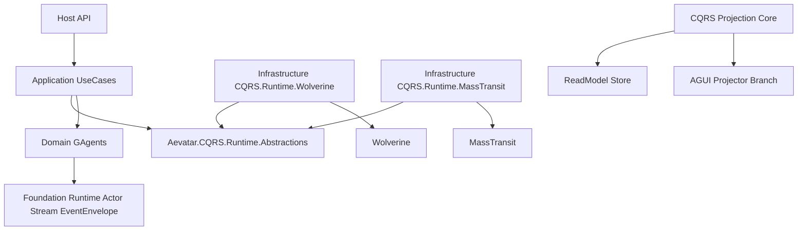

# Aevatar CQRS 重构总方案（Wolverine 与 MassTransit 并行实现）

## 1. 范围与硬约束

- 并行实现 A：`Wolverine`，采用“零配置本地模式”（进程内 + 内存 + 文件系统），不接 SQL。
- 并行实现 B：`MassTransit`，定位分布式高性能场景，保持同一抽象契约，可切换。
- 上层（Domain/Application/Host）不直接引用 Wolverine/MassTransit 类型。
- CQRS 与 AGUI 使用同一 Projection Pipeline，不再双轨。

## 2. 合并后的目标架构

## 3. 当前状态（已完成/待完成）

已完成：

1. Platform 命令入口已改为 `ICommandBus.EnqueueAsync`，移除应用层 `Task.Run` 调度：`src/Aevatar.Platform.Application/Commands/PlatformCommandApplicationService.cs`。
2. 命令状态存储已从内存切换到文件系统：`src/Aevatar.Platform.Infrastructure/Store/FileSystemPlatformCommandStateStore.cs`。
3. CQRS Runtime 抽象层已独立：`src/Aevatar.CQRS.Runtime.Abstractions`。
4. Wolverine 与 MassTransit 两种并行实现均已接入：`src/Aevatar.CQRS.Runtime.Implementations.Wolverine`、`src/Aevatar.CQRS.Runtime.Implementations.MassTransit`。

待完成（下一步）：

1. Workflow/Maker 读模型存储仍有内存实现，需要按子系统逐步落地持久化。
2. `src/Aevatar.Host.Api` 与 `src/workflow/Aevatar.Workflow.Host.Api` 仍存在宿主重复，需要统一收敛。
3. 端到端恢复/重放与运行指标覆盖仍需补齐系统级验收用例。

## 4. CQRS 企业级能力清单（本次补全）

1. Command 接收与回执：`Accepted/Running/Succeeded/Failed/Cancelled/TimedOut`。
2. Inbox 去重：基于 `CommandId` 与幂等键。
3. Outbox：事件与状态一致性提交。
4. 重试策略：指数退避、最大次数、可配置不可重试异常。
5. Dead Letter Queue：失败命令转入本地文件死信。
6. 调度能力：延迟命令与超时命令。
7. 观测：结构化日志、指标、追踪上下文（CorrelationId/CausationId）。
8. Projection Checkpoint：按 projector 维护 offset/checkpoint。
9. Projection Replay：从 checkpoint 或起点重放。
10. 背压控制：有界队列与 drop/wait 策略。

## 5. 实现策略（无 SQL，本地零配置）

### 5.1 Wolverine 并行实现（本地零配置）

- 项目：`src/Aevatar.CQRS.Runtime.Implementations.Wolverine`。
- 运行模式：local durable queue。
- 持久化策略：
  - `commands/`：命令状态文件（json）。
  - `inbox/`：去重索引文件。
  - `outbox/`：待发布消息文件。
  - `dlq/`：死信文件。
  - `checkpoints/`：projection checkpoint 文件。
- 不配置数据库；目录默认 `artifacts/cqrs/`。

### 5.2 MassTransit 并行实现（分布式高性能）

- 项目：`src/Aevatar.CQRS.Runtime.Implementations.MassTransit`。
- 默认使用 in-memory transport（无外部 broker 配置）。
- 与 Wolverine 共享同一文件持久化组件（state/inbox/outbox/dlq/checkpoint）。
- 通过 `Aevatar.CQRS.Runtime.Abstractions` 暴露同样能力，不改变业务层代码。

## 6. 项目拆分与依赖规范

1. 新增 `src/Aevatar.CQRS.Runtime.Abstractions`：
   - `ICommandBus`
   - `ICommandScheduler`
   - `ICommandStateStore`
   - `IInboxStore`
   - `IOutboxStore`
   - `IDeadLetterStore`
2. 新增 `src/Aevatar.CQRS.Runtime.FileSystem`（共享本地文件实现）。
3. 新增 `src/Aevatar.CQRS.Runtime.Implementations.Wolverine`（并行实现）。
4. 新增 `src/Aevatar.CQRS.Runtime.Implementations.MassTransit`（并行实现）。
5. `Platform/Application/Workflow/Maker` 仅依赖 `Aevatar.CQRS.Runtime.Abstractions`。

## 7. 分阶段重构计划

### Phase A：文档与边界统一

1. 合并原两份方案到本文件。
2. 标记 Wolverine 与 MassTransit 为并行可切换实现（仅配置缺省值使用 Wolverine）。
3. 明确“无 SQL 本地模式”为当前默认目标。

### Phase B：抽象层落地

1. 引入 `Aevatar.CQRS.Runtime.Abstractions`。
2. Platform 命令入口改为 `ICommandBus.EnqueueAsync`。
3. 去掉 `PlatformCommandApplicationService` 内的 `Task.Run` 调度。

### Phase C：双实现落地

1. 实现 `Aevatar.CQRS.Runtime.Implementations.Wolverine`。
2. 实现 `Aevatar.CQRS.Runtime.Implementations.MassTransit`。
3. 增加配置开关：`Cqrs:Runtime = Wolverine|MassTransit`，默认 `Wolverine`。

### Phase D：企业级能力补齐

1. Inbox/Outbox/DLQ/Retry/Timeout。
2. Projection checkpoint 与 replay。
3. 文件系统恢复测试（重启场景）。
4. 指标与审计日志补齐。

## 8. 验收标准（DoD）

1. 默认无配置启动即可运行（仅本地内存+文件系统）。
2. Wolverine 与 MassTransit 两套实现均可通过同一抽象切换。
3. 业务层零第三方强引用。
4. 命令重启不丢失，失败进入死信，支持重放。
5. `dotnet build aevatar.slnx --nologo` 与 `dotnet test aevatar.slnx --nologo` 通过。
