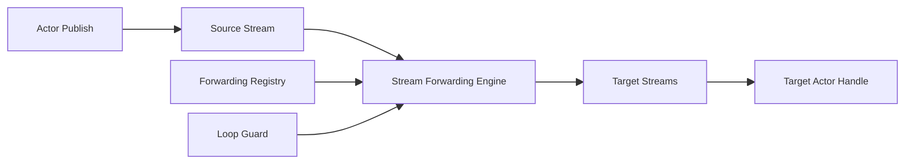

# Stream 层直转发重构方案（2026-02-22）

## 1. 目标与范围

目标：将“纯转发”从 Actor 处理链路下沉到 Stream/Queue 层，避免每跳进入 Actor mailbox。
本轮按“无需兼容历史路径”执行，直接收敛为单一路径实现。

范围：

1. `Aevatar.Foundation.Abstractions`（新增转发契约）
2. `Aevatar.Foundation.Runtime`（InMemory Stream 直转发实现）
3. `Aevatar.Foundation.Runtime.Implementations.Orleans`（Orleans 对齐策略）
4. `Workflow/CQRS` 接入层仅做模式声明，不承载转发执行

不在本次范围：业务 reducer/投影语义变更。

## 2. 当前问题

当前 Local 路径中，子 Actor 订阅父 Stream 后会再次 `Enqueue + Produce` 继续下发（见 `src/Aevatar.Foundation.Runtime/Actor/LocalActor.cs`），导致：

1. 纯转发也要经过中间 Actor mailbox，吞吐受限。
2. 每跳重复反序列化/处理/再发布，延迟与 CPU 开销叠加。
3. 转发逻辑散落在 Actor 和 Runtime，治理成本高。

## 3. 设计原则

1. 处理与转发解耦：
   - `Handle Path`：需要业务处理时进入 Actor。
   - `Transit Path`：纯转发由 Stream 层直接 fanout。
2. 事实源唯一：转发关系的权威数据来自持久化/分布式存储（`IRouterHierarchyStore` 扩展）。
3. 运行态可缓存：Stream 层可维护运行态索引，但仅作为加速缓存，不作为权威事实。
4. 统一防环：Loop Guard 在 Stream 转发平面统一执行。

## 4. 目标架构

## 5. 方案设计

### 5.1 控制面：转发关系注册

新增抽象（建议位于 `Aevatar.Foundation.Abstractions/Streaming`）：

1. `IStreamForwardingRegistry`
   - `Task UpsertAsync(StreamForwardingBinding binding, CancellationToken ct = default)`
   - `Task RemoveAsync(string sourceStreamId, string targetStreamId, CancellationToken ct = default)`
   - `Task<IReadOnlyList<StreamForwardingBinding>> ListBySourceAsync(string sourceStreamId, CancellationToken ct = default)`
2. `StreamForwardingBinding`
   - `SourceStreamId`
   - `TargetStreamId`
   - `ForwardingMode`（`TransitOnly` / `HandleThenForward`）
   - `DirectionFilter`、`EventTypeFilter`
   - `Version/LeaseId`（并发安全）

说明：

- `Link/Unlink` 时同时维护转发绑定。
- 绑定关系权威保存到可替换存储（开发期可 InMemory，生产可分布式）。

### 5.2 数据面：Stream 直转发引擎

新增抽象（建议位于 `Aevatar.Foundation.Runtime/Streaming`）：

1. `IStreamForwardingEngine`
   - `Task FanoutAsync(EventEnvelope envelope, string sourceStreamId, CancellationToken ct = default)`
2. `IStreamForwardingLoopGuard`
   - `bool ShouldDrop(string currentStreamId, EventEnvelope envelope)`
   - `void BeforeForward(string fromStreamId, string toStreamId, EventEnvelope envelope)`

执行规则：

1. `TransitOnly` 不进入中间 Actor，直接 `SourceStream -> TargetStreams`。
2. `HandleThenForward` 保留现有 Actor 处理后再发布行为（用于确需中间处理场景）。
3. fanout 支持并发发送，单次序列化复用字节载荷。
4. loop guard 采用低分配解析（禁止每跳 `Split`）。

### 5.3 Runtime 对齐

1. Local Runtime
   - `LocalActor.SubscribeToParentAsync` 不再承担默认下发 relay。
   - relay 改由 `InMemoryStreamProvider + ForwardingEngine` 执行。
2. Orleans Runtime
   - 沿用 `IEventLoopGuard`，与 stream forward guard 规则保持一致。
   - 需要跨 Silo 时使用统一转发 registry 作为事实源。

### 5.4 去兼容决策（已执行）

1. 不引入 `Legacy|StreamTransit` 双模式开关，默认且唯一模式即 Stream 层转发。
2. `LocalActor` 已删除父 Stream 订阅 relay 逻辑，仅保留自 Stream 消费与 mailbox 处理。
3. `LocalActorRuntime` 已强依赖 `IStreamLifecycleManager + IStreamForwardingRegistry`，不再允许 `Noop` 回退。

## 6. 实施阶段

### Phase 1：抽象与存储

1. 新增 `IStreamForwardingRegistry` 与 binding 模型。
2. 提供 InMemory 实现，并接入 DI。
3. `Link/Unlink` 持久化绑定关系。

### Phase 2：InMemory Stream 直转发

1. 实现 `IStreamForwardingEngine`。
2. 在 `InMemoryStream` dispatch loop 接入 fanout。
3. 引入低分配 loop guard。

### Phase 3：Actor 路径收敛

1. 移除 `LocalActor` 默认下发 relay（仅保留业务处理）。
2. 保留 `HandleThenForward` 与 `TransitOnly` 语义，不保留旧 relay 兼容实现。
3. 接入 metrics：fanout 命中率、平均跳数、drop 次数。

### Phase 4：Orleans 对齐与灰度

1. Orleans 侧接入 registry（可先 read-only）。
2. 对齐 `TransitOnly/HandleThenForward` 语义与 metadata 约定。
3. 全量回归后移除 Orleans 侧遗留 relay 分支。

## 7. 验收标准

1. 纯转发路径不再进入中间 Actor mailbox。
2. `Link/Unlink` 后转发绑定可查询且可回收。
3. Loop Guard 统一生效，`A -> B -> A` 不出现重复处理。
4. 以下命令通过：
   - `dotnet build aevatar.slnx --nologo --no-restore -m:1 -nodeReuse:false --tl:off`
   - `dotnet test aevatar.slnx --nologo --no-build --no-restore -m:1 -nodeReuse:false --tl:off`
   - `bash tools/ci/architecture_guards.sh`
   - `bash tools/ci/projection_route_mapping_guard.sh`

## 8. 测试矩阵

1. 功能正确性：
   - `TransitOnly`：父子链路事件直达。
   - `HandleThenForward`：中间 Actor 可见事件且继续下发。
2. 防环：
   - `A -> B -> A`、`Both` 多分支回流。
3. 性能：
   - 同拓扑下对比“重构前基线提交”与“当前实现”的 P50/P99 延迟和 CPU。
4. 一致性：
   - 绑定更新并发冲突（版本号冲突重试）。

## 9. 风险与应对

1. 风险：转发绑定与拓扑状态不一致。
   - 应对：引入 `Version/Lease` 校验，失败回滚并告警。
2. 风险：并发 fanout 导致下游突刺。
   - 应对：增加每源 Stream 限流与批量窗口。
3. 风险：Orleans 对齐阶段存在语义不一致导致重复投递。
   - 应对：统一 metadata 契约并补充跨节点回归测试，完成后删除旧 relay 分支。

## 10. 产出清单

1. Stream 转发控制面契约与实现。
2. Stream 直转发执行引擎与统一 loop guard。
3. Local 运行时单路径接入（无兼容开关）；Orleans 后续按同语义对齐。
4. 回归测试与性能基线文档。

## 11. 当前落地状态（2026-02-22）

1. 新增 `PublisherChainMetadata` 与 `StreamForwardingEnvelopeMetadata`，统一 `__publishers` 与 stream-forwarding metadata 键。
2. `InMemoryStreamProvider` 已拆分为 provider + `InMemoryStreamForwardingRegistry` + `InMemoryStreamForwardingEngine`，消除单类多职责。
3. 新增 `StreamForwardingRules`（`CreateHierarchyBinding / Matches / IsTargetDispatchAllowed / BuildForwardedEnvelope / ShouldSkipTransitOnlyHandling`），Local 与 Orleans 复用同一套转发判定与封包规则。
4. Orleans 已移除单实现的 `IEventLoopGuard` 抽象层，防环逻辑收敛到 `PublisherChainMetadata.AppendDispatchPublisher/ShouldDropForReceiver`。
5. `LocalActorRuntime` 已改为显式注入 `IStreamLifecycleManager + IStreamForwardingRegistry`，移除对 `IStreamProvider` 的运行时强转耦合。
6. `OrleansActorRuntime` 的 `Link/Unlink/Destroy` 已接入 forwarding registry 维护，统一控制面拓扑事实。
7. Orleans `OrleansGrainEventPublisher` 的 `Down/Both` 已改为 forwarding registry 驱动，并支持 `TransitOnly` 直转发语义。
8. 数据面执行进一步收敛：`InMemoryStreamForwardingEngine` 改为并发 fanout；`OrleansGrainEventPublisher` 下行遍历改为非递归队列执行，避免深链递归和串行 hop。
