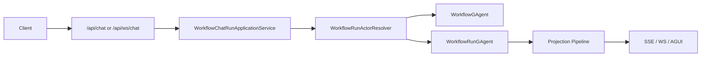

# 工作流能力设计与实践

`Workflow` 现在采用明确的双 Actor 模型：

1. `WorkflowGAgent` 只负责 definition/binding。
2. `WorkflowRunGAgent` 负责单次 accepted run 的持久事实与执行推进。
3. Workflow 主执行链只接受 `IWorkflowPrimitiveExecutor + WorkflowPrimitiveExecutorRegistry`。

这份文档只描述当前有效模型，不再保留旧 loop-module 驱动架构的兼容说明。

## 1. 核心结论

- 一个 workflow definition/binding 对应一个 `WorkflowGAgent`。
- 每次 accepted run 都创建一个独立 `WorkflowRunGAgent`。
- `run_id/status/active_step/pending waits/retries/sub-workflows` 全部落在 `WorkflowRunState`。
- `WorkflowState` 只保存 definition 事实和 definition 级统计，不再承载 run pending。
- 外部 `resume/signal` 必须命中 `runActorId + token`，不再通过 definition actor 或模糊匹配恢复。

## 2. 主执行链



执行规则：

1. `WorkflowRunActorResolver` 解析 definition 来源：
   - `workflowYamls`
   - `definitionActorId`
   - `workflow`
   - 默认 workflow
2. 若命中 definition actor，则读取其 binding snapshot，再创建新的 `WorkflowRunGAgent`。
3. `WorkflowRunGAgent` 绑定 definition 后接收 `ChatRequestEvent`，持久化 run 事实并推进步骤。
4. 投影与实时推送统一挂在 run actor 事件流上，不再挂在 definition actor 上。

## 3. Actor 职责

### 3.1 WorkflowGAgent

职责：

1. 绑定和校验 workflow YAML。
2. 维护 definition name、inline YAML bundle、version、compiled 状态。
3. 为 accepted run 创建并绑定 `WorkflowRunGAgent`。
4. 汇总 definition 级执行计数。

禁止职责：

1. 不推进 step。
2. 不持有 `pending_sub_workflows`、`pending_waits`、`pending_timeouts` 等 run 事实。
3. 不处理 `resume/signal/human gate` 对账。

### 3.2 WorkflowRunGAgent

职责：

1. 持有单次 run 的唯一持久事实源 `WorkflowRunState`。
2. 持有 `variables/step_executions/retry_attempts`。
3. 持有 `pending_timeouts/pending_retry_backoffs/pending_delays`。
4. 持有 `pending_signal_waits/pending_human_gates`。
5. 持有 `pending_llm_calls/pending_evaluations/pending_reflections`。
6. 持有 `pending_parallel_steps/pending_foreach_steps/pending_map_reduce_steps/pending_race_steps/pending_while_steps`。
7. 持有 `pending_sub_workflows/pending_child_run_ids_by_parent_run_id`。
8. reactivation 后重建编译缓存、重放 `WorkflowRunStatePatchedEvent`、重发 suspended facts。
9. 内部实现已按职责拆分为：
   - `WorkflowRunGAgent.cs`：actor shell 与 ingress event handlers
   - `WorkflowRunGAgent.Lifecycle.cs`：binding/finalization/dynamic child-run/suspended fact republish
   - `WorkflowRunGAgent.ExternalInteractions.cs`：resume/signal/callback/response envelope ingress
   - `WorkflowRunReducer.cs`：state reducer 入口
   - `WorkflowPrimitiveExecutionPlanner.cs`：step type routing 与 primitive planning
   - `WorkflowAsyncOperationReconciler.cs`：callback / LLM response / stateful completion 对账入口
   - `WorkflowRunEffectDispatcher.cs`：actor tree、durable callback、sub-workflow effect
   - `WorkflowRunStepRequestFactory.cs`：step request / while iteration 变量构建
   - `WorkflowRunSupport.cs`：callback key、pending token lookup、parent-step 推导等纯 helper
   - `WorkflowCompilationService.cs` + `Validation/*`：DSL compile/validate 服务边界
   - `WorkflowRunDispatchRuntime.cs` / `WorkflowRunHumanInteractionRuntime.cs` / `WorkflowRunControlFlowRuntime.cs` / `WorkflowRunAIRuntime.cs` / `WorkflowRunFanOutRuntime.cs` / `WorkflowRunSubWorkflowRuntime.cs` / `WorkflowRunCallbackRuntime.cs` / `WorkflowRunAggregationCompletionRuntime.cs` / `WorkflowRunProgressionCompletionRuntime.cs` / `WorkflowRunAsyncPolicyRuntime.cs` / `Infrastructure.cs`：stateful primitive、callback/completion runtime 与 helper 实现切片，不再把主 shell 当成规则实现容器。

## 4. 原语归属

### 4.1 由 WorkflowRunGAgent 直接拥有语义和状态

这些 step type 仍然存在，但不再通过 factory 安装为 workflow 主执行模块：

- `workflow_call`
- `delay`
- `wait_signal`
- `human_input`
- `human_approval`
- `llm_call`
- `evaluate`
- `reflect`
- `parallel`
- `foreach`
- `map_reduce`
- `race`
- `while`
- `cache`

这类原语的正确性必须依赖 `WorkflowRunState`，而不是 executor 私有字段。

### 4.2 仍通过 WorkflowPrimitiveExecutorRegistry 解析的无状态原语

当前 `WorkflowCorePrimitivePack` 只注册无状态 executor：

- `conditional`
- `switch`
- `checkpoint`
- `assign`
- `vote`
- `tool_call`
- `connector_call`
- `transform`
- `retrieve_facts`
- `guard`
- `emit`
- `workflow_yaml_validate`
- `dynamic_workflow`

扩展包也必须遵循同一规则：只注册无状态原语处理器，不再引入 `DependencyExpander` 或 `Configurator`，也不再通过旧工厂式主链安装模型扩展 runtime。

## 5. API 语义

### 5.1 启动运行

`POST /api/chat`

请求体支持四种入口：

1. `{ "prompt": "...", "workflow": "direct" }`
2. `{ "prompt": "...", "workflowYamls": ["..."] }`
3. `{ "prompt": "...", "definitionActorId": "wf-def-123" }`
4. `{ "prompt": "..." }`

规则：

1. `workflowYamls` 优先于 `workflow`。
2. `definitionActorId + workflowYamls` 直接报错。
3. `definitionActorId` 只是 definition 来源句柄，不是 run 控制句柄。

### 5.2 resume / signal

恢复与信号都必须命中 run actor：

```json
POST /api/workflows/resume
{
  "runActorId": "wf-run-123",
  "runId": "run-123",
  "resumeToken": "gate-token",
  "approved": true,
  "userInput": "LGTM"
}
```

```json
POST /api/workflows/signal
{
  "runActorId": "wf-run-123",
  "runId": "run-123",
  "waitToken": "wait-token",
  "payload": "window=open"
}
```

语义约束：

1. `resume` 使用 `resumeToken`。
2. `signal` 使用 `waitToken`。
3. token 错误、晚到或已失效事件都在 run actor 内显式对账并 no-op。

## 6. 扩展方式

### 6.1 注册无状态原语

```csharp
services.AddAevatarWorkflow();
services.AddWorkflowPrimitivePack<MyPrimitivePack>();
```

```csharp
public sealed class MyPrimitivePack : IWorkflowPrimitivePack
{
    public string Name => "my.pack";

    public IReadOnlyList<WorkflowPrimitiveRegistration> Executors =>
    [
        WorkflowPrimitiveRegistration.Create<MyPrimitiveExecutor>("my_step")
    ];
}
```

### 6.2 什么时候必须改 WorkflowRunState

如果新原语引入以下任意一种事实，就不能只写无状态 executor，必须同时扩展 `WorkflowRunState` 与 `WorkflowRunGAgent`：

1. 跨事件 pending。
2. timeout/retry/delay/backoff。
3. 外部响应 correlation。
4. fanout 聚合。
5. human gate / signal wait。
6. sub-workflow lifecycle。

判断标准只有一句：

`如果 reactivation 后必须继续收敛，这个事实就必须进入 WorkflowRunState。`

## 7. 从旧模型迁移

旧模型的核心问题不是“某个回调没持久化”，而是“run 事实被错误地放进非持久化扩展点私有内存里”。现在统一按下面的方式迁移：

| 旧做法 | 新做法 |
|---|---|
| definition actor 直接执行 run | `WorkflowGAgent` 创建 `WorkflowRunGAgent` |
| 主循环在易失模块状态里推进 | `WorkflowRunGAgent` 持有 `WorkflowRunState` |
| signal / human gate 在模块内存里等待 | `pending_signal_waits` / `pending_human_gates` |
| 外部调用在模块私有 pending 里对账 | `pending_llm_calls` / `pending_evaluations` / `pending_reflections` |
| 并发与循环聚合依赖私有字典 | run actor 持久化 frame / aggregation facts |
| definition actor 承载 sub-workflow pending | `pending_sub_workflows` 下沉到 run actor |

## 8. 当前代码入口

Definition catalog 装配规则：

1. `AddWorkflowApplication()` 只注册 run/query/orchestration 应用服务，不默认声明 definition fact source。
2. dev/test/demo 若要使用内存 definition catalog，必须显式调用 `AddInMemoryWorkflowDefinitionCatalog()`。
3. production composition 若不用 `InMemory`，必须在 Host/Infrastructure 层显式提供自己的 `IWorkflowDefinitionCatalog`。

最关键的代码文件：

1. `src/workflow/Aevatar.Workflow.Core/WorkflowGAgent.cs`
2. `src/workflow/Aevatar.Workflow.Core/WorkflowRunGAgent.cs`
3. `src/workflow/Aevatar.Workflow.Core/WorkflowRunReducer.cs`
4. `src/workflow/Aevatar.Workflow.Core/WorkflowPrimitiveExecutionPlanner.cs`
5. `src/workflow/Aevatar.Workflow.Core/WorkflowAsyncOperationReconciler.cs`
6. `src/workflow/Aevatar.Workflow.Core/WorkflowRunEffectDispatcher.cs`
7. `src/workflow/Aevatar.Workflow.Core/WorkflowRunGAgent.Lifecycle.cs`
8. `src/workflow/Aevatar.Workflow.Core/WorkflowRunGAgent.ExternalInteractions.cs`
9. `src/workflow/Aevatar.Workflow.Core/WorkflowRunControlFlowRuntime.cs`
10. `src/workflow/Aevatar.Workflow.Core/WorkflowRunAIRuntime.cs`
11. `src/workflow/Aevatar.Workflow.Core/WorkflowRunFanOutRuntime.cs`
12. `src/workflow/Aevatar.Workflow.Core/WorkflowRunSubWorkflowRuntime.cs`
13. `src/workflow/Aevatar.Workflow.Core/WorkflowRunCallbackRuntime.cs`
14. `src/workflow/Aevatar.Workflow.Core/WorkflowRunAggregationCompletionRuntime.cs`
15. `src/workflow/Aevatar.Workflow.Core/WorkflowRunProgressionCompletionRuntime.cs`
16. `src/workflow/Aevatar.Workflow.Core/WorkflowRunAsyncPolicyRuntime.cs`
17. `src/workflow/Aevatar.Workflow.Core/WorkflowRunDispatchRuntime.cs`
18. `src/workflow/Aevatar.Workflow.Core/WorkflowRunHumanInteractionRuntime.cs`
19. `src/workflow/Aevatar.Workflow.Core/WorkflowRunGAgent.Infrastructure.cs`
20. `src/workflow/Aevatar.Workflow.Core/WorkflowCompilationService.cs`
21. `src/workflow/Aevatar.Workflow.Core/workflow_state.proto`
22. `src/workflow/Aevatar.Workflow.Core/workflow_run_state.proto`
23. `src/workflow/Aevatar.Workflow.Core/WorkflowCorePrimitivePack.cs`
24. `src/workflow/Aevatar.Workflow.Application/Runs/WorkflowRunActorResolver.cs`
25. `src/workflow/Aevatar.Workflow.Infrastructure/CapabilityApi/WorkflowCapabilityEndpoints*.cs`

更完整的系统说明见：

- `src/workflow/README.md`
- `src/workflow/Aevatar.Workflow.Core/README.md`
- `docs/architecture/workflow-runtime-actorized-run-persistent-state-refactor-blueprint-2026-03-07.md`
