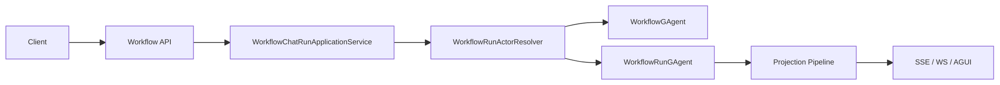

# 工作流能力设计与实践

当前 `Workflow` 的唯一权威重构蓝图是 [workflow-core-capability-oriented-refactor-blueprint-2026-03-08.md](/Users/auric/aevatar/docs/architecture/workflow-core-capability-oriented-refactor-blueprint-2026-03-08.md)。

当前有效模型：

1. `WorkflowGAgent` 只负责 definition/binding。
2. `WorkflowRunGAgent` 只负责单次 accepted run 的持久事实与执行推进。
3. `WorkflowRunState` 是 run 事实源。
4. `Workflow.Core` 内部已按 capability 聚合，不再使用 `RuntimeSuite / Reconciler / RuntimeContext / Support` 这套旧结构。
5. 对外扩展面仍然只有两类：
   - 无状态扩展：`IWorkflowPrimitiveExecutor + IWorkflowPrimitivePack`
   - 有状态内建能力：Capability + `WorkflowRunState` + Patch Contributor

## 1. 双 Actor 主干

规则：

1. `WorkflowGAgent` 维护 definition 事实，不推进 run。
2. 每次 accepted run 都创建独立 `WorkflowRunGAgent`。
3. `resume / signal / callback / response / child completion` 都只在 run actor 内对账。

## 2. WorkflowRunGAgent 的当前结构

`WorkflowRunGAgent` 已收敛成 owner shell。当前职责分布：

1. [WorkflowRunGAgent.cs](/Users/auric/aevatar/src/workflow/Aevatar.Workflow.Core/WorkflowRunGAgent.cs)
   - ingress handlers
   - owner-level state transition
   - capability router 调用
   - run finalization 决策
2. [WorkflowRunGAgent.Lifecycle.cs](/Users/auric/aevatar/src/workflow/Aevatar.Workflow.Core/WorkflowRunGAgent.Lifecycle.cs)
   - binding
   - dynamic workflow invoke
   - final completion publish
   - suspended fact republish
3. [WorkflowRunGAgent.ExternalInteractions.cs](/Users/auric/aevatar/src/workflow/Aevatar.Workflow.Core/WorkflowRunGAgent.ExternalInteractions.cs)
   - `resume`
   - `signal`
   - runtime callback envelope
   - AI response envelope
   - child run completion envelope
4. [WorkflowRunGAgent.Infrastructure.cs](/Users/auric/aevatar/src/workflow/Aevatar.Workflow.Core/WorkflowRunGAgent.Infrastructure.cs)
   - workflow yaml resolve
   - bind/init envelope build
   - owner-local logging helper

owner 不再直接持有一串 capability runtime 字段。

## 3. Capability-Oriented Core

### 3.1 共享上下文边界

共享能力已严格拆成三层：

1. [WorkflowRunReadContext.cs](/Users/auric/aevatar/src/workflow/Aevatar.Workflow.Core/Run/Context/WorkflowRunReadContext.cs)
   - `ActorId`
   - `State`
   - `RunId`
   - `CompiledWorkflow`
2. [WorkflowRunWriteContext.cs](/Users/auric/aevatar/src/workflow/Aevatar.Workflow.Core/Run/Context/WorkflowRunWriteContext.cs)
   - `PersistStateAsync`
   - `PublishAsync`
   - `SendToAsync`
   - `LogWarningAsync`
3. [WorkflowRunEffectPorts.cs](/Users/auric/aevatar/src/workflow/Aevatar.Workflow.Core/Run/Context/WorkflowRunEffectPorts.cs)
   - actor tree / callback / sub-workflow / child cleanup / internal step dispatch / finalization

这三层替代了旧的宽 `RuntimeContext`。

### 3.2 Capability 路由

当前统一路由模型全部落在 `Run/Routing/`：

1. [IWorkflowRunCapability.cs](/Users/auric/aevatar/src/workflow/Aevatar.Workflow.Core/Run/Routing/IWorkflowRunCapability.cs)
2. [WorkflowRunCapabilityRegistry.cs](/Users/auric/aevatar/src/workflow/Aevatar.Workflow.Core/Run/Routing/WorkflowRunCapabilityRegistry.cs)
3. [WorkflowRunStepRouter.cs](/Users/auric/aevatar/src/workflow/Aevatar.Workflow.Core/Run/Routing/WorkflowRunStepRouter.cs)
4. [WorkflowRunCompletionRouter.cs](/Users/auric/aevatar/src/workflow/Aevatar.Workflow.Core/Run/Routing/WorkflowRunCompletionRouter.cs)
5. [WorkflowRunInternalSignalRouter.cs](/Users/auric/aevatar/src/workflow/Aevatar.Workflow.Core/Run/Routing/WorkflowRunInternalSignalRouter.cs)
6. [WorkflowRunResponseRouter.cs](/Users/auric/aevatar/src/workflow/Aevatar.Workflow.Core/Run/Routing/WorkflowRunResponseRouter.cs)
7. [WorkflowRunChildCompletionRouter.cs](/Users/auric/aevatar/src/workflow/Aevatar.Workflow.Core/Run/Routing/WorkflowRunChildCompletionRouter.cs)
8. [WorkflowRunResumeRouter.cs](/Users/auric/aevatar/src/workflow/Aevatar.Workflow.Core/Run/Routing/WorkflowRunResumeRouter.cs)
9. [WorkflowRunExternalSignalRouter.cs](/Users/auric/aevatar/src/workflow/Aevatar.Workflow.Core/Run/Routing/WorkflowRunExternalSignalRouter.cs)
10. [WorkflowRunFailurePolicyService.cs](/Users/auric/aevatar/src/workflow/Aevatar.Workflow.Core/Run/Routing/WorkflowRunFailurePolicyService.cs)

规则：

1. `step` 走 canonical step type 精确键。
2. `internal signal / response` 先按 `TypeUrl` 精确分组，再做 capability 自判定。
3. `completion / child completion / resume / external signal` 必须唯一命中；多命中直接抛错。

### 3.3 状态补丁

`WorkflowRunStatePatchedEvent` 的 build/apply 已改成 contributor 模型：

1. [WorkflowRunStatePatchAssembler.cs](/Users/auric/aevatar/src/workflow/Aevatar.Workflow.Core/Run/State/WorkflowRunStatePatchAssembler.cs)
2. [IWorkflowRunStatePatchContributor.cs](/Users/auric/aevatar/src/workflow/Aevatar.Workflow.Core/Run/State/IWorkflowRunStatePatchContributor.cs)
3. [WorkflowRunBindingPatchContributor.cs](/Users/auric/aevatar/src/workflow/Aevatar.Workflow.Core/Run/State/WorkflowRunBindingPatchContributor.cs)
4. [WorkflowRunLifecyclePatchContributor.cs](/Users/auric/aevatar/src/workflow/Aevatar.Workflow.Core/Run/State/WorkflowRunLifecyclePatchContributor.cs)
5. [WorkflowRunExecutionPatchContributor.cs](/Users/auric/aevatar/src/workflow/Aevatar.Workflow.Core/Run/State/WorkflowRunExecutionPatchContributor.cs)

各 capability 自己维护自己的状态切片 contributor，不再回到一个总 `PatchSupport`。

## 4. 当前 Capability 列表

当前内建 stateful capability：

1. [WorkflowLlmCallCapability.cs](/Users/auric/aevatar/src/workflow/Aevatar.Workflow.Core/Capabilities/LlmCall/WorkflowLlmCallCapability.cs)
2. [WorkflowEvaluateCapability.cs](/Users/auric/aevatar/src/workflow/Aevatar.Workflow.Core/Capabilities/Evaluate/WorkflowEvaluateCapability.cs)
3. [WorkflowReflectCapability.cs](/Users/auric/aevatar/src/workflow/Aevatar.Workflow.Core/Capabilities/Reflect/WorkflowReflectCapability.cs)
4. [WorkflowHumanInteractionCapability.cs](/Users/auric/aevatar/src/workflow/Aevatar.Workflow.Core/Capabilities/HumanInteraction/WorkflowHumanInteractionCapability.cs)
5. [WorkflowControlFlowCapability.cs](/Users/auric/aevatar/src/workflow/Aevatar.Workflow.Core/Capabilities/ControlFlow/WorkflowControlFlowCapability.cs)
6. [WorkflowFanOutCapability.cs](/Users/auric/aevatar/src/workflow/Aevatar.Workflow.Core/Capabilities/FanOut/WorkflowFanOutCapability.cs)
7. [WorkflowSubWorkflowCapability.cs](/Users/auric/aevatar/src/workflow/Aevatar.Workflow.Core/Capabilities/SubWorkflow/WorkflowSubWorkflowCapability.cs)
8. [WorkflowCacheCapability.cs](/Users/auric/aevatar/src/workflow/Aevatar.Workflow.Core/Capabilities/Cache/WorkflowCacheCapability.cs)

这些 capability 分别聚合：

1. step request 入口
2. 该能力拥有的 pending state
3. internal callback / external signal / response / child completion / completion 对账
4. 该能力专属 patch contributor

## 5. 扩展规则

### 5.1 无状态扩展

新增纯无状态 step：

1. 实现 [IWorkflowPrimitiveExecutor.cs](/Users/auric/aevatar/src/workflow/Aevatar.Workflow.Core/IWorkflowPrimitiveExecutor.cs)
2. 打包进 [IWorkflowPrimitivePack.cs](/Users/auric/aevatar/src/workflow/Aevatar.Workflow.Core/IWorkflowPrimitivePack.cs)
3. 通过 [ServiceCollectionExtensions.cs](/Users/auric/aevatar/src/workflow/Aevatar.Workflow.Core/ServiceCollectionExtensions.cs) 注册

这类能力不允许持有跨事件事实。

### 5.2 有状态能力

如果新能力满足任意一条，就不能只写 primitive executor：

1. 跨事件 pending
2. timeout / retry / delay / watchdog
3. 外部 response correlation
4. human gate / wait signal
5. fanout aggregation
6. child workflow lifecycle
7. reactivation 后必须继续收敛

这时必须同时改：

1. `workflow_run_state.proto`
2. capability 目录
3. patch contributor
4. owner 中的 built-in capability / contributor 装配

## 6. 当前关键文件

1. [WorkflowGAgent.cs](/Users/auric/aevatar/src/workflow/Aevatar.Workflow.Core/WorkflowGAgent.cs)
2. [WorkflowRunGAgent.cs](/Users/auric/aevatar/src/workflow/Aevatar.Workflow.Core/WorkflowRunGAgent.cs)
3. [WorkflowRunEffectDispatcher.cs](/Users/auric/aevatar/src/workflow/Aevatar.Workflow.Core/WorkflowRunEffectDispatcher.cs)
4. [WorkflowCompilationService.cs](/Users/auric/aevatar/src/workflow/Aevatar.Workflow.Core/WorkflowCompilationService.cs)
5. [workflow_state.proto](/Users/auric/aevatar/src/workflow/Aevatar.Workflow.Core/workflow_state.proto)
6. [workflow_run_state.proto](/Users/auric/aevatar/src/workflow/Aevatar.Workflow.Core/workflow_run_state.proto)
7. [Run/Context/WorkflowRunReadContext.cs](/Users/auric/aevatar/src/workflow/Aevatar.Workflow.Core/Run/Context/WorkflowRunReadContext.cs)
8. [Run/Routing/WorkflowRunCapabilityRegistry.cs](/Users/auric/aevatar/src/workflow/Aevatar.Workflow.Core/Run/Routing/WorkflowRunCapabilityRegistry.cs)
9. [Run/State/WorkflowRunStatePatchAssembler.cs](/Users/auric/aevatar/src/workflow/Aevatar.Workflow.Core/Run/State/WorkflowRunStatePatchAssembler.cs)
10. [Capabilities/LlmCall/WorkflowLlmCallCapability.cs](/Users/auric/aevatar/src/workflow/Aevatar.Workflow.Core/Capabilities/LlmCall/WorkflowLlmCallCapability.cs)

## 7. 不允许回流的旧模式

本轮已经删除上一代“按技术壳切片”的运行时结构。后续若再出现下列模式，应视为架构回退：

1. 用统一大壳聚合所有 capability 的运行时装配。
2. 用单个宽上下文对象同时暴露 state、write 和所有 effect。
3. 用全局 `Support`/`Patch` 杂物间承载跨能力逻辑。
4. 用顺序列表或二次 fan-in 代替 capability 显式路由。
5. 用通用运行时壳替具体 capability 持有 response/completion ownership。
