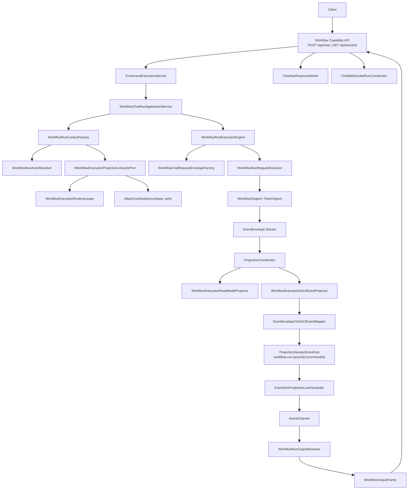
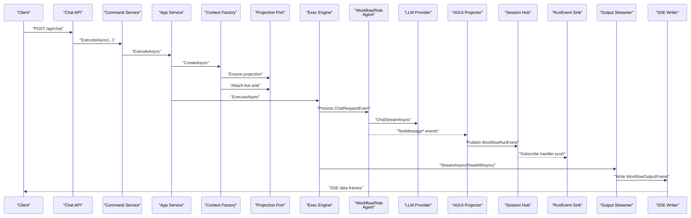
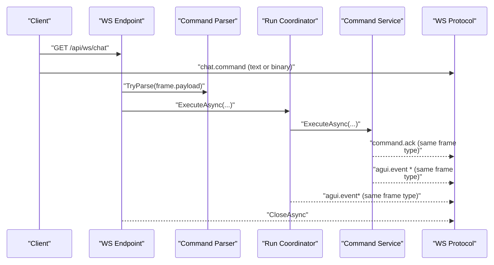
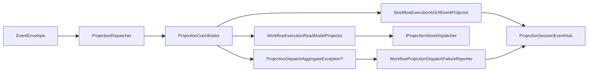
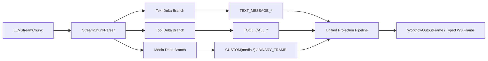

# Workflow LLM 流式链路详细架构文档（2026-02-25）

## 1. 目标与范围

本文档描述 Workflow 能力中 LLM 文本流的完整技术链路，覆盖：

1. `Host -> Application -> Domain -> Projection -> SSE/WS` 端到端执行路径。
2. 会话语义（`actorId/commandId/sessionId/messageId`）与事实源落点。
3. 统一投影链路中的分支协作（读模型分支 + AGUI 实时分支）。
4. 当前支持的流类型与扩展到非文本流的演进路径。

不包含内容：

1. Workflow YAML 业务编排语义细节（由 Workflow Core 文档负责）。
2. Provider SDK 内部实现细节（由 Provider 模块文档负责）。

## 2. 架构约束（本链路必须满足）

1. Host 只做协议适配与依赖组合，不承载业务状态机。
2. `Command -> Event` 与 `Query -> ReadModel` 严格分离。
3. CQRS 与 AGUI/SSE/WS 共享同一 Projection 输入链路，禁止双轨实现。
4. 投影运行态通过 lease/session 显式句柄管理，禁止中间层 `actorId -> context` 事实态反查。
5. 跨请求一致性事实必须落在 Actor 持久态/分布式状态，不依赖中间层进程内字典。

相关架构基线：

1. `docs/CQRS_ARCHITECTURE.md:43`
2. `docs/CQRS_ARCHITECTURE.md:46`
3. `docs/PROJECT_ARCHITECTURE.md:79`

## 3. 组件与分层

| 层 | 组件 | 职责 |
|---|---|---|
| Host | `WorkflowCapabilityEndpoints`、`ChatSseResponseWriter`、`ChatWebSocketRunCoordinator` | 协议适配（HTTP/SSE/WS），不编排业务 |
| Application | `WorkflowRunContextFactory`、`WorkflowRunExecutionEngine`、`WorkflowRunOutputStreamer` | 上下文构建、执行调度、输出帧流化 |
| Domain/AI | `WorkflowGAgent`、`LLMCallModule`、`RoleGAgent`、`ChatRuntime` | 触发 LLM 调用、发布文本/工具事件 |
| Projection | `WorkflowExecutionReadModelProjector`、`WorkflowExecutionAGUIEventProjector` | 读模型更新 + 实时事件分发 |
| Streaming | `ProjectionSessionEventHub<WorkflowRunEvent>`、`EventChannel<WorkflowRunEvent>` | 会话事件总线与 live sink 通道 |

关键代码锚点：

1. `src/workflow/Aevatar.Workflow.Infrastructure/CapabilityApi/ChatEndpoints.cs:17`
2. `src/workflow/Aevatar.Workflow.Application/Runs/WorkflowRunContextFactory.cs:53`
3. `src/workflow/Aevatar.Workflow.Application/Runs/WorkflowRunExecutionEngine.cs:29`
4. `src/Aevatar.AI.Core/RoleGAgent.cs:106`
5. `src/Aevatar.AI.Core/Chat/ChatRuntime.cs:89`
6. `src/workflow/Aevatar.Workflow.Presentation.AGUIAdapter/WorkflowExecutionAGUIEventProjector.cs:34`
7. `src/Aevatar.CQRS.Projection.Core/Streaming/ProjectionSessionEventHub.cs:21`

## 4. 整体拓扑图

## 5. 端到端执行链路

### 5.1 SSE 路径（`POST /api/chat`）

链路锚点：

1. `src/workflow/Aevatar.Workflow.Infrastructure/CapabilityApi/ChatEndpoints.cs:44`
2. `src/workflow/Aevatar.Workflow.Application/Runs/WorkflowRunContextFactory.cs:62`
3. `src/workflow/Aevatar.Workflow.Application/Runs/WorkflowRunExecutionEngine.cs:51`
4. `src/Aevatar.AI.Core/RoleGAgent.cs:122`
5. `src/workflow/Aevatar.Workflow.Presentation.AGUIAdapter/WorkflowExecutionAGUIEventProjector.cs:48`
6. `src/workflow/Aevatar.Workflow.Infrastructure/CapabilityApi/ChatSseResponseWriter.cs:45`

### 5.2 WebSocket 路径（`GET /api/ws/chat`，text/binary 类型化帧）

链路锚点：

1. `src/workflow/Aevatar.Workflow.Infrastructure/CapabilityApi/ChatEndpoints.cs:152`
2. `src/workflow/Aevatar.Workflow.Infrastructure/CapabilityApi/ChatWebSocketProtocol.cs:16`
3. `src/workflow/Aevatar.Workflow.Infrastructure/CapabilityApi/ChatWebSocketCommandParser.cs:20`
4. `src/workflow/Aevatar.Workflow.Infrastructure/CapabilityApi/ChatWebSocketRunCoordinator.cs:22`
5. `src/workflow/Aevatar.Workflow.Infrastructure/CapabilityApi/ChatCapabilityModels.cs:1`

分层说明：

1. `chat.command` 协议输入模型（`ChatInput`/`ChatWsCommand`）已下沉到 `Infrastructure/CapabilityApi`。
2. `Application.Abstractions` 保留运行编排契约，不再承载宿主传输协议 DTO。

## 6. 统一投影分支与一对多分发

`ProjectionCoordinator` 按注册顺序调用多个 projector；单分支失败会聚合后统一上抛，不阻断其他分支尝试。

关键锚点：

1. `src/Aevatar.CQRS.Projection.Core/Orchestration/ProjectionCoordinator.cs:19`
2. `src/Aevatar.CQRS.Projection.Core/Orchestration/ProjectionCoordinator.cs:40`
3. `src/workflow/Aevatar.Workflow.Projection/Projectors/WorkflowExecutionReadModelProjector.cs:60`
4. `src/workflow/Aevatar.Workflow.Presentation.AGUIAdapter/WorkflowExecutionAGUIEventProjector.cs:45`
5. `src/workflow/Aevatar.Workflow.Projection/Orchestration/WorkflowProjectionDispatchFailureReporter.cs:38`

## 7. 会话语义与状态事实源

### 7.1 关键标识

| 标识 | 生成位置 | 语义范围 | 事实源 | 主要消费点 |
|---|---|---|---|---|
| `actorId` | `WorkflowRunActorResolver` | Workflow Actor 维度 | Actor Runtime | 投影上下文、查询接口 |
| `commandId` | `WorkflowCommandContextPolicy` | 一次 run 命令维度 | Application CommandContext | `workflow-run:{actorId}:{commandId}` 会话流 |
| `correlationId` | `WorkflowCommandContextPolicy` | 与 `commandId` 同步（默认同值） | Application CommandContext | `EventEnvelope.CorrelationId` |
| `sessionId` | `WorkflowRunCommandMetadataKeys.SessionId` | 本次 chat 会话维度 | Command metadata | `ChatRequestEvent.SessionId` |
| `chatSessionId` | `ChatSessionKeys.CreateWorkflowStepSessionId` | 单 workflow step 维度 | `scopeId:stepId` 规则 | `LLMCallModule` pending 匹配 |
| `messageId` | AGUI mapper | 单消息流维度 | `msg:{sessionId}` 或 `msg:{envelopeId}` | 文本增量拼装 |

锚点：

1. `src/workflow/Aevatar.Workflow.Application/Runs/WorkflowCommandContextPolicy.cs:20`
2. `src/workflow/Aevatar.Workflow.Application/Runs/WorkflowRunContextFactory.cs:41`
3. `src/workflow/Aevatar.Workflow.Application/Runs/WorkflowChatRequestEnvelopeFactory.cs:13`
4. `src/Aevatar.AI.Abstractions/ChatSessionKeys.cs:8`
5. `src/workflow/Aevatar.Workflow.Core/Modules/LLMCallModule.cs:58`
6. `src/workflow/Aevatar.Workflow.Presentation.AGUIAdapter/EventEnvelopeToAGUIEventMapper.cs:339`

### 7.2 运行态约束

1. live sink 订阅通过 `lease + sink` 显式绑定，订阅对象保存在 `WorkflowExecutionRuntimeLease` 的运行态集合。
2. 会话事件分发按 `scopeId=session actorId` 和 `sessionId=commandId` 二元键，不依赖中间层全局 `actorId->context` 映射。
3. sink 写入失败会按策略 detach，并尝试发布 run error 遥测事件。

锚点：

1. `src/workflow/Aevatar.Workflow.Projection/Orchestration/WorkflowExecutionRuntimeLease.cs:22`
2. `src/Aevatar.CQRS.Projection.Core/Orchestration/EventSinkProjectionSessionSubscriptionManager.cs:26`
3. `src/Aevatar.CQRS.Projection.Core/Streaming/ProjectionSessionEventHub.cs:77`
4. `src/workflow/Aevatar.Workflow.Projection/Orchestration/WorkflowProjectionSinkFailurePolicy.cs:39`

## 8. 事件模型与输出契约

### 8.1 LLM/AI 事件（Domain 侧）

| 事件 | 生产者 | 说明 |
|---|---|---|
| `TextMessageStartEvent` | `RoleGAgent` | 文本消息开始 |
| `TextMessageContentEvent` | `RoleGAgent` | 文本增量（delta） |
| `TextMessageEndEvent` | `RoleGAgent` | 文本消息结束（含完整 content） |
| `ToolCallEvent` | `RoleGAgent`、`ToolCallModule` | 流式工具调用（LLM delta）与模块级工具调用 |
| `ToolResultEvent` | `ToolCallModule` | 工具执行结果 |
| `ChatResponseEvent` | `WorkflowGAgent` 等 | 非流式回退路径 |

锚点：

1. `src/Aevatar.AI.Abstractions/ai_messages.proto:8`
2. `src/Aevatar.AI.Abstractions/ai_messages.proto:12`
3. `src/Aevatar.AI.Core/RoleGAgent.cs:114`
4. `src/workflow/Aevatar.Workflow.Core/Modules/ToolCallModule.cs:53`

### 8.2 WorkflowRunEvent（输出统一事件）

支持类型：

1. `RUN_STARTED / RUN_FINISHED / RUN_ERROR`
2. `STEP_STARTED / STEP_FINISHED`
3. `TEXT_MESSAGE_START / TEXT_MESSAGE_CONTENT / TEXT_MESSAGE_END`
4. `TOOL_CALL_START / TOOL_CALL_END`
5. `STATE_SNAPSHOT / CUSTOM`

锚点：

1. `src/workflow/Aevatar.Workflow.Application.Abstractions/Runs/WorkflowRunEventTypes.cs:3`
2. `src/workflow/Aevatar.Workflow.Application.Abstractions/Runs/WorkflowRunEventContracts.cs:13`
3. `src/workflow/Aevatar.Workflow.Application/Runs/WorkflowOutputFrameMapper.cs:11`
4. `src/workflow/Aevatar.Workflow.Projection/Orchestration/WorkflowRunEventSessionCodec.cs:17`

### 8.3 支持矩阵（当前实现）

| 流类型 | 当前状态 | 说明 |
|---|---|---|
| 文本增量流（delta text） | 已支持 | 主链路能力 |
| 工具调用结果流 | 已支持 | 通过 AGUI ToolCall 映射进入统一输出 |
| 状态快照流 | 已支持 | `STATE_SNAPSHOT` 统一携带 `actorId/commandId/projectionCompletion*` 与可选 projection snapshot |
| 流式 `DeltaToolCall` | 已支持 | Provider -> `ChatRuntime` -> `RoleGAgent` 贯通，转为 `ToolCallEvent` |
| WS 二进制命令/事件帧 | 已支持 | `ChatWebSocketProtocol` + `ChatWebSocketMessageContracts` 统一 text/binary 与 `ack/event/error` 强类型出站 |
| 多模态业务事件（音频/图像/video） | 待扩展 | 统一事件模型尚无 `MEDIA_*` 专用语义事件类型 |

锚点：

1. `src/Aevatar.AI.Abstractions/LLMProviders/LLMResponse.cs:34`
2. `src/Aevatar.AI.Core/Chat/ChatRuntime.cs:89`
3. `src/workflow/Aevatar.Workflow.Infrastructure/CapabilityApi/ChatWebSocketProtocol.cs:16`
4. `src/workflow/Aevatar.Workflow.Infrastructure/CapabilityApi/ChatWebSocketMessageContracts.cs:5`
5. `src/workflow/Aevatar.Workflow.Infrastructure/CapabilityApi/ChatWebSocketRunCoordinator.cs:20`

## 9. 失败处理与收敛语义

1. run 完成判定基于输出帧类型：`RUN_FINISHED -> Completed`，`RUN_ERROR -> Failed`。
2. Projection dispatch 失败会写入 `PROJECTION_DISPATCH_FAILED` 运行错误事件。
3. sink 背压/写入异常触发 detach，避免阻塞主处理链路，并以 best-effort 发布运行错误。
4. 收尾阶段固定执行：detach sink -> await processing -> release projection -> complete/dispose sink。

锚点：

1. `src/workflow/Aevatar.Workflow.Application/Runs/WorkflowRunCompletionPolicy.cs:12`
2. `src/workflow/Aevatar.Workflow.Projection/Orchestration/WorkflowProjectionDispatchFailureReporter.cs:40`
3. `src/workflow/Aevatar.Workflow.Projection/Orchestration/WorkflowProjectionSinkFailurePolicy.cs:39`
4. `src/workflow/Aevatar.Workflow.Application/Runs/WorkflowRunResourceFinalizer.cs:25`

## 10. 演进设计：扩展到多模态业务流

目标：在不破坏统一投影链路的前提下支持多模态业务事件（在 WS 类型化传输之上）。

建议改造顺序：

1. 为多模态 chunk 增加标准事件类型（如 `MEDIA_CHUNK` / `AUDIO_DELTA`），并映射到统一 `WorkflowRunEvent`。
2. 按媒体类型定义输出帧契约（metadata + binary payload 引用），避免在 text delta 中混载媒体语义。

本次重构已完成：

1. `ChatRuntime.ChatStreamAsync` 已接入 `DeltaToolCall` 聚合与透传。
2. `RoleGAgent` 已把流式工具调用转为 `ToolCallEvent` 发布到上行事件链路。
3. `WorkflowRunExecutionEngine` 已在 run 收敛后统一发出 `STATE_SNAPSHOT` 输出帧。
4. `ChatWebSocketProtocol`/`ChatWebSocketCommandParser` 已支持 text/binary 类型化帧输入输出，且回包帧类型与命令入帧一致。
5. `ChatWebSocketMessageContracts` 已统一 `command.ack / agui.event / command.error` 出站契约，移除匿名对象拼装分支。
6. `WorkflowRunEventTypes` 已成为 `Application/Projection` 共享的唯一事件类型常量源，消除跨层硬编码字符串漂移。
7. `ChatInput`/`ChatWsCommand` 已从 `Application.Abstractions` 移至 `Infrastructure/CapabilityApi`，恢复宿主协议与应用契约的边界分层。

## 11. 验证建议

最低验证命令：

1. `bash tools/ci/architecture_guards.sh`
2. `bash tools/ci/projection_route_mapping_guard.sh`
3. `dotnet test test/Aevatar.Workflow.Host.Api.Tests/Aevatar.Workflow.Host.Api.Tests.csproj --nologo`

推荐测试关注点：

1. SSE 文本增量顺序、终止帧与错误帧。
2. WS `command.ack -> agui.event*` 顺序稳定性（text/binary 两种帧类型）。
3. `commandId` 会话隔离（同 actor 多 command 并发）。
4. sink 背压异常下的 detach 与 run error 遥测。
