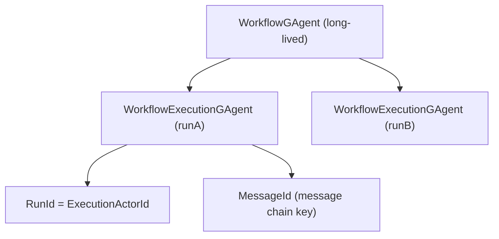
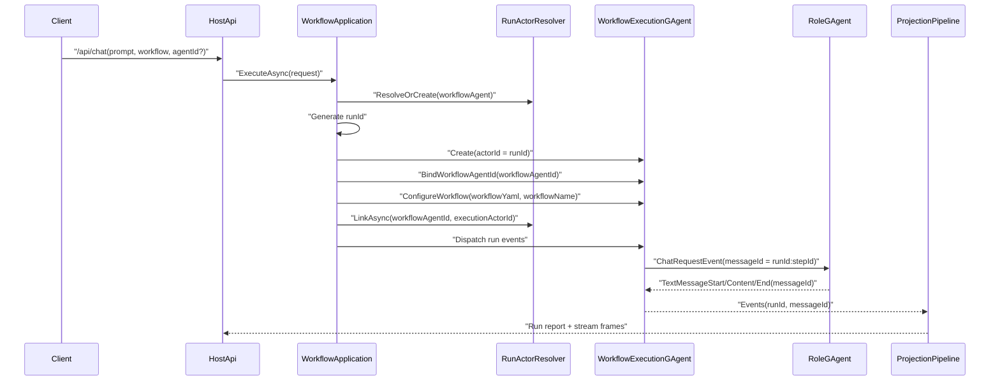

# Workflow Run Lifecycle（重构汇报稿）

## 执行摘要

这次重构的目标，是把“长期编排职责”和“单次执行职责”拆开，解决当前一个 `WorkflowGAgent` 同时承担模板管理、运行执行、并发隔离带来的复杂度问题。

目标方案是：

- `WorkflowGAgent` 作为长期编排实例，负责 workflow 定义、策略和入口。
- `WorkflowExecutionGAgent` 作为一次 run 的执行实例，`AgentId` 与 `RunId` 同值。
- `MessageId` 保留为 AI 消息链路标识，不与 `RunId` 合并。

这套模型的核心收益是：执行隔离更清晰、查询主键统一、并发场景更稳，且与现有 CQRS 投影链路兼容。

## 1. 背景与重构目标

### 1.1 当前痛点

- 同一个编排实例承载多次执行，运行态与编排态边界不清。
- `RunId`、`ActorId`、`MessageId` 在语义上容易被混用，讨论成本高。
- 并发执行时，步骤回包关联和排障依赖更多约定，维护成本上升。

### 1.2 重构目标

1. 每次执行具备独立 actor 身份，执行边界与生命周期清晰。
2. `RunId` 成为唯一执行主键，查询和追踪统一。
3. 保留 `MessageId` 的消息链路能力，避免流式与投影能力回退。

## 2. 目标架构

### 2.1 角色分工

- `WorkflowGAgent`（long-lived）
  - 保存 workflow 定义与配置。
  - 接收入口请求并选择/创建执行实例。
  - 不承载单次 run 的可变执行状态。
- `WorkflowExecutionGAgent`（per-run）
  - 处理本次 run 的步骤推进、事件发布、回包关联。
  - run 结束后销毁或回收。

### 2.2 标识符职责边界

| 标识符 | 作用域 | 主用途 | 结论 |
|---|---|---|---|
| `WorkflowGAgent.AgentId` | 长期编排主体 | 入口与编排身份 | 不等于 `RunId` |
| `RunId` | 单次执行 | 执行主键、查询主键 | 等于 `ExecutionActorId` |
| `WorkflowExecutionGAgent.AgentId` | 单次执行 actor | 运行隔离与线程标识 | 与 `RunId` 同值 |
| `MessageId` | AI 消息链路 | 流式消息聚合、回包匹配 | 不能删除 |

## 3. 关键设计：Execution 如何定位长期 Workflow

核心原则：**执行实例不做运行时搜索，编排层在创建时显式绑定 owner。**

标准流程：

1. 入口先定位长期 `WorkflowGAgent`（`agentId` 命中则复用，否则创建并配置）。
2. 生成 `RunId`。
3. 创建 `WorkflowExecutionGAgent`，并强制 `executionActorId = runId`。
4. 调用 `BindWorkflowAgentId(workflowAgentId)` 显式绑定 owner。
5. 调用 `ConfigureWorkflow(workflowYaml, workflowName)` 完成 execution 初始化。
6. 建立父子关系：`LinkAsync(workflowAgentId, executionActorId)`。
7. 执行阶段若需回调编排实例，直接 `SendToAsync(workflowAgentId, evt)`。

设计约束：

- 禁止按 `workflowName` 扫描 owner。
- `workflowAgentId` 在 run 生命周期内不可变。
- owner 丢失时快速失败，输出明确错误事件。

## 4. 一次请求的调用链与参数赋值

参数赋值表：

| 参数 | 来源 | 赋值规则 | 消费方 |
|---|---|---|---|
| `prompt` | 请求体 | `ChatInput.Prompt` 原样传递 | `ChatRequestEvent.Prompt` |
| `workflowName` | 请求体 | 为空走默认 workflow | workflow 加载/解析 |
| `agentId` | 请求体 | 定位长期 `WorkflowGAgent` | actor resolver |
| `runId` | 服务端生成 | 每次 run 生成一次 | 执行事件、投影、查询 |
| `executionActorId` | 服务端派生 | `executionActorId = runId` | runtime、routing、thread |
| `workflowAgentId` | 服务端解析 | owner id，创建 execution 时写入 | execution 回调编排主体 |
| `threadId` | 服务端派生 | 对外输出使用 `executionActorId` | SSE/WS 输出 |
| `messageId` | 服务端生成 | 入口 `chat-{guid}`；步骤 `runId:stepId`（`:attempt` 预留） | LLM 回包关联、消息聚合 |

## 5. 为什么 `MessageId` 不能删

`RunId` 和 `MessageId` 不是同一层标识。`RunId` 管执行实例，`MessageId` 管消息会话链路。

删除 `MessageId` 后会直接影响：

1. 步骤回包匹配失效  
   - `LLMCallModule` 依赖 `messageId` 关联 `_pending` 请求。
2. AI 事件 run 归属能力下降  
   - `AIChatMessageRunIdResolver` 通过 `messageId` 反解 `runId`。
3. 流式消息聚合受损  
   - AGUI 侧 `msg:{messageId}` 无法稳定归并 start/content/end。
4. 读模型可观测性下降  
   - role reply 与 timeline 的 `message_id` 维度丢失。

结论：`MessageId` 必须保留，但它不是执行主键。

## 6. 落地步骤（建议汇报用）

### 阶段 1：模型落地

- 新增 `WorkflowExecutionGAgent`，定义 owner 绑定字段（`workflowAgentId`）。
- 调整 run 启动流程，改为“先定位 workflow agent，再创建 execution agent”。
- 强制 `executionActorId = runId`。

### 阶段 2：链路切换

- 执行事件改为由 `WorkflowExecutionGAgent` 产生。
- 输出 `threadId` 统一切到 execution actor id。
- pending/关联键检查并统一为 run 作用域。

### 阶段 3：验证与收口

- 并发 run 压测（同一 `WorkflowGAgent` 多 run）。
- 回包匹配与流式聚合验证（`MessageId` 维度）。
- 读模型查询一致性验证（`/api/runs/{runId}`）。

## 7. 风险与控制

| 风险 | 表现 | 控制策略 |
|---|---|---|
| owner 绑定遗漏 | execution 无法回调 workflow | 创建时强制校验 `workflowAgentId` |
| run/thread 标识不一致 | 前端线程展示混乱 | 统一 `threadId = executionActorId` |
| session 格式不统一 | 回包匹配或聚合异常 | 固化规范：`chat-{guid}` 与 `runId:stepId`（`:attempt` 预留） |
| 迁移阶段行为漂移 | 新旧链路结果不一致 | 灰度开关 + 双链路对比 |

## 8. 验收标准

1. 一次 run 只对应一个 `WorkflowExecutionGAgent`，且 `AgentId == RunId`。
2. 同一 `WorkflowGAgent` 并发多 run 时无串线。
3. SSE/WS 全链路可用，`RUN_STARTED/RUN_FINISHED` 标识稳定。
4. 查询侧按 `runId` 可稳定获取完整报告。
5. 删除 `MessageId` 的回归测试明确失败（作为保护性用例）。

## 9. 代码锚点（便于评审）

- 入口解析：`src/Aevatar.Host.Api/Endpoints/ChatEndpoints.cs`
- WS 入口：`src/Aevatar.Host.Api/Endpoints/ChatWebSocketRunCoordinator.cs`
- 编排入口：`src/workflow/Aevatar.Workflow.Application/Runs/WorkflowChatRunApplicationService.cs`
- 编排主体定位：`src/workflow/Aevatar.Workflow.Application/Runs/WorkflowRunActorResolver.cs`
- 运行编排：`src/workflow/Aevatar.Workflow.Application/Orchestration/WorkflowExecutionRunOrchestrator.cs`
- 执行实例：`src/workflow/Aevatar.Workflow.Core/WorkflowExecutionGAgent.cs`
- 工作流快照：`src/workflow/Aevatar.Workflow.Core/WorkflowDefinitionSnapshot.cs`
- `RunId` 生成：`src/workflow/Aevatar.Workflow.Application/Runs/WorkflowChatRunApplicationService.cs`
- `RunId` 注入：`src/workflow/Aevatar.Workflow.Application/Runs/WorkflowChatRequestEnvelopeFactory.cs`
- `RunId` 提取：`src/workflow/Aevatar.Workflow.Core/WorkflowGAgent.cs`
- `MessageId` 规范：`src/Aevatar.AI.Abstractions/ChatMessageKeys.cs`
- 会话关联：`src/workflow/Aevatar.Workflow.Core/Modules/LLMCallModule.cs`

---

相关文档：`docs/IDENTIFIER_RELATIONSHIPS.md`
