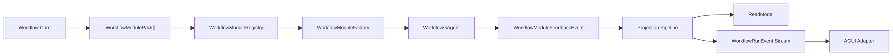

# Workflow 统一 Module 体系重构方案（无兼容包袱）

## 1. 目标

建立一套统一的 Module 体系，覆盖：

1. Workflow 内建模块（core modules）
2. Workflow 扩展模块（extension modules）

要求：

1. 定义方式统一
2. 装配方式统一
3. 回传方式统一（ReadModel / RunEvent / AGUI）
4. 核心层仅依赖抽象，不感知 Maker 等具体扩展

## 2. 现状架构分析

### 2.1 当前有效能力

1. Workflow 核心与扩展模块统一通过 `IWorkflowModulePack` 注册。  
   参考：`src/workflow/Aevatar.Workflow.Core/IWorkflowModulePack.cs`
2. 运行时由 `WorkflowModuleFactory` 聚合所有 pack 并按名称创建模块（同名冲突 fail-fast）。  
   参考：`src/workflow/Aevatar.Workflow.Core/WorkflowModuleFactory.cs`
3. Maker 已迁移为 `MakerModulePack`，不再单独注入 `IEventModuleFactory`。  
   参考：`src/workflow/extensions/Aevatar.Workflow.Extensions.Maker/MakerModulePack.cs`
4. 投影与 AGUI 已有可扩展点（reducer/projector/handler）。  
   参考：`src/workflow/Aevatar.Workflow.Projection/DependencyInjection/ServiceCollectionExtensions.cs`  
   参考：`src/workflow/Aevatar.Workflow.Presentation.AGUIAdapter/EventEnvelopeToAGUIEventMapper.cs`

### 2.2 核心问题

1. 模块定义双轨已消除，但“执行 + 回传 + 投影 + 展示”仍未完全纳入同一 pack 贡献模型。
2. 扩展回传语义目前仍偏约定式（如 `StepCompletedEvent.Metadata` 前缀键），缺少统一反馈契约。
3. 查询面缺少标准化扩展视图，扩展数据更多停留在 timeline/metadata 层。
4. 扩展治理粒度仍可增强：需要对“新增模块包必须带回传链路测试”做硬性门禁。

结论：当前已完成“统一模块定义”，但尚未完成“统一扩展回传平面”。

## 3. 重构原则（最佳实践）

1. 单一扩展模型：内建与扩展都实现同一套 Module 贡献抽象。
2. 插件化装配：扩展通过一个入口完成全量贡献注册。
3. 事件化回传：扩展反馈走统一事件契约，不依赖隐式 metadata 约定。
4. 严格依赖反转：Workflow 核心只依赖抽象和贡献聚合器。
5. 无兼容包袱：删除旧双轨路径，不保留过渡层。

## 4. 目标架构

## 5. 统一抽象设计

### 5.1 模块贡献抽象

新增统一抽象（建议命名）：

1. `IWorkflowModulePack`
2. `WorkflowModulePackDescriptor`

`IWorkflowModulePack` 统一提供：

1. `Modules`：模块描述符集合（名称、工厂、优先级、别名）
2. `DependencyExpanders`：模块依赖扩展器
3. `Configurators`：模块配置器
4. `FeedbackContributors`：反馈贡献器（可选）
5. `ProjectionContributors`：投影贡献器（可选）
6. `PresentationContributors`：AGUI/RunEvent 映射贡献器（可选）

说明：

1. 内建 Workflow 模块实现为 `WorkflowCoreModulePack`
2. Maker 实现为 `MakerModulePack`
3. 不再允许扩展独立实现 `IEventModuleFactory` 直连装配

### 5.2 运行时模块注册

新增 `WorkflowModuleRegistry`：

1. 聚合所有 `IWorkflowModulePack`
2. 构建最终模块名到描述符映射（冲突 fail-fast）
3. 向 `WorkflowModuleFactory` 暴露只读注册视图

冲突策略（强制）：

1. 同名模块禁止静默覆盖
2. 同名冲突启动失败并输出冲突来源 pack

### 5.3 统一反馈契约

新增领域事件（建议）：

1. `WorkflowModuleFeedbackEvent`

关键字段：

1. `module_name`
2. `feedback_type`
3. `step_id`
4. `scope`（`run/step/actor`）
5. `attributes`
6. `payload_json`

规则：

1. 模块主反馈语义必须发 `WorkflowModuleFeedbackEvent`
2. `StepCompletedEvent.Metadata` 只作补充，不作主反馈渠道

### 5.4 统一回传链路

通过一个反馈 projectors/reducers 分支处理 `WorkflowModuleFeedbackEvent`：

1. 更新 ReadModel 扩展区
2. 发布统一 `WorkflowRunEvent` 扩展事件（如 `MODULE_FEEDBACK`）
3. AGUI 映射为标准 `CustomEvent`（如 `aevatar.module.feedback`）

## 6. 分层边界重构

### 6.1 Workflow.Core

保留：

1. 模块执行语义
2. 模块编排抽象

新增：

1. `IWorkflowModulePack` 抽象定义
2. `WorkflowModuleRegistry`

删除：

1. 仅为扩展单独存在的模块装配路径

### 6.2 Workflow.Extensions.*

每个扩展只保留一个入口：

1. `AddWorkflowXxxExtensions()`

入口注册：

1. `IWorkflowModulePack` 实现
2. 该 pack 的反馈/投影/展示贡献（如有）

### 6.3 Projection / Presentation

新增统一贡献注册器：

1. 从 `IWorkflowModulePack` 收集并注册反馈相关 reducer/projector/mapper

禁止：

1. 在 Workflow 主干写 `if (maker)` 之类硬编码分支

## 7. 实施阶段（建议）

### Phase 1：统一定义层

1. 引入 `IWorkflowModulePack` 与统一模块注册模型（已完成）
2. 将内建模块迁移到 `WorkflowCoreModulePack`（已完成）
3. 将 Maker 迁移到 `MakerModulePack`（已完成）

### Phase 2：统一回传层

1. 引入 `WorkflowModuleFeedbackEvent`
2. 引入统一 feedback projector/reducer
3. 引入统一 run-event 与 AGUI feedback 映射

### Phase 3：删除双轨与清理

1. 删除扩展专用旧装配路径
2. 删除 metadata 主语义回传约定
3. 更新文档与测试

## 8. CI 门禁建议

1. 禁止扩展模块通过独立 `IEventModuleFactory` 直接注入（必须通过 `IWorkflowModulePack`）。
2. 禁止模块主反馈仅依赖 `StepCompletedEvent.Metadata`。
3. 新增模块包必须含：
   - 至少一个执行测试
   - 至少一个回传链路测试（ReadModel/RunEvent/AGUI 任一）
4. 模块名冲突必须 fail-fast，不允许覆盖。

## 9. 验收标准

1. 内建与扩展模块使用同一注册模型与冲突规则。
2. 新增扩展模块不改 Workflow 主干代码。
3. 模块反馈可统一进入 ReadModel、RunEvent、AGUI。
4. 架构门禁、构建、测试全部通过。

## 10. 结论

你的思路是正确且符合最佳实践：  
“把扩展当成与内建同构的 Module 贡献，而不是第二套系统”。

本方案将当前“可扩展”升级为“统一可治理扩展”，并且为未来分布式运行态与非 InMemory 持久化留出稳定演进面。
