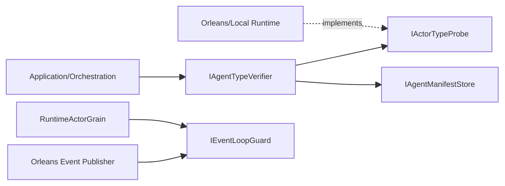

# 未提交改动重构计划（2026-02-22，V2）

## 1. 背景与结论

输入依据：

1. `docs/audit-scorecard/worktree-architecture-scorecard-2026-02-22.md`
2. 当前实现代码与测试（Orleans publisher、Projection coordinator、Workflow actor port）

现状：本轮修复已通过 build/test/guards，但仍存在“可运行但设计不稳”的结构性问题。

结论：需要从“局部修补”升级为“统一策略重构”，目标是降低语义漂移和后续维护成本，而不是继续打补丁。

## 2. 核心问题（本次重构输入）

1. 类型判定逻辑重复。
   - `src/Aevatar.CQRS.Projection.Core/Orchestration/ActorProjectionOwnershipCoordinator.cs`
   - `src/workflow/Aevatar.Workflow.Infrastructure/Runs/WorkflowRunActorPort.cs`
2. 类型匹配仍偏字符串语义（`Type.GetType + FullName` 兜底），边界稳定性不足。
3. 类型事实源未统一，业务层直接依赖 manifest，缺少 runtime 权威探针。
4. Orleans 环路抑制规则仍是局部特判（`Self` 早返回），未沉淀为统一 loop guard 策略。

## 3. 重构目标

1. 单一策略：所有“actor 是否为某类型”的判断走同一抽象与实现。
2. 单一事实源：运行时类型优先从 runtime 获取，manifest 作为补偿来源。
3. 规则下沉：publisher 链追加与环路抑制由统一策略组件负责，调用侧只编排。
4. 可验证：新增测试覆盖“延迟 manifest、相似类型名、多跳回环”。

## 4. 目标架构（重构后）

## 5. 方案设计

### 5.1 统一类型验证组件

新增抽象（建议放在 `Aevatar.Foundation.Abstractions`）：

1. `IAgentTypeVerifier`
   - `Task<bool> IsExpectedAsync(string actorId, Type expectedType, CancellationToken ct = default)`
2. `IActorTypeProbe`
   - `Task<string?> GetRuntimeAgentTypeNameAsync(string actorId, CancellationToken ct = default)`

默认验证顺序：

1. 先用 `IActorTypeProbe` 获取 runtime 类型名（权威、实时）。
2. runtime 无法获取时回退 manifest。
3. 两者都不可用时返回 false（fail-fast），由调用方决定抛错。

### 5.2 类型匹配算法统一

新增内部工具（建议放在 `Aevatar.Foundation.Core/TypeSystem`）：

1. 只接受三种合法输入：
   - `AssemblyQualifiedName`
   - `FullName`
   - 可解析为 `Type` 的字符串
2. 匹配规则：
   - `Type.GetType` 成功 => `expectedType.IsAssignableFrom(resolved)`
   - 否则仅做 `FullName` 严格相等比较（含去除逗号后程序集尾部）
3. 明确禁止：`Contains`、`StartsWith`、模糊子串匹配。

### 5.3 Orleans 环路抑制策略化

新增策略抽象（建议放在 `Aevatar.Foundation.Runtime.Implementations.Orleans/Propagation`）：

1. `IEventLoopGuard`
   - `bool ShouldDrop(string selfActorId, EventEnvelope envelope)`
   - `void BeforeDispatch(string senderActorId, string targetActorId, EventEnvelope envelope)`

规则要求：

1. `BeforeDispatch` 统一决定是否追加 `__publishers`。
2. `ShouldDrop` 在接收侧统一执行，不把策略散落到 publisher 和 grain。
3. `Self` 发送不追加自身 publisher；远端发送追加并去重。

### 5.4 业务侧收敛改造

替换以下文件内的私有匹配函数，统一调用 `IAgentTypeVerifier`：

1. `src/Aevatar.CQRS.Projection.Core/Orchestration/ActorProjectionOwnershipCoordinator.cs`
2. `src/workflow/Aevatar.Workflow.Infrastructure/Runs/WorkflowRunActorPort.cs`

要求：

1. 删除重复 `MatchesExpectedType`。
2. 业务层只表达“需要某类型 actor”，不承担解析细节。

## 6. 分阶段实施

### Phase 1：抽象与基础实现

1. 引入 `IAgentTypeVerifier`、`IActorTypeProbe` 抽象与默认实现。
2. Local runtime 与 Orleans runtime 实现 `IActorTypeProbe`。
3. DI 注册统一接入 `src/Aevatar.Foundation.Runtime.Hosting/DependencyInjection/ServiceCollectionExtensions.cs`。

### Phase 2：替换业务入口

1. 改造 `ActorProjectionOwnershipCoordinator` 使用 verifier。
2. 改造 `WorkflowRunActorPort` 使用 verifier。
3. 删除两处重复类型匹配私有方法。

### Phase 3：Orleans loop guard 策略化

1. 引入 `IEventLoopGuard` 并在 publisher/grain 两侧接入。
2. 删除调用侧局部特判（仅保留必要路由分支，不承载策略语义）。
3. 保持现有行为不回退：Self 不误杀，远端回环可抑制。

### Phase 4：测试与门禁

1. 新增 `IAgentTypeVerifier` 单元测试矩阵：
   - AssemblyQualifiedName 命中
   - FullName 命中
   - 相似类型名拒绝
   - runtime/manifest 不一致时 runtime 优先
2. Orleans 新增多跳回环测试：
   - `Self -> Self`
   - `A -> B -> A`
   - `A -> parent + children(Both)`
3. 全量验证命令通过。

## 7. 验收标准

1. `Coordinator` 与 `WorkflowRunActorPort` 不再包含私有类型匹配实现。
2. 代码库中不再出现与 actor 类型判定相关的 `Contains` 兜底。
3. Orleans 环路规则由 `IEventLoopGuard` 单点实现与复用。
4. 以下命令全部通过：
   - `dotnet build aevatar.slnx --nologo --no-restore -m:1 -nodeReuse:false --tl:off`
   - `dotnet test aevatar.slnx --nologo --no-build --no-restore -m:1 -nodeReuse:false --tl:off`
   - `bash tools/ci/architecture_guards.sh`
   - `bash tools/ci/projection_route_mapping_guard.sh`

## 8. 风险与回退

1. 风险：引入 verifier 后本地测试假实现不足，导致误报。
   - 应对：为 `IActorTypeProbe` 提供稳定 fake，并在测试中明确 probe 结果。
2. 风险：Orleans loop guard 改造引入边界回归。
   - 应对：先以现有测试锁定行为，再增量替换策略。
3. 风险：runtime 类型探针在未初始化 actor 上返回空。
   - 应对：定义空值语义为“不可证明”，业务层 fail-fast。

## 9. 产出清单

1. 结构重构文档（本文）。
2. 类型验证统一抽象与实现（Foundation 层）。
3. Orleans loop guard 统一策略与回归测试。
4. 复评文档更新（`docs/audit-scorecard/worktree-architecture-scorecard-2026-02-22.md`）。
