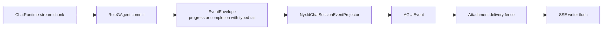

# ADR-0015: AGUI / SSE Projection Session Pipeline

> 2026-07-21 update: NyxIdChat live output is actor-committed progress. Text,
> reasoning, media, tool lifecycle, usage, authorization, and terminal frames
> use one `EventEnvelope -> Projection -> AGUI -> SSE` path with actor-owned
> monotonic sequence. Normal completion is final authority but emits no repeated
> presentation batch; only explicit replay expands a committed snapshot.

> 2026-06-03 update: the pipeline is the common projection-backed realtime
> control stream shape, not only AGUI/SSE. Text AGUI frames and voice
> control/transcript frames share the same session lifecycle contract through
> `IRealtimeSession`; raw voice PCM remains outside projection through a
> volatile media stream port.

> 2026-05-25 update: `StreamingProxy` remains in this ADR only as a retained compatibility surface. The `/api/scopes/{scopeId}/streaming-proxy/...` Host route is deprecated and sends `Deprecation: true`, `Sunset: Wed, 25 Nov 2026 00:00:00 GMT`, and a successor `Link` to `/v1/responses`. Direct model streaming should migrate to `/v1/responses`; room CRUD, participant management, and room fan-out are separate semantics and are not replaced one-for-one by `/v1/responses`.

## Context

Issue #204 收敛的是同一类架构问题：多个用户可见 streaming 入口各自维护一套 host-owned orchestration。

典型问题包括：

- endpoint 直接订阅 raw `EventEnvelope`
- endpoint 在 stream 方法里直接 `CreateAsync(...)` / `HandleEventAsync(...)`
- completion 依赖 `TaskCompletionSource`、`Timer`、`Channel close` 等进程内偶然状态
- AGUI / SSE 映射散落在 Host / endpoint / agent 项目中
- `StreamingProxy` 的 durable completion 尚未收敛到 committed terminal fact + current-state readmodel

这与仓库的顶级架构要求冲突：Host 不能承载核心编排，CQRS 与 AGUI 必须走同一套 Projection Pipeline，查询必须读取 readmodel，不得读取 runtime lease 或 query-time 拼装状态。

## Decision

### 1. 用户可见 streaming / realtime control 入口统一走 Projection Session Pipeline

以下入口统一回到 interaction service 或等价 projection-session subscription port：

- `agents/Aevatar.GAgents.NyxidChat/NyxIdChatEndpoints.cs`
- `agents/Aevatar.GAgents.StreamingProxy/StreamingProxyEndpoints.cs`
- `src/platform/Aevatar.GAgentService.Hosting/Endpoints/ScopeGAgentEndpoints.cs`
- `src/platform/Aevatar.GAgentService.Hosting/Endpoints/ScopeServiceEndpoints.cs`

Host 只负责：

1. 解析 HTTP 请求
2. 调用 command port / subscription port
3. 提供 `emitAsync` 或 SSE writer

Host 不再拥有 observation lifecycle、completion 判定、runtime lease 状态或 raw stream subscription。

The application-facing lifecycle contract is
`IRealtimeSession<TInbound,TReceipt,TStartError,TOutboundFrame,TCompletion>`.
`ICommandInteractionService` is the text/AGUI specialization of that contract;
voice control/transcript uses the same lifecycle and emits `VoiceRealtimeFrame`
through the projection-backed realtime stream.

### 2. Projection session 分为两类权威键语义

- `command-scoped`: `(RootActorId, SessionId = commandId)`
- `subscription-scoped`: `(RootActorId, SessionId = typed subscriptionId)`

规则：

- AI chat / AGUI 主线默认使用 command-scoped session
- `StreamingProxy room message stream` 使用 subscription-scoped session
- 被动订阅入口不得伪造 `commandId` 充当 `subscriptionId`
- HTTP `scopeId` 是租户/范围语义，不进入 projection session key

### 3. AGUI / SSE 映射属于 projection-owned 组件

`accepted/context`、正文事件、tool 事件、terminal 事件统一由 interaction layer、projector、mapper 或 adapter 发出。

规则：

- Host 不得手搓 `aevatar.run.context` payload
- Host 不得直接把 raw `EventEnvelope` 映射成用户可见 SSE
- typed custom event payload 必须在 abstraction / adapter 边界建模，不得回退成匿名 bag
- voice raw PCM is not an AGUI/control frame. It must stay on the volatile media
  transport port and must not be stored, projected, or replayed.

### 3.1 NyxIdChat live progress is a committed actor contract

`RoleGAgent` owns `RoleChatSessionProgressedEvent.session_id + sequence + oneof payload`. The sequence increases monotonically inside actor state. The NyxIdChat projector consumes only committed envelopes and maps each payload to AGUI with the same sequence. The projection scope persists a watermark per origin actor, rather than using one ambiguous cross-publisher counter, and drops duplicate or stale committed deliveries before fan-out during normal observation. Explicit replay of a recorded projection failure bypasses that fence, so an older failed version remains recoverable after a newer version succeeds. Each explicit sink attachment also owns a narrow delivery fence for post-fan-out broker retries: lower sequences and identical protobuf frames at the latest sequence are dropped, while distinct replay frames sharing one sequence are preserved. The fence is released with the attachment and is not a session registry or business fact source.



Required behavior:

- projection does not consume transient text/usage publications and Host does not subscribe to raw actor events;
- `TOOL_CALL_START` is committed before advancing the stream into tool execution;
- initial skill recovery and text-parsed tools use the same start-before-execution and result lifecycle as provider-native tool calls;
- normal `RoleChatSessionCompletedEvent` embeds its typed terminal tail in one committed fact; projection expands only that tail and never the live completion snapshot;
- a different-input retry emits a typed command-attempt rejection and does not advance or replace the completed session's final authority; projection still accepts the legacy session-conflict protobuf full name during rolling upgrades;
- tool approval is a typed sequenced progress payload; raw pending-state commits do not bypass the progress sequence;
- the descriptor resolved and cloned at tool start is copied into completion/replay and never rediscovered; argument-dependent tools such as `use_skill` resolve the actual invocation identity before the snapshot;
- explicit replay is a typed progress payload, restores tool, reasoning, media, text, usage, and terminal frames from the committed snapshot, and does not commit a second completion;
- attachment-scoped sequence/protobuf fencing removes post-fan-out duplicates without collapsing distinct frames in a multi-frame replay sequence;
- no in-process session registry, callback-owned progress state, `Task.Run`, or extra projection transport envelope is introduced.

### 4. StreamingProxy durable completion 必须落到 committed terminal fact

`StreamingProxy room chat stream` 的权威终态链路固定为：

1. `StreamingProxyChatSessionController` 发布 committed terminal event
2. `StreamingProxyChatSessionTerminalProjector` 物化 `StreamingProxyChatSessionTerminalSnapshot`
3. `IStreamingProxyChatSessionTerminalQueryPort` 只读取该 snapshot
4. `StreamingProxyChatDurableCompletionResolver` 只允许用 terminal query port 补齐 durable completion

禁止：

- 从 runtime lease / context / timer 状态推导终态
- 通过 query-time replay 或 query-time priming 补 readmodel
- 以 channel close / detach / callback 线程状态冒充 terminal fact

### 5. current-state readmodel guard 在本设计中是强制项

本 ADR 明确引入：

- `StreamingProxyChatSessionTerminalSnapshot`
- `IStreamingProxyChatSessionTerminalQueryPort`

它们属于 current-state readmodel 与 query path 变更，因此以下 guard 不是“如果碰到了再跑”，而是本设计默认强制门禁：

- `bash tools/ci/query_projection_priming_guard.sh`
- `bash tools/ci/projection_state_version_guard.sh`
- `bash tools/ci/projection_state_mirror_current_state_guard.sh`

任何实现若绕过这些 guard，不满足本 ADR。

## Required Verification

Issue #204 进入实现后，提交前至少执行：

```bash
dotnet build aevatar.slnx --nologo
dotnet test aevatar.slnx --nologo
bash tools/ci/test_stability_guards.sh
bash tools/ci/architecture_guards.sh
bash tools/ci/workflow_binding_boundary_guard.sh
bash tools/ci/query_projection_priming_guard.sh
bash tools/ci/projection_state_version_guard.sh
bash tools/ci/projection_state_mirror_current_state_guard.sh
```

若本次同时新增 streaming endpoint guard，也必须附上对应 guard 结果，例如：

```bash
bash tools/ci/streaming_endpoint_guard.sh
```

## Consequences

- `history` 文档继续保留设计快照，但不再单独承担 merge gate 职责
- PR / implementation / review 以本 ADR 的 owner、guard、验收口径为准
- `StreamingProxy` 的 terminal completion 不再允许停留在“先跑通”的 host-owned 临时实现
- 后续补充实现时，若改变 session key、terminal fact、query boundary 或 verification matrix，必须同步更新本 ADR

## Related

- [Issue 204：统一 AGUI / SSE 到 Projection Session Pipeline 技术设计](../history/2026-04/2026-04-17-issue-204-agui-sse-projection-session-design.md)
