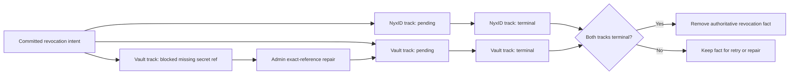

# ADR-0043: Scheduled Credential Lifecycle Compensation

## Context

Scheduled-agent and delivery-target creation span NyxID key issuance, vault persistence,
and actor initialization. Deletion spans the catalog actor, NyxID, and the vault. These
systems cannot participate in one atomic transaction, so best-effort cleanup in individual
tools can lose work or leave one external resource active.

ADR-0037 and ADR-0042 define the credential source and durable reference. This ADR adds the
lifecycle, compensation, and retry decision without rewriting those historical records.

## Decision

One `ScheduledAgentCredentialLifecycle` owns provisioning and dual-track compensation.
The raw issued key is held by an internal redacted capability that exposes only the vault
store operation. Public DTOs, actor state, projection documents, exceptions, and logs carry
only stable key identifiers, confirmed `SecretReference` values, and typed vault revocation
descriptors.

Vault callers may allocate `RequestedRef` before writing. The write is create-only and
idempotent only for the exact same descriptor and secret. Garnet adapters implement this
contract atomically with `SET NX`; every adapter must provide equivalent semantics.
If a write fails after a caller allocates a reference, compensation records the requested
coordinates with `REQUESTED_NOT_CONFIRMED`; it does not fabricate a `SecretReference` or
fingerprint. Failures before any vault write use `NOT_APPLICABLE` and no vault reference.

The well-known catalog actor is the sole owner of credential revocation facts. A fact uses
the natural identity `(agent_id, api_key_id, secret_reference.ref)` and independent NyxID
and vault tracks. The actor commits the revocation intent before invoking the external
executor. Bearer tokens are transient command input and are never copied to an event or
state. Failed attempts remain in actor state for idempotent retry; the fact is removed only
after both tracks become terminal.

`requested_at` always records the original revocation intent time. A successful administrator
repair records its separate request time in `repair_requested_at_unix_ms` and never overwrites
the revocation timestamp.

Bearer-bound retries re-enter the catalog actor through a typed owner-scoped command. The
actor selects pending facts from its authoritative state and invokes the executor in its own
turn; tools never use the eventually consistent revocation read model to drive write-side
retry.

Blocked facts encode an empty third identity segment only in the read-model document key.
Repair deletes that blocked document key before upserting the exact-reference key. Exact
vault revocation treats an already absent record as the postcondition being satisfied, while
an existing unauthorized or concurrently changed record remains a failed attempt.

Ordinary command ports return honest accepted-for-dispatch receipts. The dedicated repair
port binds a request-scoped Projection Session before dispatch and correlates the committed
repair or rejection event by request id. The administrator endpoint returns only after that
typed committed outcome is observed; it does not treat dispatch admission as repair success
and does not query-time replay or prime a read model.

Historical rows without an exact secret reference use
`BLOCKED_MISSING_SECRET_REF` on the vault track. This state is non-terminal, cannot execute
vault revocation, and does not consume attempts. Only the Mainnet administrator repair port
may submit a complete exact descriptor; ordinary tools cannot bypass the block or mark it
not applicable.

## Consequences

- Creation failure, initialization failure, deletion, and future rotation use one durable
  compensation ledger instead of tool-local cleanup paths.
- External effects begin only after the actor has committed the intent in its own turn.
- NyxID retries require transient bearer authority; vault retries do not.
- Repair HTTP responses distinguish committed repair from committed rejection and still
  expose the underlying command admission identifier for tracing.
