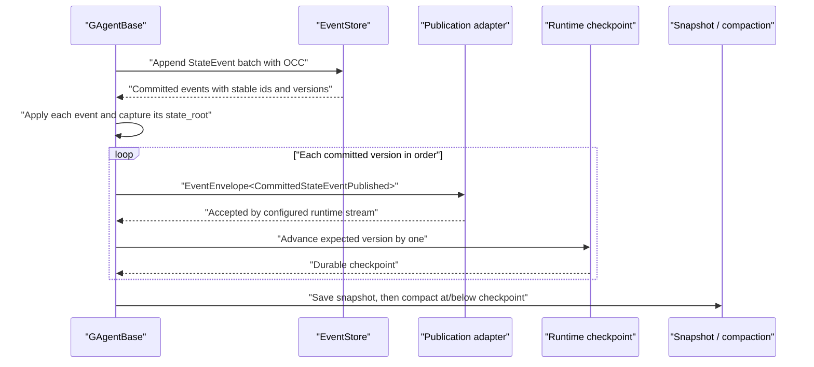
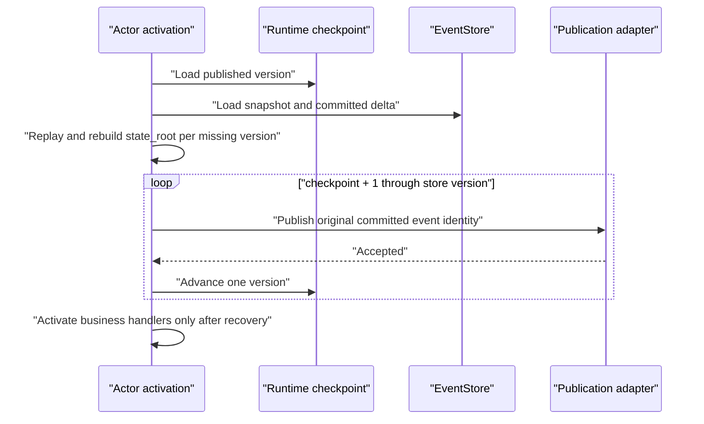

# 0045 - Runtime-owned committed-state publication recovery

## Context

The write path previously ran in this order:

`append -> apply -> snapshot/compact -> publish committed state`.

A process or silo failure after `IEventStore.AppendAsync` and before observer
publication left an authoritative committed fact permanently invisible. A
snapshot could compact that event before activation had a chance to recover it.
Putting `last_published_version` in each business `TState` would leak a runtime
delivery concern into domain state and contradict ADR 0020.

## Decision

Committed event append remains the pending-publication fact. Runtime owns a
separate Protobuf `CommittedStatePublicationState` with:

- actor identity;
- last accepted committed version and event id;
- an OCC revision;
- the last failed version/event, attempt count, error type, bounded message,
  and failure timestamp.

The storage port is `ICommittedStatePublicationStateStore`. Local development
uses an in-memory implementation, file-backed runtime uses a Protobuf file, and
Orleans stores the Protobuf bytes in the owning `RuntimeActorGrainState` row.
No business `TState`, domain event, or read model contains this checkpoint.

`AdvanceAsync(actorId, expectedPublishedVersion, event)` is the OCC boundary.
It requires the durable version to equal `expectedPublishedVersion`, requires
the event to belong to the same actor, and advances exactly one version. Orleans
also retains the persistent-state ETag check. Conflicts fail explicitly.

## Normal commit

Cancellation on the append call is admission-only. If the event-store adapter
returns a committed result, that result is authoritative even when the caller's
deadline expired while the atomic append was completing. The runtime applies
the committed events locally, captures any non-authoritative post-commit
state-change hook failure, and still completes publication, checkpoint, and
snapshot under recovery authority before rethrowing the hook failure.

Role chat configuration and tool refresh is one such post-commit hook. It uses
a fresh host-bounded timeout rather than the expired turn token. Terminal-adjacent
side effects such as workflow completion publication and direct-chat history
storage use a separate fresh post-turn timeout; they cannot replace or weaken an
already committed actor terminal fact.

Publication adapter success means only that the configured runtime stream
accepted the envelope. It does not mean an observer consumed it or that a read
model is visible. Snapshot and compaction run only after the current committed
version is checkpointed. Compaction is additionally capped at the checkpoint,
so an unpublished event can never be deleted.

The observer envelope id and timestamp come from the committed `StateEvent`.
A duplicate caused by a crash therefore retains the stable event identity.
Current-state projectors continue to use actor identity plus authoritative
version for monotonic covering writes. Artifact consumers use committed event
identity as their idempotency key.

## Activation recovery

Recovery is an activation/runtime path, never a query or projector path. The
range must be contiguous. A checkpoint ahead of the event store, a snapshot
ahead of the checkpoint, or an unavailable committed version throws
`CommittedStatePublicationRecoveryException`; activation fails instead of
silently skipping the fact.

For rollout compatibility, an actor without a checkpoint initializes once at
the event store version observed during its first activation. This is a forward
safety boundary: facts committed before the capability existed are assumed to
have followed the old publication path. An already-compacted historical gap
cannot be reconstructed. Operators use the explicit DR republish path from ADR
0040 when the authoritative current state survives but a current-state read
model must be rebuilt.

## Retry, poison, and repair

- A publisher or checkpoint failure records the pending event and error without
  advancing the durable version.
- Orleans classifies `CommittedStatePublicationException` as recoverable. Its
  existing durable callback retry provides bounded attempts and backoff. A retry
  first republishes/checkpoints the pending fact and consumes the retry envelope;
  it does not execute the business handler a second time.
- Local runtime retries the pending publication before a later envelope; a
  process restart with file persistence uses activation recovery.
- After retry exhaustion, the typed failure record is the poison evidence.
  Operators must correct the transport/storage fault and reactivate the actor.
  Missing event history or checkpoint conflicts require explicit repair; the
  runtime never advances over the gap.

`RepublishCommittedStateAsync` remains a manual current-state disaster-recovery
primitive. It uses a synthetic maintenance event id and does not advance this
checkpoint. Automatic failure recovery reuses original committed event ids and
must not be filtered as maintenance rebuild traffic by audit materializers.

## Consequences

- Delivery is at least once across publish/checkpoint crashes, not end-to-end
  exactly once.
- EventStore plus actor state remain the business truth. The checkpoint only
  describes runtime delivery progress.
- Snapshot storage and event compaction are coupled to publication safety, but
  projection/query code does not gain EventStore access.
- The normal path performs one durable checkpoint write per committed version.
  Write amplification must be measured before weakening this guarantee.
