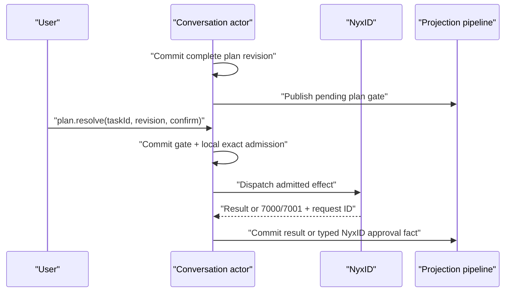

# ADR-0049: NyxID Assistant Plan Gate and Revision

## Context

Milestone 40 needs one actor-owned rule for plan confirmation, local operation admission, NyxID authorization, and plan revision. The reviewed implementation has four conflicting behaviors:

1. task steps can dispatch as they are appended, before a complete plan exists;
2. an action continuation increments `planRevision` even when the plan is unchanged;
3. `addedBy` describes a broad cause but cannot reconstruct revision provenance; and
4. an Aevatar-local approval can be presented as if it were NyxID exact-service authorization.

The binding inputs are [#3315](https://github.com/AevatarAI/aevatar/issues/3315), [ADR-0048](0048-nyxid-assistant-operation-class-boundary.md), support-contract gist `f45febb057a7182dab2495d4c739d2bb8d7026f5`, NyxID `fa157bc4160c27922f49f8f498ccac755843a15a`, and `origin/feature/integrate@6f979452853a6e3afdffeef085f7bbc550b9385e`.

## Decision

Milestone 40 uses **strict plan/authorization separation with Tier B approval**.

### Complete plan before execution

An actor commits a complete plan snapshot before any executable or effect-capable step starts. A confirm-mode plan enters a typed pending gate. `plan.resolve(confirm)` atomically:

- binds the decision to the exact `taskId + planRevision`;
- confirms the complete ordered step set;
- admits the exact Aevatar operations frozen by `stepId + operationId + operationGeneration + argumentsDigest`; and
- satisfies the actor-owned plan gate.

The decision is not a NyxID grant. Any step, selector, operation generation, or argument change invalidates admission and requires a new plan revision and confirmation. Rejection stops the task without dispatching an effect.

Auto mode is allowed only when the derived plan contains no step requiring explicit local admission. Gate mode, state, request identity, bound revision, and decision time are typed actor-owned facts, not strings inferred by Studio.

### Pre-plan read boundary

Before the full plan is committed, the actor may perform only disclosed, bounded, approval-free, effect-free Class-R capability/readiness reads from an explicit server-owned allowlist. Their outputs enter the actor as typed facts and may refine the plan. Hidden open-ended discovery, task execution, browser actions, Class-P calls, and any write are forbidden before the plan snapshot.

### Two authority decisions

A confirm-mode effect task has two distinct authority boundaries:

1. Aevatar plan confirmation and local exact-operation admission; and
2. NyxID exact-service authorization when the downstream service requires it.

Tier B exposes no NyxID approval fact before NyxID returns. While an effect call is outstanding, Aevatar may project only running/waiting and threshold-derived stalled. A typed NyxID approval fact is committed only after error 7000/7001 returns with a non-empty `approval_request_id`. Generic `tool_approval` is never used as connected-service authority.

The product therefore promises one Aevatar plan decision plus a separate NyxID decision when required, not one decision for the entire cross-authority task. Reload reconstructs both facts independently from committed actor state and the current-state read model.

### Revision semantics

`planRevision` identifies semantic plan content, not turns or continuations. Revision 1 is the first committed plan shape. It increments exactly once when the authoritative ordered steps, gate, selector, operation generation, or frozen arguments change.

The closed revision-cause vocabulary is:

- `initial`;
- `scope_resolution`;
- `failure_recovery`;
- `steering`; and
- `user_revision`.

Every revision records its number, cause, and committed time. Every step records `addedInPlanRevision`; a cancelled step also records `cancelledInPlanRevision`. Steps are never deleted from the authoritative history merely to simplify the current presentation.

A pure `action.continue`, approval decision, retry signal, reload, or passivation recovery does not increment `planRevision` unless it actually changes the frozen plan. A postcondition is declared in the complete plan before execution; continuation cannot append it opportunistically.

## Actor sequence

## Consequences

- `NyxIdChatPlanGate` becomes a real state contract rather than display metadata.
- Task snapshots and step-change frames carry typed revision history and per-step provenance through the same decoder path.
- The execution path rejects any effect whose gate binding or frozen operation digest no longer matches current actor state.
- Studio displays plan confirmation and NyxID authorization as separate controls and never infers either from prose.
- Existing continuation code that appends steps or increments revisions unconditionally must be removed.

## Verification

Fixtures must prove:

- no effect dispatch before a confirm gate is satisfied;
- only allowlisted typed Class-R reads can precede the full plan;
- a changed frozen operation invalidates prior confirmation;
- two pure action continuations preserve task ID and plan revision;
- scope resolution, failure recovery, steering, and user revision each increment once with typed provenance;
- reload reconstructs identical revision history; and
- Tier B emits no NyxID approval fact before a returned request ID.
