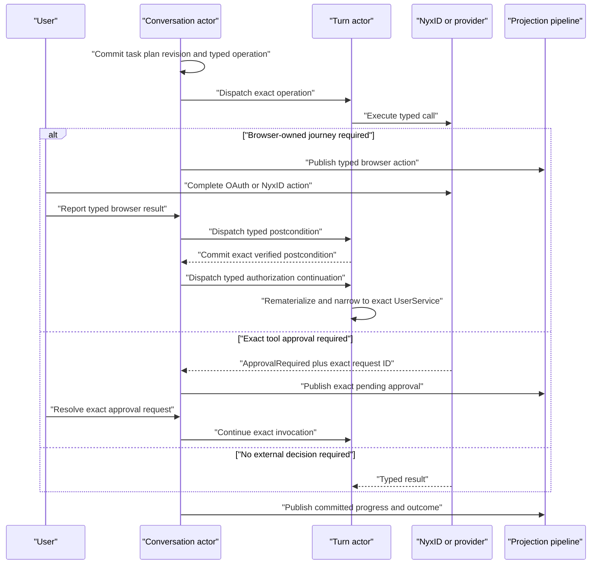

# ADR-0049: NyxID Assistant Plan Progress and Operation Authorization

## Context

NyxID Assistant plans originally served two incompatible purposes: describing task progress and authorizing execution. That coupling added a second local decision before already typed operations, duplicated provider-owned authorization, and left browser-owned OAuth continuations waiting on a control object that did not own the external consent.

The runtime already has narrower authority boundaries:

1. the conversation actor owns the task, plan revision, exact operation identity, and dispatch decision;
2. NyxID or the provider owns browser authentication and OAuth consent;
3. an exact tool invocation may return its own typed approval request; and
4. effect retry authority comes only from an exact prior operation whose committed evidence is `not_applied`.

The plan therefore must remain observable without becoming a second authorization system.

## Decision

### Plans are read-only progress

The actor commits an authoritative task plan and revision history for observation. Studio renders its title, ordered steps, dependencies, estimates, operation phases, failures, effect evidence, and revision provenance. A plan has no confirm, reject, pending-admission, or user-decision state.

An admitted LLM tool call creates and activates its typed tool step. The lifecycle returns a normal `NyxIdChatOperationDispatchCommand` immediately. The command carries the exact operation key, frozen arguments, exact `AgentToolOperationAdmission`, idempotency key, and transient execution context required by the turn actor.

### Authorization stays at the owning operation boundary

Browser-owned actions such as `service.connect`, `key.create`, and `key.rotate` remain explicit typed action requests. The browser completes the NyxID journey and reports its typed result. The actor then dispatches the declared postcondition check automatically. A successful postcondition continues the blocked request without another local decision.

Continuation after a successful browser authorization is a typed actor decision, not an old-turn resume or an LLM interpretation of success text. One shared correlation policy must prove the accepted Action continuation admission, origin turn, active continuation turn, task, complete operation key, exact action request, and exact postcondition dependency. The action may already have moved from pending to recent history, but it must remain unique and its typed result plus postcondition must both prove completed verification. Transition validation, event persistence, reducer replay, and recovery use this same policy.

The resulting `NyxIdChatVerifiedAuthorizationContinuation` is a closed, credential-free protobuf fact. It freezes the safe action and step identities, verified resource, service slug from typed action parameters, verification time, and one resume requirement. It contains no token, credential, or generic metadata bag. Runtime credentials remain request-transient and do not enter committed events, actor state, read models, transcript history, projections, metadata, or logs.

When the resume requirement is `COMPLETE_ORIGINAL_SERVICE_REQUEST`, the turn rematerializes the current request-local operation catalog and narrows it to route-owned tools whose typed admission matches both the verified `UserServiceId` and frozen `ServiceSlug`. Unprofiled turns rediscover the current NyxID Chat route toolset. Profiled turns require an exact committed profile identity and retain the current profile maximum as the upper policy ceiling, but do not reuse the pre-authorization turn/task ceiling that necessarily predates the newly established capability. No management, global, same-slug, or unrelated-service fallback is allowed. Absence of an exact operation fails before LLM execution. A first text-only result produces exactly one corrective `failure_recovery` LLM step with the same typed correlation; a second text-only result fails closed. When the requirement is `COMMUNICATE_AUTHORIZATION_COMPLETION`, the request-local catalog is empty and text may complete the dedicated authorization request. Missing typed UserService identity, frozen slug, recognized resume requirement, or required committed profile identity fails before LLM execution.

An exact tool invocation that returns `ApprovalRequired` remains blocked on its own approval request. Only `approval.resolve` for that exact request, operation identity, generation, and provider receipt may continue it. Plans, browser completion, another approval, or a generic receipt cannot authorize the invocation.

Write and destructive classifications still affect tool exposure, exact admission, effect evidence, verification, retry availability, and provider policy. They do not add plan-level authorization.

### Retry is a direct typed operation

Retry creates the next operation generation and dispatches it directly when the transition policy proves the input can be rebuilt. An effect retry additionally carries the exact delivered source-operation key and credential-free durable-authorization snapshot. The turn actor accepts it only after the source operation committed `not_applied` and the current tool definition and complete admission contract still match.

### Revision semantics

`planRevision` identifies semantic task-plan content, not user authorization. Revision 1 is the first committed plan shape. It increments when the authoritative ordered steps, selector, operation generation, frozen arguments, or control-driven plan shape changes.

The closed revision-cause vocabulary remains:

- `initial`;
- `scope_resolution`;
- `failure_recovery`;
- `steering`; and
- `user_revision`.

Every revision records its number, cause, and committed time. Every step records `addedInPlanRevision`; a cancelled step also records `cancelledInPlanRevision`. Browser continuation, exact approval resolution, reload, and passivation recovery do not increment the revision unless they change the semantic plan.

## Actor sequence

## Consequences

- Task snapshots and Studio contain no plan-level authorization controls or request identity.
- Browser actions and exact tool approvals remain separate, executable controls.
- Verified browser authorization resumes through one credential-free typed continuation and exact cross-turn correlation.
- Original connected-service requests see only the exact verified UserService operations; unrelated tools cannot become fallback authority.
- A text-only original-request continuation receives one corrective attempt and then fails closed.
- Direct operation dispatch removes admission delivery, revocation, expiry, and pending-continuation state that existed only for plan-level authorization.
- Ordinary operation delivery, effect waterlines, cancellation fences, postcondition verification, and exact approval recovery remain actor-owned.
- The public chat command surface rejects deleted or unknown request discriminators without mutating actor state.
- AGUI and current-state query continue to consume the same committed projection pipeline.

## Verification

Fixtures must prove:

- write, destructive, and long-duration operations dispatch without a plan-level decision;
- browser actions publish immediately and postcondition verification dispatches automatically;
- successful OAuth verification continues the original request only through the exact typed correlation and verified UserService catalog;
- a missing exact operation fails before LLM execution, while two consecutive text-only continuation results fail with the fixed terminal code;
- credentials and the transient continuation instruction are absent from events, actor state, read models, history, projections, metadata, and logs;
- exact provider-owned approvals still require their matching `approval.resolve`;
- effect retries dispatch a new generation only from exact `not_applied` evidence;
- task snapshots expose plan progress and revision history without authorization state; and
- Studio contains no plan-confirmation UI while retaining browser-action and exact-approval controls.
