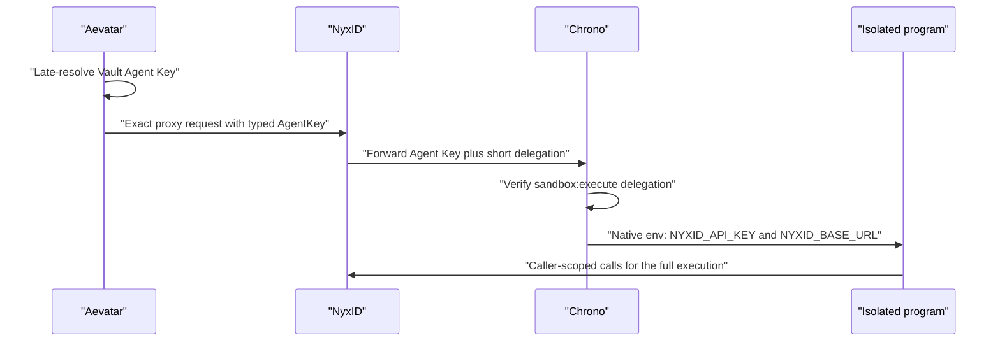

# ADR-0050: Code Execution Uses Agent Key Runtime Authority

## Context

Workflow `code_execute` can run longer than NyxID's five-minute delegation token.
Some workflows also make many NyxID calls from inside one sandbox program. Using
the delegation token as both the Chrono admission credential and the program's
NyxID credential caused valid long-running work to fail partway through execution.
Issue [#3508](https://github.com/aevatarAI/aevatar/issues/3508) records the concrete
case: a program needed 184 caller-scoped Lark reads, but the available NyxID
credential expired before the program completed.

Aevatar already owns Vault-backed Agent Keys for channel, webhook, and scheduled
workflow invocation. Those keys had been incorrectly collapsed into the
`ProxyDelegation` credential kind at several dispatch boundaries, hiding the
distinction between long-lived caller authority and short-lived request admission.

## Decision

All channel, webhook, and scheduled workflow paths that resolve a NyxID Agent Key
preserve the strong typed kind `AgentKey` through workflow, tool execution, and
code-execution ports. They never relabel that secret as `ProxyDelegation` or use a
five-minute token as the sandbox program's NyxID credential.

Webhook binding management credentials are admission credentials only. Aevatar
must never persist a forwarded management Agent Key as the webhook runtime
credential. When unattended effects are enabled, Aevatar obtains a
source-readable management bearer from the binding's exact NyxID authority,
requests an authoritative API-key scope plan for every NyxID UserService ID in
the committed workflow admission plan (including `code_execute`), and creates a
dedicated key with `allow_all_services=false`, `allow_all_nodes=false`, and the
exact planned service and node allowlists. Binding creation fails closed if any
of those steps is unavailable or if the returned actor, owner, or service set
drifts from the committed admission.

The exact shared `chrono-sandbox` UserService contract is:

```text
forward_access_token=true
inject_delegation_token=true
delegation_token_scope contains proxy:* and sandbox:execute
```

For exact `POST /execute` and asynchronous `/executions` requests, Aevatar sends
the late-resolved Agent Key as the caller credential. NyxID forwards it as
`Authorization` and separately injects a delegation token. Chrono recognizes only
the exact NyxID Agent Key format, verifies the delegation token's
`sandbox:execute` scope as the request authority, and passes the Agent Key plus
NyxID base URL to the isolated program as server-owned native environment values.

An ordinary bearer remains request authority for direct-human execution and is
never injected into sandbox environment. Managed `/codex/execute` remains a
delegation-only program credential contract: its Agent Key is sent to NyxID as
`X-API-Key`, no `Authorization` header exists, and only the short delegation token
reaches Codex.



## Secret and durability boundary

- Raw Agent Keys remain absent from actor state, events, projections, read models,
  logs, and API responses.
- Webhook durable references persist the NyxID provider credential ID alongside
  the Vault descriptor. Replacement, disablement, rejected writes, deletion, and
  Vault-write rollback revoke both the provider credential and Vault secret.
  Legacy webhook references without a provider ID may have only their Vault
  secret revoked; they are invalid for new runtime dispatch.
- Aevatar resolves the secret only at the outbound call. Rotation therefore takes
  effect on the next exchange.
- Chrono rejects caller attempts to override `NYXID_API_KEY` or `NYXID_BASE_URL`
  and passes both through execd's native environment map rather than command text.
- Durable Chrono execution encrypts the full execution payload needed for recovery.
  Agent Key and NyxID base URL are excluded from the semantic idempotency digest so
  rotation does not make the same admitted operation conflict with itself.
- The short delegation token is never persisted or injected as the generic
  program's NyxID credential.

## Consequences

The route policy is conjunctive rather than the previous forwarding-or-delegation
disjunction. Capability convergence enables both route flags and preserves both
required scopes. Readiness and runtime fail closed on partial configuration.

This decision supersedes only the generic `code_execute` credential statements in
ADR-0044 and the original managed-Codex rollout runbook. ADR-0044's managed
`/codex/execute` direct-token isolation decision remains unchanged.

## Verification

Tests must prove:

- channel, webhook, scheduled, and restored durable Agent Key references retain
  the `AgentKey` kind through every mapper and dispatcher;
- webhook binding materialization never stores the inbound management key,
  scopes the dedicated runtime key to the exact committed admission service set,
  and rolls provider credentials back when Vault or binding persistence fails;
- route admission and convergence require forwarding, delegation injection, and
  both scopes without deleting unrelated scopes;
- Chrono accepts an exact Agent Key only with a valid `sandbox:execute` delegation
  token and never introspects that key as an ordinary bearer;
- lookalike keys and ordinary bearer credentials never enter sandbox environment;
- caller environment cannot replace the two server-owned values;
- native execd environment transport does not place the Agent Key in command text;
  and
- durable and ephemeral idempotency replay remains stable across Agent Key rotation.
