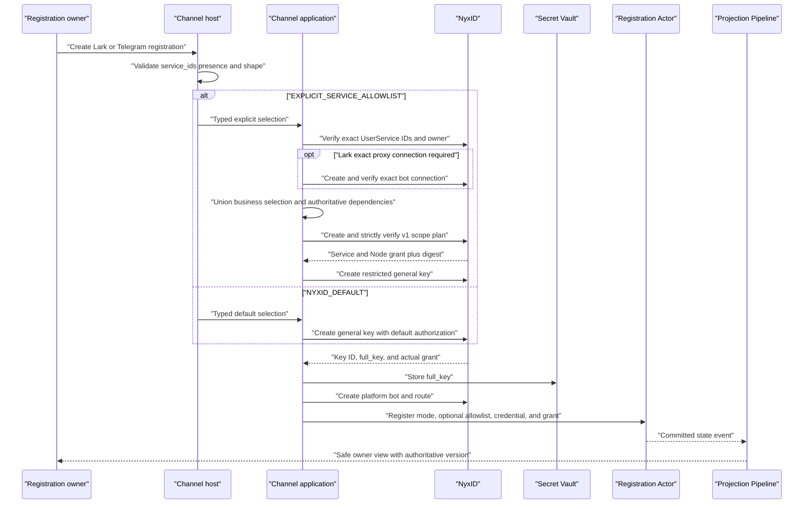

# ADR-0051: Unified Channel Agent Key Supports Two Creation Authorization Modes

## Context

Lark and Telegram registrations previously did not share one durable credential
contract. The Lark path could persist a Vault-backed key for workflow result
delivery, while the Telegram path retained only the provider key ID and discarded
the one-time `full_key`. Runtime consumers also treated compatibility fields as
independent sources, which allowed malformed new records to fall back to older,
weaker semantics.

The first unified-key implementation addressed that inconsistency with a
`NYXID_DEFAULT`-only model. The approved current scope now also requires a
creation-time Service allowlist without adding an existing-registration update
lifecycle. A caller must be able to omit `authorization_mode`, or use
`nyxid_default`, and retain NyxID default authorization even when legacy
`service_ids` is present. A caller must also be able to opt into
`explicit_service_allowlist`, optionally provide a complete array including an
empty array, and create a restricted key from an authoritative NyxID scope plan.

The registration Actor remains the sole owner of the durable authorization fact.
Raw key material must remain outside Protobuf state, events, projections, query
results, workflow state, logs, and API responses. Existing Lark and Telegram
registrations must retain their historical behavior without being silently
reclassified as either new mode.

## Decision

### Creation authorization modes

Every new Lark or Telegram registration writes exactly one of two strongly typed
authorization modes:

| Creation input | Persisted mode | Meaning |
|---|---|---|
| Root `authorization_mode` is absent, blank, or `nyxid_default` | `NYXID_DEFAULT` | Create a `general`, `read write proxy` key while omitting Service and Node restrictions, both allow-all request fields, and the scope-plan digest. Persist the actual grant returned by NyxID. Legacy root `service_ids` in this mode is ignored for authorization. |
| Root `authorization_mode` is `explicit_service_allowlist` and `service_ids` is absent or a valid array, including `[]` | `EXPLICIT_SERVICE_ALLOWLIST` | Validate the complete business allowlist, plan the exact effective grant, and create a restricted key with both allow-all fields set to false. Omitted `service_ids` has the same empty allowlist meaning as `[]`. |
| Root `authorization_mode` is `explicit_service_allowlist` and `service_ids` is `null`, is not an array, or contains an invalid element | No write | Return `invalid_service_ids` before Service lookup, connection creation, scope planning, key creation, Vault mutation, bot or route creation, or Actor dispatch. |
| Root `authorization_mode` is an unknown nonblank value or is not a string | No write | Return `invalid_service_ids` before Service lookup, connection creation, scope planning, key creation, Vault mutation, bot or route creation, or Actor dispatch. |

Legal array elements are strings that remain nonempty after trimming. The boundary
trims, de-duplicates, and sorts them with ordinal semantics. Explicit mode
preserves the difference between omitted `service_ids` and invalid `service_ids`,
while treating omitted and `[]` as the same empty business allowlist. Callers may
supply `authorization_mode`; they cannot supply provider grant fields, runtime
dependencies, or a scope-plan digest.

Each provisioning entry resolves the authenticated actor and registration owner
exactly once, before any NyxID mutation. The resulting
`VerifiedChannelRegistrationOwner` is passed unchanged to explicit planning or
default-key creation. Downstream components do not re-read current-user or
organization membership and do not infer owner kind from Service inventory,
empty selections, names, slugs, or identifier shape.

Each selected value must resolve to the same exact NyxID `UserService.id`.
Service slug, display name, catalog ID, prefix matching, and another bot's
connection are not valid substitutes. The planner verifies that the Service
belongs to the registration owner's personal scope or to an organization the
caller is authorized to manage. Failure is reported as
`user_service_not_found` or `service_owner_forbidden`; the implementation does
not partially accept a list.

### Authoritative dependency and connection planning

Explicit authorization distinguishes the owner's business allowlist from
runtime-required Services. A narrow dependency resolver is the only boundary for
exact Skill, Workflow, LLM, and Channel dependencies from authoritative
configuration. The current registration configuration declares no exact
Skill, Workflow, or LLM Service IDs; the Lark bot connection is the current
nonempty platform dependency. The scope-plan input is the canonical union of:

- the verified business `service_ids`;
- exact Services required by current authoritative configuration; and
- the exact bot-specific proxy connection when the platform requires one.

Runtime dependencies participate in key authorization but are not copied into the
business allowlist. No separate `runtime_required_service_ids` list is persisted,
and later dynamic discovery does not mutate the key or widen the registration.

For explicit Lark creation, the application creates and then verifies this bot's
dedicated proxy Service connection before scope planning and key creation. The
current public inventory does not expose enough app-credential identity to reuse
an existing connection safely. The verification covers owner, platform app
identity, purpose, dedicated slug, and exact `UserService.id`. The new
connection is compensatable only when its creation provenance proves that it is
exclusive to this registration.

Telegram remains relay-only and does not create a proxy connection when current
authoritative configuration does not require one. If a future authoritative
configuration requires such a connection without providing an exact identity
contract, explicit creation fails closed with
`channel_service_connection_unavailable`; it does not guess from tokens or
slugs.

### NyxID scope plan and key

Explicit creation uses the existing NyxID v1
`POST /api/v1/api-keys/scope-plan` surface. The request sends
`selected_service_ids`; an authorized organization request also sends the
verified `target_org_id`, while a personal request omits it. The existing strict
parser validates the provider response before it enters application
orchestration, including:

- `authority = nyxid`, `contract_version = 1`, and
  `policy_version = api-key-scope-v1`;
- the authenticated actor, intended key owner, and each Service resource owner;
- exact equality among selected Services, planned Services, per-Service entries,
  and the union of planned Node grants;
- the mutation-revalidated freshness and completeness contracts;
- a valid RFC 3339 evaluation time; and
- `normalized_grant_digest` in the published
  `sha256:` plus 64 lowercase hexadecimal form.

The create-key mutation receives only this verified plan. It sets
`allow_all_services=false`, `allow_all_nodes=false`, copies the exact planned
Service and Node arrays, and sends the provider digest as
`scope_plan_digest`. A default-mode mutation omits all of those restriction
fields and never calls the scope-plan path.

Both modes create one `general`, `read write proxy` Channel Agent Key. The
response parser requires the expected key class, exact scopes, explicit
allow-all-field presence, canonical ID arrays, a nonempty key ID, and the
one-time `full_key`. For explicit mode, the returned Service and Node arrays must
match the verified plan exactly; provider drift fails closed. The provider does
not echo the digest on key creation, so the persisted snapshot uses the digest
from the verified plan that the mutation revalidated.

The provisioning core writes `full_key` directly to `ISecretVault`. Only the
typed `SecretReference` leaves that boundary. A Vault failure is a hard
provisioning failure, and detached bounded compensation deletes the provider key
before revoking any stored Vault reference.

NyxID key creation is not transactionally correlated with this client. If NyxID
commits a key but the create response is lost before Aevatar receives its key ID,
the current public contract provides no exact identifier for compensation. That
failure can leave an orphan provider key. This release does not retry the create
mutation or guess an ID; recovery and correlation for that case remain deferred.

### Actor-owned contract and current-state queries

The registration command, committed entry, Actor state, and current-state
document carry:

- the independent `ChannelRegistrationAuthorizationMode`;
- an optional `ChannelRegistrationServiceAllowlist`;
- one `ChannelAgentKeyCredential` containing the provider key ID, typed Vault
  reference, and grant snapshot; and
- the actual `allow_all_services`, `allow_all_nodes`, Service IDs, Node IDs,
  and explicit-mode scope-plan digest.

`NYXID_DEFAULT` requires no allowlist message and an empty digest.
`EXPLICIT_SERVICE_ALLOWLIST` requires the allowlist message even when its
`service_ids` collection is empty, both allow-all values explicitly false, and
a valid digest. The business allowlist must be a subset of the actual Service
grant. Lists do not define or infer the mode.

During the compatibility period, `nyx_agent_api_key_id` and
`workflow_result_delivery_credential` mirror the exact same key ID and complete
`SecretReference`. They are aliases, not a second key. Any mismatch or partial
new-model shape makes the contract invalid.

The registration Actor validates the complete combination before committing the
existing `ChannelBotRegisteredEvent.entry`. Projection only clones the committed
fields and uses the Actor's authoritative committed version. Query paths read the
current-state document and never replay events, prime projections, read Actor
state, or reconstruct authorization from provider defaults.

Owner-facing HTTP and tool lists expose only the mode, authoritative
`state_version`, and, for explicit registrations, the complete business
`service_ids` list including `[]`. Default registrations omit `service_ids`.
True legacy rows invent neither a mode nor a list. Owner views never expose the
credential, grant, dependency details, digest, Vault descriptor, fingerprint, or
secret.

### Registration-authority admission

Durable registration-authority execution is admitted from the registration
current-state read model. The credential descriptor must match the exact persisted
key ID and complete Vault reference. An invalid or ambiguous registration fails
closed.

After existing caller-identity and business-entry checks:

- `NYXID_DEFAULT` retains its existing registration-authority behavior and
  remains subject to the actual NyxID key grant and target Service policy.
- `EXPLICIT_SERVICE_ALLOWLIST` first requires the exact target
  `ServiceInstanceId` to be present in the persisted key grant. It then requires
  either that target in the business allowlist, or authoritative proof that the
  target is a dependency of the exact current call site.
- A grant-only extra is not a business authorization. An internal dependency
  cannot be used from an unrelated call site.

Missing sender authority never falls back to the registration key. Registration
authority failure likewise never retries with sender authority, changes modes, or
widens the key.

### Platform lifecycle and compatibility

The common provisioning core creates and stores the key before bot and route
creation, then submits the registration command last. Default-mode Lark retains
its existing best-effort post-route proxy-connection behavior. Explicit Lark uses
the verified preplanned connection. Telegram remains relay-only.

Compensation uses bounded internal cancellation rather than the disconnected
caller's token. Route, bot, key, Vault reference, and an exclusively owned new
connection are cleaned according to creation provenance. Once Actor dispatch is
accepted, or acceptance is unknown, the HTTP path does not blindly delete
resources that may belong to a committed registration.

Runtime reads classify records into four states:

- valid `NYXID_DEFAULT`;
- valid `EXPLICIT_SERVICE_ALLOWLIST`;
- true historical legacy, where mode is unspecified and both the new credential
  and allowlist are absent; and
- invalid, where any new-model field is partial, unknown, or inconsistent.

Only true historical rows may use the supported legacy credential and Lark repair
paths. New-model rows are not mutated by repair, and invalid rows never fall back
to legacy aliases. Existing registrations are not migrated, relabeled, or
silently granted new Services.

Registration deletion continues to use the existing endpoints, identity checks,
hard gates, and cleanup order. Owners can delete and create a new registration in
either mode, but that is not an in-place allowlist replacement or mode switch.

A typed rollout gate remains closed until every instance capable of activating
the registration Actor understands the new contract. Enabling the gate permits
both current creation modes. It does not disable supported historical execution
paths.

### Observability

This delivery adds no Channel registration Meter instruments and no host export
registration for them. The historical NyxID relay callback JWT validation Meter
remains unchanged.

Low-cardinality business metrics for default, explicit, and legacy registration
classification and for input, exact-Service, connection, scope-plan, admission,
provisioning, and cleanup outcomes are deferred. A later implementation must use
fixed dimensions and stable normalized reason codes, and must never emit Service
or Node IDs, complete lists, digests, registration or route IDs, key IDs, Vault
descriptors, fingerprints, provider response bodies, tokens, or secrets.

## Consequences

New Lark and Telegram registrations share one durable owner-authority key and one
Vault secret while supporting either provider-default or creation-time restricted
authorization. The mode, business intent, and actual provider grant remain
separate facts, so Actor recovery and projection repair do not depend on current
NyxID defaults.

Explicit mode gives registration-authorized calls a conjunctive boundary: the
target must be present in the actual key grant and must also be justified by the
business allowlist or the exact authoritative dependency call site. NyxID and the
target Service still enforce credential, ownership, endpoint, operation,
approval, and mutation policy.

The model is intentionally immutable after creation in this release. An owner who
needs another mode or allowlist must delete and create a new registration. This
keeps replacement, migration, rollback, and concurrency semantics out of the
creation contract.

## Deferred Work

Sections 20 through 25 of the source design remain explicitly deferred:

- complete allowlist replacement for an existing registration;
- in-place `NYXID_DEFAULT` to `EXPLICIT_SERVICE_ALLOWLIST` switching;
- legacy Lark allowlist import or legacy Telegram migration;
- general Channel Agent Key rotation and recovery, including correlation and
  cleanup after a committed create-key mutation whose response was lost;
- automatic migration or removal of historical compatibility;
- unified HTTP/tool deletion authorization and Actor-side deletion
  revalidation; and
- a frontend Service selector or other allowlist UI.

These capabilities must not be inferred from the creation path or exposed through
an internal command, hidden endpoint, tool parameter, or compatibility repair.

## Verification

Tests cover the Protobuf field numbers and message presence, both authorization
contracts, input presence and malformed-value rejection, exact Service and owner
validation, scope-plan strictness, dependency union, Lark connection provenance,
Telegram relay-only behavior, restricted-key creation, Vault failure and
compensation, Actor persistence and replay, projection and query cloning, safe
owner views, current-state admission, compatibility isolation, stable errors, and
the absence of new Channel registration Meter instrumentation. Repository
architecture, stability, projection, split-solution, documentation, build, and
test gates remain required for delivery.
