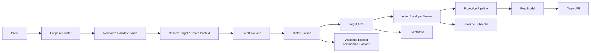

# CQRS Command -> Envelope -> IActorRuntime -> Actor 重构蓝图（2026-03-09）

## 1. 文档定位

- 状态：Proposed
- 适用范围：`Host / CQRS Core / Workflow Capability / Projection`
- 目标：在不改变“Aevatar 统一使用 Envelope 交互”设计哲学的前提下，把命令主链路收敛为 `Command -> Envelope -> IActorRuntime -> Actor`，并由 CQRS Core 提供统一命令处理骨架；不再为命令入口额外引入 ingress queue/stream

本文档描述的是目标态，不是当前仓库实现的事实陈述。  
当前基线仍以 [CQRS_ARCHITECTURE.md](../CQRS_ARCHITECTURE.md) 为准。

## 2. 为什么要重构

当前实现已经明确了：

1. `EventEnvelope` 是 runtime message envelope，不是 Event Sourcing 的事实流。
2. `ActorRuntime` 是建立在 stream 之上的 actor 语义层，不是另一套平行通道。
3. Projection / ReadModel / AGUI 共享同一条 envelope 输入链路。

但当前讨论后已经明确一点：

1. `IActorRuntime` 本身就可以承担分布式 actor client / gateway 的角色。
2. Orleans 场景下，runtime-backed dispatch 已经具备远程投递能力，不需要再人为加一层命令 ingress stream。
3. 真正需要保留 stream 的地方，是 actor 自己的 envelope 流和 projection/read-model 链路，而不是命令入口本身。

## 3. 设计结论

### 3.1 统一 Envelope，不强拆物理类型

Aevatar 的设计哲学保持不变：

1. 外部命令进入系统时可以继续使用统一 `Envelope` 载体。
2. Actor 集群内部也继续通过统一 `Envelope` 交互。
3. 不要求为 command / reply / signal / domain event 强制拆成不同物理 envelope 类型。

但必须同时写死另一条约束：

1. **Envelope 可以统一，语义不能混。**
2. payload 必须显式声明 `message kind`。
3. EventStore 只接收满足领域事实语义的事件，不接收任意 command envelope。

### 3.2 CQRS Core 必须拥有统一命令骨架

这次重构不只是把命令链路改成 `IActorRuntime` 直投，更重要的是把“命令怎么被处理”从 capability 私有流程，收敛成 CQRS Core 的统一抽象。

标准命令阶段应固定为：

1. `Normalize`
   Host/Adapter 把外部协议模型收敛成应用命令模型。
2. `Resolve Target`
   解析目标 actor、创建/复用策略与资源语义。
3. `Create Context`
   统一生成 `commandId / correlationId / metadata`。
4. `Build Envelope`
   把命令映射成 runtime message envelope。
5. `Runtime Dispatch`
   通过 `IActorRuntime` 获取/创建 actor 并投递 envelope。
6. `Create Accepted Receipt`
   返回稳定追踪句柄，而不是返回伪完成态。
7. `Observe`
   后续结果统一走 read model / actor-session stream。

CQRS Core 应提供的通用抽象建议如下：

| 阶段 | 目标抽象 | 当前基础 |
|---|---|---|
| Resolve Target | `ICommandTargetResolver<TCommand, TTarget>` | 目前多由 capability 自己实现 |
| Create Context | `ICommandContextPolicy` | 已存在 |
| Build Envelope | `ICommandEnvelopeFactory<TCommand>` | 已存在 |
| Runtime Dispatch | `ICommandRuntimeDispatcher<TCommand>` 或等价 dispatch port | 目前仅有 `DefaultCommandExecutor<TCommand>` 级别 helper |
| Create Accepted Receipt | `ICommandReceiptFactory<TTarget, TReceipt>` | 尚未统一 |
| Observe | `ICommandObservationDescriptorFactory<TReceipt>` 或等价 observation contract | 目前多靠各子系统约定 |

边界要求：

1. CQRS Core 负责命令阶段 2-6 的标准抽象与默认实现。
2. Capability 只应提供领域规则：目标解析、payload 映射、读侧观察映射。
3. Projection Core 只负责第 7 阶段，不反向承担命令入口生命周期。
4. Host 不得直接拼 `actor resolve + envelope build + ack semantics`。

### 3.3 对外同步确认只保留一种

本蓝图继续取消“把多级 ACK 暴露给外部调用方”作为默认主契约，统一收敛为：

1. `Accepted`
2. 返回稳定 `commandId`
3. runtime 直投场景下通常同时返回 `actorId`

也就是说：

1. 外部同步返回只承诺“系统已经接受该命令，并分配了可追踪 ID”。
2. 外部同步返回不承诺 actor 已处理。
3. 外部同步返回不承诺领域事件已提交。
4. 外部同步返回不承诺 read model 已可见。

这不是弱化架构，而是把同步契约讲清楚，避免“假 ACK”。

## 4. 目标主链路



标准语义：

1. `Endpoint Cluster` 只做协议适配、校验、鉴权、限流与应用层组合。
2. CQRS Core 统一负责 `Resolve Target / Create Context / Build Envelope / Runtime Dispatch / Create Receipt`。
3. Infrastructure 通过 `IActorRuntime` 获取或创建目标 actor，然后投递 envelope。
4. Actor 在自身上下文里决定是否产出领域事件；只有显式持久化的领域事件才进入 `EventStore`。
5. `Projection Pipeline` 继续消费 actor envelope 流；stream 保留在写后传播与读侧观察链路，不承担命令入口职责。

## 5. 标准外部契约

### 5.1 提交命令

标准提交模型：

`Command -> Envelope -> IActorRuntime -> Actor`

最小返回体：

```json
{
  "commandId": "cmd_...",
  "correlationId": "cmd_...",
  "actorId": "actor_..."
}
```

约束：

1. `commandId` 必填，是客户端后续观察的主句柄。
2. `correlationId` 可以与 `commandId` 同值，但语义上仍表示追踪关联，不等于命令身份本身。
3. 采用 `IActorRuntime` 直投时，`actorId` 原则上应在提交阶段就可确定，并随 receipt 一并返回。

标准处理职责：

1. Host/Adapter 负责 `normalize / validate / auth`。
2. CQRS Core dispatch pipeline 负责 `target resolve / context / envelope / runtime dispatch / receipt`。
3. Capability 负责领域命令模型、目标选择规则与领域 payload 映射。
4. Query / Subscribe 不属于 dispatch pipeline，而属于 observation pipeline。

### 5.2 ACK 语义

`Accepted` 只表示：

1. endpoint 已完成基本校验。
2. 系统已生成稳定 `commandId`。
3. 目标 actor 已经通过 `IActorRuntime` 成功解析/创建，并且 envelope 投递调用已成功返回。

`Accepted` 不表示：

1. actor 业务处理已完成。
2. actor 内部领域决策已稳定提交。
3. 领域事件已提交。
4. projection/read model 已追平。

### 5.3 后续观察

`Accepted` 之后的标准观察方式仍然分两类：

1. `Query by read model`
2. `Subscribe by actor/session stream`

推荐模型：

1. ReadModel 继续作为最终一致性查询入口。
2. Realtime streaming 继续按 `actorId + commandId` 或等价 session key 路由。
3. 客户端不得把同步 ACK 当作最终结果，而应把它当作追踪句柄。

## 6. Envelope 语义规范

统一 `Envelope` 继续保留，但 payload 必须显式区分消息意图，例如：

1. `command`
2. `reply`
3. `domain_event`
4. `internal_signal`
5. `query`

治理要求：

1. runtime dispatch、幂等和重试策略按 `message kind` 决策，不得把所有 envelope 当成同一语义。
2. EventStore 持久化白名单只允许 `domain_event`。
3. Projection 对实时输出与读模型的映射必须基于明确事件契约，不得用“某个 envelope 被看见了”冒充“业务已完成”。

## 7. ID 语义

必须把几个常用标识拆清楚：

1. `commandId`
   用于命令身份、幂等与后续观察。
2. `correlationId`
   用于链路追踪与关联，可以与 `commandId` 同值，但不与之同义。
3. `actorId`
   用于目标 actor 寻址。
4. `sessionId`
   用于流式会话或订阅隔离，不应偷渡成命令身份。

允许默认同值，但文档与代码中必须保持语义分离，避免一个字段承担多个概念。

## 8. Runtime 与 Stream 的边界

这次蓝图明确把 `IActorRuntime` 提升为命令入口的权威 runtime client abstraction：

1. `IActorRuntime` 负责 actor 的寻址、创建、获取、生命周期和拓扑。
2. Orleans 场景下，它可以视为类似 `Orleans Client` 的 cluster entrypoint，只是契约更窄、更贴近 actor 语义。
3. Host/Application 不需要直接依赖具体 Orleans API 或独立 ingress queue。
4. `stream` 继续作为 actor envelope 的传播骨架，主要服务于 relay、projection 和实时输出。

结论：

1. 命令主链路走 `IActorRuntime`。
2. envelope stream 只保留在 actor 执行后的传播与观察链路。

补充要求：

1. `IActorRuntime` 是命令分发底座，但不是完整的 CQRS 命令抽象。
2. CQRS Core 仍需在 `IActorRuntime` 之上提供标准 dispatch pipeline，统一 receipt 与 observation 语义。
3. 不能把“直接拿到 runtime”理解成“每个 capability 自己拼一遍命令生命周期”。

## 9. 分区、顺序与幂等

要把这条链路做成生产级，至少需要以下硬约束：

1. 同一 `actorId` 上的命令必须仍然由 actor mailbox 串行处理，顺序保证由 runtime/actor 语义承担。
2. `commandId` 必须全链路幂等。
3. runtime dispatch 成功与否必须可判定，不能把“调用未失败”误说成“业务已完成”。
4. actor 处理失败要么显式回错，要么通过后续 envelope / read model 观察暴露。
5. Query/Subscribe 必须允许按 `actorId + commandId` 观察最终状态，而不是依赖临时会话对象。

## 10. 对当前实现的替换方向

当前仓库中的命令抽象存在两个明显问题：

1. `DefaultCommandExecutor<TCommand>` 太低层，只解决了“把 envelope 发给 actor”，没有统一 target resolve、receipt 与 observation 语义。
2. `ICommandExecutionService<...>` 又太高层，把 dispatch、started、emit、finalize、错误映射揉成一个 capability-facing 生命周期。

这说明 CQRS Core 现在缺的不是更多 workflow 适配器，而是一套标准命令骨架。

目标态建议拆成三层：

1. `command dispatch pipeline`
   只负责 `Resolve Target -> Create Context -> Build Envelope -> Runtime Dispatch -> Create Accepted Receipt`
2. `command observation contract`
   只负责 `query / subscribe / correlation tracing / observation descriptor`
3. `capability application service`
   只负责领域规则，不再自带一套通用 command lifecycle

对现有接口的处置建议：

1. `ICommandContextPolicy`、`ICommandEnvelopeFactory<TCommand>` 保留，继续作为 CQRS Core 基础契约。
2. `DefaultCommandExecutor<TCommand>` 可以保留为内部 helper，但不应再被视为“完整命令抽象”。
3. `ICommandExecutionService<...>` 应收缩为过渡适配层，长期要么拆分，要么降级为 facade，而不是继续承载统一命令协议。
4. `Workflow` 当前 `HandleCommand` / `command.ack` 的 started-based 语义，只能算 capability 私有实现，不应继续定义 CQRS 通用语义。

## 11. 分阶段落地

### WP-1 命令入口解耦

1. 新增 CQRS Core 标准 `command dispatch pipeline` 抽象。
2. Host 改为只做 normalize / validate / 调用 dispatch pipeline。
3. 对外同步返回统一为 `Accepted(commandId, actorId)`。

### WP-2 Actor 消费入口标准化

1. 统一 `IActorRuntime` 寻址/创建与 envelope dispatch 约定。
2. 统一 target resolve / envelope payload kind / receipt 生成规则。
3. 建立 command dedup / retry / error observation 规则。

### WP-3 观察模型标准化

1. realtime subscribe 统一按 `actorId + commandId` 观察。
2. ReadModel 与 SSE / WS 使用同一条 actor envelope projection 链路。
3. SSE / WS / Query 口径统一为“ACK 只给句柄，结果走观察链路”。

### WP-4 门禁

1. 禁止为命令主链路重新引入额外 ingress queue/stream。
2. 禁止把 `Accepted` 解释成 `WriteCommitted` / `ReadModelObserved`。
3. 禁止用进程内 map 维护 `commandId -> session` 事实态。
4. 强制新协议文档明确 `commandId / correlationId / actorId / sessionId` 语义边界。
5. 禁止 capability 继续私自定义一套通用 command lifecycle 替代 CQRS Core。

## 12. Definition of Done

满足以下条件才算本蓝图落地完成：

1. `Endpoint` 与 `Actor` 集群可独立部署。
2. 标准外部 ACK 返回 `Accepted + commandId + actorId`。
3. 客户端可以通过 `read model` 和 `actor/session stream` 观察结果。
4. ReadModel 与实时输出不依赖进程内 session registry 作为事实源。
5. 新 capability 只需实现领域命令模型、target resolve 与 payload 映射，不再重复实现通用 command lifecycle。
6. 文档、门禁、测试共同约束 ACK 语义，避免回到“模糊成功”。

## 13. 与上一版强 ACK 方案的差异

上一版文档假设命令入口需要额外 ingress stream，以换取 endpoint 与 actor 集群更强的物理解耦。但在 Aevatar 当前哲学下，`IActorRuntime` 已经可以承担分布式 actor client/gateway 的职责，这层额外 stream 反而让命令语义和 ACK 口径变得更绕。

本版调整为：

1. 命令主链路回到 `Command -> Envelope -> IActorRuntime -> Actor`
2. stream 只留在 actor envelope 的传播与投影链路
3. 对外主契约仍然只承诺“已成功 dispatch”，不承诺“已提交/已可见”

这是更务实、也更稳的生产化边界。
