# Workflow Run Event 全量 Protobuf 化重构蓝图（2026-03-10）

## 1. 文档元信息

- 状态：Proposed
- 版本：R1
- 日期：2026-03-10
- 适用范围：
  - `src/workflow/Aevatar.Workflow.Application.Abstractions`
  - `src/workflow/Aevatar.Workflow.Application`
  - `src/workflow/Aevatar.Workflow.Projection`
  - `src/workflow/Aevatar.Workflow.Presentation.AGUIAdapter`
  - `src/workflow/Aevatar.Workflow.Infrastructure`
  - `src/workflow/Aevatar.Workflow.Host.Api`
- 关联文档：
  - `docs/architecture/2026-03-09-cqrs-command-actor-receipt-projection-blueprint.md`
  - `docs/architecture/workflow-actor-binding-read-boundary-refactor-plan-2026-03-09.md`
  - `src/workflow/Aevatar.Workflow.Projection/README.md`
  - `src/workflow/Aevatar.Workflow.Presentation.AGUIAdapter/README.md`
  - `src/workflow/Aevatar.Workflow.Application.Abstractions/README.md`
- 文档定位：
  - 本文描述 `WorkflowRunEvent` 主链路“全量 Protobuf 化”的目标态。
  - 本文默认“不保留长期兼容层”，以单一权威契约为第一目标。
  - 本文不是当前仓库实现的事实陈述；当前仓库仍处于过渡态。

## 2. 一句话结论

答案是：**是的，内部这条链路应该全部使用 Protobuf。**

当前 `WorkflowRunSessionEventEnvelopeMapper` 和 `WorkflowProjectionTransportObjectCodec` 之所以显得“傻”，不是因为它们实现得笨，而是因为现在同时存在两套契约：

1. 应用层一套 C# record 版 `WorkflowRunEvent`
2. 投影传输层一套 protobuf 版 `WorkflowRunSessionEventEnvelope`

再叠加 `object? Result / Snapshot / Value` 这样的弱类型字段，就必然会长出：

1. record <-> proto mapper
2. object <-> transport payload codec
3. 兼容旧 JSON 的 fallback

这三者都不是目标架构的一部分，都应被删除。

## 3. 当前基线

### 3.1 当前运行链路


### 3.2 当前实现事实

当前主链路的关键事实如下：

1. `WorkflowRunEvent` 是 C# record 体系，不是 protobuf 契约。
2. `WorkflowRunFinishedEvent.Result`、`WorkflowStateSnapshotEvent.Snapshot`、`WorkflowCustomEvent.Value` 是 `object?`。
3. `ProjectionSessionEventHub<TEvent>` 需要 `IProjectionSessionEventCodec<TEvent>` 把事件编码成 `bytes payload`。
4. 为了把 record 事件送进 hub，`WorkflowRunSessionEventEnvelopeMapper` 额外定义了一套 transport protobuf。
5. 为了把 `object?` 塞进 transport protobuf，又引入 `WorkflowProjectionTransportObjectCodec`。
6. 为了兼容旧 wire format，还曾保留 legacy JSON fallback。

### 3.3 当前痛点

当前设计的主要问题不是“用没用 protobuf”，而是“没有单一权威 protobuf 契约”：

1. 同一份业务语义被定义了两次。
2. Projection 项目承担了本不属于它的契约所有权。
3. `object?` 让 transport 侧必须做弱类型桥接。
4. mapper 和 codec 变成长期维护成本。
5. 测试需要覆盖 record、proto、codec、legacy fallback 四层噪音。
6. 架构守卫无法直接证明 run event 链路是 protobuf-first。
7. JSON fallback 会继续诱导“再兼容一下”的错误方向。

## 4. 为什么当前两个类看起来“傻”

### 4.1 `WorkflowRunSessionEventEnvelopeMapper`

它的职责只是把：

1. `WorkflowRunEvent record`
2. 转为 `WorkflowRunSessionEventEnvelope proto`
3. 再从 proto 转回 record

这类类存在的根因不是业务复杂，而是“同一条链路有两套事件模型”。

结论：

1. 它不是目标态需要保留的业务抽象。
2. 它是重复契约的补缝层。
3. 当 `WorkflowRunEvent` 本身变成 protobuf 后，这个类应直接删除。

### 4.2 `WorkflowProjectionTransportObjectCodec`

它的职责只是把：

1. `object?`
2. 转成 transport payload
3. 再从 transport payload 转回 `object?`

结论：

1. 它不是 domain logic。
2. 它是 `object?` 泄漏到内部主链路后的兜底工具。
3. 只要内部契约去掉 `object?`，这个类就不应继续存在。

## 5. 重构目标

本轮重构的目标非常明确：

1. `WorkflowRunEvent` 内部主链路只有一套权威 protobuf 契约。
2. `Application / Projection / AGUIAdapter / Host` 对 run event 的内部交互全部基于该 protobuf 契约。
3. 内部主链路不再出现 `object?`。
4. 内部主链路不再保留 JSON fallback。
5. Projection 不再维护第二套 run-event transport schema。
6. Host 边界之外不再做 JSON 反序列化兼容。

## 6. 非目标

本轮不做以下事情：

1. 不改写 workflow read model 的业务语义。
2. 不把 Host 对外的 SSE/WS/HTTP JSON 输出协议强行改成 protobuf。
3. 不为了兼容旧实现长期保留双轨链路。
4. 不在 Projection 里继续引入新的“临时 object codec”。

## 7. 目标架构

### 7.1 单一权威契约位置

权威契约必须前移到 `Aevatar.Workflow.Application.Abstractions`，而不是继续留在 `Aevatar.Workflow.Projection`。

原因：

1. `WorkflowRunEvent` 是 Host / Projection / Presentation / Application 共享的稳定应用层契约。
2. 权威契约应归属上层抽象，而不是下游 transport 实现。
3. Projection 只负责“投递和订阅”，不负责拥有 run event schema。

建议新增：

1. `src/workflow/Aevatar.Workflow.Application.Abstractions/Runs/workflow_run_events.proto`
2. `src/workflow/Aevatar.Workflow.Application.Abstractions/Runs/workflow_run_values.proto`

### 7.2 目标主链路

```mermaid
%%{init: {"maxTextSize": 100000, "flowchart": {"useMaxWidth": false, "nodeSpacing": 10, "rankSpacing": 50}, "themeVariables": {"fontSize": "10px"}}}%%
flowchart LR
  ENV["EventEnvelope"] --> AGUI["AGUIEvent"]
  AGUI --> PB["WorkflowRunEventEnvelope proto"]
  PB --> CODEC["Protobuf Session Event Codec"]
  CODEC --> HUB["ProjectionSessionEventHub<WorkflowRunEventEnvelope>"]
  HUB --> PB2["WorkflowRunEventEnvelope proto"]
  PB2 --> FRAME["WorkflowOutputFrame Mapper"]
  FRAME --> HOST["SSE / WS / HTTP JSON"]
```



目标态要点：

1. 内部 live/projection 主链路统一传 `WorkflowRunEventEnvelope proto`。
2. `ProjectionSessionEventHub` 只看到 protobuf message，不再看到 record 体系。
3. `WorkflowOutputFrame` 继续作为 Host 边界 DTO 存在。
4. JSON 只保留在 Host 对外协议适配处。

## 8. 目标 protobuf 契约设计

### 8.1 事件总包络

建议使用单一 envelope message，而不是 record 继承体系。

示意：

```proto
syntax = "proto3";

package aevatar.workflow.runs;

option csharp_namespace = "Aevatar.Workflow.Application.Abstractions.Runs";

import "google/protobuf/wrappers.proto";

message WorkflowRunEventEnvelope {
  google.protobuf.Int64Value timestamp = 1;

  oneof event {
    WorkflowRunStartedEventPayload run_started = 2;
    WorkflowRunFinishedEventPayload run_finished = 3;
    WorkflowRunErrorEventPayload run_error = 4;
    WorkflowStepStartedEventPayload step_started = 5;
    WorkflowStepFinishedEventPayload step_finished = 6;
    WorkflowTextMessageStartEventPayload text_message_start = 7;
    WorkflowTextMessageContentEventPayload text_message_content = 8;
    WorkflowTextMessageEndEventPayload text_message_end = 9;
    WorkflowStateSnapshotEventPayload state_snapshot = 10;
    WorkflowToolCallStartEventPayload tool_call_start = 11;
    WorkflowToolCallEndEventPayload tool_call_end = 12;
    WorkflowCustomEventPayload custom = 13;
  }
}
```

### 8.2 开放值模型

`Result / Snapshot / Custom.Value` 这类字段如果继续保留开放值语义，不应再用：

1. C# `object?`
2. `google.protobuf.Value / Struct`
3. 反射式 object codec

建议定义显式 protobuf 值代数：

```proto
syntax = "proto3";

package aevatar.workflow.runs;

import "google/protobuf/any.proto";
import "google/protobuf/timestamp.proto";
import "google/protobuf/wrappers.proto";

message WorkflowNullValue {}

message WorkflowValueMap {
  map<string, WorkflowValue> fields = 1;
}

message WorkflowValueList {
  repeated WorkflowValue items = 1;
}

message WorkflowValue {
  oneof kind {
    WorkflowNullValue null_value = 1;
    google.protobuf.StringValue string_value = 2;
    google.protobuf.BoolValue bool_value = 3;
    google.protobuf.Int64Value int64_value = 4;
    google.protobuf.DoubleValue double_value = 5;
    google.protobuf.BytesValue bytes_value = 6;
    google.protobuf.Timestamp timestamp_value = 7;
    WorkflowValueMap map_value = 8;
    WorkflowValueList list_value = 9;
    google.protobuf.Any message_value = 10;
  }
}
```

解释：

1. 这仍然是纯 Protobuf。
2. 它表达的是“结构化值”，不是 JSON 文本。
3. `message_value` 只允许承载 protobuf message。
4. 若某个字段长期需要稳定语义，应继续提升为专门 payload，而不是永远躲在 `WorkflowValue` 里。

### 8.3 自定义事件策略

`WorkflowCustomEventPayload` 建议保留，但必须收窄规则：

```proto
message WorkflowCustomEventPayload {
  string name = 1;
  WorkflowValue value = 2;
}
```

治理要求：

1. `custom` 只承载真正低频、开放的 UI/调试/人工交互补充信息。
2. 一旦某类 custom 事件被多个模块依赖，就必须升级成专用 event payload。
3. 不允许把长期核心业务语义隐藏在 `custom + map<string, any>` 里。

## 9. 分层职责调整

### 9.1 `Aevatar.Workflow.Application.Abstractions`

该层要成为 run event protobuf 契约的唯一权威来源。

需要做的事情：

1. 新增 protobuf 文件和生成配置。
2. 引入 `Google.Protobuf` 与 `Grpc.Tools`。
3. 删除 `WorkflowRunEventContracts.cs` 这套 record 事件体系。
4. 删除 `WorkflowRunEventTypes.cs` 这种手写字符串事件类型常量。
5. 如需要提升调用可读性，可增加少量 helper，而不是重建第二套 record 包装。

### 9.2 `Aevatar.Workflow.Projection`

Projection 层应退回“传输和编排”职责，不再拥有 run event schema。

需要做的事情：

1. 删除 `workflow_projection_transport.proto` 中与 run session event 相关的定义。
2. 删除 `WorkflowRunSessionEventEnvelopeMapper`。
3. 删除 `WorkflowProjectionTransportObjectCodec`。
4. 把 `WorkflowRunEventSessionCodec` 收敛为通用 protobuf codec，或者直接引入泛型 `ProtobufProjectionSessionEventCodec<TMessage>`。
5. DI 从 `IProjectionSessionEventHub<WorkflowRunEvent>` 改为 `IProjectionSessionEventHub<WorkflowRunEventEnvelope>`。

### 9.3 `Aevatar.Workflow.Presentation.AGUIAdapter`

这个层是允许做边界适配的，但不应再向下游输出 record。

需要做的事情：

1. `AGUIEventToWorkflowRunEventMapper` 改为 `AGUIEventToWorkflowRunEventEnvelopeMapper`。
2. 若 AGUI 事件仍暴露 `object` 字段，允许在这里做“边界值 -> WorkflowValue”转换。
3. 这个转换器必须留在 Presentation 边界，不得下沉到 Projection Core。
4. 不再构造匿名对象再交给下游反射编码。

### 9.4 `Aevatar.Workflow.Application`

Application 层不再消费 record 事件体系，改为直接消费 protobuf event。

需要做的事情：

1. `DefaultEventOutputStream<WorkflowRunEventEnvelope, WorkflowRunEventEnvelope>` + `IdentityEventFrameMapper<WorkflowRunEventEnvelope>`
2. `WorkflowOutputFrameMapper`
3. `WorkflowRunCompletionPolicy`
4. `WorkflowRunFinalizeEmitter`
5. `WorkflowRunCommandTarget`
6. `WorkflowRunCommandTargetBinder`

以上组件全部改成面向 `WorkflowRunEventEnvelope`。

### 9.5 `Aevatar.Workflow.Infrastructure / Host.Api`

Host 仍然可以对外输出 JSON，但 JSON 必须是 protobuf event 的边界映射结果。

要求：

1. `ChatSseResponseWriter` / `ChatWebSocketProtocol` / endpoint response mapper 可以继续输出 JSON。
2. Host 不再依赖 record 版 `WorkflowRunEvent`。
3. JSON 只出现在外部协议边界，不得反向渗透回 Projection / Application 内部链路。

## 10. 需要删除的类和文件

目标态下，以下内容应直接删除：

1. `WorkflowRunEventContracts.cs`
2. `WorkflowRunEventTypes.cs`
3. `WorkflowRunSessionEventEnvelopeMapper.cs`
4. `WorkflowProjectionTransportObjectCodec.cs`
5. `workflow_projection_transport.proto` 中 run session event 相关 message
6. `WorkflowRunEventSessionCodec` 中所有 record-specific 和 legacy JSON fallback 逻辑

如果重构结束后这些文件仍然存在，说明重构没有真正完成。

## 11. 需要新增或重命名的核心类型

建议新增：

1. `workflow_run_events.proto`
2. `workflow_run_values.proto`
3. `WorkflowRunEventEnvelope` 生成类型
4. `WorkflowValue` 生成类型
5. `AGUIEventToWorkflowRunEventEnvelopeMapper`
6. `ProtobufProjectionSessionEventCodec<TMessage>` 或等价通用 protobuf codec
7. `WorkflowRunEventEnvelopeKindResolver` 或等价 helper

## 12. 迁移顺序

本轮重构应按下面顺序执行，避免半吊子状态落地到主干。

### 12.1 第 1 步：定义权威 protobuf 契约

先完成：

1. `Application.Abstractions` proto 文件
2. csproj 生成配置
3. `WorkflowValue` 值模型

完成标准：

1. `WorkflowRunEventEnvelope` 能表达现有全部 run event 语义。
2. `Result / Snapshot / Value` 不再需要 `object?`。

### 12.2 第 2 步：切换 ProjectionSessionEventHub 泛型参数

把：

1. `IProjectionSessionEventCodec<WorkflowRunEvent>`
2. `IProjectionSessionEventHub<WorkflowRunEvent>`
3. `IEventSink<WorkflowRunEvent>`

逐步切到 protobuf message 类型。

完成标准：

1. hub 层不再依赖 record 契约。
2. codec 不再做 record/proto 双向桥接。

### 12.3 第 3 步：改造 AGUIAdapter

把 AGUIAdapter 的输出从 record 改成 protobuf。

完成标准：

1. projector 推送的是 protobuf event。
2. AGUI 边界之外不再出现 `object -> transport` 反射 codec。

### 12.4 第 4 步：改造 Application 输出流

`WorkflowOutputFrameMapper` 改为：

1. protobuf event -> host frame

而不是：

1. record event -> host frame

完成标准：

1. Host 仍能对外提供相同 JSON 语义。
2. Application 内部不再依赖 record 事件层。

### 12.5 第 5 步：删除过渡层

最后统一删除：

1. record 事件体系
2. run-event transport mapper
3. object codec
4. legacy JSON fallback

完成标准：

1. 主干中不再存在第二套内部 run event 契约。

## 13. 部署与兼容策略

本次不建议保留长期兼容壳。

推荐策略：

1. 在单个功能分支内完成全部切换。
2. 合并时采用协调发布，而不是多版本长期共存。
3. 不再保留 legacy JSON fallback。

理由：

1. run session live stream 是运行态观察链路，不是长期事实存储。
2. read model 和 EventEnvelope 主链路仍然存在，系统不会丢掉事实层。
3. 为临时滚动升级保留永久兼容逻辑，代价高于收益。

若生产发布必须跨版本滚动：

1. 优先采用短窗口协调重启。
2. 不建议在代码中长期保留 `v1/v2` 双轨 run-event session schema。

## 14. 验证与门禁

### 14.1 必做验证

提交前必须至少执行：

1. `dotnet build aevatar.slnx --nologo`
2. `dotnet test aevatar.slnx --nologo`
3. `bash tools/ci/architecture_guards.sh`
4. `bash tools/ci/solution_split_guards.sh`
5. `bash tools/ci/solution_split_test_guards.sh`

### 14.2 必补测试

必须新增或更新以下测试：

1. `WorkflowRunEventEnvelope` 全事件类型 protobuf roundtrip
2. `WorkflowValue` 标量 / 列表 / 字典 / null / typed message roundtrip
3. `AGUIEvent -> WorkflowRunEventEnvelope` 映射覆盖
4. `WorkflowRunEventEnvelope -> WorkflowOutputFrame` 映射覆盖
5. `ProjectionSessionEventHub<WorkflowRunEventEnvelope>` 订阅发布覆盖
6. sink failure policy 在 protobuf event 下的行为覆盖

### 14.3 建议新增门禁

建议把以下规则加入架构守卫：

1. `Aevatar.Workflow.Application.Abstractions/Runs` 下禁止 `object?` 作为内部 run event 契约字段类型
2. `Aevatar.Workflow.Projection` 下禁止出现 `WorkflowRunSessionEventEnvelopeMapper`
3. `Aevatar.Workflow.Projection` 下禁止出现 `WorkflowProjectionTransportObjectCodec`
4. `Aevatar.Workflow.Projection` 下禁止 `System.Text.Json`
5. `workflow run event` 相关 proto 中禁止 `google.protobuf.Value / Struct`

## 15. 风险与缓解

### 15.1 风险：protobuf 生成类型可读性下降

缓解：

1. 增加少量 helper / extension methods。
2. 不要重新包一层 record。

### 15.2 风险：自定义事件灵活性下降

缓解：

1. 用 `WorkflowValue` 保留受控开放性。
2. 高频语义直接提升为专用 payload。

### 15.3 风险：AGUI 仍有 object 语义

缓解：

1. 把 object -> protobuf 的转换严格限制在 AGUIAdapter 边界。
2. 不允许该转换器下沉到 Projection / Application。

## 16. 验收标准

重构完成后，必须同时满足以下条件：

1. `WorkflowRunEvent` 内部主链路只有一套 protobuf 契约。
2. `ProjectionSessionEventHub` 泛型参数不再是 record 事件体系。
3. `WorkflowRunSessionEventEnvelopeMapper` 已删除。
4. `WorkflowProjectionTransportObjectCodec` 已删除。
5. `WorkflowRunEventSessionCodec` 不再包含 legacy JSON fallback。
6. `WorkflowRunEventContracts.cs` 已删除。
7. `WorkflowRunFinishedEvent.Result`、`WorkflowStateSnapshotEvent.Snapshot`、`WorkflowCustomEvent.Value` 不再是 `object?`。
8. Host 仍能输出原有 SSE/WS/HTTP JSON 语义。
9. `build/test/architecture guards` 通过。

## 17. 最终决议

本轮应明确把下面这句话写死：

1. `WorkflowRunEvent` 内部主链路必须 protobuf-first。
2. Projection 不得继续拥有第二套 run event transport schema。
3. `WorkflowRunSessionEventEnvelopeMapper` 和 `WorkflowProjectionTransportObjectCodec` 是过渡噪音，不是应该长期保留的架构组件。

因此，正确方向不是“把这两个类写得更聪明”，而是**通过统一 protobuf 契约让这两个类根本不存在。**
