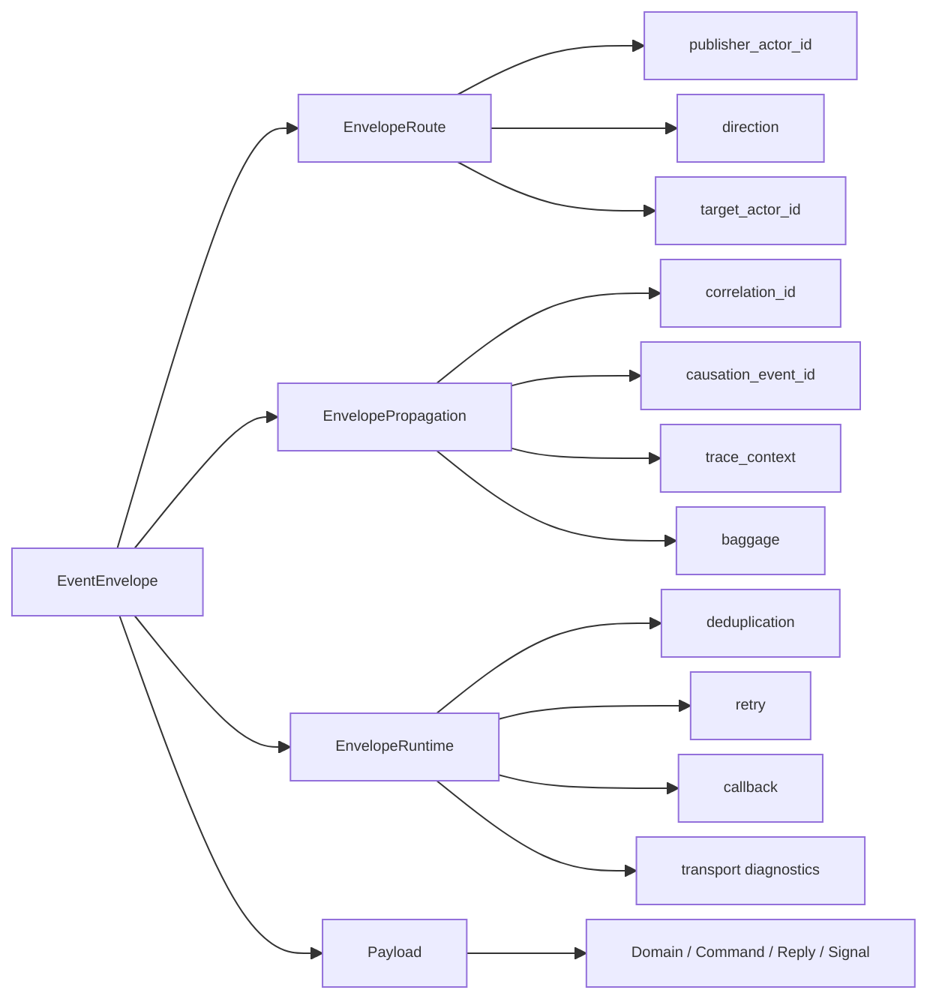

# EventEnvelope Propagation / Runtime 语义解耦重构蓝图（2026-03-11）

## 1. 文档元信息

- 状态：Proposed
- 版本：R1
- 日期：2026-03-11
- 范围：
  - `src/Aevatar.Foundation.Abstractions`
  - `src/Aevatar.Foundation.Core`
  - `src/Aevatar.Foundation.Runtime`
  - `src/Aevatar.Foundation.Runtime.Implementations.Local`
  - `src/Aevatar.Foundation.Runtime.Implementations.Orleans`
  - `src/Aevatar.CQRS.*`
  - `src/workflow/*`
  - `src/Aevatar.Presentation.AGUI`
- 关联文档：
  - `docs/architecture/2026-03-09-cqrs-command-actor-receipt-projection-blueprint.md`
  - `docs/architecture/2026-03-10-workflow-run-event-protobuf-unification-blueprint.md`
  - `docs/architecture/stream-first-tracing-design.md`
  - `docs/FOUNDATION.md`
  - `docs/CQRS_ARCHITECTURE.md`
- 文档定位：
  - 本文定义 `EventEnvelope` 的终态语义边界。
  - 本文默认“无兼容层硬切换”，不保留 `metadata` bag 的长期兼容路径。
  - 本文不是对当前实现的描述；当前仓库仍处于 `metadata` 时代的过渡态。

## 2. 一句话结论

当前 `EventEnvelope.Metadata` 不是“灵活”，而是“语义混杂的弱约束入口”。  
应当直接重构为：

1. `Route` 只负责寻址与方向
2. `Propagation` 只负责跨 hop 传播上下文
3. `Runtime` 只负责去重 / 重试 / 回调等运行时投递语义
4. 业务语义只留在 payload

也就是说，目标不是“继续维护一个更聪明的 metadata 黑名单”，而是**删除 metadata bag 作为统一抽象**。

## 3. 问题定义

### 3.1 当前事实

当前 [EventEnvelope](/Users/auric/aevatar/src/Aevatar.Foundation.Abstractions/agent_messages.proto#L26) 只有一层 `map<string, string> metadata`。

当前 [IEventPublisher](/Users/auric/aevatar/src/Aevatar.Foundation.Abstractions/IEventPublisher.cs#L13) 也把所有 envelope 级附加语义统一暴露为：

1. `PublishAsync(..., metadata)`
2. `SendToAsync(..., metadata)`

当前 [DefaultEnvelopePropagationPolicy](/Users/auric/aevatar/src/Aevatar.Foundation.Core/Propagation/DefaultEnvelopePropagationPolicy.cs#L8) 只能对 `metadata` 做“按 key 拷贝 + 黑名单过滤”。

当前 [RuntimeEnvelopeDeduplication](/Users/auric/aevatar/src/Aevatar.Foundation.Runtime/Deduplication/RuntimeEnvelopeDeduplication.cs#L8) 又从同一个 `metadata` bag 里读取 dedup key。

这意味着：

1. 传播上下文和 runtime 控制语义混在同一个包里
2. 上游 producer 可以随意写 key
3. 下游 runtime 只能靠字符串约定解释 key
4. 默认传播逻辑天然容易把“不该传播的 runtime 信息”传下去

### 3.2 已暴露的真实缺陷

最近已经出现了一个典型故障：

1. `LLMCallModule` 在请求侧 dispatch 时写入 `DedupOriginId`
2. 子 role 收到请求后，把 inbound `metadata` 原样传播到响应事件
3. parent run actor 收到 `TextMessageStart/Content/End` 时，因为 `DedupOriginId` 相同，被 runtime dedup 当成重复包丢弃
4. 最终 workflow 卡死在“收不到 completion”

问题根因不是 dedup 实现本身，而是：

1. `DedupOriginId` 是请求投递语义
2. 它却被放进了“默认可传播 metadata”
3. 因而进入了完全错误的生命周期范围

### 3.3 为什么这不是个别 bug

只要系统继续保留统一 `metadata` bag，未来还会继续长出同类问题：

1. retry key 被错误传播到正常响应链路
2. callback lease 被错误带到跨 actor 正常事件
3. route 统计字段进入业务投影
4. host / adapter 又把内部 runtime key 当成对外语义输出

所以这不是修一个 key 的问题，而是**Envelope 结构本身设计未完成**。

## 4. 架构诊断

### 4.1 当前 `metadata` 混合了四类完全不同的语义

当前 `metadata` 实际承载了以下四类信息：

1. 传播语义  
   例如 `correlation` 关联、trace 上下文、tenant/locale 等跨 hop 传播信息
2. runtime 投递语义  
   例如 dedup、retry、callback、route 统计
3. 观测/调试辅助信息  
   例如内部诊断 key、调试来源
4. 被误塞进去的业务语义  
   例如有些模块试图把业务判断结果也挂在 envelope metadata 上

这四类信息的生命周期、读者、持久化要求、传播边界完全不同，不应共享一个存储位点。

### 4.2 当前抽象违反了仓库已有原则

它违反了仓库已经明确写下的几条原则：

1. “统一包络不等于统一语义”
2. “数据语义分层”
3. “API 字段单一语义”
4. “抽象一旦能被滥用，就等于设计未完成”

现在的 `metadata` 字段正好违反“字段单一语义”：一个字段同时表达 trace、dedup、callback、debug、tenant 甚至被滥用来带业务语义。

### 4.3 当前模式的假灵活性

`map<string, string>` 的所谓“灵活”只对写入者成立，不对系统成立。

它的问题是：

1. 没有类型约束
2. 没有发现能力
3. 没有传播边界
4. 没有 ownership
5. 没有 schema 演进规则
6. 没有办法在 review 或静态门禁中判断 key 是否合理

因此它不是架构上的扩展点，而是架构上的逃逸口。

## 5. 重构目标

本轮终态目标如下：

1. `EventEnvelope` 不再包含统一 `metadata` bag
2. `Route / Propagation / Runtime` 三类语义显式分层
3. dedup / retry / callback 不再靠字符串 key 传递
4. trace / correlation / baggage 只在 propagation 层传播
5. payload 中的业务语义不再与 envelope runtime 控制混用
6. `IEventPublisher` 不再暴露原始 `metadata` 参数
7. 默认传播逻辑不再需要黑名单
8. 静态守卫可以直接禁止 envelope 级 bag 语义回流

## 6. 非目标

本轮不做以下事情：

1. 不把统一 envelope 模式改成多种物理 envelope 类型
2. 不改变 Actor runtime 的核心交互哲学
3. 不把业务 payload 里的业务 `Metadata` 字段强行删掉
4. 不为了“灵活性”保留新的 runtime bag
5. 不保留旧 `metadata` 兼容字段或 fallback

## 7. 目标架构

### 7.1 终态消息结构



### 7.2 设计原则

终态必须满足：

1. `Route` 只描述“把消息送到哪里”
2. `Propagation` 只描述“哪些上下文跨 hop 继续存在”
3. `Runtime` 只描述“运行时如何安全投递/重试/对账”
4. payload 只描述“业务消息本身”

任何信息只能归入其中一层，不能再复用同一字段承载多重语义。

## 8. 目标 protobuf 契约

### 8.1 EventEnvelope

建议直接重写 [agent_messages.proto](/Users/auric/aevatar/src/Aevatar.Foundation.Abstractions/agent_messages.proto#L26)：

```proto
syntax = "proto3";

package aevatar;

option csharp_namespace = "Aevatar.Foundation.Abstractions";

import "google/protobuf/any.proto";
import "google/protobuf/timestamp.proto";

message EventEnvelope {
  string id = 1;
  google.protobuf.Timestamp timestamp = 2;
  google.protobuf.Any payload = 3;
  EnvelopeRoute route = 4;
  EnvelopePropagation propagation = 5;
  EnvelopeRuntime runtime = 6;
}
```

### 8.2 Route 层

```proto
message EnvelopeRoute {
  string publisher_actor_id = 1;
  EventDirection direction = 2;
  string target_actor_id = 3;
}
```

约束：

1. `publisher_actor_id` 表示当前 hop 的发布者
2. `target_actor_id` 仅在 point-to-point dispatch 时使用
3. loop prevention、self skip、forwarding 只依赖 route 层，不再依赖 bag key

### 8.3 Propagation 层

```proto
message TraceContext {
  string trace_id = 1;
  string span_id = 2;
  string trace_flags = 3;
}

message EnvelopePropagation {
  string correlation_id = 1;
  string causation_event_id = 2;
  TraceContext trace = 3;
  map<string, string> baggage = 4;
}
```

约束：

1. `correlation_id` 是请求级追踪标识，不是目标 actor 身份
2. `causation_event_id` 表示直接上游 envelope id
3. `trace` 只承载 observability 信息
4. `baggage` 是唯一保留的 open extension 点，但仅限“跨 hop 可传播上下文”
5. `baggage` 禁止承载 dedup / retry / callback / route 语义

### 8.4 Runtime 层

```proto
message DeliveryDeduplication {
  string operation_id = 1;
  int32 attempt = 2;
}

message RetryContext {
  string origin_event_id = 1;
  int32 attempt = 2;
}

message CallbackContext {
  string callback_id = 1;
  int64 generation = 2;
}

message EnvelopeRuntime {
  DeliveryDeduplication deduplication = 1;
  RetryContext retry = 2;
  CallbackContext callback = 3;
}
```

约束：

1. `DedupOriginId` 不再作为字符串 key 出现
2. retry 语义不再靠 bag key
3. callback lease 不再靠 bag key
4. runtime 字段默认不传播，只有 runtime assembler 显式构造

### 8.5 删除项

以下内容应直接删除：

1. `EventEnvelope.metadata`
2. `EnvelopeMetadataKeys`
3. 所有 `metadata["trace.*"]`
4. 所有 `metadata["__dedup_*"]`
5. 所有 `metadata["__source_actor_id"]`
6. 所有 `metadata["__route_target_count"]`

## 9. 字段落位规则

| 语义 | 应放位置 | 说明 |
| --- | --- | --- |
| correlation | `EnvelopePropagation.correlation_id` | 请求级追踪 |
| causation | `EnvelopePropagation.causation_event_id` | 直接上游 event id |
| trace id/span/flags | `EnvelopePropagation.trace` | 观测语义 |
| tenant / locale / request scope | `EnvelopePropagation.baggage` | 可传播上下文 |
| dedup operation id | `EnvelopeRuntime.deduplication.operation_id` | runtime-only |
| retry origin / attempt | `EnvelopeRuntime.retry` | runtime-only |
| callback lease | `EnvelopeRuntime.callback` | runtime-only |
| branch / result / human input | payload | 业务语义 |

判定规则：

1. 接收方业务 handler 要读的，放 payload
2. 需要跨 hop 保留且不改变业务语义的，放 propagation
3. 只给 runtime 投递层读的，放 runtime

## 10. API 级重构

### 10.1 `IEventPublisher`

当前 [IEventPublisher](/Users/auric/aevatar/src/Aevatar.Foundation.Abstractions/IEventPublisher.cs#L13) 的原始 `metadata` 参数应直接删除。

目标形态：

```csharp
public interface IEventPublisher
{
    Task PublishAsync<TEvent>(
        TEvent evt,
        EventDirection direction = EventDirection.Down,
        CancellationToken ct = default,
        EventEnvelope? sourceEnvelope = null,
        PublishOptions? options = null)
        where TEvent : IMessage;

    Task SendToAsync<TEvent>(
        string targetActorId,
        TEvent evt,
        CancellationToken ct = default,
        EventEnvelope? sourceEnvelope = null,
        SendOptions? options = null)
        where TEvent : IMessage;
}
```

### 10.2 Options 分层

```csharp
public sealed record PublishOptions(
    PropagationOverrides? Propagation = null,
    RuntimeDeliveryOptions? Runtime = null);

public sealed record SendOptions(
    PropagationOverrides? Propagation = null,
    RuntimeDeliveryOptions? Runtime = null);

public sealed record PropagationOverrides(
    string? CorrelationId = null,
    TraceContextModel? Trace = null,
    IReadOnlyDictionary<string, string>? Baggage = null);

public sealed record RuntimeDeliveryOptions(
    string? DeduplicationOperationId = null,
    RetryOverrides? Retry = null,
    CallbackLeaseModel? Callback = null);
```

目标：

1. 写调用点时必须显式说“我是在覆盖 propagation，还是在声明 runtime delivery”
2. 调用点不能再传任意字符串 key
3. code review 可以直接判断语义是否放对层

### 10.3 `IActorDispatchPort`

`Dispatch Port` 也要同步升级为 typed envelope / typed options，不允许把 runtime bag 继续藏在 envelope 外侧调用参数里。

## 11. 运行时职责拆分

### 11.1 替换 `DefaultEnvelopePropagationPolicy`

当前 [DefaultEnvelopePropagationPolicy](/Users/auric/aevatar/src/Aevatar.Foundation.Core/Propagation/DefaultEnvelopePropagationPolicy.cs#L8) 的职责过宽，应拆成：

1. `IPropagationContextLinker`
   - 从 inbound envelope 建立 `correlation / causation / trace / baggage`
2. `IRuntimeEnvelopeAssembler`
   - 为 outbound envelope 填充 `dedup / retry / callback`
3. `ITraceContextPopulator`
   - 用当前 runtime `Activity` 更新 trace 字段

### 11.2 替换 `EnvelopePublishContextHelpers`

当前 [EnvelopePublishContextHelpers](/Users/auric/aevatar/src/Aevatar.Foundation.Runtime/Propagation/EnvelopePublishContextHelpers.cs#L7) 应改造成一个仅做 orchestration 的 helper：

1. 创建空 envelope
2. 写 route
3. 调用 propagation linker
4. 调用 runtime assembler
5. 调用 trace populator

它不再直接操作字符串 key。

### 11.3 替换 dedup 读取逻辑

当前 [RuntimeEnvelopeDeduplication](/Users/auric/aevatar/src/Aevatar.Foundation.Runtime/Deduplication/RuntimeEnvelopeDeduplication.cs#L8) 应改为：

1. 优先读取 `envelope.Runtime.Deduplication.OperationId`
2. 无该字段时可退回 `envelope.Id`
3. attempt 只读 `envelope.Runtime.Retry.Attempt`

目标是让 dedup 逻辑完全不再了解 metadata key 名称。

## 12. Route 语义修正

### 12.1 `SourceActorId` 直接删除

当前 `__source_actor_id` 只有极少数运行时代码会读，且与 `publisher_id` 高度重叠。

目标态：

1. 不再保留 `SourceActorId`
2. 所有 self-skip / loop-prevention 逻辑统一改读 `route.publisher_actor_id`
3. 如果未来确实需要“原始发起 actor”概念，应显式新增 typed 字段，而不是继续复用 metadata

### 12.2 `RouteTargetCount` 直接移出 envelope

`__route_target_count` 是观测统计，不是 envelope 权威事实。

目标态：

1. 不再写入 envelope
2. 由 publisher 在本地 metrics/log scope 记录
3. 不进入跨 hop wire contract

## 13. 传播策略重写

### 13.1 当前错误模型

当前模型是：

1. 复制 inbound metadata
2. 黑名单过滤
3. 覆盖少数字段

这个模型的问题是默认“全传播”，风险极高。

### 13.2 目标模型

目标模型改为“白名单建模”：

1. 只从 inbound 继承 `Propagation`
2. 只由 runtime assembler 构造 `Runtime`
3. payload 自身不受 envelope propagation 影响

也就是说，runtime 字段从来不是“复制”出来的，而是每一跳重新装配出来的。

## 14. Baggage 的边界

### 14.1 为什么仍然保留一个开放扩展点

完全没有开放扩展点会导致所有 tenant / locale / request scope 一类上下文都必须不断加字段，工程上不划算。

因此本文建议保留一个非常窄的扩展点：

1. `EnvelopePropagation.Baggage`

### 14.2 Baggage 的使用规则

`Baggage` 只能放：

1. 端到端传播上下文
2. 不参与 runtime 控制
3. 不影响 retry / dedup / callback / routing
4. 不构成业务事实

禁止放：

1. dedup key
2. retry attempt
3. callback id
4. route count
5. runtime 内部诊断控制位
6. 业务完成结果

### 14.3 为什么这比统一 metadata 更好

这仍然保留了必要的扩展性，但把扩展范围限定在“Propagation 层”，不再给 runtime 和业务层开后门。

## 15. 项目级改造清单

### 15.1 `Aevatar.Foundation.Abstractions`

必须改动：

1. 重写 `agent_messages.proto`
2. 删除 `EnvelopeMetadataKeys.cs`
3. 为 typed envelope 新增：
   - `EnvelopeRoute`
   - `EnvelopePropagation`
   - `EnvelopeRuntime`
   - `TraceContext`
   - `DeliveryDeduplication`
   - `RetryContext`
   - `CallbackContext`
4. 重写 `IEventPublisher`
5. 若存在 dispatch 抽象，也同步升级 typed options

### 15.2 `Aevatar.Foundation.Core`

必须改动：

1. 删除 metadata-copy 型 propagation policy
2. 新增 `IPropagationContextLinker`
3. 新增 `IRuntimeEnvelopeAssembler`
4. 新增 `ITraceContextPopulator`
5. 调整 `GAgentBase` 发布辅助方法签名

### 15.3 `Aevatar.Foundation.Runtime`

必须改动：

1. 重写 `EnvelopePublishContextHelpers`
2. 重写 `RuntimeEnvelopeDeduplication`
3. 重写 callback envelope metadata 读取逻辑
4. 重写 observability 中 trace 恢复逻辑，直接读 `Propagation.Trace`

### 15.4 `Aevatar.Foundation.Runtime.Implementations.Local`

必须改动：

1. `LocalActorPublisher`
2. `LocalActor`
3. 任何读写 envelope metadata key 的逻辑

### 15.5 `Aevatar.Foundation.Runtime.Implementations.Orleans`

必须改动：

1. `OrleansGrainEventPublisher`
2. `RuntimeActorGrain`
3. retry policy
4. 任何基于 metadata key 的 loop-prevention / dedup / callback 判定

### 15.6 `Aevatar.Workflow.*`

必须改动：

1. 全部 `SendToAsync(..., metadata)` / `PublishAsync(..., metadata)` 调用点
2. `LLMCallModule` 之类显式设置 dedup key 的地方改用 typed runtime delivery options
3. 所有读取 envelope runtime metadata 的地方改读 typed runtime fields

### 15.7 `Aevatar.CQRS.*`

必须改动：

1. command envelope factory 改成构造 typed propagation
2. receipt / observe 相关 correlation 读取改读 `Propagation`

### 15.8 `Aevatar.Presentation.AGUI` 与 Host

必须改动：

1. Host 侧如需输出 envelope 诊断信息，只能显式映射需要的 typed propagation 字段
2. 禁止对外原样暴露 runtime delivery fields

## 16. 删除清单

以下项目应在同一轮重构中直接删除，不保留兼容壳：

1. `EventEnvelope.metadata`
2. `EnvelopeMetadataKeys`
3. 所有 `metadata["trace.*"]` 写入辅助
4. 所有 `metadata["__*"]` runtime key
5. 所有 `PublishAsync(..., metadata: ...)`
6. 所有 `SendToAsync(..., metadata: ...)`
7. 所有 `DefaultEnvelopePropagationPolicy` 黑名单逻辑

## 17. 实施顺序

本轮建议一次性硬切，不做双轨兼容。

### 17.1 Phase 1: 契约与接口硬切

1. 改 proto
2. 生成新 envelope 类型
3. 改 `IEventPublisher`
4. 编译期打爆所有旧调用点

### 17.2 Phase 2: Runtime 装配逻辑重写

1. 重写 publisher
2. 重写 propagation linker
3. 重写 dedup / retry / callback 读取逻辑
4. 重写 trace restore / log scope

### 17.3 Phase 3: 全仓调用点收敛

1. workflow 调用点
2. CQRS 调用点
3. scripting / AI / host 调用点
4. 所有测试 fixture / helper

### 17.4 Phase 4: 守卫与文档

1. 加静态门禁
2. 更新旧架构文档
3. 全量 build/test/guards

## 18. 测试与门禁

### 18.1 必须新增的测试

1. propagation 只继承 `EnvelopePropagation`
2. runtime dedup 不会进入响应链路
3. retry context 在重试链路正确递增
4. callback context 不会误传播到普通业务事件
5. local / orleans runtime 对 typed envelope 行为一致
6. workflow maker / llm / evaluate / reflect 等链路不再因 runtime 字段污染卡死

### 18.2 必须新增的静态守卫

1. 禁止新增 `EventEnvelope.Metadata`
2. 禁止引用 `EnvelopeMetadataKeys`
3. 禁止 `PublishAsync(..., metadata: ...)`
4. 禁止 `SendToAsync(..., metadata: ...)`
5. 禁止 runtime 代码扫描字符串 key `trace.` / `__`

### 18.3 必跑命令

1. `dotnet build aevatar.slnx --nologo`
2. `dotnet test aevatar.slnx --nologo`
3. `bash tools/ci/architecture_guards.sh`
4. `bash tools/ci/test_stability_guards.sh`
5. `bash tools/ci/workflow_binding_boundary_guard.sh`
6. `bash tools/ci/projection_route_mapping_guard.sh`
7. `bash tools/ci/solution_split_guards.sh`
8. `bash tools/ci/solution_split_test_guards.sh`

## 19. 需要同步更新的既有文档

本蓝图落地后，下列文档必须同步重写相应章节：

1. `docs/architecture/stream-first-tracing-design.md`
   - 其中基于 `metadata["trace.*"]` 的设计需改为 `EnvelopePropagation.Trace`
2. `docs/FOUNDATION.md`
   - 其中“EventEnvelope 含 metadata”表述需要删除
3. `docs/CQRS_ARCHITECTURE.md`
   - 其中 `commandId / correlationId / metadata` 表述需要拆层
4. `docs/architecture/AEVATAR_MAINNET_ARCHITECTURE.md`
   - 其中 envelope 字段说明需更新
5. `docs/WORKFLOW_LLM_STREAMING_ARCHITECTURE.md`
   - 其中 envelope metadata 相关说明需改为 typed propagation / runtime

## 20. 为什么这比继续维护 metadata 更优

### 20.1 不是减少灵活性，而是收窄错误扩展面

终态仍然保留了一个扩展点：

1. `EnvelopePropagation.Baggage`

也仍然保留了 schema 演进空间：

1. `EnvelopeRuntime` 可继续加 typed field
2. payload 可继续用 protobuf 正常演进

因此不是“不能扩展”，而是“不允许无边界扩展”。

### 20.2 最重要的收益

收益不是代码更少，而是语义边界真正稳定：

1. dedup 不会再误入响应链路
2. retry/callback 不会再污染正常事件
3. trace 不再和 runtime key 混读
4. 业务 payload 不再被 envelope bag 旁路污染
5. 架构守卫终于可以自动化验证

## 21. 验收标准

达到以下标准才算完成：

1. 仓库中不再存在 `EventEnvelope.metadata`
2. 仓库中不再存在 `EnvelopeMetadataKeys`
3. publisher / dispatch API 不再接受原始 metadata 字典
4. propagation 与 runtime 分层在 proto 和 API 两层都显式存在
5. dedup / retry / callback 全部改为 typed runtime fields
6. tracing 全部改为 typed propagation fields
7. 全量 build/test/guards 通过
8. 既有架构文档全部同步完成

## 22. 最终决策

最终建议不是：

1. 继续保留 `metadata`
2. 再加更多黑名单
3. 再写一层“智能 metadata 传播器”

最终建议是：

1. **删除统一 metadata bag**
2. **重建 typed Route / Propagation / Runtime 三层 envelope**
3. **把唯一开放扩展点收敛到 Propagation.Baggage**
4. **把 runtime 语义从“字符串约定”升级为“显式 schema”**

这是从架构上彻底解决问题的最短路径，也是唯一不会反复长出同类 bug 的路径。
