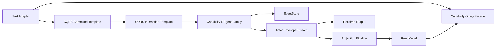

# GAgent 中心化 CQRS Capability 架构变更要求（2026-03-11）

## 1. 文档元信息

- 状态：Implemented
- 版本：R2
- 日期：2026-03-11
- 适用范围：
  - `src/Aevatar.Foundation.*`
  - `src/Aevatar.CQRS.Core*`
  - `src/Aevatar.CQRS.Projection.*`
  - `src/workflow/*`
  - `src/Aevatar.Scripting.*`
  - `src/Aevatar.Mainnet.Host.Api`
  - `src/workflow/Aevatar.Workflow.Host.Api`
- 文档定位：
  - 本文定义本轮架构变更的正式要求、工作包、验收标准与治理规则，并同步记录最终落地状态。
  - 本文聚焦 `GAgent` 中心化 capability 扩展模型，以及 `CQRS` 在该模型中的统一职责。
  - 本文已完成回写；若实现与原始目标式表述存在差异，以“当前执行快照”和各状态矩阵为准。
- 关联文档：
  - `docs/CQRS_ARCHITECTURE.md`
  - `docs/FOUNDATION.md`
  - `docs/architecture/2026-03-09-cqrs-command-actor-receipt-projection-blueprint.md`
  - `docs/architecture/2026-03-11-gagent-centric-cqrs-capability-unification-blueprint.md`
- 最近一次验证结果：
  - `dotnet build aevatar.slnx --nologo`
  - `dotnet test aevatar.slnx --nologo`
  - `bash tools/ci/architecture_guards.sh`
  - `bash tools/ci/projection_route_mapping_guard.sh`
  - `bash tools/ci/workflow_binding_boundary_guard.sh`
  - `bash tools/ci/test_stability_guards.sh`
  - `bash tools/ci/solution_split_guards.sh`
  - `bash tools/ci/solution_split_test_guards.sh`

## 2. 背景与关键决策（统一认知）

### 2.1 背景

当前仓库已经拥有较完整的底座：

1. `GAgentBase` / `GAgentBase<TState>` 提供统一事件管线、状态回放与 event sourcing 生命周期。
2. `IActorRuntime` / `IActorDispatchPort` 提供 actor 生命周期与 envelope dispatch。
3. `DefaultCommandDispatchPipeline<TCommand, TTarget, TReceipt, TError>` 已经证明命令骨架可以抽象为业务无关模板。
4. `Aevatar.CQRS.Projection.*` 已经提供统一 projection lifecycle、ownership、session、store dispatch 基础设施。

问题不在底座缺失，而在接入层没有完全统一：

1. 部分业务系统已接入标准命令骨架。
2. 部分业务系统仍然通过 capability 私有 lifecycle facade 自行拼接命令、观察、回退、清理流程。
3. 观察阶段仍缺少与命令阶段同等级的通用模板。

### 2.2 关键决策

本轮变更先固定以下决策：

1. `GAgent` 是唯一业务事实边界。
2. `CQRS` 只负责稳定的 capability 接入机制，不表达任何具体业务系统关系。
3. `Projection` 是统一的 read-side 与 realtime observation 主干。
4. 外部入口只允许通过标准命令、查询、交互模板接入能力。
5. actor 内部实现可以不同，但差异不得泄露到 `CQRS` 公共抽象层。

### 2.3 不可妥协边界

1. Host 不承载业务编排生命周期。
2. 中间层不维护 actor/run/session 权威事实态。
3. 内部事实状态、领域事件、session 载荷统一使用 `Protobuf`。
4. 读写分离继续保持：写侧 actor 决策，读侧 projection/read model 查询。

## 3. 重构目标

本轮只保留以下可验收目标：

1. 建立统一的 `GAgent capability` 接入模型。
2. 让 `CQRS Core` 同时拥有命令阶段与观察阶段的通用模板。
3. 消除业务系统在 Application / Infrastructure / Projection 接入层的重复样板。
4. 明确抽象、继承、范型的使用边界，避免继续长出并行框架。
5. 为后续代码重构提供 WBS、门禁与验收矩阵。

## 4. 范围与非范围

### 4.1 范围

本轮覆盖：

1. `GAgent` 中心化 capability 模型。
2. `CQRS Core` 的命令与观察抽象补齐。
3. capability 接入层的统一方式。
4. `Projection` 与 query 边界。
5. 抽象、设计模式、继承、范型使用规范。
6. 现有样本的迁移策略与验收标准。

### 4.2 非范围

本轮不处理：

1. 具体业务流程设计。
2. 某两个业务系统之间的主从、替代、聚合关系定义。
3. 运行时产品替换。
4. 对外 HTTP/WS 协议格式重设计。
5. 领域事件语义本身的大规模重命名。

## 5. 架构硬约束（必须满足）

### 5.1 GAgent 事实边界

1. 所有稳定业务事实必须由一个明确的 `GAgent` 或一个明确 actor family 承载。
2. 任何 capability 的外部命令都必须指向稳定 actor 边界，而不是临时中间对象。
3. actor 内部插件、module、runtime helper 不得升级为新的权威事实源。

### 5.2 CQRS 统一职责

1. `CQRS Core` 负责 `Resolve -> Context -> Envelope -> Dispatch -> Receipt -> Observe -> Finalize -> Release`。
2. capability 只实现领域特化的 resolver、mapper、policy、read model 映射。
3. 禁止 Host/Application 直接拼装 capability 私有生命周期。

### 5.3 Projection 统一职责

1. 所有 realtime output 与 read-side 观察统一走 projection 主链。
2. capability-specific lifecycle port 只能作为薄别名存在。
3. 禁止自建与 projection 并行的私有 session bus。

### 5.4 抽象规则

1. 先抽象稳定机制，再抽象业务差异。
2. 抽象名称必须表达职责，不得泄露偶然实现路径。
3. 抽象必须能被至少两个样本复用，或能证明其语义稳定；否则先保留在业务层。
4. 不允许为了“未来扩展”提前引入无真实消费者的泛化接口。

### 5.5 继承规则

仅在以下条件下允许引入抽象基类：

1. 存在稳定生命周期模板。
2. 子类必须遵守同一组不变量。
3. 共享逻辑不是简单委托拼装，而是固定执行顺序的模板方法。

继承约束：

1. 优先 `sealed` 默认实现，谨慎暴露 `protected virtual`。
2. 抽象基类层级原则上不超过 2 层。
3. 继承只用于复用稳定骨架，不用于表达业务分类树。
4. 能用组合解决的能力差异，不通过继承层次表达。

### 5.6 范型规则

仅在以下条件下允许引入范型抽象：

1. 算法骨架完全一致，仅类型语义不同。
2. 类型参数能显著减少重复样板。
3. 约束条件能明确表达不变量。

范型约束：

1. 每个类型参数都必须有清晰职责。
2. 禁止“占位型”无语义泛型参数。
3. 禁止为业务名词建开放泛型壳层。
4. 需要稳定 contract 时，优先 `where T : interface/base contract`。
5. 范型数量超过 5 个时必须额外论证，否则优先拆分职责。

### 5.7 命名规则

1. 机制层命名不得出现具体业务主从关系暗示。
2. capability 私有实现可以表达业务语义，但公共抽象不得带入业务比较或关系判断。
3. `Metadata` 命名继续遵守仓库既有约束，不用于内部泛化 bag。

## 6. 当前基线（代码事实）

### 6.1 已有可复用骨架

当前仓库中，以下代码已经证明“稳定机制应当抽象到通用层”：

| 代码事实 | 证据路径 | 当前意义 |
|---|---|---|
| 统一命令骨架 | `src/Aevatar.CQRS.Core/Commands/DefaultCommandDispatchPipeline.cs` | 已统一 `Resolve -> Context -> Envelope -> Dispatch -> Receipt` |
| 通用 dispatcher | `src/Aevatar.CQRS.Core/Commands/ActorCommandTargetDispatcher.cs` | `IActorDispatchPort` 级别的 runtime-neutral dispatch |
| 生命周期基类 | `src/Aevatar.CQRS.Projection.Core/Orchestration/EventSinkProjectionLifecyclePortServiceBase.cs` | 证明 projection lifecycle 可由抽象基类统一 |
| Query 基类 | `src/Aevatar.CQRS.Projection.Core/Orchestration/ProjectionQueryPortServiceBase.cs` | 证明 query enable-gate 可通用 |
| 状态型 actor 基类 | `src/Aevatar.Foundation.Core/GAgentBase.TState.cs` | 证明 `GAgent` 生命周期与状态不变量稳定 |
| 配置型 actor 基类 | `src/Aevatar.Foundation.Core/GAgentBase.TState.TConfig.cs` | 证明可配置 actor 可通过受控继承复用稳定骨架 |

### 6.2 当前重复样板的主要来源

当前仓库中，以下样板仍然重复：

| 问题域 | 证据路径 | 现状 |
|---|---|---|
| 交互编排样板 | `src/Aevatar.CQRS.Core/Interactions/DefaultCommandInteractionService.cs` | 已收敛为通用交互模板，业务仅保留 capability policy |
| scripting command adapter 样板 | `src/Aevatar.Scripting.Infrastructure/Ports/ScriptingActorCommandTarget.cs` / `RuntimeScriptDefinitionCommandService.cs` / `RuntimeScriptCommandService.cs` / `RuntimeScriptCatalogCommandService.cs` | 已删除直投 adapter 基类，改为标准 command pipeline + 统一 target/receipt 注册 |
| scripting 演化入口 | `src/Aevatar.Scripting.Infrastructure/Ports/RuntimeScriptEvolutionInteractionService.cs` | 已改为 CQRS generic interaction 包装器，不再手工拼 projection/fallback/cleanup |
| 各类 capability-specific observation adapter | `src/workflow/Aevatar.Workflow.Projection/*` / `src/Aevatar.Scripting.Projection/*` | 继续共用统一 projection 主链，保留薄 capability alias |

### 6.3 当前样本显示出的两类实现模式

当前仓库至少存在两类 capability 内部实现模式：

1. 单 actor 主事实边界 + actor 内部 plugin/module。
2. 多 actor family 协作 + actor 内部 runtime contract。

这两类都属于业务内部实现差异，不应导致 `CQRS` 接入抽象分叉。

## 7. 需求分解与状态矩阵

| ID | 需求 | 验收标准 | 当前状态 | 证据 | 差距 |
|---|---|---|---|---|---|
| R1 | `CQRS Core` 统一命令阶段与观察阶段 | 存在通用 interaction template，至少两个样本可接入 | Completed | `DefaultCommandInteractionService` 已落地，`workflow` 与 `scripting evolution` 已接入 | 无结构性缺口 |
| R2 | capability 不得自带总入口 lifecycle port | 主链路移除 capability 私有 lifecycle facade | Completed | `IScriptLifecyclePort` / `RuntimeScriptLifecyclePort` 已删除 | 后续只继续压缩窄 adapter 与 flow 组合层 |
| R3 | 机制层抽象不表达业务系统关系 | 通用接口、文档、守卫均无主从关系假设 | Completed | 通用抽象与本文档均已按 `GAgent capability family` 回写 | 无 |
| R4 | 抽象、继承、范型使用有硬规则 | 新增书面规则与门禁 | Completed | 规则已成文，门禁包含 `architecture_guards` / `script_inheritance_guard` / `scripting_interaction_boundary_guard` | 无 |
| R5 | Projection 继续单主干 | 不新增并行 session/observe 链路 | Completed | `workflow` / `scripting` 观察继续走统一 projection 主链 | 无 |
| R6 | 业务层样板最小化 | 业务层代码主要剩 resolver/policy/reducer/state machine | Completed | 通用交互、cleanup、fallback、dispatch 样板已前移或用范型基类收敛 | 无 |

## 8. 差距详解

### 8.1 命令阶段与观察阶段不对称

当前系统已经有统一命令阶段，但观察阶段仍分散在业务系统内。

影响：

1. cleanup/finalize 样板重复。
2. completion policy 无法标准化。
3. Host 很容易反向依赖业务系统私有 facade。

### 8.2 capability 私有总入口破坏统一接入模型

当一个 capability 同时暴露“命令 + 查询 + 生命周期 + 回退”的总入口接口时：

1. Host/Application 会绕过标准骨架。
2. query/dispatch/cleanup 容易被揉成一个全能接口。
3. 后续任何新业务系统都会复制同一模式。

### 8.3 抽象层次不够清晰

当前已有不少好抽象，但还缺少统一原则来判断：

1. 什么时候该用抽象基类。
2. 什么时候该用组合。
3. 什么时候该用范型。
4. 什么时候应留在业务层。

没有这套规则时，重构很容易从“减少重复”变成“增加空壳抽象”。

## 9. 目标架构

### 9.1 总体结构

### 9.2 设计模式选择

目标架构应采用以下模式，并限制其适用边界：

1. `Template Method`
   用于固定命令与观察生命周期骨架。
   适用对象：dispatch pipeline、interaction template、projection lifecycle base。

2. `Strategy`
   用于表达 capability 差异点。
   适用对象：target resolver、completion policy、durable resolver、frame mapper、receipt factory。

3. `Adapter`
   用于协议与模型边界转换。
   适用对象：Host request normalizer、frame mapper、session codec、external DTO mapper。

4. `Factory`
   用于 envelope、receipt、module、runtime component 创建。
   适用对象：envelope factory、receipt factory、module factory。

5. `Bridge`
   用于 actor 内部 plugin/runtime 与 `GAgent` 事件管线对接。
   适用对象：actor 内部 module bridge。

6. `Composition over Inheritance`
   用于 capability 行为扩展与可替换策略装配。
   适用对象：policy、resolver、hook、middleware、tooling、query reader。

### 9.3 抽象层级设计

目标态把抽象分成三层：

1. `骨架抽象`
   负责固定生命周期与不变量。
   形式：抽象基类或 sealed pipeline。

2. `差异点抽象`
   负责表达 capability 差异。
   形式：接口、策略对象、工厂接口。

3. `业务实现`
   负责 actor 状态机、事件语义、读模型、查询映射。
   形式：具体类、reducer、projector、actor。

规则：

1. 不允许跳过差异点抽象，直接在骨架里 hardcode 某个业务系统行为。
2. 不允许为差异点创建深层继承树；优先组合。

### 9.4 继承设计

推荐继承面：

1. `GAgentBase<TState>`
2. `GAgentBase<TState, TConfig>`
3. `ProjectionLifecyclePortServiceBase<...>`
4. `ProjectionQueryPortServiceBase<...>`

新增继承面必须满足：

1. 存在稳定不变量。
2. 至少两个样本会真实复用。
3. 子类扩展点能通过 `protected abstract` 或极少量 `protected virtual` 明确表达。

禁止：

1. 用继承表达 capability 业务分类。
2. 为一个具体业务系统建立“只会有一个子类”的抽象基类。
3. 用继承代替策略注入。

### 9.5 范型设计

推荐范型面：

1. `ICommandDispatchPipeline<TCommand, TTarget, TReceipt, TError>`
2. `ICommandTargetResolver<TCommand, TTarget, TError>`
3. `ICommandReceiptFactory<TTarget, TReceipt>`
4. `ICommandCompletionPolicy<TEvent, TCompletion>`
5. `ICommandFinalizeEmitter<TReceipt, TCompletion, TFrame>`
6. `IEventSinkProjectionLifecyclePort<TLease, TEvent>`

范型设计要求：

1. 类型参数应对应真实稳定语义。
2. 约束必须表达 contract，例如 `where TTarget : class, ICommandDispatchTarget`。
3. 对运行时 lease 与对外 lease contract 的关系，允许使用 `where TRuntimeLease : class, TLeaseContract` 这类约束。

禁止：

1. 把业务系统名词泛型化，例如 `TFooCapabilityContext` 这类无通用价值占位参数。
2. 用 `object` 或弱类型 bag 规避本可建模的类型语义。
3. 用泛型参数数量掩盖职责未拆清的问题。

### 9.6 组合设计

优先组合的场景：

1. 可替换策略。
2. 可选能力。
3. middleware/hook。
4. query reader / completion resolver / frame mapper。
5. actor 内部 runtime helper。

结论：

1. 生命周期骨架用继承或 sealed pipeline。
2. 业务差异点用接口 + 组合。
3. 类型语义稳定时用范型，不稳定时留在业务层。

## 10. 重构工作包（WBS）

### WP1：统一 Observation 抽象

- 目标：补齐命令后半段统一模板。
- 范围：`Aevatar.CQRS.Core.Abstractions`、`Aevatar.CQRS.Core`
- 产物：
  - `ICommandEventTarget<...>`
  - `ICommandInteractionCleanupTarget<...>`
  - `ICommandCompletionPolicy<...>`
  - `ICommandDurableCompletionResolver<...>`
  - `ICommandFinalizeEmitter<...>`
  - `ICommandInteractionService<...>`
- DoD：
  - 至少一个现有样本接入该模板。
  - 无业务名词泄露到公共接口。
- 优先级：P0
- 状态：Completed

### WP2：样本 A 接入通用模板

- 目标：验证单 actor 主事实边界 + actor 内部 plugin 模式可完整接入。
- 范围：现有 workflow 样本相关 Application/Projection/Host
- 产物：
  - 业务特化 policy / mapper
  - 通用 interaction template 的第一批落地
- DoD：
  - 业务层不再持有完整 observe/finalize 循环。
- 优先级：P0
- 状态：Completed

### WP3：样本 B 命令化拆分

- 目标：移除 capability 私有 lifecycle 总入口。
- 范围：现有 scripting 样本相关 Application/Infrastructure/Host
- 产物：
  - 标准命令模型
  - resolver/binder/factory/receipt 接入
  - 删除 lifecycle facade
- DoD：
  - 主链路不再依赖 capability 私有总入口接口。
- 优先级：P0
- 状态：Completed

### WP4：Projection Adapter 收敛

- 目标：继续收敛 observation/session/context 重复样板。
- 范围：`Aevatar.CQRS.Projection.*` 与样本 projection 项目
- 产物：
  - 统一命名规范
  - 更薄的 capability alias
- DoD：
  - 不新增并行 session/observe 链路。
- 优先级：P1
- 状态：Completed

### WP5：门禁与纪律

- 目标：让新分叉无法继续进入仓库。
- 范围：`tools/ci/*` 与对应测试
- 产物：
  - 架构守卫
  - 规则文档
- DoD：
  - 新增命令入口若绕过 CQRS 模板会被 guard 阻止。
- 优先级：P0
- 状态：Completed

## 11. 里程碑与依赖

| 里程碑 | 目标 | 依赖 | 交付件 |
|---|---|---|---|
| M1 | Observation 抽象落地 | 无 | WP1 |
| M2 | 样本 A 接入统一模板 | M1 | WP2 |
| M3 | 样本 B 删除 lifecycle facade | M1 | WP3 |
| M4 | Projection adapter 收敛 | M2, M3 | WP4 |
| M5 | 门禁生效 | M2, M3 | WP5 |

## 12. 验证矩阵（需求 -> 命令 -> 通过标准）

| 需求 | 验证命令 | 通过标准 |
|---|---|---|
| R1 | `dotnet build aevatar.slnx --nologo` | 新增抽象编译通过 |
| R1 | `dotnet test aevatar.slnx --nologo` | 样本接入不破坏主链 |
| R2 | `bash tools/ci/architecture_guards.sh` | 不再允许 capability 私有总入口回流 |
| R3 | 文档审阅 + guard 审阅 | 通用抽象与守卫不包含业务关系假设 |
| R4 | 代码评审 + 架构守卫 | 新增抽象符合继承/范型规则 |
| R5 | `bash tools/ci/projection_route_mapping_guard.sh` | 投影仍走统一主链 |
| R6 | 单元/集成测试 + 代码审阅 | 业务层剩余代码主要为语义实现而非接入样板 |

## 13. 完成定义（Final DoD）

当以下条件同时成立时，本次架构变更视为完成：

1. `CQRS Core` 同时统一命令阶段与观察阶段。
2. 主链路不存在 capability 私有 lifecycle 总入口。
3. 新增 capability 只能通过统一 command/interaction/query 模板接入。
4. 通用抽象层不表达业务系统关系。
5. 继承、范型、组合的使用符合本文规则。
6. 相关守卫、测试、文档同步完成。
7. `build/test/guards` 通过。

## 14. 风险与应对

| 风险 | 说明 | 应对 |
|---|---|---|
| 过度抽象 | 为了统一而引入无真实消费者的空壳接口 | 采用“两样本规则”，没有真实复用先不前移 |
| 继承层次过深 | 抽象基类过多导致可读性变差 | 限制继承层级，优先组合 |
| 泛型爆炸 | 接口类型参数过多难以理解 | 超过 5 个类型参数必须论证，优先拆接口 |
| 样本迁移中断 | 只抽象不迁移，公共接口失真 | 每个公共抽象必须至少落到一个真实样本 |
| 守卫缺失 | 新代码继续绕过模板 | 在 WP5 补 guard 并纳入 CI |

## 15. 执行清单（可勾选）

- [x] 补齐 `CQRS Core` observation 抽象
- [x] 引入通用 interaction template
- [x] 让样本 A 接入通用 interaction template
- [x] 拆除样本 B 的 capability 私有 lifecycle facade
- [x] 收敛 projection adapter 重复样板
- [x] 增加抽象/继承/范型使用守卫
- [x] 更新通用架构文档口径
- [x] 执行 `build/test/guards`

## 16. 当前执行快照（2026-03-11）

- 已完成：
  - `CQRS Core` 已统一 `Resolve -> Context -> Envelope -> Dispatch -> Receipt -> Observe -> Finalize -> Release`
  - `workflow` 命令/交互主链已完全接入 generic interaction template
  - `scripting` 已删除 lifecycle total-port，并将 evolution 外部入口接入 generic interaction template
  - `scripting` definition/runtime/catalog command 入口已接入标准 `ICommandDispatchService` 主链，runtime 创建已独立为 `IScriptRuntimeProvisioningPort`
  - `Projection` 继续保持单主干，无并行 session/observe 总线
  - 文档、测试、门禁已同步回写
- 部分完成：
  - 无
- 未完成：
  - 无
- 阻塞项：
  - 无

## 17. 变更纪律

1. 任何架构抽象新增都必须同时说明：
   - 它解决的重复是什么
   - 为什么不能留在业务层
   - 为什么应使用继承/组合/范型中的哪一种
2. 新增抽象若无法给出第二个潜在消费者，不得直接进入通用层。
3. 新增 capability 入口若绕过 `CQRS Core`，必须视为架构违规。
4. 文档、代码、门禁必须同步演进，不允许只有口头规则。
5. 任何无业务价值或重复的过渡层，在新模板落地后必须删除，不保留空壳兼容层。
