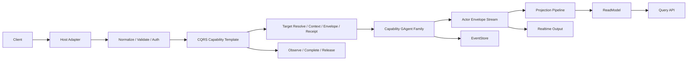

# GAgent 中心化 CQRS Capability 统一重构蓝图（2026-03-11）

## 1. 文档元信息

- 状态：Implemented
- 版本：R2
- 日期：2026-03-11
- 适用范围：
  - `src/Aevatar.Foundation.*`
  - `src/Aevatar.CQRS.Core*`
  - `src/Aevatar.CQRS.Projection.*`
  - `src/workflow/*`
  - `src/Aevatar.Scripting.*`
  - `src/Aevatar.Mainnet.Host.Api`
  - `src/workflow/Aevatar.Workflow.Host.Api`
- 关联文档：
  - `docs/FOUNDATION.md`
  - `docs/CQRS_ARCHITECTURE.md`
  - `docs/SCRIPTING_ARCHITECTURE.md`
  - `docs/architecture/2026-03-09-cqrs-command-actor-receipt-projection-blueprint.md`
  - `docs/architecture/workflow-actor-binding-read-boundary-refactor-plan-2026-03-09.md`
  - `src/workflow/README.md`
- 文档定位：
  - 本文描述“以 `GAgent` 为唯一业务事实边界，以 `CQRS` 为统一 capability 接入骨架”的目标态。
  - 本文保留原始重构蓝图与迁移分阶段设计，并同步记录最终落地结果。
  - 本文默认“不保留长期双轨兼容层”，以主干清晰、职责收敛、业务样板最小化为第一目标。

## 2. 一句话结论

系统的扩展中心应该是 `GAgent`，不是 `workflow`、`scripting` 或任意具体业务能力本身。

因此：

1. `GAgent` 是唯一权威业务事实边界。
2. `CQRS` 必须是面向 `GAgent capability` 的统一命令/观察骨架，而不是某个业务子系统的私有工具箱。
3. 所有业务系统都只是建立在同一套 `GAgent + CQRS + Projection` 模板上的 capability family。
4. 业务层只保留领域语义、状态机、事件契约与读模型，不再重复实现接入样板。

### 2.1 执行结果摘要（2026-03-11）

1. `Aevatar.CQRS.Core` 已落地 generic interaction template，包括 completion policy、durable resolver、finalize emitter 与统一 cleanup。
2. `workflow` 外部命令/交互主链已全面切到 `ICommandInteractionService<...>`。
3. `scripting` 已删除 capability 私有 lifecycle total-port，`evolution` 外部入口改为 generic interaction，`definition/runtime` 命令入口改为范型 command port 骨架。
4. `build/test/guards` 已通过，本文后续阶段性章节保留为迁移留痕；若与当前实现存在冲突，以本节与关联变更要求文档为准。

## 3. 目标与设计原则

### 3.1 目标

本轮重构目标只有四个：

1. 建立以 `GAgent` 为中心的统一 capability 模型。
2. 让 `CQRS Core` 对业务无感，只关心命令、观察、查询、receipt、projection 等稳定机制。
3. 消除各业务系统在 Application / Infrastructure / Projection 接入层的重复样板。
4. 让“单 actor / 多 actor family / actor 内部 module runtime”等业务实现差异不再泄露到 CQRS 接入层。

### 3.2 必须坚持的原则

1. `GAgent` 是唯一可寻址、可持久化、可回放、可投影的业务事实边界。
2. Host 只做协议适配、鉴权、限流、组合；不拥有业务编排生命周期。
3. `CQRS Core` 只抽象稳定机制，不依赖 `workflow`、`script`、`chat`、`maker` 等业务名词。
4. 业务语义必须留在 capability 自己的 `GAgent`、领域事件、状态转换和 reducer 中。
5. 某个业务系统如果在 actor 内部使用 module/plugin 模型，module 只是 actor 内部行为扩展，不是新的事实边界。
6. 某个业务系统如果保留 actor 内部 runtime contract，外部入口仍必须走统一 `CQRS` 骨架，不得通过 capability 私有 lifecycle port 自行拼接主链路。
7. Projection / AGUI / SSE / WS / Query 必须继续共享同一条 read-side pipeline，不允许为某一 capability 再造第二套观测体系。
8. 所有内部持久化、状态、事件、session 载荷继续统一使用 `Protobuf`。

## 4. 当前基线诊断

### 4.1 当前已经统一的部分

当前仓库已经统一了以下底座能力：

1. `GAgentBase` / `GAgentBase<TState>` 统一事件管线、hook、event sourcing、state replay。
2. `EventEnvelope` 统一 runtime message envelope。
3. `IActorRuntime` / `IActorDispatchPort` 统一 actor 生命周期和 envelope dispatch。
4. `Aevatar.CQRS.Projection.*` 已提供统一 projection lifecycle、ownership、session hub、store dispatch 基础设施。
5. `workflow` 命令侧已经部分接入 `DefaultCommandDispatchPipeline<TCommand, TTarget, TReceipt, TError>`。

### 4.2 当前没有统一的部分（重构前基线，保留用于追踪迁移动机）

当前真正造成重复代码的，不是底座，而是 capability 接入模型没有统一。

具体表现如下：

| 领域 | 当前做法 | 问题 |
|---|---|---|
| Workflow 命令入口 | `ICommandDispatchPipeline + ICommandInteractionService` | 已统一到 CQRS generic interaction template |
| Scripting 命令入口 | `IScriptDefinitionCommandPort/IScriptRuntimeCommandPort/... + RuntimeScript*LifecycleService` | 已拆掉总入口；evolution 已接入 generic interaction，definition/runtime 已收敛到范型 command adapter 基类 |
| Workflow 读侧观察 | `IWorkflowExecutionProjectionLifecyclePort` + completion policy + durable resolver | 能力可用，但可抽象部分仍留在 workflow 私有层 |
| Scripting 读侧观察 | `IScriptEvolutionProjectionLifecyclePort` + session codec/context | 与 workflow 共享底层基类，但仍各写一套 capability adapter |
| Workflow 执行模型 | `WorkflowRunGAgent` 内部 module runtime | 是 actor 内部插件模型 |
| Scripting 执行模型 | `ScriptRuntimeGAgent` + compiled runtime contract | 是多 actor 协作模型 |

### 4.3 根因判断（重构前）

当前重复不是因为 `CQRS` 毫无抽象，而是因为抽象停在了“dispatch 底座”层，没有上升到“capability 接入模板”层。

根因可以归纳为四条：

1. `CQRS Core` 当前统一了 `Resolve -> Context -> Envelope -> Dispatch -> Receipt`，但没有统一 `Observe -> Complete -> Release`。
2. capability 仍然各自拥有入口 facade、lifecycle port、query fallback、cleanup orchestration。
3. `workflow` 和 `scripting` 虽然都基于 `GAgent`，但在外部接入上仍被当成两套不同框架来组装。
4. 仓库原则要求“编排统一收敛到 workflow 主链路”，但 `scripting` 现状仍保留了并行能力口径，导致治理目标与实现结构不完全一致。

## 5. 最终架构决议

### 5.1 单一中心：GAgent Capability Family

目标态里，系统中的一等业务能力不再被定义为“某个项目”或“某套 Host API”，而是被定义为：

`一个 capability = 一组 GAgent 事实边界 + 一组命令契约 + 一组查询/投影契约 + 可选的 actor 内部插件机制`

这意味着：

1. capability 可以由一个 `GAgent` 构成。
2. capability 也可以由多个 `GAgent` 组成一个 family。
3. 但无论 capability 内部有几个 actor，它对外都必须复用同一套 `CQRS` 接入骨架。

### 5.2 业务系统关系去语义化

`CQRS` 重构不负责定义业务系统之间的主从、上下游或编排关系。

这意味着：

1. `workflow`、`scripting` 以及未来任何业务系统，在 `CQRS` 层都被视为对等的 `GAgent capability family`。
2. 某两个业务系统之间是否存在调用、编排、依赖、替代、聚合关系，属于业务架构决策，不属于 `CQRS Core` 决议。
3. `CQRS Core` 不得通过接口命名、目录结构或模板假设，把某个业务系统编码成“主干”，把另一个业务系统编码成“插件”。
4. 与具体业务系统关系有关的讨论，应下沉到各自业务架构文档，而不是固化进通用接入层。

### 5.3 Capability Family 的内部实现差异

不同业务系统在内部实现上可以不同：

1. 可以是单个 `GAgent`。
2. 可以是多个 `GAgent` 构成的 actor family。
3. 可以在某个 `GAgent` 内部运行 module/plugin 模型。
4. 也可以在 actor 内部维护编译/执行 runtime contract。

但这些差异只属于业务系统内部实现，不应泄露到 `CQRS` 抽象层。

`CQRS` 对这些差异只承认三件事：

1. 命令最终会投递到某个稳定的 `GAgent` 事实边界。
2. 完成态最终通过统一 observation/read model 契约暴露。
3. 外部接入模板不随业务系统内部实现差异而分叉。

### 5.4 CQRS 的定位

`CQRS Core` 的责任不是“帮 workflow 少写一点代码”，而是定义整个仓库的标准 capability 接入模板。

它必须做到：

1. 对业务语义无感。
2. 对 capability 内部 actor 数量无感。
3. 对是 `workflow`、`script`、`maker`、`chat` 还是将来新能力无感。
4. 只关心命令生命周期、观察生命周期、query/read model 边界和 receipt 语义。

## 6. 目标分层

| 层 | 目标职责 | 允许知道什么 | 禁止知道什么 |
|---|---|---|---|
| Foundation | `GAgent`、runtime、stream、event sourcing、hook、module pipeline | Actor 语义、Envelope 语义 | 具体业务 capability |
| CQRS Core | 命令骨架、观察骨架、query facade、accepted receipt、generic interaction template | `command/target/receipt/observation event` 这类稳定概念 | `workflow/script` 业务词汇 |
| Projection Core | session、lease、ownership、store dispatch、read-side pipeline | projection/root actor/read model | capability 私有入口流程 |
| Capability Domain | `GAgent` 状态机、事件、读模型、领域策略 | 自己的业务语义 | 其他 capability 的内部实现 |
| Host | HTTP/WS/SSE/API 协议适配与组合 | 外部协议模型 | 业务编排细节、actor 内部状态 |

## 7. 目标主链路

目标语义：

1. Host 永远只与 capability command/query model 交互。
2. CQRS 模板统一负责接入链路。
3. capability family 决定真正的 actor 边界和领域事件。
4. Projection 统一负责 read-side 与 realtime observation。

## 8. 统一 Capability 接入模板

### 8.1 命令骨架

目标态统一命令阶段如下：

1. `Normalize`
2. `Resolve Target`
3. `Create CommandContext`
4. `Build Envelope`
5. `Dispatch`
6. `Create Accepted Receipt`
7. `Observe`
8. `Finalize`
9. `Release`

其中：

1. 阶段 1 由 Host/Adapter 负责。
2. 阶段 2-6 由 `CQRS Core Commands` 负责。
3. 阶段 7-9 由 `CQRS Core Observations + Projection Core` 负责。
4. capability 只提供领域特化的 resolver、mapper、policy 和 read model 映射。

### 8.2 保留并继续使用的现有抽象

以下抽象可以继续作为目标架构基础：

1. `ICommandDispatchService<TCommand, TReceipt, TError>`
2. `ICommandDispatchPipeline<TCommand, TTarget, TReceipt, TError>`
3. `ICommandTargetResolver<TCommand, TTarget, TError>`
4. `ICommandContextPolicy`
5. `ICommandTargetBinder<TCommand, TTarget, TError>`
6. `ICommandEnvelopeFactory<TCommand>`
7. `ICommandTargetDispatcher<TTarget>`
8. `ICommandReceiptFactory<TTarget, TReceipt>`
9. `IEventSinkProjectionLifecyclePort<TLease, TEvent>`
10. `IEventOutputStream<TEvent, TFrame>`
11. `IEventFrameMapper<TEvent, TFrame>`

### 8.3 需要补齐的通用抽象

当前缺失的是 capability-neutral 的观察与完成模板。

建议在 `Aevatar.CQRS.Core.Abstractions` 中新增以下抽象族：

| 关注点 | 目标抽象 | 说明 |
|---|---|---|
| 实时观察绑定 | `ICommandEventTarget<TEvent>` + `ICommandTargetBinder<TCommand, TTarget, TError>` | 通过 binder 建立 projection lease/live sink，并由 target 暴露 live event sink |
| 事件完成判定 | `ICommandCompletionPolicy<TEvent, TCompletion>` | 从实时事件解析“是否完成、完成状态是什么” |
| 持久完成兜底 | `ICommandDurableCompletionResolver<TReceipt, TCompletion>` | 当实时流未给出终态时，通过 read model/query 兜底 |
| 完成态输出 | `ICommandFinalizeEmitter<TReceipt, TCompletion, TFrame>` | 将 receipt + completion 变成最终输出帧 |
| 统一交互外观 | `ICommandInteractionService<TCommand, TReceipt, TError, TFrame, TCompletion>` | 封装 `dispatch -> observe -> finalize -> release` |

设计要求：

1. 这些抽象必须只描述稳定机制，不包含业务词汇。
2. 现有 workflow 实现是第一个落地样本，但不是特例。
3. 后续 scripting run / script evolution 也必须接到同一模板上，证明抽象不是 workflow-only。

### 8.4 观察阶段标准语义

统一观察阶段后，系统行为如下：

1. `Accepted Receipt` 只承诺命令已进入 runtime dispatch 语义边界。
2. 实时输出优先由 actor envelope 投影路径提供。
3. 若实时输出未给出终态，则统一走 read model / actor-owned query 的 durable completion resolver。
4. 清理和 release 逻辑由统一 interaction service 驱动，不再由每个 capability 自己写 finally 样板。

## 9. 业务系统实现模式样板

### 9.1 单事实边界 + actor 内部插件型

某些业务系统会采用：

1. 一个主 `GAgent` 承载核心运行事实。
2. actor 内部再挂 module/plugin 执行模型。
3. module 运行态回写到该 actor-owned state。

对于这类业务系统，`CQRS` 重构要求：

1. 外部命令入口仍然使用统一 command/interaction 模板。
2. actor 内部的 module 只是执行机制，不得升级为外部 capability 接入框架。
3. module 状态必须回写到 actor-owned state，而不是形成新的中间层事实源。

### 9.2 多 GAgent Family 协作型

某些业务系统会采用：

1. 多个 `GAgent` 各自承载不同事实边界。
2. 外部一个业务动作最终可能触发其中某个目标 actor。
3. actor 之间通过 event/query/reply 协作完成业务闭环。

对于这类业务系统，`CQRS` 重构要求：

1. 外部动作必须拆成显式命令，而不是聚合成 capability 私有 lifecycle total port。
2. 每个命令都必须对应明确的 target resolve 规则和稳定 actor 边界。
3. actor 之间如何协作属于业务内部实现，不得回流到 Host/Application 再手工拼装。

### 9.3 对现有仓库的直接映射

当前仓库里，两种实现模式都已经存在：

1. `workflow` 更接近“单事实边界 + actor 内部插件型”。
2. `scripting` 更接近“多 GAgent family 协作型”。

这两种模式都只是当前业务实现样本，不构成 `CQRS` 层级上的特殊待遇。

## 10. 现有业务系统的重构原则

### 10.1 对单事实边界 + actor 内部插件型样本

当前这类样本中，以下部分应被抽象成 capability-neutral 模板或基类：

| 当前类 | 目标归属 | 动作 |
|---|---|---|
| `ICommandInteractionService` | CQRS Core generic interaction template | 抽共性，业务只保留 policy 与 frame mapping |
| `IEventOutputStream<TEvent, TFrame>` + `IdentityEventFrameMapper<TEvent>` | CQRS Core generic streaming helper | 已提取无业务的 stream pump 和 frame adapter 套路 |
| `WorkflowRunCompletionPolicy` | capability 实现 generic completion policy | 保留实现，改挂到通用接口 |
| `WorkflowRunDurableCompletionResolver` | capability 实现 generic durable resolver | 保留实现，改挂到通用接口 |
| `WorkflowRunFinalizeEmitter` | capability 实现 generic finalize emitter | 保留实现，接口改为通用 |

### 10.2 对多 GAgent Family 协作型样本

当前这类样本中，以下结构应被视为过渡层，目标态应删除：

| 当前抽象 | 问题 | 目标动作 |
|---|---|---|
| `IScriptLifecyclePort` | 聚合多个命令/查询/生命周期操作，绕开标准 CQRS | 删除 |
| `RuntimeScriptLifecyclePort` | capability 私有 host facade | 删除 |
| `RuntimeScriptExecutionLifecycleService` | Host/Application 侧手工拼 create/run/dispatch | 拆回 resolver + envelope factory + dispatcher |
| `RuntimeScriptEvolutionLifecycleService` | Host/Application 侧手工拼 propose/query/fallback | 拆回标准命令 + 通用 observation |
| `RuntimeScriptDefinitionLifecycleService` | 把 definition upsert 当成私有 lifecycle 操作 | 改为标准命令入口 |
| `RuntimeScriptCatalogLifecycleService` | 把 catalog promote/rollback/query 当成私有 lifecycle 操作 | promote/rollback 改命令，查询走 query/read model |

### 10.3 命令化原则

无论属于哪一类业务系统，目标态都要求：

1. 外部动作显式建模为标准命令。
2. 每个命令对应稳定 target actor 规则。
3. 观察和完成态走统一 interaction/observation 模板。
4. 业务系统内部协作细节不泄露到外部 command 接入层。

## 11. Projection 与 Query 目标态

### 11.1 Projection 继续单主干

Projection Core 已经是相对正确的主干。

目标态要求：

1. CQRS 与 AGUI 继续共用同一条 Projection Pipeline。
2. capability-specific lifecycle interface 只允许作为薄别名存在，不允许重新发展成私有框架。
3. context / codec / session key 命名必须按统一规范收敛。

### 11.2 需要继续抽象的部分

以下共性应进一步前移：

| 当前类族 | 问题 | 目标动作 |
|---|---|---|
| `WorkflowExecutionProjectionLifecycleService` / `ScriptEvolutionProjectionLifecycleService` | 共享相同基类但 capability alias 仍较重 | 抽 descriptor/factory 规范，减少 capability 包装层 |
| `WorkflowRunEventSessionCodec` / `ScriptEvolutionSessionEventCodec` | 各 capability 自建 codec 约定 | 定义统一 session codec 命名和 wire 约束 |
| `WorkflowExecutionProjectionContext` / `ScriptEvolutionSessionProjectionContext` | 结构相似但标准不统一 | 抽最小公共上下文模型，只保留能力差异字段 |

### 11.3 Query 边界

统一要求如下：

1. 写侧 actor 内部状态只由 actor 自己处理。
2. 外部查询优先走 read model。
3. 命令链路需要强一致权威事实时，走 actor-owned narrow query/reply contract。
4. 禁止 Host/Application 通过 generic raw-state probe 或 capability 私有 lifecycle service 反查 write-side 状态。

## 12. 项目结构重构建议

### 12.1 CQRS Core

建议在 `Aevatar.CQRS.Core*` 内补齐以下目录：

1. `Commands/`
2. `Observations/`
3. `Queries/`
4. `Receipts/`
5. `Interaction/`

其中：

1. `Commands/` 保留现有 dispatch 骨架。
2. `Observations/` 新增 generic interaction template、completion policy contract、durable resolver contract。
3. `Queries/` 只放 capability-neutral query facade，不放业务 read model。
4. `Receipts/` 可保留 accepted receipt 相关 helper。

### 12.2 Workflow

Workflow 目录重构目标：

1. `Core` 只保留 actor、module、execution kernel、primitives。
2. `Application` 只保留 workflow 特有 resolver、policy、query facade。
3. `Projection` 只保留 workflow read model、reducer、projector 和少量 capability-specific adapter。
4. 从 workflow 中抽走可泛化的 interaction orchestration 代码。

### 12.3 Scripting

Scripting 目录重构目标：

1. `Core` 只保留 actor family、runtime contract、state machine。
2. `Application` 只保留命令/query model 与少量 normalization。
3. `Infrastructure` 只保留 compiler、runtime loader、query client、actor accessor 等纯技术实现。
4. 删除 capability 私有 lifecycle facade。
5. 通过标准 CQRS command/interaction service 重建所有外部入口。

## 13. 分阶段迁移计划

### Phase 0：治理定调

目标：先把原则写死，避免边重构边继续长新分叉。

执行项：

1. 更新 `docs/CQRS_ARCHITECTURE.md`，明确 CQRS 必须统一 `Observe -> Complete -> Release`。
2. 把与具体业务系统主从关系相关的表述移出通用 CQRS 文档。
3. 在架构守卫中加入“新 Host 命令入口不得直接依赖 capability 私有 lifecycle port”规则。

验收：

1. 文档口径不再自相矛盾。
2. 新增架构守卫能阻止继续增加第二套入口骨架。

### Phase 1：抽出 CQRS Generic Interaction Template

目标：把 workflow 现有的交互样板抽成通用层。

执行项：

1. 在 `Aevatar.CQRS.Core.Abstractions` 新增 observation/completion/finalize 抽象。
2. 在 `Aevatar.CQRS.Core` 实现 generic interaction service。
3. 让 workflow 改为“提供 policy + mapper”，不再持有完整交互循环。

验收：

1. workflow 仍通过现有测试。
2. workflow 私有交互 façade 被删除，或只剩 capability-specific policy 适配。
3. 通用 interaction template 至少被 workflow 实际使用。

### Phase 2：Workflow 收敛到模板

目标：把 workflow 作为模板首个完整落地 capability。

执行项：

1. workflow command path 全量收敛到 generic interaction service。
2. workflow projection lifecycle 只保留必要 capability alias。
3. workflow host endpoints 只依赖 command/query/interaction 抽象。

验收：

1. workflow Host 不再拼接私有 observe/finalize 生命周期。
2. 相关测试、架构守卫、projection 路由守卫通过。

### Phase 3：Scripting 命令化

目标：移除 scripting 私有 lifecycle port。

执行项：

1. 为 `RunScript`、`ProposeEvolution`、`UpsertDefinition` 等入口建立标准命令模型。
2. 为 scripting 提供 target resolver、envelope factory、receipt factory、binder。
3. 用 `ICommandDispatchService`、窄 command/query port 和 generic interaction service 替换总入口 facade。
4. 保留 query client 这类纯技术基础设施，但它们只能挂在 narrow query / durable resolver 后面。

验收：

1. scripting 主链路不再暴露 capability 私有总入口。
2. scripting 至少一条外部入口接入标准 CQRS 模板。
3. scripting 相关测试通过，行为语义不回退。

### Phase 4：Projection / Observation 统一

目标：进一步减少 capability-specific projection adapter 重复。

执行项：

1. 收敛 session codec 命名规范。
2. 统一 projection context 最小字段模型。
3. 把重复的 attach/detach/release 样板继续下沉。

验收：

1. workflow / scripting projection 代码重复下降。
2. projection runtime/ownership 语义保持不变。

### Phase 5：业务无关口径收敛

目标：让 CQRS 文档、抽象和守卫不再编码任何具体业务系统关系。

执行项：

1. 把 `workflow`、`scripting` 等业务关系判断从 CQRS/Projection 通用文档中移出。
2. 只在各自业务架构文档中描述业务间调用或组合关系。
3. 检查命名、目录和接口，删除暗含主从关系的通用抽象。

验收：

1. CQRS 抽象层不再包含业务系统关系假设。
2. 文档、代码、测试口径一致。

### Phase 6：清理与强制执行

目标：删除过渡层，建立长期约束。

执行项：

1. 删除旧 lifecycle port 与中间 facade。
2. 删除 capability 私有重复 helper。
3. 增加 guard：新 capability endpoint 必须接入标准 command/interaction service。

验收：

1. 仓库里不再保留 `IScriptLifecyclePort` 这类 capability 私有总入口。
2. `dotnet build aevatar.slnx --nologo` 通过。
3. `dotnet test aevatar.slnx --nologo` 通过。
4. `bash tools/ci/architecture_guards.sh` 通过。
5. `bash tools/ci/projection_route_mapping_guard.sh` 通过。
6. 相关 workflow/scripting 守卫通过。

## 14. 代码迁移映射

| 当前对象 | 目标归属 | 处理方式 |
|---|---|---|
| `DefaultCommandDispatchPipeline` | CQRS Core | 保留，作为统一命令骨架 |
| `ICommandInteractionService` | CQRS Core + workflow policy | 抽共性，下沉通用模板 |
| `IEventOutputStream<TEvent, TFrame>` + `IdentityEventFrameMapper<TEvent>` | CQRS Core | 抽无业务 streaming 样板 |
| `WorkflowRunCompletionPolicy` | workflow capability | 保留为 generic policy 实现 |
| `WorkflowRunDurableCompletionResolver` | workflow capability | 保留为 generic durable resolver 实现 |
| `WorkflowRunFinalizeEmitter` | workflow capability | 保留为 generic finalize emitter 实现 |
| `IScriptLifecyclePort` | 删除 | 由标准 command/query/interaction 替代 |
| `RuntimeScriptLifecyclePort` | 删除 | 同上 |
| `RuntimeScriptExecutionLifecycleService` | scripting resolver/factory/binder | 拆分 |
| `RuntimeScriptEvolutionLifecycleService` | scripting resolver/factory/durable resolver | 拆分 |
| `RuntimeScriptDefinitionLifecycleService` | scripting command path | 拆分 |
| `RuntimeScriptCatalogLifecycleService` | command/query split | promote/rollback 走命令，查询走 query/read model |

## 15. 门禁与自动化约束

建议新增或强化以下门禁：

1. Host / Application 新增命令入口时，必须依赖 `ICommandDispatchService` 或 generic interaction service，不得直接持有 capability 私有 lifecycle port。
2. 禁止新建“聚合多个命令/查询/回退流程的 capability 总入口接口”，例如 `IFooLifecyclePort`。
3. 禁止 Host 直接使用 `IActorDispatchPort` 进行业务命令投递，除非位于 CQRS 通用 dispatcher 实现内。
4. 禁止在 Application / Infrastructure 中引入 capability 私有命令接入框架，与 CQRS Core 并行存在。
5. 新 capability 若引入实时输出，必须接入统一 projection/session pipeline，而不是自建私有 session bus。
6. 新增 capability 若需要 actor 内部插件模型，必须明确“插件运行于 actor 内，不形成独立事实边界”。

## 16. 验收标准

当以下条件同时成立时，可视为本蓝图完成：

1. 仓库对外口径明确为“`GAgent` 中心化 capability extension”。
2. 现有业务系统都通过统一 CQRS capability 模板暴露外部命令入口。
3. `CQRS Core` 同时统一命令阶段与观察阶段。
4. `CQRS` 抽象层不再表达任何业务系统主从关系或互相依赖关系。
5. capability 私有 lifecycle 总入口从主链路移除。
6. 业务层剩余代码主要是 actor 状态机、事件语义、resolver、read model reducer，而不是接入样板。
7. 文档、测试、CI 门禁三者口径一致。

## 17. 非目标

本轮不做以下事情：

1. 不把所有 capability 强行合并成单 actor。
2. 不删除 scripting 的 actor family 与 runtime contract。
3. 不让 CQRS Core 直接知道 script/workflow 领域语义。
4. 不把任意 actor 内部 plugin/module 提升成跨 actor 权威状态模型。
5. 不为了兼容历史接口长期保留双套命令入口。

## 18. 结论

这次重构的本质，不是“再给 CQRS 多加几个 helper”，而是把整个系统重新明确为：

1. `GAgent` 是事实源。
2. `CQRS` 是统一 capability 接入骨架。
3. `Projection` 是统一 read-side 与 realtime observation 主干。
4. 业务系统之间的关系属于业务层，不属于 `CQRS` 层。
5. 单 actor / 多 actor family / actor 内部 plugin 等实现差异不应泄露到 `CQRS` 接入抽象。

只有把这五点同时落实，业务层才能真正做到“只写业务语义，不重复写接入框架”。
