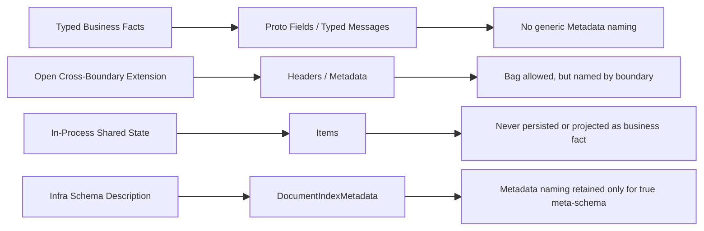

# Metadata 语义分层与命名收敛重构蓝图（2026-03-11）

## 1. 文档元信息

- 状态：Proposed
- 版本：R1
- 日期：2026-03-11
- 范围：
  - `src/Aevatar.Foundation.*`
  - `src/Aevatar.CQRS.*`
  - `src/Aevatar.AI.*`
  - `src/workflow/*`
  - `src/Aevatar.Presentation.AGUI`
  - `docs/*`
- 关联文档：
  - `docs/architecture/2026-03-11-event-envelope-propagation-runtime-separation-blueprint.md`
  - `docs/architecture/2026-03-10-workflow-run-event-protobuf-unification-blueprint.md`
  - `docs/CQRS_ARCHITECTURE.md`
  - `docs/WORKFLOW.md`
  - `docs/CONNECTOR.md`
- 文档定位：
  - 本文不讨论某一个 `Metadata` 字段的局部实现。
  - 本文讨论整个仓库中“哪些东西应该叫 metadata，哪些不该叫”的统一架构口径。
  - 本文默认无兼容硬切，不保留旧命名壳层。

## 2. 一句话结论

当前系统的核心问题不是“Metadata 用太多”，而是“不同层、不同生命周期、不同读者的东西共享了 `Metadata` 这个名字”。

正确方向不是机械删除所有 `Metadata`，而是：

1. 能强类型的语义，一律强类型
2. 只有明确的开放扩展边界，才保留 bag
3. bag 只有在更精确名称不会缩窄语义时才改名；真正的边界 metadata 可以继续叫 `Metadata`

换句话说，目标不是“禁用 metadata”，而是**禁用无语义的 metadata 命名**。

## 3. 问题定义

### 3.1 当前混乱不是结构混乱，而是命名混乱

最近几轮重构后，主链路其实已经明显收敛：

1. envelope 级别已经从旧 `EventEnvelope.Metadata` 收敛为 `Route / Propagation / Runtime`
2. workflow 完成态已经从 `StepCompletedEvent.Metadata` 收敛为 `StepCompletedEvent.Annotations`
3. projection/read model 已经把控制流字段从 bag 中剥离出来，改成 typed fields

但仓库里仍然存在大量 `Metadata` 命名：

1. `CommandContext.Metadata`
2. `LLMRequest.Metadata`
3. `GAgentExecutionHookContext.Metadata`
4. `ILLMCallMiddleware / IToolCallMiddleware / IAgentRunMiddleware` 的 `Metadata`
5. `ConnectorResponse.Metadata`
6. `DocumentIndexMetadata`
7. 一些文档与 key 类型名仍然沿用 `Metadata`

这些名字并不都错，但它们不是一类东西。

### 3.2 “Metadata” 当前被拿来表示至少六种不同语义

| 类别 | 当前典型位置 | 实际语义 |
|---|---|---|
| 传播上下文 | `EnvelopePropagation.Baggage` 的旧概念来源 | 跨 hop 透传上下文 |
| 业务注解 | `StepCompletedEvent.Annotations` 的旧概念来源 | 业务完成态附加注解 |
| 命令头 | `CommandContext.Headers` | command 级追踪/附加 header |
| provider 透传参数 | `LLMRequest.Metadata` | 对 provider / middleware 透明透传 |
| 进程内临时上下文 | middleware / hook `Metadata` | 链内共享的临时 items |
| 外部调用诊断信息 | `ConnectorResponse.Metadata` | connector 诊断/属性 |

这些语义的差异很大：

1. 读者不同
2. 生命周期不同
3. 是否跨边界不同
4. 是否持久化不同
5. 是否影响业务主流程不同

继续共用 `Metadata` 这个名字，会导致阅读者默认把它们视为同一类机制。

## 4. 完整现状分析

### 4.1 已经正确收敛的部分

#### 4.1.1 Envelope 主模型

当前 [agent_messages.proto](/Users/auric/aevatar/src/Aevatar.Foundation.Abstractions/agent_messages.proto) 已经是正确方向：

1. `EnvelopeRoute`
2. `EnvelopePropagation`
3. `EnvelopeRuntime`
4. `Payload`

这层不应再回到统一 `metadata` bag。

#### 4.1.2 Workflow 完成态

当前 [workflow_execution_messages.proto](/Users/auric/aevatar/src/workflow/Aevatar.Workflow.Abstractions/workflow_execution_messages.proto) 已经把 workflow 完成事件改成：

1. `Annotations`
2. `NextStepId`
3. `BranchKey`
4. `AssignedVariable`
5. `AssignedValue`

这是对的，因为：

1. 控制流语义已经强类型化
2. bag 只剩非核心业务注解

#### 4.1.3 Projection / Query

当前 [WorkflowExecutionQueryModels.cs](/Users/auric/aevatar/src/workflow/Aevatar.Workflow.Application.Abstractions/Queries/WorkflowExecutionQueryModels.cs) 也已经区分：

1. `CompletionAnnotations`
2. typed completion/suspension fields

这说明 workflow 主链路已经不再依赖“metadata bag 承载所有语义”。

### 4.2 仍然命名不准的部分

#### 4.2.1 CommandContext.Headers

[CommandContext.cs](/Users/auric/aevatar/src/Aevatar.CQRS.Core.Abstractions/Commands/CommandContext.cs) 里的 `Metadata` 实际是 command headers。

它的特征是：

1. 只在 command dispatch 生命周期内存在
2. 主要被 envelope factory / receipt / command policy 消费
3. 典型内容是 `commandId / correlationId` 衍生上下文
4. 不是通用业务 metadata

因此继续叫 `Metadata` 过宽，应该叫 `Headers`。

#### 4.2.2 LLMRequest.Metadata

[LLMRequest.cs](/Users/auric/aevatar/src/Aevatar.AI.Abstractions/LLMProviders/LLMRequest.cs) 里的 `Metadata` 是 provider 透传 bag。

它的特征是：

1. 面向 provider / middleware 扩展
2. 典型内容是 request id、call id、workflow run id
3. 不是 workflow 业务语义
4. 不是中间件链内临时状态

这类字段保留 `Metadata` 是合理的，因为：

1. 它本来就是开放式边界 metadata
2. consumer 既包括 provider，也包括 middleware，不只有 provider
3. 改成 `ProviderMetadata` 会把语义收窄成“只属于 provider”

#### 4.2.3 Middleware / Hook Context.Metadata

[ILLMCallMiddleware.cs](/Users/auric/aevatar/src/Aevatar.AI.Abstractions/Middleware/ILLMCallMiddleware.cs) 和 [GAgentExecutionHookContext.cs](/Users/auric/aevatar/src/Aevatar.Foundation.Abstractions/Hooks/GAgentExecutionHookContext.cs) 里的 `Metadata`，本质上是链内共享临时状态。

它们的特征是：

1. 进程内使用
2. 不跨边界
3. 不持久化
4. 本质是 pipeline items / ambient items

因此这类字段应该统一改名为 `Items`。

#### 4.2.4 ConnectorResponse.Metadata

[IConnector.cs](/Users/auric/aevatar/src/Aevatar.Foundation.Abstractions/Connectors/IConnector.cs) 里的 `ConnectorResponse.Metadata` 是外部调用返回的诊断属性。

它的特征是：

1. 来自 connector adapter
2. 带有 provider / transport / CLI / HTTP 细节
3. 可能被 workflow completion annotation 吸收
4. 不应驱动核心控制流

但它承载的不只是“诊断”，还包括调用属性和结果属性（如方法、URL、tool、status code、exit code）。

因此保留 `Metadata` 更稳妥：

1. 这是 connector 边界的开放扩展袋
2. `Diagnostics` 会把语义缩窄到观测/调试
3. 如果未来出现稳定结果事实，应提升成强类型字段，而不是继续塞 bag

#### 4.2.5 WorkflowExecutionTimelineMetadataKeys

[WorkflowExecutionTimelineMetadataKeys.cs](/Users/auric/aevatar/src/workflow/Aevatar.Workflow.Projection/ReadModels/WorkflowExecutionTimelineMetadataKeys.cs) 是 read model timeline entry 附加 metadata 的 key 常量。

这类命名可以保留，因为它描述的就是 timeline metadata，而不是 workflow 主链路控制语义。

#### 4.2.6 DocumentIndexMetadata

[DocumentIndexMetadata.cs](/Users/auric/aevatar/src/Aevatar.CQRS.Projection.Stores.Abstractions/Abstractions/ReadModels/DocumentIndexMetadata.cs) 是合理的 `Metadata`。

原因是：

1. 它描述的是 document store index 的配置元信息
2. 这是基础设施标准术语
3. 它不是业务 bag，也不是 runtime bag

因此这类 `Metadata` 可以保留。

## 5. 判断标准

### 5.1 什么时候绝对不该叫 Metadata

满足任一条件就不该叫 `Metadata`：

1. 影响核心业务语义
2. 影响控制流
3. 被稳定逻辑显式读取
4. 生产方和消费方都在本仓库可控范围内
5. 可以通过 protobuf 字段明确建模

这类信息应优先改成：

1. typed field
2. typed options
3. typed sub-message

### 5.2 什么时候可以保留 bag

只有下面这种情况才适合 bag：

1. 这是明确的开放扩展边界
2. 内核不枚举完所有可能字段
3. 外部插件/第三方/adapter 可能追加字段
4. 缺失这些字段不会破坏主流程
5. 多数消费者只会透传、展示、记录

如果这个 bag 天然就是某个边界的 metadata，保留 `Metadata` 反而比硬改成更窄的名字更准确。

### 5.3 命名规则

命名必须回答“这是谁的附加信息”：

1. command 附加信息：`Headers`
2. workflow 完成态附加信息：`Annotations`
3. LLM provider / middleware 透传附加信息：`Metadata`
4. middleware 链内临时状态：`Items`
5. connector 边界附加信息：`Metadata`
6. projection index 配置元信息：`DocumentIndexMetadata`

也就是说，命名要体现：

1. owner
2. reader
3. lifecycle
4. stability

## 6. 目标命名矩阵

| 当前名称 | 目标名称 | 是否保留 bag | 理由 |
|---|---|---|---|
| `EventEnvelope.Metadata` | 已删除，改为 `Propagation / Runtime` | 否 | 主模型必须强分层 |
| `StepCompletedEvent.Metadata` | `StepCompletedEvent.Annotations` | 是 | 非控制流业务注解 |
| `CompletionMetadata` | `CompletionAnnotations` | 是 | 读侧对应业务注解 |
| `CommandContext.Metadata` | `CommandContext.Headers` | 是 | command 头，不是通用 metadata |
| `LLMRequest.Metadata` | 保留 | 是 | LLM 扩展边界 metadata，consumer 不只 provider |
| `ILLMCallMiddleware.Metadata` | `ILLMCallMiddleware.Items` | 是 | 链内临时状态 |
| `IToolCallMiddleware.Metadata` | `IToolCallMiddleware.Items` | 是 | 链内临时状态 |
| `IAgentRunMiddleware.Metadata` | `IAgentRunMiddleware.Items` | 是 | 链内临时状态 |
| `GAgentExecutionHookContext.Metadata` | `GAgentExecutionHookContext.Items` | 是 | hook 上下文 items |
| `ConnectorResponse.Metadata` | 保留 | 是 | connector 边界 metadata，不应被过度窄化为 diagnostics |
| `WorkflowExecutionTimelineMetadataKeys` | 保留 | 不适用 | read model timeline metadata key 常量 |
| `DocumentIndexMetadata` | 保留 | 是 | infra 标准术语 |

## 7. 目标架构图

## 8. 项目级改造清单

### 8.1 CQRS Core

#### 目标

把 command 层的 `Metadata` 明确收敛为 headers。

#### 改造项

1. [CommandContext.cs](/Users/auric/aevatar/src/Aevatar.CQRS.Core.Abstractions/Commands/CommandContext.cs)
   - `Metadata` -> `Headers`
2. `ICommandContextPolicy` 及默认实现同步改名
3. command envelope factory / receipt factory / dispatch pipeline 全量跟进
4. workflow command policy/tests 同步改名

#### 结果

调用方看到 `Headers` 就知道这是 command envelope build 的附加头，不会和 workflow business annotation 混淆。

### 8.2 AI Provider / Middleware

#### 目标

把边界 metadata 与 middleware 临时状态拆成不同术语。

#### 改造项

1. 保留 [LLMRequest.cs](/Users/auric/aevatar/src/Aevatar.AI.Abstractions/LLMProviders/LLMRequest.cs) 的 `Metadata`
2. 保留 `LLMRequestMetadataKeys`
3. provider 实现、tool loop、chat runtime、tests 按 `Metadata + Items` 双层语义收口
4. middleware context:
   - `ILLMCallMiddleware`
   - `IToolCallMiddleware`
   - `IAgentRunMiddleware`
   - `Metadata` -> `Items`
5. [GAgentExecutionHookContext.cs](/Users/auric/aevatar/src/Aevatar.Foundation.Abstractions/Hooks/GAgentExecutionHookContext.cs)
   - `Metadata` -> `Items`

#### 结果

1. `Metadata` 表示跨 provider/middleware 边界透传
2. `Items` 表示链内临时共享状态
3. 两者不再同名

### 8.3 Connector Boundary

#### 目标

把 connector 返回的附加字段明确界定为边界 metadata，而不是 workflow 业务事实。

#### 改造项

1. 保留 [IConnector.cs](/Users/auric/aevatar/src/Aevatar.Foundation.Abstractions/Connectors/IConnector.cs) 的 `ConnectorResponse.Metadata`
2. Bootstrap connectors / MCP connector / tests 跟进
3. workflow connector module 吸收外部诊断信息时：
   - `response.Metadata` -> `StepCompletedEvent.Annotations`

#### 结果

connector 结果继续作为边界 metadata 存在，但不会被误当成 workflow 主链路控制字段。

### 8.4 Workflow Projection / Read Model

#### 目标

把 remaining 命名统一收敛到 `Annotations / Metadata`。

#### 改造项

1. 保留 `WorkflowExecutionTimelineMetadataKeys`
2. demo / report writer / AGUI docs 统一使用 `Annotations`
3. 清理文档里残留 `CompletionMetadata`

### 8.5 文档体系

#### 目标

让文档不再把不同层东西都叫 metadata。

#### 必改文档

1. `docs/CQRS_ARCHITECTURE.md`
2. `docs/WORKFLOW.md`
3. `docs/CONNECTOR.md`
4. `docs/WORKFLOW_LLM_STREAMING_ARCHITECTURE.md`
5. `docs/architecture/stream-first-tracing-design.md`
6. `docs/reports/OPENVIKING_RESEARCH.md`

#### 文档原则

1. 不再使用 `EventEnvelope.Metadata`
2. 不再把 `CommandContext.Headers` 叫 metadata
3. 不再把边界 `Metadata` 与 workflow annotations 混写

## 9. 不保留兼容的硬切策略

本轮不建议保留以下兼容层：

1. 旧属性 + 新属性双写
2. `Obsolete` 过渡壳层
3. `Metadata` 到 `Annotations` 的 adapter alias
4. legacy doc terminology fallback

原因：

1. 这类改动是内部语义清理，不是外部协议兼容
2. 保留兼容只会延长歧义期
3. 仓库当前重构策略已经明确“删除优于兼容”

## 10. 实施顺序

### Phase 1：命名冻结

1. 先确定保留术语：
   - `Annotations`
   - `Headers`
   - `Metadata`
   - `Items`
   - `DocumentIndexMetadata`
   - `DocumentIndexMetadata`
2. 在文档中冻结此命名矩阵

### Phase 2：CQRS / AI / Connector 抽象层改名

1. 改 `CommandContext`
2. 改 `LLMRequest`
3. 改 middleware contexts
4. 改 hook contexts
5. 改 `ConnectorResponse`

### Phase 3：实现层与测试同步

1. provider 实现
2. workflow adapter / modules
3. demos
4. tests

### Phase 4：门禁落地

1. 增加 `rg` 规则，只禁止内部核心上下文重新引入泛化 `Metadata`
2. 清理旧文档引用
3. 全量 build/test/guards

## 11. 自动化门禁

建议新增以下静态守卫。

### 11.1 命名白名单守卫

禁止内部核心上下文新增泛化 `Metadata` 成员，允许边界/infra 正当使用：

1. `DocumentIndexMetadata`
2. `LLMRequest.Metadata`
3. `ConnectorResponse.Metadata`
4. 其他被明确审阅批准的边界 / infra 标准术语

建议检查模式：

1. `CommandContext.Metadata`
2. `AgentRunContext.Metadata`
3. `LLMCallContext.Metadata`
4. `ToolCallContext.Metadata`
5. `GAgentExecutionHookContext.Metadata`

### 11.2 文档守卫

禁止文档继续出现以下旧说法：

1. `EventEnvelope.Metadata`
2. `StepCompletedEvent.Metadata`
3. `CompletionMetadata`

### 11.3 Workflow 主链路守卫

禁止 workflow 主链路重新引入：

1. `StepCompletedEvent.Metadata`
2. `CompletionMetadata`
3. 用 bag 驱动控制流

## 12. 验证命令

实施后必须执行：

1. `dotnet build aevatar.slnx --nologo`
2. `dotnet test aevatar.slnx --nologo`
3. `bash tools/ci/architecture_guards.sh`
4. `bash tools/ci/test_stability_guards.sh`
5. `bash tools/ci/workflow_binding_boundary_guard.sh`

如果涉及 projection 路由或 workflow binding，再补：

1. `bash tools/ci/projection_route_mapping_guard.sh`
2. `bash tools/ci/solution_split_guards.sh`
3. `bash tools/ci/solution_split_test_guards.sh`

## 13. 最终目标状态

最终状态下，仓库应满足：

1. 核心业务语义默认强类型
2. 开放扩展 bag 存在；真正的边界 metadata 可以继续叫 `Metadata`
3. 中间件链内共享状态统一叫 `Items`
4. command 层附加信息统一叫 `Headers`
5. connector 外部边界附加信息统一保留 `Metadata`
6. workflow 完成态附加信息统一叫 `Annotations`
7. `Metadata` 只保留给真正的元模型/元配置术语

## 14. 一句话收口

“Metadata 太多”不是病因，**“用 Metadata 掩盖内部明确职责，或为了消灭单词去错误窄化边界语义”才是病因**。

本轮重构的目标不是把所有 bag 删掉，而是把名字和语义对齐：

1. 业务事实像业务事实
2. 边界扩展像边界扩展
3. 临时上下文像临时上下文
4. 基础设施元模型像基础设施元模型

只有这样，仓库才不会在下一轮继续把所有“暂时不知道叫什么”的东西再次统称为 `Metadata`。
