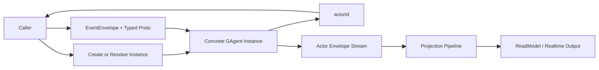

# GAgent 协议优先互通架构变更蓝图（2026-03-12）

## 1. 文档元信息

- 状态：Proposed
- 版本：R2
- 日期：2026-03-12
- 适用范围：
  - `src/Aevatar.Foundation.*`
  - `src/Aevatar.CQRS.Core*`
  - `src/Aevatar.CQRS.Projection.*`
  - `src/workflow/*`
  - `src/Aevatar.Scripting.*`
  - `src/Aevatar.Mainnet.Host.Api`
  - `src/workflow/Aevatar.Workflow.Host.Api`
- 关联文档：
  - `AGENTS.md`
  - `docs/FOUNDATION.md`
  - `docs/SCRIPTING_ARCHITECTURE.md`
  - `src/workflow/README.md`
  - `docs/architecture/2026-03-11-gagent-centric-cqrs-capability-unification-blueprint.md`
  - `docs/architecture/2026-03-09-cqrs-command-actor-receipt-projection-blueprint.md`
- 文档定位：
  - 本文定义“静态 `GAgent`、workflow、scripting 在同一通信层次互通”的目标架构。
  - 本文刻意避免引入过重的统一实现来源模型，不新增对外 `capabilityId`，不强制统一 `implementation_kind/source_binding`。
  - 本文只统一真正需要统一的东西：`EventEnvelope`、typed `proto` 协议、`actorId` 语义、projection 观察语义、升级语义。

## 2. 一句话结论

系统不需要把静态 `GAgent`、workflow、scripting 统一成一个新的“来源对象模型”；  
系统只需要强制它们在对外层面遵守同一套 actor 协议：

1. 用 `EventEnvelope` 传输
2. 用同一组 typed `proto command/query/reply/event` 通信
3. 用不透明 `actorId` 寻址
4. 用同一条 projection/read-model 主链做观察
5. 升级默认按“旧 run 留旧实现，新 run 走新实现”前滚

外部不需要知道某个 `actorId` 背后是静态代码、workflow 还是 script。  
内部也不需要为此再造一套统一实现来源注册语言。

## 3. 背景与问题定义

## 3.1 当前事实

仓库已经同时拥有三类能力承载方式：

1. 静态代码实现的 `GAgent`
2. workflow 驱动的 definition actor + run actor
3. scripting 驱动的 definition actor + runtime actor

三者都已经建立在同一套底座之上：

1. `EventEnvelope`
2. `IActorRuntime`
3. `IActorDispatchPort`
4. `Protobuf`
5. Projection Pipeline

## 3.2 当前真正的问题

问题不是“它们不能互通”，而是“讨论时总想先统一实现来源模型”，导致设计容易过重。

真正需要解决的是：

1. 外部如何不关心内部实现来源
2. 不同来源实例如何在同一层直接通信
3. workflow 与 scripting 如何不再被当成两套平行外部框架
4. 升级时如何避免热替换存量 run

## 3.3 本文的判断

“把所有实现来源先塞进统一 binding schema、kind enum、source model”不是必要前提。  
那样会把问题从“协议互通”升级成“建模所有实现来源”，代价过大，扩展性也未必更好。

本轮更合理的收敛点是：

1. 统一传输壳
2. 统一 typed 协议
3. 统一观察语义
4. 统一升级语义

而不是统一所有来源的描述对象。

## 4. 核心决议

## 4.1 不引入对外 `capabilityId`

本蓝图明确不增加新的外部寻址概念。

结论：

1. 对外继续只暴露 `actorId`
2. `actorId` 对调用方是不透明字符串
3. 调用方不得解析 `actorId` 的前缀、类型名、命名约定或实现痕迹
4. Host/Application 不得通过 `actorId` 字面模式判断这是 workflow/script/static

## 4.2 不引入统一 `implementation_kind/source_binding` 模型

本蓝图明确不把“实现来源”做成统一强制运行时对象模型。

原因：

1. 这会过早固化实现来源分类
2. 很容易引入封闭 `enum` 或伪开放字符串槽
3. 会把治理重点从“协议兼容”转移到“来源建模”

本轮不要求：

1. 统一 `implementation_kind`
2. 统一 `source_binding`
3. 统一 `definition snapshot schema`

本轮要求的是：

1. 不同来源创建出的实例 actor 必须说同一种对外协议

## 4.3 不强制增加转发层

本蓝图不要求：

`caller -> facade actor -> implementation actor`

作为统一通信模型。

结论：

1. 创建完成后，调用方应直接拿最终实例 `actorId`
2. 后续消息直接发给最终实例 actor
3. 若某类来源内部需要定义解析或实例创建，那属于创建阶段，不属于每条消息的常规路径

## 4.4 真正必须统一的是协议，不是来源

本蓝图把统一目标缩到最小充分集：

1. `EventEnvelope`
2. typed `proto command/query/reply/event`
3. receipt/completion/error/query/read-model 语义
4. `actorId` 不透明寻址
5. projection/realtime 输出主链

只有这些稳定下来，静态、workflow、script 才能在同一层对等存在。

## 4.5 升级默认前滚，不热替换存量 run

遵守 `AGENTS.md`：

1. 默认优先 `run/session/task-scoped actor`
2. 升级默认语义是“新 run 走新实现”
3. 存量实例不做原地实现切换

这意味着：

1. 本文不解决热替换存量 actor
2. 本文解决的是未来新实例的协议一致与互通问题

## 5. 目标架构

## 5.1 四层模型

目标态只保留四个层次：

| 层次 | 核心对象 | 是否对外暴露 | 职责 |
|---|---|---|---|
| 传输层 | `EventEnvelope` | 否 | 统一消息运输壳 |
| 协议层 | typed `proto` contract | 是 | 定义 command/query/reply/completion 语义 |
| 实例层 | `actorId` | 是 | 提供不透明寻址与运行实例边界 |
| 实现层 | static/workflow/script | 否 | 决定实例如何执行 |

## 5.2 总体流程

关键点：

1. 外部只和实例 actor 说话
2. 实例背后如何实现，不属于外部契约
3. 互换实现时，只要协议不变，外部就无需知道来源变化

## 6. 统一的最小协议集合

## 6.1 传输统一：`EventEnvelope`

所有来源的实例 actor 都必须：

1. 接收 `EventEnvelope`
2. 在 envelope 中承载 typed `proto payload`
3. 沿用统一的 `correlationId/commandId/route/propagation` 语义

但必须明确：

1. 仅仅都收 `EventEnvelope` 还不够
2. `Envelope` 只是传输壳，不自动带来可互换性

## 6.2 协议统一：typed `proto`

真正必须统一的是 payload contract。

一个“可互换来源协议”至少要稳定以下内容：

1. 接受哪些 `command` message
2. 接受哪些 `query` message
3. 返回哪些 `reply` message
4. 发出哪些 `completion` 或领域事件
5. 错误、超时、取消如何表达

如果这些不一致，那么即使都走 `EventEnvelope`，也只是“底层同路”，不是“协议兼容”。

## 6.3 寻址统一：`actorId`

外部只使用 `actorId`。

强约束：

1. `actorId` 是不透明地址
2. 调用方只保存和传递，不解析
3. 任意来源只要对外返回 `actorId`，后续就按同样方式通信

## 6.4 观察统一：Projection 主链

不同来源的实例 actor，对外观察必须继续共享：

1. 同一条 projection pipeline
2. 同一条 realtime output 主链
3. 同一套 read model/query 原则

禁止：

1. workflow 自建一套外部观察总线
2. scripting 再造一套平行 session bus
3. static GAgent 直接绕过 projection 提供另一套完成态渠道

## 7. 什么不需要统一

## 7.1 不需要统一实现来源描述对象

本轮不要求：

1. 所有来源都实现同一份 binding snapshot proto
2. 所有来源都走同一份 source kind 枚举
3. 所有来源都遵守同一份初始化 schema

这些都属于“内部如何创建”的问题，不是“外部如何互通”的核心。

## 7.2 不需要统一内部执行模型

本轮允许：

1. 静态 `GAgent` 直接在 actor 内执行
2. workflow 在 `WorkflowRunGAgent` 内通过 module pack 执行
3. scripting 在 `ScriptRuntimeGAgent` 内通过 runtime capability 执行

只要对外协议一致，这三种内部执行方式可以并存。

## 7.3 不需要把 workflow 与 scripting 彻底同构

本轮不要求：

1. workflow 和 script 内部状态结构一样
2. workflow 和 script 的初始化流程一样
3. workflow 和 script 的定义 actor 结构一样

本轮只要求：

1. 最终暴露给外部的实例 actor 协议一致

## 8. 三类实现的定位

## 8.1 静态 `GAgent`

定位：

1. 直接由编译期类型承载协议实现
2. 适合性能敏感、逻辑稳定、需要静态代码保障的能力

要求：

1. 仍然必须按统一 typed 协议收发消息
2. 仍然必须按统一 projection 语义暴露观察

## 8.2 Workflow

定位：

1. 是一种实现能力的方式
2. 同时也是显式编排面

允许保留：

1. `module pack`
2. run actor
3. role actor tree
4. workflow-specific state

但边界必须收紧：

1. `module pack` 负责编排原语，不负责冒充独立业务事实边界
2. 若某能力需要独立寻址、独立状态、被 script/static 复用，应上升为独立 `GAgent`

## 8.3 Scripting

定位：

1. 是一种动态实现能力的方式
2. 同时也是动态实现面

允许：

1. 在脚本里表达流程
2. 在脚本里组织跨 actor 交互

但必须满足：

1. 仍然走 `EventEnvelope + typed proto`
2. 需要稳定观察的事实仍回到 actor-owned state + projection
3. 不得在脚本宿主里维持进程内事实缓存

## 9. 边界判定规则

## 9.1 什么可以留在 workflow module pack

以下能力可以继续留在 `module pack`：

1. `if/while/parallel/map_reduce/delay/wait_signal/transform` 这类编排原语
2. 只对当前 run 有意义的临时运行态
3. 明显属于 workflow 执行引擎本身的控制逻辑

## 9.2 什么必须上升为独立 `GAgent`

满足以下任一条件，就不应继续塞在 `module pack` 或脚本宿主里：

1. 需要独立 `actorId`
2. 需要被 workflow、script、static 多来源共享调用
3. 需要独立投影、独立查询或独立治理
4. 需要跨多次 run 复用稳定状态

## 9.3 长期 actor 只保留给事实拥有者

遵守 `AGENTS.md`：

1. 默认优先 `run/session/task-scoped actor`
2. 只有 `definition/catalog/manager/index/checkpoint` 这类对象允许长期存在
3. 单线程 actor 不承担热点共享公共服务角色

## 10. 创建与入口规则

## 10.1 创建路径可以多样，但结果必须统一

本蓝图允许不同来源保留自己的创建入口：

1. 静态创建入口
2. workflow definition 创建入口
3. script definition 创建入口

但创建结果必须统一成：

1. 一个最终实例 `actorId`
2. 一个明确的协议版本

也就是说，创建过程可以不同，创建结果必须同类。

## 10.2 Host 只关心“创建实例”和“与实例通信”

Host/Application 不应关心：

1. 这个实例来自 workflow 还是 script
2. 这个实例内部是 role actor 还是 script runtime

Host/Application 应只关心：

1. 如何拿到最终实例 `actorId`
2. 如何向该 `actorId` 发送 typed command/query
3. 如何观察 completion/read model

## 10.3 是否需要统一实例创建接口

本轮不把“统一 instance creator 接口”定义为硬前提。

更稳妥的结论是：

1. 可以有统一创建接口
2. 但真正的硬约束不是接口名字统一
3. 而是创建完成后返回的实例协议统一

因此：

1. 若后续抽象出 `IGAgentInstanceCreator`，它应是轻量应用服务
2. 若暂时保留多个创建入口，只要都返回协议兼容实例，也不违背本文目标

## 11. 跨来源直接通信

## 11.1 允许的通信关系

所有协议兼容实例之间，都应允许直接通信：

1. `Static -> Static`
2. `Static -> Workflow`
3. `Static -> Script`
4. `Workflow -> Static`
5. `Workflow -> Workflow`
6. `Workflow -> Script`
7. `Script -> Static`
8. `Script -> Workflow`
9. `Script -> Script`

## 11.2 统一通信条件

成立条件只有三个：

1. `EventEnvelope` 一致
2. typed `proto` 协议一致
3. query/reply/projection 语义一致

## 11.3 workflow 的最小改造要求

如果 workflow 需要稳定地和任意来源 actor 通信，建议做的是：

1. 提供通用 actor 通信步骤或模块
2. 让 workflow 能以统一方式 `send/query/wait-reply`

重点是“提供通用 actor 通信面”，而不是“为每个能力发明专用步骤类型”。

## 11.4 scripting 的最小改造要求

如果 scripting 已经具备通用 runtime port，则应：

1. 把这类通用 actor 通信能力抽到更公共的层次
2. 避免让“通用 actor 通信能力”长期挂在 `Scripting` 私有命名空间下

## 12. 协议治理方式

## 12.1 用 contract tests 治理，不用来源 kind 治理

本蓝图推荐的治理手段不是：

1. runtime kind 枚举
2. 统一来源注册 schema

而是：

1. 协议 contract tests
2. query/read-model contract tests
3. completion/error semantics contract tests

原因：

1. 真的需要保持稳定的是行为，不是来源标签
2. 测试能验证协议是否兼容，来源对象模型只能描述不能证明

## 12.2 一个协议至少要验证四件事

对于任意“可互换来源协议”，至少应验证：

1. 相同 command 是否可被接收
2. 相同 reply/completion 是否按同一语义返回
3. 相同 query 是否返回同一语义
4. 相同 read model 是否按同一主键与字段语义暴露

## 12.3 若协议不兼容，必须升级版本

若以下任一项变化：

1. completion 事件类型变化
2. query 结果语义变化
3. read model 主键或字段语义变化
4. 错误/超时/取消语义变化

则必须把它视为协议版本变更，而不是“同协议不同实现”。

## 13. 升级与迁移语义

## 13.1 默认升级模式

本蓝图明确采用：

`New Definition or New Implementation -> New Create Requests Use New Path -> Existing Runs Stay On Old Path`

即：

1. 升级只影响未来新实例
2. 存量实例继续保留原行为
3. 不要求也不鼓励原地替换存量 actor 实现

## 13.2 为什么默认不做热替换

原因：

1. 当前主形态就是 run/session/task actor
2. 三类实现内部状态天然不同
3. 热替换会要求复杂迁移语义和强兼容约束

所以本文默认不做：

1. 把运行中的 script runtime 改成 workflow run
2. 把运行中的 workflow run 改成静态实现
3. 在没有显式迁移契约时替换存量实例

## 13.3 前滚升级的意义

前滚模式已经足够支持你描述的场景：

1. 先用 script 快速实现一个协议
2. 性能不够时用静态 `GAgent` 重写同一协议
3. 后续新 run 走静态实现
4. 旧 run 继续停留在旧实现

这才是当前仓库更自然、更低复杂度的升级方式。

## 14. 对 Mainnet 和 Host 的要求

## 14.1 Mainnet 组装原则

Mainnet 组装不应围绕“这是 workflow 还是 script”组织，  
而应围绕“我要创建一个满足某协议的实例”组织。

实践上可以保留多种创建路径，但对外约束应是：

1. 创建后返回实例 `actorId`
2. 后续统一按协议与 `actorId` 通信

## 14.2 Host 的禁止项

Host/Application 禁止：

1. 解析 `actorId` 判断来源
2. 直接拼 workflow 私有生命周期
3. 直接拼 scripting 私有生命周期
4. 维护 `actorId -> implementation source` 的进程内事实映射

## 15. 代码变更建议

## 15.1 保留不动的基础

以下基础应继续稳定：

1. `EventEnvelope`
2. `IActorRuntime`
3. `IActorDispatchPort`
4. Projection Pipeline
5. `actorId` 作为最终实例地址

## 15.2 需要收敛的公共能力

建议收敛但不强制一口气大改的部分：

1. 将 `IGAgentRuntimePort` 这类通用 actor 通信能力上移到更公共命名空间
2. workflow 增加通用 actor 通信模块
3. scripting 继续复用相同 actor 通信抽象

## 15.3 不建议在本轮新建的大模型

本轮不建议优先新建：

1. `implementation_kind` 总枚举
2. 统一 `source_binding` proto 大对象
3. 全局实现来源注册中心
4. 所有来源统一初始化 DSL

这些都太重，而且不是当前痛点。

## 16. 实施工作包

## WP1：协议清单与 contract tests

目标：

1. 为“可互换来源”的能力先定义稳定 proto 协议
2. 建立共用 contract tests

验收：

1. 同一协议至少有两种来源实现通过同一套 contract tests

## WP2：通用 actor 通信能力上移

目标：

1. 将 scripting 中已经存在的通用 actor 通信能力抽到更公共层
2. 避免通用能力长期以 `Scripting` 私有名义存在

验收：

1. workflow/script/static 都能复用同一组通用 actor 通信抽象

## WP3：workflow 通用通信面

目标：

1. 给 workflow 增加通用 actor 通信能力
2. 减少通过业务专用步骤和外部 actor 交互

验收：

1. workflow 可以直接对协议兼容实例 `send/query/wait`

## WP4：projection 观察一致性测试

目标：

1. 验证不同来源实现的 completion/read-model/query 语义一致

验收：

1. 同一协议在不同来源下产生一致的观察结果

## WP5：Host/Mainnet 前滚升级验证

目标：

1. 验证旧 run 留旧实现、新 run 走新实现

验收：

1. 不需要热替换存量实例即可完成来源切换

## 17. 测试与门禁要求

必须新增的测试族：

### 17.1 Protocol Contract Tests

验证：

1. 相同 command 是否可被不同来源实现接收
2. 相同 reply/completion 是否保持语义一致

### 17.2 Query Contract Tests

验证：

1. 相同 query 是否返回同一业务语义

### 17.3 Read Model Contract Tests

验证：

1. 同一协议在不同来源实现下是否映射到相同 read model 语义

### 17.4 Forward-Only Upgrade Tests

验证：

1. 旧 run 保持旧实现
2. 新 run 使用新实现
3. 不发生原地热替换

### 17.5 新增治理守卫建议

1. 禁止在 Host/Application 中解析 `actorId`
2. 禁止用字符串前缀判断 workflow/script/static
3. 禁止 capability 私造平行 observation 主链
4. 禁止把 `module pack` 当作跨 run 稳定事实边界

## 18. 验收标准

本蓝图落地后，必须满足：

1. 静态 `GAgent`、workflow、scripting 创建出的实例都可通过 `actorId` 直接通信。
2. 外部不需要知道实例背后来源。
3. 不同来源只要通过同一套 contract tests，就可视为同协议实现。
4. workflow 与 scripting 不再被当成两套平行外部框架，而是两种内部实现方式。
5. 升级默认按“旧 run 留旧实现，新 run 走新实现”前滚。
6. Projection、AGUI、Query 继续共用同一主链。

## 19. 非目标

本轮不做：

1. 不统一所有来源的定义 schema
2. 不引入 `capabilityId`
3. 不增加强制消息转发层
4. 不统一 workflow/script/static 的内部状态结构
5. 不做存量 run 热替换
6. 不把所有 workflow step 都立即重写

## 20. 收束性结论

这次架构变更真正要统一的不是“实现来源对象模型”，而是“实例 actor 的外部协议”。

因此目标态应概括为：

`Any Implementation Source -> Concrete Instance Actor -> actorId + EventEnvelope + Typed Proto + Unified Projection`

在这个模型下：

1. 静态 `GAgent`
2. workflow
3. scripting

都只是“实例如何被实现”的问题；  
系统真正治理的是它们对外是否说同一种协议，而不是它们内部是不是同一种来源模型。
