# GAgent 协议优先第五阶段蓝图：Direct Delivery、Publication 与 StateEvent 分层重构（2026-03-12）

## 1. 文档元信息

- 状态：Proposed
- 版本：R3
- 日期：2026-03-12
- 适用范围：
  - `Aevatar.Foundation.Abstractions`
  - `Aevatar.Foundation.Core`
  - `Aevatar.Foundation.Runtime.*`
  - `Aevatar.CQRS.Projection.*`
  - `Aevatar.Workflow.*`
  - `Aevatar.Scripting.*`
- 关联文档：
  - `docs/architecture/2026-03-12-gagent-protocol-fourth-phase-envelope-route-semantics-task-list.md`
  - `docs/FOUNDATION.md`
  - `docs/SCRIPTING_ARCHITECTURE.md`
  - `AGENTS.md`
- 文档定位：
  - 本文是第五阶段的彻底重构蓝图。
  - 本阶段最终口径固定为：
    - `统一 EventEnvelope 消息平面`
    - `Direct Delivery`
    - `Publication`
    - `StateEvent 持久化事实平面`
    - `Topology Control Plane + Broker/Data Plane`

## 2. 背景与关键决策（统一认知）

### 2.1 当前已经做对的事

截至 2026-03-12，仓库已经完成以下基础工作：

1. `EventDirection` 已拆成 `EnvelopeRoute.oneof { broadcast | direct | observe }`。
2. Local / Orleans 的 self-message 语义已经统一为 runtime-neutral 的消息入流处理。
3. projection 编排运行态已经 actor 化，读侧不再依赖进程内事实态字典。

这些工作说明：

1. `EventEnvelope + Stream + Actor Runtime` 作为统一消息平面，本身是成立的。
2. projection / live sink / observer 仍然可以是 actor，不需要发明第二套 runtime。
3. 当前剩余问题不在“是否共用 stream provider”，而在消息语义命名、拓扑建模和 route 分流边界。

### 2.2 当前真正混淆的三件事

当前系统里有三种语义上不同的东西靠得太近：

1. `Direct Delivery`
   - 发送方知道明确单目标 actor

2. `Publication`
   - 发送方发布，不关心具体消费者是谁
   - 包括：
     - `Topology Publication`
     - `Observer Publication`

3. `StateEvent`
   - 写入 `IEventStore`
   - 是 event sourcing 的权威持久化事实
   - 不是 runtime message

当前最大的误区是把：

1. `Broadcast`

继续和：

1. `Direct`

并列成同一种东西。

如果 `GAgent` 的 group 语义成立，那么：

- `Direct` 才是唯一真正的 addressed delivery
- `Broadcast` 本质上是 `Topology Publication`

也就是：

- 发送方知道的是 audience 规则
- 不是每个最终消费者的显式地址

### 2.3 第五阶段的关键决策

第五阶段固定采用以下决策：

1. 继续保留统一 `EventEnvelope`。
2. 继续保留统一 `IStream / IStreamProvider`。
3. 不区分抽象 `in/out queue`。
   - 系统哲学是：一个 actor 的 `out` 可以天然成为另一个 actor 的 `in`。
4. 不把 projection actor 与普通 actor 做成两套物种。
5. 明确采用消息系统最佳实践语义：
   - `Direct Delivery`
   - `Publication`
6. `StateEvent` 继续独立于消息平面。
7. `ObserveRoute` 改名为 `PublicationRoute`。
8. `Broadcast` 不再作为 top-level route 与 `Direct` 并列。
9. `Broadcast` 的终态语义固定为：
   - `Topology Publication`
   - parent/group 发布一次
   - children 通过拓扑订阅关系接收
   - fan-out 发生在基础设施数据平面，不应由 C# runtime `foreach child` 或 relay 充当生产主语义
10. `Link(parent, child)` 的终态语义固定为：
   - 更新拓扑控制面
   - 建立基础设施级 subscription/binding
   - 不是“业务层显式逐个发送关系”
11. 对业务 actor 来说，`PublishAsync(...)` 在这个终态下重新变得合理：
   - 因为它表达的是 publication
   - 不再是假装“已知目标广播”

## 3. 重构目标

第五阶段只保留下列可验收目标：

1. 统一消息平面继续使用 `EventEnvelope` 与同一套 stream 基建。
2. `EnvelopeRoute` 收敛为：
   - `DirectRoute`
   - `PublicationRoute`
3. `Broadcast` 被正式重定义为 `Topology Publication`。
4. `PublicationRoute` 明确区分：
   - `Topology Publication`
   - `Observer Publication`
5. `Link/Unlink` 明确建模为 topology control plane 的 subscription binding 管理。
6. `StateEvent` 只留在持久化事实平面，不再和 publication message 混义。
7. 对业务 actor 的公共能力面收敛为：
   - `PublishAsync(...)` 用于 topology publication
   - `SendToAsync(...)` 用于 direct delivery
8. commit 后 observation 由 framework 内部发布到 `PublicationRoute(observer)`，不作为业务 actor 的普通 API 暴露。
9. runtime 在 ingress 层按 `Direct` / `Publication` 分流；publication 的 fan-out 由基础设施语义承接，而不是 actor 代码显式遍历 child。
10. Local / Orleans / mixed-version / 3-node 行为一致。

## 4. 范围与非范围

### 4.1 本阶段范围

1. `agent_messages.proto`
2. 面向业务 actor 的 outbound message 接口语义
3. framework 内部 publication publisher
4. topology control plane binding 抽象
5. `IEventStore` / `IEventSourcingBehavior<TState>`
6. runtime ingress route demux
7. projection / scripting / workflow 的 publication 消费路径
8. 文档、测试、覆盖率、门禁

### 4.2 本阶段非范围

1. 不重做 actor ownership。
2. 不把 projection 体系做成第二套 runtime。
3. 不把 `EventEnvelope` 拆成多种 envelope 类型。
4. 不把本地 InMemory 转发实现误当作生产终态语义。
5. 不回退到 “direct / broadcast / observe 并列” 这一已被否决的 route 模型。

## 5. 架构硬约束（必须满足）

1. `EventEnvelope` 是统一消息平面。
2. `StateEvent` 只属于 event sourcing 持久化事实平面。
3. `Direct Delivery` 与 `Publication` 必须用不同命名和不同处理路径表达。
4. `Direct` 是唯一真正的 addressed delivery。
5. `Broadcast` 必须被定义为 `Topology Publication`，不得再和 `Direct` 并列成同一层 route。
6. `Publication` 必须表达“发送方不关心具体消费者”的语义。
7. `Topology Publication` 的生产语义必须是基础设施级 fan-out，不得把 C# runtime relay/foreach child 定义成权威模型。
8. `Link/Unlink` 必须定义为 topology control plane 的 binding 管理，而不是业务消息流的一部分。
9. 业务 actor 公共消息能力面不得继续暴露 framework 内部 commit 后 observer publication 动作。
10. runtime actor 不得再通过 `if (route.IsObserve()) return;` 这种逻辑维持正确性。
11. projection / observer actor 与普通 actor 属于同一 actor runtime 模型，只允许 publication audience 不同。
12. 新增稳定语义必须强类型建模，不得回退字符串袋。

## 6. 当前基线（代码事实）

当前代码已经呈现出以下事实：

1. `EnvelopeRoute` 当前仍是 `broadcast / direct / observe` 三种并列 route。
   - 证据：`src/Aevatar.Foundation.Abstractions/agent_messages.proto`

2. `IEventPublisher` 当前同时暴露：
   - `PublishAsync(...)`
   - `SendToAsync(...)`
   - `PublishCommittedAsync(...)`
   - 证据：`src/Aevatar.Foundation.Abstractions/IEventPublisher.cs`

3. 当前 `PublishAsync(...)` 在实现上表达的是拓扑广播。
   - 证据：`src/Aevatar.Foundation.Runtime.Implementations.Local/Actors/LocalActorPublisher.cs`
   - 证据：`src/Aevatar.Foundation.Runtime.Implementations.Orleans/Actors/OrleansGrainEventPublisher.cs`

4. `LinkAsync(parent, child)` 当前已经会把关系写成 stream relay/binding。
   - 证据：`src/Aevatar.Foundation.Runtime.Implementations.Local/Actors/LocalActorRuntime.cs`
   - 证据：`src/Aevatar.Foundation.Runtime.Implementations.Orleans/Actors/OrleansActorRuntime.cs`

5. 当前 broadcast fan-out 在本地/Orleans 都主要靠 C# forwarding/relay 实现，而不是显式 broker-native subscription 语义。
   - 证据：`src/Aevatar.Foundation.Runtime/Streaming/InMemoryStreamForwardingEngine.cs`
   - 证据：`src/Aevatar.Foundation.Runtime.Implementations.Orleans.Streaming/Streaming/OrleansActorStream.cs`

6. 仓库里还残留一套未实际成为主路径的 `EventRouter.foreach children` 心智。
   - 证据：`src/Aevatar.Foundation.Runtime/Routing/EventRouter.cs`

7. 当前 `ObserveRoute` 实际表达的是 publication，而不是“观察”这个消费者动作。
   - 证据：`src/Aevatar.Foundation.Abstractions/agent_messages.proto`

8. `StateEvent` 当前已经是清晰的 event sourcing storage record。
   - 证据：`src/Aevatar.Foundation.Abstractions/Persistence/IEventStore.cs`
   - 证据：`src/Aevatar.Foundation.Core/EventSourcing/EventSourcingBehavior.cs`

9. `GAgentBase<TState>` 当前在 commit 成功后直接调用 `EventPublisher.PublishCommittedAsync(...)`。
   - 证据：`src/Aevatar.Foundation.Core/GAgentBase.TState.cs`

10. `RuntimeActorGrain` 当前仍需要在 ingress 后手工忽略 observe。
    - 证据：`src/Aevatar.Foundation.Runtime.Implementations.Orleans/Grains/RuntimeActorGrain.cs`

11. projection 当前已经运行在同一消息平面上，而不是独立 runtime。
    - 证据：`src/Aevatar.CQRS.Projection.Core/Streaming/ProjectionSessionEventHub.cs`
    - 证据：`src/Aevatar.CQRS.Projection.Core/Orchestration/ProjectionOwnershipCoordinatorGAgent.cs`

## 7. 需求分解与状态矩阵

| ID | 需求 | 验收标准 | 当前状态 | 证据 | 差距 |
| --- | --- | --- | --- | --- | --- |
| R1 | route 模型从“三并列”收敛为“direct + publication” | `broadcast` 不再作为 top-level route 并列存在 | 未完成 | `agent_messages.proto` | 当前仍是 `broadcast/direct/observe` |
| R2 | `ObserveRoute` 收敛为 `PublicationRoute` | 生产代码不再保留旧命名 | 未完成 | `agent_messages.proto` | 命名仍不准 |
| R3 | `Broadcast` 收敛为 `Topology Publication` | 文档与实现都不再把它当成 addressed delivery | 未完成 | `IEventPublisher.cs` / publisher 实现 | 仍然容易被理解成“已知目标广播” |
| R4 | topology control plane 明确化 | `Link/Unlink` 被正式定义为 broker/subscription binding 管理 | 部分完成 | `LocalActorRuntime.cs` / `OrleansActorRuntime.cs` | 语义未被正式固化 |
| R5 | `StateEvent` 与 publication message 分离 | `StateEvent` 仅留在 store/replay，publication 用独立 payload | 部分完成 | `IEventStore.cs` | publication payload 仍不够显式 |
| R6 | business actor 公共能力面收窄 | 业务 actor 只看到 `PublishAsync(topology)` 与 `SendToAsync(direct)` | 未完成 | `IEventPublisher.cs` | 仍暴露 committed publication |
| R7 | commit 结果显式化 | `ConfirmEventsAsync(...)` 返回权威 commit result | 未完成 | `IEventSourcingBehavior.cs` | 当前无 commit result |
| R8 | runtime ingress 按 `direct/publication` 分流 | `Direct` 与 `Publication` 在 ingress 就分流 | 未完成 | `RuntimeActorGrain.cs` | 仍先入 actor 路径再 ignore |
| R9 | projection actor 与普通 actor 同物种 | 文档与实现都坚持同一 runtime，不再出现双体系叙事 | 部分完成 | Projection Core 现状 | 文档口径仍需统一 |
| R10 | 覆盖率与门禁不回退 | 关键路径覆盖率不低于当前基线 | 未完成 | 现有 coverage 报告 | 重构后需补测 |

## 8. 差距详解

### 8.1 当前 route 层级仍然错位

当前系统默认把：

1. `broadcast`
2. `direct`
3. `observe`

视为同一层的三种 route。

这在第五阶段已被否决。更准确的分层应是：

1. `direct`
2. `publication`
   - `topology`
   - `observer`

所以当前最大问题不是字段多寡，而是抽象层级错了。

### 8.2 `ObserveRoute` 使用了消费者视角命名

`ObserveRoute` 说的是“消费者在观察”，不是“发送方在做什么”。  
route 模型应从消息分发语义命名。

当前更准确的名字应当是：

1. `PublicationRoute`

### 8.3 当前 broadcast 终态语义没有写对

你指出的核心问题成立：

1. 如果 `GAgent` 是 group，那么 child 应该语义上“订阅 parent 的 broadcast”
2. 真正的 fan-out 应该发生在基础设施数据平面
3. 不应该把 C# runtime forwarding 当成生产主语义

所以第五阶段必须把语义固定为：

`Broadcast = Topology Publication`
`Link = Infrastructure Subscription Binding`
`fan-out = Broker/Data Plane Responsibility`

### 8.4 `PublishCommittedAsync(...)` 仍然挂错地方

即使名字已经比 `ObserveAsync` 更准确，它仍然挂在业务 actor 公共能力面上。  
这让 framework 内部 “commit 后发 observer publication” 继续伪装成“业务 actor 的普通 outbound 能力”。

### 8.5 `StateEvent` 还缺少明确的 publication mirror

第五阶段不需要拆新的 envelope 类型，但需要一个明确的 publication payload，例如：

```proto
message CommittedStateEventPublished {
  StateEvent state_event = 1;
}
```

这样可以明确区分：

1. `StateEvent`
   - store record
2. `CommittedStateEventPublished`
   - observer publication payload

### 8.6 ingress 分流层级仍然不对

现在 `RuntimeActorGrain` 的逻辑是：

1. 收到 envelope
2. 判断 route
3. 若是 `observe` 就 return

这仍然意味着 observer publication 先走进了 business actor ingress。  
更干净的终态应该是：

1. ingress 先判断是 `Direct` 还是 `Publication`
2. `Direct` 进入 direct delivery handler
3. `Publication(topology)` 进入 topology publication path
4. `Publication(observer)` 进入 observer subscriber dispatch

## 9. 目标架构

### 9.1 五个清晰概念

第五阶段之后，系统只保留五个清晰概念：

1. `EventEnvelope`
   - 统一 transport shell

2. `Direct Delivery`
   - 发送方知道明确单目标 actor

3. `Publication`
   - 发送方不关心具体消费者
   - 通过 audience + subscription 消费

4. `StateEvent`
   - event sourcing 权威持久化事实

5. `Topology Control Plane`
   - 管理 parent/child membership
   - 管理 broker/subscription binding

### 9.2 目标 route 结构

建议固定为：

```proto
message EnvelopeRoute {
  string publisher_actor_id = 1;

  oneof route {
    DirectRoute      direct      = 2;
    PublicationRoute publication = 3;
  }
}

message DirectRoute {
  string target_actor_id = 1;
}

message PublicationRoute {
  oneof audience {
    TopologyPublication topology = 1;
    ObserverPublication observer = 2;
  }
}

message TopologyPublication {
  TopologyAudience audience = 1;
}

message ObserverPublication {
  ObserverAudience audience = 1;
}

enum TopologyAudience {
  TOPOLOGY_AUDIENCE_UNSPECIFIED           = 0;
  TOPOLOGY_AUDIENCE_SELF                  = 1;
  TOPOLOGY_AUDIENCE_PARENT                = 2;
  TOPOLOGY_AUDIENCE_CHILDREN              = 3;
  TOPOLOGY_AUDIENCE_PARENT_AND_CHILDREN   = 4;
}

enum ObserverAudience {
  OBSERVER_AUDIENCE_UNSPECIFIED     = 0;
  OBSERVER_AUDIENCE_COMMITTED_FACTS = 1;
}
```

关键点：

1. `Direct` 是唯一 top-level addressed route
2. `Broadcast` 不再是 top-level route，而是 `PublicationRoute.topology`
3. `Observe` 不再叫 `ObserveRoute`，而是 `PublicationRoute.observer`
4. topology 和 observer 都明确成为 publication audience 的子类

### 9.3 目标 API 模型

#### 9.3.1 面向业务 actor 的公共能力

业务 actor 只暴露：

1. `PublishAsync<TEvent>(..., TopologyAudience audience = Children, ...)`
2. `SendToAsync<TEvent>(string targetActorId, ...)`

在这个终态下：

1. `PublishAsync` 重新变得正确
2. 因为它现在真的表示 publication
3. `SendToAsync` 继续表示 direct delivery

#### 9.3.2 framework 内部 observer publication 能力

framework 内部另行提供：

1. `IPublicationPublisher`

职责：

1. 发布 `PublicationRoute.observer`
2. 当前主要用于 commit 后事实发布

它不作为业务 actor 的通用发送能力暴露。

#### 9.3.3 event sourcing commit result

必须显式引入：

```proto
message EventStoreCommitResult {
  string agent_id = 1;
  int64 latest_version = 2;
  repeated StateEvent committed_events = 3;
}
```

并演进：

1. `IEventStore.AppendAsync(...)`
2. `IEventSourcingBehavior<TState>.ConfirmEventsAsync(...)`

使其显式返回 commit result。

#### 9.3.4 observer publication payload

新增：

```proto
message CommittedStateEventPublished {
  StateEvent state_event = 1;
}
```

说明：

1. 这是 observer publication payload
2. 它不是 `StateEvent` 本体
3. 它通过 `EventEnvelope(payload=CommittedStateEventPublished, route=PublicationRoute.observer)` 在统一消息平面上传播

### 9.4 目标 control plane / data plane 分工

#### 9.4.1 Topology Control Plane

`Link(parent, child)` / `Unlink(child)` 的终态语义：

1. 更新拓扑事实
2. 建立或移除基础设施级 subscription binding
3. 绑定的是：
   - parent/group 的 topology publication
   - child inbox consumer path

也就是：

1. child 语义上订阅 parent 的 topology publication
2. child 仍只消费自己的 inbox
3. 订阅绑定由 control plane 管理，不由业务消息流显式表达

#### 9.4.2 Broker / Data Plane

对于 `PublicationRoute.topology(children)`：

1. parent 只发布一次
2. broker/native stream fabric 按 subscription binding 完成 fan-out
3. child inbox 收到各自副本

对于 `DirectRoute`：

1. 直接投递到 target inbox

对于 `PublicationRoute.observer`：

1. 发布到 observer audience
2. subscriber 自行订阅消费

#### 9.4.3 本地 InMemory 的定位

本地 `InMemoryStreamForwardingEngine` 可以保留，但定位必须改成：

1. 开发/测试环境下对 broker fan-out 的语义仿真
2. 不是生产终态的架构定义

### 9.5 目标 runtime 分工

#### 9.5.1 Direct Delivery 处理

对于 `DirectRoute`：

1. 走 direct target dispatch

#### 9.5.2 Topology Publication 处理

对于 `PublicationRoute.topology`：

1. runtime/actor 代码不应 `foreach child`
2. runtime 只负责把 publication 写入数据平面
3. fan-out 由 broker/subscription binding 完成

#### 9.5.3 Observer Publication 处理

对于 `PublicationRoute.observer`：

1. 不进入 business actor direct delivery handler
2. 进入 observer subscriber 分发
3. projection / live sink / observer actor 通过订阅消费

#### 9.5.4 Actor 物种不分裂

下面这些依然都属于同一 actor runtime 模型：

1. business actor
2. projection ownership actor
3. projection session/live sink actor
4. observer actor

差别只在：

1. 订阅何种 publication audience
2. 拥有哪些事实权限

### 9.6 目标链路图

```mermaid
%%{init: {"maxTextSize": 100000, "flowchart": {"useMaxWidth": false, "nodeSpacing": 10, "rankSpacing": 50}, "themeVariables": {"fontSize": "10px"}}}%%
flowchart LR
  CP["Topology Control Plane\nlink/unlink -> subscription binding"] --> BR["Broker / Stream Fabric"]

  A["Business Actor"] --> B["PublishAsync(topology) / SendToAsync(direct)"]
  B --> C["EventEnvelope + DirectRoute or PublicationRoute.topology"]
  C --> BR
  BR --> D["Runtime Ingress Demux"]
  D --> E["Direct Delivery Handler"]
  E --> F["Business Actor Handling"]

  F --> G["PersistDomainEventsAsync"]
  G --> H["IEventStore.AppendAsync"]
  H --> I["StateEvent"]
  H --> J["EventStoreCommitResult"]
  J --> K["CommittedStateEventPublished"]
  K --> L["EventEnvelope + PublicationRoute.observer"]
  L --> BR
  BR --> M["Observer Subscriber Dispatcher"]
  M --> N["Projection / Observer / Live Sink Actor"]
```



## 10. 重构工作包（WBS）

### W1. route 层级收口

- 目标：
  - `broadcast / direct / observe` 三并列改成 `direct | publication`
  - `PublicationRoute` 下再细分 `topology | observer`
- 产物：
  - `agent_messages.proto`
  - route helper / semantics helper
- DoD：
  - top-level route 不再存在 `broadcast`
- 优先级：P0
- 状态：Pending

### W2. public API 收口

- 目标：
  - 保留 `PublishAsync(topology)` 与 `SendToAsync(direct)`
  - 删除业务 actor 公共面的 `PublishCommittedAsync(...)`
- 产物：
  - 面向业务 actor 的 outbound 接口
  - `GAgentBase` / publisher 实现
- DoD：
  - 业务 actor 不再持有 observer publication API
- 优先级：P0
- 状态：Pending

### W3. observer publication 能力内聚为 framework 内部职责

- 目标：
  - 新增 `IPublicationPublisher`
  - 仅处理 observer publication
- 产物：
  - publication publisher 抽象与实现
  - `GAgentBase<TState>` 调整
- DoD：
  - observer publication 完全退出业务 actor 公共能力面
- 优先级：P0
- 状态：Pending

### W4. commit result 与 publication payload 显式化

- 目标：
  - 新增 `EventStoreCommitResult`
  - 新增 `CommittedStateEventPublished`
- 产物：
  - `IEventStore`
  - `IEventSourcingBehavior<TState>`
  - `EventSourcingBehavior<TState>`
  - `GAgentBase<TState>`
- DoD：
  - observer publication 必须从 commit result 派生
- 优先级：P0
- 状态：Pending

### W5. topology control plane 正交化

- 目标：
  - 明确 `Link/Unlink` 是 subscription binding 管理
  - 删除“runtime foreach child 才是广播本体”的心智
- 产物：
  - topology binding 抽象
  - Local / Orleans 对应适配
  - 文档与测试
- DoD：
  - topology publication 终态语义固定为 broker/data plane fan-out
- 优先级：P0
- 状态：Pending

### W6. runtime ingress demux 重构

- 目标：
  - 在 ingress 层区分 `Direct` 与 `Publication`
  - 移除业务 actor 上的 observe ignore 分支
- 产物：
  - `RuntimeActorGrain`
  - Local runtime ingress / publisher
  - observer subscriber dispatch helper
- DoD：
  - `RuntimeActorGrain` 不再出现 `route.IsObserve()`
- 优先级：P0
- 状态：Pending

### W7. publication audience 读侧收口

- 目标：
  - projection / scripting / workflow 的读侧统一消费 `PublicationRoute.observer`
- 产物：
  - `Aevatar.CQRS.Projection.*`
  - `Aevatar.Scripting.Projection`
  - `Aevatar.Workflow.Projection`
- DoD：
  - committed facts 的 observer publication 主链清晰且单一
- 优先级：P1
- 状态：Pending

### W8. 测试、覆盖率与门禁

- 目标：
  - 对 route 层级、control plane、publication 分流、event sourcing 边界补齐验证
- 产物：
  - 单元测试
  - 集成测试
  - 分布式测试
  - 文档更新
- DoD：
  - 关键路径覆盖率不低于当前基线
- 优先级：P0
- 状态：Pending

## 11. 里程碑与依赖

### M1. route 与接口收口

- 依赖：无
- 包含：
  - W1
  - W2
  - W3 的接口部分

### M2. 事实与 observer publication 收口

- 依赖：
  - M1
- 包含：
  - W4

### M3. control plane / data plane 收口

- 依赖：
  - M2
- 包含：
  - W5
  - W6
  - W7

### M4. 验收闭环

- 依赖：
  - M3
- 包含：
  - W8

## 12. 验证矩阵（需求 -> 命令 -> 通过标准）

| 需求 | 验证命令 | 通过标准 |
| --- | --- | --- |
| route 模型已收敛为 `direct | publication` | `rg -n "BroadcastRoute|ObserveRoute|BroadcastDirection" src test` | 旧 top-level route 命名不得残留在生产主链 |
| `StateEvent` 仍只服务 store/replay | `rg -n "StateEvent" src -g '!**/bin/**' -g '!**/obj/**'` | 不得把 `StateEvent` 当普通 direct/publication payload 直接发送 |
| runtime ingress 不再 ignore observe | `rg -n "IsObserve\\(|route\\.IsObserve\\(" src/Aevatar.Foundation.Runtime*` | 生产路径不再残留旧 ignore 逻辑 |
| 不再以 runtime foreach child 作为广播主语义 | `rg -n "foreach \\(var c in _childrenIds\\)|RouteAsync\\(" src/Aevatar.Foundation.Runtime*` | 生产主链不得再依赖此类 fan-out 逻辑作为 broadcast 本体 |
| commit result 显式化 | `dotnet test test/Aevatar.Foundation.Core.Tests/Aevatar.Foundation.Core.Tests.csproj --nologo` | event sourcing / replay / commit result 测试通过 |
| observer publication 主链通过 | `dotnet test aevatar.slnx --nologo --filter "Category!=Slow"` | 非慢测通过 |
| 分布式一致性 | `AEVATAR_TEST_ORLEANS_3NODE=1 dotnet test test/Aevatar.Integration.Slow.Tests/Aevatar.Integration.Slow.Tests.csproj --nologo` | 3-node 通过 |
| mixed-version | `bash tools/ci/distributed_mixed_version_smoke.sh` | 通过 |
| 架构门禁 | `bash tools/ci/architecture_guards.sh` | 通过 |
| 测试稳定性门禁 | `bash tools/ci/test_stability_guards.sh` | 通过 |
| 覆盖率门禁 | `dotnet test aevatar.slnx --nologo --collect:\"XPlat Code Coverage\"` | 触达模块关键类覆盖率不低于当前基线 |

## 13. 完成定义（Final DoD）

满足以下条件，才算第五阶段完成：

1. `EnvelopeRoute` 已从 `broadcast/direct/observe` 收敛为 `direct/publication`。
2. `PublicationRoute` 已明确分成 `topology` 与 `observer` 两类 audience。
3. `ObserveRoute` 已彻底退出生产模型。
4. `PublishAsync(topology)` 与 `SendToAsync(direct)` 已成为业务 actor 唯一公共 outbound 能力。
5. observer publication 已完全退出业务 actor 公共能力面。
6. `StateEvent` 与 observer publication payload 的边界在代码与文档中都完全清晰。
7. `EventStoreCommitResult` 已成为 observer publication 派生的权威输入。
8. `Link/Unlink` 已被正式定义为 topology control plane 的 subscription binding 管理。
9. topology publication 的生产语义已明确为 broker/data plane fan-out，而非 C# runtime foreach child/relay。
10. runtime ingress 已按 `direct/publication` 完成分流。
11. projection / observer actor 仍然属于同一 actor runtime 模型。
12. Local / Orleans / integration / mixed-version / 3-node 全部通过。
13. 关键路径覆盖率不回退。

## 14. 风险与应对

### 风险 1：团队继续把 `broadcast` 当作 `direct` 的近亲

- 应对：
  - 彻底重构 route 层级，禁止三并列结构继续存在

### 风险 2：团队继续把 publication 理解成 observer 视角

- 应对：
  - 统一改名为 `PublicationRoute`
  - 文档统一使用“发布方不关心消费者”表述

### 风险 3：团队继续把 C# relay 当成生产终态

- 应对：
  - 文档与测试明确：
    - InMemory relay 只是语义仿真
    - 生产语义是基础设施订阅绑定 + broker fan-out

### 风险 4：`StateEvent` 再次被当成普通 message

- 应对：
  - 强制引入 `CommittedStateEventPublished`
  - 不允许直接 publish/send `StateEvent`

### 风险 5：projection actor 被误建成第二套 runtime

- 应对：
  - 文档与实现都统一强调：
    - same actor model
    - different publication audience

## 15. 执行清单（可勾选）

- [ ] `broadcast/direct/observe -> direct/publication`
- [ ] `ObserveRoute -> PublicationRoute`
- [ ] `BroadcastDirection -> TopologyAudience`
- [ ] 保留 `PublishAsync(topology)`，删除业务公共面的 `PublishCommittedAsync(...)`
- [ ] 新增 `IPublicationPublisher`
- [ ] 新增 `EventStoreCommitResult`
- [ ] 新增 `CommittedStateEventPublished`
- [ ] 演进 `IEventStore.AppendAsync(...)`
- [ ] 演进 `IEventSourcingBehavior<TState>.ConfirmEventsAsync(...)`
- [ ] 改造 `GAgentBase<TState>` 的 commit -> observer publication 链路
- [ ] 正交化 topology control plane binding
- [ ] 改造 runtime ingress demux
- [ ] 收口 projection / scripting / workflow 的 observer publication 消费路径
- [ ] 补测试与覆盖率
- [ ] 跑 guards 和分布式回归

## 16. 当前执行快照（2026-03-12）

- 已完成：
  - `EnvelopeRoute.oneof { broadcast | direct | observe }`
  - self-message runtime-neutral 语义
  - projection 编排 actor 化主链
- 部分完成：
  - `StateEvent` 已经独立为持久化事实
  - `PublishCommittedAsync(...)` 已把 commit 后发布从普通 publish 中显式区分出来
  - `Link -> relay binding` 已经靠近 topology subscription 语义
- 未完成：
  - route 层级改为 `direct/publication`
  - topology publication 语义切到基础设施订阅绑定口径
  - commit result 显式化
  - ingress route demux 收口
  - observer publication payload 类型化
- 当前阻塞：
  - 无外部阻塞，属于纯仓内架构收边工作

## 17. 变更纪律

1. 第五阶段不允许再把 `broadcast` 作为 top-level route 与 `direct` 并列。
2. 第五阶段不允许再把 `ObserveRoute` 当最终命名。
3. 第五阶段不允许再把 C# runtime forwarding 视为 topology publication 的生产终态语义。
4. 第五阶段任何 observer publication 相关新代码，都必须说明：
   - 它属于统一消息平面
   - 它不是 `StateEvent`
   - 它的事实来源来自已提交 `StateEvent`
5. 第五阶段任何文档都不得把 projection actor 写成第二套 runtime。
6. 若后续将来拆物理 stream，也只能是基础设施优化，不得回退本阶段已经澄清的消息语义边界。
