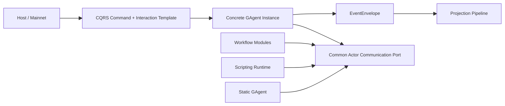

# GAgent 协议优先架构变更实施文档（2026-03-12）

## 1. 文档元信息

- 状态：Proposed
- 版本：R1
- 日期：2026-03-12
- 适用范围：
  - `src/Aevatar.Foundation.*`
  - `src/Aevatar.CQRS.Core*`
  - `src/Aevatar.CQRS.Projection.*`
  - `src/workflow/*`
  - `src/Aevatar.Scripting.*`
  - `src/Aevatar.Mainnet.Host.Api`
  - `src/workflow/Aevatar.Workflow.Host.Api`
- 关联文档：
  - `AGENTS.md`
  - `docs/FOUNDATION.md`
  - `docs/SCRIPTING_ARCHITECTURE.md`
  - `src/workflow/README.md`
  - `docs/architecture/2026-03-12-gagent-implementation-source-unification-blueprint.md`
  - `docs/architecture/2026-03-11-gagent-centric-cqrs-capability-unification-blueprint.md`
- 文档定位：
  - 本文是“协议优先互通蓝图”的工程实施文档。
  - 本文不再讨论抽象理念本身是否成立，而是回答“基于当前代码，应该如何以最佳实践落地”。
  - 本文重点覆盖：面向对象边界、设计模式选择、开闭原则、基类继承、范型使用、分阶段改造与门禁。

## 2. 执行摘要

本次变更的核心不是“发明统一来源模型”，而是：

1. 保留 `EventEnvelope + Actor Runtime + Projection` 这条已验证的主干。
2. 把“不同来源实现之间的互通”收敛为协议问题，而不是来源建模问题。
3. 让 workflow、scripting、静态 `GAgent` 都成为同一层的协议实现者。
4. 用面向对象和设计模式把稳定机制沉到基类和策略接口，把变化点留在业务层。

因此本次实施应遵守四个总原则：

1. 稳定骨架用 `Template Method + Strategy + 轻量 Abstract Factory`。
2. 能用组合解决的变化，绝不先加继承层次。
3. 范型只服务于稳定算法骨架，不服务于业务分类。
4. 开闭原则落在“新增协议实现不用改核心骨架”，而不是“预先建一个大而全的扩展模型”。

## 3. 项目现状分析

## 3.1 Foundation 已经具备正确的基类骨架

当前 `Foundation` 中，`GAgentBase` 继承链是本仓库最成熟的稳定骨架之一：

1. `src/Aevatar.Foundation.Core/GAgentBase.cs`
2. `src/Aevatar.Foundation.Core/GAgentBase.TState.cs`
3. `src/Aevatar.Foundation.Core/GAgentBase.TState.TConfig.cs`

它已经体现了正确的分层继承：

1. `GAgentBase`
   - 统一事件管线
   - 统一 hook 管线
   - 统一 `PublishAsync/SendToAsync`
2. `GAgentBase<TState>`
   - 统一 event sourcing replay/commit/snapshot 生命周期
   - 把状态变迁集中到 `TransitionState`
3. `GAgentBase<TState, TConfig>`
   - 统一配置默认值 + 状态覆盖合并
   - 把配置变化回调集中到 `OnEffectiveConfigChangedAsync`

结论：

1. 这条继承链是“应该保留并继续作为模板”的正确例子。
2. 它符合稳定生命周期骨架 + 子类只填变化点的模式。
3. 本轮不应破坏这条继承链，而应把同类稳定骨架继续前移到 CQRS/Projection 层。

## 3.2 CQRS Core 已经具备正确的范型骨架

当前 `CQRS Core` 有两段质量较高的泛型骨架：

1. `src/Aevatar.CQRS.Core/Commands/DefaultCommandDispatchPipeline.cs`
2. `src/Aevatar.CQRS.Core/Interactions/DefaultCommandInteractionService.cs`

它们体现了正确的范型使用方式：

1. 算法骨架完全稳定
2. 变化通过接口注入
3. 业务系统只提供 resolver/policy/finalizer/stream mapping

优点：

1. `DefaultCommandDispatchPipeline` 已经把 `Resolve -> Context -> Bind -> Envelope -> Dispatch -> Receipt` 固定下来。
2. `DefaultCommandInteractionService` 已经把 `Dispatch -> Observe -> Finalize -> Release` 固定下来。
3. 这类泛型是真正减少重复的，不是空泛抽象。

结论：

1. 本轮应继续强化这种“稳定骨架 + 策略接口”的思路。
2. 不应把这套骨架再退回到 capability 私有 facade。

## 3.3 Projection Core 也已经有正确的继承示范

当前两个基类值得保留：

1. `src/Aevatar.CQRS.Projection.Core/Orchestration/EventSinkProjectionLifecyclePortServiceBase.cs`
2. `src/Aevatar.CQRS.Projection.Core/Orchestration/ProjectionQueryPortServiceBase.cs`

它们说明：

1. 若 enable gate、lifecycle、read skeleton 稳定，就应通过抽象基类统一。
2. 这种基类是“低噪音、强不变量”的好继承，而不是业务层级继承。

结论：

1. 本轮应继续允许这种抽象基类存在。
2. 但范围只限于真正稳定的生命周期算法。

## 3.4 Workflow 的 plugin 模型是对的，但边界要收窄

当前 workflow 的下列代码体现了正确的 plugin 思路：

1. `src/workflow/Aevatar.Workflow.Core/IWorkflowModulePack.cs`
2. `src/workflow/Aevatar.Workflow.Core/WorkflowModuleRegistration.cs`
3. `src/workflow/Aevatar.Workflow.Core/WorkflowModuleFactory.cs`
4. `src/workflow/Aevatar.Workflow.Core/WorkflowRunGAgent.cs`

优点：

1. `module pack + registration + factory` 是典型的可扩展插件模型。
2. `WorkflowRunGAgent` 把 execution kernel 和 module 安装点集中在一个事实边界里。

问题：

1. 这种 plugin 模型应只服务于 workflow 编排原语。
2. 它不应继续膨胀为跨来源共享的业务能力容器。

结论：

1. 保留 workflow module 系统。
2. 严禁把它升级为整个平台的统一扩展系统。

## 3.5 Scripting 当前最大问题是 capability 私有 facade 过多

当前 scripting 中既有好抽象，也有需要继续收敛的点。

较好的部分：

1. `src/Aevatar.Scripting.Core/Ports/IGAgentRuntimePort.cs`
2. `src/Aevatar.Scripting.Infrastructure/Ports/RuntimeGAgentRuntimePort.cs`

它们说明 scripting 已经具备“通用 actor 通信能力”。

需要收敛的部分：

1. `src/Aevatar.Scripting.Infrastructure/Ports/ScriptActorCommandPortBase.cs`
2. `src/Aevatar.Scripting.Infrastructure/Ports/RuntimeScriptExecutionLifecycleService.cs`
3. `src/Aevatar.Scripting.Infrastructure/Ports/RuntimeScriptEvolutionFlowPort.cs`

问题不在这些类一定错误，而在于：

1. 通用 actor 通信能力还挂在 `Scripting` 私有语义下。
2. 能力私有 flow port 容易继续长成总入口 facade。
3. `RuntimeScriptEvolutionFlowPort` 同时承担 policy、compile、definition upsert、catalog promote、compensation，职责过重。

结论：

1. 需要把通用 actor 通信能力上移。
2. 需要把重 orchestration facade 拆成组合对象。

## 4. 软件工程决策

## 4.1 面向对象总原则

本次变更采用以下 OO 策略：

1. 用对象表达稳定边界与职责。
2. 用接口表达变化点，而不是用字符串或大 switch。
3. 用基类表达真正稳定的生命周期骨架。
4. 用组合表达 capability 差异和业务策略。

## 4.2 设计模式选择矩阵

| 关注点 | 采用模式 | 适用位置 | 禁止误用 |
|---|---|---|---|
| actor 生命周期骨架 | `Template Method` | `GAgentBase*`、CQRS interaction skeleton、projection lifecycle skeleton | 不要把业务差异硬塞进基类层级 |
| 目标解析、完成判定、最终输出 | `Strategy` | resolver/policy/finalizer/emitter | 不要把少量 if/else 提前抽成空壳接口 |
| workflow 模块发现与创建 | `Abstract Factory + Registration` | `WorkflowModulePack/Factory` | 不要扩展成全平台统一来源注册中心 |
| scripting 演化/执行步骤拆分 | `Application Service + Strategy Composition` | compile/promote/query/compensate | 不要用一个大 façade 承担所有步骤 |
| 协议兼容治理 | `Contract Tests` | cross-source compatibility | 不要试图用 runtime kind schema 代替行为验证 |

## 4.3 开闭原则的正确落点

本轮的开闭原则不是：

1. 预先列出所有实现来源 kind
2. 给每个来源预留一个统一 schema 槽位

而是：

1. 新增一个协议实现时，不需要修改 `GAgentBase` 骨架
2. 新增一个 capability 时，不需要修改 CQRS 核心骨架
3. 新增一种 workflow 编排原语时，不需要修改 workflow kernel
4. 新增一个来源实现时，只要能通过协议 contract tests，就不需要改协议治理核心

也就是：

“对新增实现开放，对稳定骨架关闭”

## 4.4 继承使用规则

本轮明确以下继承规则：

1. 只有“生命周期算法稳定”的地方允许抽象基类。
2. 抽象基类层级原则上不超过 2 层；`GAgentBase -> GAgentBase<TState> -> GAgentBase<TState,TConfig>` 已是上限样板。
3. 新增基类必须满足至少 2 个真实消费者，且两个消费者的执行顺序完全一致。
4. 新增基类默认 `abstract` + 尽量少的 `protected virtual`。
5. 若差异主要体现在协作者不同，而不是执行顺序不同，则必须优先组合，不得继续加基类。

## 4.5 范型使用规则

本轮明确以下范型规则：

1. 范型只用于“稳定算法 + 类型差异”。
2. 范型参数必须能用一句职责话术说明。
3. 业务来源分类不应做成泛型参数。
4. 如果一个抽象需要 5 个以上范型参数，必须明确说明为什么算法骨架仍值得保留。

对当前代码的判断：

1. `DefaultCommandDispatchPipeline<TCommand, TTarget, TReceipt, TError>` 是合理的。
2. `DefaultCommandInteractionService<TCommand, TTarget, TReceipt, TError, TEvent, TFrame, TCompletion>` 仍然合理，因为骨架高度稳定。
3. workflow module 系统不需要再泛型化。
4. scripting flow facade 不应再以更多范型或继承层次扩张。

## 5. 目标架构落点

## 5.1 继续保留的主干

以下主干在本轮应保持不变：

1. `EventEnvelope` 作为统一消息壳
2. `IActorRuntime + IActorDispatchPort`
3. `GAgentBase*` 继承链
4. CQRS 命令与交互模板
5. Projection 单主干

## 5.2 需要新增或收敛的公共层

### A. 通用 actor 通信层

目标：

1. 把 `IGAgentRuntimePort` 这类能力从 `Scripting` 私有语义中抽离
2. 形成 workflow、scripting、静态实现都可复用的 actor 通信抽象

要求：

1. 该层只暴露稳定动作：`Publish/SendTo/Create/Destroy/Link/Unlink`
2. 该层不表达 workflow/script 业务语义
3. 该层不持有长期事实状态

### B. 协议治理层

目标：

1. 不通过 `implementation kind` 治理实现来源
2. 改用协议 contract tests 治理兼容性

要求：

1. 定义协议样本
2. 对静态/workflow/script 三类实现跑同一套 contract tests

### C. workflow 通用 actor 通信面

目标：

1. 让 workflow 能通过通用步骤与任意协议兼容 actor 交互

要求：

1. 增加最小的通用 actor 通信模块
2. 不增加来源相关步骤类型

### D. scripting orchestration 拆分

目标：

1. 将 `RuntimeScriptEvolutionFlowPort` 这类重 orchestration façade 拆分为更小的组合对象

建议拆分：

1. `IScriptEvolutionPolicy`
2. `IScriptPackageValidationService`
3. `IScriptDefinitionWriter`
4. `IScriptCatalogPromotionService`
5. `IScriptPromotionCompensationService`

然后用一个薄的 application service 组合调用。

## 5.3 目标关系图

## 6. 按项目的具体改造项

## 6.1 Foundation

### 保留

1. `GAgentBase*`
2. `IActorRuntime`
3. `IActorDispatchPort`
4. `IEventContext`

### 改造

1. 评估将 `IGAgentRuntimePort` 上移到 Foundation 公共语义层或新建中立公共层。
2. 若上移，则命名不得带 `Scripting` 痕迹。

### 禁止

1. 不要在 Foundation 中引入 workflow/script/static 来源枚举。
2. 不要在 Foundation 中引入业务来源判断逻辑。

## 6.2 CQRS Core

### 保留

1. `DefaultCommandDispatchPipeline`
2. `DefaultCommandInteractionService`
3. 现有 resolver/policy/binder/dispatcher/receipt/finalize/durable resolver 抽象

### 改造

1. 补文档和守卫，明确 capability 只能扩展策略接口，不能重造私有总入口。
2. 优先让新能力通过现有 command/interaction skeleton 接入，而不是各写 lifecycle façade。

### 禁止

1. 不要为来源统一新增 `TImplementationKind` 一类泛型参数。
2. 不要把 workflow/script 关系写死到 CQRS 抽象命名里。

## 6.3 Projection Core

### 保留

1. `EventSinkProjectionLifecyclePortServiceBase`
2. `ProjectionQueryPortServiceBase`

### 改造

1. 继续把 enable gate、lifecycle skeleton、query skeleton 收敛到共用基类。
2. 避免 capability-specific observation pipeline 继续增长。

### 禁止

1. 不要为不同来源建立平行 projection session bus。

## 6.4 Workflow

### 保留

1. `IWorkflowModulePack`
2. `WorkflowModuleRegistration`
3. `WorkflowModuleFactory`
4. `WorkflowRunGAgent`

### 改造

1. 新增通用 actor 通信模块，而不是继续增加业务专用通信步骤。
2. 让 workflow 通过通用 actor 通信面与脚本/静态实例交互。
3. 继续把独立能力边界沉到独立 `GAgent`，而不是继续塞进 module pack。

### 禁止

1. 不要把 workflow module pack 演变成整个平台统一扩展模型。

## 6.5 Scripting

### 保留

1. `ScriptRuntimeGAgent`
2. `ScriptDefinitionGAgent`
3. `ScriptEvolutionManagerGAgent`
4. 当前 runtime capability 组合思路

### 改造

1. 将通用 actor 通信能力上移到公共层。
2. 将 `RuntimeScriptEvolutionFlowPort` 拆成更小的组合式 service。
3. 将 `RuntimeScriptExecutionLifecycleService` 一类 command adapter 保持轻量，只做映射与投递。

### 禁止

1. 不要继续长出新的“scripting 私有总入口”。
2. 不要把通用 actor 能力永久挂在 `Scripting` 命名空间下。

## 6.6 Host / Mainnet

### 保留

1. 现有 capability host registration 模型
2. workflow/script 默认并装的能力装配

### 改造

1. 创建、交互、观察都优先走统一 CQRS/Projection 骨架。
2. Host 不再理解来源，只理解实例协议。

### 禁止

1. 禁止在 Host 层解析 `actorId` 决定实现来源。
2. 禁止在 Host 层维护来源状态。

## 7. 分阶段实施方案

## 阶段 0：规则冻结

输出：

1. 本文档
2. `AGENTS.md` 生命周期判定规则
3. 协议优先蓝图文档

验收：

1. 团队对“不统一来源模型，只统一协议与骨架”达成一致

## 阶段 1：协议治理先行

任务：

1. 为 1 个代表性能力定义协议 contract tests
2. 提供静态/workflow/script 至少 2 种实现样本

验收：

1. 证明协议治理可行，不依赖来源 schema

## 阶段 2：公共 actor 通信能力上移

任务：

1. 梳理 `IGAgentRuntimePort` 的最小稳定面
2. 中立化命名与归属
3. 清理 scripting 私有耦合

验收：

1. workflow 与 scripting 都可调用同一 actor 通信抽象

## 阶段 3：workflow 通用通信面补齐

任务：

1. 增加通用 actor 通信模块
2. 用通用模块替代一部分专用通信步骤

验收：

1. workflow 能直接和协议兼容实例交互

## 阶段 4：scripting façade 拆分

任务：

1. 拆分 `RuntimeScriptEvolutionFlowPort`
2. 保留薄应用服务，移除重 orchestration facade

验收：

1. 单个 service 的职责边界明显收窄
2. 组合关系比继承关系更清晰

## 阶段 5：Host/Mainnet 清理

任务：

1. 清理 Host 中来源认知
2. 只保留协议、实例、观察语义

验收：

1. Mainnet 组装不依赖 workflow/script/static 来源判断

## 8. 测试计划

## 8.1 协议 Contract Tests

必须验证：

1. 相同 command 是否被不同来源一致接收
2. 相同 reply/completion 是否保持一致
3. 相同 query 语义是否一致
4. 相同 read model 语义是否一致

## 8.2 Forward-Only Upgrade Tests

必须验证：

1. 旧 run 保持旧实现
2. 新 run 走新实现
3. 不发生存量热替换

## 8.3 Architecture Guards

建议新增或强化守卫：

1. 禁止 Host/Application 解析 `actorId`
2. 禁止 capability 私造平行 observation 主链
3. 禁止通用 actor 通信能力继续沉在 `Scripting` 私有层
4. 禁止新增 capability 私有全能 façade

## 9. 风险与规避

## 9.1 风险：过度抽象

表现：

1. 还没出现第二个真实消费者就先加基类/接口

规避：

1. 抽象必须有 2 个真实样本或稳定算法证明

## 9.2 风险：错误使用开闭原则

表现：

1. 为了所谓扩展性预建来源枚举、统一 schema、全局注册器

规避：

1. 只对协议实现开放，不对来源建模做过度设计

## 9.3 风险：错误使用继承

表现：

1. 用继承表达业务分类树

规避：

1. 继承只表达稳定生命周期骨架
2. 业务差异一律走组合

## 9.4 风险：错误使用范型

表现：

1. 用范型表达来源分类或业务标签

规避：

1. 范型只保留在稳定算法骨架

## 10. 验收标准

实施完成后，必须满足：

1. 新能力优先通过现有 CQRS/Projection 骨架接入，而不是各写私有 lifecycle façade。
2. 静态/workflow/script 至少有一个真实协议完成 cross-source contract tests。
3. workflow 获得通用 actor 通信面。
4. scripting 的通用 actor 通信能力完成中立化。
5. `RuntimeScriptEvolutionFlowPort` 这类重 façade 被拆分为组合式服务。
6. Host/Mainnet 不再依赖来源判断。

## 11. 非目标

本轮不做：

1. 不统一所有来源的定义 schema
2. 不引入 `implementation kind` 总模型
3. 不做存量 run 热替换
4. 不要求 workflow/script/static 的内部状态完全同构

## 12. 收束性结论

这项工作真正需要的软件工程能力，不在于“把所有东西抽象成一个大模型”，而在于：

1. 识别哪些骨架已经稳定，值得进基类或范型骨架
2. 识别哪些差异只是策略差异，应留在组合对象里
3. 识别哪些 façade 已经越权，应拆分职责
4. 用 contract tests 替代来源建模来验证兼容性

因此本次实施的正确方向是：

`保留稳定骨架 -> 收敛公共 actor 通信 -> 拆分 capability 私有 façade -> 用协议测试治理跨来源兼容`

这条路径最符合当前项目已有结构，也最符合开闭原则、面向对象最佳实践和仓库已经确立的分层规则。
