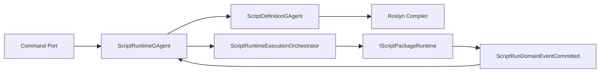
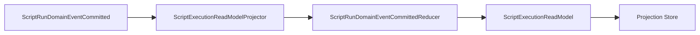
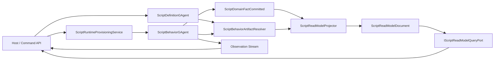
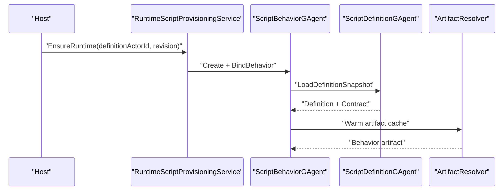
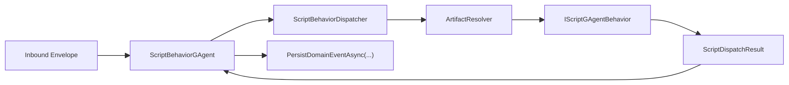
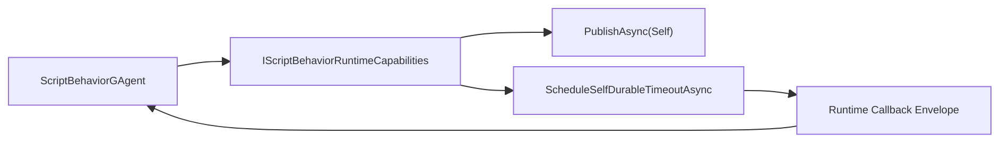
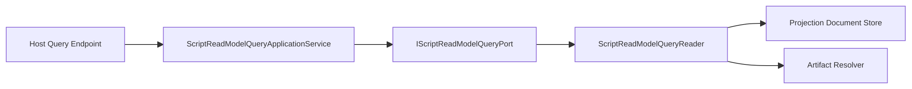

# Scripting GAgent 行为等价详细架构变更方案（2026-03-13）

## 1. 文档元信息

- 状态：Proposed
- 版本：R1
- 日期：2026-03-13
- 适用范围：
  - `src/Aevatar.Scripting.Abstractions`
  - `src/Aevatar.Scripting.Core`
  - `src/Aevatar.Scripting.Application`
  - `src/Aevatar.Scripting.Infrastructure`
  - `src/Aevatar.Scripting.Projection`
  - `src/Aevatar.Scripting.Hosting`
- 关联文档：
  - `docs/architecture/2026-03-13-scripting-gagent-behavior-parity-refactor-blueprint.md`
  - `docs/SCRIPTING_ARCHITECTURE.md`
- 文档定位：
  - 本文是 detailed design，不再重复“为什么做”，而是直接回答“怎么做”。
  - 本文不考虑兼容性，默认允许删除旧接口、旧 proto 字段、旧 projector/read-model 结构。

## 2. 设计总原则

### 2.1 核心判断

wrapper 不是问题。  
问题是当前 wrapper 后面的能力面太弱。

因此目标不是“让脚本变成仓库静态类”，而是：

1. 保留脚本定义与演化能力。
2. 保留 actor-hosted 运行模式。
3. 让 scripting 在系统其余部分面前，表现得像一个完整的静态 `GAgent`。

### 2.2 明确删掉的旧设计

以下设计全部删除，不保留兼容层：

1. `IScriptPackageRuntime`
2. `IScriptContractProvider`
3. `ScriptHandlerResult`
4. `ScriptRuntimeGAgent` 当前“每次 run 先 query definition snapshot”模型
5. `ScriptRunDomainEventCommitted.state_payloads`
6. `ScriptRunDomainEventCommitted.read_model_payloads`
7. `ScriptExecutionReadModel`
8. execution read model 直接 store read 作为主查询口径

### 2.3 明确保留的底层模式

以下基础模式保留，并作为新设计骨架：

1. `GAgentBase<TState>` 的 Template Method 生命周期与 event sourcing 骨架
2. `StateEventApplierBase<TState, TEvent>` 的 typed state applier 模式
3. `IProjectionProjector<TContext, TTopology>` 的 projection 主模型
4. `IProjectionStoreDispatcher<TReadModel, TKey>` 的 store dispatch 模式
5. runtime durable callback / self-signal 机制

## 3. 当前代码拓扑诊断

### 3.1 当前写侧拓扑



问题：

1. run path 依赖 definition query。
2. committed event 同时携带事实与 snapshot。
3. actor 运行绑定不是“启动时绑定 revision”，而是“执行时拉 definition”。

### 3.2 当前读侧拓扑



问题：

1. projector 没有真的做 read-side reduce。
2. read model 是 bag 容器，不是正式 root。
3. query 没有产品化口径。

### 3.3 当前可复用模式

仓库里已有可以直接复用的模式：

1. `GAgentBase<TState>`：`src/Aevatar.Foundation.Core/GAgentBase.TState.cs`
2. `StateEventApplierBase<TState, TEvent>`：`src/Aevatar.Foundation.Core/EventSourcing/StateEventApplierBase.cs`
3. `ProjectionQueryPortServiceBase<...>`：`src/Aevatar.CQRS.Projection.Core/Orchestration/ProjectionQueryPortServiceBase.cs`
4. workflow typed state adapter：`src/workflow/Aevatar.Workflow.Core/Execution/WorkflowExecutionContextAdapter.cs`
5. workflow query facade 模式：`src/workflow/Aevatar.Workflow.Projection/Orchestration/WorkflowExecutionProjectionQueryService.cs`

## 4. 目标架构概览

### 4.1 目标主图



### 4.2 目标分层

| 分层 | 目标职责 | 关键约束 |
|---|---|---|
| Abstractions | 声明脚本行为契约、query 契约、proto 契约 | 不含 runtime 实现 |
| Core | actor 宿主、state transition、committed facts | 不直接读 projection store |
| Application | dispatch/query/orchestration | 只依赖 port，不依赖 Roslyn 细节 |
| Infrastructure | 编译、artifact cache、descriptor 解析 | 不定义业务语义 |
| Projection | read-side reducer、query reader | 只消费 committed facts |
| Hosting | API/JSON/SDK 适配 | 不直接读 actor 内部 state |

## 5. 面向对象与设计模式方案

## 5.1 Hosted Behavior Pattern

### 5.1.1 模式选择

`ScriptBehaviorGAgent` 继续作为宿主 actor。  
脚本本体不继承 `GAgentBase<TState>`，而是实现策略对象 `IScriptGAgentBehavior`。

这是一个：

1. Template Method + Strategy 组合
2. Actor Host + Behavior Plugin 模式

原因：

1. actor 生命周期、event sourcing、runtime callback 是平台稳定机制，不应让动态脚本直接接管。
2. 脚本真正需要控制的是行为，不是宿主基础设施。
3. 这样可以保留 wrapper，同时达到行为等价。

### 5.1.2 类职责

| 类型 | 模式角色 | 职责 |
|---|---|---|
| `ScriptBehaviorGAgent` | Host | 宿主 actor、event sourcing、runtime callback、dispatch 入口 |
| `IScriptGAgentBehavior` | Strategy | 业务行为实现 |
| `IScriptBehaviorArtifactResolver` | Factory + Cache | 解析 revision artifact |
| `ScriptBehaviorDispatcher` | Application Service | 统一 dispatch 骨架 |
| `ScriptReadModelProjector` | Projector | 读侧归约 |
| `ScriptReadModelQueryService` | Query Facade | 读侧查询服务 |

### 5.1.3 Foundation 骨架直接复用清单

本次重构不新造 scripting 自己的 actor 框架，直接复用 Foundation 骨架：

1. `src/Aevatar.Foundation.Core/GAgentBase.cs`
2. `src/Aevatar.Foundation.Core/GAgentBase.TState.cs`
3. `src/Aevatar.Foundation.Core/GAgentBase.TState.TConfig.cs`
4. `src/Aevatar.Foundation.Core/Pipeline/EventPipelineBuilder.cs`
5. `src/Aevatar.Foundation.Core/Pipeline/EventHandlerDiscoverer.cs`
6. `src/Aevatar.Foundation.Core/Pipeline/StaticHandlerAdapter.cs`
7. `src/Aevatar.Foundation.Core/EventSourcing/IEventSourcingBehavior.cs`
8. `src/Aevatar.Foundation.Core/EventSourcing/IEventSourcingBehaviorFactory.cs`
9. `src/Aevatar.Foundation.Core/EventSourcing/StateEventApplierBase.cs`
10. `src/Aevatar.Foundation.Abstractions/EventModules/IEventModule.cs`
11. `src/Aevatar.Foundation.Abstractions/EventModules/IEventHandlerContext.cs`
12. `src/Aevatar.Foundation.Abstractions/Runtime/Callbacks/IActorRuntimeCallbackScheduler.cs`

明确要求：

1. `ScriptBehaviorGAgent` 必须直接落在 `GAgentBase<TState>` 继承链上。
2. 如果 scripting 后续确实需要“类默认配置 + state 覆盖配置”能力，只允许升级到 `GAgentBase<TState, TConfig>`，不允许在 scripting 层自造第二套配置生命周期。
3. self-signal、durable timeout、callback lease、runtime-neutral 调度全部沿用 Foundation callback 抽象，不重写一条 scripting 私有 timer 主链。

### 5.1.4 复杂执行内核采用 Module Composition

当脚本宿主执行逻辑继续膨胀时，不应把所有编排都堆进 `ScriptBehaviorGAgent` 或 `ScriptBehaviorDispatcher`。

优先模式是：

1. `Template Method` 保留在 `GAgentBase<TState>`
2. `Strategy` 保留在 `IScriptGAgentBehavior`
3. 复杂执行流拆成 `IEventModule<IEventHandlerContext>` 组合模块

这与 workflow 侧 `ExecutionBridgeModule + ContextAdapter` 的模式一致。  
因此 detailed design 要求预留如下拆分位点：

1. `ScriptBehaviorExecutionBridgeModule`
2. `ScriptBehaviorExecutionContextAdapter`
3. `ScriptBehaviorEventModules/*`

这样做的好处：

1. 事件入口仍然统一走 Foundation pipeline。
2. 脚本专用上下文只在 adapter 内桥接，不污染 Foundation 通用接口。
3. 后续如果 execution kernel 增长，可以平滑把巨型 dispatcher 拆成模块，而不是再抽一个 scripting 专用基类。

## 5.2 继承策略

### 5.2.1 允许继承

允许且必须使用的继承只有三类：

1. `ScriptBehaviorGAgent : GAgentBase<ScriptBehaviorState>`
2. `ScriptBehaviorStateApplier : StateEventApplierBase<ScriptBehaviorState, TEvent>`
3. scripting projection/query service 对 CQRS Core 基类的窄继承

### 5.2.2 禁止继承

禁止新增以下风格：

1. `AbstractScriptRuntimeBase<TState, TReadModel, TQuery, TCommand, ...>` 这类多泛型抽象大基类
2. 让脚本业务实现继承平台宿主类
3. 通过继承链叠加 runtime behavior、readmodel、query 三种职责

原因：

1. 这会让动态能力和基础设施耦合。
2. 会导致泛型爆炸。
3. 会让 scripting 变成另一套框架，而不是复用现有 actor/projection 骨架。

### 5.2.3 状态归约优先级

状态归约采用两级策略，且顺序固定：

1. 第一优先：`StateEventApplierBase<TState, TEvent>`
2. 第二优先：仅在宿主极少量协调逻辑需要时，保留窄 `TransitionState(...)` override

原因：

1. `ScriptDomainFactCommitted` 已经是统一 committed fact，适合做独立 applier。
2. applier 更容易测试，也更容易在 definition/catalog/runtime 等多个 actor 间复用。
3. `TransitionState(...)` 只保留给宿主的最薄协调层，不应继续承载脚本业务归约。

## 5.3 泛型设计策略

### 5.3.1 在框架层使用泛型

框架层继续使用泛型：

1. `GAgentBase<TState>`
2. `StateEventApplierBase<TState, TEvent>`
3. `IProjectionProjector<TContext, TTopology>`
4. `IProjectionStoreDispatcher<TReadModel, TKey>`

这些泛型是稳定的、平台级的、值得保留。

### 5.3.2 在 scripting 业务契约层禁止泛型爆炸

scripting 自身的行为契约不再定义：

1. `IScriptBehavior<TState, TReadModel, TQuery, TResult>`
2. `IScriptReducer<TEvent, TReadModel, TContext>`

而是统一采用：

1. protobuf `Any`
2. 稳定 `TypeUrl`
3. descriptor set

原因：

1. script 类型不是仓库编译期已知类型。
2. 如果把 script 类型拉进范型参数，宿主和 DI 注册将不可控。
3. descriptor contract 足以表达“typed”，而不需要宿主编译期静态泛型类型。

### 5.3.3 单一 root 设计

write-side state 与 read-side model 都采用“单一 root message”：

1. `StateRoot : Any + StateTypeUrl`
2. `ReadModelRoot : Any + ReadModelTypeUrl`

不再允许：

1. `map<string, Any> state_payloads`
2. `Dictionary<string, Any> read_model_payloads`

### 5.3.4 泛型与配置边界

泛型只保留在平台稳定骨架；脚本行为契约与业务扩展点保持非泛型。

额外规则：

1. `ScriptBehaviorGAgent` 默认使用 `GAgentBase<ScriptBehaviorState>`
2. 只有当脚本宿主必须支持“默认配置定义 + state 覆盖 + revision 切换默认值”时，才升级为 `GAgentBase<ScriptBehaviorState, ScriptBehaviorConfig>`
3. 禁止为 query、read-model、command 结果再额外引入 `TQuery/TReadModel/TResult` 多泛型宿主

这样可以避免两类问题：

1. 宿主对脚本类型参数产生编译期耦合
2. DI、projection registration、runtime activation 出现动态泛型类型膨胀

## 5.4 Query-First Pattern

Scripting 不再把 execution read model 当作“projection store 内部结构”，而是当作正式可查询产品能力。

模式选择：

1. Reader + Query Service + Port
2. Host Endpoint 只依赖 Query Port

这与 workflow 当前的 `ProjectionQueryPortServiceBase -> QueryReader -> Endpoint` 模式一致，但不强行复用 workflow 的 graph/timeline 形状。

结论：

1. 复用 query facade 模式。
2. 不复用 workflow 那个 4 泛型快照/时间线/图模型基类接口形状。

### 5.4.1 两类查询必须严格分离

重构后的 scripting 必须像 workflow 一样，把查询拆成两类：

1. `definition/catalog actor-owned query`
2. `execution projection read-side query`

前者用于：

1. definition snapshot
2. catalog active revision
3. actor binding / configuration inspection

后者用于：

1. execution snapshot
2. declared read-model query
3. completion / observation read-side fallback

禁止：

1. 用 actor-owned query 兜底 execution read-side query
2. 让 Host 直接查询 runtime actor 内部 state
3. 把 durable completion 回退到 runtime actor 状态查询

### 5.4.2 复用顺序

scripting query/projection 方案的复用顺序必须明确：

1. 第一优先：复用 `CQRS Projection Core` 的通用抽象
2. 第二优先：复用 workflow 的分层形状
3. 第三优先：只在语义完全一致时复用 workflow 具体实现

具体要求：

1. execution read-side 优先复用 `ProjectionQueryPortServiceBase`、`ProjectionActivationServiceBase`、`ProjectionReleaseServiceBase`、`ProjectionRuntimeLeaseBase`、`ProjectionSessionEventHub`
2. 不直接复制 workflow 的 `WorkflowActorSnapshot/Timeline/Graph` DTO
3. definition/catalog query 继续保留 typed actor query/reply 模式，不并入 projection query port

## 6. 目标抽象设计

## 6.1 新接口：`IScriptGAgentBehavior`

建议文件：

`src/Aevatar.Scripting.Abstractions/Behaviors/IScriptGAgentBehavior.cs`

建议职责：

1. 返回行为契约。
2. 处理 command / internal signal / timeout signal。
3. 对 committed domain event 做 write-side state 归约。
4. 对 committed domain event 做 read-side read model 归约。
5. 对声明过的 query 做读侧查询。

建议接口轮廓：

```csharp
public interface IScriptGAgentBehavior
{
    ScriptGAgentContract Contract { get; }

    Task<ScriptDispatchResult> DispatchAsync(
        ScriptInboundMessage inbound,
        ScriptBehaviorContext context,
        CancellationToken ct);

    ValueTask<Any?> ApplyDomainEventAsync(
        Any? currentStateRoot,
        ScriptDomainFactCommitted fact,
        CancellationToken ct);

    ValueTask<Any?> ReduceReadModelAsync(
        Any? currentReadModelRoot,
        ScriptDomainFactCommitted fact,
        CancellationToken ct);

    Task<ScriptDeclaredQueryResult> ExecuteQueryAsync(
        Any queryPayload,
        ScriptReadModelSnapshot snapshot,
        CancellationToken ct);
}
```

## 6.2 新契约：`ScriptGAgentContract`

建议文件：

`src/Aevatar.Scripting.Abstractions/Behaviors/ScriptGAgentContract.cs`

字段建议：

1. `StateTypeUrl`
2. `ReadModelTypeUrl`
3. `CommandTypeUrls`
4. `DomainEventTypeUrls`
5. `QueryTypeUrls`
6. `QueryResultTypeUrls`
7. `InternalSignalTypeUrls`
8. `DescriptorSet`
9. `StoreKinds`

说明：

1. `ReadModelDefinition` 升级为“完整 actor behavior contract”的一部分。
2. 不再只声明 read model schema。

## 6.3 新上下文：`ScriptBehaviorContext`

建议文件：

`src/Aevatar.Scripting.Abstractions/Behaviors/ScriptBehaviorContext.cs`

职责：

1. 暴露 actor identity、run/command/correlation 信息。
2. 暴露 `CurrentStateRoot`。
3. 暴露 `IScriptBehaviorRuntimeCapabilities`。

这里不直接暴露 projection store，不暴露 runtime actor state store。

## 6.4 新运行时能力接口：`IScriptBehaviorRuntimeCapabilities`

建议文件：

`src/Aevatar.Scripting.Abstractions/Behaviors/IScriptBehaviorRuntimeCapabilities.cs`

能力最小集合：

1. `PublishAsync`
2. `SendToAsync`
3. `PublishToSelfAsync`
4. `ScheduleSelfDurableSignalAsync`
5. `CancelDurableCallbackAsync`
6. `Create/Destroy/Link/Unlink`
7. `AskAIAsync`
8. `GetReadModelSnapshotAsync`
9. `ExecuteReadModelQueryAsync`
10. `Propose/Promote/Rollback`

这里故意不暴露：

1. 直接读 write-side actor state
2. 直接读 document store

### 6.4.1 与 Foundation 能力的一一映射

`IScriptBehaviorRuntimeCapabilities` 不是重新定义一套 runtime，而是对 Foundation 能力做脚本可用化映射：

| scripting 能力 | Foundation 实现落点 | 说明 |
|---|---|---|
| `PublishAsync` | `GAgentBase.PublishAsync(...)` | 标准发布 |
| `SendToAsync` | `GAgentBase.SendAsync(...)` | 标准点对点投递 |
| `PublishToSelfAsync` | `PublishAsync(..., TopologyAudience.Self)` | 立即 self continuation |
| `ScheduleSelfDurableSignalAsync` | `GAgentBase.ScheduleSelfDurableTimeoutAsync(...)` | durable timeout / retry |
| `CancelDurableCallbackAsync` | runtime callback scheduler | 取消未触发 callback |
| `GetReadModelSnapshotAsync` | `IScriptReadModelQueryPort` | 只读 projection |
| `ExecuteReadModelQueryAsync` | `IScriptReadModelQueryPort` | declared query |

因此实现边界必须满足：

1. scripting 不得直接依赖 Orleans grain 类型。
2. scripting 不得直接依赖本地 callback scheduler 具体实现。
3. runtime-specific 行为只能留在 Foundation Runtime / Host / Infrastructure。

## 6.5 新 committed fact：`ScriptDomainFactCommitted`

建议文件：

`src/Aevatar.Scripting.Abstractions/Contracts/script_behavior_runtime.proto`

字段建议：

1. `actor_id`
2. `definition_actor_id`
3. `revision`
4. `run_id`
5. `command_id`
6. `correlation_id`
7. `event_sequence`
8. `domain_event_payload`
9. `occurred_at`

明确删除：

1. `state_payloads`
2. `read_model_payloads`
3. `read_model_schema_hash`
4. `read_model_schema_version`

## 6.6 新 read-model 文档：`ScriptReadModelDocument`

建议文件：

`src/Aevatar.Scripting.Projection/ReadModels/ScriptReadModelDocument.cs`

字段建议：

1. `Id`
2. `RootActorId`
3. `DefinitionActorId`
4. `Revision`
5. `ReadModelTypeUrl`
6. `ReadModelPayload`
7. `StateVersion`
8. `LastEventId`
9. `UpdatedAt`

这就是 execution read model 的正式 root。

## 7. 具体对象协作设计

## 7.1 Provisioning

### 7.1.1 关键改变

runtime actor 在创建时绑定 `definitionActorId + revision`。  
之后 run 执行不再先 query definition snapshot。

### 7.1.2 顺序图



收益：

1. 执行路径去掉 per-run definition query。
2. runtime actor 成为稳定绑定实体。
3. 更接近静态 `GAgent` 行为。

## 7.2 Dispatch

### 7.2.1 Dispatch 骨架

新增 `ScriptBehaviorDispatcher`：

建议文件：

`src/Aevatar.Scripting.Application/Runtime/ScriptBehaviorDispatcher.cs`

职责：

1. 统一 `normalize -> resolve artifact -> dispatch -> persist committed facts`
2. 不直接做 actor state 变更
3. 不直接写 read model

### 7.2.2 宿主 actor 与行为对象协作



### 7.2.3 OOP 边界

`ScriptBehaviorGAgent` 负责：

1. envelope 入口
2. state ownership
3. durable callback
4. persisted fact commit

`IScriptGAgentBehavior` 负责：

1. 业务 dispatch
2. state reduce
3. read-model reduce
4. declared query

### 7.2.4 Self-signal 与 durable timeout 主链

self continuation 与 timeout 必须完全事件化，禁止回调线程直接改状态。

立即继续：

1. `ScriptBehaviorGAgent` 调用 `PublishToSelfAsync`
2. 底层映射到 `PublishAsync(..., TopologyAudience.Self)`
3. 由 self-only handler 再次进入统一 inbox

延迟继续：

1. `ScriptBehaviorGAgent` 调用 `ScheduleSelfDurableSignalAsync`
2. 底层映射到 `ScheduleSelfDurableTimeoutAsync(...)`
3. timeout 到期后通过 runtime callback envelope 回投 actor inbox
4. `ScriptBehaviorGAgent` 依据 `RuntimeCallbackLease / generation` 对账，拒绝陈旧信号



这条主链必须复用：

1. `src/Aevatar.Foundation.Core/Pipeline/SelfEventEnvelopeFactory.cs`
2. `src/Aevatar.Foundation.Runtime/Callbacks/RuntimeCallbackEnvelopeFactory.cs`
3. `src/Aevatar.Foundation.Abstractions/Runtime/Callbacks/RuntimeCallbackEnvelopeState.cs`

## 7.3 State Transition

### 7.3.1 方案

不要在 `ScriptBehaviorGAgent` 里继续手写巨大 `TransitionState(...)`。  
改为引入 scripting 自己的 state applier：

建议文件：

`src/Aevatar.Scripting.Core/EventSourcing/ScriptBehaviorStateCommittedFactApplier.cs`

基类：

1. 直接继承 `StateEventApplierBase<ScriptBehaviorState, ScriptDomainFactCommitted>`

作用：

1. 从 artifact resolver 取到 behavior
2. 调用 `ApplyDomainEventAsync(...)`
3. 生成 next `StateRoot`

说明：

1. 这是对 Foundation event sourcing 模式的正向复用。
2. 不再把 state transition 写死在宿主 actor 巨型方法里。

### 7.3.2 `TransitionState` 与 `Applier` 的职责边界

`ScriptBehaviorStateCommittedFactApplier` 是主路径；`TransitionState(...)` 只保留宿主协调责任。

职责划分：

1. `Applier` 负责 committed fact -> next state root
2. `ScriptBehaviorGAgent.TransitionState(...)` 只负责接线、调用 matcher/applier、维护最薄 actor-owned 协调状态
3. definition/catalog/runtime 如果共享同一类 committed fact reducer，优先新增更多 applier，而不是复制 `TransitionState(...)`

禁止：

1. 在 `TransitionState(...)` 里直接做 artifact 解析、query、callback 业务编排
2. 在 applier 里直接访问 projection store
3. 在多个 scripting actor 里复制同一套 matcher/if-else 状态归约逻辑

## 7.4 Projection

### 7.4.1 Projector 设计

建议文件：

1. `src/Aevatar.Scripting.Projection/Projectors/ScriptReadModelProjector.cs`
2. `src/Aevatar.Scripting.Projection/Orchestration/ScriptReadModelProjectionContext.cs`
3. `src/Aevatar.Scripting.Projection/Orchestration/IScriptProjectionArtifactResolver.cs`

projector 逻辑：

1. 读取 committed fact。
2. 从 context 拿到 definition/revision。
3. 解析 artifact。
4. 读取当前 `ScriptReadModelDocument.ReadModelPayload`。
5. 调用 `ReduceReadModelAsync(...)`。
6. 写回 store。

### 7.4.2 为什么不再用 reducer 复制 payload

旧模式是：

1. write-side 先算 read model
2. committed event 携带 read-model snapshot
3. projector 复制 snapshot

新模式必须改成：

1. write-side 只发 committed fact
2. projector 自己 reduce

这才是真正的读写分离。

## 7.5 Query

### 7.5.1 Query 服务结构

建议文件：

1. `src/Aevatar.Scripting.Application/Queries/IScriptReadModelQueryApplicationService.cs`
2. `src/Aevatar.Scripting.Application/Queries/ScriptReadModelQueryApplicationService.cs`
3. `src/Aevatar.Scripting.Projection/Queries/IScriptReadModelQueryReader.cs`
4. `src/Aevatar.Scripting.Projection/Queries/ScriptReadModelQueryReader.cs`
5. `src/Aevatar.Scripting.Projection/Queries/ScriptReadModelQueryService.cs`

### 7.5.2 设计理由

这里采用：

1. Application Service
2. Query Port
3. Query Reader

的标准分层，而不是让 Host 直接依赖 `IProjectionStoreDispatcher<...>`。

同时保留一条独立的 actor-owned query 线：

1. `ScriptDefinitionSnapshotQueryService`
2. `ScriptCatalogEntryQueryService`
3. `RuntimeScriptQueryClient`

这条线只负责 definition/catalog 事实读取，不负责 execution read-side。

### 7.5.3 不复用 workflow graph/timeline 形状

不建议为了复用 `ProjectionQueryPortServiceBase<TSnapshot, TTimelineItem, TGraphEdgeItem, TGraphSubgraph>` 而人为给 scripting 添加 timeline/graph 占位模型。

最佳实现是：

1. 如果 scripting 只需要 snapshot + declared query，就写窄接口。
2. 以后真有 timeline/graph 需求，再显式扩展。

### 7.5.4 Query 主链边界

execution query 主链必须固定为：



definition/catalog query 主链必须固定为：


## 8. 具体文件变更方案

## 8.1 `Aevatar.Scripting.Abstractions`

### 新增

1. `src/Aevatar.Scripting.Abstractions/Behaviors/IScriptGAgentBehavior.cs`
2. `src/Aevatar.Scripting.Abstractions/Behaviors/ScriptGAgentContract.cs`
3. `src/Aevatar.Scripting.Abstractions/Behaviors/ScriptBehaviorContext.cs`
4. `src/Aevatar.Scripting.Abstractions/Behaviors/IScriptBehaviorRuntimeCapabilities.cs`
5. `src/Aevatar.Scripting.Abstractions/Queries/IScriptReadModelQueryPort.cs`
6. `src/Aevatar.Scripting.Abstractions/Queries/ScriptReadModelQueryModels.cs`
7. `src/Aevatar.Scripting.Abstractions/Contracts/script_behavior_contract.proto`
8. `src/Aevatar.Scripting.Abstractions/Contracts/script_behavior_runtime.proto`
9. `src/Aevatar.Scripting.Abstractions/Contracts/script_read_model_query.proto`

### 删除

1. `src/Aevatar.Scripting.Abstractions/Definitions/IScriptPackageRuntime.cs`
2. `src/Aevatar.Scripting.Abstractions/Definitions/IScriptContractProvider.cs`
3. `src/Aevatar.Scripting.Abstractions/Definitions/ScriptHandlerResult.cs`

### 更新

1. `src/Aevatar.Scripting.Abstractions/Aevatar.Scripting.Abstractions.csproj`

## 8.2 `Aevatar.Scripting.Core`

### 新增

1. `src/Aevatar.Scripting.Core/ScriptBehaviorGAgent.cs`
2. `src/Aevatar.Scripting.Core/Artifacts/IScriptBehaviorArtifactResolver.cs`
3. `src/Aevatar.Scripting.Core/Artifacts/ScriptBehaviorArtifact.cs`
4. `src/Aevatar.Scripting.Core/EventSourcing/ScriptBehaviorStateCommittedFactApplier.cs`
5. `src/Aevatar.Scripting.Core/Execution/ScriptBehaviorExecutionBridgeModule.cs`
6. `src/Aevatar.Scripting.Core/Execution/ScriptBehaviorExecutionContextAdapter.cs`

### 删除

1. `src/Aevatar.Scripting.Core/ScriptRuntimeGAgent.cs`

### 更新

1. `src/Aevatar.Scripting.Core/ScriptDefinitionGAgent.cs`
2. `src/Aevatar.Scripting.Core/ScriptCatalogGAgent.cs`
3. `src/Aevatar.Scripting.Core/ScriptEvolutionSessionGAgent.cs`
4. `src/Aevatar.Scripting.Core/Aevatar.Scripting.Core.csproj`

## 8.3 `Aevatar.Scripting.Application`

### 新增

1. `src/Aevatar.Scripting.Application/Runtime/ScriptBehaviorDispatcher.cs`
2. `src/Aevatar.Scripting.Application/Queries/IScriptReadModelQueryApplicationService.cs`
3. `src/Aevatar.Scripting.Application/Queries/ScriptReadModelQueryApplicationService.cs`

### 删除

1. `src/Aevatar.Scripting.Application/Runtime/ScriptRuntimeExecutionOrchestrator.cs`

### 更新

1. `src/Aevatar.Scripting.Application/Runtime/ScriptRuntimeCapabilityComposer.cs`
2. `src/Aevatar.Scripting.Application/Aevatar.Scripting.Application.csproj`

## 8.4 `Aevatar.Scripting.Infrastructure`

### 新增

1. `src/Aevatar.Scripting.Infrastructure/Artifacts/CachedScriptBehaviorArtifactResolver.cs`
2. `src/Aevatar.Scripting.Infrastructure/Artifacts/ScriptBehaviorArtifactCompiler.cs`
3. `src/Aevatar.Scripting.Infrastructure/Artifacts/ScriptBehaviorArtifactCache.cs`

### 删除

1. `src/Aevatar.Scripting.Infrastructure/Compilation/ScriptRuntimeLoader.cs`

### 更新

1. `src/Aevatar.Scripting.Infrastructure/Compilation/RoslynScriptPackageCompiler.cs`
2. `src/Aevatar.Scripting.Infrastructure/Ports/RuntimeScriptProvisioningService.cs`
3. `src/Aevatar.Scripting.Infrastructure/Ports/RunScriptRuntimeCommandService.cs` 或其等价运行命令入口

## 8.5 `Aevatar.Scripting.Projection`

### 新增

1. `src/Aevatar.Scripting.Projection/ReadModels/ScriptReadModelDocument.cs`
2. `src/Aevatar.Scripting.Projection/Projectors/ScriptReadModelProjector.cs`
3. `src/Aevatar.Scripting.Projection/Orchestration/ScriptReadModelProjectionContext.cs`
4. `src/Aevatar.Scripting.Projection/Queries/IScriptReadModelQueryReader.cs`
5. `src/Aevatar.Scripting.Projection/Queries/ScriptReadModelQueryReader.cs`
6. `src/Aevatar.Scripting.Projection/Queries/ScriptReadModelQueryService.cs`

### 删除

1. `src/Aevatar.Scripting.Projection/ReadModels/ScriptExecutionReadModel.cs`
2. `src/Aevatar.Scripting.Projection/Projectors/ScriptExecutionReadModelProjector.cs`
3. `src/Aevatar.Scripting.Projection/Reducers/ScriptRunDomainEventCommittedReducer.cs`

### 更新

1. `src/Aevatar.Scripting.Projection/DependencyInjection/ServiceCollectionExtensions.cs`
2. `src/Aevatar.Scripting.Projection/Aevatar.Scripting.Projection.csproj`

## 8.6 `Aevatar.Scripting.Hosting`

### 新增

1. `src/Aevatar.Scripting.Hosting/CapabilityApi/ScriptQueryEndpoints.cs`
2. `src/Aevatar.Scripting.Hosting/CapabilityApi/ScriptJsonPayloads.cs`

### 更新

1. `src/Aevatar.Scripting.Hosting/CapabilityApi/ScriptCapabilityEndpoints.cs`
2. `src/Aevatar.Scripting.Hosting/DependencyInjection/ServiceCollectionExtensions.cs`

## 9. 关键实现细节

## 9.1 为什么要去掉 per-run definition query

最佳实现是 runtime actor 与 revision 绑定，而不是每次执行再拉 definition。

原因：

1. actor 语义更稳定。
2. run path 更短。
3. 失败面更少。
4. 更接近静态 `GAgent` 的“激活时具备完整行为”语义。

## 9.2 为什么要用 `Any + TypeUrl + DescriptorSet`，而不是 C# 泛型类型

因为宿主编译期不知道 script 自定义类型，但它仍然需要：

1. 确认类型合法
2. 执行 pack/unpack
3. 做 JSON 输出
4. 做 query result 序列化

`Any + TypeUrl + DescriptorSet` 正好满足这四点，又不引入动态泛型注册地狱。

## 9.3 为什么不直接生成 native C# GAgent/readmodel 类

这不是最佳实现，原因是：

1. runtime type identity 在 local/Orleans 下都要求稳定可解析。
2. 动态加载类需要跨进程/跨节点一致分发。
3. DI 与 projection generic registration 会被动态类型污染。
4. 这会把 scripting 变成“代码生成 + 插件部署系统”，偏离当前目标。

保留 hosted wrapper + descriptor contract，是更稳妥也更清晰的实现。

## 9.4 Query 是否需要支持 declared query

需要。  
仅有 `GetSnapshotAsync(actorId)` 不足以达到行为等价。

原因：

1. 静态 `GAgent` 可以通过 read-side 自定义 query。
2. scripting 如果只有原始 snapshot，就仍然低于静态能力面。
3. declared query 可以复用 descriptor contract，而不需要宿主了解具体业务字段。

## 9.5 为什么 execution kernel 要预留 Event Module 拆分点

因为 static `GAgent` 当前的复杂能力并不是靠巨型 actor 方法支撑，而是靠：

1. `GAgentBase` 模板方法主干
2. `EventPipelineBuilder` 统一事件管线
3. `IEventModule<IEventHandlerContext>` 模块化扩展

如果 scripting 继续把 dispatch、callback、self-signal、AI 调用、观察发射全部塞进一个 dispatcher，短期可行，长期一定会再次退化成第二套私有框架。

因此最佳实现不是“现在就拆几十个模块”，而是：

1. 第一版保留 `ScriptBehaviorDispatcher` 作为收敛入口
2. 同时在 Core 预留 `ExecutionBridgeModule + ContextAdapter` 结构
3. 当执行内核复杂度继续上升时，沿 Foundation pipeline 横向拆模块，而不是纵向加基类

## 10. 替代方案对比

| 方案 | 结论 | 原因 |
|---|---|---|
| 继续保留当前 snapshot bag 模型 | 拒绝 | 读写分离不诚实 |
| 动态生成原生 C# `GAgent` 类型 | 拒绝 | 类型分发与运行时治理成本过高 |
| 保留 wrapper，但补齐行为契约 | 采用 | 成本与收益平衡最好 |
| 强行复用 workflow graph/timeline query 基类 | 拒绝 | 语义不匹配，导致抽象污染 |

## 11. 实施顺序建议

1. 先冻结新 proto 与行为契约。
2. 再引入 `ScriptBehaviorGAgent` 与 artifact resolver。
3. 再重构 committed fact 与 state applier。
4. 再重构 projector 与 read-model document。
5. 再补 query facade。
6. 最后删除旧 runtime/readmodel/path。

原因：

1. contract 先定，后续文件改动才不会返工。
2. committed fact 纯净化是后续 projection/query 成立的前提。
3. query 必须建立在新的 read-side 之上，不能先做 endpoint 再改模型。

## 12. 最终验收标准

1. scripting actor 具备 publish/send/self/timer/query 的行为等价能力。
2. execution read model 有正式 query facade。
3. committed fact 只表达 committed facts。
4. read model 为单一 typed root。
5. projection 只消费 committed facts。
6. 仓库中不再存在 execution read model payload bag 主链。
7. 相关单元、集成、门禁全部通过。
