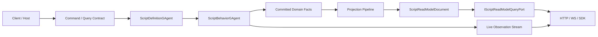
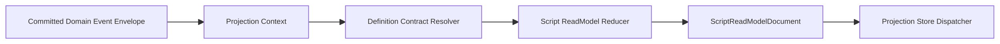

# Scripting GAgent 行为等价重构蓝图（历史基线，2026-03-13）

## 1. 文档元信息

- 状态：Superseded
- 版本：R1
- 日期：2026-03-13
- 适用范围：
  - `src/Aevatar.Scripting.Abstractions`
  - `src/Aevatar.Scripting.Core`
  - `src/Aevatar.Scripting.Application`
  - `src/Aevatar.Scripting.Infrastructure`
  - `src/Aevatar.Scripting.Projection`
  - `src/Aevatar.Scripting.Hosting`
  - `test/Aevatar.Scripting.*`
  - `test/Aevatar.Integration.Tests`
- 关联文档：
  - `docs/SCRIPTING_ARCHITECTURE.md`
  - `docs/architecture/2026-03-09-cqrs-command-actor-receipt-projection-blueprint.md`
  - `docs/architecture/2026-03-12-gagent-protocol-third-phase-scripting-query-observation-task-list.md`
- 文档定位：
  - 本文描述 `scripting` 从“动态脚本宿主能力”重构到“与静态 `GAgent` 行为等价”的目标态。
  - 本文默认不保留兼容层，不为历史 bag / 临时接口 / 双轨链路背书。
  - 本文允许继续保留 wrapper 形态，但 wrapper 不得再弱化静态 `GAgent` 已有能力。
  - 自 `2026-03-14` 起，本文已被 `docs/architecture/2026-03-14-scripting-gagent-behavior-parity-implementation-closeout.md` 与 `docs/architecture/2026-03-14-scripting-typed-authoring-surface-detailed-design.md` 取代，不再作为当前实现依据。
  - 本文仅保留为差距基线与设计留痕，帮助理解“旧主链为什么被删除”。

## 2. 背景与关键决策（统一认知）

当前 `scripting` 的问题，不是“有没有 wrapper”，而是“wrapper 之后的能力面低于静态 `GAgent`”。

仓库里的静态 `GAgent` 已经具备以下一等能力：

1. 稳定 actor 身份与 activation/replay 语义。
2. 基于 `PersistDomainEventAsync(...)` 的权威写侧事实提交。
3. 标准 `publish / send` 消息投递能力。
4. durable self-timeout / self continuation。
5. 统一 projection pipeline 与 read model 更新。
6. 由应用层或 projection 端口暴露的正式 query 契约。

而当前 `scripting` 只做到：

1. 脚本在宿主 actor 内执行。
2. 脚本可以发布/发送消息。
3. 脚本可以通过 `ReduceReadModelAsync(...)` 产出读模型 payload。
4. projection 可以把 payload 落到统一容器 read model。

但它仍然缺少静态 `GAgent` 的关键一等能力：

1. 没有正式的 scripting read-model query facade。
2. committed event 仍然携带 `state_payloads / read_model_payloads` 这类快照式 bag。
3. read model 仍是容器型 `Dictionary<string, Any>`，不是单一权威 typed root。
4. 脚本运行时能力未覆盖 self-signal / durable timeout / declared query 等能力。
5. projection 依赖“写侧已算好的 read model payload”，而不是像静态 `GAgent` 一样消费 committed facts 自己做读侧归约。

本轮重构的关键决策如下：

1. **目标是行为等价，不是外形等价。**
2. **wrapper 可以保留，但它必须只承担宿主职责，不得继续承担能力降级。**
3. **scripting 不再维护第二套弱化的 actor/read-model 体系。**
4. **读写分离必须恢复到与静态 `GAgent` 同一语义：write 产出 committed facts，projection 基于 committed facts 构建 read model。**
5. **不保留 `StatePayloads / ReadModelPayloads / 未声明 bag read model` 等历史设计。**
6. **query 必须成为一等能力，不能只靠直接读 projection store 兜底。**

## 3. 重构目标

本次重构要实现的不是“脚本看起来像静态 `GAgent`”，而是“脚本 actor 对系统其余部分表现得像静态 `GAgent`”。

目标如下：

1. scripting actor 具备与静态 `GAgent` 行为等价的 write-side 能力。
2. scripting actor 具备与静态 `GAgent` 行为等价的 read-side 能力。
3. scripting actor 具备正式 query contract，而不是仅提供 store 直读。
4. scripting actor 的 committed facts、projection、read model、query 进入与静态 `GAgent` 同一治理口径。
5. scripting 保留动态 source/definition/evolution 优势，但不再为此牺牲 actor/read-model 正交能力。

## 4. 范围与非范围

### 4.1 范围

1. scripting 写侧契约重构。
2. scripting read model 契约重构。
3. scripting projection 主链重构。
4. scripting query 主链重构。
5. scripting runtime capability surface 扩充。
6. scripting definition contract 与 descriptor 契约重构。
7. 测试、门禁、文档同步。

### 4.2 非范围

1. 不要求把 scripting 直接编译成仓库内静态 C# 类。
2. 不要求取消 source-driven / evolution-driven 脚本更新能力。
3. 不要求把 Host 对外 JSON 协议改为 protobuf-only。
4. 不为旧 `IScriptPackageRuntime` / `ScriptHandlerResult` / `ScriptExecutionReadModel` 保留兼容桥接。

## 5. 架构硬约束（必须满足）

1. scripting write-side 必须继续基于 actor + event sourcing，不得回退为 process-local runner。
2. scripting committed facts 必须只表达 committed domain facts，不得再携带读侧快照。
3. scripting read model 必须由 projection 消费 committed facts 构建，不得依赖 write-side 直接塞 read-model snapshot。
4. scripting query 必须走 read-side port，不得回退到直接 query runtime actor state。
5. scripting state 与 read model 必须是“单一根对象 + 明确 type url / descriptor contract”，不得继续使用匿名 `Dictionary<string, Any>` 作为主模型。
6. scripting runtime ability surface 至少覆盖静态 `GAgent` 已有的 publish/send/self-signal/durable-timeout/read-model-query 行为等价能力。
7. scripting 与 workflow、CQRS Core、Projection Core 继续共享同一条 envelope / projection 主链，不得引入第二套 read-side pipeline。
8. 行为稳定的语义必须进入 proto contract 或 descriptor contract，不得隐藏在字符串 key bag 中。

## 6. 当前基线（代码事实）

### 6.1 当前 scripting 采用“脚本运行时 + 外层宿主 actor”模型

1. 写侧宿主是 `ScriptRuntimeGAgent`，负责 definition query、timeout、commit、replay 恢复。
2. 定义侧宿主是 `ScriptDefinitionGAgent`，负责编译、schema 提取、定义查询响应。
3. 脚本本体只需要实现 `IScriptPackageRuntime`。

代码证据：

1. `src/Aevatar.Scripting.Core/ScriptRuntimeGAgent.cs`
2. `src/Aevatar.Scripting.Core/ScriptDefinitionGAgent.cs`
3. `src/Aevatar.Scripting.Abstractions/Definitions/IScriptPackageRuntime.cs`

### 6.2 当前静态 `GAgent` 基础能力明显强于 scripting 暴露面

`GAgentBase` / `GAgentBase<TState>` 已提供：

1. `publish / send`
2. durable self timeout
3. activation/deactivation hooks
4. event-sourced state + committed fact publication

代码证据：

1. `src/Aevatar.Foundation.Core/GAgentBase.cs`
2. `src/Aevatar.Foundation.Core/GAgentBase.TState.cs`

### 6.3 当前 scripting 的能力接口不完整

当前 `IScriptRuntimeCapabilities` 聚合的是：

1. `AskAIAsync`
2. `PublishAsync`
3. `SendToAsync`
4. `Create/Destroy/Link/Unlink`
5. evolution / promotion / rollback

它没有正式暴露：

1. self publish / self signal
2. durable timeout
3. declared query/read-model read contract
4. projection observation contract

代码证据：

1. `src/Aevatar.Scripting.Abstractions/Definitions/IScriptRuntimeCapabilities.cs`
2. `src/Aevatar.Scripting.Abstractions/Definitions/IScriptInteractionCapabilities.cs`
3. `src/Aevatar.Scripting.Abstractions/Definitions/IScriptAgentLifecycleCapabilities.cs`
4. `src/Aevatar.Scripting.Abstractions/Definitions/IScriptEvolutionCapabilities.cs`

### 6.4 当前 committed event 仍携带读写快照 bag

`ScriptRuntimeExecutionOrchestrator` 在执行脚本后，会把：

1. `StatePayloads`
2. `ReadModelPayloads`
3. `ReadModelSchemaVersion`
4. `ReadModelSchemaHash`

一并写进 `ScriptRunDomainEventCommitted`。

代码证据：

1. `src/Aevatar.Scripting.Application/Runtime/ScriptRuntimeExecutionOrchestrator.cs`
2. `src/Aevatar.Scripting.Abstractions/script_host_messages.proto`

### 6.5 当前 projection 只是复制 read-model payload

`ScriptExecutionReadModelProjector` + `ScriptRunDomainEventCommittedReducer` 的主要职责是：

1. 读取 committed event
2. 把 `ReadModelPayloads` 复制到 `ScriptExecutionReadModel`

这不是静态 `GAgent` 的读写分离语义。

代码证据：

1. `src/Aevatar.Scripting.Projection/Projectors/ScriptExecutionReadModelProjector.cs`
2. `src/Aevatar.Scripting.Projection/Reducers/ScriptRunDomainEventCommittedReducer.cs`
3. `src/Aevatar.Scripting.Projection/ReadModels/ScriptExecutionReadModel.cs`

### 6.6 当前 execution read model 没有正式 query facade

当前 Host 暴露的 scripting API 主要是演化 proposal 入口，没有 execution read model 对应的正式 query port / capability endpoint。

代码证据：

1. `src/Aevatar.Scripting.Hosting/CapabilityApi/ScriptCapabilityEndpoints.cs`

## 7. 需求分解与状态矩阵

| ID | 需求 | 验收标准 | 当前状态 | 证据 | 差距 |
|---|---|---|---|---|---|
| R1 | write-side actor 行为等价 | 脚本 actor 具备 publish/send/self-signal/durable-timeout/activation/replay 语义 | 部分满足 | `ScriptRuntimeGAgent`、`GAgentBase` | 缺 self-signal 与 timeout contract 暴露 |
| R2 | committed facts 纯净化 | committed event 不再携带 state/read-model snapshot | 未满足 | `ScriptRuntimeExecutionOrchestrator` | 仍然写入 `StatePayloads/ReadModelPayloads` |
| R3 | typed state root | state 为单一 root message，不再是 bag | 未满足 | `ScriptRuntimeState` | 仍然使用 `map<string, Any>` |
| R4 | typed read-model root | read model 为单一 root message，不再是 bag | 未满足 | `ScriptExecutionReadModel` | 仍然使用 `Dictionary<string, Any>` |
| R5 | projection 自主归约 | projection 基于 committed facts 调用 reducer 构建 read model | 未满足 | `ScriptRunDomainEventCommittedReducer` | 目前主要复制 read-model payload |
| R6 | query 一等化 | 具备 scripting read-model query port 与 host endpoint | 未满足 | `ScriptCapabilityEndpoints` | 当前无 execution query facade |
| R7 | contract 一等化 | script package 声明 command/event/state/readmodel/query contract | 部分满足 | `ScriptContractManifest` | 当前只覆盖 schema，缺 query/timeout/signal contract |
| R8 | 运行时能力补齐 | 能力面达到静态 `GAgent` 行为等价 | 未满足 | `IScriptRuntimeCapabilities` | 缺 self/timer/query/observe |
| R9 | 单一主链 | scripting 读写/query/observe 不再是“脚本特例” | 部分满足 | `Projection Core` 复用已有 | query 与 readmodel 仍是特例 |
| R10 | 删除兼容层 | 删除旧 bag / snapshot / direct-store-read 方案 | 未满足 | 当前实现 | 仍在主链 |

## 8. 差距详解

### 8.1 当前 scripting 的弱点不在 wrapper，而在 contract

wrapper 本身不是问题。问题在于 wrapper 只把脚本提升到“可运行”，没有把脚本提升到“像 `GAgent` 一样可治理”。

表现为：

1. runtime 只暴露了一部分 actor 能力。
2. read model 没有正式 query surface。
3. projection 没有像普通 read-side 一样基于 committed facts 独立归约。

### 8.2 当前读写分离被 bag snapshot 稀释

现在 `ScriptRunDomainEventCommitted` 既像 committed fact，又像 state snapshot，又像 read-model snapshot carrier。  
这会导致：

1. committed event 语义不诚实。
2. projection 变成“复制器”，不是 reducer。
3. read-side 与 write-side 无法独立演化。

### 8.3 当前 typed schema 只停留在 definition 层

当前 `ReadModelDefinition`、`SchemaHash`、`SchemaVersion` 已经存在，但只停留在：

1. definition 提取
2. schema activation validation
3. metadata 附带

没有真正落实为：

1. read-side root contract
2. read-side query contract
3. projector/reducer contract

### 8.4 当前 execution read model 不是正式产品契约

`ScriptExecutionReadModel` 目前更像“调试性容器”，不是一个可长期依赖的正式业务读模型。  
如果要与静态 `GAgent` 行为等价，它必须升级为：

1. 正式 read-side root
2. 正式 query 输入
3. 正式 query 输出
4. 正式 projection lifecycle owner

## 9. 目标架构

### 9.1 一句话目标态

目标态的 `scripting` 是：

1. `definition-driven`
2. `actor-hosted`
3. `fact-driven projection`
4. `typed read-model root`
5. `query-first`

而不是：

1. `source-driven runner`
2. `snapshot-driven projection`
3. `bag-based read model`

### 9.2 目标主链

关键变化：

1. write-side 只提交 committed domain facts。
2. projection 自己根据 definition contract 构建 read model。
3. query 只读 read-side，不直接读 runtime actor state。

### 9.3 目标角色划分

#### 9.3.1 `ScriptDefinitionGAgent`

职责：

1. 存储 script revision source。
2. 编译与校验 script package。
3. 存储 descriptor contract bundle。
4. 对外提供 definition snapshot。
5. 不承担运行态 read-model/query 语义。

#### 9.3.2 `ScriptBehaviorGAgent`

职责：

1. 作为脚本运行时的正式 actor 宿主。
2. 拥有单一 write-side root state。
3. 处理 command / internal signal / timeout signal。
4. 只提交 committed domain facts。
5. 不再直接塞 read-model snapshot。

说明：

1. 该类型可以继续是 wrapper。
2. 但其行为能力面必须达到静态 `GAgent` 等价。
3. 旧 `ScriptRuntimeGAgent` 直接删除并由该新语义替代。

#### 9.3.3 `ScriptReadModelProjector`

职责：

1. 消费 committed domain facts。
2. 解析 definition contract。
3. 调用 script package 的 read-side reducer。
4. 写入正式 read-model document。

说明：

1. projector 不再复制写侧产出的 read-model snapshot。
2. projector 必须像普通 read-side 一样独立建模。

#### 9.3.4 `IScriptReadModelQueryPort`

职责：

1. 暴露 execution read model 正式查询口。
2. 统一 query/read consistency 语义。
3. 提供 host / SDK 可用的 query facade。

### 9.4 目标 contract 设计

### 9.4.1 新的脚本包接口

删除 `IScriptPackageRuntime`，替换为单一主接口：

`IScriptGAgentBehavior`

建议职责：

1. `Contract`
   返回完整行为契约。
2. `DispatchAsync(...)`
   处理 command / internal signal / timeout。
3. `ApplyDomainEventAsync(...)`
   对 write-side state 做事件归约。
4. `ReduceReadModelAsync(...)`
   对 read-side root 做事件归约。
5. `ExecuteQueryAsync(...)`
   对声明过的 query 在 read-side 上执行查询。

### 9.4.2 新的行为契约

新增 `ScriptGAgentContract`，至少必须声明：

1. `state_type_url`
2. `read_model_type_url`
3. `command_type_urls`
4. `domain_event_type_urls`
5. `query_type_urls`
6. `query_result_type_urls`
7. `internal_signal_type_urls`
8. `supported_timer_kinds`
9. `descriptor_set`
10. `projection_store_kinds`

说明：

1. 这里的“typed”以 protobuf descriptor contract 为准。
2. Host 不要求仓库编译期知道具体 C# 类型。
3. 但 runtime/projection/query 必须知道稳定 type url 与 descriptor。

### 9.4.3 写侧 state root

删除：

1. `ScriptRuntimeState.state_payloads`
2. `ScriptRuntimeState.read_model_payloads`

改为：

1. `google.protobuf.Any state_root`
2. `string state_type_url`
3. `string definition_actor_id`
4. `string revision`
5. `string last_run_id`
6. `string last_event_id`

原则：

1. write-side 只持有 write-side state。
2. read model 不再缓存为 write-side bag。
3. 若确有 projection assist metadata，必须显式命名，不得继续混入 read-model payload。

### 9.4.4 读侧 read-model root

删除：

1. `ScriptExecutionReadModel`
2. 其中的 `ReadModelPayloads`

替换为：

`ScriptReadModelDocument`

建议字段：

1. `Id`
2. `RootActorId`
3. `DefinitionActorId`
4. `Revision`
5. `ReadModelTypeUrl`
6. `ReadModelPayload`
7. `StateVersion`
8. `LastEventId`
9. `UpdatedAt`

说明：

1. `ReadModelPayload` 是单一 root protobuf message。
2. 不允许再存 `Dictionary<string, Any>` 作为主模型。

### 9.5 committed fact 设计

删除 `ScriptRunDomainEventCommitted` 中的：

1. `state_payloads`
2. `read_model_payloads`
3. `read_model_schema_version`
4. `read_model_schema_hash`

新 committed fact 只保留：

1. actor identity
2. revision identity
3. run / command / correlation metadata
4. committed domain event payload
5. event sequencing metadata

目标语义：

1. 这是 committed domain fact。
2. 不是 write-side snapshot。
3. 不是 read-side snapshot。

### 9.6 projection 设计

新 projection 主链如下：

实现要求：

1. projection activation 时绑定 definition actor id + revision。
2. projection 上下文要能解析 descriptor contract。
3. reducer 使用 read-side current root + domain fact 得到 next root。
4. store dispatcher 写入正式 read-model document。

### 9.7 query 设计

新增一条单一权威 query 主链：

1. `IScriptReadModelQueryPort`
2. `ScriptReadModelQueryService`
3. `ScriptReadModelQueryReader`
4. `ScriptCapabilityQueryEndpoints`

至少支持：

1. `GetSnapshotAsync(actorId)`
2. `ExecuteDeclaredQueryAsync(actorId, queryTypeUrl, queryPayload)`
3. `ListSnapshotsAsync(take)`

query contract 要求：

1. 只能查询 committed/read-side 结果。
2. 不能向 runtime actor 读取内部 state。
3. query result 也必须有稳定 type url。

### 9.8 runtime capability parity 设计

`IScriptRuntimeCapabilities` 扩展为至少包含：

1. `PublishAsync`
2. `SendToAsync`
3. `PublishToSelfAsync`
4. `ScheduleSelfDurableSignalAsync`
5. `Create/Destroy/Link/Unlink`
6. `AskAIAsync`
7. `GetReadModelSnapshotAsync`
8. `ExecuteReadModelQueryAsync`
9. `Propose/Promote/Rollback Evolution`

说明：

1. `read model query` 是读侧能力，不是写侧状态读取。
2. `PublishToSelfAsync` 与 `ScheduleSelfDurableSignalAsync` 是行为等价所必需。

### 9.9 运行时加载策略

当前 `ScriptRuntimeLoader` 使用 collectible `AssemblyLoadContext`，适合动态执行，但不适合让 projection/query 每次从零编译。

目标态要求：

1. definition revision 对应稳定的 compiled package cache。
2. write-side、projection-side、query-side 共享同一 revision artifact。
3. 缓存键必须至少包含 `definitionActorId + revision + sourceHash`。

不要求：

1. 把脚本变成仓库静态程序集。
2. 把脚本 actor type 直接注册为 runtime 原生 C# actor type。

## 10. 重构工作包（WBS）

### W1. Contract 主模型重构

- 目标：用单一行为契约替换当前零散脚本运行接口。
- 范围：`Abstractions / script_host_messages.proto / contract types`
- 产物：
  - `IScriptGAgentBehavior`
  - `ScriptGAgentContract`
  - 新 proto 契约
- DoD：
  - state/readmodel/query/signal/timer contract 全部可声明
  - 旧 `IScriptPackageRuntime` 删除

### W2. Write-side actor 重构

- 目标：把 `ScriptRuntimeGAgent` 重构为行为等价宿主 actor。
- 范围：`Core / Application`
- 产物：
  - `ScriptBehaviorGAgent`
  - 新 write-side state model
  - 纯 committed fact 提交流程
- DoD：
  - 不再把 state/read-model snapshot 写进 committed event
  - 支持 self-signal / durable timeout

### W3. Projection 主链重构

- 目标：让 projection 基于 committed facts 自主构建 read model。
- 范围：`Projection`
- 产物：
  - `ScriptReadModelProjector`
  - `ScriptReadModelDocument`
  - 新 projection context
- DoD：
  - projection 不再复制 write-side read-model payload
  - read-side root 为单一 typed payload

### W4. Query 主链重构

- 目标：让 scripting 拥有正式 query facade。
- 范围：`Application / Infrastructure / Hosting`
- 产物：
  - `IScriptReadModelQueryPort`
  - `ScriptReadModelQueryService`
  - query endpoints
- DoD：
  - execution read model 可通过正式 API 查询
  - 不再依赖 direct store read 作为主契约

### W5. Runtime capability parity

- 目标：补齐静态 `GAgent` 行为等价能力。
- 范围：`Abstractions / Core / Application`
- 产物：
  - self publish
  - durable timeout signal
  - read-model query capability
- DoD：
  - script package 能表达静态 `GAgent` 常用行为

### W6. Definition / artifact cache 重构

- 目标：让 definition revision 成为 write/projection/query 共用 artifact 源。
- 范围：`Definition / Infrastructure`
- 产物：
  - compiled package cache
  - definition snapshot contract 扩展
- DoD：
  - 同 revision artifact 可被多条链共享

### W7. 删除旧链路

- 目标：清除 bag/snapshot/临时兼容层。
- 范围：全链路
- 产物：
  - 删除旧接口和旧 read model
  - 删除旧 committed event snapshot 字段
- DoD：
  - 仓库中不再保留旧主链使用点

## 11. 里程碑与依赖

### M1. Contract Freeze

完成项：

1. 新行为契约定稿。
2. proto contract 定稿。
3. 删除旧接口设计。

依赖：

1. 无。

### M2. Write-side Pure Facts

完成项：

1. 新宿主 actor 落地。
2. 纯 committed facts 路径跑通。
3. self-signal / timer 路径跑通。

依赖：

1. M1。

### M3. Projection/ReadModel First-class

完成项：

1. 新 projector 落地。
2. typed read-model root 落地。
3. execution read model 正式可查。

依赖：

1. M2。

### M4. Delete Legacy

完成项：

1. 旧 bag / snapshot 链路删除。
2. 测试和门禁清理。
3. 文档与样例同步。

依赖：

1. M3。

## 12. 验证矩阵（需求 -> 命令 -> 通过标准）

| 需求 | 验证命令 | 通过标准 |
|---|---|---|
| contract 编译通过 | `dotnet build aevatar.slnx --nologo` | 全量编译通过 |
| scripting core 行为 | `dotnet test test/Aevatar.Scripting.Core.Tests/Aevatar.Scripting.Core.Tests.csproj --nologo` | 单测全部通过 |
| scripting hosting/query | `dotnet test test/Aevatar.Hosting.Tests/Aevatar.Hosting.Tests.csproj --nologo --filter "FullyQualifiedName~Script"` | hosting/query 用例通过 |
| integration parity | `dotnet test test/Aevatar.Integration.Tests/Aevatar.Integration.Tests.csproj --nologo --filter "FullyQualifiedName~Script|FullyQualifiedName~Claim"` | scripting 集成用例通过 |
| 架构规则 | `bash tools/ci/architecture_guards.sh` | 架构门禁通过 |
| 测试稳定性 | `bash tools/ci/test_stability_guards.sh` | 无轮询违规 |

重构后必须新增的测试类别：

1. `ScriptBehaviorGAgent` self-signal / timeout 语义测试。
2. `ScriptReadModelProjector` 基于 committed fact 的 reducer 测试。
3. `ScriptReadModelQueryService` query 契约测试。
4. definition artifact cache 一致性测试。
5. read-side 不读取 runtime actor state 的边界测试。

## 13. 完成定义（Final DoD）

以下条件全部成立时，本重构才算完成：

1. scripting 行为能力面达到静态 `GAgent` 等价。
2. committed fact 不再携带 state/read-model snapshot。
3. read model 为单一 typed root，不再是 bag。
4. execution read model 具备正式 query port。
5. projection 基于 committed facts 自主构建 read model。
6. 脚本定义可声明 state/readmodel/query/signal/timer contract。
7. 旧 `IScriptPackageRuntime`、旧 `ScriptExecutionReadModel`、旧 payload bag 主链全部删除。
8. 文档、测试、门禁同步完成。

## 14. 风险与应对

### 风险 1：descriptor contract 设计不完整

- 后果：写侧、projection、query 三条链的 contract 不一致。
- 应对：先冻结 `ScriptGAgentContract`，再进入实现。

### 风险 2：projection 需要重复加载脚本 artifact

- 后果：性能抖动、行为不一致。
- 应对：引入 revision-scoped compiled package cache。

### 风险 3：query 被偷渡回 write-side state

- 后果：破坏读写分离。
- 应对：提供正式 `IScriptReadModelQueryPort`，并加架构守卫扫描。

### 风险 4：删除旧 bag 链路后测试大面积失效

- 后果：实施成本高。
- 应对：按 `Contract -> Write -> Projection -> Query -> Delete` 顺序推进，避免乱序迁移。

## 15. 执行清单（可勾选）

- [ ] 冻结新的 scripting 行为契约与 proto 契约。
- [ ] 引入 `ScriptBehaviorGAgent`，替换旧 `ScriptRuntimeGAgent` 语义。
- [ ] 删除 committed event 中的 state/read-model snapshot 字段。
- [ ] 重构 write-side state 为单一 typed root。
- [ ] 引入 `ScriptReadModelDocument` 并删除旧容器 read model。
- [ ] 重构 projector 为 committed-fact reducer 模式。
- [ ] 新增 `IScriptReadModelQueryPort` 与 host query endpoint。
- [ ] 扩展 runtime capability surface，补齐 self/timer/query 行为。
- [ ] 引入 revision artifact cache。
- [ ] 删除旧 `IScriptPackageRuntime`、旧 payload bag、旧 readmodel copy path。
- [ ] 补齐测试、门禁、文档。

## 16. 当前执行快照（2026-03-13）

- 已确认：
  - 当前 `scripting` 是“宿主 actor + 脚本运行时”模型。
  - 当前 read model 仍是 bag 容器。
  - 当前 execution read model 没有正式 query facade。
  - 当前 committed event 仍然混合 committed fact 与 snapshot 语义。
- 当前结论：
  - wrapper 可保留。
  - 但必须把能力抬升到静态 `GAgent` 行为等价。
  - 真正需要删除的是 bag/snapshot/弱 query 设计，而不是 wrapper 本身。
- 当前状态：
  - 文档阶段，尚未实施。

## 17. 变更纪律

1. 不为旧 bag 设计保留兼容层。
2. 不允许继续在 scripting 主链新增 `Dictionary<string, Any>` 风格的核心状态/读模型。
3. 不允许通过 query runtime actor state 代替 read-side query。
4. 新增 contract 必须先有 proto / descriptor 设计，再落实现。
5. 每完成一个工作包，必须同步更新本文档的状态矩阵、执行清单与执行快照。
