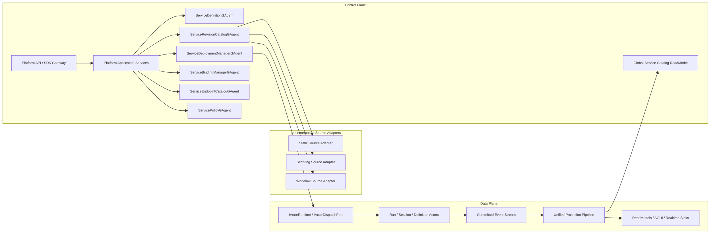
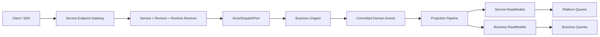
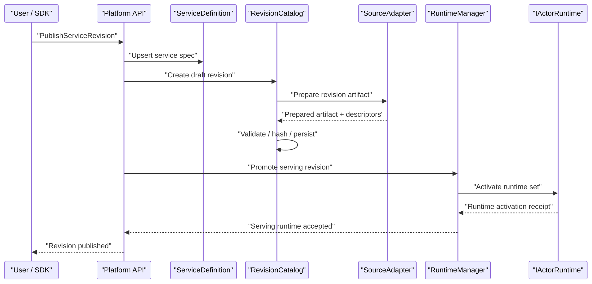

# GAgent as a Service 平台架构蓝图（2026-03-14）

## 1. 文档元信息

- 状态：Superseded
- 版本：R1
- 日期：2026-03-14
- 适用范围：
  - `src/Aevatar.Foundation.*`
  - `src/Aevatar.CQRS.*`
  - `src/Aevatar.Scripting.*`
  - `src/workflow/*`
  - `src/Aevatar.Hosting`
- 关联文档：
  - `AGENTS.md`
  - `docs/FOUNDATION.md`
  - `docs/CQRS_ARCHITECTURE.md`
  - `docs/SCRIPTING_ARCHITECTURE.md`
  - `docs/architecture/2026-03-14-gagent-service-phase-1-mvp-blueprint.md`
  - `docs/architecture/2026-03-14-gagent-service-phase-2-binding-policy-blueprint.md`
  - `docs/architecture/2026-03-11-gagent-centric-cqrs-capability-unification-blueprint.md`
  - `docs/architecture/2026-03-13-gagent-platform-entry-and-composition-blueprint.md`
  - `docs/architecture/AEVATAR_MAINNET_ARCHITECTURE.md`
  - `src/Aevatar.Hosting/AevatarCapabilityHostExtensions.cs`
  - `src/Aevatar.Scripting.Hosting/CapabilityApi/ScriptCapabilityHostBuilderExtensions.cs`
  - `src/workflow/Aevatar.Workflow.Infrastructure/CapabilityApi/WorkflowCapabilityHostBuilderExtensions.cs`
  - `src/workflow/extensions/Aevatar.Workflow.Extensions.Hosting/AevatarPlatformHostBuilderExtensions.cs`

## 2. 一句话结论

本文保留 `GAgentService` 平台最初的全量蓝图，仅作为历史基线。

当前实现已经有两点关键收敛，与本文原始设计不同：

1. Phase 2 治理面已收敛为单一 `ServiceConfigurationGAgent`，不再保留 `ServiceBindingManagerGAgent / ServiceEndpointCatalogGAgent / ServicePolicyGAgent` 三个长期 actor。
2. 平台查询面已拆成 `IServiceLifecycleQueryPort / IServiceServingQueryPort`，不再继续扩张 `IServiceQueryPort`。

以当前实现为准时，请优先阅读：

1. `docs/architecture/2026-03-14-gagent-service-phase-2-binding-policy-blueprint.md`
2. `docs/architecture/2026-03-15-gagent-service-slimming-refactor-blueprint.md`
3. `docs/architecture/2026-03-15-gagent-service-phase-3-serving-rollout-blueprint.md`

当前仓库已经具备：

1. 统一 actor substrate
2. 统一 CQRS / Projection 主链
3. 多种 GAgent 实现来源：`static / scripting / workflow`

但还没有具备：

1. 统一的 `GAgent Service` 资源模型
2. 统一的发布、发现、治理、运行控制面
3. tenant/app 级服务化治理面

因此下一阶段正确目标不是“继续增加新的 GAgent 来源”，而是把现有来源全部收敛到：

`GAgent as a Service Platform`

## 3. 当前状态与缺口

### 3.1 已经完成的部分

1. `GAgent` 已经是统一事实边界，运行时基座明确收敛到 `IActorRuntime / IActorDispatchPort / IEventPublisher`。
2. `CQRS` 与 `Projection` 已经形成统一命令、查询、投影主链。
3. `scripting` 与 `workflow` 已经都能作为 GAgent capability family 工作。
4. Host 层已经有 capability bundle 的组合入口。

### 3.2 还没有完成的部分

1. `workflow / scripting / static gagent` 仍然主要以 capability family 或实现来源的形式出现，不是统一服务资源。
2. 发布入口仍然按 family 分叉，例如 `AddScriptCapability(...)`、`AddWorkflowCapability(...)`。
3. definition、revision、runtime、binding、endpoint、policy 还没有成为统一的一组平台对象。
4. catalog / registry 仍然按 family 分散，而不是平台级 service catalog。
5. tenant / app / quota / rate limit / secret / connector policy 还没有进入统一控制面。

### 3.3 差距的本质

当前系统更接近：

`GAgent Runtime + Capability Families + Multiple Authoring Sources`

目标系统应当是：

`Source-Agnostic GAgent Service Platform`

## 4. 目标定义

### 4.1 GAgent Service 的定义

`GAgent Service` 不是一个普通 HTTP 服务，也不是把 actor 包成 RPC。

它必须同时满足：

1. 可发布：有稳定 `service` 身份和 revision 生命周期。
2. 可发现：可被平台 catalog 查询、检索、绑定。
3. 可治理：受 tenant、policy、quota、connector/secret 约束。
4. 可运行：能启动或复用 runtime actor 集合。
5. 可观察：能通过 committed event、projection、read model 暴露事实。
6. 可演进：revision 能前滚、灰度、退役；运行中的 actor 默认前滚新建，不原地热替换。

### 4.2 明确不做的事

1. 不引入第二套消息协议体系。
2. 不引入第二套 read-side pipeline。
3. 不让平台控制面直接侵入 actor 内部状态机。
4. 不把 `workflow / scripting / static` 暴露为外部控制面的主对象。
5. 不保留长期双轨兼容层。

## 5. 北极星原则

1. `GAgent Service` 是控制面主对象，`workflow / scripting / static` 只是实现来源。
2. 控制面与数据面分离：控制面负责发布、治理、运行态编排；数据面负责消息投递、事件提交、投影与查询。
3. 平台只承认强类型协议：service、revision、binding、endpoint、policy 统一使用 protobuf 契约。
4. actor 语义不被抹平：命令仍然进入 actor inbox，完成态仍然通过 committed event 和 projection 暴露。
5. 对外 API source-agnostic，对内通过 source adapter 吸收差异。
6. 长生命周期 actor 只承担权威事实：service definition、revision catalog、runtime manager、binding manager、policy manager。
7. run/session actor 继续承担具体执行，不回退到 process-local orchestration。

### 5.1 命名决议

1. 平台 bounded context 与项目名统一使用单数：`GAgentService`。
2. 对外资源模型统一使用 `Service*` 语义，而不是 `GAgent*` 语义。
3. `GAgent` 只保留在 actor/runtime 实现层，用于表达“底层仍由 actor 承载”。
4. 禁止使用复数项目名，例如 `GAgentServices` 或 `AgentServices`。

## 6. 统一资源模型

### 6.1 核心对象

| 对象 | 语义 | 权威事实源 | 生命周期 |
|---|---|---|---|
| `ServiceDefinition` | 一个可发布、可绑定、可治理的服务身份 | `ServiceDefinitionGAgent` | 长期 |
| `ServiceRevision` | 某个 service 的一个可运行版本 | `ServiceRevisionCatalogGAgent` | 长期 |
| `PreparedServiceRevisionArtifact` | 某个 revision 经过 adapter 规范化后的统一产物 | `ServiceRevisionCatalogGAgent` + Artifact Store | 长期 |
| `ServiceDeployment` | 某个 revision 的实际激活/部署实例集 | `ServiceDeploymentManagerGAgent` | 中长期 |
| `ServiceBinding` | service 对其他 service、connector、secret、policy 的依赖绑定 | `ServiceBindingManagerGAgent` | 长期 |
| `ServiceEndpoint` | 对外暴露的 command/query/stream 入口描述 | `ServiceEndpointCatalogGAgent` | 长期 |
| `ServicePolicy` | tenant/app/service 级的准入、配额、连接器、可观测性与安全策略 | `ServicePolicyGAgent` | 长期 |

### 6.2 资源关系

1. 一个 `Tenant/App/Namespace` 下拥有多个 `ServiceDefinition`。
2. 一个 `ServiceDefinition` 拥有多个 `ServiceRevision`。
3. 一个 `ServiceRevision` 只承载一种实现来源，并拥有一份 `PreparedServiceRevisionArtifact`。
4. 一个 `ServiceDefinition` 只能有一个默认 `ServingRevision`，但可以存在多个激活中的 `ServiceDeploymentSet`。
5. 一个 `ServiceDefinition` 拥有多条 `ServiceBinding`。
6. 一个 `ServiceDefinition` 对外发布多个 `ServiceEndpoint`。
7. 一个 `ServiceDefinition` 关联零个或多个 `ServicePolicy`。

### 6.3 统一标识

所有平台对象统一采用显式强类型标识，不允许字符串拼接约定扩散：

1. `tenant_id`
2. `app_id`
3. `namespace`
4. `service_id`
5. `revision_id`
6. `runtime_set_id`
7. `binding_id`
8. `endpoint_id`
9. `policy_id`

## 7. 总体架构图



## 8. 控制面设计

### 8.1 控制面职责边界

控制面负责：

1. 定义 service 身份
2. 管理 revision 发布
3. 解析并持久化 source artifact
4. 启动、扩缩、冻结 runtime
5. 管理 service bindings
6. 维护 endpoint catalog
7. 执行 tenant/app/service 级治理策略

控制面不负责：

1. 直接执行业务命令
2. 直接读写业务 actor 内部状态
3. 绕过 actor inbox 做 inline dispatch
4. 拼装临时 process-local session 作为事实源

### 8.2 长生命周期平台 Actors

#### `ServiceDefinitionGAgent`

职责：

1. 持有 service 的权威定义
2. 持有默认 serving revision 引用
3. 持有 namespace、owner、labels、display name
4. 处理 service 的创建、更新、删除、冻结、退役

#### `ServiceRevisionCatalogGAgent`

职责：

1. 维护 revision 历史
2. 维护 revision authoring spec 与 implementation kind
3. 维护 prepared artifact、descriptor set、schema hashes
4. 维护 revision 状态：`draft / prepared / validated / published / serving / retired / failed`
5. 提供 revision diff、compatibility check、promotion/rollback 基础信息

#### `ServiceDeploymentManagerGAgent`

职责：

1. 负责某个 service/revision 的 runtime set 生命周期
2. 维护 activation plan、placement policy、desired replicas、health summary
3. 维护 source-independent runtime identity
4. 向 `IActorRuntime` 发出真正的 runtime 启动/停用/扩缩请求

#### `ServiceBindingManagerGAgent`

职责：

1. 维护 service 到其他 service、connector、secret、policy 的绑定关系
2. 把 binding 转换成 activation-time capability view
3. 提供显式版本化和审计

#### `ServiceEndpointCatalogGAgent`

职责：

1. 维护 command/query/stream endpoint 的平台描述
2. 维护 endpoint 到 service revision 的发布关系
3. 维护 public/internal exposure policy

#### `ServicePolicyGAgent`

职责：

1. 维护 tenant/app/service 级 policy
2. 维护 quota、rate limit、connector allowlist、secret scope、observability sampling
3. 提供 admission/activation/query 前置校验

### 8.3 平台应用服务

应用层只做用例编排，不持有事实状态：

1. `ServiceCommandApplicationService`
2. `ServiceQueryApplicationService`
3. `ServiceRevisionPublishingApplicationService`
4. `ServiceDeploymentProvisioningApplicationService`
5. `ServiceBindingApplicationService`
6. `ServiceEndpointApplicationService`
7. `ServicePolicyApplicationService`

## 9. 数据面设计

### 9.1 数据面原则

1. 业务命令仍然进入 actor inbox。
2. actor 完成态仍然通过 committed event 暴露。
3. projection 仍然是统一单主干。
4. 平台 catalog 和业务 read model 都从 committed facts 构建，不走 query fallback 猜测。

### 9.2 运行态映射

平台只承认两类运行 actor：

1. 控制面长期 actor：service、revision、runtime、binding、endpoint、policy 管理者
2. 业务执行 actor：static / scripting / workflow 导出的 definition actor、runtime actor、run actor、session actor

### 9.3 数据面路径



### 9.4 Service Endpoint Gateway

这是新的外部统一入口，不再按 family 分叉。

职责：

1. 根据 `tenant/app/namespace/service/endpoint` 解析目标服务
2. 完成 auth、quota、rate limit、policy admission
3. 构造标准 command/query envelope
4. 交给 runtime resolver 和 dispatch port

禁止：

1. 按 `workflow/script/static` 分支投递逻辑
2. 在 gateway 内维护 service 到 actorId 的进程内事实缓存
3. 把业务完成态在 gateway 内部临时拼装

## 10. Source Adapter 设计

### 10.1 目标

平台对外不再暴露来源差异，但内部必须通过 adapter 吸收实现差异。

### 10.2 统一抽象

建议新增统一接口：

```csharp
public interface IServiceImplementationAdapter
{
    ServiceImplementationKind ImplementationKind { get; }

    Task<PreparedServiceRevisionArtifact> PrepareRevisionAsync(
        PrepareServiceRevisionRequest request,
        CancellationToken cancellationToken);

    Task<ServiceDeploymentPlan> BuildDeploymentPlanAsync(
        BuildServiceDeploymentPlanRequest request,
        CancellationToken cancellationToken);

    Task<ServiceEndpointDescriptorSet> DescribeEndpointsAsync(
        DescribeServiceEndpointsRequest request,
        CancellationToken cancellationToken);
}
```

约束：

1. 不在 adapter 接口里泄露 family-specific host API 语义。
2. `ServiceDefinition` 不进入 adapter；adapter 只处理 revision 和 artifact。
3. 只返回强类型 artifact / deployment / endpoint 描述。
4. artifact、descriptor、schema、runtime semantics 全部 protobuf-first。

### 10.3 三类来源如何映射

#### Static Source Adapter

输入：

1. 稳定 CLR 类型
2. 对应 protobuf protocol descriptors
3. 可选默认 bindings 与 endpoint descriptors

输出：

1. 原生 revision artifact
2. activation plan
3. service endpoint descriptors

#### Scripting Source Adapter

输入：

1. `C# + proto` script package
2. descriptor set
3. behavior assembly artifact

输出：

1. prepared revision artifact
2. typed runtime semantics
3. read model materialization plan
4. runtime activation plan

#### Workflow Source Adapter

输入：

1. workflow YAML
2. workflow protocol descriptors
3. compiled topology/module manifest

输出：

1. prepared revision artifact
2. run-actor activation plan
3. endpoint descriptors
4. query/read model contract descriptors

## 11. Protobuf-First 平台契约

### 11.1 新增平台 Proto

建议新增：

1. `service_definition.proto`
2. `service_revision.proto`
3. `service_deployment.proto`
4. `service_binding.proto`
5. `service_endpoint.proto`
6. `service_policy.proto`
7. `service_source_static.proto`
8. `service_source_scripting.proto`
9. `service_source_workflow.proto`

### 11.2 关键设计决议

1. service 层协议统一由 protobuf 描述。
2. `ServiceDefinitionSpec` 必须保持 source-agnostic，不包含实现来源细节。
3. source-specific 信息通过 `ServiceRevisionSpec.oneof implementation_spec` 表达，不使用 bag。
4. endpoint contract 必须显式区分 `command / query / stream / realtime`。
5. policy 必须显式区分 `admission / rate-limit / connector / secret / observability / placement`。
6. `PreparedServiceRevisionArtifact` 必须包含 descriptor set、artifact hash、schema hashes、runtime semantics hashes。

### 11.3 建议的 Service Proto 形态

```proto
message ServiceDefinitionSpec {
  string tenant_id = 1;
  string app_id = 2;
  string namespace = 3;
  string service_id = 4;
  string display_name = 5;

  repeated ServiceEndpointSpec endpoints = 20;
  repeated ServiceBindingSpec bindings = 21;
  repeated string policy_ids = 22;
}

message ServiceRevisionSpec {
  string service_id = 1;
  string revision_id = 2;
  ServiceImplementationKind implementation_kind = 3;

  oneof implementation_spec {
    StaticServiceRevisionSpec static_spec = 20;
    ScriptingServiceRevisionSpec scripting_spec = 21;
    WorkflowServiceRevisionSpec workflow_spec = 22;
  }
}

message PreparedServiceRevisionArtifact {
  string service_id = 1;
  string revision_id = 2;
  ServiceImplementationKind implementation_kind = 3;
  bytes normalized_artifact = 10;
  bytes descriptor_set = 11;
  repeated ServiceEndpointDescriptor endpoints = 12;
  ServiceDeploymentPlan deployment_plan = 13;
  string artifact_hash = 14;
}
```

## 12. 统一生命周期

### 12.1 Publish / Serve 生命周期



### 12.2 调用生命周期

1. client 调用统一 service endpoint。
2. gateway 解析 `tenant/app/namespace/service/endpoint`。
3. 平台读取 service、serving revision、runtime set、binding、policy。
4. gateway 构造标准 command/query envelope。
5. `IActorDispatchPort` 投递到目标 actor。
6. actor 提交 committed domain event。
7. projection 更新平台 read model 与业务 read model。
8. query 与 realtime 都只读 read-side。

## 13. 租户治理与平台能力

### 13.1 多租户维度

统一平台必须原生建模：

1. `tenant`
2. `app`
3. `namespace`
4. `service`
5. `endpoint`

### 13.2 必须进入统一治理面的能力

1. admission control
2. rate limiting
3. quota
4. concurrent runtime / inflight run limits
5. connector allowlist
6. secret binding scope
7. audit / trace / metrics sampling
8. rollout / freeze / retire policy

### 13.3 治理执行时机

1. 发布 revision 前
2. 切 serving revision 前
3. runtime activation 前
4. endpoint invoke 前
5. connector bind 前

## 14. 查询与 Catalog 设计

### 14.1 平台级 ReadModels

建议新增至少以下平台 read model：

1. `ServiceCatalogReadModel`
2. `ServiceRevisionCatalogReadModel`
3. `ServiceDeploymentStatusReadModel`
4. `ServiceBindingReadModel`
5. `ServiceEndpointCatalogReadModel`
6. `ServicePolicyReadModel`

### 14.2 平台查询面

平台 query 只查平台 read model，不直读控制面 actor 内部状态。

必须支持：

1. 按 tenant/app/namespace/service 检索
2. revision 列表与 serving revision 查询
3. runtime 健康、容量、placement 查询
4. binding 与 endpoint 查询
5. policy 生效视图查询

## 15. 对现有仓库的重构决议

### 15.1 新增项目

建议新增一组平台项目：

1. `src/platform/Aevatar.GAgentService.Abstractions`
2. `src/platform/Aevatar.GAgentService.Core`
3. `src/platform/Aevatar.GAgentService.Application`
4. `src/platform/Aevatar.GAgentService.Infrastructure`
5. `src/platform/Aevatar.GAgentService.Hosting`
6. `src/platform/Aevatar.GAgentService.StaticAdapter`
7. `src/platform/Aevatar.GAgentService.ScriptingAdapter`
8. `src/platform/Aevatar.GAgentService.WorkflowAdapter`
9. `test/Aevatar.GAgentService.Tests`
10. `test/Aevatar.GAgentService.Integration.Tests`

### 15.2 关键新增文件

建议新增：

1. `src/platform/Aevatar.GAgentService.Abstractions/Protos/service_definition.proto`
2. `src/platform/Aevatar.GAgentService.Abstractions/Protos/service_revision.proto`
3. `src/platform/Aevatar.GAgentService.Abstractions/Protos/service_deployment.proto`
4. `src/platform/Aevatar.GAgentService.Abstractions/Ports/IServiceCommandPort.cs`
5. `src/platform/Aevatar.GAgentService.Abstractions/Ports/IServiceQueryPort.cs`
6. `src/platform/Aevatar.GAgentService.Abstractions/Sources/IServiceImplementationAdapter.cs`
7. `src/platform/Aevatar.GAgentService.Core/GAgents/ServiceDefinitionGAgent.cs`
8. `src/platform/Aevatar.GAgentService.Core/GAgents/ServiceRevisionCatalogGAgent.cs`
9. `src/platform/Aevatar.GAgentService.Core/GAgents/ServiceDeploymentManagerGAgent.cs`
10. `src/platform/Aevatar.GAgentService.Core/GAgents/ServiceBindingManagerGAgent.cs`
11. `src/platform/Aevatar.GAgentService.Core/GAgents/ServiceEndpointCatalogGAgent.cs`
12. `src/platform/Aevatar.GAgentService.Core/GAgents/ServicePolicyGAgent.cs`
13. `src/platform/Aevatar.GAgentService.Application/Services/ServicePublishingApplicationService.cs`
14. `src/platform/Aevatar.GAgentService.Hosting/CapabilityApi/ServiceEndpoints.cs`
15. `src/platform/Aevatar.GAgentService.Hosting/DependencyInjection/ServiceCollectionExtensions.cs`

### 15.3 现有项目的角色调整

#### `Aevatar.Scripting.*`

调整为：

1. `scripting` 只负责 source adapter、runtime actor、definition/catalog/evolution 内部能力
2. 不再作为外部平台控制面的主入口
3. 对外暴露的 definition/provisioning/query API 收敛为平台 API 背后的内部实现

#### `workflow/*`

调整为：

1. `workflow` 只负责 workflow source adapter、workflow runtime、workflow-specific projection/query
2. workflow registry 不再是平台级 service registry
3. 对外 `chat` 与 workflow family API 收敛到平台 endpoint model 之下

#### `Aevatar.Hosting`

调整为：

1. 只保留平台根入口和通用 capability host 组合能力
2. family-specific bundle 不再是外部主入口

### 15.4 直接删除的旧外部入口

无需兼容时，建议直接删除或降为内部扩展的外部入口：

1. `src/Aevatar.Scripting.Hosting/CapabilityApi/ScriptCapabilityHostBuilderExtensions.cs`
2. `src/Aevatar.Scripting.Hosting/CapabilityApi/ScriptCapabilityEndpoints.cs`
3. `src/Aevatar.Scripting.Hosting/CapabilityApi/ScriptQueryEndpoints.cs`
4. `src/workflow/Aevatar.Workflow.Infrastructure/CapabilityApi/WorkflowCapabilityHostBuilderExtensions.cs`
5. `src/workflow/Aevatar.Workflow.Infrastructure/CapabilityApi/ChatEndpoints.cs`
6. `src/workflow/Aevatar.Workflow.Infrastructure/CapabilityApi/ChatQueryEndpoints.cs`
7. `src/workflow/extensions/Aevatar.Workflow.Extensions.Hosting/AevatarPlatformHostBuilderExtensions.cs`

这些文件的职责不应再作为平台主 API 存在，而应收敛为：

1. 内部 source adapter
2. 平台 endpoint mapper
3. 平台 bundle 依赖

## 16. 推荐实施顺序

### Phase 1：平台对象模型

1. 定义 protobuf-first 的 service/revision/runtime/binding/endpoint/policy proto
2. 建立平台 control-plane actors
3. 建立平台 catalog read models

### Phase 2：source adapter 收敛

1. 建立统一 `IServiceImplementationAdapter`
2. 接入 `static / scripting / workflow`
3. 让 revision publish 统一走 adapter

### Phase 3：统一平台 API

1. 建立统一 platform endpoints
2. 删除 family-specific 外部入口
3. 统一 SDK 和 service invocation model

### Phase 4：治理面

1. 接入 tenant/app/namespace
2. 接入 quota、rate limit、connector、secret、policy
3. 接入 admission、audit、observability

### Phase 5：主网化能力

1. rollout / rollback / freeze / retire
2. runtime health / scaling / placement
3. multi-runtime set / staged rollout

## 17. 完成态判定

以下条件全部满足，才能称为 `GAgent as a Service` 已落地：

1. 外部调用方不再直接面向 `workflow` 或 `scripting` family API。
2. `static / scripting / workflow` 都能通过同一 `service publish / serve / bind / invoke / observe` 模型工作。
3. 平台存在统一 service catalog、revision catalog、runtime status、binding、policy read model。
4. tenant/app/namespace/service 维度的治理策略进入统一控制面。
5. endpoint gateway 不依赖来源分支，只依赖平台对象模型和 actor dispatch 契约。
6. 业务完成态继续通过 committed event + projection 暴露，不回退到 control-plane query fallback。

## 18. 最终决议

下一阶段仓库不应再讨论“workflow 是否比 scripting 更像 GAgent 服务”。

正确问题应当变成：

1. 如何把 `workflow / scripting / static` 映射到统一 `GAgent Service` 资源模型
2. 如何建立 source-agnostic 的平台控制面
3. 如何在不破坏 actor/cqrs/projection 主链的前提下完成多租户治理

这份蓝图的核心决议只有一句话：

`GAgent` 的下一阶段不是再增加一种实现来源，而是成为平台的一等服务资源。
