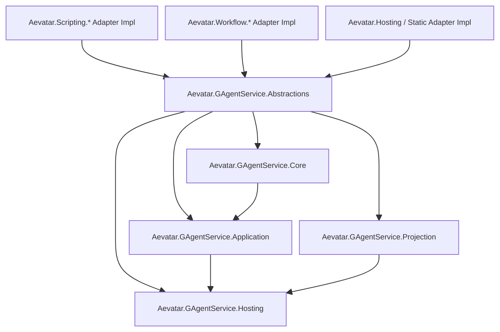
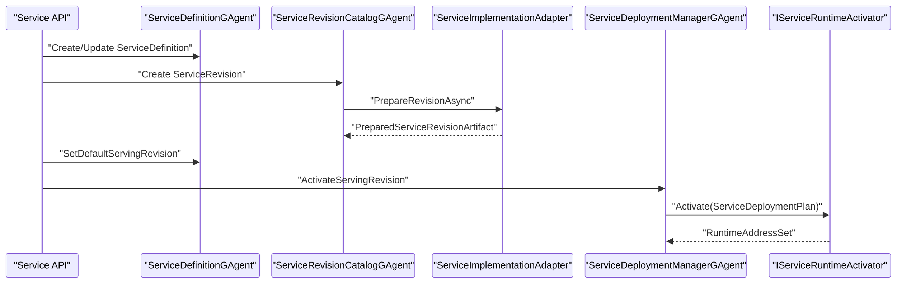
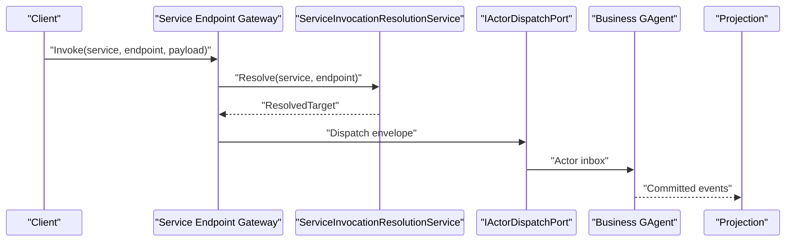

# GAgentService Phase 1 详细架构代码变更方案（2026-03-14）

## 1. 文档元信息

- 状态：Proposed
- 版本：R1
- 日期：2026-03-14
- 适用范围：
  - `src/Aevatar.Foundation.*`
  - `src/Aevatar.CQRS.*`
  - `src/Aevatar.Scripting.*`
  - `src/workflow/*`
  - `src/Aevatar.Hosting`
  - `src/platform/*`
- 关联文档：
  - `docs/FOUNDATION.md`
  - `docs/CQRS_ARCHITECTURE.md`
  - `docs/SCRIPTING_ARCHITECTURE.md`
  - `docs/architecture/2026-03-14-gagent-as-a-service-platform-blueprint.md`
  - `docs/architecture/2026-03-14-gagent-service-phase-1-mvp-blueprint.md`
  - `docs/architecture/2026-03-14-gagent-service-phase-2-binding-policy-blueprint.md`
- 本文定位：
  - 本文只讨论 `GAgentService Phase 1 MVP` 的详细代码级落地方案。
  - 本文默认以目标态为准，不以兼容层为目标；若实现过程中存在短暂双写或共存，只允许作为分支内临时过渡。

## 2. 问题定义

当前仓库已经具备：

1. `GAgent` 统一事实边界
2. `CQRS` 统一命令/查询主链
3. `Projection` 统一 read-side 主链
4. `static / scripting / workflow` 三种实现来源

但缺少以下平台级能力：

1. 统一 `ServiceDefinition`
2. 统一 `ServiceRevision`
3. 统一 `PreparedServiceRevisionArtifact`
4. 统一 `ServiceDeployment`
5. 统一 `Service Endpoint Gateway`

这意味着：

1. 现有 capability family 可以运行，但还不能作为统一 service 发布。
2. 外部入口仍然先按 family 分支，而不是先按 service 资源模型分发。
3. `static / scripting / workflow` 还没有收敛到一套 source-agnostic control plane。

## 3. 设计目标与非目标

### 3.1 Phase 1 目标

1. 新增 `GAgentService` bounded context。
2. 完成 `ServiceDefinition -> ServiceRevision -> PreparedServiceRevisionArtifact -> ServiceDeployment` 主链。
3. 建立统一 `IServiceImplementationAdapter`，吸收 `static / scripting / workflow` 差异。
4. 建立统一 `Service Endpoint Gateway`。
5. 建立最小平台 read model：`ServiceCatalogReadModel`、`ServiceRevisionCatalogReadModel`。

### 3.2 Phase 1 非目标

1. 不做完整 `ServiceBinding` actor。
2. 不做完整 `ServicePolicy` actor。
3. 不做 rollout / canary / staged deployment。
4. 不做 multi-runtime set / traffic split。
5. 不把 `binding / policy / endpoint catalog` 提前做成独立复杂子系统。

## 4. 总体设计判断

### 4.1 最佳实现路线

最佳路线不是“先做完整平台”，而是：

1. 先做 service identity
2. 再做 revision artifact 正规化
3. 再做 deployment 激活
4. 最后接统一 endpoint gateway

这个顺序的优点：

1. 每一层都有清晰权威事实源。
2. 不会提前引入复杂治理对象。
3. 可以最早验证 source-agnostic 发布链是否成立。

### 4.2 Phase 1 核心闭环

```mermaid
%%{init: {"maxTextSize": 100000, "flowchart": {"useMaxWidth": false, "nodeSpacing": 10, "rankSpacing": 50}, "themeVariables": {"fontSize": "10px"}}}%%
flowchart LR
    DEF["ServiceDefinition"] --> REV["ServiceRevision"]
    REV --> ART["PreparedServiceRevisionArtifact"]
    ART --> DEP["ServiceDeployment"]
    DEP --> GW["Service Endpoint Gateway"]
    GW --> ACT["Business GAgent"]
    ACT --> EVT["Committed Events"]
    EVT --> PROJ["Projection Pipeline"]
    PROJ --> RM["Platform ReadModels"]
```



## 5. 设计模式、面向对象、继承与范型策略

### 5.1 设计模式组合

| 模式 | 落点 | 用途 |
|---|---|---|
| Aggregate / Manager Actor | `ServiceDefinitionGAgent`、`ServiceRevisionCatalogGAgent`、`ServiceDeploymentManagerGAgent` | 长生命周期权威事实源 |
| Strategy | `IServiceImplementationAdapter` | 屏蔽 `static / scripting / workflow` 差异 |
| Template Method | `GAgentBase<TState>` | actor lifecycle、event sourcing、replay 复用 |
| Facade | `ServiceCommandApplicationService`、`ServiceQueryApplicationService` | 对外暴露稳定用例面 |
| Assembler | `PreparedServiceRevisionArtifactAssembler` | 把 source-specific 结果规整成统一 artifact |
| Projector | `ServiceCatalogProjector`、`ServiceRevisionCatalogProjector` | 从 committed facts 生成平台 read models |
| Resolver | `ServiceInvocationResolutionService` | 从 `service endpoint` 解析到 serving deployment |

### 5.2 面向对象边界

控制面对象边界如下：

1. `ServiceDefinition` 只负责身份，不包含实现来源。
2. `ServiceRevision` 只负责 authoring spec 与 implementation kind。
3. `PreparedServiceRevisionArtifact` 只负责统一后的运行与查询产物。
4. `ServiceDeployment` 只负责当前 serving 激活状态。
5. source-specific 细节只停留在 adapter 内部。

### 5.3 继承策略

本阶段允许的主要继承关系只有：

1. `ServiceDefinitionGAgent : GAgentBase<ServiceDefinitionState>`
2. `ServiceRevisionCatalogGAgent : GAgentBase<ServiceRevisionCatalogState>`
3. `ServiceDeploymentManagerGAgent : GAgentBase<ServiceDeploymentManagerState>`

禁止：

1. `ServiceDefinitionGAgent<TSpec>`
2. `ServiceRevisionCatalogGAgent<TImplementation>`
3. `ServiceDeploymentManagerGAgent<TArtifact, TRuntime>`

原因：

1. control plane actor 是稳定平台对象，不应因来源差异变成泛型 actor。
2. 来源差异已经由 `IServiceImplementationAdapter` 吸收。
3. actor 的状态持久化与 replay 需要固定骨架。

### 5.4 泛型策略

平台核心不使用泛型 domain actors。

泛型只允许出现在两类地方：

1. protobuf generated types
2. 现有 runtime / projection 基础设施的框架层泛型

`IServiceImplementationAdapter` 不做泛型化。

正确形式：

```csharp
public interface IServiceImplementationAdapter
{
    ServiceImplementationKind ImplementationKind { get; }

    Task<PreparedServiceRevisionArtifact> PrepareRevisionAsync(
        PrepareServiceRevisionRequest request,
        CancellationToken cancellationToken);
}
```

错误形式：

```csharp
public interface IServiceImplementationAdapter<TRevisionSpec, TArtifact>
{
}
```

原因：

1. 避免 DI 注册和调度路径爆炸。
2. 平台调用点只需要 `ImplementationKind` + request，不需要知道泛型参数。
3. source-specific 细节应留在 adapter 内部 helper 中。

## 6. 项目结构与依赖方向

### 6.1 新增项目

Phase 1 新增：

1. `src/platform/Aevatar.GAgentService.Abstractions`
2. `src/platform/Aevatar.GAgentService.Core`
3. `src/platform/Aevatar.GAgentService.Application`
4. `src/platform/Aevatar.GAgentService.Projection`
5. `src/platform/Aevatar.GAgentService.Hosting`
6. `test/Aevatar.GAgentService.Tests`
7. `test/Aevatar.GAgentService.Integration.Tests`

### 6.2 暂不新增独立 adapter 项目

Phase 1 不拆：

1. `Aevatar.GAgentService.StaticAdapter`
2. `Aevatar.GAgentService.ScriptingAdapter`
3. `Aevatar.GAgentService.WorkflowAdapter`

这些 adapter 的具体实现先落回现有来源项目，理由：

1. `scripting` adapter 天然依赖现有 script artifact resolver 和 definition/runtime 端口。
2. `workflow` adapter 天然依赖 workflow definition resolver、registry 与编译模型。
3. `static` adapter 天然依赖当前 runtime type registration。
4. 把它们立刻外提会增加项目数量和循环依赖治理成本。

### 6.3 依赖方向



约束：

1. `Core` 不依赖 `Hosting`。
2. `Core` 不依赖 `scripting` 或 `workflow`。
3. `Application` 只依赖 `Abstractions` 与 `Core`。
4. 来源项目只实现 adapter，不反向拥有平台对象。

## 7. Abstractions 层详细设计

### 7.1 Proto 文件

新增：

1. `Protos/service_definition.proto`
2. `Protos/service_revision.proto`
3. `Protos/service_artifact.proto`
4. `Protos/service_deployment.proto`
5. `Protos/service_endpoint.proto`

### 7.2 Proto 契约

#### `service_definition.proto`

负责稳定身份：

1. `ServiceDefinitionSpec`
2. `ServiceDefinitionState`
3. `CreateServiceDefinitionCommand`
4. `UpdateServiceDefinitionCommand`
5. `SetDefaultServingRevisionCommand`
6. `ServiceDefinitionCreatedEvent`
7. `ServiceDefinitionUpdatedEvent`
8. `DefaultServingRevisionChangedEvent`

#### `service_revision.proto`

负责 revision 与 source spec：

1. `ServiceRevisionSpec`
2. `CreateServiceRevisionCommand`
3. `PrepareServiceRevisionCommand`
4. `PublishServiceRevisionCommand`
5. `RetireServiceRevisionCommand`
6. `ServiceRevisionCreatedEvent`
7. `ServiceRevisionPreparedEvent`
8. `ServiceRevisionPublishedEvent`
9. `ServiceRevisionRetiredEvent`

#### `service_artifact.proto`

负责统一 artifact：

1. `PreparedServiceRevisionArtifact`
2. `ServiceEndpointDescriptor`
3. `ServiceDeploymentPlan`
4. `PrepareServiceRevisionRequest`

#### `service_deployment.proto`

负责 serving 激活：

1. `ServiceDeploymentState`
2. `ActivateServingRevisionCommand`
3. `DeactivateServiceDeploymentCommand`
4. `ServiceDeploymentActivatedEvent`
5. `ServiceDeploymentHealthChangedEvent`

#### `service_endpoint.proto`

负责 endpoint 最小描述：

1. `ServiceEndpointSpec`
2. `ServiceEndpointKind`
3. `ServiceInvocationRequest`
4. `ServiceInvocationAcceptedReceipt`

### 7.3 Port 与抽象

新增：

1. `Ports/IServiceCommandPort.cs`
2. `Ports/IServiceQueryPort.cs`
3. `Ports/IServiceInvocationPort.cs`
4. `Sources/IServiceImplementationAdapter.cs`

`IServiceCommandPort` 职责：

1. 创建 service
2. 创建 revision
3. 准备 revision
4. 发布 revision
5. 激活 serving deployment

`IServiceQueryPort` 职责：

1. 查询 service list
2. 查询 service detail
3. 查询 revision list
4. 查询 current serving revision
5. 查询 deployment status

`IServiceInvocationPort` 职责：

1. 通过 `tenant/app/namespace/service/endpoint` 发起统一调用

## 8. Core 层详细设计

### 8.1 `ServiceDefinitionGAgent`

文件：

1. `Core/GAgents/ServiceDefinitionGAgent.cs`
2. `Core/States/ServiceDefinitionState.cs`
3. `Core/Appliers/ServiceDefinitionEventApplier.cs`

状态职责：

1. 保存 `ServiceDefinitionSpec`
2. 保存 `default_serving_revision_id`
3. 保存 `declared_endpoints`

命令处理：

1. `CreateServiceDefinitionCommand`
2. `UpdateServiceDefinitionCommand`
3. `SetDefaultServingRevisionCommand`

设计判断：

1. `ServiceDefinitionGAgent` 不知道来源细节。
2. `ServiceDefinitionGAgent` 不直接调 adapter。
3. `ServiceDefinitionGAgent` 不直接激活 deployment。

### 8.2 `ServiceRevisionCatalogGAgent`

文件：

1. `Core/GAgents/ServiceRevisionCatalogGAgent.cs`
2. `Core/States/ServiceRevisionCatalogState.cs`
3. `Core/Ports/IServiceRevisionArtifactStore.cs`
4. `Core/Assemblers/PreparedServiceRevisionArtifactAssembler.cs`

状态职责：

1. 保存 revision authoring spec
2. 保存 revision lifecycle status
3. 保存 artifact hash 和 descriptor metadata

命令处理：

1. `CreateServiceRevisionCommand`
2. `PrepareServiceRevisionCommand`
3. `PublishServiceRevisionCommand`
4. `RetireServiceRevisionCommand`

关键行为：

1. 根据 `implementation_kind` 解析 adapter
2. 调用 adapter 返回 source-specific 准备结果
3. 使用 assembler 规整为 `PreparedServiceRevisionArtifact`
4. 把 artifact 写入 `IServiceRevisionArtifactStore`
5. 提交 `ServiceRevisionPreparedEvent`

设计模式：

1. `Strategy`：adapter 按来源分派
2. `Assembler`：source-specific 结果到统一 artifact
3. `Repository/Store`：artifact 与 actor state 分离

### 8.3 `ServiceDeploymentManagerGAgent`

文件：

1. `Core/GAgents/ServiceDeploymentManagerGAgent.cs`
2. `Core/States/ServiceDeploymentManagerState.cs`
3. `Core/Ports/IServiceRuntimeActivator.cs`

状态职责：

1. 保存当前 serving deployment
2. 保存激活后的 runtime address set
3. 保存最小 health summary

命令处理：

1. `ActivateServingRevisionCommand`
2. `DeactivateServiceDeploymentCommand`

关键行为：

1. 从 `ServiceRevisionCatalogGAgent` 读取 artifact metadata
2. 从 `ServiceDefinitionGAgent` 对账 `default_serving_revision_id`
3. 调用 `IServiceRuntimeActivator` 激活 deployment plan

设计判断：

1. 激活器是抽象端口，不把 runtime provider 细节塞进 actor。
2. Phase 1 只维护一个 active deployment，不支持多版本并行。

### 8.4 `IServiceRuntimeActivator`

这是 Phase 1 的关键端口。

文件：

1. `Core/Ports/IServiceRuntimeActivator.cs`

职责：

1. 把 `ServiceDeploymentPlan` 转成实际 runtime activation
2. 返回稳定的 `runtime_address_set`

为什么必须独立：

1. `DeploymentManager` 不应直接知道 `static / scripting / workflow` 的激活细节。
2. 未来可切到不同 runtime provider，而不污染 actor 状态机。

## 9. Application 层详细设计

### 9.1 `ServiceCommandApplicationService`

文件：

1. `Application/Services/ServiceCommandApplicationService.cs`

职责：

1. 统一 service/revision/deployment 命令入口
2. 复用现有 command dispatch pipeline
3. 只做用例编排，不持有事实状态

### 9.2 `ServiceQueryApplicationService`

文件：

1. `Application/Services/ServiceQueryApplicationService.cs`

职责：

1. 统一平台 query 入口
2. 只读 read model

### 9.3 `ServiceInvocationResolutionService`

文件：

1. `Application/Services/ServiceInvocationResolutionService.cs`

职责：

1. 根据 `tenant/app/namespace/service/endpoint` 查 `ServiceCatalogReadModel`
2. 解析 serving revision 与 deployment
3. 生成 `ServiceInvocationResolvedTarget`

这是典型 `Resolver + Facade` 角色，不应写成 actor。

## 10. Projection 层详细设计

### 10.1 `ServiceCatalogProjector`

文件：

1. `Projection/Projectors/ServiceCatalogProjector.cs`
2. `Projection/Reducers/ServiceDefinitionEventsReducer.cs`
3. `Projection/ReadModels/ServiceCatalogReadModel.cs`

输入事件：

1. `ServiceDefinitionCreatedEvent`
2. `ServiceDefinitionUpdatedEvent`
3. `DefaultServingRevisionChangedEvent`
4. `ServiceDeploymentActivatedEvent`

输出字段：

1. service identity
2. declared endpoints
3. current serving revision
4. deployment summary

### 10.2 `ServiceRevisionCatalogProjector`

文件：

1. `Projection/Projectors/ServiceRevisionCatalogProjector.cs`
2. `Projection/Reducers/ServiceRevisionEventsReducer.cs`
3. `Projection/ReadModels/ServiceRevisionCatalogReadModel.cs`

输入事件：

1. `ServiceRevisionCreatedEvent`
2. `ServiceRevisionPreparedEvent`
3. `ServiceRevisionPublishedEvent`
4. `ServiceRevisionRetiredEvent`

输出字段：

1. revision list
2. implementation kind
3. artifact hash
4. revision status

### 10.3 Query Reader

文件：

1. `Projection/Queries/ServiceCatalogQueryReader.cs`
2. `Projection/Queries/ServiceRevisionCatalogQueryReader.cs`

职责：

1. 只走 read model
2. 不回读控制面 actor 内部状态

## 11. Hosting 层详细设计

### 11.1 `ServiceEndpoints`

文件：

1. `Hosting/Endpoints/ServiceEndpoints.cs`

建议暴露：

1. `POST /api/services`
2. `POST /api/services/{serviceId}/revisions`
3. `POST /api/services/{serviceId}/revisions/{revisionId}:prepare`
4. `POST /api/services/{serviceId}/revisions/{revisionId}:publish`
5. `POST /api/services/{serviceId}:activate`
6. `GET /api/services`
7. `GET /api/services/{serviceId}`
8. `GET /api/services/{serviceId}/revisions`
9. `POST /api/services/{serviceId}/invoke/{endpoint}`

### 11.2 `ServiceJsonPayloads`

文件：

1. `Hosting/Serialization/ServiceJsonPayloads.cs`

职责：

1. service invoke 的 JSON/protobuf 边界适配
2. 统一将 host JSON 转成 `ServiceInvocationRequest`

### 11.3 `ServiceCollectionExtensions`

文件：

1. `Hosting/DependencyInjection/ServiceCollectionExtensions.cs`

职责：

1. 注册三个 control-plane actors 所需依赖
2. 注册 `IServiceImplementationAdapter` 多实现
3. 注册 projectors、query readers、application services、hosting endpoints

## 12. Source Adapter 实现落点

### 12.1 `ScriptingServiceImplementationAdapter`

落点：

1. `src/Aevatar.Scripting.Hosting/.../ScriptingServiceImplementationAdapter.cs`

复用：

1. script artifact resolver
2. script definition snapshot
3. script runtime semantics / readmodel descriptor

输出：

1. `PreparedServiceRevisionArtifact`

### 12.2 `WorkflowServiceImplementationAdapter`

落点：

1. `src/workflow/Aevatar.Workflow.Infrastructure/.../WorkflowServiceImplementationAdapter.cs`

复用：

1. workflow definition resolver
2. workflow YAML parser/compiler
3. workflow endpoint/query contract

输出：

1. `PreparedServiceRevisionArtifact`

### 12.3 `StaticServiceImplementationAdapter`

落点：

1. `src/Aevatar.Hosting/.../StaticServiceImplementationAdapter.cs`

复用：

1. 当前静态 actor 注册表
2. CLR type -> protobuf descriptor 绑定

输出：

1. `PreparedServiceRevisionArtifact`

## 13. 精确到文件的新增、修改、删除清单

### 13.1 新增文件

1. `src/platform/Aevatar.GAgentService.Abstractions/Protos/service_definition.proto`
2. `src/platform/Aevatar.GAgentService.Abstractions/Protos/service_revision.proto`
3. `src/platform/Aevatar.GAgentService.Abstractions/Protos/service_artifact.proto`
4. `src/platform/Aevatar.GAgentService.Abstractions/Protos/service_deployment.proto`
5. `src/platform/Aevatar.GAgentService.Abstractions/Protos/service_endpoint.proto`
6. `src/platform/Aevatar.GAgentService.Abstractions/Ports/IServiceCommandPort.cs`
7. `src/platform/Aevatar.GAgentService.Abstractions/Ports/IServiceQueryPort.cs`
8. `src/platform/Aevatar.GAgentService.Abstractions/Ports/IServiceInvocationPort.cs`
9. `src/platform/Aevatar.GAgentService.Abstractions/Sources/IServiceImplementationAdapter.cs`
10. `src/platform/Aevatar.GAgentService.Core/GAgents/ServiceDefinitionGAgent.cs`
11. `src/platform/Aevatar.GAgentService.Core/GAgents/ServiceRevisionCatalogGAgent.cs`
12. `src/platform/Aevatar.GAgentService.Core/GAgents/ServiceDeploymentManagerGAgent.cs`
13. `src/platform/Aevatar.GAgentService.Core/Ports/IServiceRevisionArtifactStore.cs`
14. `src/platform/Aevatar.GAgentService.Core/Ports/IServiceRuntimeActivator.cs`
15. `src/platform/Aevatar.GAgentService.Core/Assemblers/PreparedServiceRevisionArtifactAssembler.cs`
16. `src/platform/Aevatar.GAgentService.Application/Services/ServiceCommandApplicationService.cs`
17. `src/platform/Aevatar.GAgentService.Application/Services/ServiceQueryApplicationService.cs`
18. `src/platform/Aevatar.GAgentService.Application/Services/ServiceInvocationResolutionService.cs`
19. `src/platform/Aevatar.GAgentService.Projection/Projectors/ServiceCatalogProjector.cs`
20. `src/platform/Aevatar.GAgentService.Projection/Projectors/ServiceRevisionCatalogProjector.cs`
21. `src/platform/Aevatar.GAgentService.Projection/ReadModels/ServiceCatalogReadModel.cs`
22. `src/platform/Aevatar.GAgentService.Projection/ReadModels/ServiceRevisionCatalogReadModel.cs`
23. `src/platform/Aevatar.GAgentService.Projection/Queries/ServiceCatalogQueryReader.cs`
24. `src/platform/Aevatar.GAgentService.Projection/Queries/ServiceRevisionCatalogQueryReader.cs`
25. `src/platform/Aevatar.GAgentService.Hosting/Endpoints/ServiceEndpoints.cs`
26. `src/platform/Aevatar.GAgentService.Hosting/Serialization/ServiceJsonPayloads.cs`
27. `src/platform/Aevatar.GAgentService.Hosting/DependencyInjection/ServiceCollectionExtensions.cs`

### 13.2 修改文件

1. `src/Aevatar.Hosting/AevatarCapabilityHostExtensions.cs`
2. `src/Aevatar.Scripting.Hosting/DependencyInjection/ServiceCollectionExtensions.cs`
3. `src/workflow/Aevatar.Workflow.Infrastructure/DependencyInjection/ServiceCollectionExtensions.cs`
4. `src/workflow/extensions/Aevatar.Workflow.Extensions.Hosting/AevatarPlatformHostBuilderExtensions.cs`
5. `aevatar.slnx`

### 13.3 直接删除或停止扩展的旧入口

Phase 1 完成态不再继续扩展：

1. `src/Aevatar.Scripting.Hosting/CapabilityApi/ScriptCapabilityEndpoints.cs`
2. `src/Aevatar.Scripting.Hosting/CapabilityApi/ScriptQueryEndpoints.cs`
3. `src/workflow/Aevatar.Workflow.Infrastructure/CapabilityApi/ChatEndpoints.cs`
4. `src/workflow/Aevatar.Workflow.Infrastructure/CapabilityApi/ChatQueryEndpoints.cs`

若分支内为降低切换风险短暂保留，也必须满足：

1. 只冻结，不新增功能
2. 不再作为平台主入口

## 14. 时序设计

### 14.1 Publish / Serve 时序



### 14.2 Invoke 时序



## 15. 测试与门禁方案

### 15.1 单元测试

新增：

1. `ServiceDefinitionGAgentTests`
2. `ServiceRevisionCatalogGAgentTests`
3. `ServiceDeploymentManagerGAgentTests`
4. `PreparedServiceRevisionArtifactAssemblerTests`
5. `ServiceInvocationResolutionServiceTests`

### 15.2 集成测试

新增：

1. `StaticServicePublishServeInvokeTests`
2. `ScriptingServicePublishServeInvokeTests`
3. `WorkflowServicePublishServeInvokeTests`
4. `ServiceCatalogQueryTests`
5. `ServingRevisionSwitchTests`

### 15.3 守卫

新增静态门禁：

1. 禁止 `GAgentService.Hosting` 直接依赖 `Aevatar.Scripting.*` 或 `workflow/*`
2. 禁止 `ServiceInvocationResolutionService` 按 `workflow/script/static` 做字符串路由
3. 禁止 `ServiceQueryApplicationService` 直读 actor state
4. 禁止 `PreparedServiceRevisionArtifact` 退化为 bag/metadata 扩展袋

## 16. 实施顺序

### Phase 1.A：契约与 Actor 骨架

1. 新建 proto
2. 新建三个 control-plane actor
3. 新建 read models 与 projector 骨架

### Phase 1.B：Artifact 主链

1. 新建 `IServiceImplementationAdapter`
2. 接入 scripting/workflow/static adapter
3. `ServiceRevisionCatalogGAgent` 产出 artifact

### Phase 1.C：Deployment 主链

1. 新建 `IServiceRuntimeActivator`
2. `ServiceDeploymentManagerGAgent` 激活 serving revision
3. 平台 query 能看到 deployment 状态

### Phase 1.D：统一入口

1. 新建 `ServiceEndpoints`
2. 新建 `ServiceInvocationResolutionService`
3. 打通统一 invoke 路径

### Phase 1.E：删除旧入口主地位

1. 旧 family API 冻结
2. 文档和示例切到 `GAgentService` 平台入口
3. 门禁确保新功能不再进旧入口

## 17. 完成态判定

以下条件满足，才算 Phase 1 完成：

1. `src/platform/Aevatar.GAgentService.*` 新项目组存在并接入解决方案。
2. 三个 control-plane actors 已落地。
3. 三种来源都能生成 `PreparedServiceRevisionArtifact`。
4. 平台 endpoint 能按 service 模型调用业务 actor。
5. 至少两个平台 read model 可查询。
6. 新增测试与静态门禁通过。

## 18. 最终决议

Phase 1 的最佳实践不是“把完整治理平台一步到位”，而是：

1. 用 actor 承载稳定平台事实
2. 用 strategy 吸收来源差异
3. 用 assembler 统一 revision artifact
4. 用 projector 和 query facade 建立平台读侧
5. 用最少的继承和最少的泛型保持骨架稳定

这才是 `GAgentService` 第一阶段最稳、最清晰、可落地的代码变更方案。
