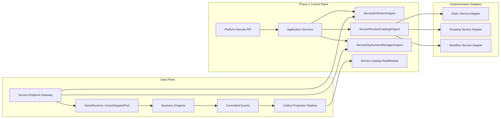

# GAgentService Phase 1 MVP 蓝图（2026-03-14）

## 1. 文档元信息

- 状态：Proposed
- 版本：R1
- 日期：2026-03-14
- 关联文档：
  - `AGENTS.md`
  - `docs/FOUNDATION.md`
  - `docs/CQRS_ARCHITECTURE.md`
  - `docs/SCRIPTING_ARCHITECTURE.md`
  - `docs/architecture/2026-03-14-gagent-as-a-service-platform-blueprint.md`
  - `docs/architecture/2026-03-13-gagent-platform-entry-and-composition-blueprint.md`

## 2. 一句话结论

`GAgent as a Service` 的下一阶段不应一次把完整平台控制面全部做完。

Phase 1 的正确目标是先完成一个最小闭环：

`ServiceDefinition -> ServiceRevision -> PreparedServiceRevisionArtifact -> ServiceDeployment -> Service Endpoint Gateway`

只要这条链闭合，`static / scripting / workflow` 就能第一次真正通过同一套平台对象模型发布和调用。

## 3. 为什么需要单独的 Phase 1 文档

总体蓝图已经明确了终局平台对象：

1. `ServiceDefinition`
2. `ServiceRevision`
3. `PreparedServiceRevisionArtifact`
4. `ServiceDeployment`
5. `ServiceBinding`
6. `ServiceEndpoint`
7. `ServicePolicy`

但如果第一阶段一次落完整套对象，会有三个问题：

1. 控制面 actor 数量过多，第一轮很难验证最核心主链是否成立。
2. `binding / policy / rollout / multi-runtime set` 会把问题空间扩成“平台主网化”，而不是“服务化主链收敛”。
3. 仓库当前真正缺的不是所有治理细节，而是 source-agnostic 的 service publish / serve / invoke 闭环。

因此本阶段必须只做最小必需对象，不做全量治理平台。

## 4. Phase 1 目标

### 4.1 必须达到的结果

1. 存在统一的 `ServiceDefinition` 主对象。
2. 存在统一的 `ServiceRevision` 对象，承载实现来源。
3. `static / scripting / workflow` 都能被适配为 `PreparedServiceRevisionArtifact`。
4. 平台能为某个 service 选择一个 `ServingRevision` 并激活 `ServiceDeployment`。
5. 外部调用入口不再先分 `workflow` 或 `scripting`，而是先解析 `service endpoint`。
6. 平台存在最小可用的 `ServiceCatalogReadModel` 与 `ServiceRevisionCatalogReadModel`。

### 4.2 明确不在 Phase 1 解决

1. 完整 `ServiceBinding` 管理器
2. 完整 `ServiceEndpointCatalogGAgent`
3. 完整 `ServicePolicyGAgent`
4. rollout / canary / staged deployment
5. multi-runtime set / traffic split
6. billing / SLA / 审计闭环
7. connector / secret 的统一治理面

## 5. Phase 1 的对象范围

### 5.1 本阶段必须实现的对象

| 对象 | 是否 Phase 1 必需 | 用途 |
|---|---|---|
| `ServiceDefinition` | 是 | 服务身份与默认 serving revision |
| `ServiceRevision` | 是 | 某个版本的实现来源与 authoring spec |
| `PreparedServiceRevisionArtifact` | 是 | 统一化后的运行产物 |
| `ServiceDeployment` | 是 | 当前 serving revision 的激活结果 |
| `ServiceCatalogReadModel` | 是 | 服务发现与列表查询 |
| `ServiceRevisionCatalogReadModel` | 是 | revision 与 serving 状态查询 |
| `ServiceBinding` | 否 | 暂缓到 Phase 2 |
| `ServiceEndpointCatalog` | 否 | Phase 1 先内聚到 definition/revision |
| `ServicePolicy` | 否 | 先用宿主最小 admission 代替 |

### 5.2 Phase 1 的最小 actor 集合

本阶段只新增三个长期 actor：

1. `ServiceDefinitionGAgent`
2. `ServiceRevisionCatalogGAgent`
3. `ServiceDeploymentManagerGAgent`

这样做的原因：

1. 三者已经足以形成 publish / serve / invoke 闭环。
2. `ServiceBinding` 和 `ServicePolicy` 先不 actor 化，不会破坏主链。
3. `ServiceEndpoint` 先不独立成 catalog actor，而是作为 `ServiceDefinition` 与 `PreparedServiceRevisionArtifact` 的组成部分。

## 6. Phase 1 架构图



## 7. Phase 1 资源模型

### 7.1 `ServiceDefinition`

只负责稳定身份，不承载来源差异。

建议字段：

1. `tenant_id`
2. `app_id`
3. `namespace`
4. `service_id`
5. `display_name`
6. `description`
7. `default_serving_revision_id`
8. `declared_endpoints`
9. `labels`
10. `annotations`

### 7.2 `ServiceRevision`

承载实现来源。

建议字段：

1. `service_id`
2. `revision_id`
3. `implementation_kind`
4. `implementation_spec`
5. `status`
6. `artifact_hash`
7. `created_at`

### 7.3 `PreparedServiceRevisionArtifact`

这是本阶段最关键的新对象。

平台后续所有运行与查询，不再直接看原始 source spec，而是看统一产物。

建议字段：

1. `service_id`
2. `revision_id`
3. `implementation_kind`
4. `descriptor_set`
5. `normalized_artifact`
6. `endpoint_descriptors`
7. `deployment_plan`
8. `schema_hashes`
9. `runtime_semantics_hashes`
10. `artifact_hash`

### 7.4 `ServiceDeployment`

本阶段只做最小 serving 语义，不做流量拆分。

建议字段：

1. `service_id`
2. `revision_id`
3. `deployment_id`
4. `status`
5. `activation_target`
6. `runtime_address_set`
7. `health_summary`

## 8. Proto 决议

### 8.1 本阶段必须新增的 proto

1. `service_definition.proto`
2. `service_revision.proto`
3. `service_artifact.proto`
4. `service_deployment.proto`
5. `service_endpoint.proto`

### 8.2 本阶段暂缓的 proto

1. `service_binding.proto`
2. `service_policy.proto`

### 8.3 建议的 proto 结构

```proto
message ServiceDefinitionSpec {
  string tenant_id = 1;
  string app_id = 2;
  string namespace = 3;
  string service_id = 4;
  string display_name = 5;
  string description = 6;
  string default_serving_revision_id = 7;
  repeated ServiceEndpointSpec declared_endpoints = 20;
}

message ServiceRevisionSpec {
  string service_id = 1;
  string revision_id = 2;
  ServiceImplementationKind implementation_kind = 3;

  oneof implementation_spec {
    StaticServiceRevisionSpec static_spec = 20;
    ScriptingServiceRevisionSpec scripting_spec = 21;
    WorkflowServiceRevisionSpec workflow_spec = 22;
  }
}

message PreparedServiceRevisionArtifact {
  string service_id = 1;
  string revision_id = 2;
  ServiceImplementationKind implementation_kind = 3;
  bytes normalized_artifact = 10;
  bytes descriptor_set = 11;
  repeated ServiceEndpointDescriptor endpoint_descriptors = 12;
  ServiceDeploymentPlan deployment_plan = 13;
  string artifact_hash = 14;
}
```

## 9. Phase 1 控制面 Actor 职责

### 9.1 `ServiceDefinitionGAgent`

职责：

1. 创建与更新 `ServiceDefinition`
2. 管理 `default_serving_revision_id`
3. 管理服务级 endpoint 声明
4. 暴露 definition snapshot

禁止：

1. 保存 revision artifact
2. 直接处理 deployment 激活
3. 直接处理 source-specific 逻辑

### 9.2 `ServiceRevisionCatalogGAgent`

职责：

1. 创建 revision
2. 保存 revision authoring spec
3. 调用 `IServiceImplementationAdapter` 生成 `PreparedServiceRevisionArtifact`
4. 校验 descriptor、schema、endpoint、deployment plan
5. 维护 revision 生命周期：`draft / prepared / validated / serving / retired / failed`

### 9.3 `ServiceDeploymentManagerGAgent`

职责：

1. 根据 `default_serving_revision_id` 激活当前 serving revision
2. 持有当前 serving deployment 状态
3. 维护最小健康视图
4. 暴露 runtime lookup 所需的稳定服务解析结果

本阶段不负责：

1. 多版本并存流量切分
2. rollout strategy
3. canary promotion

## 10. Adapter 设计

### 10.1 本阶段统一接口

```csharp
public interface IServiceImplementationAdapter
{
    ServiceImplementationKind ImplementationKind { get; }

    Task<PreparedServiceRevisionArtifact> PrepareRevisionAsync(
        PrepareServiceRevisionRequest request,
        CancellationToken cancellationToken);
}
```

本阶段故意只保留一个核心方法。

原因：

1. `DescribeEndpointsAsync(...)` 可以先并入 `PrepareRevisionAsync(...)` 的产物。
2. `BuildDeploymentPlanAsync(...)` 也先并入 artifact。
3. 这样 adapter 第一阶段职责最窄，便于快速接入三种来源。

### 10.2 三种 adapter 的最小输入输出

#### Static Service Adapter

输入：

1. CLR type reference
2. protobuf descriptor references

输出：

1. `PreparedServiceRevisionArtifact`

#### Scripting Service Adapter

输入：

1. script package
2. descriptor set
3. compiled behavior artifact

输出：

1. `PreparedServiceRevisionArtifact`

#### Workflow Service Adapter

输入：

1. workflow YAML
2. workflow descriptors

输出：

1. `PreparedServiceRevisionArtifact`

## 11. Service Endpoint Gateway

### 11.1 本阶段目标

第一阶段必须把“外部先按 family 分支”改掉。

统一入口先按：

1. `tenant`
2. `app`
3. `namespace`
4. `service`
5. `endpoint`

解析，再根据 serving revision 找到实际业务 actor。

### 11.2 本阶段最小能力

1. endpoint 到 service 的解析
2. service 到 serving revision 的解析
3. serving revision 到 deployment 的解析
4. deployment 到 actor runtime address 的解析
5. command/query envelope 构造

### 11.3 本阶段不做

1. 完整 authz policy engine
2. 完整 rate limit engine
3. 多版本路由
4. external/public/internal endpoint 分层治理

## 12. Phase 1 查询与投影

### 12.1 平台 read model 最小集合

本阶段只做两个：

1. `ServiceCatalogReadModel`
2. `ServiceRevisionCatalogReadModel`

### 12.2 为什么先不做更多

1. `ServiceBindingReadModel` 依赖 binding 模型，Phase 2 再做。
2. `ServicePolicyReadModel` 依赖 policy actor，Phase 2 再做。
3. `ServiceEndpointCatalogReadModel` 本阶段可并入 `ServiceCatalogReadModel`。
4. `ServiceDeploymentStatusReadModel` 如果需要，可以先作为 `ServiceCatalogReadModel` 的一个子视图。

### 12.3 平台查询面

第一阶段至少支持：

1. 查询服务列表
2. 查询 service definition
3. 查询 revision 列表
4. 查询当前 serving revision
5. 查询当前 deployment 状态

## 13. 建议项目拆分

### 13.1 本阶段建议新增项目

1. `src/platform/Aevatar.GAgentService.Abstractions`
2. `src/platform/Aevatar.GAgentService.Core`
3. `src/platform/Aevatar.GAgentService.Application`
4. `src/platform/Aevatar.GAgentService.Projection`
5. `src/platform/Aevatar.GAgentService.Hosting`
6. `test/Aevatar.GAgentService.Tests`
7. `test/Aevatar.GAgentService.Integration.Tests`

### 13.2 本阶段不建议立即拆出的项目

1. `Aevatar.GAgentService.Infrastructure`
2. `Aevatar.GAgentService.StaticAdapter`
3. `Aevatar.GAgentService.ScriptingAdapter`
4. `Aevatar.GAgentService.WorkflowAdapter`

第一阶段更合适的做法是：

1. adapter 抽象放进 `Abstractions`
2. adapter 的具体实现先分别落在现有 source 项目里
3. 等 Phase 2 再把 adapter 实现外提成独立项目

这样可以减少第一轮的项目爆炸。

## 14. 精确到文件的建议

### 14.1 新增文件

1. `src/platform/Aevatar.GAgentService.Abstractions/Protos/service_definition.proto`
2. `src/platform/Aevatar.GAgentService.Abstractions/Protos/service_revision.proto`
3. `src/platform/Aevatar.GAgentService.Abstractions/Protos/service_artifact.proto`
4. `src/platform/Aevatar.GAgentService.Abstractions/Protos/service_deployment.proto`
5. `src/platform/Aevatar.GAgentService.Abstractions/Protos/service_endpoint.proto`
6. `src/platform/Aevatar.GAgentService.Abstractions/Sources/IServiceImplementationAdapter.cs`
7. `src/platform/Aevatar.GAgentService.Core/GAgents/ServiceDefinitionGAgent.cs`
8. `src/platform/Aevatar.GAgentService.Core/GAgents/ServiceRevisionCatalogGAgent.cs`
9. `src/platform/Aevatar.GAgentService.Core/GAgents/ServiceDeploymentManagerGAgent.cs`
10. `src/platform/Aevatar.GAgentService.Application/Services/ServicePublishingApplicationService.cs`
11. `src/platform/Aevatar.GAgentService.Application/Services/ServiceInvocationResolutionService.cs`
12. `src/platform/Aevatar.GAgentService.Projection/Projectors/ServiceCatalogProjector.cs`
13. `src/platform/Aevatar.GAgentService.Projection/Projectors/ServiceRevisionCatalogProjector.cs`
14. `src/platform/Aevatar.GAgentService.Hosting/Endpoints/ServiceEndpoints.cs`
15. `src/platform/Aevatar.GAgentService.Hosting/DependencyInjection/ServiceCollectionExtensions.cs`

### 14.2 现有项目中的 Phase 1 适配文件

1. `src/Aevatar.Scripting.Hosting/.../ScriptingServiceImplementationAdapter.cs`
2. `src/workflow/Aevatar.Workflow.Infrastructure/.../WorkflowServiceImplementationAdapter.cs`
3. `src/Aevatar.Hosting/.../StaticServiceImplementationAdapter.cs`

### 14.3 本阶段不改或只最小改的文件

1. `src/Aevatar.Scripting.Hosting/CapabilityApi/ScriptCapabilityEndpoints.cs`
2. `src/Aevatar.Scripting.Hosting/CapabilityApi/ScriptQueryEndpoints.cs`
3. `src/workflow/Aevatar.Workflow.Infrastructure/CapabilityApi/ChatEndpoints.cs`
4. `src/workflow/Aevatar.Workflow.Infrastructure/CapabilityApi/ChatQueryEndpoints.cs`

说明：

Phase 1 不要求立刻删除旧 family API。
第一阶段只要求：

1. 新平台入口先建立
2. 新 service API 能独立工作
3. 旧入口可以暂时并存，但不再继续扩展

## 15. 实施顺序

### Step 1：建立对象与 proto

1. 新建 `ServiceDefinition / ServiceRevision / PreparedServiceRevisionArtifact / ServiceDeployment` proto
2. 新建三个 control-plane actors
3. 新建两个最小 read model

### Step 2：打通 revision artifact 主链

1. 新建 `IServiceImplementationAdapter`
2. 接入 `static / scripting / workflow`
3. `ServiceRevisionCatalogGAgent` 调 adapter 生成 artifact

### Step 3：打通 deployment 主链

1. `ServiceDefinitionGAgent` 管理默认 serving revision
2. `ServiceDeploymentManagerGAgent` 激活 serving revision
3. 暴露 service 到 deployment 的解析结果

### Step 4：打通统一调用入口

1. 新建 `Service Endpoint Gateway`
2. 解析 `tenant/app/namespace/service/endpoint`
3. 路由到实际 actor runtime

### Step 5：补平台查询

1. service list
2. service detail
3. revision list
4. serving revision
5. deployment status

## 16. 测试要求

### 16.1 单元测试

1. `ServiceDefinitionGAgentTests`
2. `ServiceRevisionCatalogGAgentTests`
3. `ServiceDeploymentManagerGAgentTests`
4. `ServicePublishingApplicationServiceTests`
5. `ServiceInvocationResolutionServiceTests`

### 16.2 集成测试

1. static source publish -> serve -> invoke
2. scripting source publish -> serve -> invoke
3. workflow source publish -> serve -> invoke
4. service catalog query
5. revision promote -> deployment switch

### 16.3 守卫

1. 禁止平台 gateway 按 `workflow/script/static` 做显式分支路由
2. 禁止平台 query 直读控制面 actor 内部状态
3. 禁止 adapter 返回 bag 化 artifact

## 17. 完成态判定

以下条件满足，就可以宣布 Phase 1 完成：

1. 存在新的 `GAgentService` 平台项目组。
2. `ServiceDefinition / ServiceRevision / PreparedServiceRevisionArtifact / ServiceDeployment` 已落地。
3. `static / scripting / workflow` 都能通过同一 publish 主链生成 artifact。
4. 存在统一 `service endpoint` 入口。
5. 至少两个平台 read model 可查询。
6. 新 service API 不依赖 family-specific host endpoint 才能工作。

## 18. 最终决议

下一阶段不是“先把完整平台都做好”，而是：

**先把 `service identity + revision artifact + serving deployment + unified invoke gateway` 做成最小闭环。**

只要这一步成立，后面的 `binding / policy / rollout / tenant governance` 才有正确挂载点。
