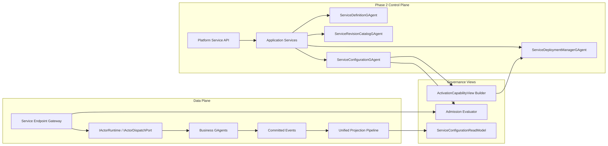

# GAgentService Phase 2 Binding/Policy 蓝图（2026-03-14）

## 1. 文档元信息

- 状态：Implemented
- 版本：R1
- 日期：2026-03-14
- 关联文档：
  - `AGENTS.md`
  - `docs/FOUNDATION.md`
  - `docs/CQRS_ARCHITECTURE.md`
  - `docs/architecture/2026-03-14-gagent-as-a-service-platform-blueprint.md`
  - `docs/architecture/2026-03-14-gagent-service-phase-1-mvp-blueprint.md`
  - `docs/architecture/2026-03-14-gagent-service-phase-1-detailed-design.md`

## 2. 一句话结论

Phase 1 已经完成了：

`ServiceDefinition -> ServiceRevision -> PreparedServiceRevisionArtifact -> ServiceDeployment -> Service Endpoint Gateway`

Phase 2 不应立刻跳到 `rollout / multi-runtime set / billing`，而应先补齐服务平台真正缺失的配置与准入闭环：

`ServiceConfiguration -> Activation/Invoke Admission -> Configuration ReadModel`

当前实现已经按这个更轻的模型收敛完成：

1. `binding / endpoint exposure / access rules` 不再分散到三个长期 actor。
2. 权威事实源收敛为单个 `ServiceConfigurationGAgent`。
3. 激活与调用决策统一读取 `ServiceConfigurationReadModel`，不再在应用层 join 三套治理快照。
4. Phase 2 的真实定位是 `Service Configuration / Access Layer`，不是“大而全治理平台”。

## 2.1 状态说明

这份蓝图已经完成实现，但实现形态比最初设计更轻：

1. 原始蓝图中的 `ServiceBinding / ServiceEndpointCatalog / ServicePolicy` 三对象拆分，被收敛为单一 `ServiceConfiguration` 聚合。
2. 原始蓝图中提到的三套治理 actor/read model/projector，已经由 `ServiceConfigurationGAgent + ServiceConfigurationReadModel` 取代。
3. 已存在治理数据的升级路径已经补齐：旧 `bindings / endpoint-catalog / policies` 事实会在首次命中或宿主启动时导入到新的 `ServiceConfiguration` 聚合。
4. `UpdateServiceEndpointCatalogCommand` 已恢复严格的 create-vs-update 语义：catalog 缺失时必须失败，不再在 update 路径上隐式创建。
5. 下面仍保留部分最初的能力拆分论证，用来解释 Phase 2 为什么需要这些能力；具体代码形态以当前实现为准。

## 3. 为什么 Phase 2 不是 rollout

如果直接进入 `canary / traffic split / multi-runtime set`，会出现三个问题：

1. 平台还没有统一的 configuration 模型，deployment 激活时无法形成权威 capability view。
2. 平台还没有统一 access rules 模型，发布、激活、调用都缺少 tenant/app/service 级 admission 边界。
3. endpoint 还只是 definition/revision 的附属字段时，平台无法表达“声明了什么”和“允许暴露什么”的差异。

因此 Phase 2 必须先做：

1. `ServiceConfiguration`
2. `ActivationCapabilityView`
3. `Activation / Invoke Admission`
4. `ServiceConfigurationReadModel`

而不是先做 rollout。

## 4. Phase 2 目标

### 4.1 必须达到的结果

1. service 能显式绑定其他 service、connector、secret，并声明 endpoint exposure 与访问规则。
2. deployment 激活时不再直接读取零散 definition/revision 信息，而是读取 `ServiceConfiguration` 派生的 `ActivationCapabilityView`。
3. publish、activate、invoke 三条主链都进入统一 admission 检查。
4. 平台读侧新增单一 `ServiceConfigurationReadModel`，由应用层映射成 bindings/endpoints/policies 外部查询结果。

### 4.2 明确不在 Phase 2 解决

1. rollout / canary / staged deployment
2. multi-runtime set / traffic split
3. auto scaling / desired replicas / placement rebalance
4. billing / SLA / 计费闭环
5. 全量审计平台
6. OpenFGA / OPA 的强耦合集成

说明：

Phase 2 会预留这些扩展边界，但不以接入第三方治理引擎为主目标。

## 5. Phase 2 的对象范围

### 5.1 新增核心对象

| 对象 | 是否 Phase 2 必需 | 用途 |
|---|---|---|
| `ServiceConfiguration` | 是 | 承载 service 级 binding、endpoint exposure、access rules 的统一权威事实 |
| `ActivationCapabilityView` | 是 | 激活时统一视图；由 `ServiceConfiguration + PreparedArtifact` 归并得到 |
| `InvokeAdmissionDecision` | 是 | 调用时的统一准入决策 |
| `ServiceConfigurationReadModel` | 是 | 配置查询；对外映射为 bindings/endpoints/policies 三类视图 |

### 5.2 保持不变的对象

1. `ServiceDefinition`
2. `ServiceRevision`
3. `PreparedServiceRevisionArtifact`
4. `ServiceDeployment`

这些对象仍是权威主链，不在 Phase 2 拆散。

## 6. Phase 2 的最小 Actor 集合

本阶段新增一个长期 actor：

1. `ServiceConfigurationGAgent`

保留并复用 Phase 1 的 actor：

1. `ServiceDefinitionGAgent`
2. `ServiceRevisionCatalogGAgent`
3. `ServiceDeploymentManagerGAgent`

### 6.1 职责边界

- `ServiceConfigurationGAgent`
  - 维护 service 级 configuration 事实
  - 统一承载 bindings、endpoint exposure、invoke access rules
  - 生成 configuration 级 committed facts
  - 作为 Phase 2 唯一长期权威配置聚合

## 7. Phase 2 总体架构图



## 8. 关键设计判断

### 8.1 binding 不属于 ServiceDefinition 内嵌字段

`bindings` 不能继续作为 `ServiceDefinition` 的附属 repeated field，因为：

1. binding 本身需要独立 lifecycle
2. binding 需要独立审计与状态
3. binding 需要独立 committed facts 和读模型
4. connector/secret/service 引用需要类型化建模

因此 Phase 2 必须把 binding 提升为 `ServiceConfiguration` 中的独立 typed 子结构，而不是散落在 definition 上。

### 8.2 access rules 不是 bag

`access rules` 不能做成字符串或开放 bag 配置。Phase 2 必须遵守仓库强类型原则。

当前实现选择了更收敛的一组 typed 字段，而不是大而全 policy 引擎：

1. `activation_required_binding_ids`
2. `invoke_allowed_caller_service_keys`
3. `invoke_requires_active_deployment`

如果后续需要扩展 connector/secret/observability 规则，应继续通过 typed 子消息演进，而不是回退成 bag。

### 8.3 activation 与 invoke 分开治理

不要把所有 policy 混成一个 evaluation。

必须分成两类：

1. `ActivationAdmission`
   - revision 是否允许 serving
   - connector/secret/service binding 是否满足
   - placement/connector policy 是否允许激活
2. `InvokeAdmission`
   - endpoint 是否暴露
   - tenant/app/service caller 是否允许
   - 是否命中 endpoint 级禁用或限流前置条件

### 8.4 endpoint exposure 独立于 artifact endpoint descriptors

`PreparedServiceRevisionArtifact.Endpoints` 仍保留为 revision 事实的一部分。

但 Phase 2 仍需要平台级 endpoint exposure 事实，原因是：

1. artifact endpoint 只表达“实现声明了什么”
2. configuration/endpoints 表达“平台实际允许暴露什么”
3. 一个 endpoint 的 exposure、policy refs、deprecation、visibility 不是 artifact 的职责

因此两者关系应当是：

`Artifact Endpoint Descriptor -> ServiceConfiguration.Endpoints -> Effective Endpoint View`

## 9. Proto 决议

### 9.1 本阶段必须新增的 proto

1. `service_binding.proto`
2. `service_policy.proto`
3. `service_endpoint_catalog.proto`
4. `service_admission.proto`

### 9.2 本阶段新增的核心消息

#### `service_binding.proto`

1. `ServiceBindingSpec`
2. `ServiceBindingTarget`
3. `BoundServiceRef`
4. `BoundConnectorRef`
5. `BoundSecretRef`
6. `CreateServiceBindingCommand`
7. `UpdateServiceBindingCommand`
8. `RetireServiceBindingCommand`
9. `ServiceBindingCreatedEvent`
10. `ServiceBindingUpdatedEvent`
11. `ServiceBindingRetiredEvent`

#### `service_policy.proto`

1. `ServicePolicySpec`
2. `PolicyScope`
3. `AdmissionPolicy`
4. `AuthorizationPolicy`
5. `ConnectorPolicy`
6. `SecretPolicy`
7. `ObservabilityPolicy`
8. `PlacementPolicyHint`
9. `CreateServicePolicyCommand`
10. `UpdateServicePolicyCommand`
11. `RetireServicePolicyCommand`
12. `ServicePolicyCreatedEvent`
13. `ServicePolicyUpdatedEvent`
14. `ServicePolicyRetiredEvent`

#### `service_endpoint_catalog.proto`

1. `ServiceEndpointCatalogEntry`
2. `EndpointExposureKind`
3. `EndpointAdmissionBinding`
4. `UpsertServiceEndpointCommand`
5. `DisableServiceEndpointCommand`
6. `ServiceEndpointUpsertedEvent`
7. `ServiceEndpointDisabledEvent`

#### `service_admission.proto`

1. `ActivationCapabilityView`
2. `ActivationAdmissionRequest`
3. `ActivationAdmissionDecision`
4. `InvokeAdmissionRequest`
5. `InvokeAdmissionDecision`

### 9.3 示例 proto 结构

```proto
message ServiceBindingSpec {
  ServiceIdentity identity = 1;
  string binding_id = 2;
  ServiceBindingKind binding_kind = 3;

  oneof target {
    BoundServiceRef service_ref = 20;
    BoundConnectorRef connector_ref = 21;
    BoundSecretRef secret_ref = 22;
  }

  repeated string policy_ids = 30;
  bool required_at_activation = 31;
  bool required_at_invoke = 32;
}

message ServicePolicySpec {
  string policy_id = 1;
  PolicyScope scope = 2;
  AdmissionPolicy admission = 20;
  AuthorizationPolicy authorization = 21;
  ConnectorPolicy connector = 22;
  SecretPolicy secret = 23;
  ObservabilityPolicy observability = 24;
  PlacementPolicyHint placement = 25;
}

message ActivationCapabilityView {
  ServiceIdentity identity = 1;
  string revision_id = 2;
  repeated BoundServiceRef required_services = 20;
  repeated BoundConnectorRef required_connectors = 21;
  repeated BoundSecretRef required_secrets = 22;
  repeated string effective_policy_ids = 23;
}
```

## 10. 应用层与设计模式

### 10.1 推荐模式组合

| 模式 | 落点 | 用途 |
|---|---|---|
| Aggregate Actor | `ServiceBindingManagerGAgent`、`ServiceEndpointCatalogGAgent`、`ServicePolicyGAgent` | 长期事实源 |
| Facade | `ServiceBindingApplicationService`、`ServicePolicyApplicationService` | 对外稳定用例面 |
| Assembler | `ActivationCapabilityViewAssembler` | 归并 binding/endpoint/policy |
| Strategy | `IActivationAdmissionEvaluator`、`IInvokeAdmissionEvaluator` | 隔离治理决策 |
| Projector | binding / endpoint / policy projectors | 统一平台读侧 |
| Query Facade | binding / endpoint / policy query readers | 统一查询出口 |

### 10.2 继承与泛型策略

Phase 2 继续保持：

1. control-plane actor 只复用 `GAgentBase<TState>`
2. 不引入 `ServiceBindingManagerGAgent<TBinding>`
3. admission evaluator 不做 `generic policy engine`

推荐接口：

```csharp
public interface IActivationAdmissionEvaluator
{
    Task<ActivationAdmissionDecision> EvaluateAsync(
        ActivationAdmissionRequest request,
        CancellationToken cancellationToken);
}

public interface IInvokeAdmissionEvaluator
{
    Task<InvokeAdmissionDecision> EvaluateAsync(
        InvokeAdmissionRequest request,
        CancellationToken cancellationToken);
}
```

不推荐：

```csharp
public interface IPolicyEvaluator<TPolicy, TRequest, TResult>
{
}
```

原因：

1. 平台治理面强调稳定对象模型，不强调泛型抽象炫技
2. policy 类型已经由 protobuf 强类型表达
3. 过度泛型会让 DI 和 query 路径爆炸

## 11. 运行主链如何变化

### 11.1 publish 主链

Phase 1：

`ServiceRevision -> PreparedArtifact`

Phase 2：

`ServiceRevision -> PreparedArtifact -> EndpointCatalogProjection -> PublishAdmission`

### 11.2 activate 主链

Phase 1：

`ServiceDeploymentManagerGAgent -> Artifact -> RuntimeActivator`

Phase 2：

`ServiceDeploymentManagerGAgent -> Artifact + Binding + Policy -> ActivationCapabilityView -> ActivationAdmission -> RuntimeActivator`

### 11.3 invoke 主链

Phase 1：

`Gateway -> ServiceCatalog -> Revision Artifact -> Dispatcher`

Phase 2：

`Gateway -> EndpointCatalog -> InvokeAdmission -> ServiceCatalog -> Revision Artifact -> Dispatcher`

## 12. 读侧与查询

### 12.1 新增 read models

1. `ServiceBindingReadModel`
2. `ServiceEndpointCatalogReadModel`
3. `ServicePolicyReadModel`
4. `ServiceActivationCapabilityReadModel`

### 12.2 最小 query facade

新增：

1. `IServiceBindingQueryPort`
2. `IServiceEndpointCatalogQueryPort`
3. `IServicePolicyQueryPort`
4. `IServiceAdmissionQueryPort`

说明：

Phase 2 不允许应用层绕过 query facade 直接读取 control-plane actors 内部状态。

## 13. Hosting 与 API

### 13.1 本阶段新增 endpoints

1. `POST /api/services/{serviceId}/bindings`
2. `PUT /api/services/{serviceId}/bindings/{bindingId}`
3. `POST /api/services/{serviceId}/bindings/{bindingId}:retire`
4. `PUT /api/services/{serviceId}/endpoints/{endpointId}`
5. `POST /api/services/{serviceId}/endpoints/{endpointId}:disable`
6. `POST /api/service-policies`
7. `PUT /api/service-policies/{policyId}`
8. `POST /api/service-policies/{policyId}:retire`
9. `GET /api/services/{serviceId}/bindings`
10. `GET /api/services/{serviceId}/endpoints`
11. `GET /api/service-policies/{policyId}`

### 13.2 admission 边界

Host 层只做：

1. request decoding
2. identity extraction
3. command / query facade 调用

Host 层不做：

1. connector permission 拼装
2. secret 解析
3. policy 决策

这些必须留在应用层与治理 evaluator。

## 14. 项目与文件建议

### 14.1 继续沿用现有项目组

Phase 2 不建议再开新的 bounded context 项目组，继续沿用：

1. `Aevatar.GAgentService.Abstractions`
2. `Aevatar.GAgentService.Core`
3. `Aevatar.GAgentService.Application`
4. `Aevatar.GAgentService.Infrastructure`
5. `Aevatar.GAgentService.Projection`
6. `Aevatar.GAgentService.Hosting`

### 14.2 新增文件建议

1. `src/platform/Aevatar.GAgentService.Abstractions/Protos/service_binding.proto`
2. `src/platform/Aevatar.GAgentService.Abstractions/Protos/service_policy.proto`
3. `src/platform/Aevatar.GAgentService.Abstractions/Protos/service_endpoint_catalog.proto`
4. `src/platform/Aevatar.GAgentService.Abstractions/Protos/service_admission.proto`
5. `src/platform/Aevatar.GAgentService.Core/GAgents/ServiceBindingManagerGAgent.cs`
6. `src/platform/Aevatar.GAgentService.Core/GAgents/ServiceEndpointCatalogGAgent.cs`
7. `src/platform/Aevatar.GAgentService.Core/GAgents/ServicePolicyGAgent.cs`
8. `src/platform/Aevatar.GAgentService.Core/Assemblers/ActivationCapabilityViewAssembler.cs`
9. `src/platform/Aevatar.GAgentService.Application/Services/ServiceBindingApplicationService.cs`
10. `src/platform/Aevatar.GAgentService.Application/Services/ServicePolicyApplicationService.cs`
11. `src/platform/Aevatar.GAgentService.Application/Services/ServiceEndpointCatalogApplicationService.cs`
12. `src/platform/Aevatar.GAgentService.Application/Services/ActivationAdmissionService.cs`
13. `src/platform/Aevatar.GAgentService.Application/Services/InvokeAdmissionService.cs`
14. `src/platform/Aevatar.GAgentService.Projection/Projectors/ServiceBindingProjector.cs`
15. `src/platform/Aevatar.GAgentService.Projection/Projectors/ServiceEndpointCatalogProjector.cs`
16. `src/platform/Aevatar.GAgentService.Projection/Projectors/ServicePolicyProjector.cs`
17. `src/platform/Aevatar.GAgentService.Projection/Queries/ServiceBindingQueryReader.cs`
18. `src/platform/Aevatar.GAgentService.Projection/Queries/ServiceEndpointCatalogQueryReader.cs`
19. `src/platform/Aevatar.GAgentService.Projection/Queries/ServicePolicyQueryReader.cs`
20. `src/platform/Aevatar.GAgentService.Hosting/Endpoints/ServiceBindingEndpoints.cs`
21. `src/platform/Aevatar.GAgentService.Hosting/Endpoints/ServicePolicyEndpoints.cs`

### 14.3 本阶段不建议做的拆分

1. 不把 policy evaluator 提前拆成独立治理平台
2. 不把 binding manager 外提到新 solution
3. 不把 connector/secret 管理本体拉进 `GAgentService`

正确边界是：

`GAgentService` 只维护绑定关系与治理语义，不拥有 connector/secret 资源本体。

## 15. 推荐实施顺序

### Step 1：补齐 protobuf 契约

1. 新增 binding/policy/endpoint-catalog/admission proto
2. 明确 typed policy 子消息
3. 删除任何 `Metadata / Annotations bag` 回退方案

### Step 2：落地三个 control-plane actors

1. `ServiceBindingManagerGAgent`
2. `ServiceEndpointCatalogGAgent`
3. `ServicePolicyGAgent`

### Step 3：落地 activation/invoke governance

1. 新建 `ActivationCapabilityViewAssembler`
2. 新建 activation/invoke admission services
3. 让 deployment 与 gateway 接入 admission

### Step 4：落地投影与查询

1. 新建 binding / endpoint / policy projectors
2. 新建 query facade
3. Host 暴露查询接口

### Step 5：冻结旧的散落治理入口

1. 不再允许在 family-specific host 里加 connector/secret/policy 判断
2. 不再允许 gateway 直接按 source kind 分支暴露可见性
3. 文档与示例切到 platform governance 模型

## 16. 完成态判定

以下条件全部满足，才算 Phase 2 完成：

1. `ServiceBinding / ServiceEndpointCatalog / ServicePolicy` 三个对象已经 actor 化并具备 committed facts。
2. deployment 激活走 `ActivationCapabilityView + ActivationAdmission`。
3. invoke 路径走 `EndpointCatalog + InvokeAdmission`。
4. 平台存在 binding、endpoint、policy 三套 query facade 和 read models。
5. connector/secret/service 依赖绑定已经强类型化，不再回退到 bag。
6. family-specific host 不再承载新的治理逻辑。

## 17. Phase 3 前置条件

只有当 Phase 2 完成后，才应该进入：

1. rollout / canary / staged deployment
2. multi-runtime set / traffic split
3. desired replicas / health driven orchestration
4. quota / rate limit 的强执行化
5. 更复杂的 audit / billing / SLA

## 18. 最终决议

Phase 2 的正确目标不是“做更复杂的 runtime”，而是：

**把 `GAgentService` 从统一发布与调用，推进到统一绑定与治理。**

先把 binding、endpoint catalog、policy、admission 这些平台基本面做对，后面的 rollout 和主网化能力才有可靠支点。
