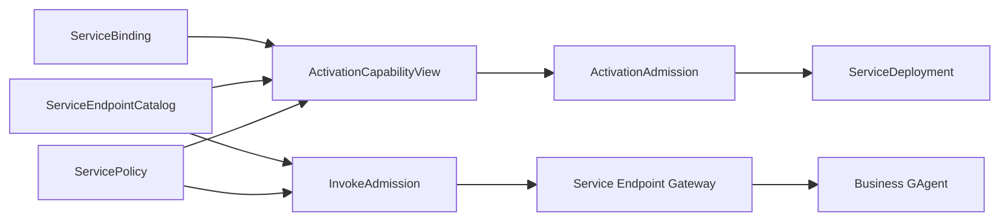
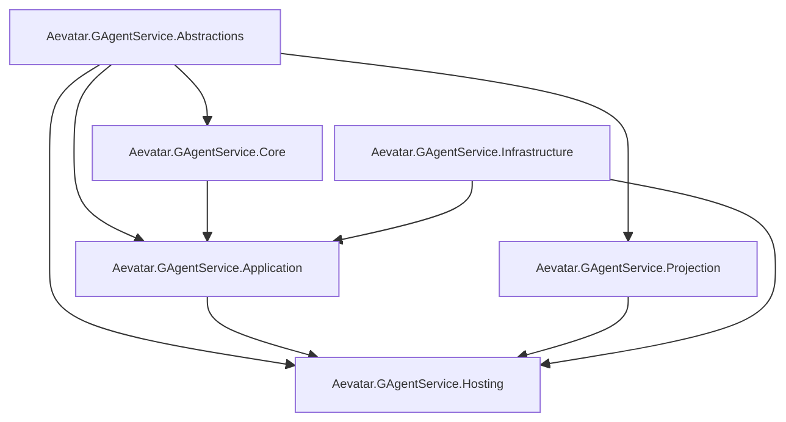
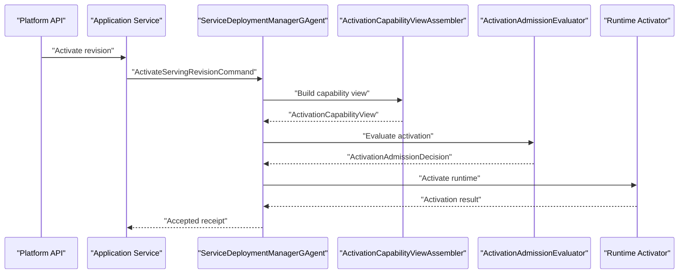
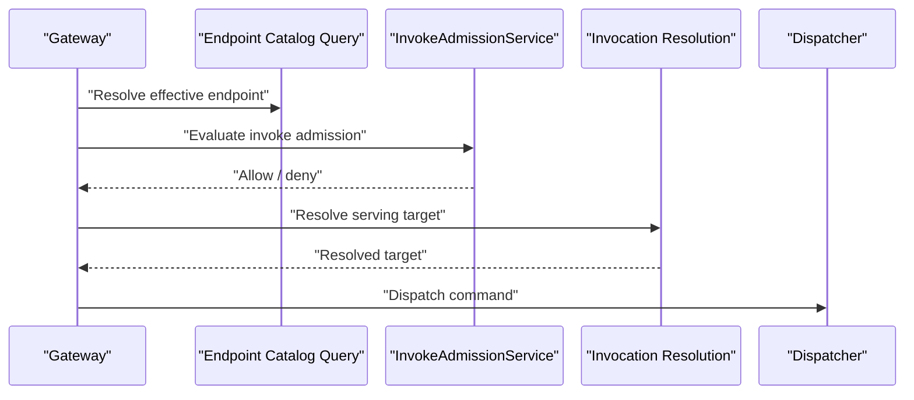

# GAgentService Phase 2 Binding/Policy 详细架构变更实施方案（2026-03-14）

## 1. 文档元信息

- 状态：Proposed
- 版本：R1
- 日期：2026-03-14
- 适用范围：
  - `src/Aevatar.Foundation.*`
  - `src/Aevatar.CQRS.*`
  - `src/Aevatar.Hosting`
  - `src/Aevatar.Scripting.*`
  - `src/workflow/*`
  - `src/platform/*`
- 关联文档：
  - `AGENTS.md`
  - `docs/FOUNDATION.md`
  - `docs/CQRS_ARCHITECTURE.md`
  - `docs/architecture/2026-03-14-gagent-as-a-service-platform-blueprint.md`
  - `docs/architecture/2026-03-14-gagent-service-phase-1-mvp-blueprint.md`
  - `docs/architecture/2026-03-14-gagent-service-phase-1-detailed-design.md`
  - `docs/architecture/2026-03-14-gagent-service-phase-2-binding-policy-blueprint.md`
- 本文定位：
  - 本文只讨论 `GAgentService Phase 2` 的代码级实施方案。
  - 本文以目标态为准，不保留兼容层设计。

## 2. 问题定义

Phase 1 已经完成：

1. `ServiceDefinition`
2. `ServiceRevision`
3. `PreparedServiceRevisionArtifact`
4. `ServiceDeployment`
5. `Service Endpoint Gateway`

但平台仍缺少以下关键治理能力：

1. service 无法显式声明对其他 service、connector、secret 的依赖绑定。
2. endpoint 还只是 definition/revision 的附属事实，缺少独立的 exposure 和 endpoint-level governance。
3. policy 还没有独立对象模型，publish / activate / invoke 无法走统一 admission。
4. deployment 激活时还不能从统一 capability view 读取生效 binding/policy。
5. host 层未来很容易重新长出 family-specific connector/secret/policy 判断。

因此 Phase 2 的本质不是“继续扩 runtime”，而是：

**把平台从统一发布与调用，推进到统一绑定与治理。**

## 3. 设计目标与非目标

### 3.1 Phase 2 目标

1. 新增 `ServiceBinding`、`ServiceEndpointCatalog`、`ServicePolicy` 三个治理对象。
2. 新增三个长期 actor，承载上述对象的权威事实。
3. 新增 `ActivationCapabilityView`，供 deployment 激活路径使用。
4. 新增 `ActivationAdmission` 与 `InvokeAdmission` 两条治理决策链。
5. 新增 binding / endpoint / policy 的 projection、query facade 和 hosting API。
6. 明确 host 不再承载新的治理语义。

### 3.2 Phase 2 非目标

1. 不做 rollout / canary / staged deployment。
2. 不做 multi-runtime set / traffic split。
3. 不做 auto scaling / desired replicas / health-driven orchestration。
4. 不做 billing / SLA / 全量审计。
5. 不把 connector/secret 资源本体拉进 `GAgentService`。
6. 不在本阶段强行接入 `OPA/OpenFGA`。

## 4. 总体设计判断

### 4.1 最佳实施路线

最佳路线不是先做复杂 policy engine，而是按下面的顺序落地：

1. 先把 binding 建成独立权威事实源。
2. 再把 endpoint catalog 从 artifact/definition 中抽出来。
3. 再把 policy 建成独立 typed 对象。
4. 最后建立 activation/invoke 两条 admission 主链。

这个顺序的优点：

1. 每一步都有清晰的 actor-owned authority。
2. 不会让 evaluator 先于对象模型存在。
3. 能确保 activation/invoke 的输入都来自强类型权威视图。

### 4.2 Phase 2 核心闭环



### 4.3 关键边界

1. `binding` 是独立对象，不回退到 `ServiceDefinition.bindings` repeated field。
2. `policy` 是 typed object，不回退到字符串 key bag。
3. `endpoint catalog` 是平台暴露事实，不等同于 artifact endpoint descriptors。
4. `ActivationCapabilityView` 是激活期权威聚合视图，不允许从 host 临时拼装。
5. `InvokeAdmission` 只判断 exposure、policy、caller scope，不负责编排业务完成态。

## 5. 设计模式、面向对象、继承与泛型策略

### 5.1 设计模式组合

| 模式 | 落点 | 用途 |
|---|---|---|
| Aggregate / Manager Actor | `ServiceBindingManagerGAgent`、`ServiceEndpointCatalogGAgent`、`ServicePolicyGAgent` | 长生命周期权威事实源 |
| Facade | `ServiceGovernanceCommandApplicationService`、`ServiceGovernanceQueryApplicationService` | 暴露稳定治理用例面 |
| Assembler | `ActivationCapabilityViewAssembler` | 归并 binding / endpoint / policy |
| Strategy | `IActivationAdmissionEvaluator`、`IInvokeAdmissionEvaluator` | 隔离治理决策 |
| Projector | `ServiceBindingProjector`、`ServiceEndpointCatalogProjector`、`ServicePolicyProjector` | 建立治理读侧 |
| Query Facade | `ServiceBindingQueryReader`、`ServiceEndpointCatalogQueryReader`、`ServicePolicyQueryReader` | 统一治理查询出口 |

### 5.2 面向对象边界

1. `ServiceBinding` 只表达“依赖绑定事实”，不表达部署结果。
2. `ServiceEndpointCatalog` 只表达“平台暴露事实”，不表达 artifact 自身的声明来源。
3. `ServicePolicy` 只表达治理规则，不直接拥有 runtime 状态。
4. `ActivationCapabilityView` 是只读聚合视图，不作为长期 actor 自身状态。
5. `AdmissionDecision` 是决策结果，不回写成业务事实，除非上层显式提交治理事件。

### 5.3 继承策略

Phase 2 允许的主要继承关系只有：

1. `ServiceBindingManagerGAgent : GAgentBase<ServiceBindingCatalogState>`
2. `ServiceEndpointCatalogGAgent : GAgentBase<ServiceEndpointCatalogState>`
3. `ServicePolicyGAgent : GAgentBase<ServicePolicyState>`

禁止：

1. `ServiceBindingManagerGAgent<TBindingTarget>`
2. `ServicePolicyGAgent<TPolicyKind>`
3. `ServiceEndpointCatalogGAgent<TExposure>`

原因：

1. 治理对象是平台稳定语义，不适合泛型化。
2. 目标种类与 policy 子类已经由 protobuf 强类型表达。
3. 泛型 actor 会让 DI、projection、query 和 event sourcing 全部复杂化。

### 5.4 泛型策略

Phase 2 不引入通用 `generic policy engine`。

推荐接口：

```csharp
public interface IActivationAdmissionEvaluator
{
    Task<ActivationAdmissionDecision> EvaluateAsync(
        ActivationAdmissionRequest request,
        CancellationToken cancellationToken);
}

public interface IInvokeAdmissionEvaluator
{
    Task<InvokeAdmissionDecision> EvaluateAsync(
        InvokeAdmissionRequest request,
        CancellationToken cancellationToken);
}
```

不推荐：

```csharp
public interface IPolicyEvaluator<TPolicy, TRequest, TResult>
{
}
```

原因：

1. policy 类型已经有稳定 typed message。
2. evaluator 调度点只需要 fixed contract，不需要泛型分发。
3. 泛型 evaluator 会把配置和执行面搅在一起。

## 6. 项目结构与依赖方向

### 6.1 继续沿用现有项目组

Phase 2 不新增新的 bounded context 项目组，继续沿用：

1. `src/platform/Aevatar.GAgentService.Abstractions`
2. `src/platform/Aevatar.GAgentService.Core`
3. `src/platform/Aevatar.GAgentService.Application`
4. `src/platform/Aevatar.GAgentService.Infrastructure`
5. `src/platform/Aevatar.GAgentService.Projection`
6. `src/platform/Aevatar.GAgentService.Hosting`

### 6.2 依赖方向



约束：

1. `Core` 不依赖 `Hosting`。
2. `Core` 不依赖 connector/secret 的具体实现仓库。
3. `Application` 只依赖 `Abstractions`、`Core` 与窄 infrastructure ports。
4. `Hosting` 只做协议适配与组合，不做 policy 决策。

## 7. Abstractions 层详细设计

### 7.1 新增 proto 文件

1. `Protos/service_binding.proto`
2. `Protos/service_policy.proto`
3. `Protos/service_endpoint_catalog.proto`
4. `Protos/service_admission.proto`

### 7.2 `service_binding.proto`

建议新增：

1. `ServiceBindingSpec`
2. `ServiceBindingKind`
3. `BoundServiceRef`
4. `BoundConnectorRef`
5. `BoundSecretRef`
6. `CreateServiceBindingCommand`
7. `UpdateServiceBindingCommand`
8. `RetireServiceBindingCommand`
9. `ServiceBindingCreatedEvent`
10. `ServiceBindingUpdatedEvent`
11. `ServiceBindingRetiredEvent`
12. `ServiceBindingCatalogState`

建议结构：

```proto
message ServiceBindingSpec {
  ServiceIdentity identity = 1;
  string binding_id = 2;
  ServiceBindingKind binding_kind = 3;

  oneof target {
    BoundServiceRef service_ref = 20;
    BoundConnectorRef connector_ref = 21;
    BoundSecretRef secret_ref = 22;
  }

  repeated string policy_ids = 30;
  bool required_at_activation = 31;
  bool required_at_invoke = 32;
}
```

### 7.3 `service_policy.proto`

建议新增：

1. `ServicePolicySpec`
2. `PolicyScope`
3. `AdmissionPolicy`
4. `AuthorizationPolicy`
5. `ConnectorPolicy`
6. `SecretPolicy`
7. `ObservabilityPolicy`
8. `PlacementPolicyHint`
9. `CreateServicePolicyCommand`
10. `UpdateServicePolicyCommand`
11. `RetireServicePolicyCommand`
12. `ServicePolicyCreatedEvent`
13. `ServicePolicyUpdatedEvent`
14. `ServicePolicyRetiredEvent`
15. `ServicePolicyState`

约束：

1. 不允许 `Metadata` 或 `Dictionary<string,string>` 承载内核治理语义。
2. 规则必须是 typed fields / typed sub-messages。
3. connector/secret 限制必须独立字段表达。

### 7.4 `service_endpoint_catalog.proto`

建议新增：

1. `ServiceEndpointCatalogEntry`
2. `EndpointExposureKind`
3. `EndpointAdmissionBinding`
4. `UpsertServiceEndpointCommand`
5. `DisableServiceEndpointCommand`
6. `ServiceEndpointUpsertedEvent`
7. `ServiceEndpointDisabledEvent`
8. `ServiceEndpointCatalogState`

建议字段：

1. `endpoint_id`
2. `visibility`
3. `enabled`
4. `policy_ids`
5. `invoke_authz_required`
6. `deprecated`
7. `deprecation_message`

### 7.5 `service_admission.proto`

建议新增：

1. `ActivationCapabilityView`
2. `ActivationAdmissionRequest`
3. `ActivationAdmissionDecision`
4. `InvokeAdmissionRequest`
5. `InvokeAdmissionDecision`

建议字段：

1. `effective_bindings`
2. `effective_endpoints`
3. `effective_policy_ids`
4. `denial_reasons`
5. `granted_connectors`
6. `granted_secrets`

### 7.6 新增 ports

建议新增：

1. `Ports/IServiceGovernanceCommandPort.cs`
2. `Ports/IServiceGovernanceQueryPort.cs`
3. `Ports/IActivationAdmissionEvaluator.cs`
4. `Ports/IInvokeAdmissionEvaluator.cs`
5. `Ports/IActivationCapabilityViewReader.cs`

说明：

Phase 2 不建议把新的治理命令和查询继续塞进 Phase 1 的 `IServiceCommandPort / IServiceQueryPort`。

更合理的做法是：

1. 让 Phase 1 的 port 保持服务发布/查询主链职责
2. 让新的 governance facade 独立成窄接口
3. 在 Hosting 层统一组合

## 8. Core 层详细设计

### 8.1 `ServiceBindingManagerGAgent`

职责：

1. 以 service identity 为聚合边界维护全部 bindings
2. 保证同一个 `binding_id` 在服务内唯一
3. 管理 active / retired 状态
4. 生成 committed binding facts

建议状态：

1. `Identity`
2. `RepeatedField<ServiceBindingSpec> Bindings`
3. `LastAppliedEventVersion`
4. `LastEventId`

建议命令处理：

1. `HandleCreateBindingAsync`
2. `HandleUpdateBindingAsync`
3. `HandleRetireBindingAsync`

建议状态迁移：

1. `ApplyBindingCreated`
2. `ApplyBindingUpdated`
3. `ApplyBindingRetired`

关键约束：

1. 不允许把 binding 放进 process-local dictionary 作为事实源。
2. 更新 binding 时必须校验 target kind 不跨类型漂移。
3. retired binding 默认不参与 capability view。

### 8.2 `ServiceEndpointCatalogGAgent`

职责：

1. 以 service identity 为聚合边界维护 effective endpoint governance
2. 跟踪 endpoint visibility / enabled / policy refs / invoke constraints
3. 保持 catalog entry 与 artifact endpoint descriptor 的松耦合关系

建议状态：

1. `Identity`
2. `RepeatedField<ServiceEndpointCatalogEntry> Entries`
3. `LastAppliedEventVersion`
4. `LastEventId`

关键约束：

1. endpoint catalog 不复制 artifact 的所有字段，只保留平台治理事实。
2. 一个 endpoint 可以存在于 artifact 中但被 catalog 禁用。
3. invoke 只信任 endpoint catalog，而不是直接信任 artifact descriptor。

### 8.3 `ServicePolicyGAgent`

职责：

1. 以 `policy_id` 为聚合边界维护一个 policy
2. 支持 `active / retired`
3. 提供稳定的 typed policy snapshot

建议状态：

1. `PolicyId`
2. `PolicyScope`
3. `ServicePolicySpec`
4. `Status`
5. `LastAppliedEventVersion`
6. `LastEventId`

关键约束：

1. policy scope 变更视为 destructive update，不走 bag 增量。
2. retired policy 不参与新的 capability view。

### 8.4 `ActivationCapabilityViewAssembler`

职责：

1. 读取 binding authoritative query
2. 读取 endpoint catalog authoritative query
3. 读取 policy authoritative query
4. 读取 prepared artifact
5. 归并成 `ActivationCapabilityView`

说明：

Phase 2 推荐把 `ActivationCapabilityView` 设计成：

1. 激活路径上的同步聚合视图
2. 输入来自窄 query contract
3. 不作为新的长期事实 actor

这样可以避免把强一致需求塞给异步 projection。

### 8.5 激活序列



## 9. Application 层详细设计

### 9.1 `ServiceGovernanceCommandApplicationService`

职责：

1. 为 binding / endpoint / policy 提供统一命令入口
2. 负责目标 actor 解析
3. 负责 command -> envelope 的标准化
4. 只返回诚实的 accepted receipt

说明：

不要在 Application 层做：

1. inline policy evaluation
2. host-specific secret lookup
3. process-local binding cache

### 9.2 `ServiceGovernanceQueryApplicationService`

职责：

1. 暴露 binding / endpoint / policy 的统一查询入口
2. 读取治理 read models
3. 提供按 service/policy/scope 的聚合查询

### 9.3 `ActivationAdmissionService`

职责：

1. 调用 `ActivationCapabilityViewAssembler`
2. 调用 `IActivationAdmissionEvaluator`
3. 返回 allow/deny 决策与 denial reasons

关键约束：

1. deny 不得伪装成运行时失败。
2. deny reasons 必须 typed or stable-string，可被 projection/query 观察。

### 9.4 `InvokeAdmissionService`

职责：

1. 在 invoke 进入 dispatcher 前做 endpoint-level governance
2. 检查 endpoint 是否 enabled / visible
3. 检查 caller scope 与 policy 约束

### 9.5 invoke 序列



## 10. Infrastructure 层详细设计

### 10.1 默认 evaluator 实现

建议新增：

1. `DefaultActivationAdmissionEvaluator`
2. `DefaultInvokeAdmissionEvaluator`

职责：

1. 只根据 typed request 做 deterministic 决策
2. 不依赖 host-specific HTTP context
3. 不持有 process-local mutable facts

### 10.2 外部治理系统的边界

如果后续接入 `OPA/OpenFGA`，只允许放在：

1. evaluator 内部的 adapter 层
2. 通过 typed request / typed decision 映射

不允许：

1. 让 protobuf policy 退化成外部 JSON bag
2. 让 host 直接调用外部 policy engine 决策
3. 让 actor 直接依赖外部 SDK 类型

### 10.3 connector / secret 查询边界

建议新增抽象：

1. `IConnectorCapabilityQueryPort`
2. `ISecretScopeQueryPort`

作用：

1. evaluator 只查询“该 binding 是否允许、该 secret scope 是否可见”
2. `GAgentService` 不拥有资源本体

## 11. Projection 层详细设计

### 11.1 新增 projectors

1. `ServiceBindingProjector`
2. `ServiceEndpointCatalogProjector`
3. `ServicePolicyProjector`

### 11.2 新增 read models

1. `ServiceBindingReadModel`
2. `ServiceBindingEntryReadModel`
3. `ServiceEndpointCatalogReadModel`
4. `ServiceEndpointCatalogEntryReadModel`
5. `ServicePolicyReadModel`
6. `ServicePolicyScopeReadModel`

### 11.3 新增 query readers

1. `ServiceBindingQueryReader`
2. `ServiceEndpointCatalogQueryReader`
3. `ServicePolicyQueryReader`

关键约束：

1. projection 只消费 committed governance facts。
2. governance read models 不允许读 actor 内部状态快照。
3. invoke/activate 的权威 admission 路径不依赖异步 projection，但平台 API 查询可以依赖 projection。

## 12. Hosting 层详细设计

### 12.1 新增 endpoints

建议新增：

1. `ServiceBindingEndpoints.cs`
2. `ServiceEndpointCatalogEndpoints.cs`
3. `ServicePolicyEndpoints.cs`

### 12.2 `ServiceEndpoints` 的改造点

现有 [ServiceEndpoints.cs](/Users/cookie/aevatar/src/platform/Aevatar.GAgentService.Hosting/Endpoints/ServiceEndpoints.cs) 需要只保留：

1. definition / revision / deployment / invoke 主链
2. 与 governance 相关的入口拆到独立 endpoints 文件

这样可以避免单文件无限膨胀。

### 12.3 DI 组合

建议在 [ServiceCollectionExtensions.cs](/Users/cookie/aevatar/src/platform/Aevatar.GAgentService.Hosting/DependencyInjection/ServiceCollectionExtensions.cs) 中新增：

1. `AddGAgentServiceGovernance()`
2. `AddGAgentServiceGovernanceProjectionProviders()`

禁止：

1. 在 `AddScriptCapability()` 或 `AddWorkflowCapability()` 内偷偷注册治理逻辑。
2. 在 host 里按 `static / scripting / workflow` 做 endpoint visibility 分支。

## 13. 精确到文件的新增与修改清单

### 13.1 新增文件

1. `src/platform/Aevatar.GAgentService.Abstractions/Protos/service_binding.proto`
2. `src/platform/Aevatar.GAgentService.Abstractions/Protos/service_policy.proto`
3. `src/platform/Aevatar.GAgentService.Abstractions/Protos/service_endpoint_catalog.proto`
4. `src/platform/Aevatar.GAgentService.Abstractions/Protos/service_admission.proto`
5. `src/platform/Aevatar.GAgentService.Abstractions/Ports/IServiceGovernanceCommandPort.cs`
6. `src/platform/Aevatar.GAgentService.Abstractions/Ports/IServiceGovernanceQueryPort.cs`
7. `src/platform/Aevatar.GAgentService.Abstractions/Ports/IActivationAdmissionEvaluator.cs`
8. `src/platform/Aevatar.GAgentService.Abstractions/Ports/IInvokeAdmissionEvaluator.cs`
9. `src/platform/Aevatar.GAgentService.Abstractions/Ports/IActivationCapabilityViewReader.cs`
10. `src/platform/Aevatar.GAgentService.Core/GAgents/ServiceBindingManagerGAgent.cs`
11. `src/platform/Aevatar.GAgentService.Core/GAgents/ServiceEndpointCatalogGAgent.cs`
12. `src/platform/Aevatar.GAgentService.Core/GAgents/ServicePolicyGAgent.cs`
13. `src/platform/Aevatar.GAgentService.Core/Assemblers/ActivationCapabilityViewAssembler.cs`
14. `src/platform/Aevatar.GAgentService.Application/Services/ServiceGovernanceCommandApplicationService.cs`
15. `src/platform/Aevatar.GAgentService.Application/Services/ServiceGovernanceQueryApplicationService.cs`
16. `src/platform/Aevatar.GAgentService.Application/Services/ActivationAdmissionService.cs`
17. `src/platform/Aevatar.GAgentService.Application/Services/InvokeAdmissionService.cs`
18. `src/platform/Aevatar.GAgentService.Infrastructure/Governance/DefaultActivationAdmissionEvaluator.cs`
19. `src/platform/Aevatar.GAgentService.Infrastructure/Governance/DefaultInvokeAdmissionEvaluator.cs`
20. `src/platform/Aevatar.GAgentService.Projection/Projectors/ServiceBindingProjector.cs`
21. `src/platform/Aevatar.GAgentService.Projection/Projectors/ServiceEndpointCatalogProjector.cs`
22. `src/platform/Aevatar.GAgentService.Projection/Projectors/ServicePolicyProjector.cs`
23. `src/platform/Aevatar.GAgentService.Projection/Queries/ServiceBindingQueryReader.cs`
24. `src/platform/Aevatar.GAgentService.Projection/Queries/ServiceEndpointCatalogQueryReader.cs`
25. `src/platform/Aevatar.GAgentService.Projection/Queries/ServicePolicyQueryReader.cs`
26. `src/platform/Aevatar.GAgentService.Hosting/Endpoints/ServiceBindingEndpoints.cs`
27. `src/platform/Aevatar.GAgentService.Hosting/Endpoints/ServiceEndpointCatalogEndpoints.cs`
28. `src/platform/Aevatar.GAgentService.Hosting/Endpoints/ServicePolicyEndpoints.cs`

### 13.2 修改文件

1. `src/platform/Aevatar.GAgentService.Core/GAgents/ServiceDeploymentManagerGAgent.cs`
2. `src/platform/Aevatar.GAgentService.Application/Services/ServiceInvocationApplicationService.cs`
3. `src/platform/Aevatar.GAgentService.Application/Services/ServiceInvocationResolutionService.cs`
4. `src/platform/Aevatar.GAgentService.Hosting/Endpoints/ServiceEndpoints.cs`
5. `src/platform/Aevatar.GAgentService.Hosting/DependencyInjection/ServiceCollectionExtensions.cs`
6. `src/platform/Aevatar.GAgentService.Projection/DependencyInjection/ServiceCollectionExtensions.cs`

### 13.3 冻结或明确不改的文件

1. `src/Aevatar.Scripting.Hosting/CapabilityApi/*`
2. `src/workflow/Aevatar.Workflow.Infrastructure/CapabilityApi/*`
3. `src/Aevatar.Hosting/*` 中非 `GAgentService` 平台入口的 family-specific endpoint

说明：

Phase 2 不再允许新的治理逻辑继续落进这些 family-specific host 入口。

## 14. 测试与门禁

### 14.1 必需测试

1. `ServiceBindingManagerGAgentTests`
2. `ServiceEndpointCatalogGAgentTests`
3. `ServicePolicyGAgentTests`
4. `ActivationCapabilityViewAssemblerTests`
5. `ActivationAdmissionServiceTests`
6. `InvokeAdmissionServiceTests`
7. governance projector/query reader tests
8. governance hosting integration tests
9. activate/invoke admission E2E tests

### 14.2 必需门禁

建议新增：

1. 禁止 `ServiceDefinitionSpec` 重新长出 `bindings` repeated field
2. 禁止 `ServicePolicy` 引入 bag 化 `Metadata`
3. 禁止 host 层直接调用 connector/secret/policy SDK 做决策
4. 禁止 platform invoke 路径绕过 `InvokeAdmissionService`

### 14.3 轮询与稳定性约束

治理测试同样必须遵守：

1. 不引入 `Task.Delay(...)`
2. 不引入不受控 polling
3. admission 相关测试优先通过 `TaskCompletionSource`、`Channel`、deterministic fake ports` 实现

## 15. 推荐实施顺序

### Phase 2.A：契约与 Actor 骨架

1. 新增四份 proto
2. 新增三组 actor state / command / event
3. 新增 governance command/query ports

### Phase 2.B：治理事实主链

1. 落地三个 control-plane actors
2. 落地 command application service
3. 落地 governance projectors

### Phase 2.C：activation/invoke 决策链

1. 落地 `ActivationCapabilityViewAssembler`
2. 落地 activation evaluator
3. 落地 invoke evaluator
4. 修改 deployment manager 与 invocation service

### Phase 2.D：平台 API 与查询

1. 新增 governance endpoints
2. 新增 governance query readers
3. 补齐 integration tests

### Phase 2.E：冻结旧治理入口

1. 禁止 family-specific host 再承载新治理逻辑
2. 文档与示例切到 platform governance 模型
3. 新增静态门禁

## 16. 完成态判定

以下条件全部满足，才算 Phase 2 完成：

1. `ServiceBinding / ServiceEndpointCatalog / ServicePolicy` 三个对象已 actor 化并产生 committed facts。
2. deployment 激活路径使用 `ActivationCapabilityView + ActivationAdmission`。
3. invoke 路径使用 `EndpointCatalog + InvokeAdmission`。
4. 平台存在 binding / endpoint / policy 三套 projection + query facade。
5. connector / secret / service 依赖已经强类型化，不再回退 bag。
6. host 不再承载新的治理决策。
7. 新增测试、覆盖率与门禁通过。

## 17. 最终决议

Phase 2 的最佳实施方式不是“马上做复杂主网能力”，而是：

1. 先让绑定和治理拥有稳定权威事实源
2. 再让激活和调用走统一 admission
3. 最后再把 rollout / multi-runtime set 挂到这个治理底座上

只有这样，`GAgentService` 才能从“统一 service 调用入口”演进成“统一服务平台控制面”。
