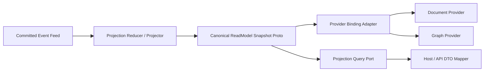

# ReadModel Protobuf-First 全量重构实施蓝图（2026-03-14）

## 1. 文档元信息

- 状态：`Proposed`
- 版本：`R1`
- 日期：`2026-03-14`
- 适用范围：
  - `src/Aevatar.CQRS.Projection.*`
  - `src/Aevatar.Foundation.Projection`
  - `src/Aevatar.Scripting.*`
  - `src/workflow/Aevatar.Workflow.*`
- 关联文档：
  - `docs/CQRS_ARCHITECTURE.md`
  - `docs/EVENT_SOURCING.md`
  - `docs/SCRIPTING_ARCHITECTURE.md`
  - `docs/WORKFLOW.md`
  - `docs/architecture/2026-03-10-workflow-run-event-protobuf-unification-blueprint.md`
  - `docs/architecture/2026-03-14-scripting-runtime-semantics-protobuf-options-detailed-design.md`
- 文档定位：
  - 本文定义“canonical read model 全部 protobuf 化”的目标态与实施路径。
  - 本文明确区分 `canonical read model schema` 与 `provider materialization`。
  - 本文要求保留现有功能，不保留旧的 CLR canonical model 作为长期主路径。

## 2. 背景与关键决策（统一认知）

当前仓库中的 read model 已经处于“半协议化”状态：

1. state、event、callback 主链大量使用 Protobuf。
2. scripting 的 query payload 与部分 snapshot 边界已经使用 `Any` 和 proto 类型。
3. workflow 已经存在 `WorkflowExecutionReportSnapshot` 这样的 proto snapshot。
4. 但 canonical read model 本体仍然大量停留在 CLR class / record。
5. graph/document provider 能力仍通过 `IGraphReadModel`、`IDynamicDocumentIndexedReadModel` 这类 marker interface 挂在 CLR 类型上。

这导致了四个结构性问题：

1. read-side 语义的权威定义不唯一。
2. provider 物化策略污染了 canonical model 本体。
3. query port 往往返回“CLR model 或其映射结果”，而不是统一 proto contract。
4. descriptor/options 已经有了雏形，但未成为 projection runtime 的主驱动。

本次重构的关键决策如下：

1. `canonical read model` 必须全部改为 generated Protobuf message。
2. `provider materialization` 必须保留，但降级为 adapter/binding 层职责。
3. `document index / graph relation / store kind` 等逻辑 read-side 语义应由 proto options 声明。
4. `Elasticsearch / Neo4j / InMemory` 的物理配置仍留在 provider/host 配置层，不进入 canonical proto。
5. 现有用户功能、查询功能、graph/document materialization 功能必须保留。

## 3. 重构目标

本轮只接受以下可验收目标：

1. 仓库内部所有稳定 read model 定义均由 `.proto` 承载，不再以 CLR class/record 作为权威 schema。
2. query port、projection compensation、跨节点/跨模块 read snapshot 统一收发 generated proto message。
3. graph/document provider 仍可用，但不再要求 canonical read model 自己实现 provider marker interface。
4. scripting 与 workflow 两条主链都切到同一套 protobuf-first read model 原则。
5. 新增自动化门禁，禁止再引入新的 CLR canonical read model 与 provider marker 耦合。

## 4. 范围与非范围

### 4.1 范围

1. `workflow` execution report / actor snapshot / actor graph query snapshot 的 canonical contract。
2. `scripting` definition snapshot / catalog snapshot / runtime read model snapshot / evolution snapshot 的 canonical contract。
3. `CQRS.Projection.Runtime` 中 document/graph binding 的驱动方式。
4. `CQRS.Projection` 中基于 CLR marker interface 的 provider capability 表达方式。
5. Host/API 对外 DTO 映射。

### 4.2 非范围

1. 不改变 Elasticsearch、Neo4j、InMemory 的物理存储类型。
2. 不把 HTTP/WS/SSE 对外协议改成 protobuf wire format。
3. 不把 provider 的环境配置迁入 proto options。
4. 不在本轮引入第二套 query 系统或新 runtime。

## 5. 架构硬约束（必须满足）

1. `Query -> ReadModel` 必须读取 canonical protobuf snapshot 或其边界 DTO，不得读取 write-side actor 内部状态。
2. 任何影响稳定查询、业务决策、补偿恢复、跨节点读取的 read model 语义，必须有 proto field 或 typed proto sub-message。
3. graph/document provider 能力不得再由 canonical read model 通过 C# marker interface 暴露。
4. provider binding 只能消费 descriptor、typed options、typed adapter；不得依赖 CLR 类型反射猜语义。
5. `index / relation / store kind` 等逻辑 read-side 声明可以进入 proto options；物理部署参数不得进入 proto options。
6. 不允许 query-time replay、query-time materialization、query-time writeback。
7. 删除优于兼容，不保留空转发与重复模型。

## 6. 当前基线（代码事实）

### 6.1 现有 canonical/read-side 类型仍是 CLR

当前以下类型仍承担 canonical read model 或 snapshot 角色：

1. `src/workflow/Aevatar.Workflow.Projection/ReadModels/WorkflowExecutionReadModel.cs`
2. `src/workflow/Aevatar.Workflow.Application.Abstractions/Queries/WorkflowExecutionQueryModels.cs`
3. `src/Aevatar.Scripting.Projection/ReadModels/ScriptReadModelDocument.cs`
4. `src/Aevatar.Scripting.Projection/ReadModels/ScriptDefinitionSnapshotDocument.cs`
5. `src/Aevatar.Scripting.Projection/ReadModels/ScriptCatalogEntryDocument.cs`
6. `src/Aevatar.Scripting.Projection/ReadModels/ScriptEvolutionReadModel.cs`

### 6.2 provider 能力当前靠 marker interface

当前 provider runtime 直接消费这些接口：

1. `src/Aevatar.CQRS.Projection.Stores.Abstractions/Abstractions/ReadModels/IGraphReadModel.cs`
2. `src/Aevatar.CQRS.Projection.Stores.Abstractions/Abstractions/ReadModels/IDynamicDocumentIndexedReadModel.cs`
3. `src/Aevatar.CQRS.Projection.Stores.Abstractions/Abstractions/ReadModels/IProjectionDocumentMetadataProvider.cs`

直接使用位置：

1. `src/Aevatar.CQRS.Projection.Runtime/Runtime/ProjectionGraphStoreBinding.cs`
2. `src/Aevatar.CQRS.Projection.Providers.Elasticsearch/Stores/ElasticsearchProjectionDocumentStore.cs`

### 6.3 仓库已经存在 proto-first 雏形

现有可复用基础包括：

1. `src/Aevatar.Scripting.Abstractions/Protos/scripting_schema_options.proto`
2. `src/Aevatar.Scripting.Abstractions/Protos/scripting_runtime_options.proto`
3. `src/workflow/Aevatar.Workflow.Projection/workflow_projection_transport.proto`
4. `src/workflow/Aevatar.Workflow.Projection/Orchestration/WorkflowExecutionReportArtifactPayloadMapper.cs`

结论：

1. 仓库并不缺 protobuf 能力。
2. 当前缺的是“用 protobuf 作为唯一 canonical read model 定义”的治理收口。

## 7. 需求分解与状态矩阵

| ID | 需求 | 验收标准 | 当前状态 | 证据 | 差距 |
| --- | --- | --- | --- | --- | --- |
| R1 | canonical read model proto-first | workflow/scripting 主 read snapshot 均为 generated proto | 部分完成 | `workflow_projection_transport.proto`、`ScriptReadModelSnapshot` 边界 | 仍有大量 CLR canonical model |
| R2 | provider 能力与 canonical model 解耦 | 不再需要 `IGraphReadModel` / `IDynamicDocumentIndexedReadModel` 绑定到 canonical type | 未完成 | `ProjectionGraphStoreBinding.cs`、`ElasticsearchProjectionDocumentStore.cs` | runtime 仍依赖 marker interface |
| R3 | query port proto-first | query port 返回 generated proto message | 部分完成 | scripting `Any`/snapshot 已存在 | workflow query 仍大量使用 CLR model |
| R4 | options 驱动 provider 语义 | graph/document 逻辑声明来自 proto options | 部分完成 | `scripting_schema_options.proto` | 仅 scripting 有 options，且 runtime 未统一消费 |
| R5 | 对外 JSON 兼容保留 | Host 输出仍保持 JSON DTO 能力 | 已具备基础 | 各 Host endpoint 已有 DTO/映射能力 | 需从 proto snapshot 映射，而非从 CLR canonical model 映射 |
| R6 | 自动化门禁 | 新增 guard 禁止新 CLR canonical read model 和 marker 耦合 | 未完成 | 现有架构门禁未覆盖此项 | 需补脚本 |

## 8. 差距详解

### 8.1 canonical 与 materialization 混在一起

例如：

1. `WorkflowExecutionReport` 同时承担 canonical snapshot、timeline source、graph node/edge source。
2. `ScriptNativeDocumentReadModel` 同时承担 semantic output 和 ES dynamic index capability。
3. `ScriptNativeGraphReadModel` 同时承担 semantic output 和 graph materialization capability。

这会让 provider 策略侵入业务 schema。

### 8.2 options 已有，但只在 scripting 局部存在

`scripting_schema_options.proto` 已经能表达：

1. `store_kinds`
2. `document_indexes`
3. `graph_relations`

但这些能力仍然只在 scripting schema 世界里存在，尚未成为 `CQRS.Projection.Runtime` 的统一主机制。

### 8.3 workflow 仍以 CLR query model 为主

workflow 当前既有 proto snapshot，也有 CLR query model，这意味着：

1. canonical read model 权威源不唯一。
2. workflow projection query 仍偏向 CLR world。
3. Host DTO 与 canonical snapshot 尚未彻底隔离。

## 9. 目标架构

### 9.1 核心分层

目标态分工：

1. `Canonical ReadModel Snapshot Proto`
   - 只表达稳定业务语义。
2. `Provider Binding Adapter`
   - 负责从 proto snapshot 派生 document/graph 物化对象。
3. `Document/Graph Provider`
   - 只负责存取，不拥有 schema 权威。
4. `Host / API DTO Mapper`
   - 负责 JSON 输出与 UI 友好视图。

### 9.2 provider 语义承载规则

今后将 provider 语义拆成两层：

1. 逻辑 provider 语义：放在 proto options
   - store kinds
   - logical indexes
   - graph relations
   - field-level storage / nullable / semantic hints
2. 物理 provider 配置：放在 host/provider config
   - ES endpoint
   - ES shard/replica/alias
   - Neo4j URI / auth
   - in-memory enable 开关

### 9.3 marker interface 的目标替代

最终替代关系如下：

1. 删除 `IGraphReadModel`
   - 改为 `IProtobufGraphBinding<TSnapshot>` 或 descriptor-driven graph binder
2. 删除 `IDynamicDocumentIndexedReadModel`
   - 改为 `IProtobufDocumentBinding<TSnapshot>` 或 descriptor-driven document binder
3. 保留 `IProjectionDocumentMetadataProvider`
   - 但职责收窄为 provider bootstrap 的物理 metadata，不能再表达 canonical 语义

## 10. 重构工作包（WBS）

### W1. 通用 Projection Proto Options 上提

- 目标：
  - 把 `scripting_schema_options.proto` 中与 read model 通用的 schema options 提炼到中立层。
- 产物：
  - `projection_schema_options.proto`
  - descriptor 解析器
- DoD：
  - workflow/scripting 都能依赖同一份中立 projection schema options

### W2. Scripting Canonical Snapshot Proto 收口

- 目标：
  - `ScriptDefinitionSnapshot`
  - `ScriptCatalogEntrySnapshot`
  - `ScriptReadModelSnapshot`
  - `ScriptEvolutionSnapshot`
  全部变成 generated proto
- 产物：
  - `.proto` 契约
  - partial helper
  - query port 签名切换
- DoD：
  - 不再以 CLR record/class 作为 scripting canonical read snapshot 权威定义

### W3. Workflow Canonical Snapshot Proto 收口

- 目标：
  - `WorkflowExecutionReport`
  - `WorkflowActorSnapshot`
  - `WorkflowActorTimelineItem`
  - `WorkflowActorGraphSubgraph`
  等查询返回收敛为 generated proto
- 产物：
  - `workflow_projection_query_models.proto`
  - mapper 简化
  - Host DTO 映射显式化
- DoD：
  - workflow query/application/projection 主链以 proto snapshot 为权威

### W4. Runtime Binding Descriptor 化

- 目标：
  - 重写 document/graph binding，使其不再依赖 marker interface
- 产物：
  - descriptor-driven binding
  - typed adapter 或 binder registry
- DoD：
  - `ProjectionGraphStoreBinding` / `ElasticsearchProjectionDocumentStore` 不再依赖 canonical CLR type 上的 provider marker interface

### W5. Provider Materialization 保功能迁移

- 目标：
  - 保留 native document / native graph / workflow graph 查询能力
- 产物：
  - from-proto materializer
  - graph/document adapter DTO
- DoD：
  - 用户现有查询与 provider 行为不回退

### W6. 门禁与文档

- 目标：
  - 把 protobuf-first read model 规则写成自动化约束
- 产物：
  - guard script
  - AGENTS/架构文档同步
- DoD：
  - 新增 CLR canonical model 或 marker 耦合时 CI 失败

## 11. 里程碑与依赖

### M1. 契约层收口

依赖：

1. W1
2. W2
3. W3

交付：

1. workflow/scripting canonical snapshot proto 契约齐备

### M2. runtime binding 切换

依赖：

1. M1
2. W4

交付：

1. document/graph binding 切到 descriptor/options 驱动

### M3. Host/API 与 provider 稳定化

依赖：

1. M2
2. W5

交付：

1. 对外 JSON 兼容保持
2. graph/document 现有功能保留

### M4. 门禁闭环

依赖：

1. W6

交付：

1. protobuf-first read model 规则进入 CI

## 12. 验证矩阵（需求 -> 命令 -> 通过标准）

| 需求 | 命令 | 通过标准 |
| --- | --- | --- |
| 契约生成与编译通过 | `dotnet build aevatar.slnx --nologo --tl:off -m:1` | 0 error |
| scripting query/readmodel 回归 | `dotnet test test/Aevatar.Scripting.Core.Tests/Aevatar.Scripting.Core.Tests.csproj --nologo --tl:off -m:1` | 通过 |
| workflow projection/query 回归 | `dotnet test test/Aevatar.Workflow.Application.Tests/Aevatar.Workflow.Application.Tests.csproj --nologo --tl:off -m:1` | 通过 |
| host query endpoint 回归 | `dotnet test test/Aevatar.Workflow.Host.Api.Tests/Aevatar.Workflow.Host.Api.Tests.csproj --nologo --tl:off -m:1` | 通过 |
| 架构边界 | `bash tools/ci/architecture_guards.sh` | 通过 |
| 测试稳定性 | `bash tools/ci/test_stability_guards.sh` | 通过 |
| CQRS/ES 边界 | `bash tools/ci/cqrs_eventsourcing_boundary_guard.sh` | 通过 |

新增 guard 目标：

1. 禁止新的 canonical read model CLR class 出现在 `Application.Abstractions / Projection / Scripting.Core.Ports` 主契约层。
2. 禁止新增 `IGraphReadModel` / `IDynamicDocumentIndexedReadModel` 生产实现。
3. 要求 query port 返回 generated proto snapshot。

## 13. 完成定义（Final DoD）

只有同时满足以下条件，才算本重构完成：

1. workflow/scripting 的 canonical read snapshot 均有 generated proto 权威定义。
2. query port 与跨模块 snapshot 传递不再依赖 CLR canonical model。
3. provider binding 不再以 marker interface 识别 canonical model。
4. graph/document 现有功能保留。
5. Host 外部 JSON 能力保留。
6. build/test/architecture guards 全通过。
7. 文档与门禁已同步。

## 14. 风险与应对

### 14.1 主要风险

1. 一次性切换面大，编译面广。
2. workflow host tests 对 JSON 形状敏感。
3. graph/document provider 逻辑被错误上推到 proto options。
4. scripting 与 workflow 可能各自长出一套 descriptor 解析器。

### 14.2 应对策略

1. 先收口 canonical snapshot proto，再切 runtime binding。
2. Host 层显式 DTO 映射，避免 proto 字段名泄漏。
3. 中立 projection options 上提，禁止 workflow 直接依赖 scripting 专用 options。
4. runtime binding 做成公共能力，不在业务模块重复实现。

## 15. 执行清单（可勾选）

- [ ] 上提通用 projection schema options 到中立层
- [ ] 为 workflow 补齐 canonical query snapshot proto
- [ ] 为 scripting 补齐 canonical read snapshot proto
- [ ] 删除 workflow/scripting 中对 CLR canonical read model 的权威依赖
- [ ] 引入 descriptor-driven document binding
- [ ] 引入 descriptor-driven graph binding
- [ ] 将 native document/native graph 保留为 adapter 产物
- [ ] 将 Host 查询端点改为 `proto -> DTO -> JSON`
- [ ] 增加 protobuf-first read model guard
- [ ] 跑完整 build/test/guard

## 16. 当前执行快照（2026-03-14）

当前判断如下：

1. 方向已经明确：canonical read model 应全部改成 protobuf。
2. 仓库已有足够基础：scripting options、workflow proto snapshot、Host DTO 层都可复用。
3. 当前尚未完成的核心，不是“能不能生成 proto”，而是“runtime binding 仍依赖 CLR marker interface”。
4. 真正的工作量集中在 `CQRS.Projection.Runtime` 的 binding 收口，以及 workflow/scripting canonical snapshot 的全面替换。

## 17. 变更纪律

1. 每完成一个工作包，必须同步更新本文状态矩阵与执行清单。
2. 不允许新增第二套 read model 主链路。
3. 不允许为了 provider 方便，把物理配置塞入 proto options。
4. 不允许为了兼容旧测试，长期保留 CLR canonical model 与 proto canonical model 双轨并存。
5. 若新增 read-side 架构规则，必须同步补 guard，而不是只写文档。
