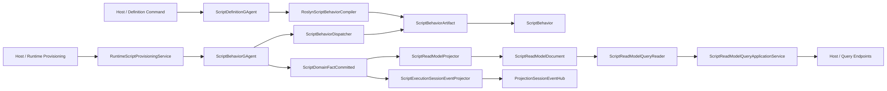

# Scripting GAgent 行为等价重构实施收口（2026-03-14）

## 1. 文档元信息

- 状态：Implemented
- 版本：R1
- 日期：2026-03-14
- 关联文档：
  - `docs/SCRIPTING_ARCHITECTURE.md`
  - `docs/architecture/2026-03-13-scripting-gagent-behavior-parity-refactor-blueprint.md`
  - `docs/architecture/2026-03-13-scripting-gagent-behavior-parity-detailed-design.md`
  - `docs/architecture/2026-03-14-scripting-typed-authoring-surface-detailed-design.md`
- 结论：
  - `scripting` 已从 `package-runtime + payload bag` 架构切换到 `typed ScriptBehavior<TState,TReadModel> + behavior-hosted GAgent + committed fact + projection-owned read model + query facade`。
  - wrapper 继续保留，但能力面已经提升到与静态 `GAgent` 同一治理口径。
  - typed authoring surface 已落地，脚本作者默认不再直接实现旧 bridge 接口，也不再手写 contract/type URL。

## 2. 文档状态判定

- `2026-03-13-scripting-gagent-behavior-parity-refactor-blueprint.md`
  - 仍然是历史蓝图与差距基线，描述“改造前问题”和“目标态要求”，不代表当前代码现状。
- `2026-03-13-scripting-gagent-behavior-parity-detailed-design.md`
  - 仍然是第一阶段详细设计记录，包含若干已被 typed authoring surface 收敛后的中间命名。
- `2026-03-14-scripting-typed-authoring-surface-detailed-design.md`
  - 已按当前实现落地，应与本文一起阅读。
- 本文
  - 作为当前仓库状态的收口文档，优先级高于上述两份 `Proposed` 历史设计文档。

## 3. 生效架构

## 4. 已实施的关键变更

### 4.1 写侧

1. 删除 `IScriptPackageRuntime / ScriptRuntimeGAgent / ScriptRuntimeExecutionOrchestrator` 旧链路。
2. 定义编译结果统一落到 `ScriptBehaviorDescriptor + ScriptGAgentContract`。
3. 运行 actor 改为 `ScriptBehaviorGAgent`，启动时绑定 revision，不再 run 时回查 definition 再拼执行器。
4. 统一 dispatch 骨架收敛到 `ScriptBehaviorDispatcher`。

### 4.2 Authoring Surface

1. 脚本作者主入口已经变为 `ScriptBehavior<TState,TReadModel>`。
2. 注册式 authoring API 已收敛到 `IScriptBehaviorBuilder<TState,TReadModel>`：
   - `OnCommand<TCommand>(...)`
   - `OnSignal<TSignal>(...)`
   - `OnEvent<TEvent>(apply, reduce)`
   - `OnQuery<TQuery, TResult>(...)`
   - `DescribeReadModel(...)`
3. runtime bridge 仍然存在，但已经退到宿主内部实现细节：
   - `IScriptBehaviorBridge`
   - `ScriptBehaviorDescriptor`
   - `IProtobufMessageCodec`
4. `ScriptGAgentContract` 继续保留，但它由 descriptor 自动导出，不再是脚本作者手写接口。

### 4.3 读侧

1. 删除 `ScriptExecutionReadModel` 与 `ReadModelPayloads` 快照复制式投影。
2. 新读模型根对象为 `ScriptReadModelDocument`。
3. execution projection 改为正式 lifecycle port：
   - `IScriptExecutionProjectionPort`
   - `ScriptExecutionProjectionPortService`
   - `ContextProjectionActivationService<ScriptExecutionRuntimeLease, ScriptExecutionProjectionContext, IReadOnlyList<string>>`
   - `ContextProjectionReleaseService<ScriptExecutionRuntimeLease, ScriptExecutionProjectionContext, IReadOnlyList<string>>`
4. live sink 通过 `ScriptExecutionSessionEventProjector + ScriptExecutionSessionEventCodec` 接入统一 session event hub。

### 4.4 查询

1. 正式查询端口为 `IScriptReadModelQueryPort`。
2. 查询实现为 `ScriptReadModelQueryReader + ScriptReadModelQueryService + ScriptReadModelQueryApplicationService`。
3. Host 暴露 execution query/readmodel 入口：
   - `GET /api/scripts/runtimes/`
   - `GET /api/scripts/runtimes/{actorId}/readmodel`
   - `POST /api/scripts/runtimes/{actorId}/queries`

### 4.5 内存投影存储修正

1. `ScriptReadModelDocument` 含 `Any`，默认 JSON 克隆会破坏 `ByteString`。
2. 本轮新增 `IProjectionReadModelCloneable<TReadModel>`。
3. `InMemoryProjectionDocumentStore` 优先走显式 `DeepClone()`，不再假设 JSON 可正确复制所有 read model。

### 4.6 测试收口

1. `Claim* / Hybrid* / WorkflowYamlScriptParity*` 已全部改回当前 typed scripting 主线。
2. 之前被删掉的 evolution 集成测试已补回：
   - `ScriptExternalEvolutionE2ETests`
   - `ScriptAutonomousEvolutionE2ETests`
   - `ScriptAutonomousEvolutionComprehensiveE2ETests`
   - `ScriptAutonomousEvolutionOrleans3ClusterConsistencyTests`
3. Orleans 三节点测试保留环境变量门禁：
   - `AEVATAR_TEST_ORLEANS_3NODE=1`

## 5. 语义口径

### 5.1 committed fact

- 写侧提交的权威事实是 `ScriptDomainFactCommitted`。
- projection 只消费 committed fact，不再消费写侧快照。

### 5.2 live sink

- execution projection live sink 接收的是 projection 正规化后的 `EventEnvelope`。
- 对 committed 事实而言，`EventEnvelope.Payload` 直接是 `ScriptDomainFactCommitted`，不是外层 `CommittedStateEventPublished`。

### 5.3 read model

- 当前 persisted read model 仍是容器式 document root：`ScriptReadModelDocument`。
- 但它已经是正式、一等的 read-side root，不再是临时 `Dictionary<string, Any>` bag。

### 5.4 行为与 authoring 的边界

- 脚本作者直接面对的强类型表面是：
  - `ScriptBehavior<TState,TReadModel>`
  - `IScriptBehaviorBuilder<TState,TReadModel>`
  - `ScriptCommandContext<TState>`
  - `ScriptQueryContext<TReadModel>`
  - `ScriptFactContext`
- `Any` 只保留在宿主边界、持久化边界和跨 actor/query 边界，不再是脚本默认 authoring 模型。

## 6. 关键文件

### 6.1 新增

- `src/Aevatar.Scripting.Abstractions/Behaviors/ScriptBehavior.cs`
- `src/Aevatar.Scripting.Abstractions/Behaviors/IScriptBehaviorBuilder.cs`
- `src/Aevatar.Scripting.Abstractions/Behaviors/IScriptBehaviorBridge.cs`
- `src/Aevatar.Scripting.Abstractions/Behaviors/ScriptBehaviorDescriptor.cs`
- `src/Aevatar.Scripting.Abstractions/Behaviors/ScriptGAgentContract.cs`
- `src/Aevatar.Scripting.Abstractions/Queries/ScriptExecutionProjectionContracts.cs`
- `src/Aevatar.Scripting.Abstractions/Queries/IScriptReadModelQueryPort.cs`
- `src/Aevatar.Scripting.Application/Runtime/ScriptBehaviorDispatcher.cs`
- `src/Aevatar.Scripting.Application/Runtime/ScriptBehaviorRuntimeCapabilities.cs`
- `src/Aevatar.Scripting.Application/Runtime/ScriptBehaviorRuntimeCapabilityFactory.cs`
- `src/Aevatar.Scripting.Core/ScriptBehaviorGAgent.cs`
- `src/Aevatar.Scripting.Infrastructure/Compilation/RoslynScriptBehaviorCompiler.cs`
- `src/Aevatar.Scripting.Infrastructure/Compilation/ScriptBehaviorLoader.cs`
- `src/Aevatar.Scripting.Projection/Projectors/ScriptReadModelProjector.cs`
- `src/Aevatar.Scripting.Projection/Projectors/ScriptExecutionSessionEventProjector.cs`
- `src/Aevatar.Scripting.Projection/Queries/ScriptReadModelQueryReader.cs`
- `src/Aevatar.Scripting.Projection/Orchestration/ScriptExecutionProjectionPortService.cs`
- `src/Aevatar.Scripting.Projection/Orchestration/ScriptExecutionSessionEventCodec.cs`
- `src/Aevatar.Scripting.Projection/ReadModels/ScriptReadModelDocument.cs`
- `src/Aevatar.CQRS.Projection.Stores.Abstractions/Abstractions/ReadModels/IProjectionReadModelCloneable.cs`

### 6.2 删除

- `src/Aevatar.Scripting.Abstractions/Definitions/IScriptPackageRuntime.cs`
- `src/Aevatar.Scripting.Core/ScriptRuntimeGAgent.cs`
- `src/Aevatar.Scripting.Application/Runtime/ScriptRuntimeExecutionOrchestrator.cs`
- `src/Aevatar.Scripting.Projection/Projectors/ScriptExecutionReadModelProjector.cs`
- `src/Aevatar.Scripting.Projection/ReadModels/ScriptExecutionReadModel.cs`
- `src/Aevatar.Scripting.Projection/Reducers/ScriptRunDomainEventCommittedReducer.cs`

## 7. 验证

- `dotnet build aevatar.slnx --nologo`
  - 通过
  - 备注：存在 1 个现有 warning，位于 `test/Aevatar.CQRS.Projection.Core.Tests/ProjectionOwnershipProtoCoverageTests.cs`
- `dotnet test aevatar.slnx --nologo`
  - 通过
- `bash tools/ci/architecture_guards.sh`
  - 通过
- `bash tools/ci/test_stability_guards.sh`
  - 通过
- `bash tools/ci/solution_split_guards.sh`
  - 通过
- `bash tools/ci/solution_split_test_guards.sh`
  - 通过
- `bash tools/ci/projection_route_mapping_guard.sh`
  - 通过

## 8. 当前完成度结论

- 第一阶段 `behavior parity`：已完成。
- 第二阶段 `typed authoring surface`：已完成。
- execution read model/query facade：已完成。
- evolution/claim/hybrid/parity 回归测试：已补齐并回到当前主线。
- 唯一保留的条件性验证项是 Orleans 三节点测试，它不是未完成，而是按环境变量显式启用。
