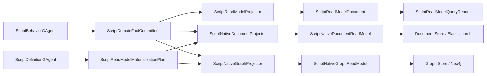
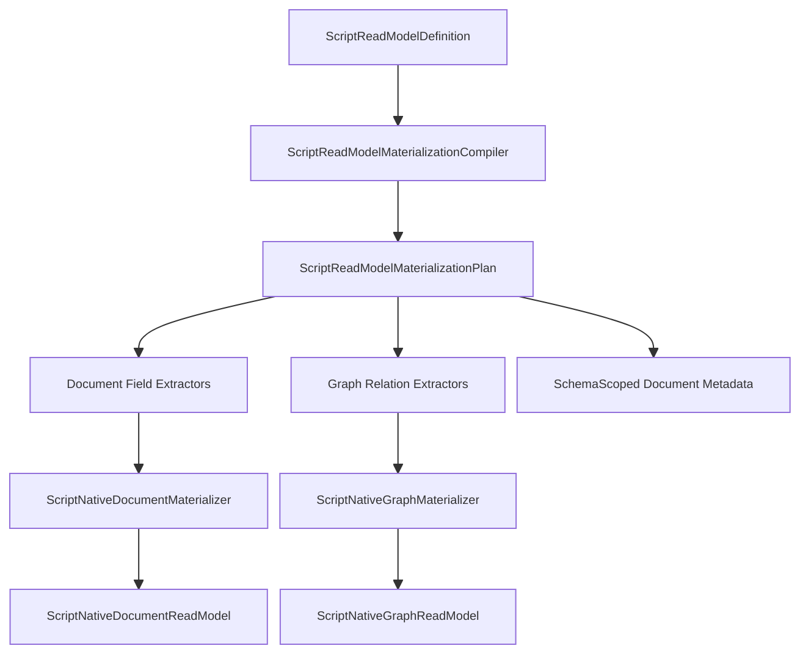
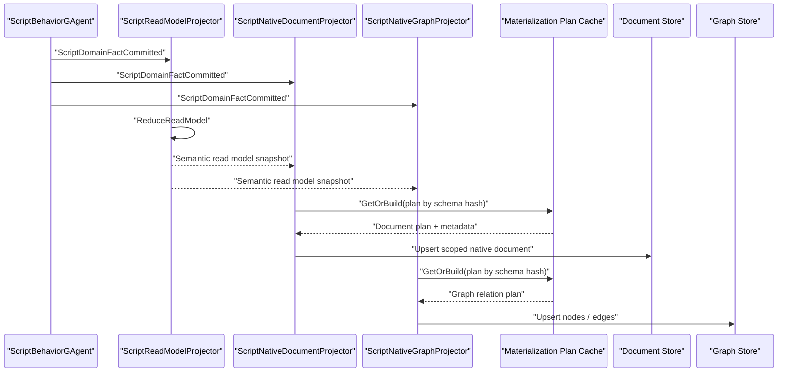

# Scripting Native ReadModel Materialization 详细重构方案（2026-03-14）

## 1. 文档元信息

- 状态：Proposed
- 版本：R1
- 日期：2026-03-14
- 适用范围：
  - `src/Aevatar.Scripting.Abstractions`
  - `src/Aevatar.Scripting.Core`
  - `src/Aevatar.Scripting.Application`
  - `src/Aevatar.Scripting.Projection`
  - `src/Aevatar.Scripting.Hosting`
  - `src/Aevatar.CQRS.Projection.Runtime`
  - `src/Aevatar.CQRS.Projection.Stores.Abstractions`
  - `src/Aevatar.CQRS.Projection.Providers.Elasticsearch`
- 关联文档：
  - `docs/SCRIPTING_ARCHITECTURE.md`
  - `docs/architecture/2026-03-14-scripting-gagent-behavior-parity-implementation-closeout.md`
  - `docs/architecture/2026-03-14-scripting-typed-authoring-surface-detailed-design.md`
- 文档定位：
  - 本文只讨论一件事：把 `scripting` 的 read model 从“语义上已强类型，但存储上仍是统一 document 容器”推进到“支持原生 document index / graph relation materialization”。
  - 本文不考虑兼容性，允许直接扩展 Projection Runtime 抽象、调整 `scripting` 读侧项目结构，并删除没有业务价值的过渡层。
  - 本文不是 `behavior parity` 的重复版；它解决的是 `read side nativeization`，不是 write-side actor 语义。

## 2. 问题定义

当前 `scripting` 已经完成两件关键重构：

1. 写侧变为 `ScriptBehaviorGAgent -> ScriptDomainFactCommitted`
2. authoring surface 变为 `ScriptBehavior<TState,TReadModel>`

但 read side 还停在“语义 contract 已存在、原生物化未完成”的中间态。

### 2.1 当前已具备的能力

1. 脚本可以声明 `ScriptReadModelDefinition`，包含 `Fields / Indexes / Relations`
2. Definition 侧会提取 schema，并做 `Document / Graph` store capability 校验
3. committed fact 已统一为 `ScriptDomainFactCommitted`
4. `ScriptReadModelProjector` 会基于 committed fact 真正调用 `ReduceReadModel(...)`
5. `ScriptReadModelQueryReader` 已形成正式 query facade

### 2.2 当前缺失的能力

1. `Indexes` 只停留在 schema 声明，没有自动下推到 provider-native document metadata
2. `Relations` 只停留在 schema 声明，没有自动物化为 `IGraphReadModel` 的 `GraphNodes / GraphEdges`
3. persisted read model 仍只有一个统一容器：
   - `ScriptReadModelDocument`
   - `ReadModelPayload : Any`
4. query 仍然主要围绕语义 read model 根对象，不具备原生 index / graph query 优势

### 2.3 当前代码事实

当前仓库状态可以概括为：

1. `ScriptReadModelDefinition` 已定义字段、索引、关系：
   - `src/Aevatar.Scripting.Abstractions/Definitions/ScriptReadModelDefinition.cs`
2. `ScriptReadModelDefinitionExtractor` 已把它转成 `ScriptReadModelSchemaSpec`：
   - `src/Aevatar.Scripting.Core/Compilation/ScriptReadModelDefinitionExtractor.cs`
3. `DefaultScriptReadModelSchemaActivationPolicy` 只校验所需 store kind 是否存在：
   - `src/Aevatar.Scripting.Core/Schema/DefaultScriptReadModelSchemaActivationPolicy.cs`
4. `ScriptReadModelProjector` 只更新 `ScriptReadModelDocument`：
   - `src/Aevatar.Scripting.Projection/Projectors/ScriptReadModelProjector.cs`
5. `ScriptReadModelDocument` 本身不实现 `IGraphReadModel`，也没有 document metadata provider：
   - `src/Aevatar.Scripting.Projection/ReadModels/ScriptReadModelDocument.cs`

因此，当前设计是：

- 有 schema
- 有 validation
- 有语义 read model
- 没有 native materialization

## 3. 目标与非目标

### 3.1 目标

本轮重构必须达到：

1. `ScriptReadModelDefinition.Indexes` 自动生成 provider-native document index metadata
2. `ScriptReadModelDefinition.Relations` 自动生成 graph nodes / edges materialization
3. `scripting` 继续走统一 Projection Pipeline，不引入第二套读侧框架
4. 语义 read model query 与 native materialization 各自职责清晰，不混在一个对象里
5. 支持多个脚本 schema 并存，不能因为一个共享 CLR 类型而把所有脚本塞进同一固定 mapping

### 3.2 非目标

本轮不做以下事情：

1. 不为每个脚本生成一套专属 CLR read model 类型
2. 不把 `ScriptBehaviorGAgent` 变成泛型 actor
3. 不放弃当前 `ScriptReadModelDocument` 语义查询根
4. 不让 Host API 直接暴露 Elasticsearch / Neo4j 的 provider-specific 协议
5. 不把图查询强塞进现有 `IScriptReadModelQueryPort`；图查询可独立设计为后续扩展

## 4. 关键设计判断

### 4.1 最佳路线不是“每脚本一套 CLR 类型”

最直观的想法是“每个脚本直接生成原生 CLR read model 类型，再挂 document metadata provider / graph interface”。  
这条路理论上最原生，但在当前仓库里并不是最佳实现：

1. 动态脚本 revision 数量不受控
2. 多节点运行需要稳定部署和类型分发
3. Projection Runtime 当前按 CLR 类型装配 metadata provider，动态类型扩散会明显抬高复杂度
4. 问题本质不是缺少 CLR 类型，而是缺少“schema 到 provider-native materialization”的编译层

因此，最佳路线是：

1. 保留单一语义根 `ScriptReadModelDocument`
2. 增加两个 provider-facing sidecar read model：
   - native document materialization
   - native graph materialization
3. 用 schema compiler 和 materializer 在 projection 阶段生成 sidecar

### 4.2 正确边界：语义根与物化侧车分离

本轮设计要求明确区分三类对象：

1. **语义根 read model**
   - 面向业务 query、脚本 query handler、host snapshot
   - 当前对象：`ScriptReadModelDocument`
2. **native document sidecar**
   - 面向 Elasticsearch 等文档索引
   - 从 schema 中的 `Fields / Indexes` 派生
3. **native graph sidecar**
   - 面向 Neo4j 等关系图
   - 从 schema 中的 `Relations` 派生

这三者不是一回事，不能强行塞进一个 read model 类型。

## 5. 目标架构

### 5.1 总体架构图



### 5.2 设计总图



### 5.3 时序图



## 6. 面向对象、继承与范型设计

### 6.1 继承策略

这一轮 read model 原生化，真正需要的“继承关系”不是业务 read model 自己互相继承，而是 provider-facing 接口继承。

应采用：

1. `ScriptReadModelDocument : IProjectionReadModel`
2. `ScriptNativeDocumentReadModel : IProjectionReadModel`
3. `ScriptNativeGraphReadModel : IGraphReadModel`

不采用：

1. `BaseScriptReadModel -> UserReadModel -> NativeReadModel`
2. `ScriptBehaviorGAgent<TReadModel>`
3. `ScriptReadModelDocument<TSchema>`

结论是：

- **业务语义用组合**
- **provider 能力用接口继承**
- **脚本 authoring 不暴露 provider 细节**

### 6.2 范型策略

本轮新增的 materialization 层尽量避免泛型爆炸。

保持泛型的地方：

1. `ScriptBehavior<TState,TReadModel>`：authoring 层
2. Projection store 抽象：仓库已有泛型骨架

禁止继续泛型化的地方：

1. `ScriptNativeDocumentProjector<TReadModel>`
2. `ScriptNativeGraphProjector<TReadModel>`
3. `IScriptReadModelMaterializer<TSchema,TProvider,TField>`

materialization 应走“compiled plan + non-generic execution”模式。

### 6.3 设计模式

本轮明确采用：

1. `Compiler`：把 schema definition 编译成 materialization plan
2. `Strategy`：document / graph materializer 分离
3. `Sidecar ReadModel`：语义根与 provider-native sidecar 分离
4. `Cache`：按 `schema hash` 缓存 materialization plan
5. `Bridge`：Projection Runtime 在 document metadata 解析处补动态 index scope 能力

## 7. 核心抽象设计

### 7.1 Scripting 新抽象

#### 7.1.1 Materialization Plan

新增：

- `ScriptReadModelMaterializationPlan`
- `ScriptDocumentFieldExtractionPlan`
- `ScriptGraphRelationExtractionPlan`
- `ScriptSchemaScopedDocumentMetadata`

职责：

1. 把 `ScriptReadModelDefinition` 变成运行时可执行计划
2. 预编译 protobuf path 访问器
3. 预生成 document index metadata
4. 预生成 graph node / edge 提取规则

#### 7.1.2 Compiler

新增：

- `IScriptReadModelMaterializationCompiler`
- `ScriptReadModelMaterializationCompiler`

职责：

1. 校验 `Field.Path / Relation.SourcePath / Relation.TargetPath`
2. 确保 path 对应 `TReadModel` 的 protobuf descriptor
3. 产出编译后 plan
4. 以 `schema hash` 为键缓存 plan

#### 7.1.3 Materializer

新增：

- `IScriptNativeDocumentMaterializer`
- `IScriptNativeGraphMaterializer`

职责：

1. 基于 semantic read model snapshot 和 compiled plan 提取 provider-native 结构
2. 不重新做业务 reduce
3. 只做“结构化投影转换”

### 7.2 Projection Runtime 新抽象

当前 `IProjectionDocumentMetadataProvider<TReadModel>` 是按 CLR 类型返回固定 metadata。  
这对 workflow 这种静态 read model 没问题，但对 scripting 的“每个 schema 一套 index mapping”不够。

因此需要新增一层动态 metadata 能力。

#### 7.2.1 Dynamic Document Scope

新增：

- `IDynamicDocumentIndexedReadModel`

建议定义：

```csharp
public interface IDynamicDocumentIndexedReadModel : IProjectionReadModel
{
    string DocumentIndexScope { get; }
}
```

职责：

1. 让一个 CLR read model 类型在运行时选择实际 index scope
2. 允许多个脚本 schema 共用一个 CLR 类型，但各自使用不同 index

#### 7.2.2 Dynamic Metadata Provider

新增：

- `IProjectionDynamicDocumentMetadataProvider<TReadModel>`

建议定义：

```csharp
public interface IProjectionDynamicDocumentMetadataProvider<in TReadModel>
    where TReadModel : class, IProjectionReadModel
{
    DocumentIndexMetadata Resolve(TReadModel readModel);
}
```

职责：

1. 从 read model 实例上解析 index name / mappings / settings / aliases
2. 支持 scripting 这种“同 CLR 类型，不同 schema mapping”的场景

#### 7.2.3 Resolver / Store 更新

需更新：

1. `ProjectionDocumentMetadataResolver`
2. `ProjectionDocumentStoreBinding<TReadModel,TKey>`
3. `ElasticsearchProjectionDocumentStore<TReadModel,TKey>`

目标：

1. 先尝试动态 metadata provider
2. 再回退到现有静态 `IProjectionDocumentMetadataProvider<TReadModel>`
3. Elasticsearch 侧以 `DocumentIndexScope` 为粒度做 index initialization 缓存

### 7.3 Graph 侧抽象

graph 侧相对简单，因为仓库已有：

- `IGraphReadModel`
- `ProjectionGraphStoreBinding<TReadModel,TKey>`

因此本轮无需重做 graph store binding，只需新增：

- `ScriptNativeGraphReadModel : IGraphReadModel`
- `ScriptNativeGraphProjector`

图侧的关键不在 store 抽象，而在 relation -> node/edge 的提取计划。

## 8. 数据模型设计

### 8.1 Semantic Read Model

保留现有：

- `ScriptReadModelDocument`

职责不变：

1. 作为脚本业务 query 的权威语义根
2. 保留 `ReadModelPayload`
3. 保持 `ScriptReadModelQueryReader` 的既有契约

### 8.2 Native Document Sidecar

新增：

- `ScriptNativeDocumentReadModel`

建议字段：

1. `Id`
2. `ScriptId`
3. `DefinitionActorId`
4. `Revision`
5. `SchemaId`
6. `SchemaVersion`
7. `SchemaHash`
8. `DocumentIndexScope`
9. `Fields`
10. `StateVersion`
11. `LastEventId`
12. `UpdatedAt`

其中 `Fields` 可以是：

- `Dictionary<string, object?>`

这里允许使用字典，因为它位于 provider-native open schema 边界，不是业务内核 bag。  
字段集合由 `ScriptReadModelDefinition` 严格驱动，不是任意 metadata dumping。

### 8.3 Native Graph Sidecar

新增：

- `ScriptNativeGraphReadModel : IGraphReadModel`

建议字段：

1. `Id`
2. `ScriptId`
3. `DefinitionActorId`
4. `Revision`
5. `SchemaId`
6. `SchemaVersion`
7. `GraphScope`
8. `GraphNodes`
9. `GraphEdges`
10. `StateVersion`
11. `LastEventId`
12. `UpdatedAt`

## 9. Path / Schema 编译规则

### 9.1 Path 语法

当前 `ScriptReadModelDefinition.Path` 是字符串，但本轮必须把它收敛成受控 DSL。

建议仅支持：

1. `field`
2. `field.sub_field`
3. `repeated_field[]`
4. `repeated_field[].sub_field`

明确不支持：

1. 任意 JSONPath
2. 任意脚本表达式
3. provider-specific path 语法

### 9.2 编译校验

compiler 必须在 definition upsert 阶段直接拒绝：

1. path 指向不存在字段
2. path 类型与声明 `Field.Type` 不一致
3. relation source/target path 非法
4. relation cardinality 与源字段重复性不一致
5. index paths 跨 schema 未定义字段

### 9.3 类型支持

首轮建议支持：

1. `string`
2. `bool`
3. `int32/int64`
4. `double`
5. `enum`
6. `timestamp`
7. `repeated scalar`

首轮不支持：

1. 任意 nested message 全量索引
2. map field 自动展开
3. `oneof` 上的模糊路径

## 10. Projection 设计

### 10.1 保留现有 semantic projector

`ScriptReadModelProjector` 继续负责：

1. 语义 `ReduceReadModel`
2. 更新 `ScriptReadModelDocument`

它不直接承担 provider-native materialization。

### 10.2 新增 Native Document Projector

新增：

- `ScriptNativeDocumentProjector`

职责：

1. 读取最新 semantic read model snapshot
2. 获取 compiled materialization plan
3. 提取 schema 中声明的 indexed fields
4. 产出 `ScriptNativeDocumentReadModel`
5. 写入 document store

### 10.3 新增 Native Graph Projector

新增：

- `ScriptNativeGraphProjector`

职责：

1. 读取最新 semantic read model snapshot
2. 获取 compiled relation plan
3. 生成 `ProjectionGraphNode / ProjectionGraphEdge`
4. 产出 `ScriptNativeGraphReadModel`
5. 交给现有 `ProjectionGraphStoreBinding` 写图

### 10.4 一致性原则

这三个 projector 必须消费同一 committed fact feed，不允许：

1. document nativeization 读 actor state
2. graph nativeization 直接 query runtime actor
3. graph side单独订阅 command 或 internal signal

统一原则仍是：

- `committed fact -> multiple projectors`

## 11. Query 设计

### 11.1 保持现有业务 query 口径

保留：

- `IScriptReadModelQueryPort`
- `ScriptReadModelQueryReader`

它继续面向：

1. `ScriptBehavior` 自己声明的 query
2. host readmodel snapshot
3. 业务语义查询

### 11.2 新增 Native Query Port

建议新增但不强制首轮完全实现：

1. `IScriptNativeDocumentQueryPort`
2. `IScriptNativeGraphQueryPort`

用途：

1. 让 Host / admin / analytics 场景可以直接利用原生索引
2. 不污染脚本 authoring surface

### 11.3 查询边界

业务 query 和 provider query 绝不能混为一个 port。

原因：

1. 前者是脚本协议的一部分
2. 后者是基础设施能力的一部分
3. 前者必须 runtime-neutral
4. 后者允许 provider-specific optimization

## 12. 精确到文件的变更清单

### 12.1 新增文件

#### Scripting

1. `src/Aevatar.Scripting.Projection/ReadModels/ScriptNativeDocumentReadModel.cs`
2. `src/Aevatar.Scripting.Projection/ReadModels/ScriptNativeGraphReadModel.cs`
3. `src/Aevatar.Scripting.Projection/Projectors/ScriptNativeDocumentProjector.cs`
4. `src/Aevatar.Scripting.Projection/Projectors/ScriptNativeGraphProjector.cs`
5. `src/Aevatar.Scripting.Core/Materialization/IScriptReadModelMaterializationCompiler.cs`
6. `src/Aevatar.Scripting.Core/Materialization/ScriptReadModelMaterializationCompiler.cs`
7. `src/Aevatar.Scripting.Core/Materialization/ScriptReadModelMaterializationPlan.cs`
8. `src/Aevatar.Scripting.Core/Materialization/ScriptDocumentFieldExtractionPlan.cs`
9. `src/Aevatar.Scripting.Core/Materialization/ScriptGraphRelationExtractionPlan.cs`
10. `src/Aevatar.Scripting.Core/Materialization/IScriptNativeDocumentMaterializer.cs`
11. `src/Aevatar.Scripting.Core/Materialization/IScriptNativeGraphMaterializer.cs`
12. `src/Aevatar.Scripting.Core/Materialization/ScriptNativeDocumentMaterializer.cs`
13. `src/Aevatar.Scripting.Core/Materialization/ScriptNativeGraphMaterializer.cs`
14. `src/Aevatar.Scripting.Core/Materialization/ScriptReadModelPathCompiler.cs`
15. `src/Aevatar.Scripting.Core/Materialization/ScriptReadModelPathAccessor.cs`
16. `src/Aevatar.Scripting.Projection/Queries/IScriptNativeDocumentQueryPort.cs`
17. `src/Aevatar.Scripting.Projection/Queries/IScriptNativeGraphQueryPort.cs`

#### Projection Runtime

1. `src/Aevatar.CQRS.Projection.Stores.Abstractions/Abstractions/ReadModels/IDynamicDocumentIndexedReadModel.cs`
2. `src/Aevatar.CQRS.Projection.Stores.Abstractions/Abstractions/ReadModels/IProjectionDynamicDocumentMetadataProvider.cs`

### 12.2 更新文件

#### Scripting

1. `src/Aevatar.Scripting.Core/Compilation/ScriptReadModelDefinitionExtractor.cs`
2. `src/Aevatar.Scripting.Core/ScriptDefinitionGAgent.cs`
3. `src/Aevatar.Scripting.Projection/DependencyInjection/ServiceCollectionExtensions.cs`
4. `src/Aevatar.Scripting.Hosting/DependencyInjection/ServiceCollectionExtensions.cs`
5. `src/Aevatar.Scripting.Projection/Projectors/ScriptReadModelProjector.cs`

#### Projection Runtime

1. `src/Aevatar.CQRS.Projection.Runtime/Runtime/ProjectionDocumentMetadataResolver.cs`
2. `src/Aevatar.CQRS.Projection.Runtime/Runtime/ProjectionDocumentStoreBinding.cs`
3. `src/Aevatar.CQRS.Projection.Providers.Elasticsearch/Stores/ElasticsearchProjectionDocumentStore.Indexing.cs`

### 12.3 可删除文件

本轮不强制删除现有 `ScriptReadModelDocument` 相关代码，因为它仍然承担业务 query 根职责。  
若后续新增了无价值的“native materialization forwarding wrapper”，应直接删除，不保留空壳。

## 13. 实施顺序

### Phase 1. Path Compiler 与 Plan Compiler

完成：

1. schema path DSL 收敛
2. protobuf descriptor 校验
3. compiled materialization plan

### Phase 2. Document Dynamic Metadata Infrastructure

完成：

1. `IDynamicDocumentIndexedReadModel`
2. `IProjectionDynamicDocumentMetadataProvider<TReadModel>`
3. Projection Runtime / Elasticsearch 适配

### Phase 3. Native Document Projector

完成：

1. `ScriptNativeDocumentReadModel`
2. `ScriptNativeDocumentProjector`
3. schema-scoped index initialization

### Phase 4. Native Graph Projector

完成：

1. `ScriptNativeGraphReadModel`
2. relation -> node/edge materialization
3. graph lifecycle cleanup 验证

### Phase 5. Query / Host / 文档收口

完成：

1. admin query port
2. host inspection endpoint
3. 文档、图、测试、CI guard 同步

## 14. 测试策略

### 14.1 单元测试

必须新增：

1. schema path compiler tests
2. field extraction plan tests
3. relation extraction plan tests
4. dynamic metadata resolver tests
5. schema-scoped Elasticsearch metadata tests
6. graph node/edge normalization tests

### 14.2 集成测试

必须覆盖：

1. 同一脚本 schema 的 native document index 初始化
2. 不同脚本 schema 使用不同 index scope，不发生 mapping 污染
3. relation 变更后 graph edge 正确新增/删除
4. semantic query 与 native materialization 同步推进
5. Claim / Hybrid / WorkflowYamlScriptParity 这类已有脚本主线回归继续通过

### 14.3 守卫

建议新增：

1. 禁止 `ScriptReadModelDefinition.Indexes/Relations` 新增后没有对应 materialization tests
2. 禁止 scripting native document projector 直接读取 actor state
3. 禁止 scripting graph projector 消费 inbound command 而非 committed fact

## 15. 完成定义

满足以下条件，才算本轮重构完成：

1. `ScriptReadModelDefinition.Indexes` 能实际生成 provider-native document index metadata
2. `ScriptReadModelDefinition.Relations` 能实际生成 graph nodes / edges
3. 不同脚本 schema 可以并存，不共享错误 mapping
4. semantic query 主链不回退、不丢失
5. build / test / architecture guards 通过
6. `docs/SCRIPTING_ARCHITECTURE.md` 与实现收口文档同步更新

## 16. 最终结论

当前 `scripting` 的 read model 还不是“原生物化完成态”，而是“语义强类型已落地，native materialization 未落地”。

正确的下一步不是强迫每个脚本生成一套 CLR read model 类型，而是：

1. 保留现有语义 read model 根
2. 新增 document / graph sidecar materialization
3. 在 Projection Runtime 补动态 index scope 与 dynamic metadata 能力
4. 让 schema 中的 `indexes / relations` 真正进入 provider-native store

这条路线最符合当前仓库的分层、Projection Runtime 复用方式和动态脚本运行模型。
