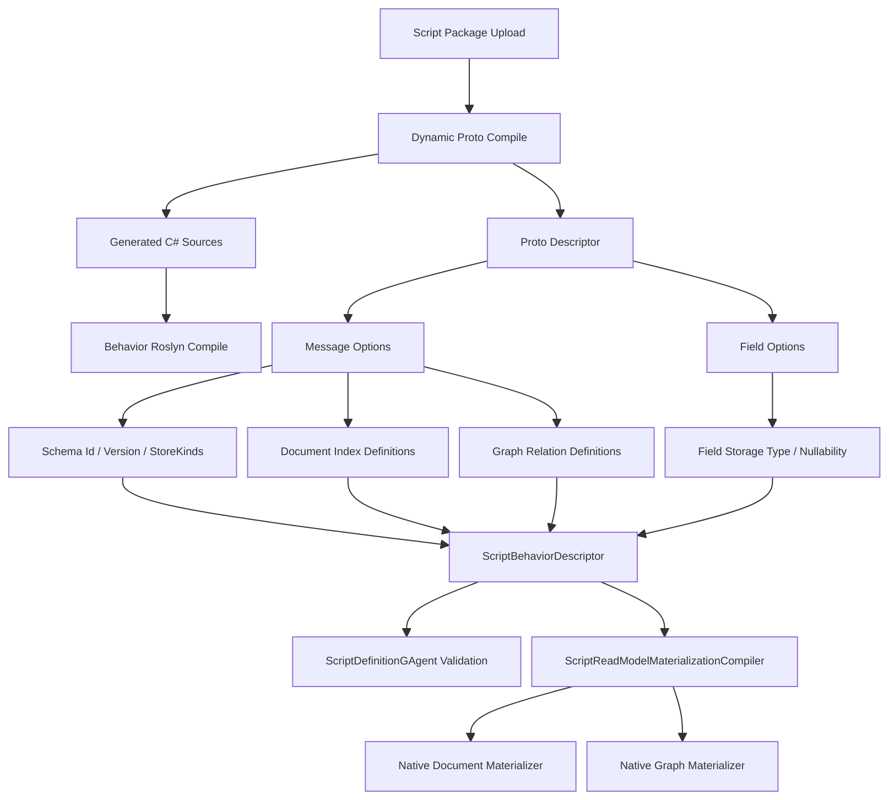
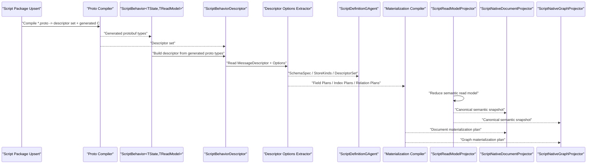

# Scripting Protobuf Definition Source 详细重构方案（2026-03-14）

## 1. 文档元信息

- 状态：Proposed
- 版本：R2
- 日期：2026-03-14
- 适用范围：
  - `src/Aevatar.Scripting.Abstractions`
  - `src/Aevatar.Scripting.Core`
  - `src/Aevatar.Scripting.Application`
  - `src/Aevatar.Scripting.Infrastructure`
  - `src/Aevatar.Scripting.Projection`
  - `src/Aevatar.Scripting.Hosting`
- 关联文档：
  - `docs/SCRIPTING_ARCHITECTURE.md`
  - `docs/architecture/2026-03-14-scripting-typed-authoring-surface-detailed-design.md`
  - `docs/architecture/2026-03-14-scripting-native-readmodel-materialization-detailed-design.md`
  - `docs/architecture/2026-03-14-scripting-gagent-behavior-parity-implementation-closeout.md`
- 文档定位：
  - 本文只讨论一件事：把 `scripting` 的“定义源”彻底改为 `protobuf descriptor + protobuf custom options`。
  - 本文明确采用“动态脚本包两阶段编译”模型，而不是仓库构建期静态编译。
  - 本文不考虑兼容性，允许直接删除现有 `ScriptReadModelDefinition`、`DescribeReadModel(...)` 以及所有平行的 C# schema 定义对象。
  - 本文目标不是改变 `ScriptBehaviorGAgent` 主架构，而是消灭“C# 定义对象 + protobuf 消息”双轨。

## 2. 结论

本轮重构的核心结论是：

1. `proto` 必须成为 `scripting` 的唯一语义定义源。
2. `C#` 只能是 `proto` 的生成物和执行宿主，不能再维护一套平行的 read model 定义对象。
3. `state / read model / command / domain event / query / query result / schema / indexes / relations / provider hints` 都必须从 `descriptor` 和 `options` 派生。
4. `ScriptReadModelDefinition` 这类 C# record 定义要删除，不再作为权威模型存在。
5. `proto` 的编译触发点必须是 `definition/provisioning` 阶段的动态脚本包编译，不是仓库 `build` 时的静态预编译。

一句话总结：

`protobuf-first，不是 protobuf-compatible。`

## 3. 问题定义

当前仓库已经完成两件重要重构：

1. `ScriptBehavior<TState,TReadModel>` typed authoring surface
2. `ScriptBehaviorGAgent -> ScriptDomainFactCommitted -> ScriptReadModelProjector` 主链

但定义层仍然有明显双轨：

1. 运行时实际处理的是 protobuf message / descriptor
2. schema、index、relation 却还需要一套平行的 C# 定义对象：
   - `src/Aevatar.Scripting.Abstractions/Definitions/ScriptReadModelDefinition.cs`
3. builder 还要求脚本作者手动调用：
   - `DescribeReadModel(...)`
4. 当前动态编译模型只有单段 C# `Source`，没有 `.proto` 输入面，也没有 `descriptor set` 产物
5. descriptor 和 schema 之间还要经过一次 extractor / compiler / pack

这导致三个根本问题：

1. **定义重复**
   - 同一个 read model 既存在 protobuf message，又存在 C# `ScriptReadModelDefinition`
2. **一致性风险**
   - message 字段变了，`ScriptReadModelDefinition` 可能没同步
3. **运行期绕路**
   - 最后真正稳定跨节点、跨存储、跨语言的是 protobuf，但系统先绕 C# schema record 再回到 protobuf
4. **动态脚本包不完整**
   - 脚本作者不能把 `proto` 作为脚本包的一部分一起提交、编译、缓存

## 4. 目标与非目标

### 4.1 目标

本轮重构必须达到：

1. `proto` 成为 scripting 唯一语义定义源。
2. read model schema、document indexes、graph relations、store kinds 都直接由 protobuf options 表达。
3. `ScriptBehaviorDescriptor` 直接持有 `MessageDescriptor` 与派生 schema plan，不再持有 C# `ScriptReadModelDefinition`。
4. `ScriptDefinitionGAgent`、`ScriptReadModelMaterializationCompiler`、`ScriptNative*Projector` 全部 descriptor-driven。
5. 脚本作者写脚本时不再手写 `DescribeReadModel(...)`。
6. 脚本包输入显式支持 `C# + *.proto + imports`，并在 definition/provisioning 阶段动态编译。

### 4.2 非目标

本轮不做以下事情：

1. 不把 `ScriptBehaviorGAgent` 变成每脚本一个原生 CLR actor 类型。
2. 不让 document / graph provider 原样持久化 protobuf blob 作为索引事实。
3. 不为 Host API 暴露 provider-specific query 协议。
4. 不保留兼容模式；允许直接删除旧 authoring API。
5. 不要求仓库在 `dotnet build` 时提前知道所有脚本 proto。

## 5. 最佳实现判断

### 5.1 为什么不是“继续保留 C# 定义对象”

如果继续保留：

1. `ScriptReadModelDefinition`
2. `ScriptContractManifest`
3. `DescribeReadModel(...)`

那 typed scripting 仍然是“两套定义系统”：

1. protobuf 类型系统
2. C# schema 定义系统

这违背了仓库最高优先级里的两条：

1. 核心语义强类型
2. protobuf 字段演进是默认路径

### 5.2 为什么不是“所有 read model 都只存 protobuf blob”

如果 document / graph 物化层也只存 protobuf blob：

1. Elasticsearch 无法做原生索引
2. Neo4j 无法做原生关系节点/边
3. provider-native query/filter/sort 无从实现

所以正确分层是：

1. `语义 read model`：protobuf-first
2. `物化 read model`：从 protobuf schema 编译出的 provider-native document / graph 模型

### 5.3 最优路线

最优路线是：

1. `proto descriptor + custom options` 作为唯一 authoring definition source
2. C# builder 只注册 handler，不再注册 schema
3. `ScriptReadModelDefinitionExtractor` 改为 `descriptor/options extractor`
4. `ScriptReadModelMaterializationCompiler` 直接吃 `MessageDescriptor`
5. `ScriptNativeDocumentProjector / ScriptNativeGraphProjector` 从 descriptor-derived plan 物化 sidecar
6. 编译触发点放在 `script package` 上载/更新时，而不是 actor 激活热路径

### 5.4 为什么不是“仓库构建期静态编译”

如果把 `.proto` 支持理解成：

1. 所有脚本 proto 都提前进入仓库 `.csproj`
2. 跟主解决方案一起 `Grpc.Tools` 静态编译

那就和 `scripting` 的动态特性直接冲突。

正确模型应该是：

1. 脚本作者提交 `script package`
2. 包内包含 `Behavior.cs + *.proto + imports`
3. 系统在 `definition/provisioning` 阶段动态执行两阶段编译
4. 产出 `generated C# + descriptor set + behavior assembly`
5. 运行时只加载 artifact，不重新编译

所以这里的“支持 `.proto`”不是静态工程化，而是动态包编译化。

### 5.5 为什么不是“actor 激活时再编 proto”

也不能把 `.proto` 编译放到 actor 激活时：

1. 激活热路径会被 `protoc` 和代码生成污染
2. 多节点下会重复编译，缓存与一致性都更差
3. 失败语义会从“定义无效”退化成“运行时激活失败”

因此唯一合理触发点是：

1. definition upsert
2. runtime provisioning
3. evolution candidate validation

这些本来就属于“接纳新脚本版本”的冷路径。

## 6. 目标架构

### 6.1 总体架构图

```mermaid
%%{init: {"maxTextSize": 100000, "flowchart": {"useMaxWidth": false, "nodeSpacing": 10, "rankSpacing": 50}, "themeVariables": {"fontSize": "10px"}}}%%
flowchart LR
    PKG["Dynamic Script Package"] --> PF["Proto Files"]
    PKG --> CS["Behavior.cs"]
    PF --> O["scripting_schema_options.proto"]
    O --> G["Generated C# Messages"]
    G --> RC["Roslyn Package Compile"]
    CS --> RC
    RC --> S["ScriptBehavior<TState,TReadModel>"]
    RC --> DS["Descriptor Set Artifact"]
    S --> D["ScriptBehaviorDescriptor"]
    DS --> D
    D --> X["Descriptor/Options Extractor"]
    X --> M["Materialization Plan Compiler"]

    S --> A["ScriptBehaviorGAgent"]
    A --> F["ScriptDomainFactCommitted"]
    F --> R["ScriptReadModelProjector"]
    R --> C["Canonical Semantic Snapshot"]
    C --> Q["ScriptReadModelQueryReader"]

    M --> ND["ScriptNativeDocumentProjector"]
    M --> NG["ScriptNativeGraphProjector"]
    ND --> ES["Document Provider / Elasticsearch"]
    NG --> NE["Graph Provider / Neo4j"]
```



### 6.2 定义期与运行期图



### 6.3 主时序图



## 7. Protobuf 方案设计

### 7.1 新增 options proto

新增：

- `src/Aevatar.Scripting.Abstractions/Protos/scripting_schema_options.proto`

这个文件定义：

1. `ScriptingReadModelOptions`
2. `ScriptingDocumentIndexOptions`
3. `ScriptingGraphRelationOptions`
4. `ScriptingFieldOptions`
5. 对 `google.protobuf.MessageOptions` 与 `google.protobuf.FieldOptions` 的 `extend`

### 7.2 推荐的 options 结构

推荐使用“message-level + field-level 混合”。

原因：

1. 字段存储类型、nullable 天然属于 field-level
2. compound index、relation 定义天然属于 message-level
3. 这样既避免全靠字符串 bag，也避免 field option 难以表达复合索引

建议结构如下：

```proto
syntax = "proto3";

package aevatar.scripting.schema;

import "google/protobuf/descriptor.proto";

message ScriptingReadModelOptions {
  string schema_id = 1;
  string schema_version = 2;
  repeated string store_kinds = 3;
  repeated ScriptingDocumentIndexOptions document_indexes = 4;
  repeated ScriptingGraphRelationOptions graph_relations = 5;
}

message ScriptingFieldOptions {
  string storage_type = 1;
  bool nullable = 2;
}

message ScriptingDocumentIndexOptions {
  string name = 1;
  repeated string paths = 2;
  bool unique = 3;
  string provider = 4;
}

message ScriptingGraphRelationOptions {
  string name = 1;
  string source_path = 2;
  string target_schema_id = 3;
  string target_path = 4;
  string cardinality = 5;
  string provider = 6;
}

extend google.protobuf.MessageOptions {
  ScriptingReadModelOptions scripting_read_model = 51001;
}

extend google.protobuf.FieldOptions {
  ScriptingFieldOptions scripting_field = 51002;
}
```

### 7.3 为什么不只用 field options

只用 field options 无法优雅表达：

1. compound indexes
2. relation source/target 的跨层路径
3. provider-specific compound behavior

所以 field option 只表达字段自身语义，message option 表达集合级 schema 结构。

## 8. Authoring Surface 重构

### 8.0 Script Package 形态

这里的“脚本”不再等价于单段 C# 字符串，而是升级为 `script package`。

推荐最小包结构：

1. `Behavior.cs`
2. `protocol/*.proto`
3. `manifest.json`
4. 可选 `imports/*.proto`

其中：

1. `Behavior.cs` 只写 handler
2. `*.proto` 定义 state/read model/command/event/query 与 schema options
3. `manifest.json` 声明入口 behavior、proto root、import root

### 8.1 目标

脚本作者以后应该这样写：

1. 在脚本包中定义 protobuf message
2. 在 protobuf 上声明 schema/index/relation option
3. 在脚本里只注册 handler

而不是这样写：

1. 写 protobuf message
2. 再写一份 `ScriptReadModelDefinition`
3. 再调用 `DescribeReadModel(...)`

### 8.2 新的脚本写法

脚本行为应收敛成：

```csharp
public sealed class ClaimDecisionBehavior
    : ScriptBehavior<ClaimState, ClaimReadModel>
{
    protected override void Configure(IScriptBehaviorBuilder<ClaimState, ClaimReadModel> builder)
    {
        builder
            .OnCommand<ClaimSubmitted>(HandleAsync)
            .OnEvent<ClaimDecisionRecorded>(
                apply: Apply,
                reduce: Reduce)
            .OnQuery<ClaimQueryRequested, ClaimQueryResponded>(HandleQueryAsync);
    }
}
```

这里不再允许：

1. `DescribeReadModel(...)`
2. `ScriptReadModelDefinition`
3. `ReadModelStoreCapabilities`

### 8.3 动态包编译接口

新的编译请求不应该再是单个 `Source` 字符串，而应该是包级请求。

建议新增：

```csharp
public sealed record ScriptPackageCompilationRequest(
    string ScriptId,
    string Revision,
    IReadOnlyList<ScriptSourceFile> CSharpSources,
    IReadOnlyList<ScriptSourceFile> ProtoFiles,
    IReadOnlyList<string> ImportRoots,
    string EntryBehaviorTypeName);
```

其中：

1. `CSharpSources` 包含 `Behavior.cs`
2. `ProtoFiles` 包含脚本自带协议
3. `ImportRoots` 支持引用宿主共享 proto 包
4. `EntryBehaviorTypeName` 避免多行为类时靠反射猜入口

## 9. 面向对象、继承与泛型设计

### 9.1 继承策略

继承链维持最小化：

1. `ScriptBehaviorGAgent : GAgentBase<ScriptBehaviorState>`
2. `ScriptBehavior<TState,TReadModel> : IScriptBehaviorBridge`

schema 层不再引入新的 C# object model 继承树。

### 9.2 泛型策略

泛型仍只出现在 authoring surface：

1. `TState`
2. `TReadModel`

schema extraction、materialization、query 统一基于：

1. `MessageDescriptor`
2. `FieldDescriptor`
3. `FileDescriptor`

不引入：

1. `ScriptReadModelDefinition<T>`
2. `ScriptMaterializationPlan<TReadModel>`
3. `ScriptSchema<TReadModel>`

### 9.3 设计模式

本方案采用以下模式组合：

1. `Template Method`
   - 仍由 `GAgentBase<TState>` 托管 actor 生命周期
2. `Descriptor Registry`
   - `ScriptBehaviorDescriptor` 成为 descriptor 聚合根
3. `Compiler`
   - `descriptor/options -> schema plan -> materialization plan`
4. `Adapter`
   - generated C# message 仍是脚本 authoring surface，descriptor 是 runtime surface
5. `Projector`
   - semantic projector、native document projector、native graph projector 继续沿统一 projection pipeline 运转

## 10. 数据模型重构

### 10.1 删除的权威模型

以下对象应删除，不再作为定义源：

1. `src/Aevatar.Scripting.Abstractions/Definitions/ScriptReadModelDefinition.cs`
2. `src/Aevatar.Scripting.Abstractions/Definitions/ScriptContractManifest.cs`
3. `IScriptBehaviorBuilder<TState,TReadModel>.DescribeReadModel(...)`
4. `ScriptBehaviorDescriptor.ReadModelDefinition`
5. `ScriptBehaviorDescriptor.StoreKinds`
6. `ScriptGAgentContract.ReadModelDefinition`
7. `ScriptGAgentContract.StoreKinds`

### 10.2 新的权威定义载体

新的权威定义载体应为：

1. `MessageDescriptor ReadModelDescriptor`
2. `MessageDescriptor StateDescriptor`
3. `FileDescriptorSet ProtocolDescriptorSet`
4. `ScriptingReadModelOptions`
5. `ScriptingFieldOptions`

并且这些 descriptor 必须来自“脚本包动态编译产物”，不是解决方案静态工程引用。

### 10.3 建议的 descriptor contract 载体

建议在 contract / definition snapshot 中显式携带：

1. `read_model_descriptor_full_name`
2. `state_descriptor_full_name`
3. `protocol_descriptor_set`
4. `schema_hash`
5. `schema_version`

这样后续：

1. definition actor
2. query reader
3. materialization compiler

都不需要依赖“重新从源码恢复 schema 定义对象”。

## 11. 运行链路重构

### 11.0 动态两阶段编译主链

新的定义接纳主链应是：

1. Host 接收 `script package`
2. `proto` 编译阶段：
   - 校验 `.proto`
   - 生成 `descriptor set`
   - 生成 `*.g.cs`
3. Roslyn 阶段：
   - 编译 `Behavior.cs + *.g.cs`
   - 实例化 entry behavior
   - 导出 `ScriptBehaviorDescriptor`
4. artifact 持久化：
   - behavior assembly bytes
   - protocol descriptor set bytes
   - source/package hash
   - entry behavior identity
5. 运行时加载：
   - 只加载 artifact
   - 不重新运行 `protoc`

### 11.1 Descriptor 构建

当前：

1. `ScriptBehaviorDescriptor` 记录 `ReadModelDefinition?`
2. `ToContract()` 直接把它塞进 `ScriptGAgentContract`

目标：

1. `ScriptBehaviorDescriptor` 直接记录 `MessageDescriptor`
2. `ToContract()` 记录 descriptor full name 与 descriptor set
3. `ScriptReadModelDefinitionExtractor` 改为 `ScriptSchemaDescriptorExtractor`

并且 `DescriptorSet` 的来源应是脚本包 proto compile 产物，而不是从 CLR `Type` 反推一个不完整快照。

### 11.2 Definition Actor

当前：

1. `ScriptDefinitionGAgent` 从 contract 中拿 `ReadModelDefinition`
2. 再经 extractor 得到 schema spec

目标：

1. `ScriptDefinitionGAgent` 从 descriptor set + full name 恢复 read model descriptor
2. 从 message / field options 派生 schema spec
3. 继续计算 `schema hash / schema version / store kinds`
4. 继续执行 activation policy

### 11.3 Materialization Compiler

当前：

1. `ScriptReadModelMaterializationCompiler` 吃 `ScriptReadModelDefinition`

目标：

1. 它直接吃 `MessageDescriptor`
2. 从 message options 得到：
   - schema id
   - schema version
   - document indexes
   - graph relations
   - store kinds
3. 从 field options 得到：
   - storage type
   - nullable
4. 从 descriptor traversal 得到：
   - path validity
   - repeated leaf legality
   - scalar/message leaf legality

## 12. Query 与 ReadModel 语义

### 12.1 Canonical ReadModel Snapshot

权威语义快照必须 protobuf-first。

建议：

1. `ScriptReadModelDocument` 继续存在，但 canonical payload 明确为 protobuf payload
2. snapshot/query contract 明确传：
   - `type_url`
   - `payload_bytes`
3. Host JSON 只在边界做 protobuf <-> JSON 转换

### 12.2 Native Materialization

native document / graph 仍保留，因为它们不是新的语义源，而是：

1. provider-native index 物化
2. provider-native relation 物化

语义顺序必须是：

1. protobuf semantic read model
2. native document / graph materialization

不能反过来让 provider-native read model 成为权威定义源。

## 13. 精确到文件的变更清单

### 13.1 新增文件

1. `src/Aevatar.Scripting.Abstractions/Protos/scripting_schema_options.proto`
2. `src/Aevatar.Scripting.Core/Compilation/ScriptPackageCompilationRequest.cs`
3. `src/Aevatar.Scripting.Core/Compilation/ScriptSourceFile.cs`
4. `src/Aevatar.Scripting.Core/Compilation/IScriptProtoCompiler.cs`
5. `src/Aevatar.Scripting.Infrastructure/Compilation/GrpcToolsScriptProtoCompiler.cs`
6. `src/Aevatar.Scripting.Core/Compilation/ScriptSchemaDescriptorExtractor.cs`
7. `src/Aevatar.Scripting.Core/Compilation/ScriptDescriptorSetBuilder.cs`
8. `src/Aevatar.Scripting.Core/Materialization/ScriptReadModelDescriptorCompiler.cs`
9. `src/Aevatar.Scripting.Core/Materialization/ScriptSchemaOptionReaders.cs`
10. `src/Aevatar.Scripting.Core/Descriptors/ScriptProtocolDescriptorSnapshot.cs`
11. `src/Aevatar.Scripting.Core/Artifacts/ScriptPackageArtifactManifest.cs`

### 13.2 修改文件

1. `src/Aevatar.Scripting.Core/Compilation/ScriptBehaviorCompilationRequest.cs`
   - 废弃单源字符串模型，转向 package-level request
2. `src/Aevatar.Scripting.Core/Compilation/IScriptBehaviorCompiler.cs`
   - 改为包级编译入口，接收 proto compile 结果
3. `src/Aevatar.Scripting.Infrastructure/Compilation/RoslynScriptBehaviorCompiler.cs`
   - 改为第二阶段 Roslyn compiler，输入 `Behavior.cs + generated *.g.cs`
4. `src/Aevatar.Scripting.Infrastructure/Compilation/ScriptCompilationMetadataReferences.cs`
   - 追加动态 proto 生成代码所需依赖
5. `src/Aevatar.Scripting.Infrastructure/Compilation/ScriptBehaviorLoader.cs`
   - 同时装载 behavior assembly 与 descriptor set artifact
6. `src/Aevatar.Scripting.Abstractions/Behaviors/IScriptBehaviorBuilder.cs`
   - 删除 `DescribeReadModel(...)`
7. `src/Aevatar.Scripting.Abstractions/Behaviors/ScriptBehavior.cs`
   - 删除 `_readModelDefinition`
   - builder 只负责 handler registration
8. `src/Aevatar.Scripting.Abstractions/Behaviors/ScriptBehaviorDescriptor.cs`
   - 删除 `ReadModelDefinition`
   - 删除 `StoreKinds`
   - 新增 `StateDescriptor / ReadModelDescriptor / DescriptorSet`
9. `src/Aevatar.Scripting.Abstractions/Behaviors/ScriptGAgentContract.cs`
   - 删除 `ReadModelDefinition`
   - 删除 `StoreKinds`
   - 新增 descriptor contract 字段
10. `src/Aevatar.Scripting.Core/ScriptDefinitionGAgent.cs`
    - 改为 descriptor-driven schema extraction
11. `src/Aevatar.Scripting.Core/Compilation/ScriptReadModelDefinitionExtractor.cs`
    - 删除或被新 extractor 替代
12. `src/Aevatar.Scripting.Core/Materialization/ScriptReadModelMaterializationCompiler.cs`
    - 改名或重构为 descriptor-driven compiler
13. `src/Aevatar.Scripting.Projection/Projectors/ScriptNativeDocumentProjector.cs`
14. `src/Aevatar.Scripting.Projection/Projectors/ScriptNativeGraphProjector.cs`
15. `src/Aevatar.Scripting.Projection/Queries/ScriptReadModelQueryReader.cs`
    - snapshot query 基于 descriptor set 解析，不依赖旧 C# schema object
16. `src/Aevatar.Scripting.Hosting/CapabilityApi/ScriptJsonPayloads.cs`
    - protobuf-first JSON mapping
17. `src/Aevatar.Scripting.Hosting/CapabilityApi/*`
    - definition/provisioning API 输入改为 script package，而不是裸 `Source`

### 13.3 删除文件

1. `src/Aevatar.Scripting.Abstractions/Definitions/ScriptReadModelDefinition.cs`
2. `src/Aevatar.Scripting.Abstractions/Definitions/ScriptContractManifest.cs`

## 14. Proto 与测试样例同步

### 14.1 需要修改的测试协议

1. `test/Aevatar.Scripting.Core.Tests/Protos/script_behavior_test_messages.proto`
2. `test/Aevatar.Integration.Tests/Protos/claim_protocol.proto`
3. `test/Aevatar.Integration.Tests/Protos/text_normalization_protocol.proto`

这些 proto 需要直接声明：

1. read model schema id / version
2. document indexes
3. graph relations
4. field storage types

同时测试基建要覆盖“动态脚本包包含 proto 文件”的路径，而不是只覆盖“测试项目静态先编 proto”。

### 14.2 需要修改的样例脚本

1. `test/Aevatar.Scripting.Core.Tests/ScriptSources.cs`
2. `test/Aevatar.Scripting.Core.Tests/ClaimScriptSources.cs`
3. `test/Aevatar.Integration.Tests/TestDoubles/Protocols/TextNormalizationProtocolSampleActors.cs`
4. `test/Aevatar.Integration.Tests/Fixtures/ScriptDocuments/ClaimScriptScenarioDocument.cs`

所有 `.DescribeReadModel(...)` 都应删除。

## 15. 实施顺序

### Phase 1: 定义源切换

1. 新增 `scripting_schema_options.proto`
2. 引入 `script package` 请求模型与 `IScriptProtoCompiler`
3. 给现有测试协议和样例协议补 options
4. 删除 builder 层 `DescribeReadModel(...)`
5. 让 `ScriptBehaviorDescriptor` 只持 descriptor

### Phase 2: 动态包编译链切换

1. `RoslynScriptBehaviorCompiler` 改为第二阶段 compiler
2. `definition/provisioning` 入口改为先跑 proto compile
3. artifact 持久化 descriptor set 与 package manifest

### Phase 3: Contract / Definition / Snapshot 切换

1. `ScriptGAgentContract` 改为 descriptor-first
2. `ScriptDefinitionGAgent` 改为 descriptor-driven extraction
3. definition snapshot/query 改为返回 descriptor identity + descriptor set

### Phase 4: Materialization Compiler 切换

1. `ScriptReadModelMaterializationCompiler` 改吃 descriptor/options
2. 删除 `ScriptReadModelDefinitionExtractor`
3. 补 document / graph sidecar projector 回归

### Phase 5: 清理旧模型

1. 删除 `ScriptReadModelDefinition.cs`
2. 删除 `ScriptContractManifest.cs`
3. 删除所有旧测试和样例残留调用
4. 更新 architecture 文档

## 16. 验证矩阵

必须新增或更新以下测试：

1. `proto compiler` 单测
2. `script package compilation` 单测
3. `descriptor/options extractor` 单测
4. `materialization compiler` 单测
5. `ScriptDefinitionGAgent` schema validation 单测
6. `native document projector` 单测
7. `native graph projector` 单测
8. `Host JSON payload` protobuf round-trip 单测
9. `Claim* / Hybrid* / WorkflowYamlScriptParity*` 回归测试
10. `ScriptNativeReadModelMaterializationIntegrationTests` 集成测试
11. `dynamic package with embedded proto` 端到端测试

## 17. 完成定义

本轮重构完成的判定标准：

1. 仓库内不再存在 `ScriptReadModelDefinition` 的生产代码引用。
2. `IScriptBehaviorBuilder<TState,TReadModel>` 不再暴露 `DescribeReadModel(...)`。
3. schema/index/relation 定义只存在于 protobuf options。
4. definition/provisioning API 已支持 `script package` 输入，包含 `C# + *.proto + imports`。
5. `ScriptDefinitionGAgent`、query reader、materialization compiler 全部直接消费 descriptor/options。
6. 运行时 actor 激活路径不重新编译 proto。
7. native document / graph materialization 继续工作。
8. `dotnet build aevatar.slnx --nologo` 通过。
9. `dotnet test aevatar.slnx --nologo` 通过。
10. `bash tools/ci/architecture_guards.sh` 通过。
11. `bash tools/ci/test_stability_guards.sh` 通过。

## 18. 最终判断

这轮重构不是“再加一层 protobuf 支持”，而是：

1. 让 protobuf 从“传输与状态格式”升级为“唯一语义定义源”
2. 让 scripting 从“双轨定义系统”收敛为“descriptor-driven 单轨系统”
3. 让 native read model materialization 成为 protobuf schema 的派生结果，而不是另一套平行模型

最终架构应该是：

`dynamic script package(cs + proto) -> proto compile -> generated C# + descriptor set -> ScriptBehavior handlers -> descriptor-driven schema extraction -> semantic protobuf read model -> provider-native materialization`
