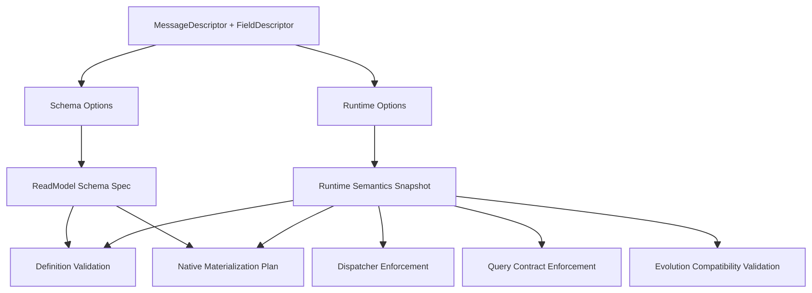
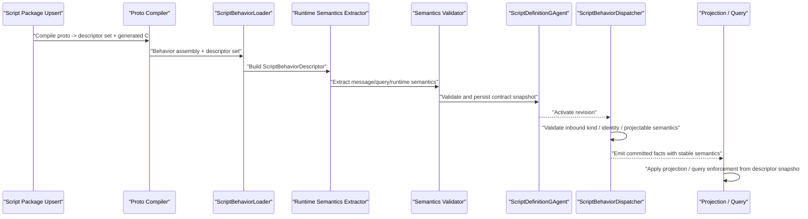

# Scripting Runtime Semantics Protobuf Options 详细重构方案（2026-03-14）

## 1. 文档元信息

- 状态：`Implemented`
- 版本：`R1`
- 日期：`2026-03-14`
- 适用范围：
  - `src/Aevatar.Scripting.Abstractions`
  - `src/Aevatar.Scripting.Core`
  - `src/Aevatar.Scripting.Application`
  - `src/Aevatar.Scripting.Infrastructure`
  - `src/Aevatar.Scripting.Projection`
  - `src/Aevatar.Scripting.Hosting`
- 关联文档：
  - `docs/SCRIPTING_ARCHITECTURE.md`
  - `docs/architecture/2026-03-14-scripting-gagent-behavior-parity-implementation-closeout.md`
  - `docs/architecture/2026-03-14-scripting-typed-authoring-surface-detailed-design.md`
  - `docs/architecture/2026-03-14-scripting-native-readmodel-materialization-detailed-design.md`
  - `docs/architecture/2026-03-14-scripting-protobuf-definition-source-detailed-design.md`
- 文档定位：
  - 本文讨论的是 `runtime` 语义是否进入 `protobuf custom options`，以及应当进入到什么边界为止。
  - 本文不重新设计 `ScriptBehaviorGAgent` 主链，不引入第二套 runtime。
  - 本文明确反对把业务行为逻辑塞入 `proto`；目标是把宿主必须知道、跨实现必须一致的运行语义协议化。

## 2. 结论

结论分两句：

1. `runtime` 中稳定、宿主必需、跨实现必须一致的语义，应该进入 `protobuf descriptor + custom options`。
2. 业务分支、外部调用编排、复杂决策逻辑，必须继续留在 `C# handler`，不能协议化。

当前代码实现已经进一步收紧：

1. 不再对 `google.protobuf.Empty / StringValue / Struct` 等 wrapper message 提供 runtime semantics fallback。
2. 任何作为 scripting command / signal / domain event / query / result 的消息，都必须显式声明 runtime options。
3. scripting read model schema 也不再接受 protobuf wrapper leaf；内部核心字段应使用 scalar / proto3 optional / typed sub-message，`Timestamp` 是唯一保留的 well-known leaf。
4. script package 的 proto 编译冷路径会直接拒绝 `wrappers.proto` 与 `google.protobuf.*Value`，防止 wrapper 通过动态包重新进入 scripting 协议。

因此本轮重构的目标不是“让 proto 替代代码”，而是：

1. 把当前 runtime 隐式依赖的规则提炼成显式协议。
2. 让 `definition validation / dispatcher enforcement / projection / evolution compatibility` 都基于同一份 descriptor 语义。
3. 彻底避免同一条 runtime 规则在 `C# builder` 和 `proto option` 里重复定义。

一句话总结：

`协议化宿主语义，保留代码化业务行为。`

## 3. 问题定义

当前 scripting 已经完成：

1. `ScriptBehavior<TState,TReadModel>` typed authoring surface
2. `proto` 作为 schema/index/relation 的定义源
3. `ScriptBehaviorGAgent -> ScriptDomainFactCommitted -> ScriptReadModelProjector` 主链

但 runtime 仍存在一类“只在代码里知道、descriptor 看不见”的隐式规则，例如：

1. 一个消息到底是 `command / internal signal / domain event / query` 中的哪一种
2. 哪些 domain event 允许进入 projection
3. 哪些 event 被视为 replay-safe
4. 聚合/运行实例 identity 从哪个 field 提取
5. 哪个 query request 对应哪个 result
6. 哪些事件适合触发 read model snapshot 或 native materialization

当前这些语义主要散落在：

1. `src/Aevatar.Scripting.Abstractions/Behaviors/ScriptBehavior.cs`
2. `src/Aevatar.Scripting.Abstractions/Behaviors/IScriptBehaviorBuilder.cs`
3. `src/Aevatar.Scripting.Abstractions/Behaviors/ScriptBehaviorDescriptor.cs`
4. `src/Aevatar.Scripting.Abstractions/Behaviors/ScriptGAgentContract.cs`
5. `src/Aevatar.Scripting.Application/Runtime/ScriptBehaviorDispatcher.cs`
6. `src/Aevatar.Scripting.Application/Runtime/ScriptBehaviorRuntimeCapabilities.cs`
7. `src/Aevatar.Scripting.Projection/Queries/ScriptReadModelQueryReader.cs`

这会造成五个问题：

1. 宿主只能识别“类型”，难以识别“运行语义”。
2. definition upsert 时做不了强约束校验，只能等到运行中失败。
3. evolution diff 只能比较类型与 schema，无法比较 runtime 语义是否破坏兼容。
4. workflow / static GAgent / scripting 之间难以达到真正的行为等价。
5. 如果继续推进 protobuf-first，descriptor 只承载“数据结构”而不承载“宿主语义”，会停在半协议化状态。

## 4. 风险与边界

这件事值得做，但边界必须收紧。否则会把 `proto` 做成执行配置大全。

### 4.1 主要风险

1. `proto` 过载：协议文件变成 runtime 配置文件，难读难演进。
2. 语义重复：同一条规则同时出现在 builder 和 option 中，权威来源不清。
3. runtime 僵化：不适合声明化的业务逻辑被强行塞进协议。
4. 演进成本上升：proto option 变更触发更多兼容性检查。
5. 宿主实现复杂化：需要 parser、validator、compatibility checker、runtime enforcement、diagnostics 一整套配套实现。

### 4.2 边界原则

只允许进入 `proto option` 的语义必须同时满足：

1. 宿主必须知道，否则无法正确 dispatch / replay / project / query。
2. 跨实现必须一致，否则 static GAgent 与 scripting 会出现分叉。
3. 语义稳定，不依赖具体业务分支和外部系统时序。

不允许进入 `proto option` 的内容包括：

1. 复杂业务条件分支
2. handler 内部步骤编排
3. 外部服务调用顺序
4. 补偿、重试、策略模式的业务细节
5. 任何需要读运行时临时上下文才能决定的逻辑

## 5. 哪些语义进入 Proto，哪些必须留在 C#

### 5.1 进入 Proto 的语义

这些语义应由 `descriptor + options` 统一声明：

1. `message kind`
   - `command`
   - `internal_signal`
   - `domain_event`
   - `query_request`
   - `query_result`
2. `aggregate/run identity field`
3. `command id / correlation id / causation id` 的字段绑定
4. `projectable`
5. `replay_safe`
6. `snapshot_candidate`
7. `query request -> result` 绑定
8. `read model scope` 或 `materialization scope`
9. `index / relation / store kind` 这类已进入 schema 的 read-side 语义

### 5.2 必须留在 C# 的语义

这些语义继续由 `ScriptBehavior<TState,TReadModel>` 和 handler 代码承载：

1. 某个 command 收到后到底如何决策
2. 某个 domain event 如何修改 state
3. 某个 domain event 如何 reduce read model
4. query 如何拼装结果
5. 是否调用 AI、是否发送消息给其他 actor
6. timeout/retry 的业务策略
7. 各类补偿、回滚、审批、路由分支

### 5.3 权威性规则

协议化以后，必须只有一条权威规则：

1. `proto option` 定义消息的稳定语义身份。
2. `C# builder` 只负责把某个 handler 绑定到某个 protobuf 类型。
3. builder 不得再额外声明与 proto 冲突的 runtime 语义。
4. 若 builder 绑定和 proto semantics 冲突，definition compile 直接失败。

## 6. 目标架构

### 6.1 总体架构图

```mermaid
%%{init: {"maxTextSize": 100000, "flowchart": {"useMaxWidth": false, "nodeSpacing": 10, "rankSpacing": 50}, "themeVariables": {"fontSize": "10px"}}}%%
flowchart LR
    PKG["Dynamic Script Package"] --> PROTO["Proto Files"]
    PKG --> CS["Behavior.cs"]
    PROTO --> PO["scripting_schema_options.proto / scripting_runtime_options.proto"]
    PO --> PC["Proto Compiler"]
    PC --> GEN["Generated C# + Descriptor Set"]
    GEN --> RC["Roslyn Script Compile"]
    RC --> LD["ScriptBehaviorLoader"]
    LD --> BD["ScriptBehaviorDescriptor"]
    BD --> SX["ScriptSchemaDescriptorExtractor"]
    BD --> RX["ScriptRuntimeSemanticsDescriptorExtractor"]

    RX --> DV["ScriptRuntimeSemanticsValidator"]
    SX --> DV
    DV --> DEF["ScriptDefinitionGAgent"]

    BD --> DISP["ScriptBehaviorDispatcher"]
    RX --> DISP

    BD --> QRY["ScriptReadModelQueryReader"]
    RX --> QRY

    BD --> MAT["ScriptReadModelMaterializationCompiler"]
    SX --> MAT
    RX --> MAT

    DISP --> FACT["ScriptDomainFactCommitted"]
    FACT --> PROJ["Projection Pipeline"]
```



### 6.2 运行时消费链



### 6.3 主时序图



## 7. Proto Option 设计

### 7.1 新增 options proto

新增：

- `src/Aevatar.Scripting.Abstractions/Protos/scripting_runtime_options.proto`

该文件与现有：

- `src/Aevatar.Scripting.Abstractions/Protos/scripting_schema_options.proto`

形成并列关系：

1. `schema_options` 负责 read model 结构、索引、关系。
2. `runtime_options` 负责消息运行语义、identity、projection/query hint。

### 7.2 建议的 message-level options

建议新增如下 protobuf 定义：

```proto
syntax = "proto3";

package aevatar.scripting.runtime;

option csharp_namespace = "Aevatar.Scripting.Abstractions.Runtime";

import "google/protobuf/descriptor.proto";

enum ScriptingMessageKind {
  SCRIPTING_MESSAGE_KIND_UNSPECIFIED = 0;
  SCRIPTING_MESSAGE_KIND_COMMAND = 1;
  SCRIPTING_MESSAGE_KIND_INTERNAL_SIGNAL = 2;
  SCRIPTING_MESSAGE_KIND_DOMAIN_EVENT = 3;
  SCRIPTING_MESSAGE_KIND_QUERY_REQUEST = 4;
  SCRIPTING_MESSAGE_KIND_QUERY_RESULT = 5;
}

message ScriptingMessageRuntimeOptions {
  ScriptingMessageKind kind = 1;
  bool projectable = 2;
  bool replay_safe = 3;
  bool snapshot_candidate = 4;
  string aggregate_id_field = 5;
  string command_id_field = 6;
  string correlation_id_field = 7;
  string causation_id_field = 8;
  string read_model_scope = 9;
}

message ScriptingQueryRuntimeOptions {
  string result_full_name = 1;
}

message ScriptingFieldRuntimeOptions {
  bool aggregate_identity = 1;
  bool correlation_identity = 2;
}

extend google.protobuf.MessageOptions {
  ScriptingMessageRuntimeOptions scripting_runtime = 51011;
  ScriptingQueryRuntimeOptions scripting_query = 51012;
}

extend google.protobuf.FieldOptions {
  ScriptingFieldRuntimeOptions scripting_runtime_field = 51013;
}
```

### 7.3 设计判断

这里有三个关键判断：

1. `message kind` 必须在消息级定义，不能继续由 builder 隐式猜测。
2. identity 字段允许用 `field name` 声明，也允许用 `field option` 做显式标记；二者冲突时以 `field option` 为准。
3. query-result 绑定应由 query request message 自己声明，而不是只靠 `OnQuery<TQuery, TResult>` 推导。

## 8. 运行时对象模型

### 8.1 核心对象

新增运行语义快照对象：

1. `ScriptRuntimeSemanticsSnapshot`
2. `ScriptMessageSemantics`
3. `ScriptQuerySemantics`
4. `ScriptIdentityBinding`

建议放在：

- `src/Aevatar.Scripting.Abstractions/Runtime/`

这些对象只承载 descriptor 派生后的稳定运行语义，不直接承载行为代码。

### 8.2 对现有对象的影响

#### `ScriptBehaviorDescriptor`

文件：

- `src/Aevatar.Scripting.Abstractions/Behaviors/ScriptBehaviorDescriptor.cs`

需要新增：

1. `RuntimeSemanticsSnapshot`
2. `ProtocolDescriptorSet` 继续保留

它的职责从“类型注册快照”升级为：

1. 类型注册
2. schema descriptor
3. runtime semantics descriptor

#### `ScriptGAgentContract`

文件：

- `src/Aevatar.Scripting.Abstractions/Behaviors/ScriptGAgentContract.cs`

需要补充：

1. message kind 摘要
2. query-result descriptor 全名绑定
3. read model scope / projectable 这类宿主可见语义摘要

注意这里不应把完整 option blob 再包一层 bag；应存强类型 proto 或强类型 record 摘要。

## 9. 设计模式与 OO / 继承 / 泛型策略

### 9.1 设计模式

本方案采用四个模式：

1. `Descriptor Extractor`
   - 从 `MessageDescriptor / FieldDescriptor` 提取 runtime semantics
2. `Validator`
   - 对 extracted semantics 做静态约束与兼容性校验
3. `Policy`
   - dispatcher、query reader、materializer 根据 semantics 决定允许/拒绝哪些运行动作
4. `Template Method`
   - `ScriptBehavior<TState,TReadModel>` 继续负责行为模板，语义约束从宿主注入

### 9.2 继承策略

不新增新的 actor 继承树。

继续保留：

1. `ScriptBehavior<TState,TReadModel>` 作为作者入口
2. `ScriptBehaviorGAgent` 作为统一宿主 actor

不做：

1. 每类 `message kind` 一套 actor
2. 每个脚本一套原生 CLR runtime host
3. 基于泛型把 dispatcher/projector/query reader 全部专门化

### 9.3 泛型策略

泛型仍然只出现在脚本作者面：

1. `TState`
2. `TReadModel`
3. `TCommand / TSignal / TEvent / TQuery / TResult`

宿主侧保持非泛型：

1. `ScriptBehaviorDescriptor`
2. `ScriptRuntimeSemanticsSnapshot`
3. `ScriptBehaviorDispatcher`
4. `ScriptReadModelQueryReader`

原因是 runtime 必须处理异构消息集合，不能在宿主层做泛型爆炸。

## 10. 具体实现方案

### 10.1 新增提取器

新增：

- `src/Aevatar.Scripting.Core/Compilation/ScriptRuntimeSemanticsDescriptorExtractor.cs`

职责：

1. 遍历 `ScriptBehaviorDescriptor` 中的 command/signal/domain event/query descriptors
2. 读取 `scripting_runtime_options.proto` 中的 message/field options
3. 产出 `ScriptRuntimeSemanticsSnapshot`
4. 给出可供 definition、dispatcher、query、materialization 复用的规范化结果

### 10.2 新增校验器

新增：

- `src/Aevatar.Scripting.Core/Validation/ScriptRuntimeSemanticsValidator.cs`

职责：

1. 校验每个已注册 handler 的消息都声明了合法 `kind`
2. 校验 query request 的 `result_full_name` 与 builder 注册一致
3. 校验 domain event 若 `projectable = true`，则必须被声明为 domain event
4. 校验 identity field 是否存在且类型合法
5. 校验 `replay_safe / snapshot_candidate / read_model_scope` 的组合是否合法

### 10.3 修改 definition actor

修改：

- `src/Aevatar.Scripting.Core/ScriptDefinitionGAgent.cs`

新增职责：

1. 持久化 runtime semantics 摘要
2. 在 revision upsert 时执行 semantics validation
3. 在 evolution validate 时比较 old/new semantics，拒绝破坏性变更

### 10.4 修改 loader

修改：

- `src/Aevatar.Scripting.Infrastructure/Compilation/ScriptBehaviorLoader.cs`

新增职责：

1. 在装载 descriptor 后同步提取 runtime semantics
2. 把 semantics snapshot 写入 `ScriptBehaviorDescriptor`
3. 保证 descriptor/artifact 一次装载即可为 definition、dispatcher、query、projection 共用

### 10.5 修改 dispatcher

修改：

- `src/Aevatar.Scripting.Application/Runtime/ScriptBehaviorDispatcher.cs`

新增或替换逻辑：

1. 不再只校验“类型是否已声明”，同时校验消息 `kind`
2. `RunScriptRequestedEvent` 的 payload 必须绑定到 `command` 或显式允许的 `internal_signal`
3. 发出的 domain event 必须满足 `kind = domain_event`
4. 只有 `projectable = true` 的 domain event 才允许进入 native materialization 路径
5. identity / correlation / causation 字段按 semantics 提取，而不是只靠 envelope 补默认值

### 10.6 修改 query reader

修改：

- `src/Aevatar.Scripting.Projection/Queries/ScriptReadModelQueryReader.cs`

新增逻辑：

1. query request 必须声明 `kind = query_request`
2. 运行时实际结果必须匹配 `result_full_name`
3. `read_model_scope` 不一致时直接拒绝

### 10.7 修改 materialization compiler

修改：

- `src/Aevatar.Scripting.Core/Materialization/ScriptReadModelMaterializationCompiler.cs`

新增逻辑：

1. 除 schema/index/relation 外，额外读取 `read_model_scope / snapshot_candidate / projectable`
2. native materialization 只消费被标记为可投影的 committed fact
3. 为 document/graph projector 生成更精确的 route policy

### 10.8 修改 proto compiler 内建 imports

修改：

- `src/Aevatar.Scripting.Infrastructure/Compilation/GrpcToolsScriptProtoCompiler.cs`

新增职责：

1. 动态脚本包 proto compile 时内建注入 `scripting_runtime_options.proto`
2. 确保脚本包 `.proto` 能直接引用 runtime options

## 11. 文件级变更清单

### 11.1 新增文件

1. `src/Aevatar.Scripting.Abstractions/Protos/scripting_runtime_options.proto`
2. `src/Aevatar.Scripting.Abstractions/Runtime/ScriptRuntimeSemanticsSnapshot.cs`
3. `src/Aevatar.Scripting.Abstractions/Runtime/ScriptMessageSemantics.cs`
4. `src/Aevatar.Scripting.Abstractions/Runtime/ScriptQuerySemantics.cs`
5. `src/Aevatar.Scripting.Abstractions/Runtime/ScriptIdentityBinding.cs`
6. `src/Aevatar.Scripting.Core/Compilation/ScriptRuntimeSemanticsDescriptorExtractor.cs`
7. `src/Aevatar.Scripting.Core/Validation/ScriptRuntimeSemanticsValidator.cs`
8. `test/Aevatar.Scripting.Core.Tests/Compilation/ScriptRuntimeSemanticsDescriptorExtractorTests.cs`
9. `test/Aevatar.Scripting.Core.Tests/Validation/ScriptRuntimeSemanticsValidatorTests.cs`
10. `test/Aevatar.Integration.Tests/ScriptRuntimeSemanticsContractTests.cs`

### 11.2 修改文件

1. `src/Aevatar.Scripting.Abstractions/Behaviors/ScriptBehaviorDescriptor.cs`
2. `src/Aevatar.Scripting.Abstractions/Behaviors/ScriptGAgentContract.cs`
3. `src/Aevatar.Scripting.Abstractions/Behaviors/ScriptBehavior.cs`
4. `src/Aevatar.Scripting.Abstractions/Behaviors/IScriptBehaviorBuilder.cs`
5. `src/Aevatar.Scripting.Core/ScriptDefinitionGAgent.cs`
6. `src/Aevatar.Scripting.Infrastructure/Compilation/ScriptBehaviorLoader.cs`
7. `src/Aevatar.Scripting.Infrastructure/Compilation/GrpcToolsScriptProtoCompiler.cs`
8. `src/Aevatar.Scripting.Application/Runtime/ScriptBehaviorDispatcher.cs`
9. `src/Aevatar.Scripting.Application/Runtime/ScriptBehaviorRuntimeCapabilities.cs`
10. `src/Aevatar.Scripting.Core/Materialization/ScriptReadModelMaterializationCompiler.cs`
11. `src/Aevatar.Scripting.Projection/Queries/ScriptReadModelQueryReader.cs`
12. `src/Aevatar.Scripting.Hosting/CapabilityApi/ScriptQueryEndpoints.cs`

### 11.3 删除或收紧

1. 删除 builder 内所有重复表达 `message kind` 的 API。
2. 禁止再新增平行的 C# runtime semantics record 作为作者入口。
3. 如果 `ScriptBehavior.cs` 中存在“通过 builder 自己推导消息语义”的路径，应直接收紧为“proto option 缺失即编译失败”。

## 12. 实施顺序

### 阶段 1：定义面收敛

1. 新增 `scripting_runtime_options.proto`
2. 新增 runtime semantics snapshot 抽象
3. 新增 extractor
4. loader 产出 `ScriptBehaviorDescriptor.RuntimeSemanticsSnapshot`

### 阶段 2：静态校验收敛

1. 新增 validator
2. definition upsert 接入 validator
3. integration tests 覆盖非法 `kind / query-result / identity field`

### 阶段 3：运行 enforcement

1. dispatcher 按 semantics 执行 inbound/outbound 校验
2. query reader 按 semantics 执行 query/result 校验
3. materialization compiler 接入 `projectable / scope` 规则

### 阶段 4：演进治理

1. `ScriptDefinitionGAgent` 持久化 semantics 摘要
2. evolution compatibility diff 接入 semantics 比较
3. claim/hybrid/workflow parity 测试覆盖语义破坏场景

## 13. 测试与门禁

必须新增或更新的测试包括：

1. descriptor extractor 对 message-level options 的解析
2. query request/result 绑定冲突校验
3. identity field 缺失或类型非法时 definition compile 失败
4. `projectable = false` 的 domain event 不进入 native materialization
5. evolution 场景下 runtime semantics 破坏变更被拒绝
6. workflow yaml parity 场景验证 static/script 行为语义一致

建议执行：

1. `dotnet test test/Aevatar.Scripting.Core.Tests/Aevatar.Scripting.Core.Tests.csproj --nologo`
2. `dotnet test test/Aevatar.Integration.Tests/Aevatar.Integration.Tests.csproj --nologo --filter "FullyQualifiedName~Script|FullyQualifiedName~WorkflowYamlScriptParity|FullyQualifiedName~Claim|FullyQualifiedName~Hybrid"`
3. `bash tools/ci/architecture_guards.sh`
4. `bash tools/ci/test_stability_guards.sh`

## 14. 最终 DoD

满足以下条件才算完成：

1. `runtime` 中宿主必须知道的稳定语义，均能从 `descriptor + options` 派生。
2. builder 不再是 runtime semantics 的权威来源，只负责 handler 绑定。
3. definition、dispatcher、query、materialization、evolution 使用同一份 semantics snapshot。
4. 运行错误能够在 definition compile 或 upsert 阶段前置暴露，而不是运行中才发现。
5. scripting 不再依赖代码里的隐式消息种类约定来维持行为正确性。
6. 业务逻辑仍然留在 `C# handler`，没有被错误地协议化进 proto。

## 15. 反目标复核

为避免方案走偏，以下状态都应视为失败：

1. `proto option` 变成业务流程配置大全。
2. 同一语义在 `proto` 和 `builder` 中重复定义。
3. runtime 仍需要靠字符串猜测 `message kind`。
4. query-result 绑定只靠 C# 泛型推导，descriptor 无法独立表达。
5. 为了协议化而把 `dispatch/apply/reduce` 逻辑重新做成声明式 DSL。
