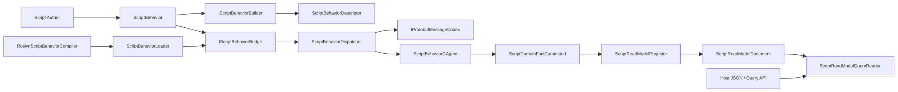
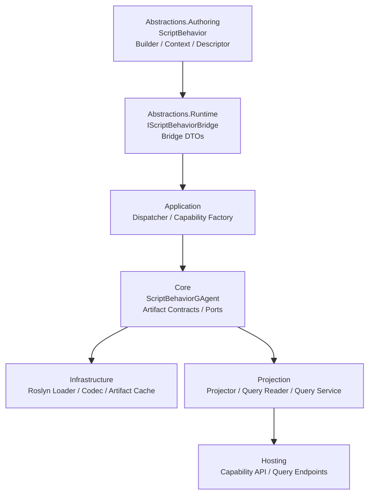
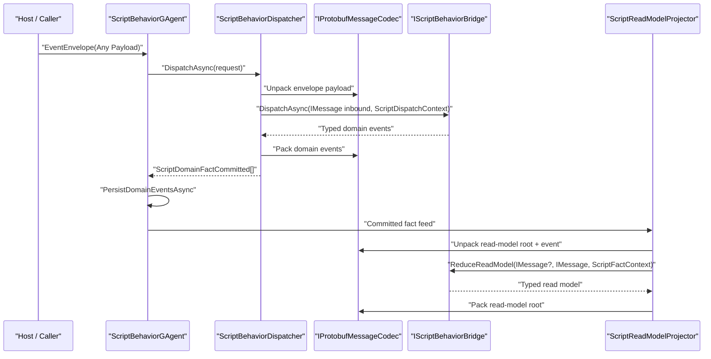
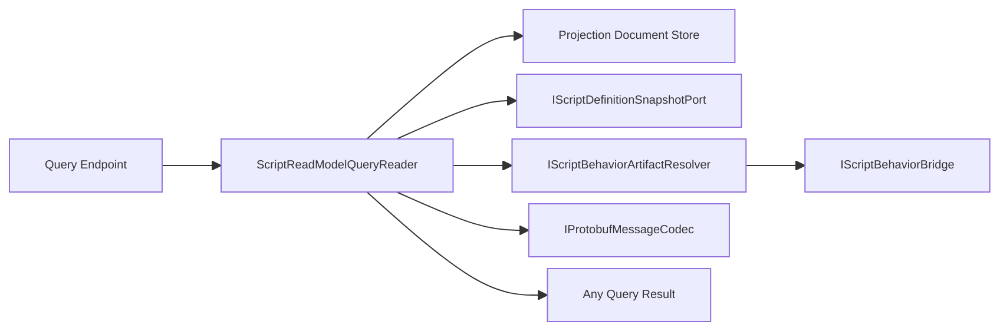

# Scripting Typed Authoring Surface 详细重构方案（2026-03-14）

## 1. 文档元信息

- 状态：Implemented
- 版本：R3
- 日期：2026-03-14
- 适用范围：
  - `src/Aevatar.Scripting.Abstractions`
  - `src/Aevatar.Scripting.Application`
  - `src/Aevatar.Scripting.Core`
  - `src/Aevatar.Scripting.Infrastructure`
  - `src/Aevatar.Scripting.Projection`
  - `src/Aevatar.Scripting.Hosting`
- 关联文档：
  - `docs/SCRIPTING_ARCHITECTURE.md`
  - `docs/architecture/2026-03-13-scripting-gagent-behavior-parity-detailed-design.md`
  - `docs/architecture/2026-03-14-scripting-gagent-behavior-parity-implementation-closeout.md`
- 本文定位：
  - 本文只讨论下一阶段重构：把脚本 authoring surface 从 `Any` 暴露模型升级为 typed/generic authoring model。
  - 本文不考虑兼容性，允许直接删除旧 authoring API、旧命名和旧脚本样例。
  - 截至 2026-03-14，本文设计已在仓库落地；若与实现细节冲突，以 `implementation-closeout` 和实际代码为准。

## 2. 问题定义

当前 `scripting` 主链已经完成第一阶段重构：

- 写侧：`ScriptBehaviorGAgent -> ScriptDomainFactCommitted`
- 读侧：`ScriptReadModelProjector -> ScriptReadModelDocument -> ScriptReadModelQueryReader`
- 运行模式：`behavior-hosted GAgent`

但脚本作者面对的 API 仍然过于底层。现在的关键问题不是 wrapper，而是 authoring surface 仍然把 `Any` 当成脚本编程模型的一部分。

### 2.1 当前直接暴露 `Any` 的入口

| 文件 | 当前问题 | 结果 |
|---|---|---|
| `src/Aevatar.Scripting.Abstractions/Behaviors/IScriptGAgentBehavior.cs` | `DispatchAsync`、`ApplyDomainEvent`、`ReduceReadModel`、`ExecuteQueryAsync` 直接暴露 `Any` | 脚本看起来像 protobuf 网关 |
| `src/Aevatar.Scripting.Abstractions/Behaviors/ScriptBehaviorContext.cs` | `CurrentStateRoot` 为 `Any?` | 脚本每次都要自己解包状态 |
| `src/Aevatar.Scripting.Abstractions/Behaviors/ScriptInboundMessage.cs` | `Payload` 为 `Any` | 命令与 signal 没有 authoring 级强类型 |
| `src/Aevatar.Scripting.Abstractions/Queries/ScriptReadModelQueryModels.cs` | `ReadModelPayload` 为 `Any?` | 查询 authoring 仍然 bag 化 |
| `src/Aevatar.Scripting.Abstractions/Behaviors/IScriptBehaviorRuntimeCapabilities.cs` | query/run 等能力以 `Any` 作为输入输出 | 强类型能力只能停留在概念层 |

### 2.2 当前实现的根本缺陷

1. 脚本作者需要手写 `Any.Pack/Unpack(...)`。
2. 脚本作者需要手写 `ScriptGAgentContract` 和 type URL。
3. 运行期已经有 contract，但 contract 不是从脚本 authoring model 自然导出。
4. 同一个协议在静态 `GAgent` 里是强类型，在脚本里却退化成 `Any`。

## 3. 目标与非目标

### 3.1 目标

本轮重构后的目标是：

1. 脚本作者默认只写 protobuf typed message，不直接碰 `Any`。
2. 脚本作者不再手写 `ScriptGAgentContract`。
3. command、signal、domain event、query、query result、state、read model 都由 builder 自动注册并导出 contract。
4. `ScriptBehaviorGAgent`、projection、host query 仍然保持异构脚本统一宿主模式。
5. `Any` 只保留在宿主边界、持久化边界、协议边界。

### 3.2 非目标

本轮不做以下事情：

1. 不把整个 runtime 改成 `ScriptBehaviorGAgent<TState, TReadModel>`。
2. 不给每个脚本生成一套专属 CLR read model 存储类型。
3. 不把 host API 变成每脚本一个 typed HTTP endpoint。
4. 不引入 nativeized lane；仍然保留动态脚本装载模型。

## 4. 总体设计判断

### 4.1 正确边界

`Any` 应只存在于以下边界：

1. `EventEnvelope.Payload`
2. `ScriptBehaviorState.StateRoot`
3. `ScriptReadModelDocument.ReadModelPayload`
4. Host JSON / query 协议边界

`Any` 不应再是以下位置的主编程模型：

1. 脚本 authoring API
2. command handler
3. apply/reduce handler
4. query handler
5. runtime capability 调用面

### 4.2 最佳实现路线

最佳路线不是“把整个系统都泛型化”，而是：

1. authoring surface 泛型化
2. runtime bridge 非泛型化
3. 在 runtime bridge 与宿主边界之间做一次类型擦除
4. contract 由 builder/descriptor 自动派生

这条路线有三个优点：

1. 不破坏现有 `behavior-hosted GAgent` 主架构。
2. 脚本作者体验接近静态 `GAgent`。
3. projection、query、artifact loader 仍可共享统一基础设施。

## 5. 目标架构图

### 5.1 总体架构图



### 5.2 分层图



### 5.3 运行时时序图



### 5.4 查询链路图



## 6. 设计模式、面向对象、继承与范型策略

### 6.1 设计模式组合

本方案明确采用以下模式组合：

| 模式 | 落点 | 原因 |
|---|---|---|
| Template Method | `GAgentBase<TState>` | actor lifecycle、event sourcing、callback 仍由平台托管 |
| Strategy | `IScriptBehaviorBridge` | 脚本只负责业务行为，不接管宿主 |
| Builder | `IScriptBehaviorBuilder<TState,TReadModel>` | 用注册式 API 自动构建 contract 与 descriptor |
| Descriptor Registry | `ScriptBehaviorDescriptor` | 运行期按已编译描述符分派，不在每次 dispatch 反射扫描 |
| Codec | `IProtobufMessageCodec` | 把 `Any.Pack/Unpack` 收缩到单点 |
| Facade | `IScriptReadModelQueryPort` / Hosting endpoints | 对外暴露稳定查询口径 |
| Adapter / Type Erasure | authoring base -> runtime bridge | authoring 泛型化，runtime 保持异构统一 |

### 6.2 继承策略

允许的主要继承链只有两条：

1. `ScriptBehaviorGAgent : GAgentBase<ScriptBehaviorState>`
2. `ScriptBehavior<TState, TReadModel> : IScriptBehaviorBridge`

禁止的设计：

1. `ScriptBehaviorGAgent<TState, TReadModel>`
2. `AbstractScriptRuntimeBase<TState, TReadModel, TEvent, TQuery, TResult>`
3. 让脚本作者直接实现 runtime bridge 并手写 type URL

### 6.3 泛型策略

泛型只放在 authoring surface，且只绑定稳定根类型：

1. `TState`
2. `TReadModel`

command、signal、domain event、query、result 使用注册式泛型方法，不放到类型定义层级。

正确形式：

```csharp
public abstract class ScriptBehavior<TState, TReadModel>
    : IScriptBehaviorBridge
    where TState : class, IMessage<TState>, new()
    where TReadModel : class, IMessage<TReadModel>, new()
{
    protected abstract void Configure(
        IScriptBehaviorBuilder<TState, TReadModel> builder);
}
```

错误形式：

```csharp
public interface IScriptGAgentBehavior<TState, TReadModel, TCommand, TEvent, TQuery, TResult>
{
}
```

原因：

1. 泛型根类型数量固定，系统骨架稳定。
2. handler 维度通过注册表表达，避免接口爆炸。
3. runtime bridge 仍可统一存放在 artifact 中。

## 7. 新的 authoring model

### 7.1 外部 authoring surface

脚本作者最终使用的主抽象：

```csharp
public abstract class ScriptBehavior<TState, TReadModel>
    : IScriptBehaviorBridge
    where TState : class, IMessage<TState>, new()
    where TReadModel : class, IMessage<TReadModel>, new()
{
    protected abstract void Configure(
        IScriptBehaviorBuilder<TState, TReadModel> builder);
}
```

### 7.2 Builder API

推荐的 builder 设计如下：

```csharp
public interface IScriptBehaviorBuilder<TState, TReadModel>
    where TState : class, IMessage<TState>, new()
    where TReadModel : class, IMessage<TReadModel>, new()
{
    IScriptBehaviorBuilder<TState, TReadModel> OnCommand<TCommand>(
        Func<TCommand, ScriptCommandContext<TState>, CancellationToken, Task> handler)
        where TCommand : class, IMessage<TCommand>, new();

    IScriptBehaviorBuilder<TState, TReadModel> OnSignal<TSignal>(
        Func<TSignal, ScriptCommandContext<TState>, CancellationToken, Task> handler)
        where TSignal : class, IMessage<TSignal>, new();

    IScriptBehaviorBuilder<TState, TReadModel> OnEvent<TEvent>(
        Func<TState?, TEvent, ScriptFactContext, TState?> apply,
        Func<TReadModel?, TEvent, ScriptFactContext, TReadModel?> reduce)
        where TEvent : class, IMessage<TEvent>, new();

    IScriptBehaviorBuilder<TState, TReadModel> OnQuery<TQuery, TResult>(
        Func<TQuery, ScriptQueryContext<TReadModel>, CancellationToken, Task<TResult?>> handler)
        where TQuery : class, IMessage<TQuery>, new()
        where TResult : class, IMessage<TResult>, new();

    IScriptBehaviorBuilder<TState, TReadModel> DescribeReadModel(
        ScriptReadModelDefinition definition,
        IReadOnlyList<string> storeKinds);
}
```

### 7.3 上下文对象

推荐拆成四类上下文：

| 类型 | 作用 | 是否泛型 |
|---|---|---|
| `ScriptCommandContext<TState>` | command/signal handler 读取当前状态并发出 domain event | 是 |
| `ScriptQueryContext<TReadModel>` | query handler 读取当前 read model snapshot | 是 |
| `ScriptFactContext` | apply/reduce 共享事实元数据 | 否 |
| `ScriptDispatchContext` | runtime bridge 低层元数据对象 | 否 |

### 7.4 典型脚本示例

```csharp
public sealed class TextNormalizationBehavior
    : ScriptBehavior<TextNormalizationState, TextNormalizationReadModel>
{
    protected override void Configure(
        IScriptBehaviorBuilder<TextNormalizationState, TextNormalizationReadModel> builder)
    {
        builder
            .OnCommand<TextNormalizationRequested>(HandleRequestedAsync)
            .OnEvent<TextNormalizationCompleted>(Apply, Reduce)
            .OnQuery<TextNormalizationQueryRequested, TextNormalizationQueryResponded>(HandleQueryAsync)
            .DescribeReadModel(TextNormalizationReadModelSchema.Definition, ["document"]);
    }

    private static Task HandleRequestedAsync(
        TextNormalizationRequested command,
        ScriptCommandContext<TextNormalizationState> context,
        CancellationToken ct)
    {
        context.Emit(new TextNormalizationCompleted
        {
            RunId = command.RunId,
            Output = command.Input.Trim().ToLowerInvariant(),
        });
        return Task.CompletedTask;
    }

    private static TextNormalizationState? Apply(
        TextNormalizationState? state,
        TextNormalizationCompleted evt,
        ScriptFactContext context)
    {
        return new TextNormalizationState
        {
            LastRunId = evt.RunId,
            Output = evt.Output,
        };
    }

    private static TextNormalizationReadModel? Reduce(
        TextNormalizationReadModel? readModel,
        TextNormalizationCompleted evt,
        ScriptFactContext context)
    {
        return new TextNormalizationReadModel
        {
            LastRunId = evt.RunId,
            Output = evt.Output,
        };
    }

    private static Task<TextNormalizationQueryResponded?> HandleQueryAsync(
        TextNormalizationQueryRequested query,
        ScriptQueryContext<TextNormalizationReadModel> context,
        CancellationToken ct)
    {
        return Task.FromResult<TextNormalizationQueryResponded?>(new()
        {
            RunId = context.CurrentReadModel?.LastRunId ?? string.Empty,
            Output = context.CurrentReadModel?.Output ?? string.Empty,
        });
    }
}
```

上例体现三个原则：

1. 脚本作者不再手写 `Any`。
2. 脚本作者不再手写 `ScriptGAgentContract`。
3. contract 与 schema 都由注册表自然导出。

## 8. Runtime Bridge 与类型擦除边界

### 8.1 Bridge 必须保留

runtime 侧不能直接依赖 `ScriptBehavior<TState,TReadModel>`，因为宿主要统一处理异构脚本。

因此必须保留一个非泛型 bridge：

```csharp
public interface IScriptBehaviorBridge
{
    ScriptBehaviorDescriptor Descriptor { get; }

    Task<IReadOnlyList<IMessage>> DispatchAsync(
        IMessage inbound,
        ScriptDispatchContext context,
        CancellationToken ct);

    IMessage? ApplyDomainEvent(
        IMessage? currentState,
        IMessage domainEvent,
        ScriptFactContext context);

    IMessage? ReduceReadModel(
        IMessage? currentReadModel,
        IMessage domainEvent,
        ScriptFactContext context);

    Task<IMessage?> ExecuteQueryAsync(
        IMessage query,
        ScriptTypedReadModelSnapshot snapshot,
        CancellationToken ct);
}
```

### 8.2 为什么 bridge 用 `IMessage` 而不是 `Any`

bridge 层的职责是 runtime 统一调用面，而不是协议边界。

因此它应该使用：

1. `IMessage` 作为异构 protobuf 的最窄统一抽象。
2. `ScriptBehaviorDescriptor` 提供解析与路由信息。

不应该继续使用：

1. `Any` 作为桥接层主类型。
2. string-based type URL 手工判断。

### 8.3 类型擦除点

本设计中只允许三个擦除点：

1. `Dispatcher` 从 `Any` 解到 `IMessage`
2. `Projector` 从 `Any` 解到 `IMessage`
3. `QueryReader` 从 `Any` 解到 `IMessage`

除此之外，不允许任何新代码再在业务逻辑层直接做 `Any.Pack/Unpack`。

## 9. Descriptor、Registration 与 Contract 生成

### 9.1 Descriptor 是本轮核心

`ScriptBehaviorDescriptor` 是本次重构最关键的对象。它既不是纯 authoring API，也不是持久化对象，而是 artifact 内的只读执行说明书。

建议字段：

```csharp
public sealed record ScriptBehaviorDescriptor(
    Type StateClrType,
    Type ReadModelClrType,
    string StateTypeUrl,
    string ReadModelTypeUrl,
    IReadOnlyDictionary<string, ScriptCommandRegistration> Commands,
    IReadOnlyDictionary<string, ScriptSignalRegistration> Signals,
    IReadOnlyDictionary<string, ScriptDomainEventRegistration> DomainEvents,
    IReadOnlyDictionary<string, ScriptQueryRegistration> Queries,
    ScriptReadModelDefinition? ReadModelDefinition,
    IReadOnlyList<string> StoreKinds);
```

### 9.2 Registration 设计

建议新增四类 registration：

| 类型 | 键 | 主要内容 |
|---|---|---|
| `ScriptCommandRegistration` | command type URL | `MessageClrType`、typed handler adapter |
| `ScriptSignalRegistration` | signal type URL | `MessageClrType`、typed handler adapter |
| `ScriptDomainEventRegistration` | event type URL | `MessageClrType`、apply/reduce adapter |
| `ScriptQueryRegistration` | query type URL | `QueryClrType`、`ResultClrType`、typed query adapter |

### 9.3 Contract 生成规则

`ScriptGAgentContract` 仍然保留，但它不再是脚本作者 API，而是从 descriptor 自动导出：

1. `StateTypeUrl <- Descriptor.StateTypeUrl`
2. `ReadModelTypeUrl <- Descriptor.ReadModelTypeUrl`
3. `CommandTypeUrls <- Descriptor.Commands.Keys`
4. `DomainEventTypeUrls <- Descriptor.DomainEvents.Keys`
5. `QueryTypeUrls <- Descriptor.Queries.Keys`
6. `QueryResultTypeUrls <- Descriptor.Queries.ToDictionary(query -> result)`
7. `InternalSignalTypeUrls <- Descriptor.Signals.Keys`
8. `ReadModelDefinition / StoreKinds <- builder.DescribeReadModel(...)`

### 9.4 运行期性能要求

Descriptor 必须满足两个约束：

1. 编译装载时一次性构建完成。
2. 运行期只读，不允许每次 dispatch 反射扫描脚本方法。

## 10. Serialization 与 Codec 设计

### 10.1 新增统一 codec

建议新增：

```csharp
public interface IProtobufMessageCodec
{
    Any? Pack(IMessage? message);
    IMessage? Unpack(Any? payload, Type messageClrType);
    IMessage? Unpack(Any? payload, MessageDescriptor descriptor);
    string GetTypeUrl(Type messageClrType);
}
```

默认实现放在 Infrastructure：

- `src/Aevatar.Scripting.Infrastructure/Serialization/ProtobufMessageCodec.cs`

### 10.2 为什么需要 codec

不引入 codec 会导致三个问题：

1. `Any.Pack/Unpack` 散落在 dispatcher、actor、projector、query reader。
2. type URL 推导逻辑重复。
3. well-known type 与普通 protobuf type 的处理无法统一。

### 10.3 序列化边界要求

内部仍统一使用 protobuf：

1. actor state root：protobuf `Any`
2. committed fact payload：protobuf `Any`
3. read model root：protobuf `Any`
4. query/result：protobuf `Any`

禁止事项：

1. 不允许把 typed authoring 方案实现成 JSON 中转。
2. 不允许把 descriptor 持久化成 CLR `Type.AssemblyQualifiedName`。
3. 不允许在 state/read model 持久化层引入自定义字符串序列化。

## 11. Runtime Capabilities 的 typed 设计

### 11.1 不泛型化 capability interface

`IScriptBehaviorRuntimeCapabilities` 本身不应泛型化。

原因：

1. 它是宿主能力面，不是脚本协议面。
2. 它跨命令、跨 query、跨 actor 复用。
3. 泛型化 capability interface 会把异构脚本的宿主接口污染成多组闭包泛型。

### 11.2 用 extension methods 提供 typed 体验

建议新增：

- `src/Aevatar.Scripting.Abstractions/Behaviors/ScriptBehaviorRuntimeCapabilityExtensions.cs`

核心扩展方法：

```csharp
public static class ScriptBehaviorRuntimeCapabilityExtensions
{
    public static Task PublishAsync<TEvent>(
        this IScriptBehaviorRuntimeCapabilities caps,
        TEvent evt,
        TopologyAudience audience,
        CancellationToken ct)
        where TEvent : class, IMessage<TEvent>, new();

    public static Task<TResult?> ExecuteReadModelQueryAsync<TQuery, TResult>(
        this IScriptBehaviorRuntimeCapabilities caps,
        string actorId,
        TQuery query,
        CancellationToken ct)
        where TQuery : class, IMessage<TQuery>, new()
        where TResult : class, IMessage<TResult>, new();

    public static Task RunScriptInstanceAsync<TCommand>(
        this IScriptBehaviorRuntimeCapabilities caps,
        string runtimeActorId,
        string runId,
        TCommand command,
        string scriptRevision,
        string definitionActorId,
        string requestedEventType,
        CancellationToken ct)
        where TCommand : class, IMessage<TCommand>, new();
}
```

原则是：

1. 强类型体验在 extensions 层完成。
2. 宿主 runtime interface 保持稳定、窄且异构安全。

## 12. 对现有主链的具体影响

### 12.1 编译与装载

`RoslynScriptBehaviorCompiler` 与 `ScriptBehaviorLoader` 改为：

1. 编译脚本。
2. 找到实现 `IScriptBehaviorBridge` 的非抽象类型。
3. 实例化脚本。
4. 读取 `Descriptor`。
5. 从 `Descriptor` 自动派生 `ScriptGAgentContract`。
6. 缓存 artifact：`BehaviorType + Descriptor + Contract + LoadContext`。

因此脚本作者不再提供 `Contract` 属性。

### 12.2 Dispatcher

`ScriptBehaviorDispatcher` 调整为：

1. 读取 artifact descriptor。
2. 根据 inbound type URL 命中 command/signal registration。
3. 用 codec 解包 payload 为 `IMessage`。
4. 构造 `ScriptDispatchContext`。
5. 调 bridge `DispatchAsync(...)`。
6. 校验返回 domain event 是否都在 descriptor 的 `DomainEvents` 中声明。
7. pack 为 `ScriptDomainFactCommitted`。

### 12.3 Actor State Transition

`ScriptBehaviorGAgent.ApplyCommittedFact` 调整为：

1. 由 artifact descriptor 找到 event registration。
2. codec 解包 `State.StateRoot` 与 `fact.DomainEventPayload`。
3. 构造 `ScriptFactContext`。
4. 调 bridge `ApplyDomainEvent(...)`。
5. 再 pack 回 `StateRoot`。

### 12.4 Projector

`ScriptReadModelProjector` 调整为：

1. 由 artifact descriptor 命中 domain event registration。
2. codec 解包 `ScriptReadModelDocument.ReadModelPayload`。
3. 构造 `ScriptFactContext`。
4. 调 bridge `ReduceReadModel(...)`。
5. pack 回 `ReadModelPayload`。

### 12.5 Query Reader

`ScriptReadModelQueryReader` 调整为：

1. 读取 `ScriptReadModelDocument`。
2. 读取 definition snapshot。
3. resolve artifact。
4. 根据 descriptor 命中 query registration。
5. 解包 query payload 和 read-model payload。
6. 调 bridge `ExecuteQueryAsync(...)`。
7. 校验返回结果类型与 query registration 的 `ResultClrType` 一致。
8. pack 为 `Any` 返回 host 层。

## 13. 命名空间与项目重组方案

### 13.1 命名空间拆分

当前 `Behaviors` 目录同时承载 authoring API 和 runtime bridge，语义混杂。重构后应拆成两块：

| 命名空间 | 内容 | 公开性 |
|---|---|---|
| `Aevatar.Scripting.Abstractions.Authoring` | `ScriptBehavior<TState,TReadModel>`、builder、typed contexts、typed capability extensions | 面向脚本作者 |
| `Aevatar.Scripting.Abstractions.Runtime` | `IScriptBehaviorBridge`、bridge context、descriptor、registration、typed snapshot | 面向 runtime / loader / dispatcher |

### 13.2 重组原则

1. Authoring API 与 runtime bridge 必须分目录、分命名空间。
2. `Queries` 保留外部 query port 和 snapshot 契约，不再混入 authoring API。
3. `ScriptGAgentContract` 保留在 runtime 语义区，不再放在 authoring surface。

## 14. 精确到文件的变更清单

### 14.1 `src/Aevatar.Scripting.Abstractions`

#### 新增

| 文件 | 职责 |
|---|---|
| `src/Aevatar.Scripting.Abstractions/Authoring/ScriptBehavior.cs` | 脚本 authoring 基类 |
| `src/Aevatar.Scripting.Abstractions/Authoring/IScriptBehaviorBuilder.cs` | command/event/query 注册接口 |
| `src/Aevatar.Scripting.Abstractions/Authoring/ScriptCommandContext.cs` | command/signal typed context |
| `src/Aevatar.Scripting.Abstractions/Authoring/ScriptQueryContext.cs` | query typed context |
| `src/Aevatar.Scripting.Abstractions/Authoring/ScriptBehaviorRuntimeCapabilityExtensions.cs` | typed capability extensions |
| `src/Aevatar.Scripting.Abstractions/Runtime/IScriptBehaviorBridge.cs` | runtime 低层桥接接口 |
| `src/Aevatar.Scripting.Abstractions/Runtime/ScriptDispatchContext.cs` | dispatch 低层上下文 |
| `src/Aevatar.Scripting.Abstractions/Runtime/ScriptFactContext.cs` | committed fact 上下文 |
| `src/Aevatar.Scripting.Abstractions/Runtime/ScriptTypedReadModelSnapshot.cs` | bridge 层 typed snapshot |
| `src/Aevatar.Scripting.Abstractions/Runtime/ScriptBehaviorDescriptor.cs` | 行为描述符 |
| `src/Aevatar.Scripting.Abstractions/Runtime/ScriptCommandRegistration.cs` | command registration |
| `src/Aevatar.Scripting.Abstractions/Runtime/ScriptSignalRegistration.cs` | signal registration |
| `src/Aevatar.Scripting.Abstractions/Runtime/ScriptDomainEventRegistration.cs` | event registration |
| `src/Aevatar.Scripting.Abstractions/Runtime/ScriptQueryRegistration.cs` | query registration |

#### 更新

| 文件 | 变更 |
|---|---|
| `src/Aevatar.Scripting.Abstractions/Behaviors/IScriptBehaviorRuntimeCapabilities.cs` | 仅保留 runtime-neutral raw capability，移除 authoring 责任说明 |
| `src/Aevatar.Scripting.Abstractions/Behaviors/ScriptGAgentContract.cs` | 保留 runtime manifest 语义；注释明确“由 descriptor 自动导出” |
| `src/Aevatar.Scripting.Abstractions/Queries/ScriptReadModelQueryModels.cs` | 增加与 `ScriptTypedReadModelSnapshot` 对齐的字段注释与边界说明 |
| `src/Aevatar.Scripting.Abstractions/GlobalUsings.cs` | 引入新的 `Authoring` / `Runtime` 命名空间 |

#### 删除

| 文件 | 删除原因 |
|---|---|
| `src/Aevatar.Scripting.Abstractions/Behaviors/IScriptGAgentBehavior.cs` | 名称误导；由 `Runtime/IScriptBehaviorBridge.cs` 取代 |
| `src/Aevatar.Scripting.Abstractions/Behaviors/ScriptBehaviorContext.cs` | 与 typed/bridge 上下文职责重叠 |
| `src/Aevatar.Scripting.Abstractions/Behaviors/ScriptInboundMessage.cs` | 由 `IMessage + ScriptDispatchContext` 模型取代 |

### 14.2 `src/Aevatar.Scripting.Core`

#### 新增

| 文件 | 职责 |
|---|---|
| `src/Aevatar.Scripting.Core/Serialization/IProtobufMessageCodec.cs` | scripting 内核使用的 protobuf codec 抽象 |

#### 更新

| 文件 | 变更 |
|---|---|
| `src/Aevatar.Scripting.Core/ScriptBehaviorGAgent.cs` | `ApplyCommittedFact` 改成 codec + descriptor + bridge 流程 |
| `src/Aevatar.Scripting.Core/Artifacts/ScriptBehaviorArtifact.cs` | 增加 `ScriptBehaviorDescriptor Descriptor` |
| `src/Aevatar.Scripting.Core/Compilation/ScriptReadModelDefinitionExtractor.cs` | 从 descriptor 而不是脚本手写 contract 读取 read-model schema |
| `src/Aevatar.Scripting.Core/Runtime/ScriptBehaviorDispatchRequest.cs` | 从桥接 DTO 视角补齐 descriptor 所需字段 |
| `src/Aevatar.Scripting.Core/Aevatar.Scripting.Core.csproj` | 引入 codec 抽象所需依赖 |

### 14.3 `src/Aevatar.Scripting.Application`

#### 更新

| 文件 | 变更 |
|---|---|
| `src/Aevatar.Scripting.Application/Runtime/ScriptBehaviorDispatcher.cs` | 改为 descriptor 驱动的 typed dispatch |
| `src/Aevatar.Scripting.Application/Runtime/ScriptBehaviorRuntimeCapabilities.cs` | 只承载 raw runtime capability；typed 便利方法移到 Abstractions extensions |
| `src/Aevatar.Scripting.Application/Runtime/ScriptBehaviorRuntimeCapabilityFactory.cs` | 不闭包泛型；维持 runtime-neutral 装配 |

### 14.4 `src/Aevatar.Scripting.Infrastructure`

#### 新增

| 文件 | 职责 |
|---|---|
| `src/Aevatar.Scripting.Infrastructure/Serialization/ProtobufMessageCodec.cs` | `IProtobufMessageCodec` 默认实现 |

#### 更新

| 文件 | 变更 |
|---|---|
| `src/Aevatar.Scripting.Infrastructure/Compilation/RoslynScriptBehaviorCompiler.cs` | 从 bridge 实例读取 descriptor 并导出 contract |
| `src/Aevatar.Scripting.Infrastructure/Compilation/ScriptBehaviorLoader.cs` | 扫描 `IScriptBehaviorBridge` 并缓存 descriptor |
| `src/Aevatar.Scripting.Infrastructure/Artifacts/CachedScriptBehaviorArtifactResolver.cs` | artifact cache 中保存 descriptor，避免重复构建 |
| `src/Aevatar.Scripting.Infrastructure/Compilation/ScriptCompilationMetadataReferences.cs` | 纳入新 authoring/runtime 抽象所在程序集 |

### 14.5 `src/Aevatar.Scripting.Projection`

#### 更新

| 文件 | 变更 |
|---|---|
| `src/Aevatar.Scripting.Projection/Projectors/ScriptReadModelProjector.cs` | 改为 descriptor + codec + bridge reduce |
| `src/Aevatar.Scripting.Projection/Queries/ScriptReadModelQueryReader.cs` | 改为 descriptor + codec + typed query execution |
| `src/Aevatar.Scripting.Projection/Queries/ScriptReadModelQueryService.cs` | query result 仍返回 `Any`，但内部完全走 typed bridge |
| `src/Aevatar.Scripting.Projection/ReadModels/ScriptReadModelDocument.cs` | 保留 `Any? ReadModelPayload`，但注释明确其为 persisted boundary |

### 14.6 `src/Aevatar.Scripting.Hosting`

#### 更新

| 文件 | 变更 |
|---|---|
| `src/Aevatar.Scripting.Hosting/CapabilityApi/ScriptJsonPayloads.cs` | 保持 host 边界 JSON/`Any` 适配，不向内扩散 |
| `src/Aevatar.Scripting.Hosting/CapabilityApi/ScriptQueryEndpoints.cs` | 继续用 query port 返回 `Any`，不引入 per-script typed endpoint |

### 14.7 测试工程

#### 新增或重写

| 文件 | 覆盖行为 |
|---|---|
| `test/Aevatar.Scripting.Core.Tests/Authoring/ScriptBehaviorDescriptorBuilderTests.cs` | builder -> descriptor -> contract 自动导出 |
| `test/Aevatar.Scripting.Core.Tests/Authoring/ScriptBehaviorTypedDispatchTests.cs` | typed command/signal dispatch |
| `test/Aevatar.Scripting.Core.Tests/Authoring/ScriptBehaviorTypedReduceTests.cs` | typed apply/reduce |
| `test/Aevatar.Scripting.Core.Tests/Authoring/ScriptBehaviorTypedQueryTests.cs` | typed query/result |
| `test/Aevatar.Scripting.Core.Tests/Serialization/ProtobufMessageCodecTests.cs` | codec 正确 pack/unpack 各类 protobuf |
| `test/Aevatar.Integration.Tests/ScriptTypedAuthoringEndToEndTests.cs` | 新 authoring surface 端到端 |

#### 更新

| 文件 | 变更 |
|---|---|
| `test/Aevatar.Scripting.Core.Tests/Compilation/RoslynScriptExecutionEngineTests.cs` | 样例脚本改为继承 `ScriptBehavior<TState,TReadModel>` |
| `test/Aevatar.Scripting.Core.Tests/Runtime/ScriptBehaviorDispatcherTests.cs` | 覆盖 descriptor 路由、类型不匹配失败 |
| `test/Aevatar.Scripting.Core.Tests/Projection/ScriptReadModelQueryReaderTests.cs` | 覆盖 typed query/result 校验 |
| `test/Aevatar.Integration.Tests/TextNormalizationProtocolContractTests.cs` | 迁移到 typed authoring surface |
| `test/Aevatar.Integration.Tests/ScriptGAgentEndToEndTests.cs` | 迁移到 typed authoring surface |

## 15. 需要显式删除的旧设计

本轮明确删除以下 authoring 设计：

1. 脚本自己实现 `Contract` 属性。
2. 脚本自己手写 `Any.Pack/Unpack`。
3. 脚本自己手写 type URL 字符串。
4. `IScriptGAgentBehavior` 这种名字含混、把 bridge 暴露成 authoring surface 的接口。
5. `ScriptBehaviorContextCompatibilityExtensions` 这类为旧 `Any` authoring surface 服务的兼容辅助层。

## 16. 关键反模式与禁止事项

必须明确禁止以下实现方式：

1. 不允许把 `ScriptBehaviorGAgent` 泛型化。
2. 不允许每次 dispatch 反射扫描脚本方法。
3. 不允许把 descriptor 里的 `Type` 写进 actor state 或 read model store。
4. 不允许在 typed authoring surface 内重新引入 JSON 序列化。
5. 不允许把 query/result 类型检查退化成 `TypeUrl.Contains(...)` 或字符串前缀匹配。
6. 不允许把 read-model persisted boundary 的 `Any` 误解释为“脚本 authoring 仍可随意 bag 化”。

## 17. 实施顺序

### Phase 1: 抽象落地

1. 新增 `Authoring` / `Runtime` 命名空间。
2. 新增 `ScriptBehavior<TState,TReadModel>`、builder、descriptor、registration。
3. 新增 `IProtobufMessageCodec` 与默认实现。
4. loader 改为扫描 `IScriptBehaviorBridge`。

### Phase 2: 主链切换

1. compiler 改为 descriptor 导出 contract。
2. dispatcher 改为 typed bridge 流程。
3. actor `ApplyCommittedFact` 改为 typed apply。
4. projector / query reader 改为 typed reduce / typed query。

### Phase 3: 样例与测试

1. 把所有脚本样例迁移到新 authoring surface。
2. 更新 scripting core / hosting / integration tests。
3. 增加 authoring-level guard，禁止新脚本直接用 `Any.Pack/Unpack`。

## 18. 验证与门禁

### 18.1 单元测试要求

必须覆盖：

1. builder 注册到 descriptor 的完整导出。
2. descriptor 导出到 `ScriptGAgentContract` 的正确性。
3. typed command/signal 路由。
4. typed state apply。
5. typed read-model reduce。
6. typed query/result。
7. codec 对 well-known type、自定义 protobuf type、空值的处理。

### 18.2 集成测试要求

至少覆盖：

1. 单命令单事件脚本。
2. 有 state + read model + query 的完整脚本。
3. replay 后 state/read model 正确恢复。
4. query result 类型不匹配时明确失败。
5. runtime capability typed extensions 能正常 round-trip。

### 18.3 守卫

建议新增两个守卫：

1. `tools/ci/script_typed_authoring_guard.sh`
   - 禁止 `test/` 与 `docs/` 之外的新脚本样例直接使用 `Any.Pack/Unpack`
2. `tools/ci/script_descriptor_contract_guard.sh`
   - 要求脚本 contract 只能由 descriptor 自动生成，禁止样例脚本再手写 `ScriptGAgentContract`

## 19. 最终完成标准

达到以下条件才算完成：

1. 新脚本只需要继承 `ScriptBehavior<TState,TReadModel>`。
2. 新脚本不直接碰 `Any`。
3. 新脚本不直接碰 type URL。
4. runtime 主宿主仍然只有 `ScriptBehaviorGAgent`。
5. `ScriptBehaviorLoader`、`ScriptBehaviorDispatcher`、`ScriptReadModelProjector`、`ScriptReadModelQueryReader` 都统一走 descriptor + codec。
6. persisted state/read model 边界仍然只用 protobuf，不回退到 JSON。
7. `dotnet build aevatar.slnx --nologo` 通过。
8. `dotnet test aevatar.slnx --nologo` 通过。
9. 新增 typed authoring guard 通过。

## 20. 最终结论

这个问题的正确解不是“继续容忍 `Any` 暴露给脚本作者”，也不是“把整个系统改成 per-script 泛型 actor”。

正确解是：

1. 用 `ScriptBehavior<TState,TReadModel>` 建立强类型 authoring surface。
2. 用 `IScriptBehaviorBridge + ScriptBehaviorDescriptor + IProtobufMessageCodec` 保持 runtime 异构统一。
3. 把 `Any` 收缩回它本来该在的边界：wire、state、projection store、host query。

这条路线能让 scripting 在作者体验和行为语义上接近静态 `GAgent`，同时继续复用当前已经正确的 `behavior-hosted GAgent + committed fact + projection-owned read model` 单一主链。
