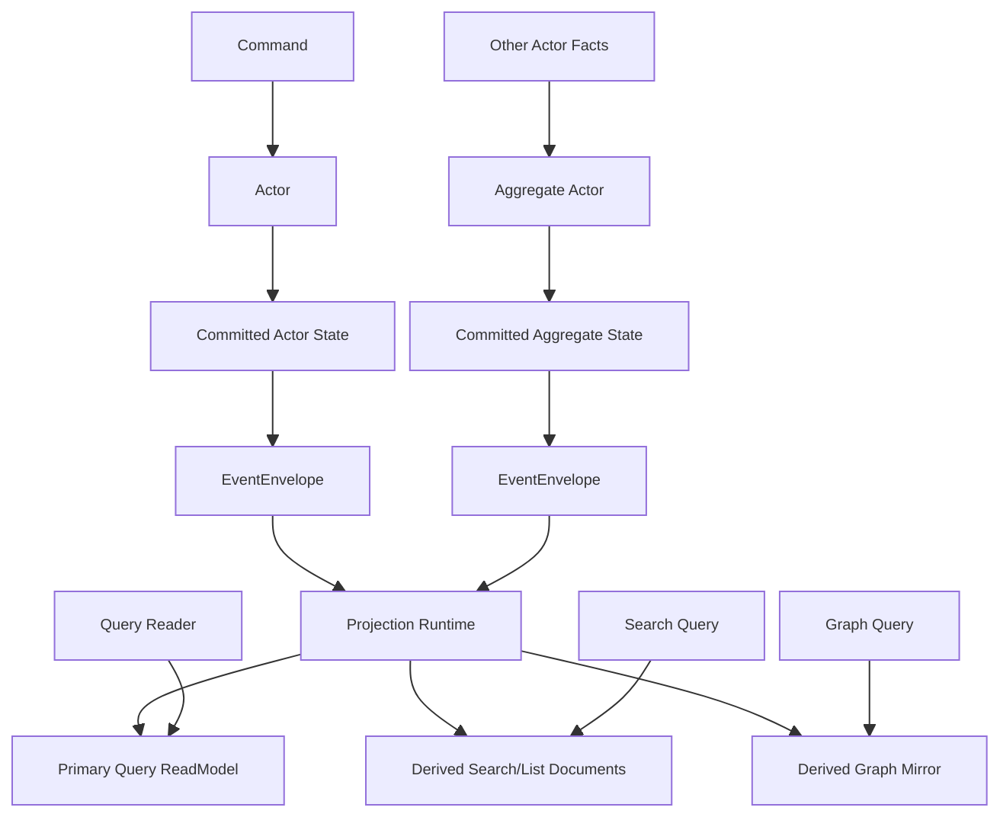
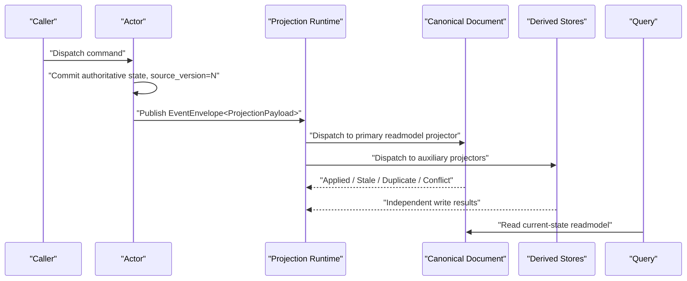

# Actor-State Mirror ReadModel 文件级架构变更详细设计（2026-03-15）

## 1. 文档元信息

- 状态：`Proposed`
- 版本：`R1`
- 目标：把现有 `event-driven current-state projection` 重构为“以 readmodel 为唯一查询面、统一通过 `EventEnvelope<ProjectionPayload>` 物化”的清晰链路
- 关联文档：
  - `docs/architecture/2026-03-15-cqrs-projection-readmodels-architecture.md`
  - `docs/architecture/2026-03-15-state-mirror-readmodel-refactor-implementation-blueprint.md`
  - `AGENTS.md`

## 2. 执行摘要

本次重构的核心不是“给 readmodel 加几个版本字段”，而是重写系统的职责边界：

1. `actor` 才是唯一权威状态拥有者。
2. `readmodel` 可以一对多，但只在存在消费场景时才创建，且都只能复制同一个 actor 的已提交状态。
3. `projection` 不再负责计算当前态，只负责复制当前态。
4. 跨 actor 语义不再伪装成 projection 聚合，而是新建 `aggregate actor`。
5. `replay / rebuild` 只保留在修复链路，不进入 query 正常路径。

一句话：

`one authoritative actor state -> many actor-scoped current-state readmodels`

## 3. 软件工程与面向对象原则

### 3.1 核心设计模式

本次重构明确采用以下模式。

1. `Single Source of Truth`
   - 权威状态只在 actor 持久态。
   - readmodel 只能复制，不定义真相。
2. `Materialized View`
   - readmodel 是物化视图，不是业务状态机。
3. `Publisher / Subscriber`
   - actor 发布 `EventEnvelope<ProjectionPayload>`，projection 订阅并物化。
4. `Ports and Adapters`
   - query/application 依赖 query port，不依赖具体 store。
   - projection 依赖 writer/dispatcher 抽象，不依赖具体 provider。
5. `Result Object`
   - provider 写入不再只靠异常，而是返回 `Applied / Stale / Duplicate / Conflict`。
6. `Strategy`
   - document / graph / search 不同物化形态通过不同 materializer/binding 实现。
7. `Aggregate Root`
   - 跨 actor 聚合语义回到新的 aggregate actor，而不是丢给 read side。
8. `Anti-Corruption Layer`
   - `state mirror payload` 只是 `ProjectionPayload` 的一种特例，不是 actor 内部 state dump。

### 3.2 OO 设计约束

本次重构的对象设计必须满足：

1. `SRP`
   - actor 负责业务语义
   - projector 负责物化
   - provider 负责条件写
   - query reader 负责读取，不负责刷新
2. `ISP`
   - 只保留一套满足主语义的 readmodel 契约
   - 既然仓库已经强制 `readmodel = actor-scoped current-state replica`，根接口本身就应携带这层语义
   - 不符合者直接退出 readmodel 体系，而不是再保留一个更宽松的基类
3. `DIP`
   - application/query 依赖 query port
   - runtime 依赖 write sink / writer
   - provider 作为基础设施适配器
4. `OCP`
   - 新增 actor-scoped readmodel 应只需新增 projection payload mapper、metadata provider、materializer
   - 不再要求增加 reducer 链和回放逻辑
5. `语义命名优先`
   - `StateVersion` 直接表达权威已提交版本，不再额外引入另一套版本字段
   - `LastEventId` 直接表达最后一次已物化事实标识，不再额外引入 `SourceEventId`
6. `Explicit Consumption`
   - 同一 actor 可以有多个 readmodel，但每个 readmodel 都必须绑定明确消费场景
   - 必须能指出具体 query/API/UI/search/graph 入口
   - 没有稳定消费方的 readmodel 直接判定为无效设计
7. `Query Surface Integrity`
   - 查询对象始终是 readmodel，不是 state mirror payload
   - `state mirror` 只允许作为 projection 输入模式存在
8. `Protocol / Query Separation`
   - `actor -> envelope -> actor` 是业务协议对象，不是 query reader 的职责
   - `query -> readmodel` 是读取对象，不是 actor protocol 的 continuation
   - query service / query reader 不得承担 actor 间回复协商

## 4. 当前实现的结构性问题

### 4.1 Projection 抽象仍然默认“读侧算当前态”

以下文件共同构成了当前问题根源：

- `src/Aevatar.CQRS.Projection.Stores.Abstractions/Abstractions/ReadModels/IProjectionDocumentWriter.cs`
- `src/Aevatar.CQRS.Projection.Runtime.Abstractions/Abstractions/Stores/IProjectionWriteDispatcher.cs`
- `src/Aevatar.CQRS.Projection.Runtime/Runtime/ProjectionStoreDispatcher.cs`

当前问题：

1. writer 只有裸 `UpsertAsync(...)`
2. dispatcher 仍把多 readmodel 物化揉在一个抽象里，职责边界不清
3. provider 无法表达 `stale / duplicate / conflict`

### 4.2 Workflow 当前态查询建立在混合 report 文档上

关键文件：

- `src/workflow/Aevatar.Workflow.Projection/Projectors/WorkflowRunInsightBridgeProjector.cs`
- `src/workflow/Aevatar.Workflow.Projection/Reducers/WorkflowExecutionReportArtifactMutations.cs`
- `src/workflow/Aevatar.Workflow.Projection/ReadModels/WorkflowExecutionReadModelMapper.cs`
- `src/workflow/Aevatar.Workflow.Projection/Orchestration/WorkflowProjectionQueryReader.cs`
- `src/workflow/Aevatar.Workflow.Application/Runs/WorkflowRunDurableCompletionResolver.cs`

当前问题：

1. `WorkflowExecutionReport` 同时承载当前态、timeline、summary、graph 输入
2. 旧 `WorkflowExecutionReportArtifactProjector` 曾先读旧文档，再按 event reducer 推下一态；当前实现已经改成 `WorkflowRunInsightBridgeProjector -> WorkflowRunInsightGAgent -> WorkflowRunInsightReadModelProjector`
3. `WorkflowExecutionReportArtifactMutations.RecordProjectedEvent(...)` 使用局部 artifact 版本推进
4. `WorkflowExecutionReadModelMapper` 同时映射 state mirror、projection state、timeline、graph，职责过载
5. query 侧把混合 report 当成当前态事实源

### 4.3 Scripting 当前态查询在 projection 侧重复执行业务逻辑

关键文件：

- `src/Aevatar.Scripting.Application/Runtime/ScriptBehaviorDispatcher.cs`
- `src/Aevatar.Scripting.Projection/Projectors/ScriptReadModelProjector.cs`
- `src/Aevatar.Scripting.Projection/Projectors/ScriptNativeDocumentProjector.cs`
- `src/Aevatar.Scripting.Projection/Projectors/ScriptNativeGraphProjector.cs`
- `src/Aevatar.Scripting.Projection/Orchestration/ScriptExecutionProjectionContext.cs`
- `src/Aevatar.Scripting.Projection/Orchestration/ProjectionScriptAuthorityReadModelActivationPort.cs`
- `src/Aevatar.Scripting.Projection/Queries/ScriptReadModelQueryReader.cs`

当前问题：

1. `ScriptBehaviorDispatcher` 只产出 `ScriptDomainFactCommitted`
2. `ScriptReadModelProjector` 在 projection 侧再次调用 `behavior.ReduceReadModel(...)`
3. native document / graph 依赖 `context.CurrentSemanticReadModelDocument`
4. projection context 持有“当前语义 readmodel 文档”这一中间事实态
5. 仓库里仍保留 query-time priming 入口

## 5. 目标架构

### 5.1 组件图

### 5.2 时序图

## 6. 目标对象模型

### 6.1 建议抽象

1. `IProjectionReadModel`
   - 直接表示 `actor-scoped current-state readmodel`
   - 暴露 `Id / ActorId / StateVersion / LastEventId / UpdatedAt`
2. `Artifact / Export / Log` 独立契约
   - 不再占用 readmodel 根接口
   - 不进入当前态 projection 主链
3. `ProjectionWriteResult`
   - 表示 provider 写入结果
4. `ProjectionWriteResultEvaluator`
   - 负责按 `StateVersion / LastEventId` 评估 `Applied / Duplicate / Stale / Conflict`
5. `ReadModelProjector`
   - 一个 projector 只负责一个 readmodel 物化目标

### 6.2 关键职责分配

1. `Actor`
   - 负责业务状态推进
   - 负责提交 committed event / committed state
2. `Projection Fact Factory`
   - 在存在消费场景时，负责把 actor state 转成 `ProjectionPayload`
3. `Projector`
   - 负责把 `ProjectionPayload` 映射成一个或多个 readmodel
4. `Dispatcher`
   - 负责把同一 `EventEnvelope<ProjectionPayload>` 送到多个独立 projector
5. `Provider`
   - 负责原子条件写
6. `Query Reader`
   - 负责读取物化结果

## 7. 文件级变更总表

### 7.1 Projection Store Abstractions

| 文件 | 当前职责 | 问题 | 变更动作 | 目标职责 |
| --- | --- | --- | --- | --- |
| `src/Aevatar.CQRS.Projection.Stores.Abstractions/Abstractions/ReadModels/IProjectionReadModel.cs` | 仅提供 `Id` | 过于宽松，允许旧语义回流 | `修改` | 根接口直接收紧为 actor-scoped current-state contract |
| `src/Aevatar.CQRS.Projection.Stores.Abstractions/Abstractions/ReadModels/IProjectionDocumentWriter.cs` | 裸 `UpsertAsync` | 无法表达稳定写入结果 | `修改` | 返回 `ProjectionWriteResult`，从 readmodel 自身源戳判断写入结果 |
| `src/Aevatar.CQRS.Projection.Stores.Abstractions/README.md` | 抽象层说明 | 未体现 state-mirror write 语义 | `修改` | 说明 actor-scoped readmodel 与条件写契约 |
| `src/Aevatar.CQRS.Projection.Stores.Abstractions/Abstractions/Artifacts/IProjectionArtifact.cs` | 不存在 | 历史/导出对象缺少独立归类 | `新增` | 承接退出 readmodel 主链的 artifact/export/log 对象 |
| `src/Aevatar.CQRS.Projection.Stores.Abstractions/Abstractions/ReadModels/ProjectionWriteResult.cs` | 不存在 | 缺少稳定结果模型 | `新增` | provider 写入结果对象 |
| `src/Aevatar.CQRS.Projection.Stores.Abstractions/Abstractions/ReadModels/ProjectionWriteResultKind.cs` | 不存在 | 缺少结果枚举 | `新增` | `Applied / Stale / Duplicate / Conflict` |
| `src/Aevatar.CQRS.Projection.Stores.Abstractions/Abstractions/ReadModels/ProjectionWriteResultEvaluator.cs` | 不存在 | provider 判断逻辑易重复 | `新增` | 提供共享判断逻辑 |

设计说明：

- 这里不再保留“最小身份 readmodel”。
- 既然架构已经强制 `readmodel = actor-scoped current-state replica`，那根接口本身就必须承载 `ActorId / StateVersion / LastEventId / UpdatedAt`。
- 不符合这条规则的对象直接退出 readmodel 主链，转到 `artifact/export/log` 抽象。

### 7.2 Projection Runtime Abstractions

| 文件 | 当前职责 | 问题 | 变更动作 | 目标职责 |
| --- | --- | --- | --- | --- |
| `src/Aevatar.CQRS.Projection.Runtime.Abstractions/Abstractions/Stores/IProjectionWriteDispatcher.cs` | 裸 fan-out 写接口 | 无法反馈稳定结果 | `修改` | 返回 `ProjectionWriteResult` |
| `src/Aevatar.CQRS.Projection.Runtime.Abstractions/Abstractions/Stores/IProjectionWriteSink.cs` | 统一 sink 接口 | 只需要表达单个物化目标的写入结果 | `修改` | 去掉 `Role`，只保留条件写与结果返回 |
| `src/Aevatar.CQRS.Projection.Runtime.Abstractions/Abstractions/Projectors/IReadModelProjectionDispatcher.cs` | 不存在 | 缺少 `EventEnvelope<ProjectionPayload>` 到多个 projector 的分发抽象 | `新增` | 显式表达“同一事实 -> 多 projector” |

设计说明：

- 不再用 `sink role` 偷偷表达主次顺序。
- 哪个 readmodel 是主读源，属于 query/application 层显式依赖，不属于 runtime sink 抽象。

### 7.3 Projection Runtime

| 文件 | 当前职责 | 问题 | 变更动作 | 目标职责 |
| --- | --- | --- | --- | --- |
| `src/Aevatar.CQRS.Projection.Runtime/Runtime/ProjectionStoreDispatcher.cs` | 顺序 fan-out + 失败补偿 | 藏了不必要的主次关系 | `修改` | 退化为单 readmodel 写入协调器，返回聚合结果但不做角色排序 |
| `src/Aevatar.CQRS.Projection.Runtime/Runtime/ProjectionDocumentStoreBinding.cs` | document sink 适配器 | 可保留，但不该有角色概念 | `修改` | 单纯转发 document 条件写 |
| `src/Aevatar.CQRS.Projection.Runtime/Runtime/ProjectionGraphStoreBinding.cs` | graph sink 适配器 | 不该再被当成同一个 readmodel sink | `删除或迁出` | graph mirror 通过独立 readmodel projector 物化 |
| `src/Aevatar.CQRS.Projection.Runtime/Runtime/LoggingProjectionStoreDispatchCompensator.cs` | 补偿日志 | 需要接收更丰富结果 | `修改` | 记录 `stale/duplicate/conflict` 和降级信息 |
| `src/Aevatar.CQRS.Projection.Runtime/README.md` | runtime 说明 | 未体现 state-mirror replication | `修改` | 说明 runtime 是复制编排器，不是当前态计算器 |

设计说明：

- `ProjectionStoreDispatcher` 只处理“单个 readmodel 往其目标 store 写入”。
- 多 readmodel 分发应上移到 `EventEnvelope<ProjectionPayload>` 的 projector-orchestrator 层，而不是藏在单个 sink 接口里。

### 7.4 Providers

| 文件 | 当前职责 | 问题 | 变更动作 | 目标职责 |
| --- | --- | --- | --- | --- |
| `src/Aevatar.CQRS.Projection.Providers.InMemory/Stores/InMemoryProjectionDocumentStore.cs` | 内存读写与查询 | 只有无条件覆盖 | `修改` | 在 `lock` 内实现条件写和结果返回 |
| `src/Aevatar.CQRS.Projection.Providers.Elasticsearch/Stores/ElasticsearchProjectionDocumentStore.cs` | ES document 读写 | 只有 PUT 覆盖，没有版本语义 | `修改` | 基于 `StateVersion + LastEventId` 执行 compare-and-write |
| `src/Aevatar.CQRS.Projection.Providers.Elasticsearch/Stores/ElasticsearchProjectionDocumentStore.Indexing.cs` | ES mapping/index bootstrap | 缺少 `source_version/source_event_id` 索引语义 | `修改` | 为 actor-scoped readmodel 建 long/keyword mapping |
| `src/Aevatar.CQRS.Projection.Providers.Elasticsearch/README.md` | provider 文档 | 未体现条件写 | `修改` | 说明 state-mirror current-state 写入契约 |

设计说明：

- `InMemory` 必须成为语义正确的 reference provider，而不是“方便开发但语义不同”的特殊实现。
- `Elasticsearch` 需要支持幂等重复和旧写拒绝，否则 state-mirror 复制语义在生产环境不成立。

### 7.5 Workflow Abstractions 与 Query Contracts

| 文件 | 当前职责 | 问题 | 变更动作 | 目标职责 |
| --- | --- | --- | --- | --- |
| `src/workflow/Aevatar.Workflow.Application.Abstractions/Queries/workflow_projection_query_models.proto` | workflow query DTO | `state_version` 命名失真 | `修改` | 把 `state_version` 改为 `source_version`，把 `last_event_id` 改为 `source_event_id` |
| `src/workflow/Aevatar.Workflow.Application.Abstractions/Runs/workflow_run_events.proto` | run event envelope + readmodel payload | run event 和 readmodel 输入契约揉在一起 | `修改` | 保留 run envelope，抽出 readmodel payload 到独立 proto |
| `src/workflow/Aevatar.Workflow.Application.Abstractions/Projections/workflow_actor_state_mirror_models.proto` | 不存在 | 缺少独立 readmodel 输入契约文件 | `新增` | 承载 `WorkflowActorStateMirrorPayload / WorkflowActorProjectionStatePayload` |
| `src/workflow/Aevatar.Workflow.Application.Abstractions/Queries/WorkflowProjectionQueryModels.Partial.cs` | query partial | 需要同步字段语义重命名 | `修改` | 与 `source_version` 命名对齐 |

设计说明：

- `workflow_run_events.proto` 里的 `WorkflowActorStateMirrorPayload` 不是 UI 事件本身，而是 projection readmodel 输入契约，应该抽到独立文件。
- 这是 `SRP` 和 `边界清晰` 的直接体现。

### 7.6 Workflow Application

| 文件 | 当前职责 | 问题 | 变更动作 | 目标职责 |
| --- | --- | --- | --- | --- |
| `src/workflow/Aevatar.Workflow.Application/Runs/WorkflowRunFinalizeEmitter.cs` | 读取 projection 后拼 completion event | 依赖 mixed query model | `修改` | 使用新的 readmodel query DTO；不再依赖旧 report 语义 |
| `src/workflow/Aevatar.Workflow.Application/Runs/WorkflowRunDurableCompletionResolver.cs` | 从 projection 判断 durable completion | 当前依赖旧 readmodel 来源 | `修改` | 改为依赖新的 `WorkflowActorReadModelDocument` 对应查询 |
| `src/workflow/Aevatar.Workflow.Application/Queries/WorkflowExecutionQueryApplicationService.cs` | workflow query façade | 当前 façade 下挂 mixed query reader | `修改` | 组合新的 readmodel query / graph query / catalog query |
| `src/workflow/Aevatar.Workflow.Application/Runs/WorkflowActorStateMirrorFactFactory.cs` | 不存在 | 缺少写侧 projection-fact 工厂 | `新增` | 从 actor 已提交 state 生成 `WorkflowActorStateMirrorPayload` |

设计说明：

- 为避免 application service 继续依赖 projection 内部 report 结构，写侧需要一个显式的 `Projection Fact Factory`。
- 这是典型的 `Factory + Anti-Corruption Layer`。

### 7.7 Workflow Projection

| 文件 | 当前职责 | 问题 | 变更动作 | 目标职责 |
| --- | --- | --- | --- | --- |
| `src/workflow/Aevatar.Workflow.Projection/Projectors/WorkflowRunInsightBridgeProjector.cs` | run actor committed observation -> insight actor bridge | bridge 若继续回流 reducer/旧文档读取会重新污染 projection | `保留并收紧` | 只负责桥接到 `WorkflowRunInsightGAgent`，不再直接 mutate report |
| `src/workflow/Aevatar.Workflow.Projection/Reducers/WorkflowExecutionReportArtifactMutations.cs` | report artifact 局部变更 | 仅允许保留 artifact 自身辅助变更，不得回流当前态语义 | `删除或裁剪` | 删除当前态版本推进逻辑 |
| `src/workflow/Aevatar.Workflow.Projection/ReadModels/WorkflowExecutionReadModelMapper.cs` | mixed mapper | 职责过载 | `拆分` | 拆成 readmodel mapper / graph mapper / timeline mapper |
| `src/workflow/Aevatar.Workflow.Projection/Orchestration/WorkflowProjectionQueryReader.cs` | readmodel/timeline/graph 一体读取 | 违反 SRP | `拆分` | `WorkflowActorReadModelQueryReader` + `WorkflowActorGraphQueryReader`，必要时保留 façade |
| `src/workflow/Aevatar.Workflow.Projection/ReadModels/WorkflowExecutionReadModel.Partial.cs` | mixed report 文档 | 当前态不该继续依赖它 | `降级` | 仅保留 artifact/history 语义 |
| `src/workflow/Aevatar.Workflow.Projection/ReadModels/WorkflowActorReadModelDocument.Partial.cs` | 不存在 | 缺少当前态主文档 | `新增` | workflow actor 当前态主查询文档 |
| `src/workflow/Aevatar.Workflow.Projection/workflow_actor_readmodel_document.proto` | 不存在 | 缺少主查询文档 proto | `新增` | 定义 `WorkflowActorReadModelDocument` |
| `src/workflow/Aevatar.Workflow.Projection/Metadata/WorkflowActorReadModelDocumentMetadataProvider.cs` | 不存在 | 缺少主查询文档元数据提供者 | `新增` | 提供 index/scope/field metadata |
| `src/workflow/Aevatar.Workflow.Projection/Projectors/WorkflowActorReadModelProjector.cs` | 不存在 | 缺少 workflow 当前态 readmodel projector | `新增` | 直接消费 workflow `ProjectionPayload` 并覆盖 document |
| `src/workflow/Aevatar.Workflow.Projection/ReadModels/WorkflowActorReadModelDocumentMapper.cs` | 不存在 | 需要窄 mapper | `新增` | workflow `ProjectionPayload` <-> document <-> query DTO 转换 |
| `src/workflow/Aevatar.Workflow.Projection/ReadModels/WorkflowExecutionGraphMaterializer.cs` | 从 report 生成 graph | graph 建立在 mixed report 上 | `修改` | 从 `WorkflowActorReadModelDocument` 或专用 graph section 生成 graph mirror |

设计说明：

- Workflow 当前态必须从 `report projection` 中抽离出来。
- `WorkflowExecutionReport` 如果保留，只能作为 report/artifact，不能再承担主 readmodel 角色。
- `WorkflowProjectionQueryReader` 当前是明显的 `God Reader`，应拆分。

### 7.8 Scripting Abstractions 与 Query Contracts

| 文件 | 当前职责 | 问题 | 变更动作 | 目标职责 |
| --- | --- | --- | --- | --- |
| `src/Aevatar.Scripting.Abstractions/Queries/script_read_model_query_models.proto` | 脚本 readmodel 查询 DTO | `state_version` 命名失真 | `修改` | 改为 `source_version/source_event_id` |
| `src/Aevatar.Scripting.Projection/script_projection_read_models.proto` | projection 文档模型 | 仍使用 `state_version/last_event_id` | `修改` | 所有 actor-scoped current-state 文档统一改为 `source_version/source_event_id` |
| `src/Aevatar.Scripting.Abstractions/CorePorts/script_readmodel_state_mirror_messages.proto` | 不存在 | 缺少写侧 readmodel 输入契约 | `新增` | 定义 `ScriptReadModelStateMirrorCommitted` |
| `src/Aevatar.Scripting.Abstractions/CorePorts/ScriptReadModelStateMirrorMessages.Partial.cs` | 不存在 | 缺少 partial helper | `新增` | 补构造器和语义 helper |

设计说明：

- `ScriptReadModelStateMirrorCommitted` 应是新的 projection 契约，不应继续塞回 `script_host_messages.proto`。
- 这样可以把 host runtime 协议和 projection readmodel 输入协议分离。

### 7.9 Scripting Application

| 文件 | 当前职责 | 问题 | 变更动作 | 目标职责 |
| --- | --- | --- | --- | --- |
| `src/Aevatar.Scripting.Application/Runtime/ScriptBehaviorDispatcher.cs` | 执行行为并生成 domain facts | 没有直接输出 `ProjectionPayload` | `修改` | 返回 `ScriptDispatchResult`，其中包含 domain facts 与 projection payload |
| `src/Aevatar.Scripting.Application/Runtime/ScriptDispatchResult.cs` | 不存在 | 缺少聚合返回对象 | `新增` | 封装 `CommittedFacts + ProjectionPayload` |
| `src/Aevatar.Scripting.Application/Runtime/ScriptReadModelStateMirrorFactFactory.cs` | 不存在 | 缺少 projection-fact factory | `新增` | 从 actor 当前 state 或 typed readmodel 生成 state mirror/projection payload |
| `src/Aevatar.Scripting.Application/Queries/ScriptReadModelQueryApplicationService.cs` | 查询 façade | 可保留 | `保留并调整` | 继续作为 façade，但底层读取新的 readmodel document |

设计说明：

- `DispatchAsync(...)` 只返回 domain facts 是当前最核心的架构缺口。
- 用 `ScriptDispatchResult` 比“继续向 list 塞更多返回值”更符合 OO 和命名语义。

### 7.10 Scripting Projection

| 文件 | 当前职责 | 问题 | 变更动作 | 目标职责 |
| --- | --- | --- | --- | --- |
| `src/Aevatar.Scripting.Projection/Projectors/ScriptReadModelProjector.cs` | 在 projection 侧调用 `ReduceReadModel` | 读侧重复执行业务逻辑 | `删除或彻底重写` | 改为 `ScriptCurrentStateReadModelProjector`，直接落主查询文档 |
| `src/Aevatar.Scripting.Projection/Projectors/ScriptNativeDocumentProjector.cs` | 依赖 `CurrentSemanticReadModelDocument` | 依赖中间上下文事实态 | `修改` | 直接消费 scripting `ProjectionPayload`，物化 native document |
| `src/Aevatar.Scripting.Projection/Projectors/ScriptNativeGraphProjector.cs` | 依赖 `CurrentSemanticReadModelDocument` | 同上 | `修改` | 直接消费 scripting `ProjectionPayload`，物化 graph mirror |
| `src/Aevatar.Scripting.Projection/Orchestration/ScriptExecutionProjectionContext.cs` | 保存 `CurrentSemanticReadModelDocument` | 中间层持有事实态 | `修改` | 删除该字段，保持纯上下文/租约信息 |
| `src/Aevatar.Scripting.Projection/Orchestration/ProjectionScriptAuthorityReadModelActivationPort.cs` | authority readmodel activation | 不应再暴露 priming 语义 | `保留并重命名` | 保留在 orchestration 层，显式表达 activation 语义 |
| `src/Aevatar.Scripting.Projection/Queries/ScriptReadModelQueryReader.cs` | 读 semantic document 并执行 declared query | 可保留 | `修改` | 继续从新的 readmodel document 读取，不依赖旧 reducer 路径 |
| `src/Aevatar.Scripting.Projection/ReadModels/ScriptProjectionReadModels.Partial.cs` | 文档 partial + converter | 命名与接口不统一 | `修改` | 让 current-state 文档实现收紧后的 `IProjectionReadModel` |
| `src/Aevatar.Scripting.Projection/Projectors/ScriptCurrentStateReadModelProjector.cs` | 不存在 | 缺少 direct current-state projector | `新增` | 从 `ScriptReadModelStateMirrorCommitted` 直接写 `ScriptReadModelDocument` |

设计说明：

- `ScriptReadModelProjector` 现在承担了“第二个行为执行器”的角色，这是最应该删除的部分。
- `CurrentSemanticReadModelDocument` 是典型的中间层事实态，应被清除。

### 7.11 Remaining Actor-Scoped Projections

以下文件不是第一优先级，但必须在第二轮统一到相同模式：

| 文件 | 当前职责 | 变更动作 |
| --- | --- | --- |
| `src/workflow/Aevatar.Workflow.Projection/Projectors/WorkflowActorBindingProjector.cs` | binding actor readmodel | 改为 projection-payload 驱动 |
| `src/workflow/Aevatar.Workflow.Projection/workflow_actor_binding_document.proto` | binding document | 命名改为 `source_version/source_event_id` |
| `src/Aevatar.Scripting.Projection/Projectors/ScriptCatalogEntryProjector.cs` | catalog actor readmodel | 改为 projection-payload 驱动 |
| `src/Aevatar.Scripting.Projection/Projectors/ScriptDefinitionStateMirrorProjector.cs` | definition actor readmodel | 改为 projection-payload 驱动 |
| `src/Aevatar.Scripting.Projection/Projectors/ScriptEvolutionReadModelProjector.cs` | evolution actor readmodel | 改为 projection-payload 驱动 |
| `src/Aevatar.Scripting.Projection/Reducers/ScriptEvolution*.cs` | evolution reducer 链 | 当前态路径删掉，若保留仅限 artifact/history |

原则：

- 只要是 actor-scoped current-state document，最终都要收敛到统一的 `ProjectionPayload` 输入；其中 state mirror payload 只是当前态直推的一种实现。

## 8. 测试与门禁变更

### 8.1 测试文件

| 文件 | 变更动作 | 目标 |
| --- | --- | --- |
| `test/Aevatar.CQRS.Projection.Core.Tests/ProjectionStoreDispatcherTests.cs` | `修改` | 覆盖单 readmodel 写入结果聚合、`stale`、`duplicate`、`conflict` |
| `test/Aevatar.CQRS.Projection.Core.Tests/ElasticsearchProjectionDocumentStoreBehaviorTests.cs` | `修改` | 覆盖 ES 条件写 |
| `test/Aevatar.CQRS.Projection.Core.Tests/ProjectionGraphStoreBindingTests.cs` | `删除或迁移` | graph 应退出单 readmodel sink 模型，改测独立 graph projector |
| `test/Aevatar.Workflow.Host.Api.Tests/WorkflowRunInsightBridgeProjectorTests.cs` | `重写中` | 当前已改成 insight actor bridge + readmodel materialization 测试 |
| `test/Aevatar.Workflow.Host.Api.Tests/WorkflowExecutionReportArtifactPayloadMapperTests.cs` | `删除` | payload mapper 已删除，补偿链直接使用 `Any.Pack/Unpack` |
| `test/Aevatar.Workflow.Application.Tests/WorkflowRunDurableCompletionResolverCoverageTests.cs` | `修改` | 覆盖新的 readmodel DTO |
| `test/Aevatar.Workflow.Application.Tests/WorkflowRunStateMirrorEmitterTests.cs` | `修改` | 验证复用抽取后的 projection-payload contract |
| `test/Aevatar.Scripting.Core.Tests/Projection/ScriptReadModelProjectorTests.cs` | `删除或重写` | 改为 direct current-state readmodel projector 测试 |
| `test/Aevatar.Scripting.Core.Tests/Projection/ScriptNativeDocumentProjectorTests.cs` | `修改` | 验证直接消费 scripting `ProjectionPayload` |
| `test/Aevatar.Scripting.Core.Tests/Projection/ScriptNativeGraphProjectorTests.cs` | `修改` | 同上 |
| `test/Aevatar.Scripting.Core.Tests/Projection/ScriptReadModelQueryReaderTests.cs` | `修改` | 验证 declared query 从新 readmodel document 读取 |
| `test/Aevatar.Scripting.Core.Tests/Runtime/ScriptBehaviorDispatcherTests.cs` | `修改` | 覆盖 `ScriptDispatchResult` 和 projection payload 生成 |

### 8.2 门禁文件

| 文件 | 变更动作 | 目标 |
| --- | --- | --- |
| `tools/ci/architecture_guards.sh` | `修改` | 接入新的 current-state state-mirror guards |
| `tools/ci/query_projection_priming_guard.sh` | `新增` | 持续禁止 query-time priming |
| `tools/ci/projection_state_mirror_current_state_guard.sh` | `新增` | 禁止 current-state projector 读取旧文档做 reducer |
| `tools/ci/projection_state_version_guard.sh` | `新增` | 禁止当前态路径中的本地 `StateVersion++` |

建议的静态门禁规则：

1. `Projectors/*CurrentState*` 或 `*ReadModelProjector*` 不得依赖 `IProjectionDocumentReader<same readmodel>`
2. 当前态 readmodel proto 不得新增 `timeline/history/audit` 字段
3. query/read path 不得调用 `PrimeAsync / EnsureActorProjectionAsync / AttachLiveSinkAsync`

## 9. 命名与契约统一规则

无兼容性约束下，建议统一重命名：

1. `state_version` -> `source_version`
2. `last_event_id` -> `source_event_id`
3. `WorkflowExecutionReport` 若只保留为 artifact，可改名为 `WorkflowExecutionArtifactDocument`
4. `ScriptReadModelDocument` 若明确是主查询 semantic readmodel，可改名为 `ScriptSemanticReadModelDocument`

理由：

1. `state_version` 太容易被误解成 projection 本地状态版本
2. `source_version` 明确表示来自 actor 权威提交版本
3. 命名必须让对象职责一眼可见

## 10. 迁移顺序

### Phase 1：底座

1. 改 `Projection.Stores.Abstractions`
2. 改 `Projection.Runtime.Abstractions`
3. 改 `Projection.Runtime`
4. 改 `InMemory / Elasticsearch` provider

### Phase 2：Workflow 当前态主路径

1. 抽出 workflow projection-payload proto
2. 新建 `WorkflowActorReadModelDocument`
3. 新建 readmodel projector / mapper / query reader
4. 切换 `WorkflowRunDurableCompletionResolver` 与 query service
5. 将 `WorkflowExecutionReport` 降级为 artifact/history

### Phase 3：Scripting 当前态主路径

1. 新增 `ScriptReadModelStateMirrorCommitted`
2. 改 `ScriptBehaviorDispatcher` 返回 `ScriptDispatchResult`
3. 新建 `ScriptCurrentStateReadModelProjector`
4. 改 native document / graph projector
5. 删 `CurrentSemanticReadModelDocument` 和 priming port

### Phase 4：剩余 actor-scoped projections

1. workflow binding
2. script definition readmodel
3. script catalog entry
4. script evolution readmodel

### Phase 5：清理与验收

1. 删除旧 current-state reducer 路径
2. 更新测试
3. 更新门禁
4. 跑全量 build/test

## 11. 验收标准

本次重构完成的判定标准：

1. 当前态 query 只读取 actor-scoped readmodel documents
2. 当前态 projector 不再读取旧 readmodel 做 reducer
3. provider 支持 `Applied / Stale / Duplicate / Conflict`
4. `workflow` 与 `scripting` 当前态文档都直接来自统一的 readmodel 投影输入
5. query path 中不存在 priming / replay / refresh
6. 跨 actor 聚合未继续落在通用 projection 中
7. `dotnet build aevatar.slnx --nologo`
8. `dotnet test aevatar.slnx --nologo`
9. `bash tools/ci/architecture_guards.sh`

## 12. 最终结论

这次重构真正要删除的不是几段 reducer 代码，而是一个错误的软件工程前提：

`read side 也可以拥有一套当前态计算逻辑`

新的前提应当是：

1. actor 拥有唯一业务真相
2. `ProjectionPayload` 是该真相投影到查询面的输入契约
3. projection 只复制真相
4. readmodel 可以一对多，但都只复制同一 actor 当前态
5. 聚合语义必须回到 actor

这套设计同时满足：

1. CQRS 的读写边界清晰
2. OO 的职责收敛
3. provider 的一致性可验证
4. query 的语义诚实
5. 框架的长期可维护性
