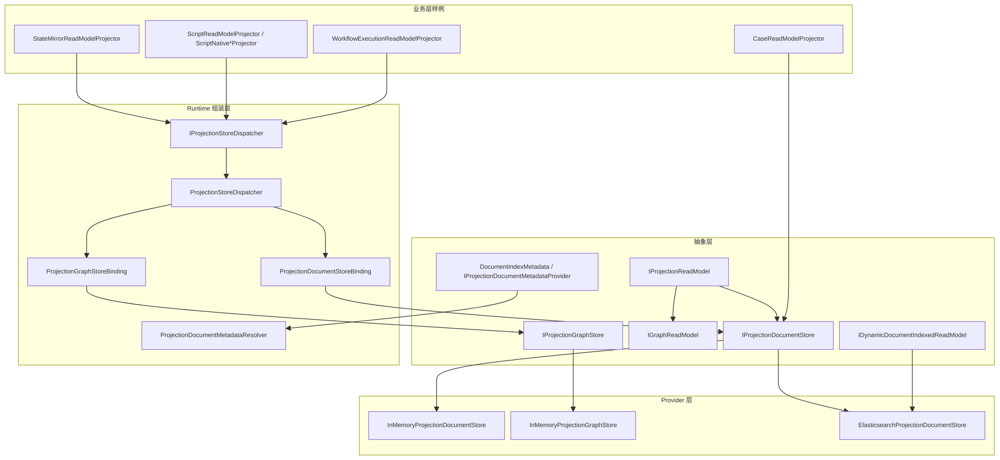
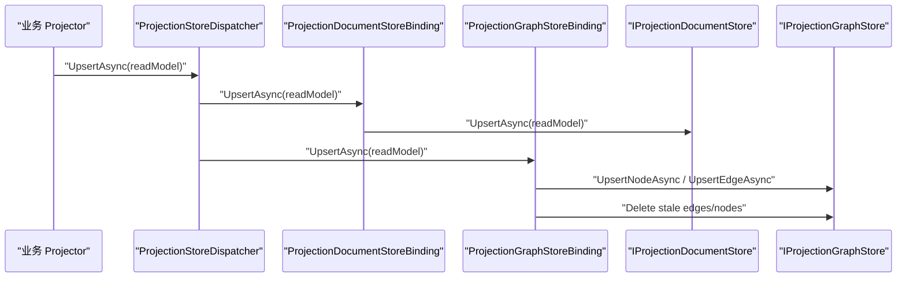
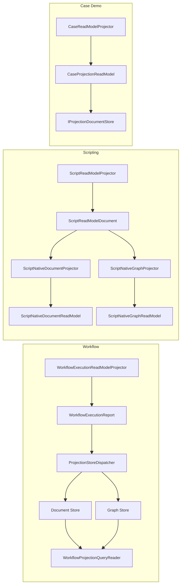

# CQRS Projection ReadModels 架构说明

## 1. 范围

本文聚焦以下目录及其直接相关组件：

- `src/Aevatar.CQRS.Projection.Stores.Abstractions/Abstractions/ReadModels`
- `src/Aevatar.CQRS.Projection.Stores.Abstractions/Abstractions/Graphs`
- `src/Aevatar.CQRS.Projection.Runtime.Abstractions`
- `src/Aevatar.CQRS.Projection.Runtime`
- `src/Aevatar.CQRS.Projection.Providers.InMemory`
- `src/Aevatar.CQRS.Projection.Providers.Elasticsearch`
- `src/Aevatar.CQRS.Projection.StateMirror`
- 业务使用样例：
  - `src/workflow/Aevatar.Workflow.Projection`
  - `src/Aevatar.Scripting.Projection`
  - `demos/Aevatar.Demos.CaseProjection`

本文不展开 actor lease、projection session hub、event sink runtime core 的全部细节，只覆盖它们与 ReadModel 存储抽象发生交互的部分。

## 2. 总体定位

`ReadModels` 相关抽象的职责不是“定义某个业务域”，而是为所有业务域提供一套统一的读侧持久化/查询边界：

- `ReadModel` 定义“读侧对象最小契约”。
- `Document Store` 定义“按 key 读写文档”的能力。
- `Graph Store` 定义“按 scope 管理图节点/边”的能力。
- `Runtime` 负责把一个 `ReadModel` 同时分发到一个或多个 store。
- `Provider` 负责具体存储实现，例如 InMemory 或 Elasticsearch。
- 业务模块只负责“如何构造 ReadModel”，不直接关心具体存储。

## 3. 分层图

## 4. 组件清单

| 层 | 组件 | 关键文件 | 责任 |
| --- | --- | --- | --- |
| Stores.Abstractions | ReadModel 基础契约 | `IProjectionReadModel.cs` | 规定 ReadModel 至少有稳定 `Id` |
| Stores.Abstractions | 文档存储契约 | `IProjectionDocumentStore.cs` | 定义 `Upsert/Mutate/Get/List` |
| Stores.Abstractions | 图存储契约 | `IProjectionGraphStore.cs` | 定义节点/边写入与邻居/子图查询 |
| Stores.Abstractions | 索引元数据契约 | `DocumentIndexMetadata.cs` `IProjectionDocumentMetadataProvider.cs` | 约定索引名、mapping、settings、aliases |
| Stores.Abstractions | 动态索引扩展 | `IDynamicDocumentIndexedReadModel.cs` | 允许实例级决定写入哪个 index |
| Runtime | 分发器 | `ProjectionStoreDispatcher.cs` | 一次写入 fan-out 到多个 binding |
| Runtime | 文档 binding | `ProjectionDocumentStoreBinding.cs` | 把 runtime 调用桥接到 `IProjectionDocumentStore` |
| Runtime | 图 binding | `ProjectionGraphStoreBinding.cs` | 把 `IGraphReadModel` 桥接到 `IProjectionGraphStore` |
| Runtime | 元数据解析器 | `ProjectionDocumentMetadataResolver.cs` | 从 DI 解析 `DocumentIndexMetadata` |
| Provider | 内存文档存储 | `InMemoryProjectionDocumentStore.cs` | 开发/测试用文档持久化 |
| Provider | 内存图存储 | `InMemoryProjectionGraphStore.cs` | 开发/测试用图持久化 |
| Provider | Elasticsearch 文档存储 | `ElasticsearchProjectionDocumentStore*.cs` | 生产向文档持久化与 OCC mutate |
| StateMirror | 状态镜像 | `JsonStateMirrorProjection.cs` `StateMirrorReadModelProjector.cs` | `State -> ReadModel` 的通用镜像与写入 |
| Workflow 样例 | 运行报表读模型 | `WorkflowExecutionReadModelProjector.cs` `WorkflowExecutionReadModel.Partial.cs` | 生成 document + graph 双形态读模型 |
| Scripting 样例 | 语义/原生读模型 | `ScriptReadModelProjector.cs` `ScriptNative*Projector.cs` | 先生成语义文档，再物化 native document / graph |
| Demo 样例 | 最小文档读模型 | `CaseReadModelProjector.cs` | 不走 runtime，多 reducer 直接写 document store |

## 5. Contract 层详解

### 5.1 `IProjectionReadModel`

文件：`src/Aevatar.CQRS.Projection.Stores.Abstractions/Abstractions/ReadModels/IProjectionReadModel.cs`

这是最小核心契约，只要求：

- ReadModel 必须有稳定 `Id`
- `Id` 是 runtime 和 provider 的统一主键入口
- 抽象层不强制时间戳、版本号、元数据字段长什么样

这意味着：

- 优点是通用、窄接口、方便业务自定义
- 代价是具体业务模型必须自己决定是否携带 `StateVersion`、`UpdatedAt`、`LastEventId` 等字段

### 5.2 `IProjectionReadModelCloneable<TReadModel>`

文件：`src/Aevatar.CQRS.Projection.Stores.Abstractions/Abstractions/ReadModels/IProjectionReadModelCloneable.cs`

这是一个性能和语义安全优化点：

- InMemory provider 读写时需要隔离引用
- 如果模型自己实现 `DeepClone()`，provider 可以避免通用 JSON roundtrip
- 未实现时，InMemory provider 会回退到 JSON 序列化克隆

### 5.3 `IProjectionDocumentStore<TReadModel,TKey>`

文件：`src/Aevatar.CQRS.Projection.Stores.Abstractions/Abstractions/ReadModels/IProjectionDocumentStore.cs`

它定义了文档读模型的标准能力：

- `UpsertAsync(readModel)`：按 readModel 自身 key 覆盖写入
- `MutateAsync(key, mutate)`：按 key 取出文档后原地变更
- `GetAsync(key)`：按 key 查询
- `ListAsync(take)`：列出最近一批文档

这里的关键设计点是：

- `MutateAsync` 是文档存储级别能力，而不是 projector 自己先 `Get` 再 `Upsert`
- 这样 provider 能自己处理并发和原子性
- runtime 可以把 document store 当成唯一 queryable binding

### 5.4 `DocumentIndexMetadata` 与 `IProjectionDocumentMetadataProvider<TReadModel>`

文件：

- `src/Aevatar.CQRS.Projection.Stores.Abstractions/Abstractions/ReadModels/DocumentIndexMetadata.cs`
- `src/Aevatar.CQRS.Projection.Stores.Abstractions/Abstractions/ReadModels/IProjectionDocumentMetadataProvider.cs`

这组契约定义“这个 ReadModel 在文档存储里应该如何建索引”：

- `IndexName`
- `Mappings`
- `Settings`
- `Aliases`

注意这层 metadata 不是业务数据，而是 provider 侧的存储描述。

典型用法：

- Workflow 注册 `WorkflowExecutionReportDocumentMetadataProvider`
- Scripting 注册 `ScriptReadModelDocumentMetadataProvider`
- Runtime 通过 `ProjectionDocumentMetadataResolver` 从 DI 中统一解析

### 5.5 `IDynamicDocumentIndexedReadModel`

文件：`src/Aevatar.CQRS.Projection.Stores.Abstractions/Abstractions/ReadModels/IDynamicDocumentIndexedReadModel.cs`

这个接口解决“同一种 ReadModel 类型，实例之间可能要落到不同索引”的问题：

- `DocumentIndexScope`
- `DocumentMetadata`

当前它主要服务于 Scripting native document 场景：

- schema 不同，索引 scope 不同
- 一个泛型 provider 要根据实例决定 index name

这是一个比“全局 provider metadata”更动态的扩展点。

### 5.6 `IGraphReadModel` 与 Graph 结构

文件：

- `src/Aevatar.CQRS.Projection.Stores.Abstractions/Abstractions/ReadModels/IGraphReadModel.cs`
- `src/Aevatar.CQRS.Projection.Stores.Abstractions/Abstractions/Graphs/ProjectionGraphNode.cs`
- `src/Aevatar.CQRS.Projection.Stores.Abstractions/Abstractions/Graphs/ProjectionGraphEdge.cs`
- `src/Aevatar.CQRS.Projection.Stores.Abstractions/Abstractions/Graphs/ProjectionGraphQuery.cs`
- `src/Aevatar.CQRS.Projection.Stores.Abstractions/Abstractions/Graphs/ProjectionGraphSubgraph.cs`

图读模型不是独立存储对象类型，而是 ReadModel 的一个能力扩展：

- `GraphScope`
- `GraphNodes`
- `GraphEdges`

其含义是：

- 同一个业务 read model 可以同时拥有“文档视图”和“图视图”
- 文档视图走 `IProjectionDocumentStore`
- 图视图走 `IProjectionGraphStore`
- runtime 不要求两者绑定到同一个底层 provider

## 6. Runtime 层工作方式

### 6.1 默认注册

文件：`src/Aevatar.CQRS.Projection.Runtime/DependencyInjection/ServiceCollectionExtensions.cs`

`AddProjectionReadModelRuntime()` 默认注册：

- `IProjectionStoreDispatcher<,>` -> `ProjectionStoreDispatcher<,>`
- `IProjectionQueryableStoreBinding<,>` -> `ProjectionDocumentStoreBinding<,>`
- `IProjectionStoreBinding<,>` -> `ProjectionDocumentStoreBinding<,>`
- `IProjectionStoreBinding<,>` -> `ProjectionGraphStoreBinding<,>`
- `IProjectionDocumentMetadataResolver` -> `ProjectionDocumentMetadataResolver`
- `IProjectionStoreDispatchCompensator<,>` -> `LoggingProjectionStoreDispatchCompensator<,>`

这意味着 runtime 的默认预期是：

- document binding 总是尝试注册
- graph binding 总是尝试注册
- 是否真正激活，由 binding 自己报告配置状态

### 6.2 `ProjectionStoreDispatcher<TReadModel,TKey>`

文件：`src/Aevatar.CQRS.Projection.Runtime/Runtime/ProjectionStoreDispatcher.cs`

它是整个 read model runtime 的中心。

核心职责：

- 收集所有 `IProjectionStoreBinding<TReadModel,TKey>`
- 过滤掉未配置 binding
- 约束最多只能有一个 `IProjectionQueryableStoreBinding<TReadModel,TKey>`
- 对写入做 fan-out
- 对失败做补偿回调

它的运行规则非常重要：

1. `UpsertAsync`

- 对所有已激活 binding 顺序写入
- 每个 binding 支持重试
- 任一 binding 失败时，触发 `CompensateAsync`

2. `MutateAsync`

- 只能在 queryable binding 上执行
- mutate 完成后，再从 queryable binding 读取最新文档
- 把更新后的完整 read model 再 upsert 到所有 write-only binding

3. `GetAsync/ListAsync`

- 只允许走 queryable binding
- graph binding 从不承担通用 `Get/List`

这套语义保证了：

- 文档存储是 query 主入口
- graph 存储是派生副本
- 多 store 一致性靠“先 queryable mutate，再 fan-out”维持

### 6.3 `ProjectionDocumentStoreBinding<TReadModel,TKey>`

文件：`src/Aevatar.CQRS.Projection.Runtime/Runtime/ProjectionDocumentStoreBinding.cs`

它是 runtime 到 document provider 的适配层：

- 如果注入了 `IProjectionDocumentStore<TReadModel,TKey>`，binding 激活
- 如果没有注册 provider，binding 标记为未配置
- 作为唯一 queryable binding，承担 `Mutate/Get/List`

它本身不包含业务逻辑，只是桥接和 availability reporting。

### 6.4 `ProjectionGraphStoreBinding<TReadModel,TKey>`

文件：`src/Aevatar.CQRS.Projection.Runtime/Runtime/ProjectionGraphStoreBinding.cs`

graph binding 比 document binding 更复杂，因为它承担了 graph 生命周期管理。

激活条件：

- 容器里存在 `IProjectionGraphStore`
- `TReadModel` 实现了 `IGraphReadModel`

写入流程：

- 读取 `GraphScope`
- 计算 `ownerId`
- 规范化 nodes / edges
- 自动注入 managed 标记：
  - `projectionManaged=true`
  - `projectionOwnerId=<ownerId>`
- upsert 到 graph store

清理流程：

- 按 owner 列出现有 managed edges/nodes
- 删除本次写入目标集合之外的旧 edge
- 对无邻接关系的旧 node 执行删除

也就是说，graph binding 不只是写入器，它还是 graph 副本的生命周期裁决器。

### 6.5 `ProjectionDocumentMetadataResolver`

文件：`src/Aevatar.CQRS.Projection.Runtime/Runtime/ProjectionDocumentMetadataResolver.cs`

它的作用很窄：

- 从容器中解析 `IProjectionDocumentMetadataProvider<TReadModel>`
- 返回 `DocumentIndexMetadata`

它本身不缓存、不合并、不修改 metadata。

## 7. Runtime 写入时序图

## 8. Provider 层实现

### 8.1 InMemory document store

文件：`src/Aevatar.CQRS.Projection.Providers.InMemory/Stores/InMemoryProjectionDocumentStore.cs`

设计目标：

- 开发/测试期快速反馈
- 不承担生产事实源角色

关键行为：

- 构造时接收 `keySelector`
- 所有数据保存在进程内字典
- `Upsert/Mutate/Get/List` 全部用 `lock` 保护
- 返回对象一律 clone，避免调用方拿到共享引用
- clone 优先使用 `IProjectionReadModelCloneable<T>`，否则回退到 JSON roundtrip

这个 provider 的价值在于：

- 对业务层来说，接口和生产 provider 一样
- 对开发期来说，避免引入外部基础设施

### 8.2 InMemory graph store

文件：`src/Aevatar.CQRS.Projection.Providers.InMemory/Stores/InMemoryProjectionGraphStore.cs`

关键行为：

- 用两个字典分别保存 node 和 edge
- `scope + nodeId` / `scope + edgeId` 组成内部 key
- 支持：
  - `ListNodesByOwnerAsync`
  - `ListEdgesByOwnerAsync`
  - `GetNeighborsAsync`
  - `GetSubgraphAsync`

其中：

- owner 查询依赖 `projectionOwnerId`
- 子图查询通过 BFS 风格的 frontier 扩展实现
- 缺失节点会补一个 `NodeType="Unknown"` 的占位节点

### 8.3 Elasticsearch document store

文件：

- `src/Aevatar.CQRS.Projection.Providers.Elasticsearch/Stores/ElasticsearchProjectionDocumentStore.cs`
- `src/Aevatar.CQRS.Projection.Providers.Elasticsearch/Stores/ElasticsearchProjectionDocumentStore.Indexing.cs`
- `src/Aevatar.CQRS.Projection.Providers.Elasticsearch/Stores/ElasticsearchProjectionDocumentStoreMetadataSupport.cs`
- `src/Aevatar.CQRS.Projection.Providers.Elasticsearch/Stores/ElasticsearchProjectionDocumentStorePayloadSupport.cs`
- `src/Aevatar.CQRS.Projection.Providers.Elasticsearch/Stores/ElasticsearchProjectionDocumentStoreNamingSupport.cs`

它是当前最完整的生产向 document provider。

主要能力：

- HTTP 直连 Elasticsearch
- 用 `DocumentIndexMetadata` 初始化索引
- `MutateAsync` 使用 `seq_no / primary_term` 做 OCC
- 支持实例级动态索引

工作步骤：

1. 启动时规范化 `DocumentIndexMetadata`
2. 计算最终 index name
3. `UpsertAsync` 时按 key 发送 `PUT /{index}/_doc/{id}`
4. `MutateAsync` 时先读取 `_seq_no/_primary_term`
5. 带 OCC 参数回写
6. 自动创建 index 时，用 metadata 生成 mappings/settings/aliases payload

注意点：

- 如果 `TReadModel` 实现 `IDynamicDocumentIndexedReadModel`，写入会按实例决定目标 index
- 但这类动态索引 read model 的通用 `Get/List/Mutate` 会被禁止
- 原因是 runtime 无法在“无额外业务上下文”的情况下反推出应该查哪个 index

## 9. 业务侧如何使用这些抽象

### 9.1 Workflow：一个 ReadModel 同时输出 document 与 graph

关键文件：

- `src/workflow/Aevatar.Workflow.Projection/DependencyInjection/ServiceCollectionExtensions.cs`
- `src/workflow/Aevatar.Workflow.Projection/Projectors/WorkflowExecutionReadModelProjector.cs`
- `src/workflow/Aevatar.Workflow.Projection/ReadModels/WorkflowExecutionReadModel.Partial.cs`
- `src/workflow/Aevatar.Workflow.Projection/Orchestration/WorkflowProjectionQueryReader.cs`
- `src/workflow/Aevatar.Workflow.Projection/Metadata/WorkflowExecutionReportDocumentMetadataProvider.cs`

工作方式：

1. DI 注册 runtime、metadata provider、projector、query reader
2. `WorkflowExecutionReadModelProjector.InitializeAsync()` 创建 `WorkflowExecutionReport`
3. reducer 持续 mutate 这个 report
4. report 同时实现：
   - `IProjectionReadModel`
   - `IGraphReadModel`
   - `IHasProjectionTimeline`
   - `IHasProjectionRoleReplies`
5. `ProjectionStoreDispatcher` 把一个 report 同时写到：
   - document store
   - graph store
6. 查询时：
   - snapshot/timeline 走 document store
   - graph edge/subgraph 走 graph store

这是 `ReadModel` 抽象最完整的业务落地示例。

### 9.2 Workflow binding：纯 document read model

关键文件：

- `src/workflow/Aevatar.Workflow.Projection/Projectors/WorkflowActorBindingProjector.cs`
- `src/workflow/Aevatar.Workflow.Projection/ReadModels/WorkflowActorBindingDocument.Partial.cs`
- `src/workflow/Aevatar.Workflow.Projection/Metadata/WorkflowActorBindingDocumentMetadataProvider.cs`

这个 read model 不实现 `IGraphReadModel`，因此：

- document binding 激活
- graph binding 自动跳过

它展示了 runtime 的一个核心特性：同一套 runtime 可以服务 document-only 模型和 document+graph 模型。

### 9.3 Scripting：先语义文档，再 native document / native graph

关键文件：

- `src/Aevatar.Scripting.Projection/DependencyInjection/ServiceCollectionExtensions.cs`
- `src/Aevatar.Scripting.Projection/Projectors/ScriptReadModelProjector.cs`
- `src/Aevatar.Scripting.Projection/Projectors/ScriptNativeDocumentProjector.cs`
- `src/Aevatar.Scripting.Projection/Projectors/ScriptNativeGraphProjector.cs`
- `src/Aevatar.Scripting.Projection/Materialization/ScriptNativeDocumentMaterializer.cs`
- `src/Aevatar.Scripting.Projection/Materialization/ScriptNativeGraphMaterializer.cs`
- `src/Aevatar.Scripting.Projection/Queries/ScriptReadModelQueryReader.cs`

这条链路比 workflow 更复杂，分成三层：

1. 语义 read model

- `ScriptReadModelProjector` 先把 committed domain fact reduce 成 `ScriptReadModelDocument`
- 它是 query 侧的主语义文档

2. native document

- `ScriptNativeDocumentProjector` 读取当前语义文档
- 编译 materialization plan
- 从 typed semantic read model 抽出字段
- 物化成 `ScriptNativeDocumentReadModel`
- 通过 dispatcher 写入 document store

3. native graph

- `ScriptNativeGraphProjector` 同样基于语义文档和 materialization plan
- 物化出 `ScriptNativeGraphReadModel`
- 通过 dispatcher 触发 graph binding 写入 graph store

这说明 `ReadModel` 抽象不仅能承载“直接 reducer 产物”，也能承载“由另一个语义 read model 派生出来的 materialized model”。

### 9.4 StateMirror：`State -> ReadModel` 快速镜像

关键文件：

- `src/Aevatar.CQRS.Projection.StateMirror/Services/JsonStateMirrorProjection.cs`
- `src/Aevatar.CQRS.Projection.StateMirror/Services/StateMirrorReadModelProjector.cs`

使用方式：

1. `JsonStateMirrorProjection<TState,TReadModel>` 通过 JSON 节点镜像做字段复制
2. 可配置字段忽略和重命名
3. `StateMirrorReadModelProjector` 再把投影结果写入 dispatcher

这条链路适合：

- 读模型和状态结构高度相似
- 暂时不需要复杂业务 reducer

不适合：

- 需要跨事件聚合
- 需要业务语义推导
- 需要显式控制图结构

### 9.5 CaseProjection Demo：最小文档路径

关键文件：

- `demos/Aevatar.Demos.CaseProjection/Projectors/CaseReadModelProjector.cs`
- `demos/Aevatar.Demos.CaseProjection/Stores/InMemoryCaseReadModelStore.cs`
- `demos/Aevatar.Demos.CaseProjection/DependencyInjection/ServiceCollectionExtensions.cs`

这个 demo 展示的是最小路径：

- 不走 `ProjectionStoreDispatcher`
- projector 直接依赖 `IProjectionDocumentStore`
- reducer 直接 mutate document

它的意义是：

- 证明 `ReadModels` 抽象可以脱离 runtime 单独使用
- runtime 是“组装层”，不是“使用这些抽象的前置条件”

## 10. 业务实例图

## 11. Query 路径如何工作

ReadModel 抽象本身只定义存储，不定义 query API。

业务层通常用两种方式做 query：

1. 直接读 document store

- 例如 `WorkflowProjectionQueryReader`
- 例如 `ScriptReadModelQueryReader`
- 例如 `ProjectionScriptCatalogQueryPort`

2. 直接读 graph store

- 例如 `WorkflowProjectionQueryReader.GetActorGraphEdgesAsync()`
- query reader 自己构造 `ProjectionGraphQuery`

这说明 document query 和 graph query 是两套并行读路径，不存在“先查 document 再自动推 graph”的统一中间层。

## 12. 设计边界与关键语义

### 12.1 Document 与 Graph 是平行副本

不是：

- graph 从 document 实时查询生成
- 或 document 从 graph 反推生成

而是：

- 同一个业务 read model 对象，分别通过不同 binding 投影到两个存储

### 12.2 Queryable binding 只有 0..1 个

runtime 有意限制：

- 通用 `Get/List/Mutate` 必须有唯一来源
- 否则会出现多 store query 口径竞争

所以 document binding 是通用 query 主路径，graph binding 只负责图形副本。

### 12.3 Dynamic indexing 是 provider 级扩展，不是通用 query 承诺

`IDynamicDocumentIndexedReadModel` 很强，但也带来限制：

- 写入时可以动态选择 index
- 通用 query 时却缺少稳定 index 定位上下文

因此当前 Elasticsearch provider 对动态索引模型只保证写，不保证通用 `Get/List/Mutate`。

### 12.4 Runtime 负责 fan-out，不负责 provider 选择

provider 的选择在 DI：

- 你注册哪个 `IProjectionDocumentStore<TReadModel,TKey>`
- runtime 就绑定哪个

runtime 不接受 “ProviderName=Elasticsearch/InMemory” 这种业务级路由参数。

### 12.5 StateMirror 只是镜像，不是业务 reducer

它是一个快速投影器，不是业务编排器。

出现以下需求时应切换到显式 projector/reducer：

- 事件驱动聚合
- 跨事件版本推进
- 图结构构建
- 复杂派生字段

## 13. 当前实现对业务模块的实际意义

如果你在业务层新增一个 ReadModel，通常需要做 5 件事：

1. 定义 `ReadModel` 类型，实现 `IProjectionReadModel`
2. 如果要走 graph，同步实现 `IGraphReadModel`
3. 注册 `IProjectionDocumentMetadataProvider<TReadModel>`
4. 选择 provider：
   - `AddInMemoryDocumentProjectionStore<TReadModel,TKey>()`
   - 或 `AddElasticsearchDocumentProjectionStore<TReadModel,TKey>()`
   - 可选 `AddInMemoryGraphProjectionStore()`
5. 在业务 projector / state mirror 中调用：
   - `IProjectionStoreDispatcher<TReadModel,TKey>`
   - 或最小化场景下直接调用 `IProjectionDocumentStore<TReadModel,TKey>`

## 14. 一句话总结

`src/Aevatar.CQRS.Projection.Stores.Abstractions/Abstractions/ReadModels` 这一组代码定义的不是某个具体业务模型，而是 Aevatar 全仓库读侧物化的统一骨架：

- 业务模块负责“生成什么 ReadModel”
- runtime 负责“如何把一个 ReadModel 同步到 document/graph”
- provider 负责“最终如何存”
- query reader 负责“如何把存储中的 ReadModel 还原为业务查询结果”

这也是为什么同一套抽象能够同时支撑：

- Workflow 运行报表
- Scripting 语义与 native 物化
- StateMirror 快速镜像
- Case demo 最小实现
