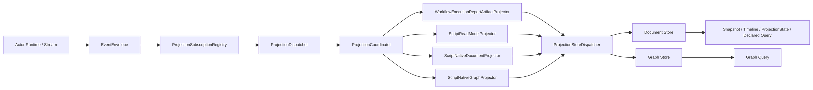
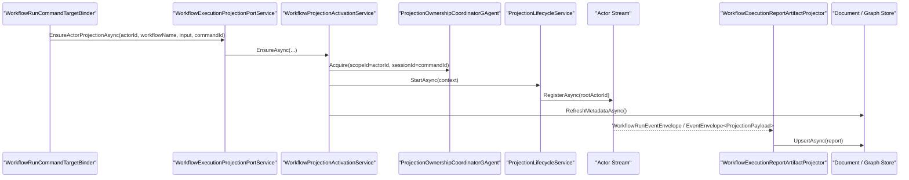
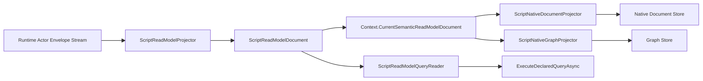

# CQRS Projection / ReadModel 一致性与并发架构分析

## 1. 结论先行

当前仓库里的 Projection / ReadModel 不是“强一致读”，而是明确的 `actor-scoped eventual consistency`：

- 查询链路只读已经物化的 `ReadModel`，不在 query 路径里重放 event store，也不回退到 generic actor query/reply。
- `accepted`、`projection observed`、`read model visible`、`terminal completion visible` 是四个不同层级的保证，不能混用。
- `workflow` 读侧已经有显式的 ownership actor + heartbeat + release protocol，同一 `run actor` 正常情况下只允许一个活跃 projection session 写入 read model。
- `scripting execution` 读侧当前没有等价的 ownership 协调器，更多依赖“外部只启动一个 projection session”的使用纪律。
- `document` 与 `graph` 是两条平行写分支；当前没有跨 store 原子提交，也没有统一版本栅栏，因此跨 store 一致性只能做到最终收敛，不能声称同版本快照。

术语说明：

- 本文中代码符号如果仍使用 `*Snapshot*` 命名，表示历史代码命名，不代表现行架构应该继续使用 `snapshot` 描述 readmodel。
- 在当前架构语义里，查询对象始终是 `readmodel`；`state mirror` 只表示某些当前态 readmodel 的投影输入模式。
- 新增 readmodel 必须绑定明确消费场景；没有明确 query/API/UI/search/graph 入口的模型，不得新增。

语义边界说明：

- `actor1 -> envelope A -> actor2 -> envelope B -> actor1` 是业务消息语义，属于 actor 间协议协商。
- `actor3 -> query -> actor2 readmodel` 是查询语义，属于对 actor2 已提交事实的读取。
- 业务消息语义要求的是“某个 actor turn 是否提交、某个协议阶段是否推进、某个回复事件是否到达”。
- 查询语义要求的是“某个 source version 是否已经物化进 readmodel 并可见”。
- 两条链路的一致性要求不同，完成判定也不同；不得拿 readmodel 可见性代替 actor 协议完成，也不得拿业务 ACK 代替 readmodel 新鲜度。

当前最需要正视的并发/一致性风险有 5 个：

1. Projection Core 没有给每个 context 再包一层串行 mailbox，事件顺序与同一订阅回调是否并发，依赖底层 stream provider。
2. `workflow` 注册的是 `PassthroughEventDeduplicator`，实际没有真正去重；若 runtime/stream 重投，timeline 和 step 聚合会重复应用。
3. `ProjectionStoreDispatcher` 的补偿回放没有版本比较，失败后的旧快照可能在之后覆盖更新版本。
4. `graph` 物化是多步 `upsert node -> upsert edge -> cleanup`，查询可能看到部分更新。
5. `WorkflowActorGraphEnrichedSnapshot`、`scripting declared query` 都是多次独立读取，没有读时版本对齐协议。

## 2. 范围与代码入口

本文基于 2026-03-15 仓库当前实现，重点覆盖：

- Projection Core
  - `src/Aevatar.CQRS.Projection.Core`
  - `src/Aevatar.CQRS.Projection.Core.Abstractions`
- Projection Runtime / Store Provider
  - `src/Aevatar.CQRS.Projection.Runtime`
  - `src/Aevatar.CQRS.Projection.Providers.InMemory`
  - `src/Aevatar.CQRS.Projection.Providers.Elasticsearch`
  - `src/Aevatar.CQRS.Projection.Providers.Neo4j`
- Workflow 读侧
  - `src/workflow/Aevatar.Workflow.Projection`
  - `src/workflow/Aevatar.Workflow.Application`
- Scripting 读侧
  - `src/Aevatar.Scripting.Projection`
  - `src/Aevatar.Scripting.Application`

关键判断依据：

- Projection 生命周期与分发
  - `ProjectionLifecycleService.cs:24`
  - `ProjectionSubscriptionRegistry.cs:30`
  - `ProjectionCoordinator.cs:19`
  - `ProjectionDispatcher.cs:6`
- Ownership / Lease
  - `ActorProjectionOwnershipCoordinator.cs:35`
  - `ProjectionOwnershipCoordinatorGAgent.cs:25`
  - `WorkflowExecutionRuntimeLease.cs:133`
- Workflow query/read model
  - `WorkflowProjectionActivationService.cs:40`
  - `WorkflowExecutionReportArtifactProjector.cs:44`
  - `WorkflowProjectionQueryReader.cs:22`
  - `WorkflowRunDurableCompletionResolver.cs:19`
  - `WorkflowRunDetachedCleanupOutboxGAgent.cs:187`
- Scripting query/read model
  - `ScriptExecutionProjectionActivationService.cs:15`
  - `ScriptReadModelProjector.cs:56`
  - `ScriptNativeDocumentProjector.cs:51`
  - `ScriptNativeGraphProjector.cs:51`
  - `ScriptReadModelQueryReader.cs:34`

## 3. 当前投影主链路



主链路在代码里对应：

1. `ProjectionLifecycleService.StartAsync()` 先初始化 projector，再注册 actor stream 订阅。
2. `ProjectionSubscriptionRegistry.RegisterAsync()` 按 `RootActorId` 建立订阅，把收到的 `EventEnvelope` 交给 `_dispatcher.DispatchAsync(...)`。
3. 当前态 readmodel 的标准输入是 `EventEnvelope<ProjectionPayload>`；projector 直接解包强类型 payload，不再依赖额外投影包络层。
4. `ProjectionCoordinator.ProjectAsync(...)` 按 DI 注册顺序依次执行 projector。
5. 业务 projector 通过 `IProjectionWriteDispatcher<TReadModel>` 把 read model fan-out 到 document/graph store。
6. Query 侧只读 `IProjectionDocumentReader<...>` 和 `IProjectionGraphStore`，不直接读 actor state，也不直接读 event store。

这条链路意味着：

- Projection 的事实来源是 committed / observable envelope，不是 query-time replay。
- Query 与 Projection 是解耦的：query 只消费物化结果，不驱动补投影。

## 3.1 业务消息链路与查询链路不是一回事

需要明确区分两条主链：

1. 业务消息链路
   - 例子：`actor1 -> event envelope A -> actor2 -> event envelope B -> actor1`
   - 这是 actor 与 actor 之间的业务协议
   - 语义由 actor1 / actor2 自行协商
   - 一致性看的是：
     - 消息是否进入 inbox
     - 事件是否 committed
     - continuation/reply 是否到达
     - 协议是否推进到某个业务阶段

2. 查询链路
   - 例子：`actor3 -> query -> actor2 readmodel`
   - 这是对 actor2 已提交事实的只读观察
   - 语义由 query contract + readmodel schema 定义
   - 一致性看的是：
     - readmodel 是否已物化
     - `StateVersion` 是否达到要求
     - 当前结果是否最终一致但诚实

因此必须禁止两种混淆：

1. 用 query/readmodel 去模拟 actor 间业务 reply
2. 用业务 ACK/receipt 去暗示 readmodel 已经追平

## 3.2 `EventEnvelope` 是唯一传输壳

当前权威架构要求：

1. 业务消息与投影消息都只使用 `EventEnvelope`
2. 二者的差异由 `EventEnvelope.Payload` 的强类型契约表达
3. 当前态 readmodel 的正常路径只消费 `EventEnvelope<ProjectionPayload>`
4. 不再引入额外的投影专用包络层

## 4. 读一致性到底如何确定

### 4.1 一致性不是一个值，而是分层承诺

当前代码里至少存在 5 个不同层级的“读到什么算一致”：

| 层级 | 证据来源 | 代表代码 | 能说明什么 | 不能说明什么 |
| --- | --- | --- | --- | --- |
| `AcceptedForDispatch` | command receipt | `DefaultCommandDispatchPipeline`、`DefaultCommandInteractionService.cs:45` | 命令已被 dispatch 接受，`commandId` 稳定 | actor 已处理、projection 已看到、read model 已更新 |
| `ProjectionObserved` | projection state | `WorkflowProjectionQueryReader.cs:46`、`WorkflowExecutionReadModelMapper.cs:28` | projection document 至少记录到某个 `lastEventId/stateVersion` | run 已结束、graph 已同步 |
| `DocumentVisible` | document state mirror | `WorkflowProjectionQueryReader.cs:22`、`ScriptReadModelQueryReader.cs:34` | 文档分支的 read model 已可见 | graph 分支同版本 |
| `TerminalCompletionVisible` | workflow state-mirror completion status | `WorkflowRunDurableCompletionResolver.cs:30` | workflow 终态已经进入 document state mirror | 其它 projector/store 全部完成 |
| `CrossStoreAligned` | 无统一证据 | 不存在统一版本栅栏 | 只能靠外部约束或运维观察推断 | 当前代码不能证明 document 与 graph 同版本 |

### 4.2 Workflow 当前如何判定“读一致”

`workflow` 已经把一致性语义拆成了两类：

1. `dispatch acceptance`
   - `WorkflowRunDetachedCleanupOutboxGAgent` 不是只看 receipt。
   - 它会去查 `WorkflowActorProjectionState`，要求至少出现 `StateVersion > 0` 或 `LastEventId`，并且 `LastCommandId` 要么为空，要么等于本次 `commandId`。
   - 对应代码：`WorkflowRunDetachedCleanupOutboxGAgent.cs:204-224`、`:499-518`。

2. `terminal completion`
   - `WorkflowRunDurableCompletionResolver` 读取 `WorkflowActorSnapshot.CompletionStatus`。
   - 只有 `Completed/TimedOut/Failed/Stopped/NotFound/Disabled` 才算 durable terminal completion。
   - 对应代码：`WorkflowRunDurableCompletionResolver.cs:19-53`。

因此 workflow 的一致性口径是：

- “命令已被接受”看 receipt。
- “projection 至少看到了运行时事件”看 `projection state`。
- “run 已到终态”看 `state-mirror completion status`。
- 这三个都不等价。

### 4.3 Scripting 当前如何判定“读一致”

`scripting` 更简单，当前没有 workflow 那样分层明显的 completion 语义：

- `GetSnapshotAsync()` 直接返回 `ScriptReadModelDocument -> ScriptReadModelSnapshot`。
- `ExecuteDeclaredQueryAsync()` 先读这个 state mirror，再按其中的 `DefinitionActorId + Revision` 去拿 definition snapshot，最后在内存里执行脚本声明的 query。
- 对应代码：`ScriptReadModelQueryReader.cs:34-39`、`:56-137`。

这说明 scripting 的 query 语义是：

- 查询结果只对“当前已物化的语义 read model”负责。
- 它不承诺“已经看到最新 committed event”。
- 它也不承诺“projection 当前一定处于活跃状态”。

## 5. Projection Core 的并发模型

### 5.1 已经做到的部分

#### 5.1.1 projector 在同一个 envelope 内按顺序执行

`ProjectionCoordinator.ProjectAsync(...)` 会按注册顺序逐个执行 projector；单个 envelope 内部没有并行 fan-out。

对应代码：`ProjectionCoordinator.cs:19-42`。

这保证了：

- `scripting` 可以依赖 `ScriptReadModelProjector -> ScriptNativeDocumentProjector -> ScriptNativeGraphProjector` 的顺序。
- 同一个 envelope 内，一个 projector 对 context 的更新可以被后续 projector 读取。

#### 5.1.2 workflow 的活跃写会话有 actor 化 ownership 裁决

`WorkflowProjectionActivationService.AcquireBeforeStartAsync(...)` 在启动前先调用 `IProjectionOwnershipCoordinator.AcquireAsync(...)`。

对应代码：`WorkflowProjectionActivationService.cs:40-50`。

`ActorProjectionOwnershipCoordinator` 会把 acquire/release 事件发给 `ProjectionOwnershipCoordinatorGAgent`；后者在单 actor 串行 turn 内做冲突检查与续租。

对应代码：

- `ActorProjectionOwnershipCoordinator.cs:35-52`
- `ProjectionOwnershipCoordinatorGAgent.cs:25-67`

仓库里还有测试明确验证同一 run actor 只能拿到一个 lease：

- `WorkflowExecutionProjectionServiceTests.cs:124-162`

#### 5.1.3 query 路径没有 query-time replay

在 workflow/scripting query 模块中：

- `WorkflowProjectionQueryReader` 只依赖 `IProjectionDocumentReader<WorkflowExecutionReport, string>` 和 `IProjectionGraphStore`。
- `ScriptReadModelQueryReader` 只依赖 `IProjectionDocumentReader<ScriptReadModelDocument, string>`、definition snapshot port、artifact resolver、codec。
- 针对 query 模块的文本扫描没有发现 `IEventStore` / `GetEventsAsync(...)` / generic `QueryRequested -> Responded` 的读取路径。

这与仓库的读写分离规则一致。

### 5.2 仍然依赖外部假设的部分

#### 5.2.1 Projection Core 没有自己再做 per-context 串行化

`ActorStreamSubscriptionHub.SubscribeAsync(...)` 把 handler 直接注册到底层 stream；`ProjectionSubscriptionRegistry.DispatchAsync(...)` 也没有为单个 `context` 再加 mailbox/queue。

对应代码：

- `ActorStreamSubscriptionHub.cs:25-40`
- `ProjectionSubscriptionRegistry.cs:77-125`

这意味着：

- Projection Core 默认假设底层 actor stream 对同一 actor 的消息投递顺序是稳定的。
- 如果底层 provider 对同一订阅可能并发回调，那么 read-modify-write projector 会直接暴露 lost update 风险。

#### 5.2.2 stop/release 不是“等待所有在途 event 完成”的栅栏

`ProjectionReleaseServiceBase.ReleaseIfIdleAsync(...)` 只做：

1. 检查 live sink 是否为空。
2. 调用 `_lifecycle.StopAsync(...)` 取消订阅。
3. 继续做 `OnStoppedAsync(...)`。

对应代码：`ProjectionReleaseServiceBase.cs:19-32`。

`ProjectionSubscriptionRegistry.UnregisterAsync(...)` 也只是取消 dispatch token 并释放订阅 lease，没有等待已经开始的 projector 完成。

对应代码：`ProjectionSubscriptionRegistry.cs:60-75`、`:146-179`。

因此 release 的真实语义是：

- “不再接收新的订阅消息”。
- 不是“所有旧消息都已经彻底物化完毕”。

## 6. Workflow：从 projection session 到查询结果

### 6.1 Workflow 的读侧激活链



激活时的核心动作：

1. acquire ownership
2. 创建 `WorkflowExecutionProjectionContext`
3. 启动 lifecycle，初始化 projector 并注册订阅
4. 刷新 read model 元信息
5. 创建 `WorkflowExecutionRuntimeLease`

对应代码：

- `WorkflowExecutionProjectionPortService.cs:28-39`
- `WorkflowProjectionActivationService.cs:40-117`
- `WorkflowExecutionRuntimeLease.cs:31-75`

### 6.2 Workflow 的 ownership 与 release

`WorkflowExecutionRuntimeLease` 同时承担两类运行态：

- ownership heartbeat
  - 定时重新 `AcquireAsync(actorId, commandId)`，相当于续租
  - `WorkflowExecutionRuntimeLease.cs:133-154`
- projection release listener
  - 监听 `WorkflowProjectionControlEvent.ReleaseRequested`
  - stop lifecycle -> 标记 stopped -> release ownership -> 发 `ReleaseCompleted`
  - `WorkflowExecutionRuntimeLease.cs:156-286`

这符合仓库要求的“session / subscription / release actor 化或 session 化”，而不是用中间层 `Dictionary<actorId, context>` 管理事实态。

### 6.3 Workflow read model 写入链

`WorkflowExecutionReportArtifactProjector` 的写路径是：

1. 归一化 envelope
2. 按 `Payload.TypeUrl` 命中 reducer 集合
3. 从 document store 读取当前 `WorkflowExecutionReport`
4. reducer 原地变更 report
5. `RecordProjectedEvent()` 更新 `StateVersion/LastEventId`
6. `RefreshDerivedFields()` 刷新 summary/updatedAt
7. `IProjectionWriteDispatcher<WorkflowExecutionReport>.UpsertAsync(report)`

对应代码：`WorkflowExecutionReportArtifactProjector.cs:44-77`。

`WorkflowExecutionReportArtifactMutations.RecordProjectedEvent(...)` 是 workflow report artifact 状态推进的直接来源：

- `StateVersion++`
- `LastEventId = envelope.Id`

对应代码：`WorkflowExecutionReportArtifactMutations.cs:7-17`。

### 6.4 Workflow 查询分别依赖什么数据

| 查询 | 直接数据源 | 代码 | 一致性说明 |
| --- | --- | --- | --- |
| `GetActorSnapshotAsync` | `WorkflowExecutionReport` document | `WorkflowProjectionQueryReader.cs:22-28` | 与 timeline / projection state 同属于 document 分支 |
| `ListActorSnapshotsAsync` | document query | `WorkflowProjectionQueryReader.cs:30-44` | 多条 state mirror 间无全局事务顺序保证 |
| `GetActorProjectionStateAsync` | 同一个 `WorkflowExecutionReport` document | `WorkflowProjectionQueryReader.cs:46-52` | 只代表 projection 元信息，不代表终态 |
| `ListActorTimelineAsync` | `report.Timeline` | `WorkflowProjectionQueryReader.cs:54-69` | 与 state mirror 同文档分支，单次读取内部一致 |
| `GetActorGraphEdgesAsync` | graph store | `WorkflowProjectionQueryReader.cs:71-95` | 与 document 分支可能存在版本偏斜 |
| `GetActorGraphSubgraphAsync` | graph store | `WorkflowProjectionQueryReader.cs:97-124` | 仅对 graph 分支负责 |
| `GetActorGraphEnrichedSnapshotAsync` | 先读 document，再读 graph | `WorkflowProjectionQueryReader.cs:126-143` | 没有统一版本号，不保证两次读取同版本 |

### 6.5 Workflow completion / dispatch acceptance 依赖什么数据

#### 6.5.1 runtime interaction completion

`DefaultCommandInteractionService` 先尝试从 live sink 里观察终态事件；若没观察到，再调用 durable completion resolver。

对应代码：`DefaultCommandInteractionService.cs:64-99`。

`WorkflowRunCompletionPolicy` 只把 `RunFinished` 和 `RunError` 视作 live completion 事件。

对应代码：`WorkflowRunCompletionPolicy.cs:11-29`。

#### 6.5.2 durable completion

`WorkflowRunDurableCompletionResolver` 不看 live sink，不看 actor state，只看 query port 返回的 state-mirror completion status。

对应代码：`WorkflowRunDurableCompletionResolver.cs:19-53`。

#### 6.5.3 dispatch acceptance

Detached cleanup outbox 不会把“receipt 返回”误判成“projection 已看见”。

它要求：

- `projectionState != null`
- `StateVersion > 0 || LastEventId != ""`
- `LastCommandId` 与本次 `commandId` 匹配

对应代码：`WorkflowRunDetachedCleanupOutboxGAgent.cs:499-518`。

这正是 workflow 当前最清晰的“一致性分层”实现。

## 7. Scripting：语义 read model、native read model 与 declared query

### 7.1 Scripting execution projection 链



注册顺序在 DI 里是显式固定的：

1. `ScriptReadModelProjector`
2. `ScriptNativeDocumentProjector`
3. `ScriptNativeGraphProjector`
4. `ScriptExecutionSessionEventProjector`

对应代码：`Aevatar.Scripting.Projection/DependencyInjection/ServiceCollectionExtensions.cs:103-115`。

### 7.2 Scripting 语义 read model 写入链

`ScriptReadModelProjector` 只处理 `ScriptDomainFactCommitted`，流程是：

1. 读取 definition snapshot
2. 解析 artifact / runtime semantics
3. 检查 domain event 是否声明且 `Projectable`
4. 从 `ScriptReadModelDocument` 读取当前语义 read model
5. 调用脚本 behavior 的 `ReduceReadModel(...)`
6. 写回 `ScriptReadModelDocument`
7. 同时把最新文档保存到 `context.CurrentSemanticReadModelDocument`

对应代码：`ScriptReadModelProjector.cs:56-147`。

这说明 scripting query 的权威读源不是 actor state，而是 `ScriptReadModelDocument.ReadModelPayload`。

### 7.3 Scripting native document / graph 如何与语义 read model 对齐

`ScriptNativeDocumentProjector` 与 `ScriptNativeGraphProjector` 都依赖：

- `context.CurrentSemanticReadModelDocument`
- 其 `StateVersion == fact.StateVersion`

对应代码：

- `ScriptNativeDocumentProjector.cs:90-109`
- `ScriptNativeGraphProjector.cs:90-109`

这带来两个重要结论：

1. 同一个 envelope 内，native materialization 是建立在“刚刚算出的语义 read model”之上的，而不是重新去 document store 读一次。
2. 它强依赖 projector 执行顺序；如果后续扩展把 projector 顺序打乱，native projector 会直接失败或读到过期语义文档。

### 7.4 Scripting 查询分别依赖什么数据

| 查询 | 直接数据源 | 代码 | 一致性说明 |
| --- | --- | --- | --- |
| `GetSnapshotAsync` | `ScriptReadModelDocument` | `ScriptReadModelQueryReader.cs:34-40` | 返回的是已经物化好的语义 read model |
| `ListSnapshotsAsync` | document query | `ScriptReadModelQueryReader.cs:42-54` | 与 workflow 一样，是 document 分支枚举 |
| `ExecuteDeclaredQueryAsync` | state mirror + definition snapshot + in-process behavior query | `ScriptReadModelQueryReader.cs:56-137` | 不做 event replay，但会做 query-time behavior execution |

`ExecuteDeclaredQueryAsync(...)` 的特点是：

- 它不是对 event store replay。
- 它也不是去 actor 发 query。
- 它是对“已经物化好的 typed read model”做一次纯查询执行。

### 7.5 Scripting query 的活跃性语义

`IScriptReadModelQueryPort` 自己不会保证 projection 一定已启动。

`ScriptBehaviorRuntimeCapabilities` 在 `SpawnScriptRuntimeAsync(...)` 与 `RunScriptInstanceAsync(...)` 时会先 `EnsureActorProjectionAsync(...)`，但 `GetReadModelSnapshotAsync(...)` / `ExecuteReadModelQueryAsync(...)` 本身只是直接走 query port。

对应代码：

- `ScriptBehaviorRuntimeCapabilities.cs:117-121`
- `ScriptBehaviorRuntimeCapabilities.cs:143-163`

因此 scripting 当前的口径是：

- “常见 runtime 使用路径”通常会预热 projection。
- “query port 本身”不保证 freshness，也不保证 projection 已激活。

## 8. Store / Provider 层面对一致性的真实影响

### 8.1 `ProjectionStoreDispatcher` 只有 fan-out，没有跨 store 事务

`ProjectionStoreDispatcher.UpsertAsync(...)` 会对每个 binding 顺序执行写入；其中一个失败就走补偿。

对应代码：`ProjectionStoreDispatcher.cs:64-90`。

这意味着：

- document 成功、graph 失败是允许的；
- graph 成功、document 失败也是允许的；
- 成功与失败之间没有统一 commit point。

### 8.2 补偿回放没有版本保护，可能把旧状态写回去

当某个 binding 失败时，`WorkflowProjectionDurableOutboxCompensator` 会把当前 read model 快照入 outbox。

对应代码：`WorkflowProjectionDurableOutboxCompensator.cs:23-56`。

后续 replay worker 会直接拿这个快照再次 `binding.UpsertAsync(readModel)`。

对应代码：`WorkflowProjectionDispatchCompensationOutboxGAgent.cs:128-163`。

当前没有：

- `StateVersion` 比较
- CAS / optimistic concurrency
- “只接受更高版本”的 provider 契约

因此存在一个真实风险：

1. 版本 `N` 写 document 成功、graph 失败，补偿入队。
2. 版本 `N+1` 后续正常写成功。
3. 补偿线程稍后把旧的 `N` 再写回 graph。

结果就是 graph 回退。

### 8.3 InMemory provider 是线程安全的，但只有进程内语义

`InMemoryProjectionDocumentStore` 与 `InMemoryProjectionGraphStore` 都用 `lock` 保护内部字典，并在读写时做 clone。

对应代码：

- `InMemoryProjectionDocumentStore.cs:39-133`
- `InMemoryProjectionGraphStore.cs:17-260`

它们能保证：

- 单进程内的线程安全
- 调用方拿到的对象不是共享引用

但它们不能保证：

- 跨节点一致性
- 跨 store 原子性
- 版本比较

### 8.4 Elasticsearch document provider 是 last-write-wins

`ElasticsearchProjectionDocumentStore.UpsertAsync(...)` 直接走 `PUT index/_doc/{id}`。

对应代码：`ElasticsearchProjectionDocumentStore.cs:183-221`。

当前没有使用：

- `_seq_no`
- `_primary_term`
- 外显 version 字段做 CAS

因此 document provider 当前语义就是 last-write-wins。

### 8.5 Neo4j graph provider 的单次 materialization 不是原子子图提交

`ProjectionGraphStoreBinding.UpsertAsync(...)` 的写入顺序是：

1. materialize graph
2. `UpsertNodeAsync(...)`
3. `UpsertEdgeAsync(...)`
4. 列出现有 managed edge/node
5. 删除不再需要的 edge/node

对应代码：`ProjectionGraphStoreBinding.cs:43-93`。

`Neo4jProjectionGraphStore` 自己也只是逐条执行节点/边写操作；这里没有围绕整个子图 materialization 的单事务边界。

对应代码：`Neo4jProjectionGraphStore.cs:51-155`。

因此 graph query 可能看到：

- 新节点已写入，但旧边还未清理；
- 一部分边已是新版本，另一部分还是旧版本；
- root state mirror 已更新，但 graph subgraph 仍是上一版本。

## 9. 当前最重要的并发风险清单

### 9.1 Workflow 去重开关名义存在，实际默认是透传

`WorkflowExecutionReportArtifactProjector` 调用了 `_deduplicator.TryRecordAsync(...)`。

对应代码：`WorkflowExecutionReportArtifactProjector.cs:55-60`。

但 workflow 默认注册的是：

```csharp
services.TryAddSingleton<IEventDeduplicator, PassthroughEventDeduplicator>();
```

并且这个实现始终返回 `true`。

对应代码：`Aevatar.Workflow.Projection/DependencyInjection/ServiceCollectionExtensions.cs:41`、`:148-154`。

结果是：

- 同一 envelope 若被底层重复投递，workflow projector 仍会重复进入 reducer。
- `Timeline`、`Steps`、`RoleReplies` 这类 append / mutate 结构没有统一幂等保护。
- 即使 `RecordProjectedEvent(...)` 对“连续相同 lastEventId”做了一个窄保护，也不足以抵消 reducer 本身的重复副作用。

### 9.2 Workflow activation 存在“订阅已开始，metadata 刷新仍在写”的竞争窗口

`ProjectionActivationServiceBase.EnsureAsync(...)` 里：

1. 先 `_lifecycle.StartAsync(context)`。
2. 再 `OnStartedAsync(...)`。

对应代码：`ProjectionActivationServiceBase.cs:41-57`。

而 workflow 的 `OnStartedAsync(...)` 会再次 `RefreshMetadataAsync(...)` 写 `WorkflowExecutionReport`。

对应代码：`WorkflowProjectionActivationService.cs:70-78`。

同时 `_lifecycle.StartAsync(context)` 在 workflow 场景下已经注册了 actor stream 订阅。

对应代码：`ProjectionLifecycleService.cs:24-28`。

如果第一批 runtime event 在 `RegisterAsync(...)` 之后、`RefreshMetadataAsync(...)` 之前或期间到达，就会形成典型 read-modify-write 竞争。  
这本质上还是 9.4 里的“Projection Core 没有 per-context mailbox”问题的一个具体表现。

### 9.3 Scripting execution projection 缺少 workflow 那样的 ownership 裁决

`ScriptExecutionProjectionActivationService` 只创建 context，不做 acquire/release ownership。

对应代码：`ScriptExecutionProjectionActivationService.cs:15-35`。

`ScriptExecutionRuntimeLease` 只是一个轻量 lease，`SessionId = RootActorId`，没有 heartbeat，也没有 ownership coordinator。

对应代码：`ScriptExecutionRuntimeLease.cs:14-27`。

这意味着：

- 多个节点或多个调用方如果同时对同一 runtime actor 调 `EnsureActorProjectionAsync(...)`，Projection Core 不会像 workflow 那样主动拒绝第二个 writer。
- 一旦底层 stream 支持多订阅并行处理，就可能出现两个 execution projection 同时写同一个 `ScriptReadModelDocument`。

### 9.4 Projection Core 允许“部分 projector 成功、部分 projector 失败”

`ProjectionCoordinator.ProjectAsync(...)` 对所有 projector 做“全分支尝试”；一个失败不阻断其它 projector。

对应代码：`ProjectionCoordinator.cs:21-41`。

而 `ProjectionSubscriptionRegistry` 会记录失败，但不会把整个 projection 停掉。

对应代码：`ProjectionSubscriptionRegistry.cs:101-125`。

结果是：

- workflow/scripting 同一 event 可以出现“document 已更新，graph 未更新”。
- scripting execution 同一 event 还可以出现“语义 read model 已更新，native graph 未更新”。
- 这不是 bug，而是当前实现明确选择的容错模型；但它决定了不能对外声称“所有读模型分支总是同步一致”。

### 9.5 `GraphEnrichedSnapshot` 天生可能读到混合版本

`WorkflowProjectionQueryReader.GetActorGraphEnrichedSnapshotAsync(...)` 是：

1. 先 `GetActorSnapshotAsync(...)`
2. 再 `GetActorGraphSubgraphAsync(...)`

对应代码：`WorkflowProjectionQueryReader.cs:126-143`。

中间没有：

- 统一版本号
- 统一 read timestamp
- store-side multi-read transaction

因此 enriched state mirror 只是“state mirror + subgraph 的组合结果”，不是“原子复合视图”。

## 10. 对“读一致性如何确定”的可操作答案

### 10.1 如果你问的是 workflow

当前可以安全对外声称的是：

- `GetActorSnapshotAsync` / `ListActorTimelineAsync` / `GetActorProjectionStateAsync`
  - 代表 document 分支上最后一次成功 upsert 的结果。
- `GetActorProjectionStateAsync`
  - 可用于证明 projection 至少已看到某些 runtime 事件。
- `WorkflowRunDurableCompletionResolver`
  - 可用于证明 workflow 终态已经进入 document state mirror。

当前不能安全对外声称的是：

- state mirror 与 graph 一定同版本。
- receipt 返回后 read model 一定立刻可读。
- release 完成后绝对没有在途 projection 写入。

### 10.2 如果你问的是 scripting

当前可以安全对外声称的是：

- `GetSnapshotAsync`
  - 返回的是已经物化好的语义 read model。
- `ExecuteDeclaredQueryAsync`
  - 是对 typed read model 的声明式查询执行，不是 query-time replay。

当前不能安全对外声称的是：

- query 发起时 projection 一定已经启动并追到最新。
- 同一 runtime actor 永远只会有一个 execution projection writer。
- native document / native graph 与 semantic document 一定同版本。

## 11. 建议的治理重点

如果后续要把这套 CQRS projection/readmodel 做成“可严格解释的一致性系统”，建议优先补以下治理项：

1. 给 Projection Core 增加 per-context 串行 mailbox，消除对底层 stream 回调模型的隐式依赖。
2. 把 workflow 的 `PassthroughEventDeduplicator` 改成真实去重实现，至少对 `actorId + envelopeId` 生效。
3. 给 document / graph provider 与补偿回放加入版本比较，禁止旧版本覆盖新版本。
4. 为跨 store 组合读引入版本戳，至少让 `GraphEnrichedSnapshot` 能暴露“state-mirror version / graph version”。
5. 把 scripting execution projection 也收敛到 ownership-coordinated 模型，不再依赖外部使用纪律。
6. 把 “activation 后 metadata refresh” 收敛到启动前初始化，或纳入同一串行 turn，减少首批事件竞争窗口。

## 12. 关键代码索引

### 12.1 Projection Core

- `src/Aevatar.CQRS.Projection.Core/Orchestration/ProjectionLifecycleService.cs:24`
- `src/Aevatar.CQRS.Projection.Core/Orchestration/ProjectionSubscriptionRegistry.cs:30`
- `src/Aevatar.CQRS.Projection.Core/Orchestration/ProjectionCoordinator.cs:19`
- `src/Aevatar.CQRS.Projection.Core/Orchestration/ProjectionDispatcher.cs:6`
- `src/Aevatar.CQRS.Projection.Core/Streaming/ActorStreamSubscriptionHub.cs:25`
- `src/Aevatar.CQRS.Projection.Core/Streaming/ProjectionSessionEventHub.cs:26`

### 12.2 Projection Runtime / Provider

- `src/Aevatar.CQRS.Projection.Runtime/Runtime/ProjectionStoreDispatcher.cs:64`
- `src/Aevatar.CQRS.Projection.Runtime/Runtime/ProjectionGraphStoreBinding.cs:43`
- `src/Aevatar.CQRS.Projection.Providers.InMemory/Stores/InMemoryProjectionDocumentStore.cs:39`
- `src/Aevatar.CQRS.Projection.Providers.Elasticsearch/Stores/ElasticsearchProjectionDocumentStore.cs:183`
- `src/Aevatar.CQRS.Projection.Providers.Neo4j/Stores/Neo4jProjectionGraphStore.cs:51`

### 12.3 Workflow

- `src/workflow/Aevatar.Workflow.Projection/Orchestration/WorkflowProjectionActivationService.cs:40`
- `src/workflow/Aevatar.Workflow.Projection/Orchestration/WorkflowExecutionRuntimeLease.cs:133`
- `src/workflow/Aevatar.Workflow.Projection/Projectors/WorkflowExecutionReportArtifactProjector.cs:44`
- `src/workflow/Aevatar.Workflow.Projection/Reducers/WorkflowExecutionReportArtifactMutations.cs:7`
- `src/workflow/Aevatar.Workflow.Projection/Orchestration/WorkflowProjectionQueryReader.cs:22`
- `src/workflow/Aevatar.Workflow.Application/Runs/WorkflowRunDurableCompletionResolver.cs:19`
- `src/workflow/Aevatar.Workflow.Projection/Orchestration/WorkflowRunDetachedCleanupOutboxGAgent.cs:187`
- `src/workflow/Aevatar.Workflow.Projection/DependencyInjection/ServiceCollectionExtensions.cs:41`

### 12.4 Scripting

- `src/Aevatar.Scripting.Projection/Orchestration/ScriptExecutionProjectionActivationService.cs:15`
- `src/Aevatar.Scripting.Projection/Orchestration/ScriptExecutionRuntimeLease.cs:14`
- `src/Aevatar.Scripting.Projection/Projectors/ScriptReadModelProjector.cs:56`
- `src/Aevatar.Scripting.Projection/Projectors/ScriptNativeDocumentProjector.cs:51`
- `src/Aevatar.Scripting.Projection/Projectors/ScriptNativeGraphProjector.cs:51`
- `src/Aevatar.Scripting.Projection/Queries/ScriptReadModelQueryReader.cs:34`
- `src/Aevatar.Scripting.Application/Runtime/ScriptBehaviorRuntimeCapabilities.cs:117`
- `src/Aevatar.Scripting.Projection/DependencyInjection/ServiceCollectionExtensions.cs:103`
