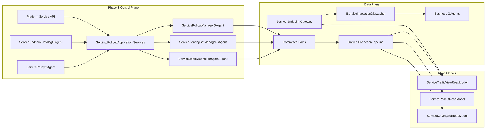

# GAgentService Phase 3 Serving/Rollout 蓝图（2026-03-15）

## 1. 文档元信息

- 状态：Implemented
- 版本：R3
- 日期：2026-03-15
- 关联文档：
  - `AGENTS.md`
  - `docs/FOUNDATION.md`
  - `docs/CQRS_ARCHITECTURE.md`
  - `docs/architecture/2026-03-14-gagent-as-a-service-platform-blueprint.md`
  - `docs/architecture/2026-03-14-gagent-service-phase-1-mvp-blueprint.md`
  - `docs/architecture/2026-03-14-gagent-service-phase-1-detailed-design.md`
  - `docs/architecture/2026-03-14-gagent-service-phase-2-binding-policy-blueprint.md`
  - `docs/architecture/2026-03-14-gagent-service-phase-2-binding-policy-detailed-design.md`

## 2. 一句话结论

Phase 1 已经完成了统一 `publish / revision / deployment / invoke`，Phase 2 已经完成了 `binding / endpoint exposure / access rules / admission`。

Phase 3 真正需要补的是：

`ServiceServingSet -> ServiceRolloutPlan -> ServiceRolloutExecution -> ServiceTrafficView`

也就是：

1. 一个 service 可以同时由多个 deployment 提供服务。
2. 平台可以渐进切流、暂停、继续、回滚。
3. gateway 可以基于读模型做多 deployment 目标解析。

Phase 3 不应再把 runtime topology、placement、replica orchestration 拉进 `GAgentService`，这些本来就属于底层 virtual actor runtime。

## 3. 为什么 Phase 3 要收窄

我们已经运行在统一的 virtual actor runtime 上：

1. `IActorRuntime` 负责 lifecycle / topology / lookup / activation。
2. `IActorDispatchPort` 负责投递。
3. `ServiceDeployment` 已经能把 revision 激活到 runtime。

因此 `GAgentService` 不应该再造一层：

1. runtime slot 编排
2. placement 控制器
3. desired replicas
4. topology 权威模型

`GAgentService` 这一层真正还缺的是服务级 serving 控制：

1. 哪些 deployment 当前对外 serving
2. 它们各自承担多少流量
3. 怎么从旧 serving 状态过渡到新 serving 状态

## 4. Phase 3 目标

### 4.1 必须达到的结果

1. 一个 service/endpoint 可以同时由多个 deployment 提供服务。
2. 平台有独立的 `ServiceServingSet`，权威表达“当前哪些 deployment 在 serving、各自的 endpoint 级权重是多少”。
3. 平台有独立的 `ServiceRolloutPlan`，表达从当前 serving set 过渡到目标 serving set 的 staged intent。
4. 平台有长期 `ServiceRolloutExecution`，承载 rollout 的推进、暂停、回滚、完成与失败事实。
5. gateway 不再只解析 `service -> active deployment`，而是解析 `service + endpoint + caller scope -> effective traffic allocation`。
6. rollout 与 serving 状态都进入统一 projection/read model/query 主链，不通过 actor query 拼视图。
7. invoke admission 继续复用 Phase 2 的 endpoint exposure 和 access rules，不在 Phase 3 重复造治理模型。

### 4.2 明确不在 Phase 3 解决

1. runtime topology view
2. placement policy
3. desired replicas / autoscaling
4. health-driven orchestration
5. billing / SLA / 审计归因
6. 全局多云调度器

## 5. Phase 3 的对象范围

### 5.1 新增核心对象

| 对象 | 是否 Phase 3 必需 | 用途 |
|---|---|---|
| `ServiceServingSet` | 是 | 权威表达 service 当前实际 serving 的 deployment 集合 |
| `ServiceServingTarget` | 是 | 表达 serving set 中的单个 deployment 与其 endpoint 级服务状态 |
| `ServiceTrafficAllocation` | 是 | 表达 endpoint 维度的流量权重与生效目标 |
| `ServiceRolloutPlan` | 是 | 表达目标 serving 结构与 staged rollout intent |
| `ServiceRolloutExecution` | 是 | 表达 rollout 的运行态、进度、暂停、回滚、失败 |
| `ServiceServingSetReadModel` | 是 | 当前 serving 状态查询 |
| `ServiceRolloutReadModel` | 是 | rollout 查询 |
| `ServiceTrafficViewReadModel` | 是 | gateway 路由查询 |

### 5.2 继续复用的对象

1. `ServiceDefinition`
2. `ServiceRevision`
3. `PreparedServiceRevisionArtifact`
4. `ServiceDeployment`
5. `ServiceBinding`
6. `ServiceEndpointCatalog`
7. `ServicePolicy`
8. `ActivationAdmissionDecision`
9. `InvokeAdmissionDecision`

这些对象仍然是 Phase 3 的权威输入或前置约束，不在本阶段拆散。

## 6. Phase 3 的核心判断

### 6.1 Serving Set 必须独立于 Deployment

`ServiceDeployment` 只表达：

1. 某个 revision 已经被激活
2. 对应 runtime 内部已经有可调用目标

它不该同时承担：

1. 当前是否对外 serving
2. 与其他 deployment 的并存关系
3. endpoint 级流量权重
4. rollout 过渡状态

因此必须引入独立的 `ServiceServingSet`。

### 6.2 Rollout 不是 DeploymentManager 的附属命令

`ActivateServingRevision` 只适合单版本直接切换。

一旦需要：

1. 多 deployment 并存
2. staged shift
3. pause / resume
4. rollback

就必须有独立的 rollout authority，而不是继续把行为塞进 `ServiceDeploymentManagerGAgent`。

### 6.3 Traffic View 是 gateway 的唯一权威读模型

Phase 3 后，gateway 不能：

1. 直接问 rollout actor 当前权重
2. 直接问 serving set actor 当前目标
3. 直接依赖 `ServiceDeploymentState.active_deployment_id`

gateway 只读 `ServiceTrafficViewReadModel`，继续遵守 CQRS。

### 6.4 Runtime 对 `GAgentService` 继续保持不透明

Phase 3 的 serving/rollout 只引用：

1. `deployment_id`
2. `revision_id`
3. `primary_actor_id` 或 runtime receipt 中已有的 opaque identity

它不引入新的 runtime slot / region / cluster 主对象，也不让 `GAgentService` 负责 placement。

## 7. Phase 3 总体架构图

## 8. Phase 3 的最小 Actor 集合

本阶段新增两个长期 actor：

1. `ServiceServingSetManagerGAgent`
2. `ServiceRolloutManagerGAgent`

继续复用：

1. `ServiceDeploymentManagerGAgent`
2. `ServiceEndpointCatalogGAgent`
3. `ServicePolicyGAgent`

### 8.1 职责边界

- `ServiceServingSetManagerGAgent`
  - 维护一个 service 在各 endpoint 上的有效 serving targets
  - 维护权重、启停状态、当前 generation
  - 生成 serving set committed facts
- `ServiceRolloutManagerGAgent`
  - 接收 rollout plan
  - 推进 staged transition
  - 生成 pause/resume/rollback/completed/failed 事实
- `ServiceDeploymentManagerGAgent`
  - 继续负责 deployment 的创建、激活、退役
  - 不承担 rollout 状态机

## 9. 对象模型决议

### 9.1 `ServiceServingSet`

`ServiceServingSet` 是权威对象，不是 projection-only 视图。

它至少承载：

1. `service identity`
2. `generation`
3. `endpoint scopes`
4. `serving targets`
5. `status`

### 9.2 `ServiceServingTarget`

单个 target 必须至少承载：

1. `deployment_id`
2. `revision_id`
3. `allocation_weight`
4. `serving_state`
5. `enabled_endpoint_ids`

### 9.3 `ServiceRolloutPlan`

`ServiceRolloutPlan` 只表达期望，不直接承载运行态。

建议包含：

1. `rollout_id`
2. `service identity`
3. `source serving set generation`
4. `target targets`
5. `stage sequence`
6. `pause policy`
7. `rollback mode`

### 9.4 `ServiceRolloutExecution`

`ServiceRolloutExecution` 是 actor 状态和读侧对象的核心。

建议承载：

1. `rollout_id`
2. `current stage`
3. `stage statuses`
4. `current serving set generation`
5. `started_at / updated_at / completed_at`
6. `failure reason`
7. `rollback status`

## 10. Phase 3 的读写主链

### 10.1 写侧主链

1. 发布 revision
2. 创建 deployment
3. 创建 rollout plan
4. rollout manager 推进 serving set 变更
5. serving set manager 提交 committed facts
6. projection 更新 serving/traffic/read models
7. gateway 读取新视图生效

### 10.2 读侧主链

1. `ServiceServingSetReadModel`
   - 当前各 endpoint 的 serving targets
2. `ServiceRolloutReadModel`
   - rollout 进度、阶段、暂停、失败、回滚
3. `ServiceTrafficViewReadModel`
   - gateway 可直接消费的目标解析视图

## 11. Gateway 解析链决议

Phase 3 后，gateway 的标准解析骨架应收敛为：

`Resolve Service -> Resolve Endpoint Scope -> Load Traffic View -> Evaluate Invoke Admission -> Select Serving Target -> Dispatch`

其中：

1. `Load Traffic View` 只读 read model
2. `Evaluate Invoke Admission` 继续复用 Phase 2 的 endpoint exposure 与 access rules
3. `Select Serving Target` 只基于 typed traffic allocation 做确定性选择
4. 不能再出现 `service -> active deployment` 的单值假设

## 12. Proto 决议

### 12.1 本阶段必须新增的 proto

1. `service_serving_set.proto`
2. `service_rollout.proto`

### 12.2 关键消息

建议至少包含：

1. `ServiceServingSetSpec`
2. `ServiceServingTargetSpec`
3. `ServiceTrafficAllocation`
4. `ReplaceServiceServingTargetsCommand`
5. `ServiceServingSetUpdatedEvent`
6. `ServiceRolloutPlan`
7. `StartServiceRolloutCommand`
8. `PauseServiceRolloutCommand`
9. `ResumeServiceRolloutCommand`
10. `RollbackServiceRolloutCommand`
11. `ServiceRolloutStageAdvancedEvent`
12. `ServiceRolloutCompletedEvent`
13. `ServiceRolloutFailedEvent`

## 13. 分阶段落地顺序

### 13.1 Phase 3.A Serving Set Authority

先做：

1. `ServiceServingSet` proto 与 actor
2. serving set projector / read model / query
3. gateway 改为从 `ServiceTrafficViewReadModel` 读取目标

这一阶段完成后，就要删除任何“单 active deployment 直查”的旧路径。

### 13.2 Phase 3.B Rollout Orchestration

再做：

1. `ServiceRolloutPlan` 与 `ServiceRolloutExecution`
2. rollout manager
3. pause/resume/rollback
4. rollout read model

### 13.3 Phase 3.C Gateway Final Resolution

最后做：

1. traffic view 的 endpoint 级最终视图
2. caller scope 命中后的目标选择
3. rollback 后的路由一致性验证

## 14. 设计模式与 OO 原则

### 14.1 推荐模式

1. `Manager Actor`
   - 维护 serving set、rollout 的权威事实
2. `State Machine`
   - rollout execution 的阶段推进
3. `Assembler`
   - 把 serving set、endpoint exposure、access rules 归并成 traffic view
4. `Projector`
   - 从 committed facts 生成 serving/rollout/traffic 读模型
5. `Query Facade`
   - 提供稳定的控制面和 gateway 读接口

### 14.2 继承与泛型决议

Phase 3 不应引入：

1. `ServiceRolloutManagerGAgent<TStage>`
2. `ServiceServingSetManagerGAgent<TTarget>`
3. `ITrafficSelector<TPolicy, TTopology, TResult>`

原因：

1. rollout/serving set 是平台稳定语义
2. 子类型差异已经由 proto typed messages 表达
3. 泛型化会把 actor、projection、query、hosting 一起复杂化

建议保留的继承关系只有：

1. `ServiceServingSetManagerGAgent : GAgentBase<ServiceServingSetState>`
2. `ServiceRolloutManagerGAgent : GAgentBase<ServiceRolloutExecutionState>`

## 15. 测试与门禁要求

Phase 3 至少要补齐：

1. serving set actor 单测
2. rollout actor 状态机单测
3. traffic view projector 单测
4. gateway route resolution 集成测试
5. rollback 场景集成测试
6. `build/test/architecture guards` 全通过

必须继续遵守：

1. 不引入 actor query 读取控制面状态
2. 不引入进程内 `service -> traffic allocation` 事实字典
3. 不把 runtime topology 重新拉回 `GAgentService`
4. 不让 gateway 直接读 write-side state

## 16. 完成态定义

Phase 3 完成时，应满足：

1. 一个 service 可以同时有多个 serving deployment
2. gateway 只读 `ServiceTrafficViewReadModel`
3. rollout 有独立 actor、独立事件、独立读模型
4. `publish / activate / invoke / rollout` 四条主链全部进入统一 CQRS/Projection 主链
5. 可以明确暂停、继续、回滚 rollout，而不依赖手工脚本或 host 内临时逻辑

### 16.1 当前实现落点

当前仓库已经按本蓝图完成落地，核心入口如下：

1. `ServiceServingSetManagerGAgent`
   - `src/platform/Aevatar.GAgentService.Core/GAgents/ServiceServingSetManagerGAgent.cs`
2. `ServiceRolloutManagerGAgent`
   - `src/platform/Aevatar.GAgentService.Core/GAgents/ServiceRolloutManagerGAgent.cs`
3. `ServiceDeploymentManagerGAgent`
   - `src/platform/Aevatar.GAgentService.Core/GAgents/ServiceDeploymentManagerGAgent.cs`
4. serving/rollout/traffic projection
   - `src/platform/Aevatar.GAgentService.Projection/Projectors/ServiceDeploymentCatalogProjector.cs`
   - `src/platform/Aevatar.GAgentService.Projection/Projectors/ServiceServingSetProjector.cs`
   - `src/platform/Aevatar.GAgentService.Projection/Projectors/ServiceRolloutProjector.cs`
   - `src/platform/Aevatar.GAgentService.Projection/Projectors/ServiceTrafficViewProjector.cs`
5. serving/rollout/traffic query facade
   - `src/platform/Aevatar.GAgentService.Projection/Queries/ServiceDeploymentCatalogQueryReader.cs`
   - `src/platform/Aevatar.GAgentService.Projection/Queries/ServiceServingSetQueryReader.cs`
   - `src/platform/Aevatar.GAgentService.Projection/Queries/ServiceRolloutQueryReader.cs`
   - `src/platform/Aevatar.GAgentService.Projection/Queries/ServiceTrafficViewQueryReader.cs`
6. hosting API
   - `src/platform/Aevatar.GAgentService.Hosting/Endpoints/ServicePhase3Endpoints.cs`

### 16.2 当前验证结果

本阶段代码收口时，以下验证已通过：

1. `dotnet build aevatar.slnx --nologo --disable-build-servers -m:1`
2. `dotnet test aevatar.slnx --nologo --no-build --disable-build-servers -m:1`
3. `bash tools/ci/architecture_guards.sh`
4. `bash tools/ci/test_stability_guards.sh`
5. `bash tools/ci/projection_route_mapping_guard.sh`
6. `bash tools/ci/solution_split_guards.sh`
7. `bash tools/ci/solution_split_test_guards.sh`
8. `bash tools/ci/code_metrics_analyzer_guard.sh`
9. `bash tools/ci/coverage_quality_guard.sh`

## 17. 下一阶段展望

完成 Phase 3 后，平台才适合进入更重的运维与商业化层：

1. autoscaling
2. health-aware orchestration
3. billing / SLA / audit
4. external policy engine integration

在此之前，不应把这些能力提前揉进当前阶段。
