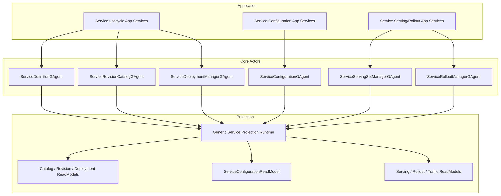

# GAgentService 瘦身重构蓝图（2026-03-15）

## 1. 文档元信息

- 状态：Implemented
- 版本：R1
- 日期：2026-03-15
- 关联文档：
  - `AGENTS.md`
  - `docs/FOUNDATION.md`
  - `docs/CQRS_ARCHITECTURE.md`
  - `docs/architecture/2026-03-14-gagent-as-a-service-platform-blueprint.md`
  - `docs/architecture/2026-03-14-gagent-service-phase-1-mvp-blueprint.md`
  - `docs/architecture/2026-03-14-gagent-service-phase-1-detailed-design.md`
  - `docs/architecture/2026-03-14-gagent-service-phase-2-binding-policy-blueprint.md`
  - `docs/architecture/2026-03-14-gagent-service-phase-2-binding-policy-detailed-design.md`
  - `docs/architecture/2026-03-15-gagent-service-phase-3-serving-rollout-blueprint.md`

## 2. 一句话结论

`GAgentService` 当前的功能方向基本正确，但实现已经出现 4 类结构性膨胀：

1. 核心强类型语义在治理读侧退化成字符串。
2. Phase 3 为每个 read model 复制了一整套 projection runtime 样板。
3. Phase 2 的配置事实被拆成过多长期 actor，导致应用层重新 join。
4. 查询门面开始膨胀成大而全 facade。

本次重构的目标不是删功能，而是把 `GAgentService` 收回到更高内聚、更强类型、更少样板的控制面实现。

当前实现已经落地：

1. `ServiceConfigurationGAgent` 取代了三套治理长期 actor。
2. `ServiceConfigurationReadModel` 成为唯一治理读侧。
3. `IServiceLifecycleQueryPort / IServiceServingQueryPort` 取代了膨胀的 `IServiceQueryPort`。
4. `typed context factory + ContextProjectionActivationService + dedicated projection ports` 取代了 Phase 3 一视图一套投影运行时外壳。
5. 旧治理事实的升级导入路径已经补齐。

## 3. 问题定义

### 3.1 强类型语义退化

治理绑定在 write-side 使用的是强类型 `BoundServiceRef.identity`：

1. `service_binding.proto` 已经有 `BoundServiceRef.identity`
2. `ServiceBindingSpec.target` 已经是 `oneof`

但在读侧：

1. `ServiceBindingCatalogReadModel` 把目标 service 降级成 `TargetServiceKey`
2. `ServiceBindingSnapshot` 继续暴露 `TargetServiceKey`
3. `ActivationCapabilityViewAssembler` 再用 `Split(':')` 反解析成 `ServiceIdentity`

这违反了仓库的强类型约束，也让治理读侧出现无意义的信息往返损失。

### 3.2 Phase 3 投影样板复制

Phase 3 当前为以下视图分别创建了一整套运行时壳：

1. `ServiceDeploymentCatalog`
2. `ServiceServingSet`
3. `ServiceRollout`
4. `ServiceTrafficView`

每套都包含：

1. `ProjectionContext`
2. `RuntimeLease`
3. `ProjectionActivationService`
4. `ProjectionReleaseService`
5. `ProjectionPortService`
6. `MetadataProvider`
7. `Projector`
8. `QueryReader`

其中前 5 项大量同构，只在类型参数和 projection name 上不同。这种结构不是业务复杂度，而是框架样板复制。

### 3.3 Governance 聚合边界过碎

Phase 2 当前拆成了 3 个长期 actor：

1. `ServiceBindingManagerGAgent`
2. `ServiceEndpointCatalogGAgent`
3. `ServicePolicyGAgent`

这些对象虽然语义上不同，但它们都共享同一个：

1. `ServiceIdentity`
2. service-level 生命周期
3. 激活和调用准入配置语义

结果是应用层必须再建一个 `ActivationCapabilityViewAssembler`，把三套 query snapshot 与 artifact 重新装配成真正可用的配置视图。  
这说明当前 actor 边界更接近“按表拆分”，而不是“按聚合拆分”。

### 3.4 Query 门面膨胀

`IServiceQueryPort` 当前已经同时承载：

1. `catalog`
2. `revisions`
3. `deployments`
4. `serving`
5. `rollout`
6. `traffic`

继续沿这个方向演进，后续再加 `service configuration / rollout history / serving diagnostics` 时，接口会继续膨胀。

### 3.5 Host DTO 语义混合

Phase 3 的 Host 请求对象 `ServiceServingTargetHttpRequest` 实际表达的是“期望 serving intent”，但它名字又像是权威 `ServiceServingTargetSpec` 的 HTTP 版。  
真正权威字段 `deployment_id / primary_actor_id` 并不由 Host 输入，而是由应用层解析补全。

这不是功能错误，但会模糊“用户输入”和“平台已解析规范化命令”之间的边界。

## 4. 重构目标

### 4.1 必须达到的结果

1. 治理读侧恢复强类型，不再使用 `TargetServiceKey` 这类核心字符串 bag。
2. Phase 3 的 projection runtime 样板收敛到可复用模板，不再一视图一套壳。
3. Service 级配置事实对应用层暴露为单一权威读模型，而不是跨 3 套 snapshot 重新 join。
4. 查询接口按能力域拆分，避免继续长成全量 facade。
5. Host 输入对象明确表达“请求意图”，不再伪装成规范化后的权威 spec。

### 4.2 明确不在本次重构解决

1. 不修改 Phase 1/2/3 功能范围本身。
2. 不回退 `GAgentService` 的 service-centered 资源模型。
3. 不引入新的 runtime topology / placement 体系。
4. 不引入 `OPA/OpenFGA` 之类外部治理系统。

## 5. 目标态架构

### 5.1 总体判断

瘦身后的 `GAgentService` 仍然保留三条能力链：

1. `Service Lifecycle`
2. `Service Configuration`
3. `Service Serving/Rollout`

但它们应满足：

1. 每条链的权威事实边界清晰
2. 读侧不退化强类型
3. 投影编排尽量模板化
4. 查询面按能力域拆分

### 5.2 目标态分层图



## 6. 关键设计决议

### 6.1 Governance 收敛成单一配置聚合

目标态不再长期保留：

1. `ServiceBindingManagerGAgent`
2. `ServiceEndpointCatalogGAgent`
3. `ServicePolicyGAgent`

而是收敛为：

1. `ServiceConfigurationGAgent : GAgentBase<ServiceConfigurationState>`

该聚合内部持有：

1. `bindings`
2. `endpoint_exposures`
3. `policies`

原因：

1. 三者共享同一 service identity
2. 三者共同决定 activation/invoke 期的服务配置事实
3. 当前应用层的 `ActivationCapabilityViewAssembler` 已经证明它们必须一起被消费

### 6.2 治理读侧恢复强类型

目标态中：

1. `ServiceConfigurationReadModel` 直接保留 typed `BoundServiceRef`
2. `ServiceConfigurationSnapshot` 直接暴露 typed `BoundServiceRef`
3. 删除 `TargetServiceKey`
4. 删除任何 `Split(':') -> ServiceIdentity` 的应用层反解析

原则：

1. `service key` 可以作为索引辅助字段保留
2. 但不能替代 `ServiceIdentity` 这类核心语义字段

### 6.3 Projection Runtime 收敛成模板

目标态仍然允许多个 read model，但不再一视图一套运行时壳。

保留：

1. 独立 `Projector`
2. 独立 `ReadModel`
3. 独立 `QueryReader`

收敛：

1. `ProjectionContext`
2. `RuntimeLease`
3. `ContextProjectionActivationService`
4. `ContextProjectionReleaseService`
5. `ProjectionPort`

目标是形成一套内部模板：

```csharp
internal sealed class ServiceProjectionRuntimeRegistration<TReadModel, TProjector>
{
}

internal sealed class ContextProjectionActivationService<TLease, TContext, TTopology>
{
}

internal sealed class ServiceCatalogProjectionPort
{
}
```

原则：

1. 业务差异留在 projector 和 read model
2. 运行时 plumbing 统一模板化

### 6.4 Query Port 按能力域拆分

目标态不再继续扩张 `IServiceQueryPort`。

改成：

1. `IServiceLifecycleQueryPort`
2. `IServiceConfigurationQueryPort`
3. `IServiceServingQueryPort`

其中：

1. `Lifecycle` 负责 `definition / revision / deployment`
2. `Configuration` 负责 `bindings / endpoint exposures / policies / configuration`
3. `Serving` 负责 `serving / rollout / traffic`

Host endpoint 只依赖自己所需的窄 port。

### 6.5 Host 请求模型改名

目标态把当前：

1. `ServiceServingTargetHttpRequest`

改成：

1. `RequestedServingTargetHttpRequest`

原因：

1. 它表达的是用户意图
2. 不是平台已经解析完成的权威 `ServiceServingTargetSpec`

同理：

1. `ServiceRolloutStageHttpRequest`
2. 可改成 `RequestedRolloutStageHttpRequest`

## 7. 设计模式与 OO 策略

### 7.1 模式组合

| 模式 | 目标态落点 | 用途 |
|---|---|---|
| Aggregate Actor | `ServiceConfigurationGAgent` | 聚合 service 级配置事实 |
| Template Method | `ContextProjectionActivationService<TLease, TContext, TTopology>` | 收敛投影运行时激活样板 |
| Generic Helper | `ServiceProjectionPortBase<TContext>` | 收敛平台投影端口样板 |
| Facade | 各能力域 query port | 对 Host 暴露窄能力面 |
| Builder / Assembler | `ActivationCapabilityViewBuilder` | 只做 `configuration + artifact` 组合，不再 join 三套治理 snapshot |

### 7.2 继承策略

允许：

1. `ServiceConfigurationGAgent : GAgentBase<ServiceConfigurationState>`
2. `ContextProjectionActivationService<TLease, TContext, TTopology> : IProjectionPortActivationService<TLease>`

不允许：

1. `ServiceConfigurationGAgent<TBinding, TPolicy>`
2. `ServiceServingSetManagerGAgent<TTarget>`
3. `ServiceRolloutManagerGAgent<TStrategy>`

理由：

1. 平台对象语义稳定，应该由 protobuf typed model 表达，而不是由泛型表达
2. 泛型只应用于重复的 infrastructure plumbing

### 7.3 泛型策略

泛型只用于：

1. 投影激活模板
2. 投影端口模板
3. 读模型 metadata 注册模板

不用于：

1. actor 业务语义
2. service configuration 业务模型
3. rollout 业务状态机

## 8. 目标态项目结构

### 8.1 继续保留的项目

1. `Aevatar.GAgentService.Abstractions`
2. `Aevatar.GAgentService.Application`
3. `Aevatar.GAgentService.Core`
4. `Aevatar.GAgentService.Infrastructure`
5. `Aevatar.GAgentService.Projection`
6. `Aevatar.GAgentService.Hosting`

### 8.2 需要收缩的项目

1. `Aevatar.GAgentService.Governance.Abstractions`
2. `Aevatar.GAgentService.Governance.Application`
3. `Aevatar.GAgentService.Governance.Core`
4. `Aevatar.GAgentService.Governance.Infrastructure`
5. `Aevatar.GAgentService.Governance.Projection`
6. `Aevatar.GAgentService.Governance.Hosting`

目标态是把这些重新并回：

1. `Service Configuration` 作为主 service control plane 的一部分
2. 不再以“大治理子系统”存在

## 9. 精确到文件的重构清单

### 9.1 删除

目标态删除以下 actor：

1. `src/platform/Aevatar.GAgentService.Governance.Core/GAgents/ServiceBindingManagerGAgent.cs`
2. `src/platform/Aevatar.GAgentService.Governance.Core/GAgents/ServiceEndpointCatalogGAgent.cs`
3. `src/platform/Aevatar.GAgentService.Governance.Core/GAgents/ServicePolicyGAgent.cs`

目标态删除以下读侧退化字段：

1. `TargetServiceKey`
2. 任何只用于把 `ServiceIdentity` 压平为字符串的同义字段

目标态删除以下重复 runtime 样板类：

1. `Service*ProjectionActivationService.cs`
2. `Service*ProjectionReleaseService.cs`
3. `Service*ProjectionPortService.cs`
4. `Service*RuntimeLease.cs`

以上仅限 Phase 3 当前同构模板类，不删除真正承载业务差异的 projector/query/read model。

### 9.2 新增

新增聚合与状态：

1. `src/platform/Aevatar.GAgentService.Core/GAgents/ServiceConfigurationGAgent.cs`
2. `src/platform/Aevatar.GAgentService.Abstractions/Protos/service_configuration.proto`
3. `src/platform/Aevatar.GAgentService.Abstractions/Queries/ServiceConfigurationSnapshot.cs`

新增读侧：

1. `src/platform/Aevatar.GAgentService.Projection/ReadModels/ServiceConfigurationReadModel.cs`
2. `src/platform/Aevatar.GAgentService.Projection/Projectors/ServiceConfigurationProjector.cs`
3. `src/platform/Aevatar.GAgentService.Projection/Queries/ServiceConfigurationQueryReader.cs`

新增模板化投影运行时：

1. `src/platform/Aevatar.GAgentService.Projection/DependencyInjection/ServiceCollectionExtensions.cs`
2. `src/platform/Aevatar.GAgentService.Projection/Orchestration/ServiceProjectionPortBase.cs`
3. `src/platform/Aevatar.GAgentService.Governance.Projection/Orchestration/ServiceConfigurationProjectionPort.cs`
4. `src/platform/Aevatar.GAgentService.Projection/Internal/ServiceProjectionRuntimeLease.cs`
5. `src/platform/Aevatar.GAgentService.Projection/Internal/ServiceProjectionRegistration.cs`

新增窄 query port：

1. `src/platform/Aevatar.GAgentService.Abstractions/Ports/IServiceLifecycleQueryPort.cs`
2. `src/platform/Aevatar.GAgentService.Abstractions/Ports/IServiceConfigurationQueryPort.cs`
3. `src/platform/Aevatar.GAgentService.Abstractions/Ports/IServiceServingQueryPort.cs`

### 9.3 修改

强类型恢复：

1. `src/platform/Aevatar.GAgentService.Governance.Abstractions/Queries/ServiceBindingCatalogSnapshot.cs`
2. `src/platform/Aevatar.GAgentService.Governance.Projection/ReadModels/ServiceBindingCatalogReadModel.cs`
3. `src/platform/Aevatar.GAgentService.Governance.Projection/Projectors/ServiceBindingProjector.cs`
4. `src/platform/Aevatar.GAgentService.Governance.Application/Services/ActivationCapabilityViewAssembler.cs`

Query 面拆分：

1. `src/platform/Aevatar.GAgentService.Abstractions/Ports/IServiceQueryPort.cs`
2. `src/platform/Aevatar.GAgentService.Application/Services/ServiceQueryApplicationService.cs`
3. `src/platform/Aevatar.GAgentService.Hosting/Endpoints/ServiceEndpoints.cs`
4. `src/platform/Aevatar.GAgentService.Governance.Hosting/Endpoints/*.cs`

Phase 3 runtime 模板化：

1. `src/platform/Aevatar.GAgentService.Projection/DependencyInjection/ServiceCollectionExtensions.cs`
2. `src/platform/Aevatar.GAgentService.Projection/Orchestration/*`
3. `src/platform/Aevatar.GAgentService.Projection/Contexts/*`

Host DTO 改名：

1. `src/platform/Aevatar.GAgentService.Hosting/Endpoints/ServiceServingEndpoints.cs`
2. `test/Aevatar.GAgentService.Integration.Tests/ServiceEndpointsTests.cs`

## 10. 实施顺序

### 10.1 Step 1

先修最硬的问题：

1. 恢复 `ServiceBinding` 读侧强类型
2. 删除 `TargetServiceKey`
3. 删除 `Split(':')`

### 10.2 Step 2

收敛 Governance 聚合：

1. 建 `ServiceConfigurationGAgent`
2. 建 `ServiceConfigurationReadModel`
3. 把 `ActivationCapabilityViewAssembler` 改成只读单一 `configuration snapshot + artifact`

### 10.3 Step 3

收敛 Phase 3 样板：

1. 抽通用 `ProjectionActivation/Release/Port/Lease` 模板
2. 保留业务 projector/read model/query reader

### 10.4 Step 4

拆 query port：

1. `Lifecycle`
2. `Configuration`
3. `Serving`

### 10.5 Step 5

最后再修 Host 命名和文档。

## 11. 测试与门禁要求

### 11.1 必须补的测试

1. `ServiceConfigurationGAgent` 全状态机测试
2. `ServiceConfigurationProjector + QueryReader` 回归测试
3. `ActivationCapabilityView` 新主链测试
4. Phase 3 模板化 projection runtime 回归测试
5. `ServiceBinding` 强类型 round-trip 测试
6. Host Phase 3 DTO 改名后的 API 契约测试

### 11.2 必跑验证

1. `dotnet build aevatar.slnx --nologo`
2. `dotnet test aevatar.slnx --nologo`
3. `bash tools/ci/architecture_guards.sh`
4. `bash tools/ci/test_stability_guards.sh`
5. `bash tools/ci/projection_route_mapping_guard.sh`
6. `bash tools/ci/solution_split_guards.sh`
7. `bash tools/ci/solution_split_test_guards.sh`

## 12. 完成态定义

满足以下条件才算瘦身完成：

1. 治理读侧不再出现 `TargetServiceKey -> Split(':') -> ServiceIdentity`。
2. `ServiceConfiguration` 成为单一 service 配置聚合与读模型。
3. Phase 3 的投影运行时样板明显收缩，不再一视图一套壳。
4. `IServiceQueryPort` 不再继续膨胀，查询面按能力域拆分。
5. Phase 3 Host DTO 明确表达请求意图而不是权威 spec。
6. 文档与代码同步收口，所有门禁通过。
