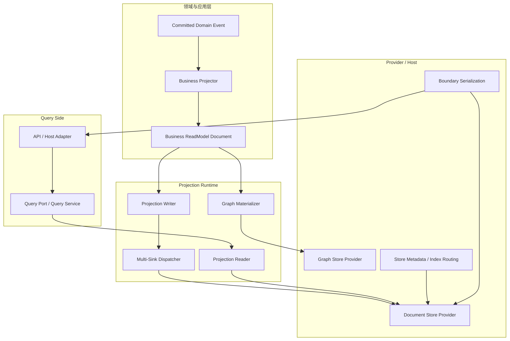
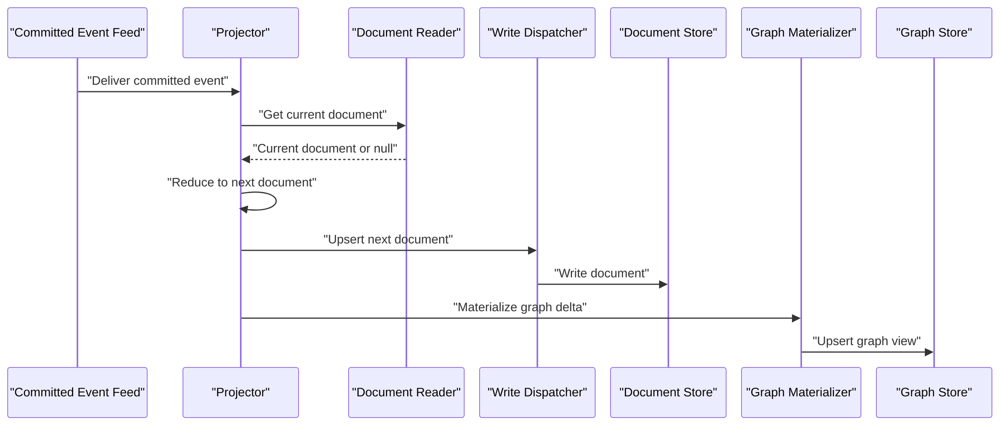
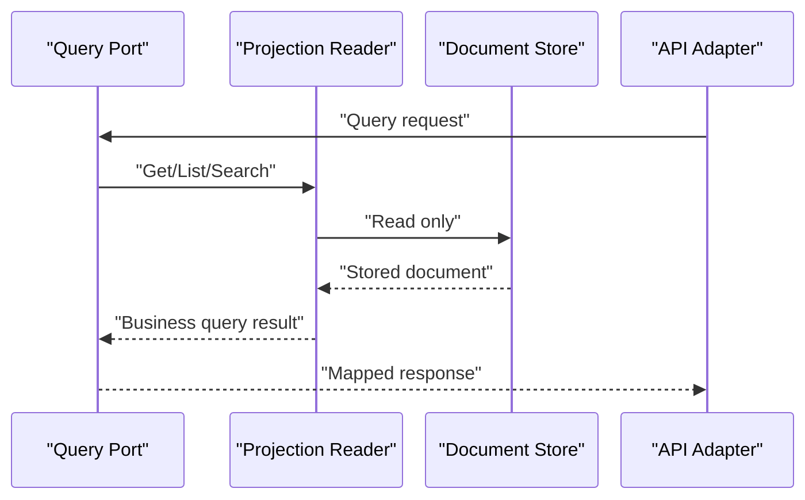

# ReadModel 系统最佳实践重构蓝图（2026-03-15）

## 1. 文档定位

- 状态：`Proposed`
- 版本：`R1`
- 日期：`2026-03-15`
- 范围：
  - `src/Aevatar.CQRS.Projection.Stores.Abstractions`
  - `src/Aevatar.CQRS.Projection.Runtime.Abstractions`
  - `src/Aevatar.CQRS.Projection.Runtime`
  - `src/Aevatar.CQRS.Projection.Providers.*`
  - `src/Aevatar.CQRS.Projection.StateMirror`
  - `src/Aevatar.Foundation.Projection`
  - `src/Aevatar.AI.Projection`
  - `src/Aevatar.Scripting.Projection`
  - `src/workflow/Aevatar.Workflow.Projection`
  - `demos/Aevatar.Demos.CaseProjection`
- 关联文档：
  - `docs/architecture/2026-03-15-readmodel-system-refactor-detailed-design.md`
  - `docs/architecture/2026-03-15-cqrs-projection-readmodels-architecture.md`

本文不是现状说明，而是从整体架构和最佳实践出发，给出 `ReadModel` 系统的目标形态、删减原则、接口收缩方案和分阶段改造路线。

本文默认遵守仓库现有最高优先级规则：

- 严格读写分离
- Projection 只消费 committed 事实
- 内核强类型
- 删除优于兼容
- provider 细节不得反向污染业务模型

## 2. 执行摘要

当前 `ReadModel` 系统的主要问题，不是单个类名不好，也不是某一个 provider 实现粗糙，而是整个系统长期把以下几层职责揉在了一起：

- 业务查询事实
- projection 运行戳
- store schema 与路由
- graph 物化结果
- query/API 展示包装

在这个前提下，系统又叠加了多层没有新增语义的接口，最终形成了三个后果：

1. 抽象面变宽，但核心语义并没有变清楚。
2. 业务 `ReadModel` 持续承担本不属于自己的 provider/runtime 责任。
3. 本地 provider、生产 provider、业务 query 和调试快照之间的边界持续互相渗透。

本次重构建议只做一件事：

把 `ReadModel` 系统收敛成“一套最小核心契约 + 明确的 provider 边界 + 可选的 graph 派生扩展”，其余别名接口、幽灵泛型、服务定位器包装层和实例级 schema 泄漏全部删除。

## 3. 当前架构诊断

### 3.1 当前问题的本质

当前系统最大的结构性问题不是“接口多”，而是“接口多但职责不窄”。

一个 `ReadModel` 相关对象现在可能同时承担：

- document 实体
- projection checkpoint 快照
- Elasticsearch 索引配置承载体
- graph 物化输入
- query DTO
- debug/observability 输出

这违反了单一职责，也违反了仓库自己的“数据语义分层”和“API 字段单一语义”要求。

### 3.2 当前系统的主要架构问题

#### 3.2.1 抽象重复和空转接口

当前至少有几组接口只是在重复转述，没有新增语义：

- `IProjectionStoreDispatcher<TReadModel, TKey>` 只是 `IProjectionWriteDispatcher<TReadModel, TKey>` 的别名。
- `IProjectionDocumentStore<TReadModel, TKey>` 只是 `Reader + Writer` 的组合别名。
- `IProjectionStoreBindingAvailability` 只是把 binding 自身的可用性拆成了一个额外接口。
- `IProjectionDocumentMetadataResolver` 只是对 `IProjectionDocumentMetadataProvider<T>` 的服务定位器包装。

这类接口的问题不是“有点多”，而是：

- 阅读成本高
- 泛型层级变深
- DI 注册更复杂
- 调用方更难看清真正边界

#### 3.2.2 写路径存在幽灵泛型

当前写路径大量保留 `TKey`：

- `IProjectionWriteDispatcher<TReadModel, TKey>`
- `IProjectionStoreBinding<TReadModel, TKey>`
- `IProjectionStoreDispatchCompensator<TReadModel, TKey>`

但实际写操作只有：

- `UpsertAsync(readModel)`

`ProjectionStoreDispatcher` 自己在补偿上下文里传入的 `Key` 也是 `default`。这说明写链路上的 `TKey` 不是必需语义，而是历史残留。

#### 3.2.3 业务文档和存储 schema 混在一起

`DocumentIndexMetadata` 这类对象描述的是：

- index name
- mappings
- settings
- aliases

这是 provider/store schema 语义，不是业务 document 事实。

如果一个 `ReadModel` 实例反向暴露这类信息，系统就会出现“被存的数据同时决定怎么存”的边界反转。

#### 3.2.4 graph 派生逻辑仍然容易回流到 read model

即使已经开始把 graph 物化从业务模型里拆出来，整个系统仍然保留着“read model 既是 canonical document，又是 graph source”的强习惯。

这会导致：

- 领域模型变重
- graph 生命周期和 document 生命周期强耦合
- graph 的 provider 差异污染到 canonical model

#### 3.2.5 projection stamp 和业务事实没有稳定分层

`StateVersion / LastEventId / CreatedAt / UpdatedAt` 这类字段，在简单模型里与业务字段并存没有问题。

问题在于当前系统没有清晰定义：

- 什么是业务事实
- 什么是 projection 运行戳
- 默认 query 是否应该暴露这些运行戳

于是模块会自然把它们混进同一个对象，并一路暴露到 query DTO。

#### 3.2.6 JSON 仍然被当作内部兜底机制

当前 `InMemory` provider 仍使用 JSON 作为 clone fallback，这说明内部 canonical 语义还没有完全转向 protobuf-first。

从最佳实践看：

- 外部协议边界用 JSON 是合理的
- Elasticsearch `_doc` HTTP 边界用 JSON 也是合理的
- 但内部 clone、内部状态镜像、内部持久态兜底不应该继续依赖 JSON

#### 3.2.7 Query 能力过弱，但又通过别的抽象补洞

当前 document query 基本只有：

- `GetAsync`
- `ListAsync(int take)`

这太弱，无法表达：

- filter
- cursor
- continuation
- sort
- consistency

结果系统一方面把 query contract 设计得过窄，另一方面又在上层加各种 query reader、query service、snapshot mapper 进行补偿，形成新的冗余层。

#### 3.2.8 StateMirror 仍是 JSON 反射式镜像

`StateMirror` 当前通过 JSON 节点反射把状态复制成 `ReadModel`。

这不是稳定的内核能力，而是开发便利性工具。把它放在核心 `ReadModel` 主线里，会造成两个误导：

- 让系统默认接受弱类型镜像
- 让 protobuf-first 目标被一个通用 JSON 镜像器持续破坏

#### 3.2.9 Workflow 和 Scripting 仍有语义层混叠

这不只是基础设施问题。

在业务层：

- `workflow` 的 read model 仍混合业务事实、projection stamp、timeline、debug/graph 输入
- `scripting` 的 semantic/native 两类 read model 仍携带较强的 provider/query 包装痕迹

所以这轮重构不能只停在 stores/runtime 抽象层，最终必须回到领域 read model 语义本身。

## 4. 最佳实践目标

### 4.1 目标一句话

`ReadModel` 系统应当收敛成：

- 一个最小业务文档契约
- 一套窄而明确的读写接口
- 一个 runtime 内部用的多 sink 分发层
- 一个可选的 graph 派生层
- 一组只留在 provider/host 的存储配置

### 4.2 目标原则

#### 4.2.1 业务文档优先

`ReadModel` 首先是业务 document，而不是 provider 适配器、调试快照或图节点集合。

#### 4.2.2 逻辑分层，物理可扁平

系统要区分：

- 业务事实
- projection stamp
- store schema

但不强制每个 document 都拆成 `Data / Stamp / Store` 三段式包装。

简单 document 可以一张表扁平落盘。

#### 4.2.3 provider 边界前移

索引名、mapping、settings、动态分区、HTTP JSON 编解码，都应留在 provider/host 层，不应回流到业务 `ReadModel`。

#### 4.2.4 graph 是派生视图，不是 canonical 文档本体

graph 属于 read-side 的附加投影视图。

它可以和 document 来自同一 committed 事实流，但不能要求业务 document 本体直接承担 graph provider 语义。

#### 4.2.5 内部 protobuf-first，外部边界可 JSON

内部 read model、状态、事件、clone、快照应优先 protobuf。

只有以下边界允许保留 JSON：

- HTTP API
- Elasticsearch document HTTP 协议
- 第三方 SDK/协议适配

#### 4.2.6 删掉没有新增语义的接口

如果一个接口只是：

- 别名
- 包装层
- 服务定位器壳
- 幽灵泛型延伸

就直接删除，不保留兼容层。

## 5. 目标架构

### 5.1 总体分层图



### 5.2 写入时序图



### 5.3 查询时序图



查询链路里禁止：

- 补投影
- 重放 event store
- 同步刷新 read model
- 临时拼装 snapshot 再返回

## 6. 目标接口收缩

### 6.1 保留的核心接口

建议长期保留以下最小集合：

| 接口 | 是否保留 | 原因 |
| --- | --- | --- |
| `IProjectionReadModel` | 保留 | 作为业务 document 的最小身份契约 |
| `IProjectionDocumentReader<TReadModel, TKey>` | 保留 | 明确读侧边界 |
| `IProjectionDocumentWriter<TReadModel>` | 保留 | 明确写侧边界 |
| `IProjectionReadModelCloneable<TReadModel>` | 过渡保留 | 在完全 protobuf-first 之前，明确 clone 能力 |
| `IProjectionGraphMaterializer<TReadModel>` | 保留 | graph 作为可选派生能力 |
| `IProjectionGraphStore` | 保留 | graph provider 的边界契约 |
| `IProjectionDocumentMetadataProvider<TReadModel>` | 收紧后保留 | 类型级 store schema/provider metadata 仍然需要 |

### 6.2 删除或并入的接口

| 接口/类型 | 处理方式 | 原因 |
| --- | --- | --- |
| `IProjectionStoreDispatcher<TReadModel, TKey>` | 删除 | 与 `IProjectionWriteDispatcher` 同义 |
| `IProjectionWriteDispatcher<TReadModel, TKey>` | 改为 `IProjectionWriteDispatcher<TReadModel>` | 写路径不需要 `TKey` |
| `IProjectionStoreBinding<TReadModel, TKey>` | 改为 runtime 内部 `IProjectionWriteSink<TReadModel>` | 只表达写 sink，不需要 key |
| `IProjectionStoreBindingAvailability` | 删除并入 sink | 可用性应内聚在 sink 自身 |
| `IProjectionDocumentStore<TReadModel, TKey>` | 从应用层依赖中移除 | 重新耦合读写，不利于分层 |
| `IProjectionDocumentMetadataResolver` | 删除 | 只是 provider 的服务定位包装 |
| `ProjectionReadModelBase<TKey>` | 删除 | 把 projection stamp 固化成了错误基类 |

### 6.3 推荐的目标契约

推荐最终收敛到如下结构：

```csharp
public interface IProjectionReadModel
{
    string Id { get; }
}

public interface IProjectionDocumentReader<TReadModel, in TKey>
    where TReadModel : class, IProjectionReadModel
{
    Task<TReadModel?> GetAsync(TKey key, CancellationToken ct = default);
    Task<IReadOnlyList<TReadModel>> ListAsync(int take = 50, CancellationToken ct = default);
}

public interface IProjectionDocumentWriter<in TReadModel>
    where TReadModel : class, IProjectionReadModel
{
    Task UpsertAsync(TReadModel readModel, CancellationToken ct = default);
}

public interface IProjectionWriteDispatcher<in TReadModel>
    where TReadModel : class, IProjectionReadModel
{
    Task UpsertAsync(TReadModel readModel, CancellationToken ct = default);
}

internal interface IProjectionWriteSink<in TReadModel>
    where TReadModel : class, IProjectionReadModel
{
    string SinkName { get; }
    bool IsEnabled { get; }
    string DisabledReason { get; }
    Task UpsertAsync(TReadModel readModel, CancellationToken ct = default);
}
```

关键变化是：

- 应用层只知道 `Reader / Writer`
- runtime 内部才知道 `Dispatcher / Sink`
- provider metadata 不再需要 resolver 包装层
- 写路径泛型不再携带无效 `TKey`

## 7. 数据模型原则

### 7.1 `ReadModel` 的合法职责

一个业务 `ReadModel` 允许包含：

- 业务事实字段
- projection stamp 字段

一个业务 `ReadModel` 不允许包含：

- index mappings
- settings
- aliases
- provider route policy
- graph provider 控制信息

### 7.2 projection stamp 的位置

最佳实践不是强制所有模型都拆成包装体，而是：

- 简单 document：业务字段和 stamp 可以同 document 扁平并存
- 复杂 document：才显式拆 `Data / Stamp`

例如：

- `CaseProjectionReadModel` 这类简单文档，没有必要再包一层
- `WorkflowExecutionReport` 这类重模型，最终应拆清业务事实和调试/运行戳

### 7.3 Query DTO 和 persisted document 必须分开

persisted document 是存储权威载体。

query DTO 是对外视图。

两者可以同构，但不能默认绑定成同一个类型，否则很容易把：

- projection stamp
- 调试字段
- 展示分组字段

一路暴露到外部 API。

## 8. 序列化与 provider 边界

### 8.1 总体原则

内部语义优先 protobuf。

外部边界可以 JSON。

### 8.2 允许保留 JSON 的地方

- Elasticsearch document HTTP 协议
- Host/API JSON 输出
- 第三方协议适配层

### 8.3 应删除的 JSON 依赖

- `InMemory` provider 的 JSON clone fallback
- 以 JSON 节点镜像内部状态的核心路径
- 为内部 `ReadModel` 兜底的弱类型 JSON 复制逻辑

### 8.4 对 `IMessage` 的架构结论

不建议把 `IProjectionReadModel` 直接改成 `IMessage`。

原因不是 protobuf 不好，而是：

- `ReadModel` 是业务存储抽象，不应被 protobuf 生成模型强绑
- 不是所有 read model 都必须由 proto 直接生成
- Elasticsearch 边界上的 JSON 仍然存在

正确方向是：

- read model 默认 protobuf-first
- 但 `IProjectionReadModel` 仍保持存储抽象最小化
- clone/serialization 策略按能力收紧，而不是让最顶层接口继承 `IMessage`

## 9. 各子系统改造建议

### 9.1 Stores.Abstractions

目标：

- 收缩成最小业务文档契约
- 删除所有不新增语义的壳

动作：

- 删除 `IProjectionDocumentStore<TReadModel, TKey>` 在应用层的主入口角色
- 删除 `ProjectionReadModelBase<TKey>`
- 保留 `IProjectionDocumentReader`
- 保留 `IProjectionDocumentWriter`
- 保留 `IProjectionReadModel`
- 过渡保留 `IProjectionReadModelCloneable<T>`

### 9.2 Runtime.Abstractions 和 Runtime

目标：

- runtime 只做多 sink 写入编排
- 不再暴露同义接口和幽灵泛型

动作：

- 删除 `IProjectionStoreDispatcher<TReadModel, TKey>`
- `IProjectionWriteDispatcher<TReadModel, TKey>` 改成无 `TKey`
- `IProjectionStoreBinding<TReadModel, TKey>` 改成 runtime 内部 sink 抽象
- 删除 `IProjectionStoreBindingAvailability`
- 删除 `IProjectionDocumentMetadataResolver`
- 保留补偿机制，但上下文只保留真实有效字段

### 9.3 InMemory Provider

目标：

- 成为开发/测试下的语义正确 provider
- 不再依赖 JSON clone 兜底

动作：

- 优先依赖 protobuf `Clone()` 或显式 `DeepClone()`
- 无 clone 能力时直接失败，不再静默 JSON roundtrip
- 保证读写隔离语义和生产 provider 尽量一致

### 9.4 Elasticsearch Provider

目标：

- 保持 ES 文档边界的 JSON 协议
- 但不让 ES 语义回流到 `ReadModel`

动作：

- `ReadModel` 不再暴露 schema/mappings/settings
- 动态分区只保留在 provider/host 配置
- provider 自己负责 index metadata、scope 路由和 JSON 编解码
- query contract 后续补齐 search/filter/cursor 能力，而不是逼业务层绕开 provider

### 9.5 StateMirror

目标：

- 从核心 `ReadModel` 主线降级为辅助能力

动作：

- `JsonStateMirrorProjection` 保留在显式 opt-in 的辅助层
- 不再把 JSON 镜像视为核心 readmodel 基础设施
- 能 typed 就 typed，不能 typed 再显式使用 state mirror

### 9.6 AI Projection

目标：

- 保留 `timeline / role replies` 作为明确能力扩展
- 但避免把这类 mixin 扩散成基础 `ReadModel` 假设

动作：

- 保留 `IHasProjectionTimeline / IHasProjectionRoleReplies`
- 将其明确定位为 AI/workflow 风格事件投影能力，不上升为通用 `ReadModel` 基类语义

### 9.7 Workflow

目标：

- 从“运行报表模型”收敛成“业务 document + 可选调试视图 + graph 派生”

动作：

- 拆清 `WorkflowExecutionReport` 中的业务事实与 projection/debug 运行戳
- 逐步消除 `RequestParameters / CompletionAnnotations / Timeline.Data` 的弱类型稳定语义
- graph 继续留在 materializer，不回流到 document
- query 默认返回业务快照，调试字段走显式 debug/query 端口

### 9.8 Scripting

目标：

- 继续向 protobuf-first 靠拢
- 彻底删掉实例级 schema 泄漏和 JSON 主链依赖

动作：

- semantic/native read model 保持强类型 proto-first
- `DocumentIndexMetadata` 只留在 provider/host 注册
- native document 的动态索引路由只保留 provider 配置项
- query 返回业务语义，不把 provider/stamp 包装一路带出

### 9.9 Demo

目标：

- demo 展示最小正确模型，而不是旧抽象的遗留样板

动作：

- `CaseProjection` 改成只依赖 `Reader / Writer`
- 不再直接把 `IProjectionDocumentStore` 当示例主入口

## 10. 分阶段实施计划

### Phase 1：接口瘦身

- 删除 `IProjectionStoreDispatcher`
- 删除 `IProjectionStoreBindingAvailability`
- 删除 `IProjectionDocumentMetadataResolver`
- 将 `IProjectionWriteDispatcher` 去掉 `TKey`
- 将 runtime binding 改成内部 sink 模型

验收标准：

- Runtime DI 仍能装配
- workflow/scripting/state-mirror 全部迁移
- 不再存在“写路径泛型带 `TKey` 但从不使用”的情况

### Phase 2：读写边界收紧

- 从应用层移除 `IProjectionDocumentStore`
- 业务模块只注入 `Reader` 或 `Writer`
- demo 和测试同步改造

验收标准：

- 业务 projector/query port 不再依赖组合 store 接口
- 编译期无法再误用“一个接口读写全做”

### Phase 3：序列化收紧

- 移除 `InMemory` JSON clone fallback
- 将 state mirror 从默认路径降为辅助路径
- 明确区分内部 protobuf 和外部 JSON 边界

验收标准：

- 内部 readmodel clone 不再依赖 `System.Text.Json`
- JSON 仅保留在明确边界

### Phase 4：业务文档语义清理

- workflow 清理 stamp/bag/debug 混叠
- scripting 清理 query/provider 包装痕迹
- query DTO 与 persisted document 分层

验收标准：

- 核心业务 query 不再默认暴露 projection stamp
- bag 中稳定语义逐步 typed 化

### Phase 5：查询能力升级

- 为 provider 增加正式 query 语义
- 引入 filter/cursor/sort 等必要能力
- 逐步减少上层 query facade 的补偿性样板

验收标准：

- 常见业务 query 不再需要“query service + mapper + wrapper”补洞

## 11. 删除清单

这轮重构建议明确删除以下对象或其主入口角色：

- `IProjectionStoreDispatcher<TReadModel, TKey>`
- `IProjectionDocumentStore<TReadModel, TKey>` 作为应用层依赖
- `IProjectionStoreBindingAvailability`
- `IProjectionDocumentMetadataResolver`
- `ProjectionReadModelBase<TKey>`
- `InMemory` provider 的 JSON clone fallback

以下对象保留，但要重新定位：

- `IProjectionReadModelCloneable<TReadModel>`
- `IHasProjectionTimeline`
- `IHasProjectionRoleReplies`
- `DocumentIndexMetadata`
- `IProjectionDocumentMetadataProvider<TReadModel>`

## 12. 风险与约束

### 12.1 不需要兼容旧接口

本仓库当前明确支持“删除优于兼容”，因此：

- 不保留空转发兼容层
- 不引入 obsolete 过渡壳
- 不同时维护新旧双轨

### 12.2 需要警惕的误区

- 不要把“逻辑分层”误解成“所有 document 都必须包装成三段式”
- 不要把“protobuf-first”误解成“所有 `ReadModel` 基接口都必须继承 `IMessage`”
- 不要把“query contract 太弱”误解成“再加更多 service/facade 包一层”
- 不要把“graph 是派生视图”误解成“graph 一定要和 document 同步强一致提交”

## 13. 门禁与验收

完成本蓝图后，至少应满足以下门禁：

- `dotnet build aevatar.slnx --nologo`
- `dotnet test aevatar.slnx --nologo`
- `bash tools/ci/architecture_guards.sh`
- `bash tools/ci/solution_split_guards.sh`
- `bash tools/ci/solution_split_test_guards.sh`

新增的静态治理建议：

- 禁止业务层直接依赖 `IProjectionDocumentStore<,>`
- 禁止新增 `IProjectionStoreDispatcher<,>` 风格同义接口
- 禁止写路径接口新增未使用的 `TKey`
- 禁止 `ReadModel` 实例暴露 `Mappings / Settings / Aliases / DocumentMetadata`
- 禁止 `InMemory` provider 使用 JSON 作为 readmodel clone fallback

## 14. 最终结论

从架构最佳实践看，`ReadModel` 系统现在最需要的不是再增加一层抽象，而是主动删掉失真抽象，把系统收敛到真正稳定的边界：

- `ReadModel` 是业务 document
- `Reader / Writer` 是读写边界
- `Dispatcher / Sink` 是 runtime 内部写入编排
- `Graph Materializer` 是派生视图扩展
- `DocumentMetadata` 是 provider/host 的存储配置

其余职责都应从核心模型中退出。

如果按这个蓝图执行，`ReadModel` 系统会从“抽象多但语义混”回到“抽象少但边界清”，后续无论继续推进 protobuf-first、workflow typed 化，还是完善 Elasticsearch 查询能力，都会容易很多。
